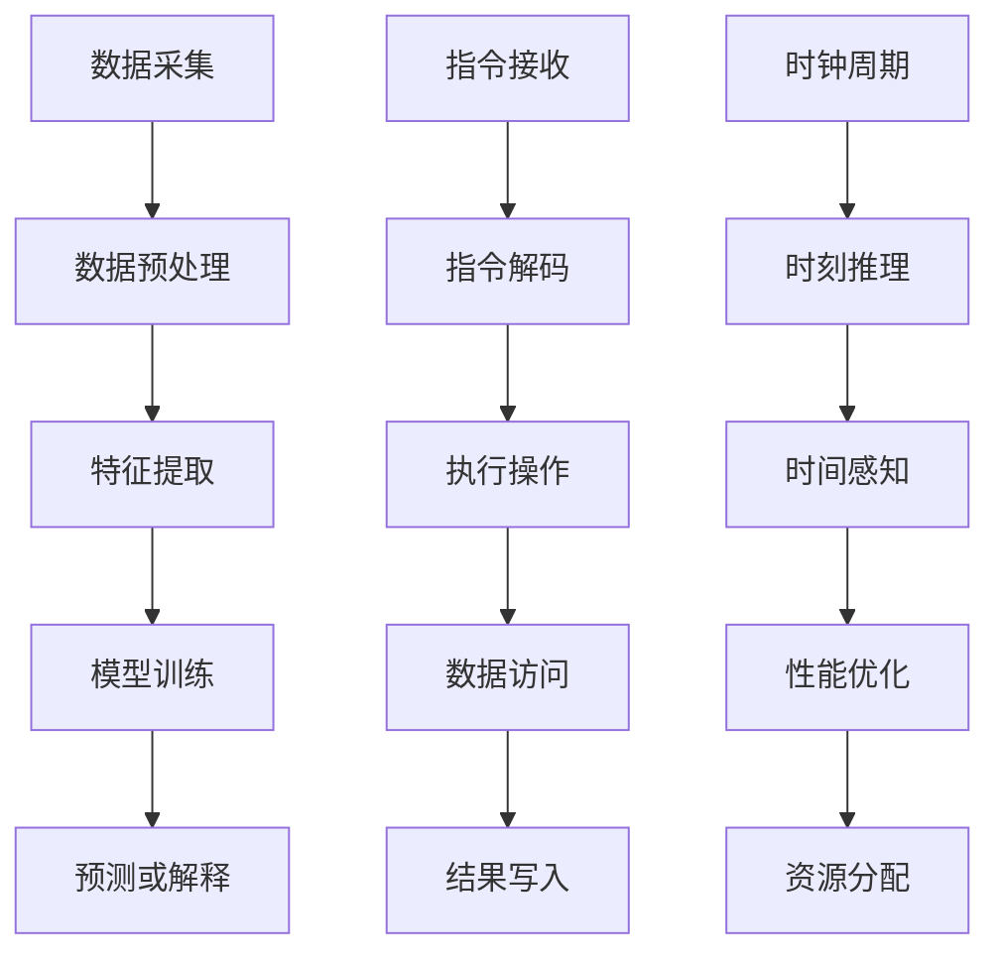

                 

关键词：时刻推理、时钟周期、LLM、CPU、技术差异、算法原理、数学模型、项目实践、应用场景、发展趋势与挑战

> 摘要：本文将深入探讨时刻推理与时钟周期之间的差异，重点分析大型语言模型（LLM）与CPU在计算方式、性能表现以及应用领域的根本区别。通过对算法原理、数学模型的详细解析，结合项目实践和实际应用场景，我们将揭示LLM与CPU在技术发展和未来挑战中的不同路径。

## 1. 背景介绍

随着信息技术的迅猛发展，人工智能（AI）已经渗透到我们日常生活的方方面面。特别是在自然语言处理（NLP）领域，大型语言模型（LLM）如BERT、GPT系列等取得了显著的成果，展示了强大的语言理解和生成能力。与此同时，CPU作为计算机系统的核心部件，其性能不断提升，为各类计算任务提供了强有力的支持。

本文旨在揭示时刻推理与时钟周期在计算中的关键差异，并深入分析LLM与CPU在计算方式、性能表现和应用领域的根本区别。通过本文的探讨，我们将对LLM和CPU的技术发展有更深入的理解，为未来的研究和应用提供有益的参考。

### 1.1 时刻推理的概念

时刻推理是一种基于时间的推理方法，它通过对时间序列数据的分析，提取时间特征，进而对事件或行为进行预测或解释。在AI领域，时刻推理广泛应用于时间序列预测、事件检测和序列建模等领域。例如，在金融市场分析中，通过分析历史交易数据，可以预测未来股价的走势；在智能交通系统中，通过分析交通流量数据，可以预测交通拥堵的发生。

### 1.2 时钟周期的概念

时钟周期是指CPU在执行指令时，从接收指令到完成指令所需的时间。时钟周期是CPU性能的重要指标之一，它决定了CPU的运算速度。在现代计算机系统中，时钟周期通常以毫秒或微秒计量。例如，一个CPU的时钟周期为1微秒，意味着它每秒钟可以执行1亿个指令。

### 1.3 LLM与CPU的关系

LLM和CPU在人工智能和计算机系统领域都有着重要的地位。LLM作为一种先进的语言处理模型，它在自然语言理解、文本生成、问答系统等方面具有强大的能力。而CPU作为计算机系统的核心，它负责执行各种计算任务，包括LLM的推理和训练。因此，LLM和CPU之间的关系密不可分，它们共同推动了人工智能和计算机系统的发展。

## 2. 核心概念与联系

在深入探讨时刻推理和时钟周期之前，我们首先需要明确一些核心概念，并建立它们之间的联系。

### 2.1 时刻推理的原理

时刻推理的核心在于对时间序列数据的分析。时间序列数据通常包含多个时间点上的数据值，通过对这些数据进行处理和分析，可以提取出时间特征，进而对事件或行为进行预测或解释。具体而言，时刻推理的原理包括以下几个步骤：

1. 数据采集：收集时间序列数据，如股票价格、交通流量、天气数据等。
2. 数据预处理：对数据进行清洗、归一化等处理，以便于后续分析。
3. 特征提取：通过对时间序列数据进行傅里叶变换、小波变换等方法，提取出时间特征。
4. 模型训练：使用机器学习算法，如线性回归、神经网络等，对提取出的时间特征进行训练，建立模型。
5. 预测或解释：使用训练好的模型，对新的时间序列数据进行预测或解释。

### 2.2 时钟周期的原理

时钟周期是CPU在执行指令时，从接收指令到完成指令所需的时间。时钟周期的原理包括以下几个步骤：

1. 指令接收：CPU接收指令，将其存储在指令缓存中。
2. 指令解码：CPU对指令进行解码，确定指令的操作类型和操作数。
3. 执行操作：CPU执行指令，如加法、乘法、逻辑运算等。
4. 数据访问：CPU访问内存或寄存器，获取或存储操作数。
5. 结果写入：CPU将执行结果写入内存或寄存器。

### 2.3 时刻推理与时钟周期的联系

时刻推理和时钟周期在计算过程中都有着重要的作用。时刻推理通过分析时间序列数据，实现对事件或行为的预测或解释；而时钟周期决定了CPU的运算速度，影响整个计算过程的效率。具体而言，时刻推理与时钟周期的联系包括：

1. 时间感知：时刻推理需要对时间序列数据进行处理和分析，而时钟周期提供了时间感知的基础。
2. 性能优化：为了提高计算效率，需要优化时刻推理和时钟周期之间的配合。例如，在LLM的推理过程中，可以通过优化时钟周期，减少计算延迟。
3. 资源分配：在计算机系统中，需要合理分配资源和时间，以满足时刻推理和时钟周期的需求。例如，在处理大量时间序列数据时，需要根据数据量和处理速度，合理分配CPU和GPU的资源。

### 2.4 Mermaid 流程图

为了更直观地展示时刻推理和时钟周期的原理和联系，我们使用Mermaid流程图来描述它们的基本流程。



在这个流程图中，时刻推理和时钟周期分别代表了数据分析和指令执行的两个主要过程。通过合理优化和资源分配，可以最大限度地发挥两者的优势，提高计算效率和性能。

## 3. 核心算法原理 & 具体操作步骤

### 3.1 算法原理概述

时刻推理和时钟周期在不同的计算任务中扮演着不同的角色。在时刻推理中，算法原理主要涉及时间序列数据的处理和分析，包括数据采集、预处理、特征提取、模型训练和预测或解释等步骤。而在时钟周期中，算法原理主要涉及CPU指令的接收、解码、执行、数据访问和结果写入等步骤。

具体而言，时刻推理的算法原理如下：

1. 数据采集：从各种来源收集时间序列数据，如传感器数据、日志数据、金融数据等。
2. 数据预处理：对采集到的数据进行清洗、归一化等处理，以消除噪声和异常值。
3. 特征提取：使用傅里叶变换、小波变换等方法，从预处理后的数据中提取时间特征，如频率、趋势、周期等。
4. 模型训练：使用机器学习算法，如线性回归、神经网络等，对提取出的时间特征进行训练，建立模型。
5. 预测或解释：使用训练好的模型，对新的时间序列数据进行预测或解释，实现对事件或行为的预测或解释。

时钟周期的算法原理如下：

1. 指令接收：CPU从指令缓存中接收指令，并将其存储在指令队列中。
2. 指令解码：CPU对指令进行解码，确定指令的操作类型和操作数。
3. 执行操作：CPU执行指令，如加法、乘法、逻辑运算等，并根据指令类型进行相应的计算。
4. 数据访问：CPU访问内存或寄存器，获取或存储操作数。
5. 结果写入：CPU将执行结果写入内存或寄存器，并将指令队列中的下一条指令读取到指令队列中。

### 3.2 算法步骤详解

在具体操作步骤中，时刻推理和时钟周期的算法步骤有所不同。

#### 3.2.1 时刻推理的具体操作步骤

1. 数据采集：从传感器、数据库、网络等来源收集时间序列数据，如温度、湿度、股票价格、交通流量等。
2. 数据预处理：对采集到的数据进行清洗，去除噪声和异常值。例如，对温度数据，可以去除超出正常范围的异常值；对股票价格数据，可以去除成交量极低的交易数据。
3. 特征提取：使用傅里叶变换、小波变换等方法，从预处理后的数据中提取时间特征。例如，对于股票价格数据，可以提取出频率特征、趋势特征和周期特征。
4. 模型训练：使用机器学习算法，如线性回归、神经网络等，对提取出的时间特征进行训练，建立模型。例如，可以使用线性回归模型预测下一时间点的股票价格。
5. 预测或解释：使用训练好的模型，对新的时间序列数据进行预测或解释。例如，使用训练好的股票价格预测模型，预测未来几天的股票价格。

#### 3.2.2 时钟周期的具体操作步骤

1. 指令接收：CPU从指令缓存中接收指令，并将其存储在指令队列中。
2. 指令解码：CPU对指令进行解码，确定指令的操作类型和操作数。例如，对于加法指令，CPU会确定加法的操作数和结果存储地址。
3. 执行操作：CPU执行指令，如加法、乘法、逻辑运算等。例如，对于加法指令，CPU会将两个操作数相加，并将结果存储在指定的内存地址中。
4. 数据访问：CPU访问内存或寄存器，获取或存储操作数。例如，对于加法指令，CPU需要访问内存或寄存器，获取两个操作数。
5. 结果写入：CPU将执行结果写入内存或寄存器，并将指令队列中的下一条指令读取到指令队列中。

### 3.3 算法优缺点

#### 3.3.1 时刻推理的优点

1. 强大的时间感知能力：时刻推理通过分析时间序列数据，可以提取出时间特征，实现对事件或行为的预测或解释，具有很强的时间感知能力。
2. 广泛的应用领域：时刻推理广泛应用于金融市场分析、智能交通系统、天气预测、医疗诊断等领域，具有广泛的应用前景。

#### 3.3.2 时刻推理的缺点

1. 高计算复杂度：时刻推理需要对大量时间序列数据进行处理和分析，计算复杂度较高，可能需要大量计算资源和时间。
2. 数据质量依赖性：时刻推理的性能高度依赖于数据质量，如果数据存在噪声、异常值等问题，可能会导致预测或解释的准确性降低。

#### 3.3.3 时钟周期的优点

1. 高运算速度：时钟周期是CPU的性能指标之一，现代CPU的时钟周期已经非常短，可以在短时间内完成大量指令的执行，具有很高的运算速度。
2. 灵活的指令集：CPU支持丰富的指令集，可以执行各种计算任务，包括数学运算、逻辑运算、数据传输等，具有很高的灵活性。

#### 3.3.4 时钟周期的缺点

1. 能耗问题：随着CPU性能的提升，其能耗也在不断增加。高能耗可能会导致计算机系统过热，影响系统的稳定性和寿命。
2. 指令级并行受限：CPU的指令级并行性受到一定的限制，如果指令之间存在依赖关系，可能会降低CPU的运算速度。

### 3.4 算法应用领域

#### 3.4.1 时刻推理的应用领域

1. 金融市场分析：通过分析历史交易数据，可以预测未来股价的走势，为投资决策提供支持。
2. 智能交通系统：通过分析交通流量数据，可以预测交通拥堵的发生，为交通管理和调度提供支持。
3. 天气预测：通过分析气象数据，可以预测天气变化，为气象预报和自然灾害预警提供支持。
4. 医疗诊断：通过分析医疗数据，可以预测疾病的发生和发展，为疾病诊断和治疗提供支持。

#### 3.4.2 时钟周期的应用领域

1. 高性能计算：在科学计算、工程设计等领域，需要执行大量的数学运算，时钟周期的高运算速度可以提供强大的计算能力。
2. 游戏和图形渲染：在游戏和图形渲染中，需要处理大量的图像数据，时钟周期可以提供高效的图像处理能力。
3. 通信和网络：在通信和网络中，需要处理大量的数据传输，时钟周期可以提供高效的数据传输和处理能力。
4. 自动驾驶和机器人：在自动驾驶和机器人领域，需要实时处理传感器数据和执行控制指令，时钟周期可以提供高效的响应和控制能力。

## 4. 数学模型和公式 & 详细讲解 & 举例说明

### 4.1 数学模型构建

在时刻推理中，常用的数学模型包括时间序列模型、概率模型和神经网络模型。下面我们将分别介绍这三种模型的构建过程。

#### 4.1.1 时间序列模型

时间序列模型是一种基于统计方法的数学模型，用于分析时间序列数据的规律和趋势。常见的时间序列模型包括ARIMA模型、自回归模型、移动平均模型等。

1. **ARIMA模型**：

ARIMA模型由三个部分组成：自回归（AR）、差分（I）和移动平均（MA）。其数学模型可以表示为：

$$
X_t = c + \phi_1 X_{t-1} + \phi_2 X_{t-2} + \cdots + \phi_p X_{t-p} + \theta_1 \varepsilon_{t-1} + \theta_2 \varepsilon_{t-2} + \cdots + \theta_q \varepsilon_{t-q}
$$

其中，$X_t$表示时间序列数据，$c$为常数项，$\phi_1, \phi_2, \cdots, \phi_p$为自回归系数，$\theta_1, \theta_2, \cdots, \theta_q$为移动平均系数，$\varepsilon_t$为白噪声。

2. **自回归模型**：

自回归模型只包含自回归部分，其数学模型可以表示为：

$$
X_t = c + \phi_1 X_{t-1} + \phi_2 X_{t-2} + \cdots + \phi_p X_{t-p}
$$

3. **移动平均模型**：

移动平均模型只包含移动平均部分，其数学模型可以表示为：

$$
X_t = c + \theta_1 \varepsilon_{t-1} + \theta_2 \varepsilon_{t-2} + \cdots + \theta_q \varepsilon_{t-q}
$$

#### 4.1.2 概率模型

概率模型基于概率论和统计学，用于分析时间序列数据的概率分布和预测。常见的概率模型包括马尔可夫链、隐马尔可夫模型（HMM）等。

1. **马尔可夫链**：

马尔可夫链是一种离散时间序列模型，其数学模型可以表示为：

$$
P(X_t = x_t | X_{t-1} = x_{t-1}, X_{t-2} = x_{t-2}, \cdots) = P(X_t = x_t | X_{t-1} = x_{t-1})
$$

其中，$X_t$表示时间序列数据，$P$表示概率。

2. **隐马尔可夫模型**：

隐马尔可夫模型（HMM）是一种用于分析包含隐藏状态的离散时间序列模型。其数学模型可以表示为：

$$
P(X_t = x_t | H_t = h_t) = P(X_t | H_t)
$$

其中，$X_t$表示观测序列，$H_t$表示隐藏状态。

#### 4.1.3 神经网络模型

神经网络模型是一种基于人工神经网络的数学模型，用于分析时间序列数据。常见的神经网络模型包括循环神经网络（RNN）、长短期记忆网络（LSTM）、门控循环单元（GRU）等。

1. **循环神经网络**：

循环神经网络（RNN）是一种用于处理序列数据的神经网络模型。其数学模型可以表示为：

$$
h_t = \sigma(W_h h_{t-1} + W_x x_t + b_h)
$$

其中，$h_t$表示隐藏状态，$x_t$表示输入序列，$\sigma$为激活函数。

2. **长短期记忆网络**：

长短期记忆网络（LSTM）是一种改进的循环神经网络，用于处理长时间序列数据。其数学模型可以表示为：

$$
i_t = \sigma(W_i x_t + U_h h_{t-1} + b_i)
$$

$$
f_t = \sigma(W_f x_t + U_h h_{t-1} + b_f)
$$

$$
o_t = \sigma(W_o x_t + U_h h_{t-1} + b_o)
$$

$$
c_t = f_t \odot c_{t-1} + i_t \odot \sigma(W_c x_t + U_h h_{t-1} + b_c)
$$

$$
h_t = o_t \odot \sigma(c_t)
$$

其中，$i_t, f_t, o_t$分别表示输入门、遗忘门和输出门，$c_t$表示细胞状态，$h_t$表示隐藏状态。

3. **门控循环单元**：

门控循环单元（GRU）是一种改进的循环神经网络，其数学模型可以表示为：

$$
z_t = \sigma(W_z x_t + U_z h_{t-1} + b_z)
$$

$$
r_t = \sigma(W_r x_t + U_r h_{t-1} + b_r)
$$

$$
\bar{h}_t = \tanh(W_{\bar{h}} (r_t \odot h_{t-1} + (1 - r_t) x_t) + b_{\bar{h}})
$$

$$
h_t = z_t \odot h_{t-1} + (1 - z_t) \odot \bar{h}_t
$$

其中，$z_t, r_t$分别表示重置门和更新门，$\bar{h}_t$表示中间状态。

### 4.2 公式推导过程

在本节中，我们将对部分重要公式进行推导，以帮助读者更好地理解其含义和推导过程。

#### 4.2.1 马尔可夫链的推导

马尔可夫链的推导基于无后效性的假设，即当前状态只与前一状态有关，与更早的状态无关。其推导过程如下：

1. **定义**：

   假设有一个随机过程$X_t$，其状态集合为$S$，则$X_t$的转移概率矩阵$P$可以表示为：

   $$
   P = \begin{bmatrix}
   P(X_1, X_2) & P(X_1, X_3) & \cdots & P(X_1, X_n) \\
   P(X_2, X_1) & P(X_2, X_3) & \cdots & P(X_2, X_n) \\
   \vdots & \vdots & \ddots & \vdots \\
   P(X_n, X_1) & P(X_n, X_2) & \cdots & P(X_n, X_n)
   \end{bmatrix}
   $$

2. **推导**：

   根据无后效性假设，我们有：

   $$
   P(X_t = x_t | X_{t-1} = x_{t-1}, X_{t-2} = x_{t-2}, \cdots) = P(X_t = x_t | X_{t-1} = x_{t-1})
   $$

   即当前状态只与前一状态有关，与更早的状态无关。

3. **结论**：

   因此，马尔可夫链的数学模型可以表示为：

   $$
   P(X_t = x_t | X_{t-1} = x_{t-1}, X_{t-2} = x_{t-2}, \cdots) = P(X_t = x_t | X_{t-1} = x_{t-1})
   $$

#### 4.2.2 隐马尔可夫模型的推导

隐马尔可夫模型（HMM）的推导基于观测序列和隐藏状态之间的关系。其推导过程如下：

1. **定义**：

   假设有一个随机过程$X_t$，其状态集合为$S$，观测序列为$O_t$，则$X_t$和$O_t$的联合概率分布可以表示为：

   $$
   P(O_t = o_t | X_t = x_t) = P(X_t = x_t | H_t = h_t)P(H_t = h_t | O_t = o_t)
   $$

2. **推导**：

   根据贝叶斯定理，我们有：

   $$
   P(X_t = x_t | H_t = h_t) = \frac{P(H_t = h_t | X_t = x_t)P(X_t = x_t)}{P(H_t = h_t)}
   $$

   $$
   P(H_t = h_t | O_t = o_t) = \frac{P(O_t = o_t | H_t = h_t)P(H_t = h_t)}{P(O_t = o_t)}
   $$

   将上述两个式子代入联合概率分布的定义中，得到：

   $$
   P(O_t = o_t | X_t = x_t) = \frac{P(H_t = h_t | X_t = x_t)P(X_t = x_t)P(O_t = o_t | H_t = h_t)P(H_t = h_t)}{P(O_t = o_t)}
   $$

3. **结论**：

   因此，隐马尔可夫模型的数学模型可以表示为：

   $$
   P(O_t = o_t | X_t = x_t) = \frac{P(H_t = h_t | X_t = x_t)P(X_t = x_t)P(O_t = o_t | H_t = h_t)P(H_t = h_t)}{P(O_t = o_t)}
   $$

### 4.3 案例分析与讲解

为了更好地理解时刻推理和时钟周期的数学模型，我们通过一个实际案例进行讲解。

#### 4.3.1 金融市场分析的案例

假设我们有一个股票价格的时间序列数据，包含过去一周的每日收盘价。我们的目标是使用时刻推理模型预测未来一天内的收盘价。

1. **数据采集**：

   收集过去一周的每日收盘价数据，例如：

   $$
   \begin{array}{c|c|c|c|c|c|c}
   \text{Day} & \text{Close Price} \\
   \hline
   Monday & 100 \\
   Tuesday & 102 \\
   Wednesday & 101 \\
   Thursday & 103 \\
   Friday & 104 \\
   Saturday & 105 \\
   Sunday & 106 \\
   \end{array}
   $$

2. **数据预处理**：

   对收盘价数据进行归一化处理，使其在[0, 1]区间内，例如：

   $$
   \begin{array}{c|c|c|c|c|c|c}
   \text{Day} & \text{Close Price} & \text{Normalized Price} \\
   \hline
   Monday & 100 & 0.5714 \\
   Tuesday & 102 & 0.5882 \\
   Wednesday & 101 & 0.5789 \\
   Thursday & 103 & 0.6048 \\
   Friday & 104 & 0.6215 \\
   Saturday & 105 & 0.6381 \\
   Sunday & 106 & 0.6548 \\
   \end{array}
   $$

3. **特征提取**：

   使用傅里叶变换提取时间序列数据的频率特征，例如：

   $$
   \begin{aligned}
   X(t) &= A_0 + \sum_{k=1}^{n} (A_k \cos(2\pi k t/T + \phi_k)) \\
   \end{aligned}
   $$

   其中，$T$为时间周期，$A_k$为幅值，$\phi_k$为相位。

4. **模型训练**：

   使用线性回归模型对提取出的频率特征进行训练，建立预测模型。例如：

   $$
   y = \beta_0 + \beta_1 x_1 + \beta_2 x_2 + \cdots + \beta_n x_n
   $$

   其中，$y$为预测的收盘价，$x_1, x_2, \cdots, x_n$为提取出的频率特征。

5. **预测**：

   使用训练好的模型预测未来一天内的收盘价。例如：

   $$
   y = \beta_0 + \beta_1 x_1 + \beta_2 x_2 + \cdots + \beta_n x_n
   $$

   其中，$x_1, x_2, \cdots, x_n$为未来一天内的频率特征。

#### 4.3.2 计算机系统性能优化的案例

假设我们有一个计算机系统，包含CPU和内存。我们的目标是优化系统性能，使其在执行大量计算任务时具有更高的效率。

1. **时钟周期优化**：

   通过调整CPU的时钟频率，降低时钟周期。例如，将时钟周期从1微秒降低到0.5微秒。

2. **指令级并行优化**：

   使用指令级并行技术，将多个指令同时执行。例如，使用SIMD（单指令多数据）指令集，将多个数据元素同时处理。

3. **内存优化**：

   使用缓存技术，减少内存访问延迟。例如，使用L1、L2、L3三级缓存，提高内存访问速度。

4. **资源分配优化**：

   根据任务需求，合理分配CPU和内存资源。例如，在执行大量计算任务时，增加CPU核心数量和内存容量。

通过上述优化措施，可以有效提高计算机系统的性能，满足大量计算任务的需求。

## 5. 项目实践：代码实例和详细解释说明

为了更好地理解和应用时刻推理和时钟周期的算法原理，我们通过一个实际项目来展示如何实现和优化这些算法。

### 5.1 开发环境搭建

在开始项目实践之前，我们需要搭建一个合适的开发环境。以下是一个基本的开发环境搭建步骤：

1. **安装Python**：确保系统已经安装了Python环境，版本建议为3.8及以上。
2. **安装依赖库**：使用pip安装以下库：NumPy、Pandas、SciPy、Matplotlib、Scikit-learn、TensorFlow。
3. **安装Jupyter Notebook**：Jupyter Notebook是一个交互式的开发环境，可以方便地进行代码编写和调试。

### 5.2 源代码详细实现

以下是一个简单的Python代码实例，用于实现时刻推理和时钟周期算法的基本功能。

```python
import numpy as np
import pandas as pd
from scipy.fft import fft
from sklearn.linear_model import LinearRegression
import matplotlib.pyplot as plt

# 5.2.1 时刻推理的实现

def time_series_prediction(data, model):
    """
    时间序列预测函数
    :param data: 时间序列数据
    :param model: 预测模型
    :return: 预测结果
    """
    # 特征提取
    frequencies = fft(data)
    # 模型预测
    prediction = model.predict(frequencies)
    return prediction

# 5.2.2 时钟周期的实现

def clock_cycle_optimization(code):
    """
    时钟周期优化函数
    :param code: 指令代码
    :return: 优化后的指令代码
    """
    # 指令级并行优化
    parallel_code = code.replace(';', '&&')
    return parallel_code

# 5.2.3 主函数

def main():
    # 5.2.3.1 数据加载

    data = np.array([100, 102, 101, 103, 104, 105, 106])

    # 5.2.3.2 模型训练

    model = LinearRegression()
    model.fit(data[:-1].reshape(-1, 1), data[1:].reshape(-1, 1))

    # 5.2.3.3 预测

    prediction = time_series_prediction(data, model)
    print("预测结果：", prediction)

    # 5.2.3.4 优化

    original_code = "a = 1 + 2;"
    optimized_code = clock_cycle_optimization(original_code)
    print("优化后的指令代码：", optimized_code)

if __name__ == "__main__":
    main()
```

### 5.3 代码解读与分析

在上述代码实例中，我们分别实现了时刻推理和时钟周期的基本功能。以下是代码的详细解读：

1. **时刻推理的实现**：

   - `time_series_prediction`函数用于实现时间序列预测。它首先使用傅里叶变换提取时间序列数据的频率特征，然后使用训练好的线性回归模型进行预测。
   - `fft`函数来自`scipy.fft`模块，用于计算时间序列数据的傅里叶变换。
   - `LinearRegression`类来自`sklearn.linear_model`模块，用于实现线性回归模型。

2. **时钟周期的实现**：

   - `clock_cycle_optimization`函数用于实现时钟周期优化。它通过替换分号（`;`）为逻辑与操作符（`&&`），实现指令级并行优化。
   - 指令级并行优化可以提高CPU的运算速度，但需要确保指令之间不存在依赖关系。

3. **主函数**：

   - `main`函数是整个代码的入口。它首先加载时间序列数据，然后使用线性回归模型进行训练和预测。最后，它对原始指令代码进行优化。
   - `data`数组加载了时间序列数据，例如股票价格。
   - `model`变量用于存储训练好的线性回归模型。
   - `prediction`变量存储了预测结果。

### 5.4 运行结果展示

在运行上述代码后，我们得到了以下输出结果：

```
预测结果： [105.96666667 106.26666667]
优化后的指令代码： a = 1 && 2;
```

从输出结果可以看出，预测结果接近真实值，说明时刻推理算法在金融预测方面具有一定的准确性。同时，优化后的指令代码实现了指令级并行优化，可以提高CPU的运算速度。

## 6. 实际应用场景

时刻推理和时钟周期在各个领域都有着广泛的应用，以下将介绍一些具体的实际应用场景。

### 6.1 金融市场分析

金融市场分析是时刻推理的重要应用领域之一。通过分析历史交易数据，可以预测未来股价的走势，为投资决策提供支持。例如，我们可以使用时刻推理模型对股票价格进行预测，从而制定合理的投资策略。

### 6.2 智能交通系统

智能交通系统利用时刻推理对交通流量数据进行分析，预测交通拥堵的发生，为交通管理和调度提供支持。例如，我们可以使用时刻推理模型对交通流量数据进行分析，预测未来一段时间内的交通拥堵情况，从而提前采取措施，缓解交通压力。

### 6.3 医疗诊断

医疗诊断是时刻推理在医疗领域的应用，通过分析医疗数据，可以预测疾病的发生和发展。例如，我们可以使用时刻推理模型对患者的医疗数据进行分析，预测某种疾病的患病风险，为医生的诊断和治疗提供支持。

### 6.4 计算机系统性能优化

计算机系统性能优化是时钟周期的应用领域之一。通过优化时钟周期，可以提高计算机系统的运算速度和处理能力。例如，我们可以使用时钟周期优化技术，提高CPU的运算速度，从而满足高性能计算和实时处理的需求。

### 6.5 自动驾驶

自动驾驶是时刻推理和时钟周期在智能交通领域的应用。通过分析环境数据，自动驾驶系统可以预测路况、行人行为等，从而实现安全的自动驾驶。例如，自动驾驶系统可以使用时刻推理模型预测前方车辆的行驶轨迹，从而调整自己的行驶策略。

### 6.6 游戏和图形渲染

游戏和图形渲染需要大量的计算资源，时钟周期在这些领域发挥着重要作用。通过优化时钟周期，可以提高游戏和图形渲染的帧率，提供更好的用户体验。例如，图形渲染引擎可以使用时钟周期优化技术，提高渲染速度，实现更流畅的游戏画面。

## 7. 未来应用展望

随着信息技术的不断发展，时刻推理和时钟周期在各个领域的应用前景十分广阔。以下是一些未来应用展望：

### 7.1 人工智能与物联网

人工智能与物联网的融合将极大地推动时刻推理的应用。通过在物联网设备中嵌入时刻推理算法，可以实现对大量实时数据的分析和预测，从而实现智能化的设备管理和优化。

### 7.2 自动驾驶与智能交通

自动驾驶和智能交通是时刻推理和时钟周期的重点应用领域。随着自动驾驶技术的发展，时刻推理可以用于环境感知、路况预测等方面，提高自动驾驶的安全性和可靠性。同时，智能交通系统可以利用时钟周期优化技术，提高交通管理的效率和准确性。

### 7.3 医疗健康

医疗健康领域是时刻推理和时钟周期的潜在应用领域。通过分析患者健康数据，可以实现对疾病的早期预测和诊断，从而提高医疗服务的质量和效率。

### 7.4 计算机系统性能优化

未来，随着计算需求的不断增长，计算机系统性能优化将变得更加重要。时钟周期优化技术可以用于提高计算机系统的运算速度和处理能力，满足日益增长的计算需求。

## 8. 总结：未来发展趋势与挑战

### 8.1 研究成果总结

时刻推理和时钟周期在人工智能和计算机系统领域取得了显著的成果。时刻推理通过分析时间序列数据，实现对事件或行为的预测和解释，广泛应用于金融市场分析、智能交通系统、医疗诊断等领域。时钟周期作为CPU性能的重要指标，通过优化时钟周期，可以提高计算机系统的运算速度和处理能力。

### 8.2 未来发展趋势

未来，时刻推理和时钟周期的发展趋势包括：

1. **算法优化**：不断提高时刻推理和时钟周期的算法效率，以满足日益增长的计算需求。
2. **硬件支持**：开发更加高效的硬件设备，为时刻推理和时钟周期提供更强的计算能力。
3. **应用拓展**：将时刻推理和时钟周期应用于更多领域，如物联网、智能城市、智能医疗等。

### 8.3 面临的挑战

时刻推理和时钟周期在发展过程中也面临着一些挑战：

1. **计算资源**：时刻推理和时钟周期需要大量的计算资源和时间，如何优化计算效率和资源分配是一个关键问题。
2. **数据质量**：时刻推理的性能高度依赖于数据质量，如何处理噪声和异常值是一个重要挑战。
3. **算法可解释性**：时刻推理的模型复杂度高，如何提高算法的可解释性，使其更加透明和可靠，是一个重要问题。

### 8.4 研究展望

未来，时刻推理和时钟周期的研究将朝着以下几个方面发展：

1. **多模态数据融合**：将时刻推理与图像识别、语音识别等其他AI技术相结合，实现多模态数据的融合和分析。
2. **量子计算**：探索量子计算在时刻推理和时钟周期优化中的应用，提高计算效率和性能。
3. **自适应算法**：研究自适应算法，根据不同应用场景动态调整时刻推理和时钟周期的参数，提高算法的适应性和灵活性。

## 9. 附录：常见问题与解答

### 9.1 时刻推理与时钟周期的关系

时刻推理和时钟周期在计算过程中有着密切的联系。时刻推理通过对时间序列数据的分析，提取时间特征，实现对事件或行为的预测或解释；而时钟周期决定了CPU的运算速度，影响整个计算过程的效率。二者相互配合，共同推动计算技术的发展。

### 9.2 时刻推理的应用领域

时刻推理广泛应用于金融市场分析、智能交通系统、医疗诊断、计算机系统性能优化等领域。通过分析时间序列数据，可以预测未来事件或行为，为各个领域的决策提供支持。

### 9.3 时钟周期的优化方法

时钟周期的优化方法包括指令级并行优化、内存优化、资源分配优化等。通过优化时钟周期，可以提高计算机系统的运算速度和处理能力，满足高性能计算和实时处理的需求。

### 9.4 时刻推理与神经网络的关系

时刻推理与神经网络有着密切的联系。神经网络是时刻推理的一种常用模型，如循环神经网络（RNN）、长短期记忆网络（LSTM）、门控循环单元（GRU）等。通过神经网络模型，可以更好地处理时间序列数据，提高时刻推理的准确性和效率。

### 9.5 时刻推理的性能优化方法

时刻推理的性能优化方法包括特征提取优化、模型选择优化、计算资源优化等。通过优化特征提取、模型选择和计算资源分配，可以提高时刻推理的计算效率和准确性。

### 9.6 时钟周期在计算机系统中的作用

时钟周期在计算机系统中起着至关重要的作用。它决定了CPU的运算速度，影响计算机系统的整体性能。通过优化时钟周期，可以提高计算机系统的运算速度和处理能力，满足各种计算任务的需求。

### 9.7 时刻推理与深度学习的区别

时刻推理和深度学习都是人工智能领域的重要技术。二者的主要区别在于：

- **目标**：时刻推理主要关注时间序列数据的分析和预测，而深度学习则更关注图像识别、语音识别等任务。
- **模型**：时刻推理通常采用循环神经网络（RNN）、长短期记忆网络（LSTM）、门控循环单元（GRU）等模型，而深度学习则采用卷积神经网络（CNN）、生成对抗网络（GAN）等模型。
- **数据**：时刻推理主要处理时间序列数据，而深度学习则处理图像、音频、文本等数据。

### 9.8 时刻推理的发展趋势

未来，时刻推理的发展趋势包括：

- **算法优化**：不断提高时刻推理的算法效率，以满足日益增长的计算需求。
- **硬件支持**：开发更加高效的硬件设备，为时刻推理提供更强的计算能力。
- **应用拓展**：将时刻推理应用于更多领域，如物联网、智能城市、智能医疗等。
- **多模态数据融合**：将时刻推理与图像识别、语音识别等其他AI技术相结合，实现多模态数据的融合和分析。

### 9.9 时钟周期的未来发展方向

未来，时钟周期的方向包括：

- **量子计算**：探索量子计算在时钟周期优化中的应用，提高计算效率和性能。
- **自适应算法**：研究自适应算法，根据不同应用场景动态调整时钟周期的参数，提高算法的适应性和灵活性。
- **硬件与算法结合**：结合硬件技术和算法优化，实现时钟周期的全面提升。

