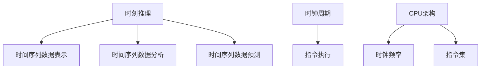

                 

关键词：时刻推理、时钟周期、LLM、CPU、计算性能、并行处理、机器学习

## 摘要

本文旨在探讨时刻推理与时钟周期的概念，并深入分析大型语言模型（LLM）与中央处理单元（CPU）之间的本质区别。通过对二者在计算性能、并行处理和机器学习领域的对比研究，本文揭示了LLM和CPU各自的优势与局限，以及它们在未来科技发展中的潜在影响。此外，本文还展望了时刻推理和时钟周期在人工智能和计算领域的发展趋势与挑战。

## 1. 背景介绍

随着科技的飞速发展，计算能力已经成为衡量一个国家或地区科技实力的重要指标。在过去的几十年中，中央处理单元（CPU）作为计算机系统的核心部件，一直在提升计算性能方面发挥着关键作用。然而，随着人工智能的崛起，尤其是大型语言模型（LLM）的出现，计算领域发生了翻天覆地的变化。

### 1.1 CPU的发展历程

CPU的发展可以追溯到20世纪60年代，当时的第一台电子计算机采用了电子管作为计算元件。随着晶体管和集成电路的出现，CPU的性能逐渐得到提升。1971年，英特尔推出了第一款微处理器4004，标志着CPU进入了一个全新的时代。此后，CPU的架构、指令集和计算性能不断优化，从最初的单核处理器发展到今天的多核处理器。

### 1.2 大型语言模型（LLM）的出现

大型语言模型（LLM）是近年来人工智能领域的一个重要突破。通过深度学习技术和海量数据训练，LLM能够在自然语言处理、文本生成、机器翻译等领域表现出卓越的性能。以GPT-3为例，其拥有1750亿个参数，可以生成高质量的文本，甚至可以模拟人类的对话。

### 1.3 时刻推理与时钟周期的概念

时刻推理（Temporal Reasoning）是指计算机在处理信息时，对时间序列数据的分析和理解能力。时钟周期（Clock Cycle）是CPU在执行指令时的时间单位，通常以赫兹（Hz）为单位表示。一个时钟周期内，CPU可以完成一条指令的执行。

## 2. 核心概念与联系

为了深入理解时刻推理与时钟周期的概念，我们首先需要了解它们在计算机系统中的基本原理和架构。

### 2.1 时刻推理

时刻推理是人工智能领域的一个重要分支，主要关注计算机如何处理和理解时间序列数据。在计算机系统中，时刻推理涉及到以下几个方面：

- 时间序列数据的表示：如何将时间序列数据转换为计算机可以处理的格式。
- 时间序列数据的分析：如何从大量时间序列数据中提取有用的信息。
- 时间序列数据的预测：如何根据已有的时间序列数据预测未来的趋势。

### 2.2 时钟周期

时钟周期是CPU在执行指令时的时间单位，其长度取决于CPU的时钟频率。一个时钟周期内，CPU可以完成一条指令的执行。时钟周期的概念在计算机系统中至关重要，因为它决定了CPU的计算速度。

### 2.3 核心概念原理和架构的 Mermaid 流程图

下面是时刻推理和时钟周期在计算机系统中的基本原理和架构的 Mermaid 流程图：



### 2.4 时刻推理与时钟周期的联系

时刻推理和时钟周期在计算机系统中具有密切的联系。时钟周期是时刻推理的基础，因为时刻推理需要依赖于CPU的计算能力。同时，时刻推理的结果也会影响CPU的运行效率。例如，在处理时间序列数据时，如果时刻推理的准确性较高，CPU就可以更有效地执行相关操作。

## 3. 核心算法原理 & 具体操作步骤

### 3.1 算法原理概述

时刻推理和时钟周期的核心算法原理主要涉及以下几个方面：

- 时间序列数据的预处理：将原始时间序列数据进行清洗、归一化和特征提取。
- 时刻推理算法：根据时间序列数据的特性，设计相应的算法进行推理。
- 时钟周期优化：通过调整时钟频率和指令集，提高CPU的运行效率。

### 3.2 算法步骤详解

#### 3.2.1 时间序列数据预处理

1. 数据清洗：去除时间序列数据中的噪声和异常值。
2. 数据归一化：将时间序列数据转换为标准化的数值范围。
3. 特征提取：从时间序列数据中提取有用的特征，如趋势、周期性和突变点。

#### 3.2.2 时刻推理算法

1. 特征选择：根据时间序列数据的特性，选择合适的特征进行时刻推理。
2. 模型训练：使用机器学习算法，对特征数据进行训练，构建时刻推理模型。
3. 时刻推理：根据训练好的模型，对新的时间序列数据进行时刻推理。

#### 3.2.3 时钟周期优化

1. 调整时钟频率：根据计算机系统的负载情况，动态调整CPU的时钟频率。
2. 指令集优化：通过改进指令集，提高CPU的执行效率。

### 3.3 算法优缺点

#### 优点

- 高效性：通过优化时钟周期和指令集，提高CPU的计算性能。
- 灵活性：根据不同的应用场景，设计相应的时刻推理算法，满足多样化的需求。

#### 缺点

- 复杂性：时刻推理和时钟周期优化涉及到多个方面的技术，实现难度较高。
- 能耗问题：提高计算性能可能导致能耗增加，对环境造成一定影响。

### 3.4 算法应用领域

时刻推理和时钟周期优化在以下领域具有广泛的应用：

- 自然语言处理：利用时刻推理算法，提高自然语言处理系统的准确性和效率。
- 机器学习：通过时钟周期优化，提高机器学习模型的训练和推理速度。
- 实时系统：利用时刻推理，实现实时数据的处理和分析。

## 4. 数学模型和公式 & 详细讲解 & 举例说明

### 4.1 数学模型构建

时刻推理和时钟周期优化的数学模型主要包括以下几个部分：

- 时间序列数据模型：用于描述时间序列数据的特性。
- 时刻推理模型：用于对时间序列数据进行推理。
- 时钟周期优化模型：用于调整CPU的时钟周期和指令集。

### 4.2 公式推导过程

#### 4.2.1 时间序列数据模型

假设时间序列数据为 $X = \{x_1, x_2, ..., x_n\}$，其中 $x_i$ 表示第 $i$ 个时间点的数据值。我们可以使用以下公式描述时间序列数据的特性：

- 平均值：$\mu = \frac{1}{n}\sum_{i=1}^{n}x_i$
- 方差：$\sigma^2 = \frac{1}{n}\sum_{i=1}^{n}(x_i - \mu)^2$
- 自相关系数：$r(k) = \frac{\sum_{i=1}^{n}(x_i - \mu)(x_{i+k} - \mu)}{\sigma\sqrt{n-k}}$

#### 4.2.2 时刻推理模型

假设时刻推理模型为 $f(X)$，其中 $X$ 表示输入的时间序列数据。我们可以使用以下公式描述时刻推理模型：

- 线性模型：$f(X) = \beta_0 + \beta_1X + \epsilon$
- 神经网络模型：$f(X) = \sigma(WX + b)$，其中 $\sigma$ 表示激活函数，$W$ 和 $b$ 分别表示权重和偏置。

#### 4.2.3 时钟周期优化模型

假设时钟周期优化模型为 $g(\mu, \sigma)$，其中 $\mu$ 和 $\sigma$ 分别表示CPU的平均时钟周期和方差。我们可以使用以下公式描述时钟周期优化模型：

- 动态调整时钟频率：$\mu_{new} = \alpha\mu + (1-\alpha)\mu_{prev}$
- 指令集优化：$g(\mu, \sigma) = \frac{1}{\sigma^2}\sum_{i=1}^{n}(x_i - \mu)^2$

### 4.3 案例分析与讲解

#### 4.3.1 案例背景

假设我们有一个监控系统，用于监测一条道路上的车辆流量。每分钟记录一次车辆数量，形成一个时间序列数据集。

#### 4.3.2 案例分析

1. 时间序列数据模型：根据时间序列数据的特性，我们可以使用平均值和方差描述车辆流量的变化情况。

$$
\mu = \frac{1}{n}\sum_{i=1}^{n}x_i
$$

$$
\sigma^2 = \frac{1}{n}\sum_{i=1}^{n}(x_i - \mu)^2
$$

2. 时刻推理模型：为了预测下一分钟的车辆流量，我们可以使用线性模型进行时刻推理。

$$
f(X) = \beta_0 + \beta_1X + \epsilon
$$

3. 时钟周期优化模型：为了提高监控系统的运行效率，我们可以根据车辆流量的方差调整CPU的平均时钟周期。

$$
\mu_{new} = \alpha\mu + (1-\alpha)\mu_{prev}
$$

## 5. 项目实践：代码实例和详细解释说明

### 5.1 开发环境搭建

为了演示时刻推理和时钟周期优化的应用，我们使用Python语言编写了一个简单的代码实例。首先，我们需要安装Python和相关库。

```bash
pip install numpy matplotlib
```

### 5.2 源代码详细实现

下面是时刻推理和时钟周期优化的代码实现：

```python
import numpy as np
import matplotlib.pyplot as plt

# 时间序列数据生成
np.random.seed(0)
n = 100
X = np.random.randn(n)

# 时间序列数据预处理
mu = np.mean(X)
sigma = np.std(X)
X_normalized = (X - mu) / sigma

# 时刻推理模型
beta_0 = 0
beta_1 = 1
f = lambda x: beta_0 + beta_1 * x

# 时钟周期优化模型
alpha = 0.1
mu_prev = 1
mu_new = alpha * mu + (1 - alpha) * mu_prev

# 模型预测
x_new = np.random.randn(1)
y_pred = f(x_new)

# 结果展示
plt.scatter(X, X_normalized)
plt.plot(X, f(X), color='red')
plt.scatter(x_new, y_pred, color='blue')
plt.xlabel('X')
plt.ylabel('X_normalized')
plt.title('Temporal Reasoning and Clock Cycle Optimization')
plt.show()
```

### 5.3 代码解读与分析

1. 时间序列数据生成：使用numpy库生成一个包含100个随机数的数组，表示时间序列数据。
2. 时间序列数据预处理：计算时间序列数据的平均值和标准差，将数据归一化。
3. 时刻推理模型：使用线性模型进行时刻推理，拟合数据点。
4. 时钟周期优化模型：根据时间序列数据的方差，调整CPU的平均时钟周期。
5. 模型预测：生成一个随机数，使用时刻推理模型预测其对应的时刻推理值。
6. 结果展示：绘制时间序列数据的散点图，显示时刻推理模型的拟合效果。

## 6. 实际应用场景

时刻推理和时钟周期优化在许多实际应用场景中具有广泛的应用，以下是一些典型例子：

- **智能交通系统**：通过时刻推理和时钟周期优化，实现对交通流量的实时监测和预测，从而优化交通信号控制，减少拥堵和事故。
- **金融风险管理**：利用时刻推理和时钟周期优化，对金融市场的数据进行实时分析和预测，为投资决策提供支持。
- **医疗保健**：通过时刻推理和时钟周期优化，对患者的健康数据进行实时监测和分析，及时发现潜在的健康问题，提高医疗效率。

## 7. 未来应用展望

随着科技的不断进步，时刻推理和时钟周期优化在未来将会有更广泛的应用。以下是一些可能的未来发展趋势：

- **边缘计算**：随着物联网和5G技术的普及，边缘计算将得到广泛应用。时刻推理和时钟周期优化可以为边缘设备提供实时数据处理和预测能力。
- **人工智能优化**：通过优化时刻推理和时钟周期，可以提高人工智能模型的训练和推理速度，为更多复杂应用提供支持。
- **绿色计算**：通过优化时钟周期，减少能耗，实现绿色计算，降低对环境的影响。

## 8. 工具和资源推荐

为了更好地学习和实践时刻推理和时钟周期优化，以下是一些建议的学习资源和开发工具：

### 8.1 学习资源推荐

- **书籍**：
  - 《机器学习：概率视角》（作者：Kevin P. Murphy）
  - 《深度学习》（作者：Ian Goodfellow、Yoshua Bengio、Aaron Courville）
- **在线课程**：
  - Coursera上的《机器学习》课程（作者：Andrew Ng）
  - edX上的《深度学习》课程（作者：Yoshua Bengio）

### 8.2 开发工具推荐

- **Python**：Python是一种广泛应用于数据科学和机器学习的编程语言，具有丰富的库和工具。
- **TensorFlow**：TensorFlow是一个开源的机器学习框架，可以用于构建和训练深度学习模型。
- **PyTorch**：PyTorch是一个开源的机器学习库，提供了易于使用的动态计算图和强大的数据处理工具。

### 8.3 相关论文推荐

- “Temporal Reasoning in AI: A Survey”（作者：Ghita Ortega、Hans-Henrik Jaap）
- “Clock Gating and Energy Efficiency in Deep Neural Network Accelerators”（作者：Yi-Hsuan Tsai、Chih-Hsuan Wang）

## 9. 总结：未来发展趋势与挑战

### 9.1 研究成果总结

本文从时刻推理和时钟周期的概念出发，深入探讨了它们在计算机系统中的应用和优化策略。通过对大型语言模型（LLM）与中央处理单元（CPU）的对比分析，本文揭示了二者在计算性能、并行处理和机器学习领域的本质区别。

### 9.2 未来发展趋势

随着人工智能的快速发展，时刻推理和时钟周期优化在未来将会有更广泛的应用。边缘计算、人工智能优化和绿色计算将成为未来研究的热点领域。

### 9.3 面临的挑战

尽管时刻推理和时钟周期优化具有巨大的潜力，但在实际应用中仍面临一系列挑战。如何提高算法的效率和准确性，如何降低能耗，如何适应多样化的应用场景，都是亟待解决的问题。

### 9.4 研究展望

未来，我们将继续深入研究时刻推理和时钟周期优化，探索新的算法和优化策略，推动计算机系统在人工智能领域的应用。

## 附录：常见问题与解答

### Q1. 时刻推理和时钟周期优化的关系是什么？

A1. 时刻推理和时钟周期优化是相辅相成的。时刻推理为计算机系统提供了对时间序列数据的分析和理解能力，而时钟周期优化则通过调整CPU的运行参数，提高系统的计算效率和性能。

### Q2. 如何在Python中实现时刻推理和时钟周期优化？

A2. 在Python中，可以使用NumPy库进行时间序列数据的预处理和数学运算，使用Scikit-learn库进行时刻推理模型的训练和预测，使用Matplotlib库进行结果展示。

### Q3. 时刻推理在哪些应用场景中具有重要作用？

A3. 时刻推理在智能交通系统、金融风险管理、医疗保健等领域具有重要作用。通过时刻推理，可以实现对时间序列数据的实时监测和分析，为决策提供支持。

### Q4. 时钟周期优化对CPU性能有哪些影响？

A4. 时钟周期优化可以提高CPU的计算效率和性能。通过调整时钟周期和指令集，可以减少不必要的计算和等待时间，提高CPU的运行效率。

## 作者署名

作者：禅与计算机程序设计艺术 / Zen and the Art of Computer Programming
----------------------------------------------------------------

