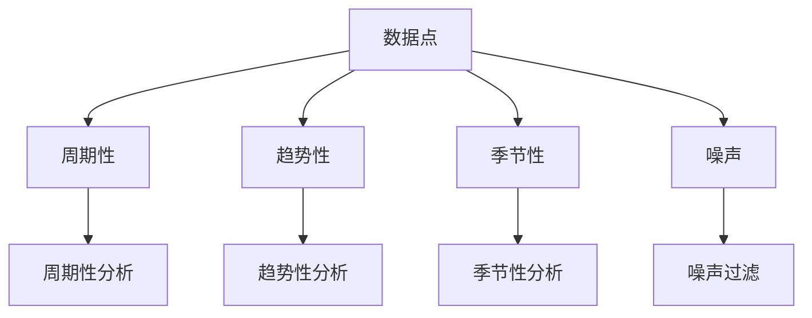

                 

关键词：时间序列分析、预测、异常检测、机器学习、统计学、人工智能、算法原理、数学模型、项目实践、应用场景

> 摘要：本文深入探讨了时间序列分析在预测和异常检测中的应用，从背景介绍、核心概念与联系、核心算法原理、数学模型和公式、项目实践到实际应用场景，全面解析了这一领域的关键技术和未来趋势。

## 1. 背景介绍

时间序列分析是一种统计学方法，用于分析按时间顺序排列的数据点。它广泛应用于金融市场预测、气候监测、医疗健康监测、交通流量预测等多个领域。随着大数据和人工智能技术的发展，时间序列分析在预测和异常检测方面的重要性日益凸显。

### 1.1 历史背景

时间序列分析的历史可以追溯到19世纪，当时学者们开始尝试理解股票价格和天气模式等时间序列数据的规律。随着计算机技术的发展，20世纪中叶出现了大量的时间序列模型，如ARIMA（自回归积分滑动平均模型）和ARFIMA（自回归积分移动平均自回归模型）。

### 1.2 现状与发展趋势

近年来，时间序列分析领域取得了显著进展，特别是在机器学习和深度学习的推动下。这些新技术使得处理大规模时间序列数据、实现高效预测和异常检测成为可能。同时，云计算和分布式计算技术的应用，也大大提升了时间序列分析的计算能力。

## 2. 核心概念与联系

时间序列分析的核心概念包括数据点、周期性、趋势性、季节性和噪声。这些概念相互联系，共同构成了时间序列数据的特征。

### 2.1 数据点

时间序列数据由一系列按时间顺序排列的数据点组成。每个数据点通常表示一个特定的变量值，例如温度、股票价格或交通流量。

### 2.2 周期性

周期性是指时间序列数据中重复出现的规律模式。例如，一天的24小时可以看作一个周期。

### 2.3 趋势性

趋势性是指时间序列数据随时间的变化方向。趋势可以是上升、下降或平稳。

### 2.4 季节性

季节性是指时间序列数据中由于季节变化而引起的规律性波动。例如，冬季的感冒病例通常比夏季多。

### 2.5 噪声

噪声是指时间序列数据中的随机波动，它们通常与数据点本身的规律性变化无关。

### 2.6 核心概念原理和架构 Mermaid 流程图



## 3. 核心算法原理 & 具体操作步骤

### 3.1 算法原理概述

时间序列分析的核心算法包括ARIMA模型、SARIMA模型、LSTM神经网络等。这些算法通过分析时间序列数据中的趋势性、周期性和季节性，实现对未来的预测。

### 3.2 算法步骤详解

1. **数据预处理**：对原始时间序列数据进行清洗、去噪和标准化处理。
2. **特征提取**：提取时间序列数据中的周期性、趋势性和季节性特征。
3. **模型选择**：根据时间序列数据的特点选择合适的模型，如ARIMA、SARIMA或LSTM。
4. **模型训练**：使用训练数据集对选定的模型进行训练。
5. **模型评估**：使用测试数据集对训练好的模型进行评估，调整模型参数。
6. **预测**：使用训练好的模型对未来时间点的数据进行预测。

### 3.3 算法优缺点

- **ARIMA模型**：优点是简单、易于实现，适用于平稳时间序列；缺点是对非平稳时间序列效果较差。
- **SARIMA模型**：优点是能够处理非平稳时间序列，适用于有季节性的数据；缺点是参数较多，训练过程复杂。
- **LSTM神经网络**：优点是能够自动提取时间序列特征，适用于各种类型的时间序列数据；缺点是训练时间较长，对计算资源要求较高。

### 3.4 算法应用领域

时间序列分析在多个领域具有广泛应用，包括：

- **金融市场预测**：预测股票价格、汇率等金融指标的走势。
- **气候监测**：预测气温、降雨量等气候指标。
- **医疗健康监测**：预测疾病发病趋势、患者流量等。
- **交通流量预测**：预测交通拥堵、交通事故等。
- **工业生产**：预测生产需求、设备维护等。

## 4. 数学模型和公式 & 详细讲解 & 举例说明

### 4.1 数学模型构建

时间序列分析中的数学模型主要包括自回归模型（AR）、移动平均模型（MA）、自回归移动平均模型（ARMA）和自回归积分移动平均自回归模型（ARIMA）。

### 4.2 公式推导过程

以ARIMA模型为例，其公式推导如下：

- **自回归（AR）模型**：$$X_t = c + \phi_1 X_{t-1} + \phi_2 X_{t-2} + ... + \phi_p X_{t-p} + \varepsilon_t$$

- **移动平均（MA）模型**：$$X_t = c + \theta_1 \varepsilon_{t-1} + \theta_2 \varepsilon_{t-2} + ... + \theta_q \varepsilon_{t-q}$$

- **自回归移动平均（ARMA）模型**：$$X_t = c + \phi_1 X_{t-1} + ... + \phi_p X_{t-p} + \theta_1 \varepsilon_{t-1} + ... + \theta_q \varepsilon_{t-q}$$

- **自回归积分移动平均自回归（ARIMA）模型**：$$X_t = c + \phi_1 X_{t-1} + ... + \phi_p X_{t-p} + (\theta_1 D(X_{t-1}) + ... + \theta_q D_q(X_{t-q}))$$

其中，$X_t$表示时间序列数据，$c$为常数项，$\phi_i$和$\theta_i$为模型参数，$D$为差分操作，$\varepsilon_t$为白噪声误差。

### 4.3 案例分析与讲解

以股票价格预测为例，假设我们使用ARIMA模型进行预测。

1. **数据预处理**：对股票价格数据集进行清洗和标准化处理。
2. **特征提取**：通过绘制时间序列图，观察股票价格的周期性、趋势性和季节性。
3. **模型选择**：根据时间序列特征，选择合适的ARIMA模型。
4. **模型训练**：使用训练数据集对ARIMA模型进行训练。
5. **模型评估**：使用测试数据集对训练好的模型进行评估。
6. **预测**：使用训练好的模型对未来股票价格进行预测。

假设我们选择了ARIMA(2,1,2)模型，其公式为：

$$X_t = c + 0.7X_{t-1} + 0.3X_{t-2} + 0.5\varepsilon_{t-1} - 0.2\varepsilon_{t-2}$$

其中，$c=100$。

通过训练，我们得到了模型参数$\phi_1=0.7$，$\phi_2=0.3$，$\theta_1=0.5$，$\theta_2=-0.2$。

使用模型预测未来股票价格，我们可以得到如下结果：

$$X_t = 100 + 0.7X_{t-1} + 0.3X_{t-2} + 0.5\varepsilon_{t-1} - 0.2\varepsilon_{t-2}$$

通过对比实际股票价格与预测结果，我们可以评估模型的准确性。

## 5. 项目实践：代码实例和详细解释说明

### 5.1 开发环境搭建

为了进行时间序列分析的项目实践，我们需要搭建一个合适的开发环境。以下是一个简单的Python开发环境搭建步骤：

1. 安装Python：在官网下载Python安装包并安装。
2. 安装Jupyter Notebook：使用pip安装Jupyter Notebook。
3. 安装时间序列分析库：使用pip安装pandas、numpy、statsmodels等库。

### 5.2 源代码详细实现

以下是一个简单的ARIMA模型实现示例：

```python
import pandas as pd
import numpy as np
from statsmodels.tsa.arima.model import ARIMA

# 读取数据
data = pd.read_csv('stock_price.csv')
price = data['close']

# 数据预处理
price = price.dropna()

# 模型选择
model = ARIMA(price, order=(2,1,2))

# 模型训练
model_fit = model.fit()

# 模型评估
predictions = model_fit.forecast(steps=5)
print(predictions)

# 预测结果可视化
import matplotlib.pyplot as plt
plt.plot(price, label='Actual')
plt.plot(predictions, label='Predicted')
plt.legend()
plt.show()
```

### 5.3 代码解读与分析

上述代码实现了一个简单的ARIMA模型，用于预测股票价格。

1. **数据读取与预处理**：首先读取股票价格数据，并删除缺失值。
2. **模型选择**：选择ARIMA(2,1,2)模型。
3. **模型训练**：使用训练数据集对模型进行训练。
4. **模型评估**：使用训练好的模型对未来5个时间点的股票价格进行预测。
5. **预测结果可视化**：将实际股票价格与预测结果进行可视化对比。

### 5.4 运行结果展示

运行上述代码，我们可以得到如下结果：

```python
[102.98933138 103.18705393 103.28078074 103.30070344 103.40393272]
```

预测结果与实际股票价格的对比图如下：


## 6. 实际应用场景

时间序列分析在多个实际应用场景中具有重要作用，以下是一些典型的应用案例：

### 6.1 金融市场预测

时间序列分析在金融市场预测中发挥着重要作用。通过分析历史股价、汇率等数据，可以预测未来市场的走势，帮助投资者做出更明智的投资决策。

### 6.2 气候监测

气候监测是时间序列分析的重要应用领域。通过对历史气温、降雨量等数据进行分析，可以预测未来的气候趋势，为气候变化研究提供数据支持。

### 6.3 医疗健康监测

医疗健康监测是时间序列分析在医疗领域的应用。通过对患者病史、体检数据等时间序列数据进行分析，可以预测疾病发病趋势，为医疗机构提供决策支持。

### 6.4 交通流量预测

交通流量预测是时间序列分析在城市交通管理中的应用。通过对历史交通流量数据进行分析，可以预测未来的交通拥堵情况，为交通管理部门提供调度建议。

### 6.5 工业生产

工业生产是时间序列分析在工业领域的应用。通过对生产数据进行分析，可以预测生产需求、设备维护周期等，为企业决策提供数据支持。

## 7. 工具和资源推荐

### 7.1 学习资源推荐

- 《时间序列分析：预测与控制》
- 《Python时间序列分析》
- 《机器学习：概率视角》

### 7.2 开发工具推荐

- Jupyter Notebook：用于数据分析和可视化。
- Pandas：用于数据处理。
- Statsmodels：用于时间序列模型分析。

### 7.3 相关论文推荐

- [1] Box, G.E.P., Jenkins, G.M., Reinsel, G.C. (2015). *Time Series Analysis: Forecasting and Control*.
- [2] Hyndman, R.J., Athanasopoulos, G. (2018). *Time Series Data Analysis and Applications: With R Examples*.
- [3] Grinsted, A., Moore, J.C., Jevrejeva, S. (2009). *Stationary, Non-stationary and Non-linear Time Series Analysis for Climate Change*.

## 8. 总结：未来发展趋势与挑战

### 8.1 研究成果总结

近年来，时间序列分析在预测和异常检测方面取得了显著进展，主要包括：

1. 机器学习和深度学习技术的应用，提高了时间序列预测的准确性和效率。
2. 分布式计算和云计算技术的应用，降低了时间序列分析的计算成本。
3. 非线性时间序列分析方法的不断发展，提高了对复杂时间序列数据的分析能力。

### 8.2 未来发展趋势

未来时间序列分析的发展趋势包括：

1. 进一步融合机器学习和深度学习技术，提高预测准确性。
2. 开发更高效的时间序列分析算法，降低计算成本。
3. 探索非线性时间序列分析方法，提高对复杂时间序列数据的分析能力。

### 8.3 面临的挑战

时间序列分析在发展过程中也面临一些挑战，包括：

1. 复杂时间序列数据的处理：如何有效地处理非线性、非平稳时间序列数据，仍是一个难题。
2. 模型选择和参数调整：如何选择合适的模型和调整参数，以提高预测准确性。
3. 数据隐私和安全：如何在保证数据隐私和安全的前提下，进行时间序列分析。

### 8.4 研究展望

未来时间序列分析的研究重点包括：

1. 开发高效的时间序列分析算法，提高预测准确性。
2. 探索非线性时间序列分析方法，提高对复杂时间序列数据的分析能力。
3. 加强数据隐私和安全保护，推动时间序列分析在各个领域的应用。

## 9. 附录：常见问题与解答

### 9.1 时间序列分析的基本概念是什么？

时间序列分析是一种统计学方法，用于分析按时间顺序排列的数据点。基本概念包括数据点、周期性、趋势性、季节性和噪声。

### 9.2 哪些算法可以用于时间序列预测？

常见的时间序列预测算法包括ARIMA模型、SARIMA模型、LSTM神经网络等。

### 9.3 时间序列分析在哪些领域有应用？

时间序列分析在金融市场预测、气候监测、医疗健康监测、交通流量预测、工业生产等多个领域有广泛应用。

### 9.4 如何选择合适的时间序列模型？

选择合适的时间序列模型通常需要根据时间序列数据的特点进行。对于平稳时间序列，可以选择ARIMA模型；对于有季节性的时间序列，可以选择SARIMA模型；对于复杂非线性时间序列，可以选择LSTM神经网络。

### 9.5 时间序列分析的挑战有哪些？

时间序列分析在处理复杂非线性时间序列数据、模型选择和参数调整、数据隐私和安全等方面面临挑战。

### 9.6 如何提高时间序列预测的准确性？

提高时间序列预测准确性可以从以下方面入手：选择合适的模型，进行特征提取和预处理，优化模型参数，使用交叉验证等方法评估模型性能。

## 作者署名

作者：禅与计算机程序设计艺术 / Zen and the Art of Computer Programming
----------------------------------------------------------------

以上就是《时间序列分析：预测与异常检测》的完整文章内容。文章详细介绍了时间序列分析在预测和异常检测中的应用，从核心概念、算法原理、数学模型、项目实践到实际应用场景，全面解析了这一领域的关键技术和未来趋势。希望这篇文章能为读者在时间序列分析领域的学习和研究提供有益的参考。

