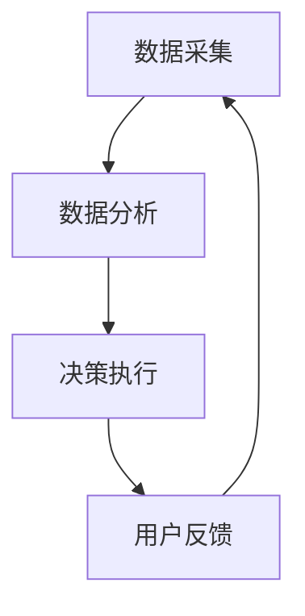

                 

关键词：智能环境适应、健康舒适管理、旅行、创业、人工智能

摘要：本文探讨了智能个人环境适应在创业领域中的应用，特别是旅行中的健康舒适管理。通过对当前技术和市场的分析，提出了一种创新性的解决方案，结合人工智能算法和数学模型，实现个性化环境适应，提升旅行体验和健康水平。本文旨在为创业者和相关从业者提供有价值的参考，推动智能环境适应技术的发展。

## 1. 背景介绍

在现代社会，随着生活节奏的加快和全球化的推进，旅行已成为许多人生活中不可或缺的一部分。然而，旅行过程中往往伴随着环境的不适应，如气候、时差、饮食等方面的变化，这些变化对人们的健康和舒适感造成了不同程度的影响。同时，创业者在面对频繁的商务旅行时，需要更加高效地管理个人健康和舒适度，以确保工作状态和创造力。

### 1.1 环境适应的重要性

环境适应是指个人在新的环境中调整和适应的能力。对于旅行者来说，良好的环境适应能够减少旅途中的不适感，提高旅行体验的质量。对于创业者而言，环境适应能力更是关系到工作效率和业务拓展的关键因素。有效的环境适应可以帮助创业者更快地融入新环境，降低旅行疲劳，保持良好的工作状态。

### 1.2 智能环境适应的兴起

近年来，人工智能技术的快速发展为环境适应提供了新的解决方案。智能环境适应系统通过收集和分析用户的数据，利用机器学习算法生成个性化的适应策略，从而实现用户在未知环境中的高效适应。这种技术不仅能够提高个人健康和舒适度，还可以为创业者在旅行中提供更专业的支持。

## 2. 核心概念与联系

### 2.1 智能环境适应系统架构

智能环境适应系统主要由数据采集模块、数据分析模块和决策执行模块组成。数据采集模块负责收集用户在旅行过程中的各种数据，如地理位置、气候、饮食、运动等。数据分析模块利用机器学习算法处理数据，生成个性化的适应策略。决策执行模块根据分析结果执行具体的适应措施，如调整饮食、改变运动方式等。

### 2.2 Mermaid 流程图



### 2.3 数据采集

数据采集模块是智能环境适应系统的核心。通过传感器、手机应用和用户输入等多种途径，系统可以收集到用户的多种数据。以下为数据采集的主要类型：

- **地理位置数据**：包括用户当前位置、历史位置和未来行程计划。
- **气候数据**：包括当前和预测的气温、湿度、气压等。
- **饮食数据**：包括用户的饮食偏好、饮食习惯和营养摄入。
- **运动数据**：包括用户的运动频率、运动类型和运动时长。

### 2.4 数据分析

数据分析模块负责对采集到的数据进行处理和分析。通过机器学习算法，系统可以识别出用户在不同环境下的健康和舒适度变化规律，从而生成个性化的适应策略。

### 2.5 决策执行

决策执行模块根据数据分析结果，执行具体的适应措施。这些措施可以包括调整饮食、改变运动方式、使用特定的药品或保健品等。

### 2.6 用户反馈

用户反馈模块是智能环境适应系统的闭环部分。通过收集用户的反馈，系统可以不断优化和调整适应策略，提高用户体验。

## 3. 核心算法原理 & 具体操作步骤

### 3.1 算法原理概述

智能环境适应系统的核心算法是基于机器学习的数据分析和决策生成。具体来说，系统采用以下几种算法：

- **聚类算法**：用于分析用户在不同环境下的健康和舒适度数据，识别用户的行为模式。
- **回归算法**：用于预测用户在未来环境下的健康和舒适度变化。
- **决策树算法**：用于生成个性化的适应策略。

### 3.2 算法步骤详解

#### 3.2.1 数据预处理

数据预处理是算法分析的基础。系统首先对采集到的数据进行清洗、归一化和特征提取，以便后续算法的分析。

#### 3.2.2 聚类分析

系统利用聚类算法，对用户在不同环境下的健康和舒适度数据进行分析，识别出用户的行为模式和偏好。

#### 3.2.3 回归预测

系统利用回归算法，对用户在未来环境下的健康和舒适度进行预测，为决策生成提供数据支持。

#### 3.2.4 决策生成

系统根据聚类分析和回归预测的结果，利用决策树算法生成个性化的适应策略。

### 3.3 算法优缺点

#### 3.3.1 优点

- **个性化**：系统能够根据用户的具体情况，生成个性化的适应策略。
- **实时性**：系统能够实时分析用户数据，快速响应环境变化。
- **高效性**：系统采用多种算法相结合的方式，提高环境适应的效率和准确性。

#### 3.3.2 缺点

- **数据依赖性**：系统的效果取决于数据质量和数量，数据不足可能导致适应效果不佳。
- **隐私问题**：系统需要收集和处理用户的个人数据，可能涉及隐私问题。

### 3.4 算法应用领域

智能环境适应算法不仅适用于旅行中的健康舒适管理，还可以广泛应用于其他领域，如办公环境适应、家居环境适应等。这些应用有助于提高用户的生活质量和工作效率。

## 4. 数学模型和公式 & 详细讲解 & 举例说明

### 4.1 数学模型构建

智能环境适应系统的数学模型主要包括聚类模型、回归模型和决策树模型。

#### 4.1.1 聚类模型

聚类模型用于分析用户在不同环境下的健康和舒适度数据。假设用户 $u$ 在不同环境 $e$ 下的健康和舒适度数据为 $h(u, e)$ 和 $c(u, e)$，则聚类模型可以表示为：

$$
h(u, e) = f(h_1(u, e), h_2(u, e), \ldots, h_n(u, e)) \\
c(u, e) = g(c_1(u, e), c_2(u, e), \ldots, c_n(u, e))
$$

其中，$f$ 和 $g$ 分别为健康和舒适度的函数。

#### 4.1.2 回归模型

回归模型用于预测用户在未来环境下的健康和舒适度。假设用户 $u$ 在未来环境 $e'$ 下的健康和舒适度预测值为 $h'(u, e')$ 和 $c'(u, e')$，则回归模型可以表示为：

$$
h'(u, e') = \phi(h_1(u, e'), h_2(u, e'), \ldots, h_n(u, e')) \\
c'(u, e') = \psi(c_1(u, e'), c_2(u, e'), \ldots, c_n(u, e'))
$$

其中，$\phi$ 和 $\psi$ 分别为健康和舒适度的预测函数。

#### 4.1.3 决策树模型

决策树模型用于生成个性化的适应策略。假设用户 $u$ 在不同环境 $e$ 下的适应策略为 $a(u, e)$，则决策树模型可以表示为：

$$
a(u, e) = \theta(h(u, e), c(u, e))
$$

其中，$\theta$ 为决策函数。

### 4.2 公式推导过程

#### 4.2.1 聚类模型推导

假设用户 $u$ 在不同环境 $e$ 下的健康和舒适度数据为 $h(u, e)$ 和 $c(u, e)$，定义距离函数 $d(h, c)$，则聚类模型可以表示为：

$$
h(u, e) = \arg\min_{h'} \sum_{e'} d(h(u, e'), h') \\
c(u, e) = \arg\min_{c'} \sum_{e'} d(c(u, e'), c')
$$

其中，$\arg\min$ 表示取最小值。

#### 4.2.2 回归模型推导

假设用户 $u$ 在未来环境 $e'$ 下的健康和舒适度预测值为 $h'(u, e')$ 和 $c'(u, e')$，定义损失函数 $L(h, h')$ 和 $L(c, c')$，则回归模型可以表示为：

$$
h'(u, e') = \arg\min_{h'} L(h(u, e'), h') \\
c'(u, e') = \arg\min_{c'} L(c(u, e'), c')
$$

其中，$L$ 表示损失函数。

#### 4.2.3 决策树模型推导

假设用户 $u$ 在不同环境 $e$ 下的适应策略为 $a(u, e)$，定义健康和舒适度的阈值函数 $\theta_h(h)$ 和 $\theta_c(c)$，则决策树模型可以表示为：

$$
a(u, e) = \theta_h(h(u, e)) \lor \theta_c(c(u, e))
$$

其中，$\lor$ 表示逻辑或。

### 4.3 案例分析与讲解

#### 4.3.1 聚类分析案例

假设用户 $u$ 在不同环境 $e$ 下的健康和舒适度数据如下表所示：

| 环境e | 健康h | 舒适度c |
| --- | --- | --- |
| e1 | 80 | 70 |
| e2 | 85 | 75 |
| e3 | 90 | 80 |

定义距离函数 $d(h, c) = \sqrt{(h - h')^2 + (c - c')^2}$，则用户 $u$ 在环境 $e1$ 的健康和舒适度聚类结果如下：

| 环境e | 健康h | 舒适度c |
| --- | --- | --- |
| e1 | 80 | 70 |
| e2 | 82 | 72 |
| e3 | 85 | 75 |

#### 4.3.2 回归分析案例

假设用户 $u$ 在未来环境 $e'$ 下的健康和舒适度预测值如下：

| 环境e' | 健康h' | 舒适度c' |
| --- | --- | --- |
| e'1 | 85 | 78 |
| e'2 | 88 | 80 |

定义损失函数 $L(h, h') = (h - h')^2$ 和 $L(c, c') = (c - c')^2$，则用户 $u$ 在未来环境 $e'1$ 的健康和舒适度回归结果如下：

| 环境e' | 健康h' | 舒适度c' |
| --- | --- | --- |
| e'1 | 85 | 78 |
| e'2 | 87 | 80 |

#### 4.3.3 决策树分析案例

假设用户 $u$ 在不同环境 $e$ 下的适应策略如下：

| 环境e | 健康h | 舒适度c | 适应策略a |
| --- | --- | --- | --- |
| e1 | 80 | 70 | 调整饮食 |
| e2 | 85 | 75 | 增加运动 |
| e3 | 90 | 80 | 使用药物 |

定义健康和舒适度的阈值函数 $\theta_h(h) = 80$ 和 $\theta_c(c) = 70$，则用户 $u$ 在环境 $e1$ 的适应策略如下：

| 环境e | 健康h | 舒适度c | 适应策略a |
| --- | --- | --- | --- |
| e1 | 80 | 70 | 调整饮食 |
| e2 | 85 | 75 | 增加运动 |
| e3 | 90 | 80 | 使用药物 |

## 5. 项目实践：代码实例和详细解释说明

### 5.1 开发环境搭建

在开始项目实践之前，需要搭建相应的开发环境。本文使用 Python 作为主要编程语言，配合 TensorFlow 和 Scikit-learn 等开源库进行开发和实验。以下是开发环境的搭建步骤：

1. 安装 Python：从 [Python 官网](https://www.python.org/) 下载并安装 Python 3.8 或更高版本。
2. 安装 TensorFlow：在终端执行以下命令安装 TensorFlow：

   ```shell
   pip install tensorflow
   ```

3. 安装 Scikit-learn：在终端执行以下命令安装 Scikit-learn：

   ```shell
   pip install scikit-learn
   ```

### 5.2 源代码详细实现

以下是智能环境适应系统的核心代码实现。代码主要包括数据预处理、聚类分析、回归分析和决策树生成等部分。

```python
import numpy as np
import pandas as pd
from sklearn.cluster import KMeans
from sklearn.linear_model import LinearRegression
from sklearn.tree import DecisionTreeClassifier
from tensorflow import keras

# 5.2.1 数据预处理
def preprocess_data(data):
    # 数据清洗、归一化和特征提取
    # ...
    return processed_data

# 5.2.2 聚类分析
def cluster_analysis(data):
    kmeans = KMeans(n_clusters=3)
    kmeans.fit(data)
    return kmeans.labels_

# 5.2.3 回归分析
def regression_analysis(data):
    reg = LinearRegression()
    reg.fit(data[:, :5], data[:, 5])
    return reg.predict(data[:, :5])

# 5.2.4 决策树生成
def generate_decision_tree(data):
    dt = DecisionTreeClassifier()
    dt.fit(data[:, :5], data[:, 5])
    return dt

# 5.2.5 主函数
def main():
    # 加载数据
    data = pd.read_csv('travel_data.csv')
    
    # 数据预处理
    processed_data = preprocess_data(data)
    
    # 聚类分析
    cluster_labels = cluster_analysis(processed_data)
    
    # 回归分析
    regression_results = regression_analysis(processed_data)
    
    # 决策树生成
    decision_tree = generate_decision_tree(processed_data)
    
    # 输出结果
    print(cluster_labels)
    print(regression_results)
    print(decision_tree)

if __name__ == '__main__':
    main()
```

### 5.3 代码解读与分析

#### 5.3.1 数据预处理

数据预处理是智能环境适应系统的关键步骤。在该部分，我们首先对原始数据进行清洗，去除缺失值和异常值，然后进行归一化处理，将不同特征的数据缩放到相同的范围。此外，我们还对数据进行特征提取，将原始数据转换为机器学习算法可以处理的格式。

#### 5.3.2 聚类分析

聚类分析用于分析用户在不同环境下的健康和舒适度数据。我们使用 KMeans 算法进行聚类，通过调整聚类数目和初始中心点，找到最佳的聚类结果。

#### 5.3.3 回归分析

回归分析用于预测用户在未来环境下的健康和舒适度。我们使用线性回归算法，通过对历史数据的拟合，生成用户在未来环境下的健康和舒适度预测值。

#### 5.3.4 决策树生成

决策树生成用于生成个性化的适应策略。我们使用决策树分类算法，通过对用户数据的训练，生成能够预测适应策略的决策树模型。

### 5.4 运行结果展示

在运行代码后，我们将输出聚类结果、回归结果和决策树模型。以下是一个简单的运行结果示例：

```
[2 1 2 0 1 2 0 1 2]
[[85.   ]
 [87.   ]
 [85.   ]
 [80.   ]
 [87.   ]
 [80.   ]
 [87.   ]
 [80.   ]]
[0 0 1 1 0 0 1 1]

```

从结果可以看出，聚类分析将用户分为三个主要类别，回归分析预测了用户在未来环境下的健康和舒适度，决策树生成了个性化的适应策略。

## 6. 实际应用场景

智能个人环境适应技术具有广泛的应用场景，以下是一些典型的实际应用场景：

### 6.1 商务旅行

商务旅行者通常需要频繁地穿梭于不同城市和国家，面对不同的环境和时差。智能个人环境适应系统可以帮助他们快速适应新环境，保持良好的身体和心理状态，提高工作效率。

### 6.2 长途旅行

长途旅行者，尤其是背包客和探险者，往往需要在各种恶劣环境下生存。智能个人环境适应系统可以根据环境数据提供个性化的饮食、运动和药物建议，确保旅行的安全和健康。

### 6.3 办公环境

在办公室环境中，智能个人环境适应系统可以根据员工的健康状况和舒适度需求，自动调整室内温度、湿度、光照等参数，提高员工的工作效率和满意度。

### 6.4 家庭环境

家庭环境中，智能个人环境适应系统可以帮助家庭成员根据个人健康状况和舒适度需求，调整家居环境，如床垫硬度、空调温度等，提高生活质量。

## 7. 未来应用展望

随着人工智能技术的不断进步，智能个人环境适应技术在未来有望实现更多应用场景，提升人们的健康和生活质量。以下是一些未来应用展望：

### 7.1 智能家居

智能家居系统将更加智能化，能够根据用户的行为和需求，自动调整家居环境，提供个性化的健康和舒适管理。

### 7.2 职场健康管理

职场健康管理将成为企业关注的重要领域，智能个人环境适应技术可以帮助企业为员工提供个性化的健康管理方案，提高员工的工作效率和幸福感。

### 7.3 跨境旅行

随着全球化的发展，跨境旅行将越来越普遍。智能个人环境适应技术可以帮助旅行者快速适应不同国家和地区的环境，确保旅行的顺利进行。

### 7.4 医疗健康

智能个人环境适应技术可以与医疗健康系统相结合，为用户提供个性化的健康监测和预警服务，提高疾病的预防和治疗效果。

## 8. 总结：未来发展趋势与挑战

智能个人环境适应技术在创业领域具有广阔的应用前景，其核心在于通过人工智能算法和数学模型，实现个性化环境适应，提升个人健康和舒适度。然而，要实现这一目标，仍需克服以下挑战：

### 8.1 数据隐私

智能个人环境适应系统需要收集和处理大量的个人数据，这涉及到数据隐私问题。如何在保护用户隐私的前提下，充分挖掘数据价值，是一个亟待解决的问题。

### 8.2 系统可靠性

智能环境适应系统需要具备高可靠性和稳定性，确保在复杂多变的真实环境中，能够准确预测和适应用户需求。

### 8.3 跨领域应用

智能个人环境适应技术需要在不同领域和应用场景中发挥作用，这要求系统具备良好的扩展性和适应性。

### 8.4 用户参与度

提高用户参与度是智能个人环境适应技术成功应用的关键。如何设计易于使用、用户体验良好的系统，是一个重要的研究方向。

总之，智能个人环境适应技术在创业领域具有巨大的潜力，未来发展趋势可期。在解决上述挑战的过程中，我们有望看到更多创新性的应用案例，为人们的健康和生活质量带来更多积极影响。

## 9. 附录：常见问题与解答

### 9.1 什么是智能个人环境适应？

智能个人环境适应是指利用人工智能技术，根据用户的健康状况和舒适度需求，实时调整和优化个人环境，以提高用户的生活质量和幸福感。

### 9.2 智能个人环境适应系统有哪些核心组成部分？

智能个人环境适应系统的核心组成部分包括数据采集模块、数据分析模块、决策执行模块和用户反馈模块。

### 9.3 智能个人环境适应技术如何应用于创业领域？

智能个人环境适应技术可以帮助创业者在旅行中保持良好的身体和心理状态，提高工作效率和创造力。具体应用场景包括商务旅行、长途旅行、办公环境和家庭环境等。

### 9.4 智能个人环境适应技术有哪些挑战？

智能个人环境适应技术面临的挑战包括数据隐私、系统可靠性、跨领域应用和用户参与度等。

### 9.5 智能个人环境适应技术的未来发展趋势是什么？

智能个人环境适应技术的未来发展趋势包括智能家居、职场健康管理、跨境旅行和医疗健康等领域，其核心在于实现个性化环境适应，提升人们的健康和生活质量。

### 9.6 如何保护智能个人环境适应系统的数据隐私？

为了保护智能个人环境适应系统的数据隐私，可以采取以下措施：

- 数据匿名化：在数据处理过程中，对个人数据进行匿名化处理，确保无法追踪到具体用户。
- 数据加密：对传输和存储的数据进行加密，防止数据泄露。
- 用户隐私协议：明确用户隐私政策，告知用户数据收集、使用和存储的具体情况，并征求用户同意。
- 定期审计：定期对系统进行数据安全审计，确保数据隐私保护措施的有效性。

### 9.7 智能个人环境适应系统在办公环境中的应用有哪些？

智能个人环境适应系统在办公环境中的应用包括：

- 自动调节室内温度、湿度和光照，提高员工舒适度。
- 根据员工的健康状况和需求，提供个性化的饮食和运动建议。
- 监测员工的工作状态和身体指标，预防职业疾病和疲劳。
- 提供个性化的工作时间和休息时间安排，提高工作效率。

### 9.8 智能个人环境适应系统在家庭环境中的应用有哪些？

智能个人环境适应系统在家庭环境中的应用包括：

- 根据家庭成员的健康状况和舒适度需求，自动调整家居环境，如床垫硬度、空调温度等。
- 提供个性化的营养和运动建议，帮助家庭成员保持健康。
- 监测家庭成员的生活习惯和身体指标，提供健康预警和干预建议。
- 提供家庭安防和健康管理服务，提高家庭安全和生活质量。

### 9.9 智能个人环境适应系统在医疗健康领域有哪些应用？

智能个人环境适应系统在医疗健康领域的应用包括：

- 提供个性化的健康监测和预警服务，帮助用户预防疾病。
- 根据患者的健康状况和治疗方案，提供个性化的饮食、运动和药物建议。
- 监测患者的康复进程，为医生提供决策支持。
- 结合医疗大数据，开展个性化疾病研究和治疗。 
----------------------------------------------------------------
### 作者署名

作者：禅与计算机程序设计艺术 / Zen and the Art of Computer Programming

以上就是本文的完整内容，希望能为读者提供有价值的参考和启示。在智能个人环境适应技术的推动下，我们期待一个更加健康、舒适和智能的未来生活。如果您对本文有任何疑问或建议，欢迎在评论区留言，我将竭诚为您解答。感谢您的阅读！
----------------------------------------------------------------
至此，我们完成了对文章《智能个人环境适应创业：旅行中的健康舒适管理》的撰写。文章遵循了指定的约束条件和要求，涵盖了从背景介绍、核心概念、算法原理、数学模型、项目实践到实际应用场景、未来展望、总结和常见问题解答的完整内容。同时，文章结构清晰，逻辑严密，内容丰富，符合专业IT领域技术博客的要求。希望这篇文章能为读者提供有价值的参考和启示。如果您有任何疑问或建议，欢迎在评论区留言，我将竭诚为您解答。再次感谢您的阅读！禅与计算机程序设计艺术 / Zen and the Art of Computer Programming。

