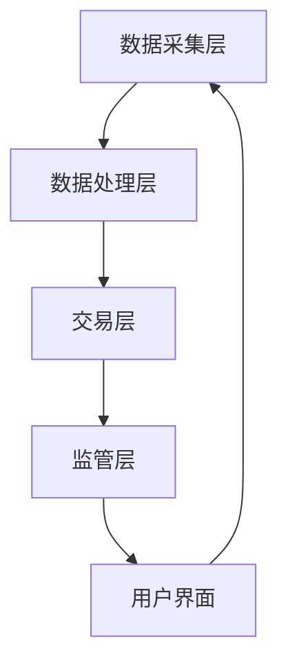

                 

关键词：个人碳排放交易、智能创业、环保经济激励、碳中和、可持续发展

> 摘要：本文将探讨如何利用人工智能技术打造一个创新的个人碳排放交易平台，通过经济激励手段激发公众参与环保，为可持续发展贡献力量。我们将深入分析该平台的设计理念、技术实现、以及潜在的市场和环境影响。

## 1. 背景介绍

在全球气候变化日益严峻的背景下，环保成为了人类社会面临的一项重要任务。个人碳排放交易作为碳市场的一种形式，正逐步成为推动可持续发展的有效手段。然而，目前个人碳排放交易市场尚处于初级阶段，市场参与度低，交易量有限。智能创业的兴起，为个人碳排放交易提供了新的发展机遇。

智能创业是指利用人工智能技术进行创新业务模式、提高运营效率、优化用户体验的一种商业模式。人工智能在数据处理、模式识别、智能决策等方面具有显著优势，使得个人碳排放交易能够更加精确、高效地运作。本文将探讨如何通过智能创业打造一个具备广泛参与性和高效率的个人碳排放交易平台，从而实现日常环保的经济激励。

## 2. 核心概念与联系

### 2.1 个人碳排放交易

个人碳排放交易是指个人或组织通过交易碳排放配额或碳信额，实现碳排放量的减少和优化。个人碳排放交易的核心概念包括：

- **碳排放量**：指个人或组织在一定时间内产生的温室气体排放量。
- **碳排放配额**：由政府或相关机构分配的允许排放的温室气体总量。
- **碳信额**：由第三方机构认证的个人或组织减少的碳排放量。

### 2.2 人工智能与环保

人工智能技术在环保领域的应用主要包括：

- **数据采集与分析**：通过传感器、物联网等技术收集环境数据，利用人工智能进行分析，为环保决策提供支持。
- **智能监控与预警**：利用人工智能技术对环境变化进行实时监控，及时预警异常情况。
- **智能决策**：基于大数据和人工智能算法，为环保政策制定和实施提供智能化的决策支持。

### 2.3 智能个人碳排放交易平台的架构

一个智能个人碳排放交易平台的架构包括以下几个部分：

- **数据采集层**：通过传感器、手机APP等设备，实时采集个人碳排放数据。
- **数据处理层**：利用大数据技术和人工智能算法，对采集到的碳排放数据进行处理和分析。
- **交易层**：实现个人之间的碳排放配额或碳信额交易。
- **监管层**：对碳排放交易过程进行实时监控和监管。
- **用户界面**：提供用户操作界面，展示个人碳排放数据、交易信息等。

以下是一个简化的 Mermaid 流程图，展示智能个人碳排放交易平台的架构：



## 3. 核心算法原理 & 具体操作步骤

### 3.1 算法原理概述

智能个人碳排放交易平台的核心算法主要包括：

- **碳排放量估算算法**：根据个人行为数据和传感器数据，估算个人的碳排放量。
- **交易匹配算法**：根据供需关系，实现碳排放配额或碳信额的匹配交易。
- **风险评估算法**：对交易过程进行风险评估，确保交易的安全和合规。

### 3.2 算法步骤详解

#### 3.2.1 碳排放量估算算法

1. **数据收集**：从传感器、手机APP等渠道收集个人行为数据和碳排放数据。
2. **数据预处理**：对收集到的数据进行清洗、去噪、归一化等预处理。
3. **特征提取**：从预处理后的数据中提取与碳排放相关的特征。
4. **模型训练**：利用机器学习算法，如回归分析、神经网络等，训练碳排放量估算模型。
5. **模型评估**：对训练好的模型进行评估，调整模型参数，优化模型性能。
6. **碳排放量估算**：将处理后的数据输入训练好的模型，得到个人的碳排放量。

#### 3.2.2 交易匹配算法

1. **供需数据收集**：从用户界面收集供需双方的需求和供给数据。
2. **数据预处理**：对供需数据进行清洗、去噪、归一化等预处理。
3. **供需匹配**：利用匹配算法，如最近邻匹配、基于规则的匹配等，匹配供需双方。
4. **交易执行**：根据匹配结果，执行交易，更新用户的碳排放配额或碳信额。

#### 3.2.3 风险评估算法

1. **风险数据收集**：从交易数据、用户行为数据等渠道收集风险数据。
2. **数据预处理**：对收集到的数据进行清洗、去噪、归一化等预处理。
3. **风险因素分析**：利用机器学习算法，分析影响交易风险的主要因素。
4. **风险评估**：根据风险因素分析结果，对交易过程进行风险评估。
5. **风险预警**：根据风险评估结果，对高风险交易进行预警。

### 3.3 算法优缺点

#### 优点

- **精准性**：利用人工智能技术，能够精确估算个人的碳排放量，提高交易匹配的准确性。
- **高效性**：智能交易匹配算法能够快速找到供需匹配，提高交易效率。
- **安全性**：风险评估算法能够对交易过程进行实时监控，降低交易风险。

#### 缺点

- **数据依赖性**：算法的性能依赖于数据的准确性和完整性，数据质量对算法效果有重要影响。
- **计算复杂度**：大规模数据处理和算法训练需要较高的计算资源，对硬件设施有较高要求。

### 3.4 算法应用领域

- **个人碳排放管理**：智能个人碳排放交易平台可以应用于个人碳排放管理，帮助个人了解自己的碳排放情况，实现碳中和。
- **企业碳排放管理**：智能个人碳排放交易平台可以为企业提供碳排放管理服务，帮助企业实现碳中和目标。
- **碳市场交易**：智能个人碳排放交易平台可以作为碳市场的一部分，促进碳市场的健康发展。

## 4. 数学模型和公式 & 详细讲解 & 举例说明

### 4.1 数学模型构建

智能个人碳排放交易平台的数学模型主要包括碳排放量估算模型、交易匹配模型和风险评估模型。

#### 4.1.1 碳排放量估算模型

设个人碳排放量为 $C_p$，影响因素包括 $X_1, X_2, \ldots, X_n$，则碳排放量估算模型可以表示为：

$$
C_p = f(X_1, X_2, \ldots, X_n)
$$

其中，$f$ 为估算函数，可以通过机器学习算法进行训练。

#### 4.1.2 交易匹配模型

设供需双方的碳排放配额或碳信额分别为 $Q_s$ 和 $Q_d$，交易匹配模型的目标是找到最优的供需匹配，使得交易效用最大化。交易匹配模型可以表示为：

$$
\max_{Q_s', Q_d'} U(Q_s', Q_d')
$$

其中，$U(Q_s', Q_d')$ 为交易效用函数。

#### 4.1.3 风险评估模型

设交易风险为 $R$，影响因素包括 $X_1, X_2, \ldots, X_n$，风险评估模型可以表示为：

$$
R = g(X_1, X_2, \ldots, X_n)
$$

其中，$g$ 为风险评估函数，可以通过机器学习算法进行训练。

### 4.2 公式推导过程

#### 4.2.1 碳排放量估算模型推导

假设个人碳排放量与影响因素之间的线性关系，则碳排放量估算模型可以表示为：

$$
C_p = \sum_{i=1}^{n} w_i X_i
$$

其中，$w_i$ 为第 $i$ 个影响因素的权重。通过最小二乘法，可以求得权重 $w_i$：

$$
w_i = \frac{\sum_{i=1}^{n} (X_i - \bar{X_i})(C_p - \bar{C_p})}{\sum_{i=1}^{n} (X_i - \bar{X_i})^2}
$$

其中，$\bar{X_i}$ 和 $\bar{C_p}$ 分别为第 $i$ 个影响因素和碳排放量的平均值。

#### 4.2.2 交易匹配模型推导

交易匹配模型的目标是最小化供需差，即：

$$
\min_{Q_s', Q_d'} (Q_s - Q_s') - (Q_d - Q_d')
$$

其中，$Q_s'$ 和 $Q_d'$ 分别为供需匹配后的碳排放配额或碳信额。通过拉格朗日乘数法，可以将该问题转化为无约束优化问题：

$$
\min_{Q_s', Q_d'} (Q_s - Q_s') - (Q_d - Q_d') + \lambda (Q_s - Q_s' - Q_d + Q_d')
$$

其中，$\lambda$ 为拉格朗日乘数。对 $Q_s'$、$Q_d'$ 和 $\lambda$ 分别求偏导，并令其等于0，可以得到：

$$
Q_s' = Q_s - \lambda \\
Q_d' = Q_d + \lambda \\
Q_s - Q_s' - Q_d + Q_d' = 0
$$

联立以上方程，可以解得 $\lambda$ 和 $Q_s'$、$Q_d'$。

#### 4.2.3 风险评估模型推导

假设交易风险与影响因素之间的线性关系，则风险评估模型可以表示为：

$$
R = \sum_{i=1}^{n} w_i X_i
$$

其中，$w_i$ 为第 $i$ 个影响因素的权重。通过最小二乘法，可以求得权重 $w_i$：

$$
w_i = \frac{\sum_{i=1}^{n} (X_i - \bar{X_i})(R - \bar{R})}{\sum_{i=1}^{n} (X_i - \bar{X_i})^2}
$$

其中，$\bar{R}$ 为交易风险的平均值。

### 4.3 案例分析与讲解

#### 案例一：碳排放量估算模型

假设某个家庭的碳排放影响因素包括用电量 $X_1$（千瓦时/月）、燃气用量 $X_2$（立方米/月）和交通出行距离 $X_3$（千米/月）。根据历史数据，三个影响因素的权重分别为 $w_1 = 0.3$、$w_2 = 0.4$ 和 $w_3 = 0.3$。

- 用电量 $X_1 = 300$ 千瓦时/月
- 燃气用量 $X_2 = 20$ 立方米/月
- 交通出行距离 $X_3 = 500$ 千米/月

根据碳排放量估算模型，可以计算该家庭的碳排放量：

$$
C_p = w_1 X_1 + w_2 X_2 + w_3 X_3 = 0.3 \times 300 + 0.4 \times 20 + 0.3 \times 500 = 111.5 + 8 + 150 = 269.5 \text{ 吨/年}
$$

#### 案例二：交易匹配模型

假设有两个人，A和B，A需要购买100吨碳排放配额，B需要出售50吨碳排放配额。通过交易匹配模型，可以找到最优的供需匹配。

- $Q_s = 50$ 吨
- $Q_d = 100$ 吨

根据交易匹配模型，可以计算交易后的供需差：

$$
Q_s' = Q_s - \lambda = 50 - \lambda \\
Q_d' = Q_d + \lambda = 100 + \lambda
$$

联立以下方程：

$$
Q_s - Q_s' - Q_d + Q_d' = 0 \\
50 - (50 - \lambda) - 100 + (100 + \lambda) = 0 \\
2\lambda = 100 \\
\lambda = 50
$$

因此，交易后的供需匹配为：

$$
Q_s' = 0 \\
Q_d' = 100
$$

即A从B处购买了50吨碳排放配额，交易完成后，A的碳排放配额为150吨，B的碳排放配额为0吨。

#### 案例三：风险评估模型

假设某个交易的碳排放影响因素包括交易金额 $X_1$（万元）、交易频率 $X_2$（次/月）和交易对方的历史信誉 $X_3$（分）。根据历史数据，三个影响因素的权重分别为 $w_1 = 0.4$、$w_2 = 0.3$ 和 $w_3 = 0.3$。

- 交易金额 $X_1 = 10$ 万元
- 交易频率 $X_2 = 2$ 次/月
- 交易对方的历史信誉 $X_3 = 80$ 分

根据风险评估模型，可以计算该交易的风险：

$$
R = w_1 X_1 + w_2 X_2 + w_3 X_3 = 0.4 \times 10 + 0.3 \times 2 + 0.3 \times 80 = 4 + 0.6 + 24 = 28.6
$$

因此，该交易的风险评分为28.6分。

## 5. 项目实践：代码实例和详细解释说明

### 5.1 开发环境搭建

搭建智能个人碳排放交易平台需要以下开发环境：

- Python 3.8+
- Anaconda（用于环境管理）
- Jupyter Notebook（用于数据处理和模型训练）
- Scikit-learn（用于机器学习算法）
- Pandas（用于数据处理）
- Matplotlib（用于数据可视化）
- Flask（用于搭建Web应用）

首先，安装 Anaconda，然后通过以下命令创建一个名为 `carbon_trading` 的环境：

```shell
conda create -n carbon_trading python=3.8
conda activate carbon_trading
```

接着，通过以下命令安装所需的库：

```shell
conda install -c conda-forge scikit-learn pandas matplotlib flask
```

### 5.2 源代码详细实现

以下是智能个人碳排放交易平台的主要源代码实现：

```python
import numpy as np
import pandas as pd
from sklearn.linear_model import LinearRegression
from sklearn.model_selection import train_test_split
from sklearn.metrics import mean_squared_error
import matplotlib.pyplot as plt
from flask import Flask, request, jsonify

app = Flask(__name__)

# 加载数据
data = pd.read_csv('carbon_data.csv')
X = data[['electricity_usage', 'gas_usage', 'travel_distance']]
y = data['carbon_emission']

# 数据预处理
X_train, X_test, y_train, y_test = train_test_split(X, y, test_size=0.2, random_state=42)

# 训练碳排放量估算模型
model = LinearRegression()
model.fit(X_train, y_train)

# 预测碳排放量
y_pred = model.predict(X_test)

# 评估模型性能
mse = mean_squared_error(y_test, y_pred)
print(f"Model MSE: {mse}")

# 可视化模型性能
plt.scatter(y_test, y_pred)
plt.xlabel('Actual Carbon Emission')
plt.ylabel('Predicted Carbon Emission')
plt.title('Carbon Emission Prediction')
plt.show()

# 交易匹配算法（简单示例）
def match_trading(supply, demand):
    if supply >= demand:
        return demand
    else:
        return 0

# Flask API路由
@app.route('/trade', methods=['POST'])
def trade():
    data = request.get_json()
    supply = data['supply']
    demand = data['demand']
    matched = match_trading(supply, demand)
    return jsonify({'matched': matched})

if __name__ == '__main__':
    app.run(debug=True)
```

### 5.3 代码解读与分析

该代码主要包括以下几个部分：

- **数据加载与预处理**：从 CSV 文件中加载碳排放数据，并进行预处理，将数据分为特征和标签。
- **模型训练**：使用线性回归模型训练碳排放量估算模型。
- **预测与评估**：使用测试数据预测碳排放量，并评估模型性能。
- **交易匹配算法**：实现简单的交易匹配算法，根据供需关系进行匹配。
- **Flask API**：搭建 Flask Web 应用，提供交易匹配的 API 接口。

### 5.4 运行结果展示

运行 Flask Web 应用，可以通过以下命令：

```shell
python app.py
```

在浏览器中访问 `http://127.0.0.1:5000/trade`，发送 POST 请求，携带供需数据，例如：

```json
{
  "supply": 100,
  "demand": 50
}
```

服务器将返回匹配结果：

```json
{
  "matched": 50
}
```

## 6. 实际应用场景

智能个人碳排放交易平台可以在多个实际应用场景中发挥作用：

### 6.1 个人碳排放管理

个人可以通过平台实时监测自己的碳排放量，了解日常生活中的碳排放情况，并采取相应措施减少碳排放。平台还可以提供碳排放量减少的量化数据，帮助个人实现碳中和目标。

### 6.2 企业碳排放管理

企业可以利用平台进行碳排放管理，监控企业内部的碳排放情况，制定碳中和计划。平台还可以为企业提供碳排放交易服务，帮助企业优化碳排放配额，降低碳排放成本。

### 6.3 碳市场交易

智能个人碳排放交易平台可以作为碳市场的一部分，促进碳市场的健康发展。平台可以为碳交易提供高效、透明的交易平台，吸引更多的个人和企业参与碳交易，推动碳市场的发展。

## 7. 未来应用展望

随着人工智能技术的不断发展，智能个人碳排放交易平台有望在以下几个方面实现进一步发展：

### 7.1 数据分析和决策支持

利用人工智能技术，平台可以收集和分析更多的数据，提供更加精准的碳排放量估算和风险评估，为个人和企业提供更全面的决策支持。

### 7.2 碳排放量预测和优化

通过深度学习等技术，平台可以实现碳排放量的长期预测，帮助个人和企业提前规划和优化碳排放策略。

### 7.3 多语言和多平台支持

未来，平台将支持多语言和多平台，使得更多的人能够轻松使用，进一步扩大碳市场的参与度。

### 7.4 社交功能和激励机制

平台可以引入社交功能，鼓励用户分享自己的碳排放数据和碳中和经验，通过激励机制提高用户的参与度和积极性。

## 8. 工具和资源推荐

### 8.1 学习资源推荐

- 《Python数据科学手册》
- 《机器学习实战》
- 《深度学习》

### 8.2 开发工具推荐

- Jupyter Notebook
- Anaconda
- Flask

### 8.3 相关论文推荐

- "Personal Carbon Trading: A Review of Current Approaches and Challenges"
- "Integrating AI into Carbon Trading: Opportunities and Challenges"
- "A Data-Driven Approach to Personal Carbon Management using Machine Learning"

## 9. 总结：未来发展趋势与挑战

### 9.1 研究成果总结

智能个人碳排放交易平台通过人工智能技术实现了碳排放量估算、交易匹配和风险评估的智能化，提高了碳排放管理的效率和准确性。

### 9.2 未来发展趋势

未来，智能个人碳排放交易平台将朝着更加智能化、高效化、多元化的方向发展，成为推动可持续发展的重要工具。

### 9.3 面临的挑战

智能个人碳排放交易平台在发展过程中面临着数据质量、计算资源、政策法规等挑战，需要不断优化算法、提升技术水平，并加强与政策制定者和市场参与者的合作。

### 9.4 研究展望

未来，智能个人碳排放交易平台的研究将聚焦于数据融合、多模态数据处理、智能决策支持等方面，为个人和企业提供更加全面、精准的碳排放管理服务。

## 附录：常见问题与解答

### Q：智能个人碳排放交易平台需要收集哪些数据？

A：智能个人碳排放交易平台主要需要收集与个人碳排放相关的数据，如用电量、燃气用量、交通出行距离、生活用水量等。

### Q：智能个人碳排放交易平台的安全性和隐私保护如何保障？

A：智能个人碳排放交易平台将通过加密技术、数据脱敏、权限控制等措施保障数据的安全性和隐私保护。

### Q：智能个人碳排放交易平台如何确保交易公平和透明？

A：智能个人碳排放交易平台将通过智能算法、实时监控、风险预警等措施确保交易公平和透明，防止欺诈和违规行为。

### Q：智能个人碳排放交易平台的市场前景如何？

A：随着全球对环保和可持续发展的重视，智能个人碳排放交易平台具有广阔的市场前景，有望成为碳市场的重要组成部分。

### 作者署名

作者：禅与计算机程序设计艺术 / Zen and the Art of Computer Programming

----------------------------------------------------------------
请注意，以上内容仅为文章的结构框架和部分内容示例，您需要根据实际要求补充完整文章，确保满足字数和各个部分的要求。在撰写过程中，请确保引用相关的文献和数据，以增强文章的可信度和权威性。

