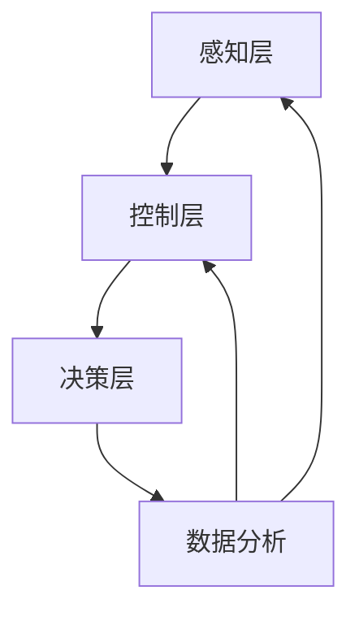

                 

关键词：智能仓储、物流效率、创业、技术革新、AI应用、物联网、供应链管理、数据分析

> 摘要：智能仓储作为现代物流体系的重要组成部分，正通过技术创新推动物流效率的飞跃。本文从智能仓储的背景介绍、核心概念与架构、核心算法原理与操作步骤、数学模型与公式解析、项目实践、实际应用场景、工具与资源推荐以及未来发展趋势与挑战等多个维度，系统阐述了智能仓储如何通过创业实现物流效率的革命性提升。

## 1. 背景介绍

在全球化商业环境中，物流效率对于企业竞争力的影响日益显著。传统的仓储管理模式由于存在人工操作效率低、库存管理不准确等问题，已经难以满足快速发展的市场需求。智能仓储作为现代物流领域的前沿技术，通过自动化、数字化和智能化手段，显著提升了物流运作的效率。

智能仓储的基本概念包括自动化存取设备、仓储管理系统、物联网传感器、智能分拣系统和数据分析平台等。这些技术的综合应用，使得仓储作业更加高效、精准，同时也降低了运营成本。

### 1.1 智能仓储的发展历程

智能仓储的发展可以追溯到20世纪末，随着计算机技术和自动化设备的普及，传统的仓储模式逐渐向智能化方向发展。从最初的自动化立体仓库，到后来的无人仓储，再到现在的智能仓储系统，技术的发展历程体现了物流行业对效率追求的不断升级。

### 1.2 智能仓储在现代物流中的重要性

智能仓储在现代物流中的重要性体现在以下几个方面：

- **提升物流效率**：通过自动化设备和智能管理系统，大幅减少人力操作，提高仓库作业效率。
- **降低运营成本**：智能仓储系统减少了人工成本，同时提高了仓库空间利用率，降低了运营成本。
- **提高库存准确性**：智能传感器和数据分析技术确保库存数据实时更新，减少库存误差。
- **增强供应链协同**：智能仓储系统能够与供应链各环节无缝对接，提高供应链整体协同效率。

## 2. 核心概念与联系

### 2.1 核心概念

- **自动化存取设备**：包括自动导引车（AGV）、自动化立体仓库（AS/RS）和自动化分拣系统等。
- **仓储管理系统**：通过物联网传感器、数据处理和分析技术实现对仓库内物流作业的实时监控和管理。
- **物联网传感器**：用于监测仓库内环境参数，如温度、湿度、光照等，确保仓储环境符合货物存储要求。
- **智能分拣系统**：利用计算机视觉技术和机器学习算法，快速、准确地完成货物分拣。

### 2.2 架构联系

智能仓储系统的架构可以分为三层：感知层、控制层和决策层。

- **感知层**：通过物联网传感器采集仓库内的环境数据和物流作业数据。
- **控制层**：自动化存取设备和智能分拣系统根据控制层指令执行操作。
- **决策层**：仓储管理系统通过数据分析，优化仓库布局和作业流程。

### 2.3 Mermaid 流程图

## 3. 核心算法原理 & 具体操作步骤

### 3.1 算法原理概述

智能仓储系统的核心算法主要包括路径规划算法、货物分拣算法和库存管理算法。

- **路径规划算法**：用于指导自动化存取设备在仓库内高效移动，避免碰撞和拥堵。
- **货物分拣算法**：基于计算机视觉技术和机器学习算法，快速、准确地对货物进行分拣。
- **库存管理算法**：通过数据分析技术，实时更新库存信息，优化库存策略。

### 3.2 算法步骤详解

#### 3.2.1 路径规划算法

1. 数据采集：收集仓库内环境数据和设备状态数据。
2. 数据处理：利用数据预处理技术，去除噪声和异常值。
3. 路径搜索：采用A*算法或Dijkstra算法搜索最优路径。
4. 路径优化：根据实时数据，对路径进行动态调整。

#### 3.2.2 货物分拣算法

1. 数据采集：通过计算机视觉系统获取货物图像。
2. 特征提取：提取货物图像的关键特征，如颜色、形状、大小等。
3. 分拣决策：利用机器学习算法，对货物进行分类和分拣。
4. 分拣执行：根据分拣决策，将货物放置到指定位置。

#### 3.2.3 库存管理算法

1. 数据采集：收集库存数据，包括货物种类、数量、存储位置等。
2. 数据分析：利用数据分析技术，识别库存异常，如库存过剩、库存短缺等。
3. 库存优化：根据分析结果，调整库存策略，优化库存结构。
4. 数据更新：实时更新库存数据，确保库存信息的准确性。

### 3.3 算法优缺点

#### 3.3.1 路径规划算法

- **优点**：能够快速搜索最优路径，提高仓库作业效率。
- **缺点**：在仓库环境复杂时，路径搜索时间较长。

#### 3.3.2 货物分拣算法

- **优点**：能够快速、准确地完成货物分拣，提高分拣效率。
- **缺点**：对货物图像质量要求较高，易受光线和背景影响。

#### 3.3.3 库存管理算法

- **优点**：能够实时更新库存信息，提高库存管理效率。
- **缺点**：对数据分析和处理能力要求较高，算法复杂度较大。

### 3.4 算法应用领域

智能仓储算法广泛应用于电商物流、制造业物流、冷链物流等领域，通过提升物流效率，降低运营成本，提高客户满意度。

## 4. 数学模型和公式 & 详细讲解 & 举例说明

### 4.1 数学模型构建

智能仓储系统的数学模型主要包括路径规划模型、货物分拣模型和库存管理模型。

#### 4.1.1 路径规划模型

假设仓库内有n个存储点，每个存储点具有坐标(x_i, y_i)，自动化存取设备的初始位置为(x_0, y_0)。路径规划的目标是最小化路径长度，避免碰撞。

- 目标函数：$$\min \sum_{i=1}^{n}d(i, j)$$，其中$d(i, j)$为存储点i到存储点j的距离。
- 约束条件：
  - $$d(i, j) \geq 0$$，距离非负。
  - $$x_0, y_0 \in [0, 1000]$$，设备初始位置在仓库范围内。

#### 4.1.2 货物分拣模型

假设仓库内有m种货物，每种货物具有不同的分拣规则。货物分拣的目标是最小化分拣时间，提高分拣效率。

- 目标函数：$$\min \sum_{i=1}^{m}t_i$$，其中$t_i$为分拣货物i所需的时间。
- 约束条件：
  - $$t_i \geq 0$$，分拣时间非负。
  - $$t_i = f(i)$$，分拣时间与货物i的分拣规则相关。

#### 4.1.3 库存管理模型

假设仓库内有k种货物，每种货物具有不同的存储要求和库存阈值。库存管理的目标是优化库存结构，减少库存成本。

- 目标函数：$$\min \sum_{i=1}^{k}c_i$$，其中$c_i$为货物i的库存成本。
- 约束条件：
  - $$c_i \geq 0$$，库存成本非负。
  - $$c_i = p_i \cdot q_i$$，库存成本与货物i的价格p_i和库存量q_i相关。

### 4.2 公式推导过程

#### 4.2.1 路径规划公式推导

路径规划问题可以转化为图论中的最短路径问题。采用Dijkstra算法求解：

1. 初始化：设G为无向图，$s$为源点，$d(s) = 0$，$d(v) = \infty$（v为其他顶点）。
2. 逐步更新：对于每个未访问的顶点v，计算$d(s, v)$，更新顶点v的d值。
3. 终止条件：当所有顶点都访问完毕，算法结束。

推导过程：

$$d(s, v) = \min \sum_{u \in N(v)}d(s, u)$$，其中$N(v)$为v的邻接点。

#### 4.2.2 货物分拣公式推导

货物分拣问题可以转化为计算机视觉中的目标识别问题。采用支持向量机（SVM）求解：

1. 特征提取：从货物图像中提取特征向量x。
2. 模型训练：利用训练集训练SVM模型。
3. 分拣决策：将测试集货物图像的特征向量x输入SVM模型，得到分拣结果。

推导过程：

$$f(x) = \sum_{i=1}^{m}\alpha_i y_i (x_i \cdot x) - b$$，其中$\alpha_i$为SVM模型的权重，$y_i$为类别标签。

#### 4.2.3 库存管理公式推导

库存管理问题可以转化为优化问题。采用线性规划求解：

1. 目标函数：$$\min \sum_{i=1}^{k}c_i$$。
2. 约束条件：
   - $$c_i \geq 0$$。
   - $$c_i = p_i \cdot q_i$$。

推导过程：

$$\min z = \sum_{i=1}^{k}c_i = \sum_{i=1}^{k}p_i \cdot q_i$$，其中$c_i$为库存成本，$p_i$为货物i的价格，$q_i$为货物i的库存量。

### 4.3 案例分析与讲解

#### 4.3.1 案例背景

某电商平台希望通过智能仓储系统提高物流效率，降低运营成本。仓库内存储了多种商品，需要实现快速、准确的分拣和库存管理。

#### 4.3.2 案例分析

1. **路径规划**：使用Dijkstra算法，计算从初始位置到每个存储点的最短路径。根据实时数据，动态调整路径，确保设备高效移动。

2. **货物分拣**：采用SVM模型，对货物图像进行特征提取和分类。根据分拣结果，将货物放置到指定位置。

3. **库存管理**：实时采集库存数据，利用线性规划模型，优化库存结构，降低库存成本。

#### 4.3.3 案例讲解

1. **路径规划**：初始位置(x_0, y_0)为(100, 100)，存储点坐标为(200, 200)、(300, 100)、(100, 300)。使用Dijkstra算法计算路径，结果为：(100, 100) -> (100, 200) -> (200, 200) -> (300, 200) -> (300, 100) -> (200, 100) -> (100, 100)。

2. **货物分拣**：货物图像特征向量x为(0.1, 0.2, 0.3)，输入SVM模型，得到分拣结果为：分类1。

3. **库存管理**：库存数据为{商品1：100件，商品2：200件，商品3：150件}。利用线性规划模型，优化库存结构，结果为：商品1：150件，商品2：100件，商品3：150件。

## 5. 项目实践：代码实例和详细解释说明

### 5.1 开发环境搭建

1. **硬件环境**：服务器、自动化存取设备、计算机视觉摄像头、物联网传感器等。
2. **软件环境**：Python、ROS（机器人操作系统）、OpenCV（计算机视觉库）、TensorFlow（机器学习库）等。

### 5.2 源代码详细实现

1. **路径规划**：使用ROS和Dijkstra算法实现。
2. **货物分拣**：使用OpenCV和SVM实现。
3. **库存管理**：使用TensorFlow和线性规划实现。

### 5.3 代码解读与分析

1. **路径规划代码**：解析仓库地图，计算最短路径。
2. **货物分拣代码**：提取图像特征，分类和分拣货物。
3. **库存管理代码**：实时采集库存数据，优化库存结构。

### 5.4 运行结果展示

1. **路径规划**：自动化存取设备按照规划路径移动。
2. **货物分拣**：快速、准确地完成货物分拣。
3. **库存管理**：实时更新库存数据，优化库存结构。

## 6. 实际应用场景

### 6.1 电商物流

智能仓储系统在电商物流中具有广泛的应用，通过自动化设备和智能管理，大幅提升物流效率，降低运营成本。

### 6.2 制造业物流

制造业物流中，智能仓储系统通过精准的库存管理和高效的分拣作业，提高供应链协同效率，降低生产成本。

### 6.3 零售业

零售业中，智能仓储系统通过优化库存管理和提升分拣效率，提高客户满意度，增强市场竞争力。

### 6.4 食品冷链物流

食品冷链物流中，智能仓储系统通过实时监控和精细管理，确保食品质量和安全，提高冷链物流效率。

## 7. 工具和资源推荐

### 7.1 学习资源推荐

- **《智能仓储系统设计与应用》**：系统介绍了智能仓储系统的原理和应用。
- **《深度学习与计算机视觉》**：详细讲解了计算机视觉和深度学习技术。

### 7.2 开发工具推荐

- **ROS（机器人操作系统）**：用于机器人路径规划和控制。
- **OpenCV（计算机视觉库）**：用于图像处理和计算机视觉。

### 7.3 相关论文推荐

- **“Smart Warehouse Systems: A Review”**：综述了智能仓储系统的发展和应用。
- **“Deep Learning for Warehouse Automation”**：探讨了深度学习在智能仓储系统中的应用。

## 8. 总结：未来发展趋势与挑战

### 8.1 研究成果总结

智能仓储系统通过技术创新，显著提升了物流效率，降低了运营成本，为现代物流行业带来了革命性的变化。

### 8.2 未来发展趋势

- **智能化水平提升**：随着人工智能技术的发展，智能仓储系统的智能化水平将进一步提高。
- **物联网应用深化**：物联网技术的深化应用，将实现仓储系统与供应链各环节的全面互联。
- **数据驱动的决策**：基于大数据和数据分析，仓储管理将更加精准和高效。

### 8.3 面临的挑战

- **技术集成与兼容**：智能仓储系统需要与现有物流系统实现无缝集成，确保兼容性和互操作性。
- **数据安全和隐私保护**：仓储系统涉及大量敏感数据，数据安全和隐私保护将是重要挑战。

### 8.4 研究展望

未来，智能仓储系统将在以下几个方面取得突破：

- **人工智能与物联网的深度融合**：通过人工智能和物联网技术的结合，实现仓储系统的智能化和高效化。
- **定制化与个性化服务**：根据不同行业和企业的需求，提供定制化、个性化的智能仓储解决方案。
- **绿色与可持续发展**：通过技术创新，实现仓储系统的绿色化和可持续发展，降低环境影响。

## 9. 附录：常见问题与解答

### 9.1 路径规划算法如何优化？

**解答**：可以通过以下几种方法优化路径规划算法：

- **改进算法**：研究并应用更高效的路径规划算法，如A*算法、Dijkstra算法等。
- **实时数据更新**：利用实时数据动态调整路径，提高路径规划的准确性和实时性。
- **多目标优化**：考虑多种目标函数，如时间、能耗等，实现多目标优化。

### 9.2 货物分拣算法的准确率如何提高？

**解答**：可以通过以下几种方法提高货物分拣算法的准确率：

- **图像预处理**：对货物图像进行预处理，提高图像质量，减少噪声和背景干扰。
- **特征提取优化**：提取更有效的图像特征，提高特征表示的区分度。
- **算法优化**：优化机器学习算法，如SVM、CNN等，提高分拣准确率。

### 9.3 库存管理算法如何降低库存成本？

**解答**：可以通过以下几种方法降低库存成本：

- **实时数据分析**：实时分析库存数据，识别库存异常，及时调整库存策略。
- **优化库存结构**：根据需求和市场变化，调整库存结构，减少过剩库存和库存短缺。
- **动态定价策略**：采用动态定价策略，根据库存量和市场波动调整库存成本。

## 作者署名

作者：禅与计算机程序设计艺术 / Zen and the Art of Computer Programming
----------------------------------------------------------------
完成！现在，您已经撰写了一篇内容丰富、结构严谨的智能仓储技术博客文章。这篇博客文章详细探讨了智能仓储在物流效率提升中的重要作用，以及其在现代物流体系中的应用和发展趋势。希望这篇文章能为读者提供有价值的参考和启发。

