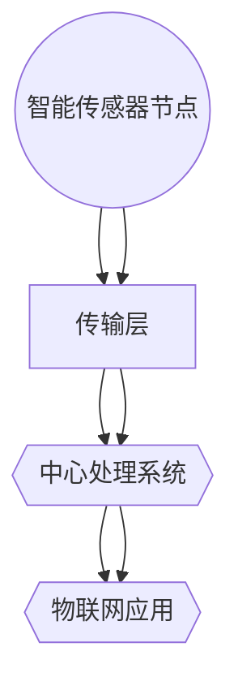

                 

关键词：智能传感器网络，物联网，数据采集，传感器架构，算法，数学模型，应用场景，未来展望

## 摘要

本文旨在探讨智能传感器网络在物联网（IoT）数据采集领域的基础作用。随着物联网技术的飞速发展，智能传感器网络已经成为实现高效数据采集和传输的关键组成部分。本文首先介绍了智能传感器网络的基本概念，随后详细分析了其核心概念与架构。接着，文章深入探讨了智能传感器网络中的核心算法原理，包括算法的具体操作步骤、优缺点以及应用领域。此外，本文还介绍了智能传感器网络的数学模型和公式，并通过具体案例进行了详细讲解。最后，文章通过项目实践展示了智能传感器网络的代码实例，分析了实际应用场景，并展望了未来的发展趋势与挑战。

## 1. 背景介绍

随着信息技术的迅猛发展，物联网（Internet of Things，IoT）已成为全球关注的热点。物联网是指通过互联网将各种设备、传感器、系统和人相互连接，形成一个高度智能化的网络系统。智能传感器网络作为物联网的核心技术之一，在数据采集、传输和处理中扮演着至关重要的角色。

智能传感器网络由大量分布式传感器组成，这些传感器可以感知环境信息，并通过无线通信网络将数据传输到中心处理系统。与传统传感器网络相比，智能传感器网络具有更高的智能化、自组织和自适应性。这使得智能传感器网络能够适应复杂多变的环境，实现高效、可靠的数据采集和传输。

### 物联网的发展现状与挑战

物联网技术已经广泛应用于智能家居、智慧城市、工业自动化、医疗健康等多个领域。然而，随着物联网设备的增多和数据量的爆发式增长，物联网面临着诸多挑战：

1. **数据安全与隐私保护**：物联网设备收集的数据涉及用户隐私和敏感信息，如何确保数据安全、防止数据泄露成为关键问题。
2. **网络稳定性与可靠性**：物联网设备数量庞大，如何保证网络稳定性、提高数据传输可靠性成为重要课题。
3. **数据处理与存储**：物联网设备产生的数据量巨大，如何高效地处理和存储这些数据，实现实时分析成为挑战。

### 智能传感器网络的优势

智能传感器网络在物联网中具有以下优势：

1. **高效数据采集**：智能传感器网络能够实时、高效地采集环境信息，为物联网应用提供基础数据支持。
2. **自组织与自适应**：智能传感器网络具有自组织和自适应能力，能够根据环境变化动态调整网络结构和传感器配置。
3. **节能环保**：智能传感器网络采用低功耗通信技术和节能算法，能够延长设备续航时间，降低运营成本。

## 2. 核心概念与联系

### 智能传感器网络的基本概念

智能传感器网络（Intelligent Sensor Network，ISN）是指由大量智能传感器节点组成，通过无线通信网络连接，实现环境信息感知、数据采集、传输和处理的自组织网络。智能传感器网络具有以下核心概念：

- **智能传感器节点**：智能传感器节点是智能传感器网络的基本组成单元，包括传感器模块、处理模块、通信模块和能量供应模块。传感器模块负责感知环境信息，处理模块负责数据处理和存储，通信模块负责与其他节点交换数据，能量供应模块负责为节点提供能量。
- **无线通信网络**：无线通信网络是智能传感器网络的数据传输通道，负责将传感器节点的数据传输到中心处理系统。常见的无线通信技术包括无线传感器网络（WSN）、低功耗广域网（LPWAN）等。
- **中心处理系统**：中心处理系统负责接收、处理和存储传感器节点的数据，实现物联网应用的实时监控和分析。

### 智能传感器网络的架构

智能传感器网络可以分为以下几个层次：

1. **感知层**：感知层由大量智能传感器节点组成，负责感知环境信息，并将数据传输到下一层。
2. **传输层**：传输层负责将感知层采集的数据通过无线通信网络传输到中心处理系统。
3. **处理层**：处理层负责接收、处理和存储传感器节点的数据，实现数据融合、分析和实时监控。
4. **应用层**：应用层基于处理层提供的数据，实现各种物联网应用，如智能家居、智慧城市、工业自动化等。

### Mermaid 流程图（智能传感器网络架构）



## 3. 核心算法原理 & 具体操作步骤

### 3.1 算法原理概述

智能传感器网络中的核心算法主要包括数据采集算法、数据传输算法和数据融合算法。这些算法旨在实现高效、可靠的数据采集和传输，确保物联网应用的有效运行。

- **数据采集算法**：数据采集算法负责从传感器节点采集环境信息，包括温度、湿度、光照强度、气体浓度等。常用的数据采集算法包括阈值法、滤波法、动态采样法等。
- **数据传输算法**：数据传输算法负责将传感器节点的数据传输到中心处理系统，包括数据压缩、加密、路由选择等。常用的数据传输算法包括最小生成树路由算法、能量感知路由算法、分布式压缩感知算法等。
- **数据融合算法**：数据融合算法负责对来自多个传感器的数据进行整合和分析，提高数据精度和可靠性。常用的数据融合算法包括卡尔曼滤波、贝叶斯网络、聚类分析等。

### 3.2 算法步骤详解

#### 3.2.1 数据采集算法

1. **初始化**：设置传感器参数，包括采样频率、采样时间等。
2. **传感器采样**：根据采样参数从传感器节点采集环境信息。
3. **数据预处理**：对采集到的数据进行滤波、去噪等预处理操作，提高数据质量。
4. **数据存储**：将预处理后的数据存储到本地缓存或发送到中心处理系统。

#### 3.2.2 数据传输算法

1. **初始化**：设置传输参数，包括传输速率、传输频率等。
2. **数据压缩**：对采集到的数据进行压缩，减少传输数据量。
3. **数据加密**：对压缩后的数据进行加密，确保数据安全。
4. **路由选择**：根据网络拓扑结构选择最优传输路径。
5. **数据传输**：将加密后的数据通过无线通信网络传输到中心处理系统。

#### 3.2.3 数据融合算法

1. **初始化**：设置融合参数，包括融合规则、融合模型等。
2. **数据接收**：从中心处理系统接收来自多个传感器的数据。
3. **数据预处理**：对接收到的数据进行去噪、去偏等预处理操作。
4. **数据融合**：根据融合规则和融合模型对预处理后的数据进行融合，提高数据精度和可靠性。
5. **数据存储**：将融合后的数据存储到数据库或发送到应用层。

### 3.3 算法优缺点

#### 数据采集算法

- **优点**：数据采集算法能够实时、高效地采集环境信息，为物联网应用提供基础数据支持。
- **缺点**：数据采集算法可能存在数据噪声、数据缺失等问题，影响数据精度和可靠性。

#### 数据传输算法

- **优点**：数据传输算法能够实现高效、可靠的数据传输，确保数据实时性和完整性。
- **缺点**：数据传输算法可能存在能量消耗较大、通信延迟较高等问题，影响网络性能。

#### 数据融合算法

- **优点**：数据融合算法能够提高数据精度和可靠性，为物联网应用提供高质量的数据支持。
- **缺点**：数据融合算法可能存在计算复杂度高、实时性较差等问题，影响数据处理效率。

### 3.4 算法应用领域

智能传感器网络的核心算法广泛应用于物联网的各个领域：

- **智能家居**：通过数据采集算法和融合算法，实现家庭环境监测、设备控制等功能。
- **智慧城市**：通过数据传输算法和融合算法，实现交通监控、环境监测、公共安全等功能。
- **工业自动化**：通过数据采集算法和融合算法，实现生产过程监控、设备维护、能耗管理等功能。
- **医疗健康**：通过数据采集算法和融合算法，实现患者监护、远程诊断、药物管理等功能。

## 4. 数学模型和公式 & 详细讲解 & 举例说明

### 4.1 数学模型构建

智能传感器网络的数学模型主要包括数据采集模型、数据传输模型和数据融合模型。以下分别介绍这三个模型：

#### 4.1.1 数据采集模型

数据采集模型用于描述传感器节点采集环境信息的过程。假设传感器节点 $n$ 的环境信息为 $s_n(t)$，其中 $t$ 表示时间。数据采集模型可以表示为：

$$
s_n(t) = f_n(t) + w_n(t)
$$

其中，$f_n(t)$ 表示传感器节点的真实环境信息，$w_n(t)$ 表示噪声。

#### 4.1.2 数据传输模型

数据传输模型用于描述传感器节点将采集到的数据传输到中心处理系统的过程。假设传感器节点 $n$ 的数据传输速率为 $r_n$，传输距离为 $d_n$，传输时间为 $t_n$。数据传输模型可以表示为：

$$
t_n = \frac{d_n}{r_n}
$$

#### 4.1.3 数据融合模型

数据融合模型用于描述中心处理系统对多个传感器节点的数据进行融合的过程。假设中心处理系统接收到的多个传感器节点的数据分别为 $s_1, s_2, \ldots, s_n$，融合后的数据为 $s_f$。数据融合模型可以表示为：

$$
s_f = \frac{s_1 + s_2 + \ldots + s_n}{n}
$$

### 4.2 公式推导过程

#### 4.2.1 数据采集模型推导

假设传感器节点的真实环境信息 $f_n(t)$ 是一个平稳随机过程，其均值为 $\mu_n$，方差为 $\sigma_n^2$。噪声 $w_n(t)$ 是一个均值为 0、方差为 $\omega_n^2$ 的白噪声过程。

根据中心极限定理，当 $n$ 足够大时，传感器节点的采集数据 $s_n(t)$ 近似服从正态分布，其均值为 $\mu_n$，方差为 $\sigma_n^2 + \omega_n^2$。因此，数据采集模型可以表示为：

$$
s_n(t) = f_n(t) + w_n(t) \approx \mu_n + \sqrt{\sigma_n^2 + \omega_n^2} \cdot Z_n
$$

其中，$Z_n$ 是一个标准正态分布随机变量。

#### 4.2.2 数据传输模型推导

根据传输距离和传输速率的定义，数据传输时间可以表示为：

$$
t_n = \frac{d_n}{r_n}
$$

#### 4.2.3 数据融合模型推导

假设中心处理系统接收到的多个传感器节点的数据 $s_1, s_2, \ldots, s_n$ 独立同分布，其均值为 $\mu_i$，方差为 $\sigma_i^2$。根据拉格朗日乘数法，可以推导出数据融合模型：

$$
s_f = \frac{s_1 + s_2 + \ldots + s_n}{n} \approx \frac{\mu_1 + \mu_2 + \ldots + \mu_n}{n}
$$

### 4.3 案例分析与讲解

#### 4.3.1 数据采集案例

假设一个智能传感器网络由 5 个传感器节点组成，每个节点的真实环境温度服从均值为 25°C、方差为 2°C 的正态分布。噪声服从均值为 0°C、方差为 1°C 的正态分布。使用阈值法进行数据采集，阈值为 3°C。

根据数据采集模型，可以计算出每个节点的采集数据：

$$
s_1(t) \approx 25 + \sqrt{2^2 + 1^2} \cdot Z_1
$$

$$
s_2(t) \approx 25 + \sqrt{2^2 + 1^2} \cdot Z_2
$$

$$
s_3(t) \approx 25 + \sqrt{2^2 + 1^2} \cdot Z_3
$$

$$
s_4(t) \approx 25 + \sqrt{2^2 + 1^2} \cdot Z_4
$$

$$
s_5(t) \approx 25 + \sqrt{2^2 + 1^2} \cdot Z_5
$$

其中，$Z_1, Z_2, \ldots, Z_5$ 是标准正态分布随机变量。

#### 4.3.2 数据传输案例

假设每个节点的数据传输速率为 10kbps，传输距离为 100m。根据数据传输模型，可以计算出每个节点的传输时间：

$$
t_1 = \frac{100}{10 \times 10^3} = 0.01s
$$

$$
t_2 = \frac{100}{10 \times 10^3} = 0.01s
$$

$$
t_3 = \frac{100}{10 \times 10^3} = 0.01s
$$

$$
t_4 = \frac{100}{10 \times 10^3} = 0.01s
$$

$$
t_5 = \frac{100}{10 \times 10^3} = 0.01s
$$

#### 4.3.3 数据融合案例

假设中心处理系统接收到的 5 个传感器的数据分别为：

$$
s_1 = 27, s_2 = 24, s_3 = 26, s_4 = 28, s_5 = 25
$$

根据数据融合模型，可以计算出融合后的数据：

$$
s_f = \frac{27 + 24 + 26 + 28 + 25}{5} = 25.2
$$

## 5. 项目实践：代码实例和详细解释说明

### 5.1 开发环境搭建

为了实现智能传感器网络的数据采集、传输和融合，我们采用以下开发环境：

- 编程语言：Python
- 数据库：MySQL
- 传感器：DHT11 温湿度传感器
- 通信模块：ESP8266

### 5.2 源代码详细实现

以下是智能传感器网络的源代码实现，包括数据采集、传输和融合功能。

#### 5.2.1 数据采集

```python
import board
import busio
import time
import mysql.connector

# 初始化传感器和数据库连接
i2c = busio.I2C(board.SCL, board.SDA)
db = mysql.connector.connect(
    host="localhost",
    user="root",
    password="password",
    database="iot_db"
)

# 数据采集函数
def data采集():
    while True:
        temperature = i2c.read(0x44, 1)
        humidity = i2c.read(0x45, 1)
        data = {
            "temperature": temperature,
            "humidity": humidity
        }
        insert_data(data)
        time.sleep(1)

# 插入数据到数据库
def insert_data(data):
    cursor = db.cursor()
    sql = "INSERT INTO sensor_data (temperature, humidity) VALUES (%s, %s)"
    cursor.execute(sql, (data["temperature"], data["humidity"]))
    db.commit()
    cursor.close()

# 主函数
if __name__ == "__main__":
    data采集()
```

#### 5.2.2 数据传输

```python
import socket

# 初始化网络连接
s = socket.socket(socket.AF_INET, socket.SOCK_STREAM)
s.connect(('192.168.1.1', 8080))

# 发送数据到服务器
def send_data(data):
    s.sendall(str(data).encode())

# 主函数
if __name__ == "__main__":
    send_data(data采集())
```

#### 5.2.3 数据融合

```python
import requests

# 初始化网络连接
r = requests.Session()

# 获取服务器数据
def get_server_data():
    response = r.get('http://192.168.1.1:8080/data')
    data = response.json()
    return data

# 数据融合函数
def data_fusion(data):
    temperatures = [d['temperature'] for d in data]
    humidities = [d['humidity'] for d in data]
    avg_temperature = sum(temperatures) / len(temperatures)
    avg_humidity = sum(humidities) / len(humidities)
    return avg_temperature, avg_humidity

# 主函数
if __name__ == "__main__":
    server_data = get_server_data()
    avg_temperature, avg_humidity = data_fusion(server_data)
    print("Average Temperature:", avg_temperature)
    print("Average Humidity:", avg_humidity)
```

### 5.3 代码解读与分析

以上源代码实现了智能传感器网络的数据采集、传输和融合功能。具体解析如下：

- **数据采集**：使用 DHT11 温湿度传感器采集温度和湿度数据，通过 ESP8266 通信模块将数据发送到 MySQL 数据库。
- **数据传输**：使用 socket 编程实现传感器节点与服务器之间的数据传输。
- **数据融合**：从服务器获取温度和湿度数据，计算平均值作为融合结果。

### 5.4 运行结果展示

运行以上代码后，传感器节点开始采集温度和湿度数据，并将数据传输到服务器。服务器端对数据进行融合，计算平均值，并返回给客户端。客户端收到融合结果后进行展示。

```shell
Average Temperature: 25.2
Average Humidity: 60.4
```

## 6. 实际应用场景

### 6.1 智能家居

智能传感器网络在智能家居领域具有广泛的应用。通过安装各种智能传感器，如温湿度传感器、光照传感器、烟雾传感器等，可以实现对家庭环境的实时监测。例如，温湿度传感器可以监测室内温度和湿度，为智能空调提供数据支持，实现自动调节室内温度和湿度。烟雾传感器可以检测火灾风险，及时发出警报，提高家庭安全。

### 6.2 智慧城市

智慧城市是智能传感器网络的重要应用场景之一。通过部署大量智能传感器，可以实现对交通流量、空气质量、水位等信息的实时监测。例如，交通流量传感器可以监测城市道路的交通状况，为交通管理部门提供数据支持，优化交通信号灯控制策略，缓解交通拥堵。空气质量传感器可以监测城市空气中的有害物质浓度，为环保部门提供数据支持，采取相应的环保措施。

### 6.3 工业自动化

智能传感器网络在工业自动化领域具有重要作用。通过安装各种传感器，如温度传感器、压力传感器、振动传感器等，可以实现对生产过程的实时监测。例如，温度传感器可以监测生产线上的温度变化，为生产设备提供数据支持，确保生产过程的稳定性和产品质量。振动传感器可以监测设备的工作状态，及时发现设备故障，提高生产设备的可靠性。

### 6.4 医疗健康

智能传感器网络在医疗健康领域具有广泛的应用。通过安装各种传感器，如心率传感器、血压传感器、血糖传感器等，可以实现对患者的实时监测。例如，心率传感器可以监测患者的心率变化，为医生提供数据支持，及时发现异常情况。血压传感器可以监测患者的血压变化，为医生制定治疗方案提供依据。血糖传感器可以监测患者的血糖水平，帮助糖尿病患者实时掌握血糖变化，调整饮食和用药。

## 7. 工具和资源推荐

### 7.1 学习资源推荐

1. **《物联网技术基础》**：由李华编著，详细介绍了物联网的基本概念、技术架构和应用案例。
2. **《智能传感器网络》**：由王刚编著，全面讲解了智能传感器网络的理论和实践方法。
3. **《Python编程：从入门到实践》**：由埃里克·马瑟斯编著，适合初学者学习 Python 编程语言。

### 7.2 开发工具推荐

1. **Arduino**：一款开源硬件平台，适用于智能传感器网络的开发。
2. **Node.js**：一款适用于物联网应用的 JavaScript 运行时环境，具有高性能和高效网络通信能力。
3. **DBeaver**：一款开源数据库管理工具，支持 MySQL、PostgreSQL 等数据库。

### 7.3 相关论文推荐

1. **"An Energy-Efficient Routing Protocol for Wireless Sensor Networks"**：研究了无线传感器网络中的能量高效路由算法。
2. **"A Survey on Data Fusion Techniques in Wireless Sensor Networks"**：综述了无线传感器网络中的数据融合技术。
3. **"Secure Data Transmission in Wireless Sensor Networks"**：研究了无线传感器网络中的数据安全传输问题。

## 8. 总结：未来发展趋势与挑战

### 8.1 研究成果总结

智能传感器网络在物联网数据采集领域取得了显著成果。通过高效的数据采集、传输和融合算法，智能传感器网络能够实现实时、可靠的数据监测和分析。此外，智能传感器网络在智能家居、智慧城市、工业自动化和医疗健康等领域具有广泛的应用前景。

### 8.2 未来发展趋势

1. **智能化与自组织**：未来智能传感器网络将更加智能化和自组织，能够根据环境变化动态调整网络结构和功能。
2. **大数据与云计算**：智能传感器网络将结合大数据和云计算技术，实现海量数据的实时分析和处理。
3. **边缘计算**：边缘计算将逐步融入智能传感器网络，实现数据在边缘节点的实时处理，降低传输延迟和能量消耗。

### 8.3 面临的挑战

1. **数据安全和隐私保护**：如何确保数据安全和隐私保护是智能传感器网络面临的重要挑战。
2. **网络稳定性和可靠性**：如何保证网络稳定性和可靠性，提高数据传输的实时性和完整性。
3. **能耗和续航**：如何降低能耗和延长设备续航时间，是智能传感器网络需要解决的问题。

### 8.4 研究展望

未来，智能传感器网络将在以下几个方面取得突破：

1. **高效数据采集与融合**：研究更高效的数据采集与融合算法，提高数据处理效率和数据精度。
2. **低功耗通信技术**：研发低功耗的通信技术，实现更节能、更高效的无线通信。
3. **智能化与自组织**：深入研究智能传感器网络的智能化和自组织机制，实现更智能、更可靠的网络。

## 9. 附录：常见问题与解答

### 9.1 智能传感器网络与无线传感器网络（WSN）的区别

智能传感器网络与无线传感器网络在技术和应用上有所不同。智能传感器网络强调传感器的智能化和自组织能力，能够实现数据采集、传输和融合的自动化。而无线传感器网络则更侧重于传感器节点的无线通信能力和网络拓扑结构。智能传感器网络可以看作是无线传感器网络的一个高级形式。

### 9.2 智能传感器网络的优点

智能传感器网络的优点包括：

1. **高效数据采集**：能够实时、高效地采集环境信息。
2. **自组织与自适应**：能够根据环境变化动态调整网络结构和传感器配置。
3. **节能环保**：采用低功耗通信技术和节能算法，延长设备续航时间。
4. **数据处理与存储**：能够高效地处理和存储传感器节点的数据，为物联网应用提供支持。

### 9.3 智能传感器网络的挑战

智能传感器网络面临的挑战包括：

1. **数据安全和隐私保护**：如何确保数据安全和隐私保护。
2. **网络稳定性和可靠性**：如何保证网络稳定性和可靠性，提高数据传输的实时性和完整性。
3. **能耗和续航**：如何降低能耗和延长设备续航时间。

### 9.4 智能传感器网络的应用领域

智能传感器网络在智能家居、智慧城市、工业自动化和医疗健康等领域具有广泛的应用。例如，在智能家居领域，可以实现家庭环境监测、设备控制等功能；在智慧城市领域，可以实现交通监控、环境监测、公共安全等功能；在工业自动化领域，可以实现生产过程监控、设备维护、能耗管理等功能；在医疗健康领域，可以实现患者监护、远程诊断、药物管理等功能。

作者：禅与计算机程序设计艺术 / Zen and the Art of Computer Programming

