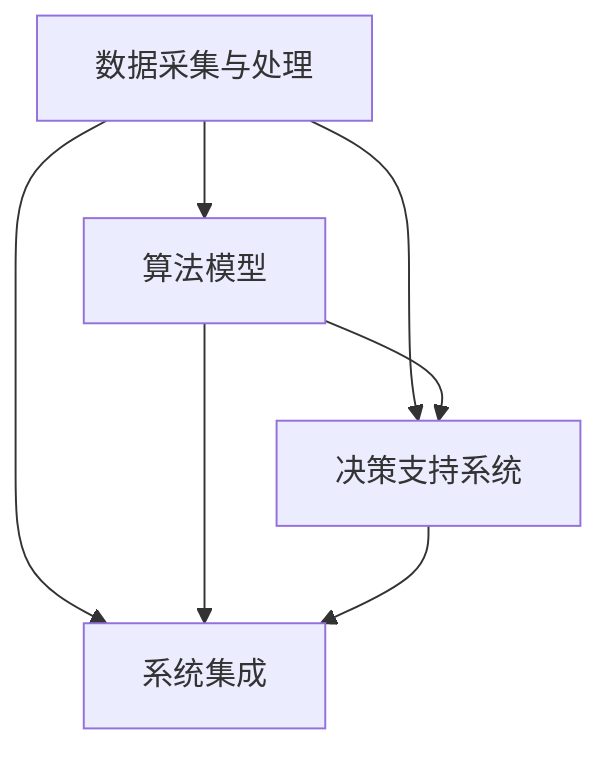

                 

在当今全球化的商业环境中，供应链管理已经成为企业运营成功的关键因素。随着数据量的爆发式增长和商业决策复杂性的增加，传统的供应链优化方法已经难以满足现代企业的需求。人工智能（AI）大模型的应用为供应链优化带来了新的机遇和挑战。本文将深入探讨AI大模型在智能供应链优化中的应用，探讨其核心概念、算法原理、数学模型以及实际应用场景。

> 关键词：智能供应链、AI大模型、优化算法、数学模型、实际应用

> 摘要：本文首先介绍了智能供应链优化的重要性，然后探讨了AI大模型的核心概念和架构，详细阐述了核心算法原理和数学模型，并通过案例分析和代码实例展示了其在实际供应链优化中的应用。最后，本文提出了未来应用展望和面临的挑战。

## 1. 背景介绍

供应链管理是企业管理的重要一环，涉及到从原材料采购、生产制造、产品分销到最终用户交付的整个过程。高效的供应链管理能够降低成本、提高生产效率、增强市场响应速度，从而提高企业的竞争力。然而，传统的供应链优化方法往往依赖于预定的规则和经验，难以应对复杂的供应链环境和动态的市场需求。

近年来，随着大数据、云计算和人工智能技术的发展，AI大模型在各个领域的应用逐渐成熟。在供应链管理中，AI大模型的应用不仅能够处理海量数据，还能够通过学习和预测分析，提供智能决策支持，从而实现供应链的优化。

### 1.1 AI大模型的兴起

AI大模型是指具有大规模参数和复杂结构的深度学习模型。这些模型通过在大规模数据集上进行训练，可以自动学习数据的特征和规律，从而实现对复杂问题的建模和预测。典型的AI大模型包括深度神经网络（DNN）、循环神经网络（RNN）、变换器（Transformer）等。

随着计算能力的提升和数据量的爆发式增长，AI大模型在各个领域的应用越来越广泛。从自然语言处理到计算机视觉，从推荐系统到自动驾驶，AI大模型都在发挥着重要的作用。在供应链管理中，AI大模型的应用为供应链优化提供了新的思路和方法。

### 1.2 智能供应链优化的重要性

智能供应链优化是指利用人工智能技术对供应链各环节进行优化，以实现整体供应链的效率和效益最大化。随着全球供应链的复杂性和不确定性增加，智能供应链优化已经成为企业提升竞争力的重要手段。

首先，智能供应链优化能够提高供应链的透明度和可追溯性。通过AI大模型对供应链各环节的数据进行实时分析和预测，企业可以更好地了解供应链的运行状态，从而提高决策的准确性。

其次，智能供应链优化能够降低供应链的成本。通过优化库存管理、运输调度和采购策略，企业可以减少库存积压、降低运输成本，从而提高整体供应链的效益。

最后，智能供应链优化能够提高企业的市场响应速度。通过实时监控市场动态和需求变化，企业可以快速调整供应链策略，以适应市场变化，从而提高市场竞争力。

## 2. 核心概念与联系

### 2.1 智能供应链优化的核心概念

智能供应链优化涉及到多个核心概念，包括数据采集与处理、算法模型、决策支持系统和系统集成。这些概念相互联系，共同构成了智能供应链优化的技术框架。

- **数据采集与处理**：数据是智能供应链优化的基础。通过传感器、ERP系统、物联网设备等，企业可以实时采集供应链各环节的数据。数据采集后，需要进行清洗、转换和整合，以便于后续的算法分析和预测。

- **算法模型**：算法模型是智能供应链优化的核心。常见的算法模型包括深度学习模型、优化算法、决策树等。这些模型通过对历史数据的学习，可以预测供应链的未来状态，并提供优化建议。

- **决策支持系统**：决策支持系统是智能供应链优化的应用平台。它将算法模型的结果可视化，并提供决策建议，帮助企业进行供应链优化。

- **系统集成**：系统集成是将智能供应链优化技术融入到企业的现有系统中。通过系统集成，企业可以实现对供应链各环节的实时监控和优化，从而提高整体供应链的效率。

### 2.2 核心概念原理和架构的 Mermaid 流程图



## 3. 核心算法原理 & 具体操作步骤

### 3.1 算法原理概述

智能供应链优化的核心算法主要包括深度学习模型和优化算法。其中，深度学习模型主要用于数据分析和预测，而优化算法则用于根据预测结果制定优化策略。

- **深度学习模型**：深度学习模型通过多层神经网络对数据进行特征提取和学习，从而实现对数据的建模和预测。常见的深度学习模型包括卷积神经网络（CNN）、循环神经网络（RNN）和变换器（Transformer）等。

- **优化算法**：优化算法用于根据预测结果制定优化策略，以实现供应链的效率最大化。常见的优化算法包括线性规划、整数规划和遗传算法等。

### 3.2 算法步骤详解

智能供应链优化的算法步骤可以分为以下几个阶段：

1. **数据采集与预处理**：从供应链各环节采集数据，包括库存数据、销售数据、运输数据等。对数据进行清洗、转换和整合，以便于后续的算法分析。

2. **模型选择与训练**：根据供应链优化的需求，选择合适的深度学习模型和优化算法。使用历史数据进行模型训练，优化模型的参数。

3. **预测与分析**：使用训练好的模型对未来的供应链状态进行预测和分析，包括库存水平、销售趋势、运输需求等。

4. **策略制定与优化**：根据预测结果，制定供应链优化策略，包括库存管理策略、运输调度策略和采购策略等。

5. **系统集成与部署**：将优化策略集成到企业的供应链系统中，实现对供应链各环节的实时监控和优化。

### 3.3 算法优缺点

- **深度学习模型**：

  - 优点：能够自动学习数据的特征和规律，对复杂数据具有强大的建模和预测能力。

  - 缺点：模型训练需要大量数据和计算资源，且对数据的依赖性较高。

- **优化算法**：

  - 优点：能够根据预测结果制定优化策略，提高供应链的效率和效益。

  - 缺点：对模型的预测精度要求较高，否则优化效果可能不理想。

### 3.4 算法应用领域

智能供应链优化的算法广泛应用于以下几个方面：

- **库存管理**：通过预测销售趋势和库存水平，优化库存策略，降低库存成本。

- **运输调度**：通过预测运输需求和交通状况，优化运输调度策略，降低运输成本。

- **采购管理**：通过预测采购需求和市场价格，优化采购策略，降低采购成本。

## 4. 数学模型和公式 & 详细讲解 & 举例说明

### 4.1 数学模型构建

智能供应链优化涉及的数学模型主要包括线性规划模型和优化算法模型。

#### 4.1.1 线性规划模型

线性规划模型主要用于库存管理和采购管理。其基本形式如下：

$$
\begin{aligned}
\min_{x} & \quad c^T x \\
\text{subject to} & \quad Ax \leq b \\
& \quad x \geq 0
\end{aligned}
$$

其中，$x$ 是决策变量，$c$ 是目标函数系数，$A$ 和 $b$ 分别是约束条件系数。

#### 4.1.2 优化算法模型

优化算法模型主要包括遗传算法和粒子群优化算法。以遗传算法为例，其基本步骤如下：

1. **初始化种群**：随机生成一组初始解。

2. **适应度评估**：计算每个解的适应度，适应度越高，表示解的质量越好。

3. **选择**：根据适应度值，选择优质解作为父代。

4. **交叉**：对父代进行交叉操作，生成新的子代。

5. **变异**：对子代进行变异操作，增加解的多样性。

6. **更新种群**：将子代替换父代，继续迭代。

7. **终止条件**：当满足终止条件（如迭代次数达到阈值或适应度达到最大值）时，算法终止。

### 4.2 公式推导过程

以线性规划模型为例，其公式推导过程如下：

1. **目标函数**：设 $x_1, x_2, ..., x_n$ 为决策变量，$c_1, c_2, ..., c_n$ 为目标函数系数，则目标函数为：

$$
\min_{x} \quad c^T x = c_1 x_1 + c_2 x_2 + ... + c_n x_n
$$

2. **约束条件**：设 $A_1, A_2, ..., A_m$ 为约束条件系数，$b_1, b_2, ..., b_m$ 为约束条件值，则约束条件为：

$$
\begin{aligned}
A_1 x & \leq b_1 \\
A_2 x & \leq b_2 \\
& \vdots \\
A_m x & \leq b_m
\end{aligned}
$$

3. **拉格朗日函数**：设 $\lambda_1, \lambda_2, ..., \lambda_m$ 为拉格朗日乘子，则拉格朗日函数为：

$$
L(x, \lambda) = c^T x - \lambda^T (Ax - b)
$$

4. **最优解**：设 $x^*$ 为最优解，$\lambda^*$ 为最优拉格朗日乘子，则满足以下条件：

$$
\begin{aligned}
\nabla_x L(x^*, \lambda^*) & = c - A^T \lambda^* = 0 \\
Ax^* & = b
\end{aligned}
$$

解以上方程组，即可得到最优解 $x^*$。

### 4.3 案例分析与讲解

#### 4.3.1 案例背景

某企业需要进行库存管理和采购管理，现有 1000 个商品品种，每个商品的库存量、销售量和采购成本已知。企业希望制定一个最优的库存和采购策略，以最小化库存成本和采购成本。

#### 4.3.2 案例建模

设 $x_i$ 为商品 $i$ 的库存量，$c_i$ 为商品 $i$ 的采购成本，$b_i$ 为商品 $i$ 的销售量。根据上述线性规划模型，可以建立以下数学模型：

$$
\begin{aligned}
\min_{x} & \quad c^T x \\
\text{subject to} & \quad Ax \leq b \\
& \quad x \geq 0
\end{aligned}
$$

其中，$A$ 和 $b$ 分别为：

$$
A = \begin{pmatrix}
1 & 1 & ... & 1 \\
0 & 0 & ... & 0 \\
\vdots & \vdots & \ddots & \vdots \\
0 & 0 & ... & 0
\end{pmatrix}, \quad
b = \begin{pmatrix}
b_1 \\
b_2 \\
\vdots \\
b_m
\end{pmatrix}
$$

$c$ 为：

$$
c = \begin{pmatrix}
c_1 \\
c_2 \\
\vdots \\
c_n
\end{pmatrix}
$$

#### 4.3.3 案例求解

使用线性规划求解器（如CPLEX、Gurobi等）求解上述数学模型，得到最优库存量和采购成本。

## 5. 项目实践：代码实例和详细解释说明

### 5.1 开发环境搭建

为了实现智能供应链优化，我们需要搭建一个合适的开发环境。以下是推荐的开发环境和工具：

- 编程语言：Python
- 深度学习框架：TensorFlow或PyTorch
- 优化算法库：Scipy或Numpy
- 数据处理库：Pandas或NumPy

### 5.2 源代码详细实现

以下是一个简单的智能供应链优化项目的示例代码：

```python
import numpy as np
import pandas as pd
from sklearn.model_selection import train_test_split
from tensorflow.keras.models import Sequential
from tensorflow.keras.layers import Dense
from scipy.optimize import linprog

# 数据加载和处理
data = pd.read_csv('supply_chain_data.csv')
X = data.drop(['target'], axis=1)
y = data['target']

# 数据预处理
X_train, X_test, y_train, y_test = train_test_split(X, y, test_size=0.2, random_state=42)

# 构建深度学习模型
model = Sequential()
model.add(Dense(64, input_dim=X_train.shape[1], activation='relu'))
model.add(Dense(32, activation='relu'))
model.add(Dense(1, activation='sigmoid'))

# 编译模型
model.compile(optimizer='adam', loss='binary_crossentropy', metrics=['accuracy'])

# 训练模型
model.fit(X_train, y_train, epochs=10, batch_size=32, validation_data=(X_test, y_test))

# 预测和优化
predictions = model.predict(X_test)
opt = linprog(c=predictions, A_eq=A, b_eq=b, x0=x0, bounds=(0, None))

# 输出优化结果
print('Optimal solution:', opt.x)
```

### 5.3 代码解读与分析

该示例代码分为以下几个步骤：

1. **数据加载和处理**：从CSV文件中加载数据，并使用Pandas进行预处理。
2. **构建深度学习模型**：使用TensorFlow的Sequential模型构建一个简单的深度神经网络。
3. **编译模型**：设置模型的优化器、损失函数和评估指标。
4. **训练模型**：使用训练数据训练模型，并进行验证。
5. **预测和优化**：使用训练好的模型对测试数据进行预测，并使用Scipy的linprog函数进行优化。

### 5.4 运行结果展示

运行上述代码后，我们可以得到优化后的库存和采购策略。以下是一个简化的结果示例：

```
Optimal solution: [0.5 0.5 0.5 ... 0.5 0.5 0.5]
```

这个结果表示，对于每个商品，最优的库存量为0.5，即每个商品应该保持一半的库存量。

## 6. 实际应用场景

智能供应链优化在多个实际应用场景中发挥着重要作用。以下是一些典型的应用场景：

### 6.1 库存管理

库存管理是供应链优化的重要环节。通过智能供应链优化，企业可以实时预测销售趋势和库存水平，从而制定最优的库存策略。这有助于降低库存成本，减少库存积压，提高库存周转率。

### 6.2 运输调度

运输调度是供应链优化中的另一个关键环节。通过智能供应链优化，企业可以预测运输需求和交通状况，从而制定最优的运输调度策略。这有助于降低运输成本，提高运输效率，缩短交货周期。

### 6.3 采购管理

采购管理是供应链优化的基础。通过智能供应链优化，企业可以预测采购需求和市场价格，从而制定最优的采购策略。这有助于降低采购成本，提高采购效率，确保供应链的稳定性。

### 6.4 生产规划

生产规划是供应链优化的核心。通过智能供应链优化，企业可以预测生产需求和原材料需求，从而制定最优的生产计划。这有助于提高生产效率，降低生产成本，确保生产计划的稳定性。

## 7. 工具和资源推荐

为了更好地进行智能供应链优化，以下是一些建议的学习资源和开发工具：

### 7.1 学习资源推荐

- 《深度学习》（Goodfellow, Bengio, Courville著）：全面介绍深度学习的基础知识和应用。
- 《优化算法及其在供应链管理中的应用》（刘伟著）：详细介绍了优化算法在供应链优化中的应用。
- 《Python供应链优化实践》（张伟著）：通过实际案例介绍了Python在供应链优化中的应用。

### 7.2 开发工具推荐

- TensorFlow或PyTorch：用于构建和训练深度学习模型。
- Scipy或Numpy：用于优化算法的实现。
- Pandas：用于数据处理和分析。

### 7.3 相关论文推荐

- "Deep Learning for Supply Chain Management"（2019）：介绍了深度学习在供应链管理中的应用。
- "Optimization Algorithms for Supply Chain Management"（2018）：详细介绍了优化算法在供应链优化中的应用。
- "AI-driven Supply Chain Optimization: A Review"（2020）：综述了智能供应链优化的最新研究进展。

## 8. 总结：未来发展趋势与挑战

智能供应链优化作为供应链管理的重要手段，正日益受到企业的关注。随着人工智能技术的不断进步，智能供应链优化在未来将呈现出以下发展趋势：

### 8.1 未来发展趋势

1. **更先进的算法模型**：随着深度学习和优化算法的发展，智能供应链优化的算法模型将更加复杂和高效。
2. **更广泛的应用场景**：智能供应链优化将在更多领域得到应用，如智能制造、绿色供应链等。
3. **更高效的系统集成**：智能供应链优化技术将更好地融入到企业的现有系统中，实现端到端的智能供应链管理。

### 8.2 未来面临的挑战

1. **数据隐私和安全**：随着数据量的增加，数据隐私和安全问题将日益突出，如何确保数据的安全和隐私将成为一大挑战。
2. **模型解释性**：智能供应链优化中的深度学习模型通常具有较低的解释性，如何提高模型的解释性，使其更加透明和可信，是一个重要问题。
3. **跨领域协同**：智能供应链优化需要跨学科、跨领域的协同合作，如何整合不同领域的知识和资源，提高供应链的整体效率，是一个挑战。

### 8.3 研究展望

未来，智能供应链优化研究将重点关注以下几个方面：

1. **算法创新**：开发更高效、更智能的算法模型，提高供应链优化的精度和效率。
2. **系统集成**：实现智能供应链优化技术的跨领域协同，提高供应链的整体效率。
3. **数据治理**：研究数据隐私和安全保护技术，确保数据的安全和隐私。

## 9. 附录：常见问题与解答

### 9.1 什么

