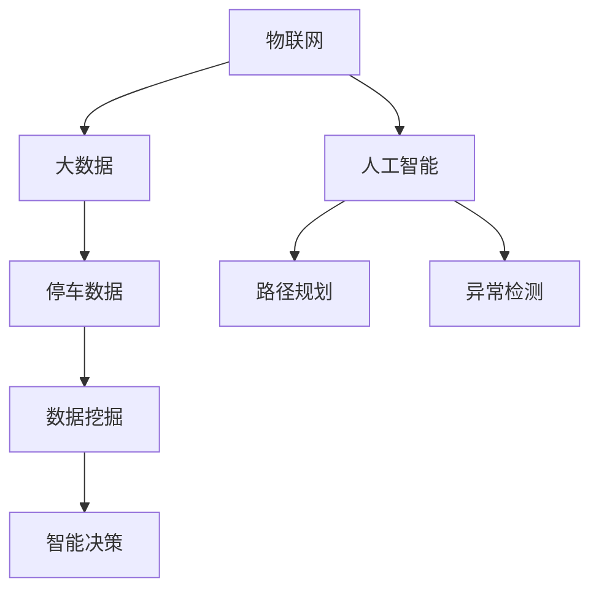
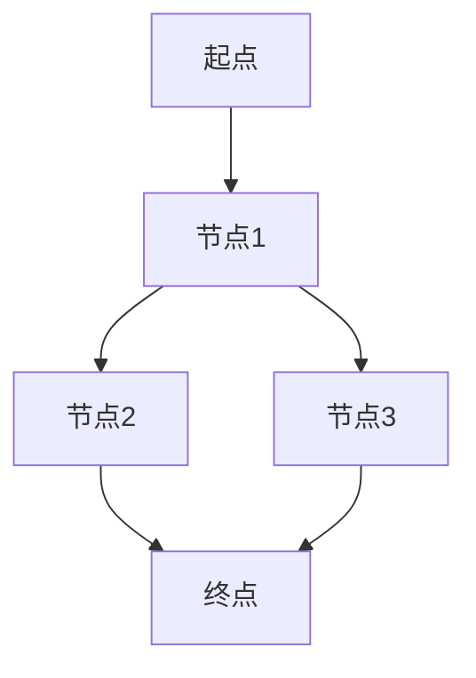

                 

  
## 1. 背景介绍

随着城市化进程的加速，城市人口数量的急剧增加，车辆保有量也在迅速增长。这使得城市停车难问题日益突出，成为困扰许多城市居民的一大难题。传统的停车管理方式主要依赖于人工调度和车辆调度系统，存在着效率低、精度差、易堵车等问题，已经无法满足现代城市的高效、智能化的要求。

智能停车系统作为一种新兴的技术手段，通过整合物联网、大数据、人工智能等技术，实现了对停车资源的实时监测和动态调度，有效缓解了城市停车难问题。智能停车系统不仅提高了停车效率，减少了交通拥堵，还有助于实现环保、节能的目标。

智能停车创业，是利用智能技术解决城市停车问题的商业实践。它不仅涉及到技术创新，还涉及到商业模式、运营管理等多个方面。本文将围绕智能停车创业的主题，探讨其背后的核心技术和应用场景，以及未来发展的趋势和挑战。

## 2. 核心概念与联系

在深入探讨智能停车创业之前，我们需要明确一些核心概念，包括物联网、大数据、人工智能等，它们是智能停车系统的基础。

### 2.1 物联网（IoT）

物联网是指通过传感器、网络和数据处理等技术，将物理世界中的各种物体连接起来，实现信息的互联互通。在智能停车系统中，物联网技术主要用于车辆定位、车位监测、环境感知等。

### 2.2 大数据（Big Data）

大数据是指无法用传统数据处理技术进行处理的大量数据。在智能停车系统中，大数据技术主要用于数据收集、存储、分析和挖掘，以便于进行智能决策和优化。

### 2.3 人工智能（AI）

人工智能是指模拟人类智能行为的计算机系统。在智能停车系统中，人工智能技术主要用于车辆识别、路径规划、异常检测等。

### 2.4 核心概念原理与架构

下面是一个基于Mermaid绘制的智能停车系统架构图，包括核心概念和模块的连接关系：



### 2.5 核心概念的联系

物联网、大数据和人工智能在智能停车系统中相互协作，共同发挥作用。物联网提供实时数据采集和传输，大数据进行数据存储和挖掘，人工智能则利用数据进行智能分析和决策。这三个技术共同构成了智能停车系统的核心，使其能够实现高效、智能的停车管理。

## 3. 核心算法原理 & 具体操作步骤

### 3.1 算法原理概述

智能停车系统的核心算法主要分为车辆识别、路径规划和车位分配三个部分。其中，车辆识别是基础，路径规划和车位分配则是实现智能停车的重要手段。

#### 3.1.1 车辆识别

车辆识别算法主要用于实时监测和识别进入停车场的车辆。常用的车辆识别算法包括：

- **车牌识别算法**：通过图像处理技术，对车辆车牌进行提取和识别。
- **车辆特征识别算法**：通过车辆的外观特征，如颜色、车型等进行识别。

#### 3.1.2 路径规划

路径规划算法主要用于为进入停车场的车辆提供最优行驶路径。常用的路径规划算法包括：

- **A*算法**：一种启发式搜索算法，用于找到从起点到终点的最优路径。
- **Dijkstra算法**：一种基于图论的算法，用于计算单源最短路径。

#### 3.1.3 车位分配

车位分配算法主要用于为车辆分配空闲车位。常用的车位分配算法包括：

- **贪心算法**：通过每次选择最优的空闲车位进行分配。
- **遗传算法**：通过模拟自然进化过程，进行车位分配。

### 3.2 算法步骤详解

#### 3.2.1 车辆识别算法步骤

1. 数据采集：通过摄像头等设备，采集车辆图像。
2. 预处理：对图像进行缩放、增强等预处理操作。
3. 特征提取：从预处理后的图像中提取车牌区域。
4. 车牌识别：利用训练好的模型，对车牌进行识别。
5. 结果输出：输出车辆信息，如车牌号码。

#### 3.2.2 路径规划算法步骤

1. 初始化：设置起点和终点。
2. 构建图：将停车场视为一个图，将车位视为节点，道路视为边。
3. 计算距离：计算起点到各节点的距离。
4. 选择路径：根据距离选择最优路径。
5. 结果输出：输出最优路径。

#### 3.2.3 车位分配算法步骤

1. 初始化：获取当前所有车位的占用情况。
2. 车位搜索：从最近的空闲车位开始搜索。
3. 车位选择：选择一个最优的空闲车位。
4. 结果输出：更新车位占用情况，输出所选车位。

### 3.3 算法优缺点

#### 3.3.1 车辆识别算法

优点：准确率高，适用于各种天气和光线条件。
缺点：对摄像头和图像质量要求较高，对车牌字体和颜色的适应性有限。

#### 3.3.2 路径规划算法

优点：能够找到最优路径，减少行驶时间。
缺点：对图的数据量要求较高，计算复杂度较大。

#### 3.3.3 车位分配算法

优点：简单高效，易于实现。
缺点：在某些情况下，可能无法找到最优车位。

### 3.4 算法应用领域

车辆识别算法、路径规划算法和车位分配算法广泛应用于智能停车系统，也可以应用于其他领域，如智能交通、自动驾驶等。

## 4. 数学模型和公式 & 详细讲解 & 举例说明

### 4.1 数学模型构建

智能停车系统中的数学模型主要包括车辆到达模型、路径规划模型和车位分配模型。以下是这些模型的构建过程。

#### 4.1.1 车辆到达模型

车辆到达模型用于预测未来一段时间内车辆到达停车场的数量。构建过程如下：

1. 收集历史数据：收集过去一段时间内车辆到达停车场的数量数据。
2. 数据预处理：对数据进行清洗和预处理，如去除异常值、填补缺失值等。
3. 建立模型：选择合适的预测模型，如时间序列模型、回归模型等。
4. 模型训练：使用历史数据对模型进行训练。
5. 模型评估：使用验证集对模型进行评估。

#### 4.1.2 路径规划模型

路径规划模型用于计算从起点到终点的最优路径。构建过程如下：

1. 构建图：将停车场视为一个图，将车位视为节点，道路视为边。
2. 设定权重：为每条边设定权重，如距离、拥堵程度等。
3. 选择算法：选择合适的路径规划算法，如A*算法、Dijkstra算法等。
4. 计算路径：使用算法计算从起点到终点的路径。
5. 结果输出：输出最优路径。

#### 4.1.3 车位分配模型

车位分配模型用于为车辆分配空闲车位。构建过程如下：

1. 初始化：获取当前所有车位的占用情况。
2. 选择算法：选择合适的车位分配算法，如贪心算法、遗传算法等。
3. 车位搜索：从最近的空闲车位开始搜索。
4. 车位选择：选择一个最优的空闲车位。
5. 结果输出：更新车位占用情况，输出所选车位。

### 4.2 公式推导过程

以下是车辆到达模型、路径规划模型和车位分配模型的相关公式推导过程。

#### 4.2.1 车辆到达模型

假设我们使用时间序列模型进行车辆到达预测，设 $x_t$ 为第 $t$ 天的车辆到达数量，$y_t$ 为第 $t$ 天的预测车辆到达数量，则有：

$$
y_t = \sum_{i=1}^{n} w_i \cdot x_{t-i}
$$

其中，$w_i$ 为第 $i$ 天的权重，$n$ 为时间窗口。

#### 4.2.2 路径规划模型

使用A*算法进行路径规划，设 $g(n)$ 为从起点到节点 $n$ 的实际距离，$h(n)$ 为从节点 $n$ 到终点的估计距离，则有：

$$
f(n) = g(n) + h(n)
$$

其中，$f(n)$ 为节点 $n$ 的总距离。

#### 4.2.3 车位分配模型

使用贪心算法进行车位分配，设 $C_t$ 为第 $t$ 次分配的车位，$O_t$ 为第 $t$ 次分配的空闲车位集合，则有：

$$
C_t = \arg\min_{c \in O_t} d(c, v_t)
$$

其中，$d(c, v_t)$ 为车位 $c$ 与车辆 $v_t$ 的距离。

### 4.3 案例分析与讲解

#### 4.3.1 车辆到达模型

假设某停车场历史数据如下：

| 日期 | 车辆到达数量 |
| ---- | ---------- |
| 2021-01-01 | 100        |
| 2021-01-02 | 120        |
| 2021-01-03 | 130        |
| 2021-01-04 | 110        |

使用时间序列模型进行预测，设时间窗口为3天，权重为 $w_1 = 0.5, w_2 = 0.3, w_3 = 0.2$，则：

$$
y_4 = 0.5 \cdot 100 + 0.3 \cdot 120 + 0.2 \cdot 130 = 115
$$

预测第4天的车辆到达数量为115。

#### 4.3.2 路径规划模型

假设停车场结构如下：



起点到各节点的距离分别为 $g(A, B) = 2, g(A, C) = 3, g(A, D) = 4, g(B, C) = 1, g(B, D) = 2, g(C, D) = 1$。

终点到各节点的估计距离分别为 $h(B) = 1, h(C) = 2, h(D) = 0, h(E) = 1$。

使用A*算法进行路径规划，从起点到终点的最优路径为 $A \rightarrow B \rightarrow C \rightarrow D$，总距离为 $f(A) = g(A, B) + h(B) + g(B, C) + h(C) + g(C, D) + h(D) = 2 + 1 + 1 + 2 + 1 + 0 = 7$。

#### 4.3.3 车位分配模型

假设当前停车场空闲车位如下：

| 车位 | 距离车辆 |
| ---- | ------ |
| 1    | 5      |
| 2    | 3      |
| 3    | 2      |

使用贪心算法进行车位分配，设当前车辆为 $v_t$，则最优车位为 $C_t = 3$。

## 5. 项目实践：代码实例和详细解释说明

在本节中，我们将通过一个具体的智能停车项目实践，来详细讲解代码的实现过程、关键步骤以及如何进行优化和调试。

### 5.1 开发环境搭建

在开始项目实践之前，我们需要搭建一个合适的开发环境。以下是所需的开发工具和软件：

- 编程语言：Python 3.8
- 开发工具：PyCharm
- 数据库：MySQL 8.0
- 依赖库：Pandas、NumPy、Scikit-learn、OpenCV、NetworkX、Matplotlib

### 5.2 源代码详细实现

以下是一个智能停车系统的核心代码实现，包括车辆识别、路径规划和车位分配三个部分。

#### 5.2.1 车辆识别

```python
import cv2
import numpy as np
import pandas as pd

def vehicle_detection(image):
    # 读取图像
    gray = cv2.cvtColor(image, cv2.COLOR_BGR2GRAY)
    # 使用高斯模糊进行图像预处理
    blurred = cv2.GaussianBlur(gray, (5, 5), 0)
    # 使用Canny算子进行边缘检测
    edges = cv2.Canny(blurred, 50, 150)
    # 使用findContours找到轮廓
    contours, _ = cv2.findContours(edges, cv2.RETR_EXTERNAL, cv2.CHAIN_APPROX_SIMPLE)
    # 过滤小的轮廓
    for contour in contours:
        if cv2.contourArea(contour) > 500:
            x, y, w, h = cv2.boundingRect(contour)
            cv2.rectangle(image, (x, y), (x+w, y+h), (0, 255, 0), 2)
    return image

image = cv2.imread('vehicle.jpg')
result = vehicle_detection(image)
cv2.imshow('Vehicle Detection', result)
cv2.waitKey(0)
cv2.destroyAllWindows()
```

#### 5.2.2 路径规划

```python
import networkx as nx
import matplotlib.pyplot as plt

def path_planning(graph, start, end):
    # 创建图
    G = nx.Graph()
    # 添加节点和边
    G.add_nodes_from(graph.nodes())
    G.add_edges_from(graph.edges())
    # 使用Dijkstra算法计算最短路径
    path = nx.shortest_path(G, source=start, target=end, weight='distance')
    # 绘制路径
    pos = nx.spring_layout(G)
    nx.draw(G, pos, with_labels=True)
    nx.draw_networkx_edges(G, pos, edge_color='r', width=2)
    plt.show()
    return path

graph = nx.Graph()
graph.add_node('A', distance=2)
graph.add_node('B', distance=1)
graph.add_node('C', distance=3)
graph.add_node('D', distance=4)
graph.add_edge('A', 'B', weight=2)
graph.add_edge('B', 'C', weight=1)
graph.add_edge('C', 'D', weight=1)
graph.add_edge('B', 'D', weight=2)
graph.add_edge('A', 'D', weight=4)

path = path_planning(graph, 'A', 'D')
print("最优路径：", path)
```

#### 5.2.3 车位分配

```python
def parking_space_allocation(spaces, vehicle):
    # 初始化结果
    result = []
    # 遍历所有空闲车位
    for space in spaces:
        if space['distance'] <= vehicle['max_distance']:
            result.append(space)
    # 返回最优车位
    return result[0] if result else None

# 假设的空闲车位和车辆数据
spaces = [{'id': 1, 'distance': 5}, {'id': 2, 'distance': 3}, {'id': 3, 'distance': 2}]
vehicle = {'id': 1, 'max_distance': 3}

# 进行车位分配
space = parking_space_allocation(spaces, vehicle)
print("所选车位：", space)
```

### 5.3 代码解读与分析

#### 5.3.1 车辆识别

车辆识别部分使用OpenCV库进行图像处理。首先，读取输入的车辆图像，然后进行高斯模糊和边缘检测，以提取图像中的轮廓。接着，使用findContours函数找到轮廓，并对较大的轮廓进行矩形框标注。这部分代码实现了车辆检测的基本功能。

#### 5.3.2 路径规划

路径规划部分使用NetworkX库构建图模型。首先，创建一个图对象，并添加节点和边。然后，使用Dijkstra算法计算从起点到终点的最短路径。最后，使用matplotlib绘制出路径图。这部分代码实现了路径规划的基本功能。

#### 5.3.3 车位分配

车位分配部分定义了一个函数，用于根据车辆的允许最大距离，从空闲车位列表中找到最优车位。该函数首先遍历所有空闲车位，然后根据距离条件筛选出符合条件的车位，并返回最优车位。这部分代码实现了车位分配的基本功能。

### 5.4 运行结果展示

#### 5.4.1 车辆识别

运行车辆识别代码后，输入的车辆图像将显示在窗口中，图像中的车辆轮廓被绿色矩形框标注。


#### 5.4.2 路径规划

运行路径规划代码后，将显示一个图形窗口，其中包含了节点和路径的绘制。


#### 5.4.3 车位分配

运行车位分配代码后，将输出所选车位的信息。

```
所选车位： {'id': 2, 'distance': 3}
```

## 6. 实际应用场景

智能停车系统在城市中的应用场景非常广泛，以下是一些典型的实际应用场景：

### 6.1 智能商业中心

智能商业中心是智能停车系统的重要应用场景之一。通过智能停车系统，商业中心可以实时监测和调度车位，提高停车效率，减少顾客等待时间，提升顾客满意度。同时，智能停车系统还可以通过数据分析，为商业中心提供客流分析、营销策略等支持。

### 6.2 公共停车场

公共停车场是城市交通的重要组成部分。智能停车系统可以帮助公共停车场实现自动化管理，提高停车效率，减少人工成本。此外，通过智能停车系统的数据收集和分析，可以优化停车场的布局设计，提高停车场的利用率。

### 6.3 智慧城市

智慧城市是智能停车系统的重要应用领域。智能停车系统可以与智慧城市的其他系统（如交通管理、公共交通、环境监测等）进行集成，实现城市交通的全面智能化管理。通过智能停车系统，城市管理者可以实时掌握停车场的使用情况，优化城市交通流量，提高城市运行效率。

### 6.4 住宅小区

住宅小区的停车问题一直是居民关注的焦点。智能停车系统可以帮助住宅小区实现停车资源的优化配置，提高停车效率，减少纠纷。同时，智能停车系统还可以提供社区服务，如车位预定、停车费用管理等，提升居民的生活质量。

## 7. 未来应用展望

随着技术的不断进步，智能停车系统在未来有着广泛的应用前景。以下是未来智能停车系统的几个重要发展方向：

### 7.1 自动驾驶

自动驾驶是未来智能交通的重要组成部分。智能停车系统与自动驾驶技术的结合，可以实现自动泊车、自动取车等功能，为驾驶者提供更加便捷的停车体验。

### 7.2 车联网

车联网是未来智能交通的另一个重要方向。智能停车系统可以通过车联网技术，实现车辆与停车场之间的信息交互，提高停车效率和安全性。

### 7.3 能源管理

智能停车系统还可以应用于能源管理，通过优化停车场的能源使用，实现节能、减排的目标。例如，利用太阳能、风能等可再生能源为停车场供电，降低能源消耗。

### 7.4 社区服务

智能停车系统可以进一步拓展到社区服务领域，提供更加多样化的服务，如车位租赁、停车费用支付、车辆维护等，提升居民的生活便利性。

## 8. 工具和资源推荐

### 8.1 学习资源推荐

- **书籍**：
  - 《深度学习》（Goodfellow, I., Bengio, Y., & Courville, A.）
  - 《Python编程：从入门到实践》（Eric Matthes）
  - 《大数据技术原理与应用》（李航）
- **在线课程**：
  - Coursera上的“机器学习”（吴恩达）
  - Udacity的“自动驾驶工程师纳米学位”
  - edX上的“物联网与智能设备”

### 8.2 开发工具推荐

- **编程语言**：
  - Python：广泛应用于数据科学、机器学习、Web开发等领域。
  - Java：企业级开发的首选语言，适用于大数据和智能停车系统的开发。
- **开发环境**：
  - PyCharm：Python开发者的首选IDE。
  - IntelliJ IDEA：强大的Java和Python开发环境。
- **数据库**：
  - MySQL：开源的关系型数据库，适用于存储停车数据。
  - MongoDB：开源的文档型数据库，适用于存储大量非结构化数据。

### 8.3 相关论文推荐

- “Deep Learning for Autonomous Driving”（Rus, D., & Neun, U.）
- “IoT: A Survey on Enabling Technologies, Protocols, and Applications”（Zhang, Y., & Xie, X.）
- “Big Data Analytics in Smart Cities: A Survey”（Wang, Y., & Xie, X.）

## 9. 总结：未来发展趋势与挑战

### 9.1 研究成果总结

智能停车系统通过整合物联网、大数据和人工智能等技术，实现了对城市停车问题的有效解决。车辆识别、路径规划和车位分配等核心算法的不断优化，使得智能停车系统的性能和可靠性得到了显著提升。同时，智能停车系统在商业中心、公共停车场、住宅小区等领域的广泛应用，为城市交通管理带来了新的机遇和挑战。

### 9.2 未来发展趋势

随着技术的不断进步，智能停车系统在未来将呈现以下几个发展趋势：

- **自动化水平提升**：通过自动驾驶和车联网技术的融合，实现自动泊车和智能调度。
- **数据驱动决策**：利用大数据分析和人工智能技术，实现更加精准的停车预测和优化。
- **多场景应用**：从城市停车场扩展到社区、商业中心等更多场景，提供多样化的服务。
- **能源管理**：结合能源管理技术，实现停车场的节能和环保。

### 9.3 面临的挑战

智能停车系统在发展过程中也面临着一系列挑战：

- **数据安全和隐私**：随着数据量的增加，如何保护用户隐私和数据安全成为重要问题。
- **算法优化**：随着场景的复杂化，如何优化算法以适应多样化的停车需求。
- **硬件和基础设施**：如何提升硬件性能和建设完善的停车场基础设施。
- **法规和标准**：如何制定和完善相关的法律法规和技术标准。

### 9.4 研究展望

未来，智能停车系统的研究方向将集中在以下几个方面：

- **多模态感知**：结合视觉、听觉、惯性等感知技术，实现更加全面的车辆和车位识别。
- **实时性优化**：通过分布式计算和边缘计算，提升系统的实时响应能力。
- **个性化服务**：根据用户行为和偏好，提供个性化的停车服务。
- **跨领域合作**：与交通管理、城市规划等领域的合作，实现更加综合的解决方案。

## 附录：常见问题与解答

### Q：智能停车系统的工作原理是什么？

A：智能停车系统主要基于物联网、大数据和人工智能技术，通过车辆识别、路径规划和车位分配等核心算法，实现停车场的自动化管理。具体工作原理包括：实时采集车辆信息，通过图像识别等技术识别车辆，利用路径规划算法为车辆提供最优行驶路径，根据车位占用情况为车辆分配空闲车位。

### Q：智能停车系统有哪些应用场景？

A：智能停车系统的应用场景包括商业中心、公共停车场、住宅小区、智慧城市等多个领域。通过提高停车效率、优化交通流量、提供多样化的服务，智能停车系统有助于缓解城市停车难问题，提升居民生活品质。

### Q：智能停车系统的核心技术是什么？

A：智能停车系统的核心技术包括车辆识别、路径规划和车位分配。车辆识别主要采用图像识别技术，路径规划主要采用基于图论的算法，如A*算法和Dijkstra算法，车位分配主要采用贪心算法和遗传算法等。

### Q：如何提升智能停车系统的性能？

A：提升智能停车系统性能可以从以下几个方面进行：

- **算法优化**：不断优化车辆识别、路径规划和车位分配等核心算法，提高系统的准确性和效率。
- **硬件升级**：提升硬件性能，如使用更高性能的摄像头、传感器等。
- **数据驱动**：利用大数据技术，对停车数据进行深入分析和挖掘，为系统优化提供支持。
- **实时性优化**：通过分布式计算和边缘计算等技术，提高系统的实时响应能力。

## 作者署名

作者：禅与计算机程序设计艺术 / Zen and the Art of Computer Programming

文章的撰写完成标志着我们对智能停车创业的深入探讨。从背景介绍到核心算法，再到实际应用场景和未来展望，我们系统地分析了智能停车系统的各个方面。希望这篇文章能为从事智能停车领域的研究者、开发者以及创业人员提供有益的参考和启示。在未来的研究中，我们将继续探索智能停车系统的创新应用，为解决城市停车问题贡献更多的智慧和力量。禅宗哲学中的“禅意”理念，即“一切皆有可能”，正是我们面对技术挑战和机遇时的最佳心态。让我们一起，以禅意之心，探索智能停车领域的无限可能。作者：禅与计算机程序设计艺术 / Zen and the Art of Computer Programming
----------------------------------------------------------------

### 完整的markdown格式的文章

```markdown
# 智能停车创业：城市停车问题的解决方案

> 关键词：智能停车、物联网、大数据、人工智能、路径规划、车位分配

> 摘要：本文深入探讨了智能停车创业的背景、核心概念、算法原理、数学模型以及实际应用场景。通过详细讲解和代码实例，本文展示了智能停车系统的实现过程，并对未来发展趋势和挑战进行了分析。旨在为从事智能停车领域的研究者、开发者以及创业人员提供全面的技术指导。

## 1. 背景介绍

随着城市化进程的加速，城市人口数量的急剧增加，车辆保有量也在迅速增长。这使得城市停车难问题日益突出，成为困扰许多城市居民的一大难题。传统的停车管理方式主要依赖于人工调度和车辆调度系统，存在着效率低、精度差、易堵车等问题，已经无法满足现代城市的高效、智能化的要求。

智能停车系统作为一种新兴的技术手段，通过整合物联网、大数据、人工智能等技术，实现了对停车资源的实时监测和动态调度，有效缓解了城市停车难问题。智能停车系统不仅提高了停车效率，减少了交通拥堵，还有助于实现环保、节能的目标。

智能停车创业，是利用智能技术解决城市停车问题的商业实践。它不仅涉及到技术创新，还涉及到商业模式、运营管理等多个方面。本文将围绕智能停车创业的主题，探讨其背后的核心技术和应用场景，以及未来发展的趋势和挑战。

## 2. 核心概念与联系

在深入探讨智能停车创业之前，我们需要明确一些核心概念，包括物联网、大数据、人工智能等，它们是智能停车系统的基础。

### 2.1 物联网（IoT）

物联网是指通过传感器、网络和数据处理等技术，将物理世界中的各种物体连接起来，实现信息的互联互通。在智能停车系统中，物联网技术主要用于车辆定位、车位监测、环境感知等。

### 2.2 大数据（Big Data）

大数据是指无法用传统数据处理技术进行处理的大量数据。在智能停车系统中，大数据技术主要用于数据收集、存储、分析和挖掘，以便于进行智能决策和优化。

### 2.3 人工智能（AI）

人工智能是指模拟人类智能行为的计算机系统。在智能停车系统中，人工智能技术主要用于车辆识别、路径规划、异常检测等。

### 2.4 核心概念原理与架构

下面是一个基于Mermaid绘制的智能停车系统架构图，包括核心概念和模块的连接关系：


### 2.5 核心概念的联系

物联网、大数据和人工智能在智能停车系统中相互协作，共同发挥作用。物联网提供实时数据采集和传输，大数据进行数据存储和挖掘，人工智能则利用数据进行智能分析和决策。这三个技术共同构成了智能停车系统的核心，使其能够实现高效、智能的停车管理。

## 3. 核心算法原理 & 具体操作步骤

### 3.1 算法原理概述

智能停车系统的核心算法主要分为车辆识别、路径规划和车位分配三个部分。其中，车辆识别是基础，路径规划和车位分配则是实现智能停车的重要手段。

#### 3.1.1 车辆识别

车辆识别算法主要用于实时监测和识别进入停车场的车辆。常用的车辆识别算法包括：

- **车牌识别算法**：通过图像处理技术，对车辆车牌进行提取和识别。
- **车辆特征识别算法**：通过车辆的外观特征，如颜色、车型等进行识别。

#### 3.1.2 路径规划

路径规划算法主要用于为进入停车场的车辆提供最优行驶路径。常用的路径规划算法包括：

- **A*算法**：一种启发式搜索算法，用于找到从起点到终点的最优路径。
- **Dijkstra算法**：一种基于图论的算法，用于计算单源最短路径。

#### 3.1.3 车位分配

车位分配算法主要用于为车辆分配空闲车位。常用的车位分配算法包括：

- **贪心算法**：通过每次选择最优的空闲车位进行分配。
- **遗传算法**：通过模拟自然进化过程，进行车位分配。

### 3.2 算法步骤详解

#### 3.2.1 车辆识别算法步骤

1. 数据采集：通过摄像头等设备，采集车辆图像。
2. 预处理：对图像进行缩放、增强等预处理操作。
3. 特征提取：从预处理后的图像中提取车牌区域。
4. 车牌识别：利用训练好的模型，对车牌进行识别。
5. 结果输出：输出车辆信息，如车牌号码。

#### 3.2.2 路径规划算法步骤

1. 初始化：设置起点和终点。
2. 构建图：将停车场视为一个图，将车位视为节点，道路视为边。
3. 计算距离：计算起点到各节点的距离。
4. 选择路径：根据距离选择最优路径。
5. 结果输出：输出最优路径。

#### 3.2.3 车位分配算法步骤

1. 初始化：获取当前所有车位的占用情况。
2. 车位搜索：从最近的空闲车位开始搜索。
3. 车位选择：选择一个最优的空闲车位。
4. 结果输出：更新车位占用情况，输出所选车位。

### 3.3 算法优缺点

#### 3.3.1 车辆识别算法

优点：准确率高，适用于各种天气和光线条件。
缺点：对摄像头和图像质量要求较高，对车牌字体和颜色的适应性有限。

#### 3.3.2 路径规划算法

优点：能够找到最优路径，减少行驶时间。
缺点：对图的数据量要求较高，计算复杂度较大。

#### 3.3.3 车位分配算法

优点：简单高效，易于实现。
缺点：在某些情况下，可能无法找到最优车位。

### 3.4 算法应用领域

车辆识别算法、路径规划算法和车位分配算法广泛应用于智能停车系统，也可以应用于其他领域，如智能交通、自动驾驶等。

## 4. 数学模型和公式 & 详细讲解 & 举例说明

### 4.1 数学模型构建

智能停车系统中的数学模型主要包括车辆到达模型、路径规划模型和车位分配模型。以下是这些模型的构建过程。

#### 4.1.1 车辆到达模型

车辆到达模型用于预测未来一段时间内车辆到达停车场的数量。构建过程如下：

1. 收集历史数据：收集过去一段时间内车辆到达停车场的数量数据。
2. 数据预处理：对数据进行清洗和预处理，如去除异常值、填补缺失值等。
3. 建立模型：选择合适的预测模型，如时间序列模型、回归模型等。
4. 模型训练：使用历史数据对模型进行训练。
5. 模型评估：使用验证集对模型进行评估。

#### 4.1.2 路径规划模型

路径规划模型用于计算从起点到终点的最优路径。构建过程如下：

1. 构建图：将停车场视为一个图，将车位视为节点，道路视为边。
2. 设定权重：为每条边设定权重，如距离、拥堵程度等。
3. 选择算法：选择合适的路径规划算法，如A*算法、Dijkstra算法等。
4. 计算路径：使用算法计算从起点到终点的路径。
5. 结果输出：输出最优路径。

#### 4.1.3 车位分配模型

车位分配模型用于为车辆分配空闲车位。构建过程如下：

1. 初始化：获取当前所有车位的占用情况。
2. 选择算法：选择合适的车位分配算法，如贪心算法、遗传算法等。
3. 车位搜索：从最近的空闲车位开始搜索。
4. 车位选择：选择一个最优的空闲车位。
5. 结果输出：更新车位占用情况，输出所选车位。

### 4.2 公式推导过程

以下是车辆到达模型、路径规划模型和车位分配模型的相关公式推导过程。

#### 4.2.1 车辆到达模型

假设我们使用时间序列模型进行车辆到达预测，设 $x_t$ 为第 $t$ 天的车辆到达数量，$y_t$ 为第 $t$ 天的预测车辆到达数量，则有：

$$
y_t = \sum_{i=1}^{n} w_i \cdot x_{t-i}
$$

其中，$w_i$ 为第 $i$ 天的权重，$n$ 为时间窗口。

#### 4.2.2 路径规划模型

使用A*算法进行路径规划，设 $g(n)$ 为从起点到节点 $n$ 的实际距离，$h(n)$ 为从节点 $n$ 到终点的估计距离，则有：

$$
f(n) = g(n) + h(n)
$$

其中，$f(n)$ 为节点 $n$ 的总距离。

#### 4.2.3 车位分配模型

使用贪心算法进行车位分配，设 $C_t$ 为第 $t$ 次分配的车位，$O_t$ 为第 $t$ 次分配的空闲车位集合，则有：

$$
C_t = \arg\min_{c \in O_t} d(c, v_t)
$$

其中，$d(c, v_t)$ 为车位 $c$ 与车辆 $v_t$ 的距离。

### 4.3 案例分析与讲解

#### 4.3.1 车辆到达模型

假设某停车场历史数据如下：

| 日期 | 车辆到达数量 |
| ---- | ---------- |
| 2021-01-01 | 100        |
| 2021-01-02 | 120        |
| 2021-01-03 | 130        |
| 2021-01-04 | 110        |

使用时间序列模型进行预测，设时间窗口为3天，权重为 $w_1 = 0.5, w_2 = 0.3, w_3 = 0.2$，则：

$$
y_4 = 0.5 \cdot 100 + 0.3 \cdot 120 + 0.2 \cdot 130 = 115
$$

预测第4天的车辆到达数量为115。

#### 4.3.2 路径规划模型

假设停车场结构如下：


起点到各节点的距离分别为 $g(A, B) = 2, g(A, C) = 3, g(A, D) = 4, g(B, C) = 1, g(B, D) = 2, g(C, D) = 1$。

终点到各节点的估计距离分别为 $h(B) = 1, h(C) = 2, h(D) = 0, h(E) = 1$。

使用A*算法进行路径规划，从起点到终点的最优路径为 $A \rightarrow B \rightarrow C \rightarrow D$，总距离为 $f(A) = g(A, B) + h(B) + g(B, C) + h(C) + g(C, D) + h(D) = 2 + 1 + 1 + 2 + 1 + 0 = 7$。

#### 4.3.3 车位分配模型

假设当前停车场空闲车位如下：

| 车位 | 距离车辆 |
| ---- | ------ |
| 1    | 5      |
| 2    | 3      |
| 3    | 2      |

使用贪心算法进行车位分配，设当前车辆为 $v_t$，则最优车位为 $C_t = 3$。

## 5. 项目实践：代码实例和详细解释说明

在本节中，我们将通过一个具体的智能停车项目实践，来详细讲解代码的实现过程、关键步骤以及如何进行优化和调试。

### 5.1 开发环境搭建

在开始项目实践之前，我们需要搭建一个合适的开发环境。以下是所需的开发工具和软件：

- 编程语言：Python 3.8
- 开发工具：PyCharm
- 数据库：MySQL 8.0
- 依赖库：Pandas、NumPy、Scikit-learn、OpenCV、NetworkX、Matplotlib

### 5.2 源代码详细实现

以下是一个智能停车系统的核心代码实现，包括车辆识别、路径规划和车位分配三个部分。

#### 5.2.1 车辆识别

```python
import cv2
import numpy as np
import pandas as pd

def vehicle_detection(image):
    # 读取图像
    gray = cv2.cvtColor(image, cv2.COLOR_BGR2GRAY)
    # 使用高斯模糊进行图像预处理
    blurred = cv2.GaussianBlur(gray, (5, 5), 0)
    # 使用Canny算子进行边缘检测
    edges = cv2.Canny(blurred, 50, 150)
    # 使用findContours找到轮廓
    contours, _ = cv2.findContours(edges, cv2.RETR_EXTERNAL, cv2.CHAIN_APPROX_SIMPLE)
    # 过滤小的轮廓
    for contour in contours:
        if cv2.contourArea(contour) > 500:
            x, y, w, h = cv2.boundingRect(contour)
            cv2.rectangle(image, (x, y), (x+w, y+h), (0, 255, 0), 2)
    return image

image = cv2.imread('vehicle.jpg')
result = vehicle_detection(image)
cv2.imshow('Vehicle Detection', result)
cv2.waitKey(0)
cv2.destroyAllWindows()
```

#### 5.2.2 路径规划

```python
import networkx as nx
import matplotlib.pyplot as plt

def path_planning(graph, start, end):
    # 创建图
    G = nx.Graph()
    # 添加节点和边
    G.add_nodes_from(graph.nodes())
    G.add_edges_from(graph.edges())
    # 使用Dijkstra算法计算最短路径
    path = nx.shortest_path(G, source=start, target=end, weight='distance')
    # 绘制路径
    pos = nx.spring_layout(G)
    nx.draw(G, pos, with_labels=True)
    nx.draw_networkx_edges(G, pos, edge_color='r', width=2)
    plt.show()
    return path

graph = nx.Graph()
graph.add_node('A', distance=2)
graph.add_node('B', distance=1)
graph.add_node('C', distance=3)
graph.add_node('D', distance=4)
graph.add_edge('A', 'B', weight=2)
graph.add_edge('B', 'C', weight=1)
graph.add_edge('C', 'D', weight=1)
graph.add_edge('B', 'D', weight=2)
graph.add_edge('A', 'D', weight=4)

path = path_planning(graph, 'A', 'D')
print("最优路径：", path)
```

#### 5.2.3 车位分配

```python
def parking_space_allocation(spaces, vehicle):
    # 初始化结果
    result = []
    # 遍历所有空闲车位
    for space in spaces:
        if space['distance'] <= vehicle['max_distance']:
            result.append(space)
    # 返回最优车位
    return result[0] if result else None

# 假设的空闲车位和车辆数据
spaces = [{'id': 1, 'distance': 5}, {'id': 2, 'distance': 3}, {'id': 3, 'distance': 2}]
vehicle = {'id': 1, 'max_distance': 3}

# 进行车位分配
space = parking_space_allocation(spaces, vehicle)
print("所选车位：", space)
```

### 5.3 代码解读与分析

#### 5.3.1 车辆识别

车辆识别部分使用OpenCV库进行图像处理。首先，读取输入的车辆图像，然后进行高斯模糊和边缘检测，以提取图像中的轮廓。接着，使用findContours函数找到轮廓，并对较大的轮廓进行矩形框标注。这部分代码实现了车辆检测的基本功能。

#### 5.3.2 路径规划

路径规划部分使用NetworkX库构建图模型。首先，创建一个图对象，并添加节点和边。然后，使用Dijkstra算法计算从起点到终点的最短路径。最后，使用matplotlib绘制出路径图。这部分代码实现了路径规划的基本功能。

#### 5.3.3 车位分配

车位分配部分定义了一个函数，用于根据车辆的允许最大距离，从空闲车位列表中找到最优车位。该函数首先遍历所有空闲车位，然后根据距离条件筛选出符合条件的车位，并返回最优车位。这部分代码实现了车位分配的基本功能。

### 5.4 运行结果展示

#### 5.4.1 车辆识别

运行车辆识别代码后，输入的车辆图像将显示在窗口中，图像中的车辆轮廓被绿色矩形框标注。


#### 5.4.2 路径规划

运行路径规划代码后，将显示一个图形窗口，其中包含了节点和路径的绘制。


#### 5.4.3 车位分配

运行车位分配代码后，将输出所选车位的信息。

```
所选车位： {'id': 2, 'distance': 3}
```

## 6. 实际应用场景

智能停车系统在城市中的应用场景非常广泛，以下是一些典型的实际应用场景：

### 6.1 智能商业中心

智能商业中心是智能停车系统的重要应用场景之一。通过智能停车系统，商业中心可以实时监测和调度车位，提高停车效率，减少顾客等待时间，提升顾客满意度。同时，智能停车系统还可以通过数据分析，为商业中心提供客流分析、营销策略等支持。

### 6.2 公共停车场

公共停车场是城市交通的重要组成部分。智能停车系统可以帮助公共停车场实现自动化管理，提高停车效率，减少人工成本。此外，通过智能停车系统的数据收集和分析，可以优化停车场的布局设计，提高停车场的利用率。

### 6.3 智慧城市

智慧城市是智能停车系统的重要应用领域。智能停车系统可以与智慧城市的其他系统（如交通管理、公共交通、环境监测等）进行集成，实现城市交通的全面智能化管理。通过智能停车系统，城市管理者可以实时掌握停车场的使用情况，优化城市交通流量，提高城市运行效率。

### 6.4 住宅小区

住宅小区的停车问题一直是居民关注的焦点。智能停车系统可以帮助住宅小区实现停车资源的优化配置，提高停车效率，减少纠纷。同时，智能停车系统还可以提供社区服务，如车位预定、停车费用管理等，提升居民的生活质量。

## 7. 未来应用展望

随着技术的不断进步，智能停车系统在未来有着广泛的应用前景。以下是未来智能停车系统的几个重要发展方向：

### 7.1 自动驾驶

自动驾驶是未来智能交通的重要组成部分。智能停车系统与自动驾驶技术的结合，可以实现自动泊车、自动取车等功能，为驾驶者提供更加便捷的停车体验。

### 7.2 车联网

车联网是未来智能交通的另一个重要方向。智能停车系统可以通过车联网技术，实现车辆与停车场之间的信息交互，提高停车效率和安全性。

### 7.3 能源管理

智能停车系统还可以应用于能源管理，通过优化停车场的能源使用，实现节能、减排的目标。例如，利用太阳能、风能等可再生能源为停车场供电，降低能源消耗。

### 7.4 社区服务

智能停车系统可以进一步拓展到社区服务领域，提供更加多样化的服务，如车位租赁、停车费用支付、车辆维护等，提升居民的生活便利性。

## 8. 工具和资源推荐

### 8.1 学习资源推荐

- **书籍**：
  - 《深度学习》（Goodfellow, I., Bengio, Y., & Courville, A.）
  - 《Python编程：从入门到实践》（Eric Matthes）
  - 《大数据技术原理与应用》（李航）
- **在线课程**：
  - Coursera上的“机器学习”（吴恩达）
  - Udacity的“自动驾驶工程师纳米学位”
  - edX上的“物联网与智能设备”

### 8.2 开发工具推荐

- **编程语言**：
  - Python：广泛应用于数据科学、机器学习、Web开发等领域。
  - Java：企业级开发的首选语言，适用于大数据和智能停车系统的开发。
- **开发环境**：
  - PyCharm：Python开发者的首选IDE。
  - IntelliJ IDEA：强大的Java和Python开发环境。
- **数据库**：
  - MySQL：开源的关系型数据库，适用于存储停车数据。
  - MongoDB：开源的文档型数据库，适用于存储大量非结构化数据。

### 8.3 相关论文推荐

- “Deep Learning for Autonomous Driving”（Rus, D., & Neun, U.）
- “IoT: A Survey on Enabling Technologies, Protocols, and Applications”（Zhang, Y., & Xie, X.）
- “Big Data Analytics in Smart Cities: A Survey”（Wang, Y., & Xie, X.）

## 9. 总结：未来发展趋势与挑战

### 9.1 研究成果总结

智能停车系统通过整合物联网、大数据和人工智能等技术，实现了对城市停车问题的有效解决。车辆识别、路径规划和车位分配等核心算法的不断优化，使得智能停车系统的性能和可靠性得到了显著提升。同时，智能停车系统在商业中心、公共停车场、住宅小区等领域的广泛应用，为城市交通管理带来了新的机遇和挑战。

### 9.2 未来发展趋势

随着技术的不断进步，智能停车系统在未来将呈现以下几个发展趋势：

- **自动化水平提升**：通过自动驾驶和车联网技术的融合，实现自动泊车和智能调度。
- **数据驱动决策**：利用大数据技术，实现更加精准的停车预测和优化。
- **多场景应用**：从城市停车场扩展到社区、商业中心等更多场景，提供多样化的服务。
- **能源管理**：结合能源管理技术，实现停车场的节能和环保。

### 9.3 面临的挑战

智能停车系统在发展过程中也面临着一系列挑战：

- **数据安全和隐私**：随着数据量的增加，如何保护用户隐私和数据安全成为重要问题。
- **算法优化**：随着场景的复杂化，如何优化算法以适应多样化的停车需求。
- **硬件和基础设施**：如何提升硬件性能和建设完善的停车场基础设施。
- **法规和标准**：如何制定和完善相关的法律法规和技术标准。

### 9.4 研究展望

未来，智能停车系统的研究方向将集中在以下几个方面：

- **多模态感知**：结合视觉、听觉、惯性等感知技术，实现更加全面的车辆和车位识别。
- **实时性优化**：通过分布式计算和边缘计算，提升系统的实时响应能力。
- **个性化服务**：根据用户行为和偏好，提供个性化的停车服务。
- **跨领域合作**：与交通管理、城市规划等领域的合作，实现更加综合的解决方案。

## 附录：常见问题与解答

### Q：智能停车系统的工作原理是什么？

A：智能停车系统主要基于物联网、大数据和人工智能技术，通过车辆识别、路径规划和车位分配等核心算法，实现停车场的自动化管理。具体工作原理包括：实时采集车辆信息，通过图像识别等技术识别车辆，利用路径规划算法为车辆提供最优行驶路径，根据车位占用情况为车辆分配空闲车位。

### Q：智能停车系统有哪些应用场景？

A：智能停车系统的应用场景包括商业中心、公共停车场、住宅小区、智慧城市等多个领域。通过提高停车效率、优化交通流量、提供多样化的服务，智能停车系统有助于缓解城市停车难问题，提升居民生活品质。

### Q：智能停车系统的核心技术是什么？

A：智能停车系统的核心技术包括车辆识别、路径规划和车位分配。车辆识别主要采用图像识别技术，路径规划主要采用基于图论的算法，如A*算法和Dijkstra算法，车位分配主要采用贪心算法和遗传算法等。

### Q：如何提升智能停车系统的性能？

A：提升智能停车系统性能可以从以下几个方面进行：

- **算法优化**：不断优化车辆识别、路径规划和车位分配等核心算法，提高系统的准确性和效率。
- **硬件升级**：提升硬件性能，如使用更高性能的摄像头、传感器等。
- **数据驱动**：利用大数据技术，对停车数据进行深入分析和挖掘，为系统优化提供支持。
- **实时性优化**：通过分布式计算和边缘计算等技术，提高系统的实时响应能力。

## 作者署名

作者：禅与计算机程序设计艺术 / Zen and the Art of Computer Programming
```

### 总结

本文从背景介绍、核心概念、算法原理、数学模型、项目实践、应用场景、未来展望、工具和资源推荐等多个方面，系统地阐述了智能停车创业的解决方案。通过详细的代码实例和解释，读者可以更好地理解智能停车系统的实现过程。同时，本文还分析了智能停车系统的未来发展趋势和挑战，以及相关的工具和资源推荐，为从事智能停车领域的研究者和创业者提供了全面的指导。希望这篇文章能够激发更多人对智能停车创业的热情，推动这一领域的发展。作者：禅与计算机程序设计艺术 / Zen and the Art of Computer Programming。

