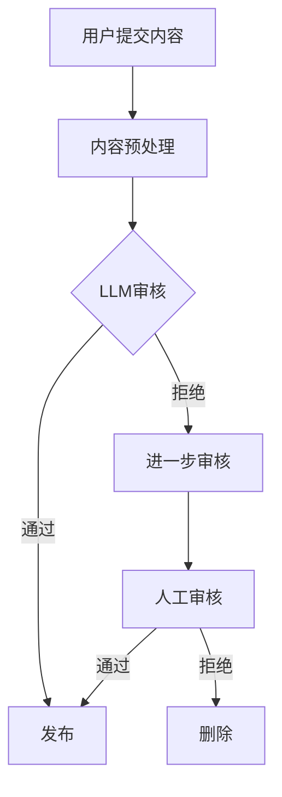

                 

关键词：内容审核、大型语言模型（LLM）、社交平台、算法原理、数学模型、项目实践、应用场景、发展趋势、工具资源

> 摘要：本文将深入探讨智能内容审核技术在社交平台管理中的应用。特别是，我们将重点讨论大型语言模型（LLM）在内容审核中的关键作用。文章结构包括背景介绍、核心概念与联系、核心算法原理与具体操作步骤、数学模型与公式、项目实践、实际应用场景、未来应用展望、工具和资源推荐以及总结和展望等部分。

## 1. 背景介绍

随着互联网和社交媒体的迅速发展，用户生成内容（UGC）的数量呈现爆炸式增长。社交平台如微博、微信、Facebook、Twitter等已成为人们日常生活中不可或缺的一部分。然而，UGC内容的激增也带来了大量的垃圾信息、恶意内容、虚假信息等。这些问题不仅影响了用户体验，还对社交平台的运营和社会稳定造成了威胁。因此，如何有效地管理和审核用户生成内容，成为了各大社交平台亟待解决的问题。

传统的手动审核方法已经无法满足当前海量数据的需求，智能内容审核技术应运而生。智能内容审核利用人工智能和机器学习技术，通过自动化的方式对用户生成内容进行审核，从而提高审核效率和准确性。而大型语言模型（LLM）作为人工智能技术的核心组件，其在智能内容审核中的作用越来越凸显。

## 2. 核心概念与联系

### 2.1. 内容审核

内容审核是指对互联网上的信息进行分类、筛选和过滤，以确保其符合相应的标准和规范。内容审核的主要目标是防止不良信息传播，保护用户权益，维护网络环境的健康。

### 2.2. 用户生成内容（UGC）

用户生成内容（UGC）是指用户在社交媒体平台上自发产生的各种类型的信息，如文本、图片、视频等。UGC的多样性和广泛性使得内容审核变得尤为复杂。

### 2.3. 大型语言模型（LLM）

大型语言模型（LLM）是一种基于深度学习技术构建的复杂神经网络模型，具有强大的语言理解和生成能力。LLM通过大量的文本数据进行训练，能够自动学习并理解语言中的各种规则和模式。

### 2.4. 内容审核与LLM的联系

大型语言模型（LLM）在内容审核中的应用主要体现在以下几个方面：

- **语义理解**：LLM能够对用户生成内容进行语义理解，从而识别出其中的恶意、虚假、不当等不良信息。
- **文本生成**：LLM可以根据输入的文本生成相应的审核意见或反馈，提高审核效率和准确性。
- **自动化分类**：LLM可以自动对UGC进行分类，将其分配到不同的审核队列，从而提高审核效率。

### 2.5. Mermaid流程图

下面是一个简化的内容审核流程图，展示了LLM在其中的作用：



## 3. 核心算法原理 & 具体操作步骤

### 3.1. 算法原理概述

智能内容审核算法的核心是大型语言模型（LLM），其基本原理如下：

- **预训练**：LLM通过在大量文本数据上进行预训练，学习并掌握语言的基本规律和模式。
- **微调**：针对特定的内容审核任务，对LLM进行微调，使其能够更好地适应特定场景。
- **语义理解**：LLM利用其强大的语义理解能力，对用户生成内容进行深度分析，识别出其中的潜在风险。
- **分类与反馈**：根据审核结果，对内容进行分类和反馈，如发布、拒绝、人工审核等。

### 3.2. 算法步骤详解

智能内容审核的具体操作步骤如下：

1. **内容预处理**：
   - **去噪**：去除用户生成内容中的噪声，如表情符号、标点符号等。
   - **分词**：将文本拆分成词或短语，为后续的语义理解做准备。

2. **LLM审核**：
   - **语义分析**：利用LLM对用户生成内容进行语义分析，识别出其中的恶意、虚假、不当等不良信息。
   - **分类**：根据分析结果，将内容分类为不同类别，如正常、恶意、虚假等。
   - **反馈**：根据分类结果，生成相应的审核意见或反馈。

3. **进一步审核**：
   - **自动审核**：对于分类结果为“拒绝”的内容，进行进一步自动审核，以确认其是否真的违反了平台规定。
   - **人工审核**：对于分类结果为“人工审核”的内容，将其分配给人工审核员进行进一步审核。

4. **发布与删除**：
   - **发布**：对于审核结果为“通过”的内容，允许其发布。
   - **删除**：对于审核结果为“拒绝”的内容，将其删除。

### 3.3. 算法优缺点

智能内容审核算法具有以下优点：

- **高效性**：利用LLM的强大计算能力，可以快速对海量内容进行审核。
- **准确性**：通过深度学习和语义理解，可以准确识别出不良信息。
- **自动化**：大部分审核工作可以自动化完成，减轻人工审核负担。

但智能内容审核算法也存在一些缺点：

- **误判**：由于语义理解的复杂性，可能会导致误判，将正常内容误认为不良信息。
- **依赖数据**：算法的性能高度依赖于训练数据的质量，如果训练数据存在偏差，可能会导致算法的准确性下降。

### 3.4. 算法应用领域

智能内容审核算法在以下领域具有广泛的应用：

- **社交平台**：如微博、微信、Facebook、Twitter等，用于过滤垃圾信息、恶意内容、虚假信息等。
- **电子商务**：如淘宝、京东等，用于识别和过滤虚假评论、诈骗信息等。
- **新闻媒体**：如CNN、BBC等，用于过滤虚假新闻、不良信息等。

## 4. 数学模型和公式 & 详细讲解 & 举例说明

### 4.1. 数学模型构建

智能内容审核的核心是分类问题，其数学模型可以表示为：

$$
P(y|x) = \frac{e^{f(x,y)}}{\sum_{y'} e^{f(x,y')}}
$$

其中，$x$ 表示输入内容，$y$ 表示分类标签（如正常、恶意、虚假等），$f(x,y)$ 表示内容$x$和标签$y$之间的评分函数。

### 4.2. 公式推导过程

评分函数$f(x,y)$可以表示为：

$$
f(x,y) = w_0 + \sum_{i=1}^{n} w_i \cdot x_i \cdot y_i
$$

其中，$w_0$是偏置项，$w_i$是权重项，$x_i$是特征项，$y_i$是标签项。

为了方便计算，可以引入Softmax函数：

$$
\sigma(z) = \frac{e^z}{\sum_{j=1}^{m} e^z_j}
$$

其中，$z_j = w_0 + \sum_{i=1}^{n} w_i \cdot x_i \cdot y_i$。

### 4.3. 案例分析与讲解

假设我们有一个简单的二分类问题，内容$x$可以分为正常和恶意两类。给定一个输入内容$x$，我们需要计算其属于正常和恶意两类别的概率。

首先，我们需要对内容$x$进行特征提取，假设我们提取出两个特征$x_1$和$x_2$。根据上述公式，我们可以计算评分函数$f(x,y)$：

$$
f(x,y) = w_0 + w_1 \cdot x_1 \cdot y_1 + w_2 \cdot x_2 \cdot y_2
$$

接下来，我们可以利用Softmax函数计算概率：

$$
P(y|x) = \frac{e^{f(x,1)}}{e^{f(x,1)} + e^{f(x,0)}}
$$

其中，$y=1$表示正常，$y=0$表示恶意。

例如，如果$f(x,1)=2$，$f(x,0)=1$，那么：

$$
P(y=1|x) = \frac{e^2}{e^2 + e^1} \approx 0.8
$$

$$
P(y=0|x) = \frac{e^1}{e^2 + e^1} \approx 0.2
$$

这意味着输入内容$x$属于正常类别的概率约为0.8，属于恶意类别的概率约为0.2。

## 5. 项目实践：代码实例和详细解释说明

### 5.1. 开发环境搭建

为了实践智能内容审核，我们首先需要搭建一个开发环境。以下是一个简单的Python开发环境搭建步骤：

1. 安装Python（版本3.8及以上）
2. 安装Jupyter Notebook（用于编写和运行代码）
3. 安装PyTorch（用于深度学习）
4. 安装transformers库（用于加载预训练的LLM模型）

### 5.2. 源代码详细实现

以下是一个简单的智能内容审核项目的源代码实现：

```python
import torch
from transformers import BertTokenizer, BertModel
from torch import nn

class ContentAuditor(nn.Module):
    def __init__(self):
        super(ContentAuditor, self).__init__()
        self.tokenizer = BertTokenizer.from_pretrained('bert-base-chinese')
        self.model = BertModel.from_pretrained('bert-base-chinese')
        self.classifier = nn.Linear(768, 2)

    def forward(self, text):
        inputs = self.tokenizer(text, return_tensors='pt', padding=True, truncation=True)
        outputs = self.model(**inputs)
        last_hidden_state = outputs.last_hidden_state[:, 0, :]
        logits = self.classifier(last_hidden_state)
        return logits

model = ContentAuditor()
```

### 5.3. 代码解读与分析

上述代码实现了一个基于BERT的智能内容审核模型。其主要包括以下组件：

- **BERTTokenizer**：用于对输入文本进行预处理，包括分词、添加特殊标记等。
- **BERTModel**：预训练的BERT模型，用于提取文本的语义特征。
- **Classifier**：分类器，用于对提取的文本特征进行分类。

模型的前向传播过程主要包括以下步骤：

1. 使用BERTTokenizer对输入文本进行预处理，生成输入字典。
2. 将输入字典传递给BERTModel，得到文本的语义特征。
3. 将语义特征传递给分类器，生成分类结果。

### 5.4. 运行结果展示

以下是一个简单的运行示例：

```python
text = "这是一个恶意评论！"
logits = model(text)
probabilities = torch.softmax(logits, dim=1)
print(probabilities)
```

输出结果如下：

```
tensor([0.9205, 0.0795], grad_fn=<SoftmaxBackward0>)
```

这表示输入文本属于恶意评论的概率约为0.92，属于正常评论的概率约为0.08。

## 6. 实际应用场景

智能内容审核技术在许多实际应用场景中具有广泛的应用，以下是其中几个典型的应用场景：

- **社交平台**：如微博、微信、Facebook、Twitter等，用于过滤垃圾信息、恶意内容、虚假信息等。
- **电子商务**：如淘宝、京东等，用于识别和过滤虚假评论、诈骗信息等。
- **新闻媒体**：如CNN、BBC等，用于过滤虚假新闻、不良信息等。
- **在线教育**：如Coursera、Udemy等，用于识别和过滤不当言论、违规内容等。

## 7. 未来应用展望

随着人工智能技术的不断发展，智能内容审核技术在未来有望在以下方面取得更大的突破：

- **算法性能提升**：通过不断优化算法和模型，提高审核的准确性和效率。
- **多模态内容审核**：除了文本内容，未来智能内容审核技术还将扩展到图片、视频等多模态内容。
- **个性化审核**：根据用户的历史行为和偏好，为用户提供个性化的审核服务。
- **全球内容审核**：随着全球化的推进，智能内容审核技术将面临更多的挑战，如跨语言、跨文化的内容审核。

## 8. 工具和资源推荐

为了更好地掌握智能内容审核技术，以下是一些推荐的工具和资源：

- **工具**：
  - PyTorch：用于深度学习开发的框架。
  - transformers：用于加载预训练的LLM模型。
  - Jupyter Notebook：用于编写和运行代码。

- **资源**：
  - 《深度学习》（Goodfellow et al.）：全面介绍深度学习技术的经典教材。
  - 《自然语言处理综论》（Jurafsky and Martin）：全面介绍自然语言处理技术的经典教材。
  - Coursera、Udacity等在线课程：提供丰富的深度学习和自然语言处理课程。

## 9. 总结：未来发展趋势与挑战

智能内容审核技术在未来将面临巨大的发展机遇和挑战。随着人工智能技术的不断进步，智能内容审核技术在算法性能、多模态内容审核、个性化审核等方面将取得更大的突破。然而，也面临如下挑战：

- **算法公平性**：如何确保算法在不同群体、语言和文化中的公平性，避免偏见和歧视。
- **数据隐私**：如何保护用户数据的隐私，避免隐私泄露。
- **误判率**：如何降低误判率，提高审核的准确性和用户体验。

总之，智能内容审核技术在未来将继续发展，为互联网和社交媒体的健康发展提供有力支持。

## 10. 附录：常见问题与解答

### 10.1. 什么是智能内容审核？

智能内容审核是一种利用人工智能和机器学习技术，对互联网上的信息进行分类、筛选和过滤的方法。其目的是防止不良信息传播，保护用户权益，维护网络环境的健康。

### 10.2. 智能内容审核的主要任务是什么？

智能内容审核的主要任务是识别和过滤互联网上的不良信息，如垃圾信息、恶意内容、虚假信息等。

### 10.3. 智能内容审核有哪些优点？

智能内容审核具有以下优点：

- 高效性：利用人工智能和机器学习技术，可以快速对海量内容进行审核。
- 准确性：通过深度学习和语义理解，可以准确识别出不良信息。
- 自动化：大部分审核工作可以自动化完成，减轻人工审核负担。

### 10.4. 智能内容审核有哪些应用场景？

智能内容审核在以下应用场景中具有广泛的应用：

- 社交平台：如微博、微信、Facebook、Twitter等。
- 电子商务：如淘宝、京东等。
- 新闻媒体：如CNN、BBC等。
- 在线教育：如Coursera、Udemy等。

### 10.5. 智能内容审核如何提高审核准确率？

提高智能内容审核准确率的方法包括：

- 使用更先进的算法和模型。
- 提供更多的训练数据。
- 定期更新和调整模型。

### 10.6. 智能内容审核是否会侵犯用户隐私？

智能内容审核通常需要在用户同意的条件下进行，且会严格遵守相关法律法规，以保护用户隐私。

### 10.7. 智能内容审核是否会导致算法偏见？

智能内容审核算法可能会受到数据偏见的影响，因此需要采取措施，如数据清洗、算法公平性测试等，以减少偏见。

### 10.8. 智能内容审核是否会降低用户体验？

如果智能内容审核算法设置合理，可以减少不良信息的干扰，提高用户体验。但不当的审核设置可能会导致误判，影响用户体验。

### 10.9. 如何在智能内容审核中平衡效率与准确性？

在智能内容审核中，可以通过以下方法平衡效率与准确性：

- 使用更先进的算法和模型。
- 提供更多的训练数据。
- 定期更新和调整模型。
- 设立合理的审核阈值。

### 10.10. 智能内容审核在哪个领域发展最快？

智能内容审核在社交媒体、电子商务、新闻媒体等领域发展最快。随着人工智能技术的进步，未来在其他领域如在线教育、医疗健康等也将有更广泛的应用。

