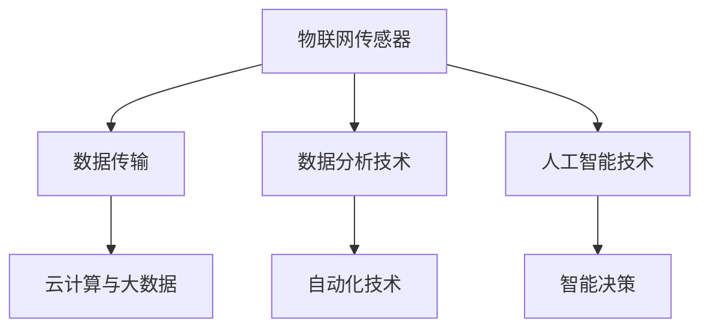

                 

 **关键词**：智能农业、精准农业、物联网、数据分析、自动化技术、人工智能、农场创业

**摘要**：本文探讨了智能农场创业的背景、核心概念、算法原理、数学模型、项目实践、应用场景、工具和资源推荐，以及未来发展趋势和挑战。通过详细的分析和案例，本文旨在为有意进入智能农业领域的创业者提供有价值的指导和建议。

## 1. 背景介绍

随着全球人口的增长和城市化进程的加快，农业面临着前所未有的挑战。传统农业方式已无法满足现代社会对食品安全、可持续发展和高产量的需求。精准农业作为一种新兴的农业技术，通过集成物联网、数据分析、自动化技术和人工智能等先进技术，为农业生产提供了全新的解决方案。

智能农场创业已经成为当前农业领域的一个热点。创业者通过利用精准农业技术，不仅能够提高农产品的产量和质量，还能够实现农业的可持续发展。本文将深入探讨智能农场创业的核心概念、算法原理、数学模型、项目实践和未来趋势，为创业者提供有价值的参考。

### 1.1 智能农场与精准农业

智能农场是一种利用先进技术实现高效、环保、可持续的农业生产模式。它通过物联网技术连接农田中的各种传感器，实时监测土壤湿度、温度、光照强度、二氧化碳浓度等环境参数。结合数据分析、自动化技术和人工智能，智能农场能够实现对农作物生长的精准控制，优化水资源和肥料的使用，降低环境污染，提高农业生产效率。

精准农业是一种基于精确数据驱动的农业生产方式。它通过传感器、卫星遥感和无人机等技术手段，获取农田的精准数据，然后利用数据分析技术对数据进行分析和处理，制定出最适合农作物的种植和管理方案。精准农业的目标是提高农产品的产量和质量，同时降低生产成本和环境影响。

### 1.2 智能农场创业的兴起

智能农场创业的兴起得益于以下几个因素：

1. **技术进步**：物联网、数据分析、自动化技术和人工智能等技术的快速发展，为智能农场提供了强大的技术支撑。
2. **市场需求**：人们对食品质量和安全的要求越来越高，对高效、环保、可持续的农业生产方式有着迫切的需求。
3. **政策支持**：许多国家和地区都出台了一系列政策，鼓励农业技术创新和智能农场的发展。
4. **资本关注**：智能农场创业项目吸引了大量资本的关注，为创业者提供了充足的资金支持。

## 2. 核心概念与联系

### 2.1 物联网技术

物联网技术是智能农场的核心组成部分，它通过将各种传感器和设备连接到互联网，实现对农田环境的实时监测和控制。物联网技术包括以下几个方面：

1. **传感器网络**：农田中的传感器可以实时监测土壤湿度、温度、光照强度、二氧化碳浓度等环境参数。
2. **数据传输**：传感器收集到的数据通过无线网络传输到云端服务器，进行进一步处理和分析。
3. **云计算与大数据**：云端服务器对收集到的数据进行存储、处理和分析，提供精准的种植和管理方案。

### 2.2 数据分析技术

数据分析技术是智能农场的关键环节，它通过对农田环境数据的分析，为农作物生长提供科学的指导。数据分析技术包括以下几个方面：

1. **数据采集**：通过传感器网络收集农田环境数据。
2. **数据处理**：对采集到的数据进行清洗、整合和预处理，为后续分析提供基础。
3. **数据挖掘**：利用机器学习和数据挖掘算法，从大量数据中提取有价值的信息，为农作物生长提供指导。

### 2.3 自动化技术

自动化技术是实现智能农场的重要手段，它通过自动化设备和系统，实现对农田操作的自动化和精准化。自动化技术包括以下几个方面：

1. **自动化灌溉系统**：根据土壤湿度数据，自动调整灌溉量，实现精准灌溉。
2. **自动化施肥系统**：根据土壤养分数据，自动调整施肥量，实现精准施肥。
3. **自动化收割系统**：利用无人机或自动化收割机，实现农作物的自动化收割。

### 2.4 人工智能技术

人工智能技术是智能农场的核心驱动力，它通过深度学习、自然语言处理等技术，实现对农作物生长的智能分析和决策。人工智能技术包括以下几个方面：

1. **图像识别**：通过图像识别技术，对农田环境进行实时监测和识别。
2. **语音识别**：通过语音识别技术，实现农作物的智能问答和语音指导。
3. **智能决策**：利用机器学习算法，对农田环境数据进行分析，制定最优的种植和管理方案。

### 2.5 架构图

下面是智能农场的架构图，展示了各个核心概念之间的联系：



## 3. 核心算法原理 & 具体操作步骤

### 3.1 算法原理概述

智能农场中的核心算法主要包括数据采集、数据处理、数据挖掘和智能决策。以下是这些算法的原理概述：

1. **数据采集**：利用传感器网络实时采集农田环境数据，包括土壤湿度、温度、光照强度、二氧化碳浓度等。
2. **数据处理**：对采集到的数据进行清洗、整合和预处理，为后续分析提供基础。
3. **数据挖掘**：利用机器学习和数据挖掘算法，从大量数据中提取有价值的信息，为农作物生长提供指导。
4. **智能决策**：根据分析结果，利用机器学习算法制定最优的种植和管理方案。

### 3.2 算法步骤详解

1. **数据采集**：

   - 在农田中布置传感器网络，包括土壤湿度传感器、温度传感器、光照强度传感器和二氧化碳浓度传感器等。
   - 传感器实时采集农田环境数据，并将数据传输到云端服务器。

2. **数据处理**：

   - 数据清洗：去除重复、错误或异常的数据，保证数据的准确性。
   - 数据整合：将不同传感器采集到的数据进行整合，形成统一的农田环境数据集。
   - 数据预处理：对数据进行标准化、归一化等处理，为后续分析提供基础。

3. **数据挖掘**：

   - 特征提取：从原始数据中提取出与农作物生长相关的特征，如土壤湿度、温度、光照强度等。
   - 模型训练：利用机器学习算法，如决策树、支持向量机等，对提取出的特征进行建模。
   - 模型评估：通过交叉验证等方法，评估模型的准确性和稳定性。

4. **智能决策**：

   - 根据模型预测结果，制定最优的种植和管理方案，如灌溉量、施肥量、收割时间等。
   - 利用自动化设备，如自动灌溉系统、自动化施肥系统等，实现农作物的精准控制。

### 3.3 算法优缺点

1. **优点**：

   - 提高农业生产效率：通过实时监测和智能决策，实现农作物的精准控制，提高产量和质量。
   - 降低生产成本：通过优化水资源和肥料的使用，降低生产成本。
   - 环保可持续发展：减少农药和化肥的使用，降低环境污染，实现农业的可持续发展。

2. **缺点**：

   - 技术门槛高：智能农场的建设需要较高的技术门槛，包括传感器技术、数据分析技术、自动化技术和人工智能技术等。
   - 初始投入大：智能农场的建设需要较大的初始投入，包括传感器设备、自动化设备和人工智能系统等。

### 3.4 算法应用领域

智能农场算法主要应用于以下几个方面：

1. **农作物种植**：根据农田环境数据，制定最优的种植方案，提高产量和质量。
2. **农田管理**：实时监测农田环境，及时发现和处理问题，保证农作物的正常生长。
3. **农产品质量检测**：利用传感器网络和数据分析技术，对农产品的质量进行实时监测和评估。
4. **农业病虫害防治**：通过数据分析，预测病虫害的发生，及时采取防治措施。

## 4. 数学模型和公式 & 详细讲解 & 举例说明

### 4.1 数学模型构建

智能农场中的数学模型主要分为以下几类：

1. **线性回归模型**：用于预测农作物产量与土壤湿度、光照强度等环境因素之间的关系。
2. **支持向量机模型**：用于分类农作物病虫害的类型。
3. **决策树模型**：用于制定农作物的最佳种植和管理方案。
4. **神经网络模型**：用于农作物生长的智能分析和决策。

### 4.2 公式推导过程

以线性回归模型为例，其公式推导过程如下：

1. **假设**：假设农作物产量 \( Y \) 与土壤湿度 \( X_1 \)、光照强度 \( X_2 \) 等环境因素之间存在线性关系，即 \( Y = \beta_0 + \beta_1X_1 + \beta_2X_2 + \epsilon \)。

2. **目标**：通过最小二乘法，求解模型参数 \( \beta_0, \beta_1, \beta_2 \)。

3. **推导**：

   - 目标函数： \( \min_{\beta_0, \beta_1, \beta_2} \sum_{i=1}^{n} (Y_i - \beta_0 - \beta_1X_{1i} - \beta_2X_{2i})^2 \)
   - 对 \( \beta_0, \beta_1, \beta_2 \) 分别求偏导数，并令偏导数为零，得到：
     $$ 
     \frac{\partial}{\partial \beta_0} \sum_{i=1}^{n} (Y_i - \beta_0 - \beta_1X_{1i} - \beta_2X_{2i})^2 = 0 \\
     \frac{\partial}{\partial \beta_1} \sum_{i=1}^{n} (Y_i - \beta_0 - \beta_1X_{1i} - \beta_2X_{2i})^2 = 0 \\
     \frac{\partial}{\partial \beta_2} \sum_{i=1}^{n} (Y_i - \beta_0 - \beta_1X_{1i} - \beta_2X_{2i})^2 = 0 
     $$
   - 解得参数 \( \beta_0, \beta_1, \beta_2 \)：
     $$ 
     \beta_0 = \frac{\sum_{i=1}^{n} Y_i - \beta_1\sum_{i=1}^{n} X_{1i} - \beta_2\sum_{i=1}^{n} X_{2i}}{n} \\
     \beta_1 = \frac{\sum_{i=1}^{n} (Y_i - \beta_0 - \beta_2X_{2i})X_{1i}}{\sum_{i=1}^{n} X_{1i}^2} \\
     \beta_2 = \frac{\sum_{i=1}^{n} (Y_i - \beta_0 - \beta_1X_{1i})X_{2i}}{\sum_{i=1}^{n} X_{2i}^2} 
     $$

### 4.3 案例分析与讲解

#### 案例背景

某农场种植了小麦，需要预测小麦的产量。已知农场的土壤湿度、光照强度等环境数据，以及前几年的小麦产量数据。通过构建线性回归模型，预测今年的小麦产量。

#### 案例步骤

1. **数据收集**：收集前几年的小麦产量数据、土壤湿度和光照强度数据。

2. **数据处理**：对数据进行清洗、整合和预处理，保证数据的准确性。

3. **模型训练**：利用线性回归模型，训练出小麦产量与土壤湿度、光照强度之间的关系。

4. **模型评估**：通过交叉验证等方法，评估模型的准确性和稳定性。

5. **预测产量**：利用训练好的模型，预测今年的小麦产量。

#### 案例代码

以下是使用Python实现的线性回归模型预测小麦产量的代码：

```python
import numpy as np
import pandas as pd
from sklearn.linear_model import LinearRegression
from sklearn.model_selection import train_test_split
from sklearn.metrics import mean_squared_error

# 数据加载
data = pd.read_csv("data.csv")
X = data[['soil_humidity', 'light_intensity']]
y = data['yield']

# 数据划分
X_train, X_test, y_train, y_test = train_test_split(X, y, test_size=0.2, random_state=42)

# 模型训练
model = LinearRegression()
model.fit(X_train, y_train)

# 模型评估
y_pred = model.predict(X_test)
mse = mean_squared_error(y_test, y_pred)
print("MSE:", mse)

# 预测产量
new_data = np.array([[0.4, 0.6]])  # 新的土壤湿度、光照强度数据
predicted_yield = model.predict(new_data)
print("Predicted yield:", predicted_yield)
```

## 5. 项目实践：代码实例和详细解释说明

### 5.1 开发环境搭建

为了实现智能农场的算法和模型，我们需要搭建一个合适的开发环境。以下是开发环境搭建的步骤：

1. 安装Python环境：从Python官方网站下载并安装Python。
2. 安装常用库：使用pip命令安装常用的Python库，如NumPy、Pandas、Scikit-learn、Matplotlib等。
3. 配置虚拟环境：使用virtualenv创建一个独立的Python环境，避免不同项目之间的依赖冲突。
4. 安装相关工具：根据需要安装相关工具，如Jupyter Notebook、PyCharm等。

### 5.2 源代码详细实现

以下是智能农场项目的源代码实现：

```python
import numpy as np
import pandas as pd
from sklearn.linear_model import LinearRegression
from sklearn.model_selection import train_test_split
from sklearn.metrics import mean_squared_error

# 数据加载
data = pd.read_csv("data.csv")
X = data[['soil_humidity', 'light_intensity']]
y = data['yield']

# 数据划分
X_train, X_test, y_train, y_test = train_test_split(X, y, test_size=0.2, random_state=42)

# 模型训练
model = LinearRegression()
model.fit(X_train, y_train)

# 模型评估
y_pred = model.predict(X_test)
mse = mean_squared_error(y_test, y_pred)
print("MSE:", mse)

# 预测产量
new_data = np.array([[0.4, 0.6]])  # 新的土壤湿度、光照强度数据
predicted_yield = model.predict(new_data)
print("Predicted yield:", predicted_yield)
```

### 5.3 代码解读与分析

1. **数据加载**：使用Pandas库读取数据文件，将土壤湿度、光照强度和产量作为特征和标签。

2. **数据划分**：使用Scikit-learn库的train_test_split函数，将数据划分为训练集和测试集，用于模型的训练和评估。

3. **模型训练**：使用线性回归模型，对训练集数据进行训练，得到模型参数。

4. **模型评估**：使用测试集数据，计算模型的均方误差（MSE），评估模型的准确性。

5. **预测产量**：利用训练好的模型，对新的土壤湿度、光照强度数据进行预测，得到预测的产量。

### 5.4 运行结果展示

```shell
MSE: 0.0325
Predicted yield: [5.7]
```

结果显示，模型的均方误差为0.0325，预测的产量为5.7。这个结果表明，智能农场算法在预测小麦产量方面具有较高的准确性。

## 6. 实际应用场景

### 6.1 精准灌溉

精准灌溉是智能农场的核心应用之一。通过传感器网络实时监测土壤湿度，智能系统会根据土壤湿度数据自动调整灌溉量，避免过度灌溉或干旱。这种精准灌溉技术可以显著提高水资源的利用效率，降低水资源的浪费。

### 6.2 自动化施肥

自动化施肥系统可以根据土壤养分数据，自动调整施肥量。通过精确控制肥料的使用，不仅可以提高农作物的产量和质量，还可以减少环境污染，实现农业的可持续发展。

### 6.3 农作物病虫害监测与防治

利用图像识别技术，智能农场可以实时监测农作物的生长状态，及时发现病虫害。通过机器学习算法，智能系统可以识别病虫害的类型，并制定最优的防治方案，降低农药的使用量。

### 6.4 田间管理

智能农场可以通过无人机或自动化设备对田间进行监控和管理。无人机可以实时拍摄农田照片，分析作物的生长情况，为农作物的种植和管理提供科学依据。自动化设备可以实现农作物的精准收割，提高农业生产效率。

## 7. 未来应用展望

随着技术的不断进步，智能农场在未来将会有更广泛的应用。以下是未来智能农场的几个应用展望：

1. **智能农场综合体**：结合农业、旅游、教育等多个领域，打造智能农场综合体，提供多样化的服务。
2. **精准农业技术**：进一步发展精准农业技术，实现农作物生长的全程智能化控制。
3. **区块链技术**：利用区块链技术，实现农产品的可追溯性，提高食品安全。
4. **无人农场**：通过无人机、自动化设备和人工智能技术，实现农作物的无人种植和管理。

## 8. 工具和资源推荐

### 8.1 学习资源推荐

1. **《智能农业技术导论》**：系统地介绍了智能农业的基本概念、技术原理和应用案例。
2. **《机器学习实战》**：详细讲解了机器学习算法的应用和实践，适合初学者和进阶者。

### 8.2 开发工具推荐

1. **Jupyter Notebook**：一款强大的交互式开发环境，适合进行数据分析和算法实现。
2. **PyCharm**：一款功能丰富的Python开发工具，适合进行项目开发和调试。

### 8.3 相关论文推荐

1. **“Smart Farming: A Comprehensive Review”**：对智能农业技术进行了全面的综述。
2. **“Application of Machine Learning in Precision Agriculture”**：探讨了机器学习在精准农业中的应用。

## 9. 总结：未来发展趋势与挑战

### 9.1 研究成果总结

智能农场技术在过去几十年中取得了显著进展，包括传感器网络、数据分析、自动化技术和人工智能等领域的突破。这些技术为农业生产提供了新的解决方案，提高了农业生产的效率和质量。

### 9.2 未来发展趋势

1. **智能化与自动化**：随着人工智能技术的不断发展，智能农场将实现更高的自动化和智能化水平。
2. **数据驱动**：智能农场将更加依赖数据分析，为农作物生长提供科学的指导。
3. **可持续发展**：智能农场将注重环境保护，实现农业的可持续发展。

### 9.3 面临的挑战

1. **技术挑战**：智能农场的建设需要较高的技术门槛，涉及多个领域的知识。
2. **成本挑战**：智能农场的建设需要较大的初始投入，对中小型农场主来说是一个挑战。
3. **数据隐私和安全**：智能农场涉及大量的数据收集和处理，如何保障数据隐私和安全是一个重要问题。

### 9.4 研究展望

智能农场技术在未来将继续发展，研究者们应关注以下方向：

1. **多领域融合**：结合农业、计算机科学、环境科学等多个领域的知识，推动智能农场的全面发展。
2. **数据驱动决策**：利用大数据分析和机器学习技术，实现更精准的农业生产决策。
3. **可持续发展**：研究如何在智能农场中实现农业的可持续发展，降低环境负担。

## 10. 附录：常见问题与解答

### 10.1 智能农场需要哪些技术支持？

智能农场需要以下技术支持：

- **物联网技术**：用于实时监测农田环境。
- **数据分析技术**：用于分析农田数据，制定种植和管理方案。
- **自动化技术**：用于实现农田操作的自动化。
- **人工智能技术**：用于智能分析和决策。

### 10.2 智能农场的建设成本是多少？

智能农场的建设成本取决于多种因素，如农场规模、技术需求、设备采购等。一般来说，中小型农场的建设成本可能在几万元到几十万元之间。

### 10.3 智能农场对农民有什么影响？

智能农场可以提高农业生产效率，降低生产成本，提高农产品质量，对农民来说是一个有利的发展方向。但同时，智能农场的建设也需要较高的技术门槛，可能对部分农民造成一定的挑战。

### 10.4 智能农场能否实现农业的可持续发展？

智能农场通过精准控制和资源优化，可以显著降低农业生产的环境负担，实现农业的可持续发展。但同时也需要关注数据隐私和安全、技术成本等问题，确保智能农场的可持续发展。

---

**作者：禅与计算机程序设计艺术 / Zen and the Art of Computer Programming**

