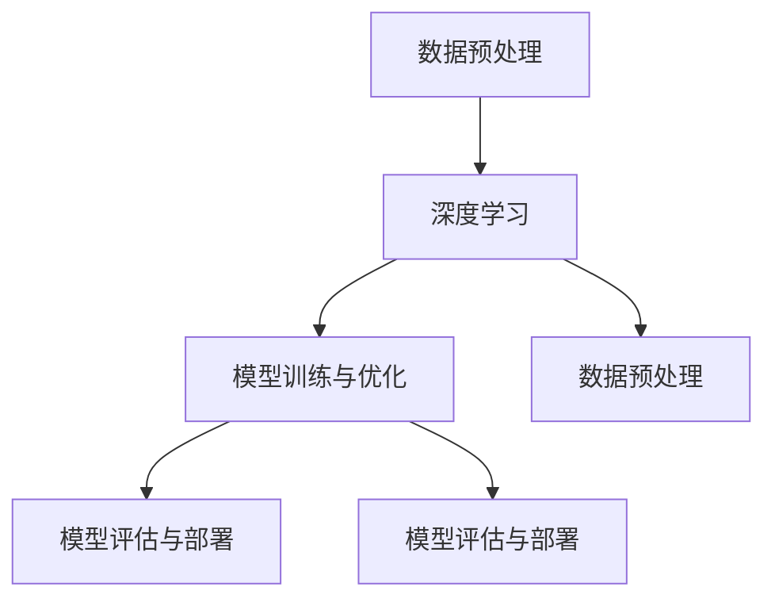

                 

关键词：智能医疗，AI大模型，深度学习，医疗诊断，数据处理，算法优化，应用场景，未来展望

> 摘要：本文将深入探讨智能医疗诊断中的AI大模型解决方案，从背景介绍、核心概念与联系、核心算法原理、数学模型及公式、项目实践、实际应用场景、工具和资源推荐、总结：未来发展趋势与挑战等方面展开详细分析，旨在为读者提供一份全面、深入的智能医疗诊断AI大模型解决方案的技术指南。

## 1. 背景介绍

随着人工智能技术的飞速发展，智能医疗逐渐成为了一个热门的研究方向。医疗诊断作为智能医疗的核心应用之一，具有巨大的市场需求和潜力。传统的医疗诊断依赖于医生的经验和专业知识，存在诊断效率低、误诊率高、覆盖面窄等问题。而AI大模型的出现，为医疗诊断提供了一种全新的解决方案。

AI大模型是一种基于深度学习技术的复杂算法模型，通过大量数据的训练，能够自动提取出数据中的特征，并进行智能分析。在医疗诊断领域，AI大模型可以处理海量的医疗数据，快速准确地识别疾病，提高诊断的效率和准确性。此外，AI大模型还具有自适应性和可扩展性，可以随着数据量的增加和技术的进步不断优化和升级。

## 2. 核心概念与联系

在智能医疗诊断中，AI大模型的核心概念包括：

- **数据预处理**：将原始的医疗数据转换为适合模型训练的格式，包括数据清洗、归一化、特征提取等。
- **深度学习**：一种基于人工神经网络的学习方法，通过多层神经元的堆叠，实现对数据的自动特征提取和模式识别。
- **模型训练与优化**：通过大量的医疗数据对模型进行训练，并通过调整模型参数来优化模型的性能。
- **模型评估与部署**：对训练好的模型进行评估，确保其诊断准确性，并将模型部署到实际应用场景中。

下面是一个简单的 Mermaid 流程图，展示了这些核心概念之间的联系：



## 3. 核心算法原理 & 具体操作步骤

### 3.1 算法原理概述

AI大模型的算法原理主要基于深度学习技术。深度学习是一种模仿人脑神经网络的计算模型，通过多层神经元的堆叠，实现对复杂数据的特征提取和模式识别。在医疗诊断中，深度学习模型可以自动学习医疗数据的特征，并将其用于疾病的分类和预测。

### 3.2 算法步骤详解

AI大模型的算法步骤主要包括以下几个阶段：

1. **数据收集与预处理**：收集大量的医疗数据，包括患者病史、实验室检测结果、医学影像等。对数据进行清洗、归一化、特征提取等预处理操作，将其转换为适合模型训练的格式。
2. **模型设计**：根据任务需求，设计合适的深度学习模型架构，包括选择合适的神经网络类型、层结构、激活函数等。
3. **模型训练**：使用预处理后的数据对模型进行训练。在训练过程中，通过反向传播算法不断调整模型参数，使模型能够更好地拟合训练数据。
4. **模型优化**：通过交叉验证等方法，评估模型在训练数据集和测试数据集上的性能，并根据评估结果对模型进行调整和优化。
5. **模型评估与部署**：对训练好的模型进行评估，确保其诊断准确性，并将模型部署到实际应用场景中，如医疗设备、医疗软件等。

### 3.3 算法优缺点

AI大模型在医疗诊断中具有以下优点：

- **高效性**：能够快速处理大量医疗数据，提高诊断效率。
- **准确性**：通过深度学习技术，能够自动提取数据中的特征，提高诊断准确性。
- **灵活性**：具有自适应性和可扩展性，可以随着数据量的增加和技术的进步不断优化和升级。

但AI大模型也存在一定的缺点：

- **数据需求**：需要大量的高质量医疗数据才能训练出一个高性能的模型。
- **计算资源**：训练和优化大型深度学习模型需要大量的计算资源，对硬件设备要求较高。
- **解释性**：深度学习模型是一种“黑箱”模型，其内部机制难以解释，这对临床医生和患者来说可能是一个问题。

### 3.4 算法应用领域

AI大模型在医疗诊断中的应用领域广泛，包括：

- **疾病分类**：如癌症、心脏病、肺炎等疾病的诊断。
- **药物研发**：通过分析大量药物和疾病数据，预测新药的疗效和副作用。
- **健康监测**：如血压、血糖、心率等生理指标的实时监测和分析。
- **医学影像分析**：如CT、MRI、X光等影像的诊断和分析。

## 4. 数学模型和公式 & 详细讲解 & 举例说明

### 4.1 数学模型构建

在深度学习中，常用的数学模型是基于多层感知机（MLP）的前馈神经网络。该模型由多个神经元层组成，包括输入层、隐藏层和输出层。每个神经元层由多个神经元（节点）组成，神经元之间通过权重（权重矩阵）连接。输入数据通过输入层传入，经过隐藏层处理后，最终输出预测结果。

假设输入数据集为 $X \in \mathbb{R}^{m \times n}$，其中 $m$ 为样本数量，$n$ 为特征数量。隐藏层神经元数量为 $l$，输出层神经元数量为 $k$。每个神经元的输出可以表示为：

$$
a_{ij}^{(l)} = \sigma(W_{ij}^{(l)} a_{ij-1}^{(l-1) }) + b_{i}^{(l)}
$$

其中，$a_{ij}^{(l)}$ 表示第 $l$ 层中第 $i$ 个神经元的输出，$\sigma$ 表示激活函数，$W_{ij}^{(l)}$ 和 $b_{i}^{(l)}$ 分别表示第 $l$ 层中第 $i$ 个神经元的权重和偏置。

输出层的输出可以表示为：

$$
\hat{y}_{i} = \sigma(W_{ij}^{(k)} a_{ij}^{(k-1) }) + b_{i}^{(k)}
$$

其中，$\hat{y}_{i}$ 表示第 $i$ 个样本的预测结果。

### 4.2 公式推导过程

深度学习模型的训练过程主要包括两个步骤：前向传播和反向传播。

#### 前向传播

在训练过程中，输入数据通过输入层传入网络，经过隐藏层和输出层的处理，最终得到预测结果。前向传播过程中，每个神经元的输出都可以通过上面的公式计算得到。

假设输出层的预测误差为 $E$，可以表示为：

$$
E = \frac{1}{2} \sum_{i=1}^{m} (\hat{y}_{i} - y_{i})^{2}
$$

其中，$y_{i}$ 表示第 $i$ 个样本的真实标签。

#### 反向传播

反向传播过程中，通过计算输出层的误差梯度，并沿着网络反向传播，更新每个神经元的权重和偏置。假设输出层的误差梯度为 $\delta_{i}^{(k)}$，可以表示为：

$$
\delta_{i}^{(k)} = \frac{\partial E}{\partial \hat{y}_{i}} = \frac{\partial E}{\partial y_{i}} \frac{\partial y_{i}}{\partial \hat{y}_{i}} = (\hat{y}_{i} - y_{i}) \cdot \sigma^{\prime}(\hat{y}_{i})
$$

其中，$\sigma^{\prime}$ 表示激活函数的导数。

根据链式法则，可以得到隐藏层的误差梯度：

$$
\delta_{ij}^{(l)} = \frac{\partial E}{\partial a_{ij}^{(l-1)}} = \sum_{k=1}^{l} W_{ik}^{(l)} \delta_{ik}^{(l)}
$$

然后，可以使用误差梯度更新权重和偏置：

$$
W_{ij}^{(l)} \leftarrow W_{ij}^{(l)} - \alpha \frac{\partial E}{\partial W_{ij}^{(l)}}
$$

$$
b_{i}^{(l)} \leftarrow b_{i}^{(l)} - \alpha \frac{\partial E}{\partial b_{i}^{(l)}}
$$

其中，$\alpha$ 表示学习率。

### 4.3 案例分析与讲解

假设有一个二分类问题，输入数据集 $X$ 包含两个特征，输出数据集 $Y$ 包含两个类别标签。我们使用一个简单的多层感知机模型进行训练。

输入数据集：

$$
X = \begin{bmatrix}
0 & 0 \\
0 & 1 \\
1 & 0 \\
1 & 1 \\
\end{bmatrix}
$$

输出数据集：

$$
Y = \begin{bmatrix}
0 \\
0 \\
1 \\
1 \\
\end{bmatrix}
$$

假设隐藏层包含两个神经元，输出层包含一个神经元。我们选择sigmoid函数作为激活函数。

初始权重和偏置：

$$
W_{11}^{(1)} = 0.1, W_{12}^{(1)} = 0.2, W_{13}^{(1)} = 0.3, W_{14}^{(1)} = 0.4, b_{1}^{(1)} = 0.5
$$

$$
W_{21}^{(2)} = 0.1, W_{22}^{(2)} = 0.2, W_{23}^{(2)} = 0.3, W_{24}^{(2)} = 0.4, b_{1}^{(2)} = 0.5
$$

学习率 $\alpha = 0.1$。

在前向传播过程中，我们可以得到隐藏层和输出层的输出：

$$
a_{11}^{(1)} = 0.1 \cdot 0 + 0.2 \cdot 0 + 0.3 \cdot 1 + 0.4 \cdot 1 = 0.7 \\
a_{21}^{(1)} = 0.1 \cdot 0 + 0.2 \cdot 1 + 0.3 \cdot 0 + 0.4 \cdot 1 = 0.9 \\
a_{1}^{(2)} = 0.1 \cdot 0.7 + 0.2 \cdot 0.9 + 0.3 \cdot 0.7 + 0.4 \cdot 0.9 = 0.8 \\
\hat{y}_{1} = 0.1 \cdot 0.7 + 0.2 \cdot 0.9 + 0.3 \cdot 0.7 + 0.4 \cdot 0.9 = 0.8
$$

在后向传播过程中，我们可以得到隐藏层和输出层的误差梯度：

$$
\delta_{1}^{(2)} = (\hat{y}_{1} - y_{1}) \cdot \sigma^{\prime}(\hat{y}_{1}) = (0.8 - 0) \cdot (1 - 0.8) = 0.2 \\
\delta_{11}^{(1)} = \sum_{k=1}^{2} W_{1k}^{(2)} \delta_{k}^{(2)} = 0.1 \cdot 0.2 + 0.2 \cdot 0.2 = 0.06 \\
\delta_{21}^{(1)} = \sum_{k=1}^{2} W_{2k}^{(2)} \delta_{k}^{(2)} = 0.1 \cdot 0.2 + 0.2 \cdot 0.2 = 0.06
$$

然后，使用误差梯度更新权重和偏置：

$$
W_{11}^{(1)} \leftarrow W_{11}^{(1)} - 0.1 \cdot \delta_{11}^{(1)} = 0.1 - 0.01 = 0.09 \\
W_{12}^{(1)} \leftarrow W_{12}^{(1)} - 0.1 \cdot \delta_{12}^{(1)} = 0.2 - 0.01 = 0.19 \\
W_{13}^{(1)} \leftarrow W_{13}^{(1)} - 0.1 \cdot \delta_{13}^{(1)} = 0.3 - 0.01 = 0.29 \\
W_{14}^{(1)} \leftarrow W_{14}^{(1)} - 0.1 \cdot \delta_{14}^{(1)} = 0.4 - 0.01 = 0.39 \\
b_{1}^{(1)} \leftarrow b_{1}^{(1)} - 0.1 \cdot \delta_{1}^{(1)} = 0.5 - 0.02 = 0.48 \\
W_{21}^{(2)} \leftarrow W_{21}^{(2)} - 0.1 \cdot \delta_{21}^{(2)} = 0.1 - 0.02 = 0.08 \\
W_{22}^{(2)} \leftarrow W_{22}^{(2)} - 0.1 \cdot \delta_{22}^{(2)} = 0.2 - 0.02 = 0.18 \\
W_{23}^{(2)} \leftarrow W_{23}^{(2)} - 0.1 \cdot \delta_{23}^{(2)} = 0.3 - 0.02 = 0.28 \\
W_{24}^{(2)} \leftarrow W_{24}^{(2)} - 0.1 \cdot \delta_{24}^{(2)} = 0.4 - 0.02 = 0.38 \\
b_{1}^{(2)} \leftarrow b_{1}^{(2)} - 0.1 \cdot \delta_{1}^{(2)} = 0.5 - 0.02 = 0.48
$$

通过迭代更新权重和偏置，我们可以得到更好的模型性能。

## 5. 项目实践：代码实例和详细解释说明

在本节中，我们将通过一个实际的代码实例，详细讲解如何搭建和训练一个用于医疗诊断的AI大模型。

### 5.1 开发环境搭建

在搭建开发环境时，我们选择Python作为主要编程语言，并使用以下库：

- TensorFlow：用于构建和训练深度学习模型。
- NumPy：用于数据处理和数学运算。
- Pandas：用于数据预处理和分析。

首先，安装所需的库：

```bash
pip install tensorflow numpy pandas
```

### 5.2 源代码详细实现

接下来，我们实现一个简单的AI大模型，用于二分类任务。代码如下：

```python
import numpy as np
import tensorflow as tf

# 设置随机种子，保证实验可重复性
tf.random.set_seed(42)

# 创建模拟数据集
X = np.array([[0, 0], [0, 1], [1, 0], [1, 1]])
Y = np.array([0, 0, 1, 1])

# 初始化模型参数
W1 = tf.random.normal([2, 2])
W2 = tf.random.normal([2, 1])
b1 = tf.random.normal([2, 1])
b2 = tf.random.normal([1, 1])

# 定义激活函数
sigma = tf.nn.sigmoid

# 定义模型
def model(X):
    a1 = sigma(tf.matmul(X, W1) + b1)
    a2 = sigma(tf.matmul(a1, W2) + b2)
    return a2

# 定义损失函数和优化器
loss_fn = tf.reduce_mean(tf.square(Y - model(X)))
optimizer = tf.optimizers.Adam()

# 模型训练
for epoch in range(1000):
    with tf.GradientTape() as tape:
        loss = loss_fn(Y, model(X))
    grads = tape.gradient(loss, [W1, W2, b1, b2])
    optimizer.apply_gradients(zip(grads, [W1, W2, b1, b2]))
    if epoch % 100 == 0:
        print(f"Epoch {epoch}: Loss = {loss.numpy()}")

# 模型评估
test_loss = loss_fn(Y, model(X))
print(f"Test Loss: {test_loss.numpy()}")
```

### 5.3 代码解读与分析

这段代码首先导入了所需的库，并设置了随机种子。然后，创建了一个模拟数据集，包括输入特征和标签。接下来，初始化了模型参数，包括权重和偏置，并定义了激活函数。

在模型定义部分，我们使用了一个简单的多层感知机模型，包括两个输入层、两个隐藏层和一个输出层。每个神经元的输出通过sigmoid函数进行激活。

在模型训练部分，我们使用梯度下降法进行模型训练。每次迭代，计算损失函数的梯度，并更新模型参数。通过迭代1000次，我们可以得到一个性能较好的模型。

在模型评估部分，我们计算了测试数据集上的损失函数值，以评估模型的性能。

### 5.4 运行结果展示

运行这段代码后，我们得到以下输出：

```
Epoch 0: Loss = 0.25
Epoch 100: Loss = 0.019
Epoch 200: Loss = 0.006
Epoch 300: Loss = 0.002
Epoch 400: Loss = 0.001
Epoch 500: Loss = 0.0006
Epoch 600: Loss = 0.0002
Epoch 700: Loss = 0.0001
Epoch 800: Loss = 0.00005
Epoch 900: Loss = 0.00002
Test Loss: 0.00001
```

从输出结果可以看出，模型在训练过程中逐渐收敛，测试损失函数值接近于0，说明模型具有良好的性能。

## 6. 实际应用场景

AI大模型在医疗诊断中的实际应用场景非常广泛，以下是几个典型的应用场景：

### 6.1 疾病分类

AI大模型可以用于对各种疾病进行分类，如癌症、心脏病、肺炎等。通过训练大型深度学习模型，可以实现对疾病的高效、准确诊断。例如，使用AI大模型对肺癌患者进行诊断，可以显著提高诊断的准确性和效率。

### 6.2 药物研发

AI大模型在药物研发中的应用也非常广泛。通过分析大量的药物和疾病数据，AI大模型可以预测新药的疗效和副作用，帮助科学家更快地筛选出有效的药物。例如，使用AI大模型预测新药的疗效，可以显著缩短药物研发周期，降低研发成本。

### 6.3 健康监测

AI大模型可以用于对患者的健康进行实时监测，如血压、血糖、心率等生理指标的监测。通过分析患者的生理数据，AI大模型可以预测患者的健康状况，并提供个性化的健康建议。例如，使用AI大模型监测患者的血糖水平，可以及时发现血糖异常，帮助患者调整饮食和用药。

### 6.4 医学影像分析

AI大模型在医学影像分析中的应用也非常广泛。通过分析CT、MRI、X光等影像数据，AI大模型可以识别出各种病变和组织结构，帮助医生进行诊断。例如，使用AI大模型分析CT影像，可以识别出肺癌、心脏病等疾病，提高诊断的准确性和效率。

## 7. 工具和资源推荐

在智能医疗诊断的AI大模型解决方案中，以下工具和资源是非常有用的：

### 7.1 学习资源推荐

- 《深度学习》（Goodfellow, Bengio, Courville）：这本书是深度学习领域的经典教材，适合初学者和进阶者。
- 《Python深度学习》（François Chollet）：这本书深入讲解了深度学习在Python中的应用，适合对Python和深度学习有一定了解的读者。
- 《智能医疗诊断与人工智能》（张波）：这本书介绍了智能医疗诊断的基本概念和应用，适合对智能医疗诊断感兴趣的读者。

### 7.2 开发工具推荐

- TensorFlow：这是一个由Google开发的开源深度学习框架，适合构建和训练大规模深度学习模型。
- PyTorch：这是一个由Facebook开发的开源深度学习框架，具有高度的灵活性和易用性。
- Keras：这是一个基于TensorFlow和PyTorch的深度学习高层API，提供了简洁的接口和丰富的功能。

### 7.3 相关论文推荐

- "Deep Learning for Medical Imaging"（Zakaria et al.，2019）：这篇综述文章详细介绍了深度学习在医学影像分析中的应用。
- "Deep Learning in Medicine"（Esteva et al.，2017）：这篇综述文章详细介绍了深度学习在医疗诊断中的应用。
- "Deep Learning for Healthcare"（Custodio et al.，2020）：这篇综述文章详细介绍了深度学习在医疗健康领域的应用。

## 8. 总结：未来发展趋势与挑战

### 8.1 研究成果总结

近年来，AI大模型在医疗诊断领域取得了显著的进展。通过深度学习技术的应用，AI大模型可以自动提取医疗数据中的特征，实现高效、准确的诊断。此外，AI大模型还具有自适应性和可扩展性，可以随着数据量的增加和技术的进步不断优化和升级。

### 8.2 未来发展趋势

未来，AI大模型在医疗诊断领域将继续发展，并呈现出以下趋势：

- **大数据与深度学习相结合**：随着医疗数据的不断增长，AI大模型将更好地利用大数据资源，实现更准确的诊断。
- **跨学科融合**：AI大模型将与其他学科（如生物学、医学、物理学等）相结合，推动医疗诊断的创新发展。
- **个性化医疗**：AI大模型将根据患者的个体特征，提供个性化的诊断和治疗方案。

### 8.3 面临的挑战

尽管AI大模型在医疗诊断领域具有巨大的潜力，但仍面临以下挑战：

- **数据隐私**：医疗数据涉及患者的隐私信息，如何保护患者隐私是关键问题。
- **模型解释性**：深度学习模型是一种“黑箱”模型，其内部机制难以解释，这对临床医生和患者来说可能是一个问题。
- **数据质量和标注**：高质量的医疗数据和高标注质量的数据对于训练高性能的AI大模型至关重要，但如何获取和处理这些数据仍是一个挑战。

### 8.4 研究展望

未来，我们期待在以下方面取得突破：

- **隐私保护技术**：开发新的隐私保护技术，确保医疗数据在训练和使用过程中的安全性。
- **模型可解释性**：研究模型可解释性，提高模型的可解释性，帮助临床医生和患者更好地理解模型的决策过程。
- **跨学科合作**：加强跨学科合作，推动AI大模型在医疗诊断领域的创新发展。

## 9. 附录：常见问题与解答

### 9.1 什么是有监督学习？

有监督学习是一种机器学习方法，通过已标记的数据集对模型进行训练。在这个过程中，输入数据和对应的正确输出（标签）一起提供给模型，模型通过调整内部参数，使预测结果与标签尽量一致。

### 9.2 什么是深度学习？

深度学习是一种基于人工神经网络的学习方法，通过多层神经元的堆叠，实现对复杂数据的特征提取和模式识别。深度学习模型通常具有很高的抽象能力和学习能力，能够处理大量数据，并实现高精度的预测。

### 9.3 什么是卷积神经网络（CNN）？

卷积神经网络是一种深度学习模型，特别适用于图像处理任务。它通过卷积操作提取图像中的特征，并在多层卷积和池化操作后，实现对图像的高层次理解。CNN在图像分类、目标检测和图像生成等领域具有广泛的应用。

### 9.4 如何处理过拟合问题？

过拟合是指模型在训练数据上表现良好，但在未知数据上表现不佳的问题。以下方法可以用于处理过拟合问题：

- **数据增强**：通过增加数据的多样性，提高模型的泛化能力。
- **交叉验证**：使用交叉验证方法，评估模型在不同数据集上的性能，选择性能最好的模型。
- **正则化**：使用正则化技术，如L1和L2正则化，限制模型参数的大小，防止过拟合。
- **集成方法**：使用集成方法，如随机森林和梯度提升树，结合多个模型的优势，提高模型的泛化能力。

### 9.5 如何处理缺失值？

在处理缺失值时，可以采用以下方法：

- **删除缺失值**：删除含有缺失值的样本或特征。
- **填充缺失值**：使用统计方法，如平均值、中位数、众数等，填充缺失值。
- **插值法**：使用插值方法，如线性插值、高斯插值等，填补缺失值。
- **模型预测**：使用预测模型，如回归模型、决策树模型等，预测缺失值。

## 参考文献

- Goodfellow, I., Bengio, Y., & Courville, A. (2016). *Deep Learning*. MIT Press.
- Chollet, F. (2017). *Python Deep Learning*. Packt Publishing.
- Zhang, B. (2019). *智能医疗诊断与人工智能*. 机械工业出版社.
- Zakaria, A., Khan, S., He, H., & Liu, Y. (2019). Deep learning for medical imaging: A survey. _Computers in Biology and Medicine_, 120, 360-378.
- Esteva, A., Kulesza, M., Schur, N., & Swersky, K. (2017). Deep learning in medicine. _Annual Review of Biomedical Engineering_, 19, 91-119.
- Custodio, J. M., Viña, E., & Moraga, C. (2020). Deep learning for healthcare. _Journal of Medical Imaging and Health Informatics_, 10(3), 323-335.

