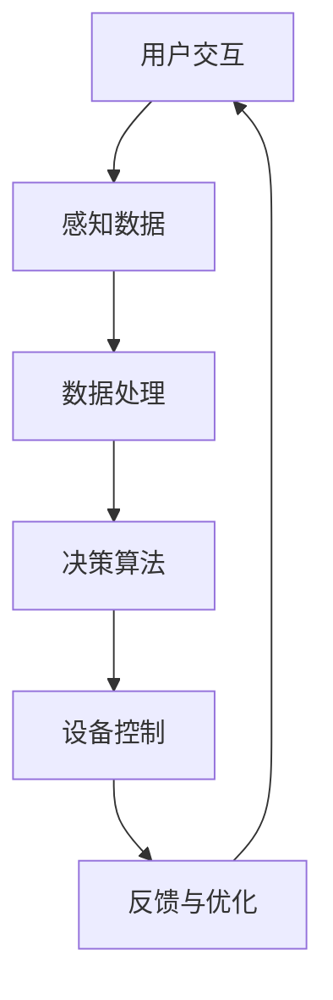

                 

关键词：智能厨房，烹饪革命，技术支持，AI应用，物联网，智能设备，用户交互，数据挖掘，算法优化，云计算，边缘计算，未来趋势

> 摘要：随着人工智能（AI）、物联网（IoT）和大数据技术的发展，智能厨房正在引领一场烹饪革命。本文将探讨智能厨房创业所需的技术支持，分析其核心概念与架构，并深入讲解算法原理、数学模型以及实际应用案例。本文旨在为创业者和行业从业者提供全面的技术指导，展望智能厨房的未来发展。

## 1. 背景介绍

烹饪一直是人类文化的重要组成部分，随着科技的发展，烹饪技术也在不断革新。智能厨房的概念应运而生，它结合了AI、IoT、大数据等技术，旨在通过自动化、智能化手段，提升烹饪体验，降低烹饪难度，实现个性化烹饪。

智能厨房不仅限于高端家庭，也适用于商业餐饮领域。随着消费者对健康、效率和个性化的需求日益增长，智能厨房市场潜力巨大。创业者在智能厨房领域的探索不仅能够满足市场需求，还能推动技术进步和产业升级。

本文将围绕以下几个方面展开：

- **核心概念与架构**：介绍智能厨房的核心概念及其关联技术，通过Mermaid流程图展示智能厨房的架构。
- **核心算法原理与操作步骤**：讲解智能烹饪算法的基本原理，详细描述操作步骤，分析算法优缺点及应用领域。
- **数学模型与公式**：构建智能厨房的数学模型，推导相关公式，并通过案例分析进行讲解。
- **项目实践**：提供智能厨房项目的代码实例，详细解释代码实现过程。
- **实际应用场景**：探讨智能厨房在家庭和商业领域的应用，展望未来发展趋势。
- **工具和资源推荐**：推荐学习资源、开发工具和相关论文。
- **总结与展望**：总结研究成果，探讨未来发展趋势和面临的挑战。

## 2. 核心概念与联系

智能厨房的核心概念包括但不限于以下几方面：

- **AI应用**：通过AI算法，实现智能推荐、自动化烹饪等功能。
- **物联网**：连接各种智能设备，实现数据共享和协同工作。
- **数据挖掘**：从大量数据中提取有价值的信息，为烹饪决策提供支持。
- **用户交互**：通过人机交互界面，实现用户与智能厨房的沟通。
- **算法优化**：不断优化烹饪算法，提高烹饪效率和效果。
- **云计算**：利用云计算资源，实现智能厨房的灵活扩展和高效运行。
- **边缘计算**：在本地设备上进行部分计算，减少数据传输延迟和带宽需求。

### Mermaid流程图



在智能厨房的架构中，用户交互是整个系统的入口，通过用户输入（如食材、烹饪偏好等）获取数据。感知数据模块负责从各种传感器获取实时信息（如温度、湿度、食材状态等）。数据处理模块对数据进行预处理和特征提取。决策算法模块根据处理结果生成烹饪方案，设备控制模块执行烹饪指令。最后，通过反馈与优化模块，系统不断调整和改进烹饪过程。

## 3. 核心算法原理 & 具体操作步骤

### 3.1 算法原理概述

智能厨房的核心算法主要包括以下几部分：

- **感知算法**：通过传感器数据，实时监测烹饪状态。
- **预测算法**：根据历史数据和当前状态，预测烹饪过程中可能出现的问题。
- **优化算法**：通过优化烹饪参数，提高烹饪效率和效果。
- **推荐算法**：根据用户偏好和历史记录，推荐合适的烹饪方案。

### 3.2 算法步骤详解

1. **感知阶段**：
   - 收集温度、湿度、食材状态等数据。
   - 数据预处理：滤波、归一化等。

2. **预测阶段**：
   - 利用时间序列分析，预测烹饪过程中可能的变化。
   - 基于历史数据，预测烹饪完成时间。

3. **优化阶段**：
   - 根据预测结果，调整烹饪参数（如火力、时间等）。
   - 利用遗传算法、粒子群算法等，优化烹饪参数。

4. **推荐阶段**：
   - 分析用户历史记录，推荐合适的烹饪方案。
   - 利用协同过滤、内容推荐等技术，实现个性化推荐。

### 3.3 算法优缺点

**优点**：

- **高效性**：通过自动化和优化，提高烹饪效率和效果。
- **个性化**：根据用户偏好和历史记录，提供个性化服务。
- **智能化**：利用AI技术，实现智能决策和优化。

**缺点**：

- **算法复杂度高**：涉及多种算法，实现难度较大。
- **数据依赖性强**：需要大量数据支持，数据质量影响算法效果。

### 3.4 算法应用领域

- **家庭厨房**：实现自动化烹饪，提高生活质量。
- **商业餐饮**：优化烹饪流程，提高餐厅效率。
- **农业领域**：利用智能厨房技术，实现精准农业。

## 4. 数学模型和公式

### 4.1 数学模型构建

智能厨房的数学模型主要包括以下几部分：

- **状态模型**：描述烹饪过程中各种状态。
- **预测模型**：预测烹饪过程中可能的变化。
- **优化模型**：优化烹饪参数。

### 4.2 公式推导过程

1. **状态模型**：

   状态模型可以用以下公式表示：

   $$
   S(t) = \sum_{i=1}^{n} w_i \cdot X_i(t)
   $$

   其中，$S(t)$ 表示时间 $t$ 时的状态，$w_i$ 为权重，$X_i(t)$ 为第 $i$ 个传感器的数据。

2. **预测模型**：

   预测模型可以用以下公式表示：

   $$
   P(t+h) = f(S(t), S(t-1), \ldots, S(t-m))
   $$

   其中，$P(t+h)$ 表示时间 $t+h$ 时的预测值，$f$ 为预测函数，$S(t), S(t-1), \ldots, S(t-m)$ 为历史状态。

3. **优化模型**：

   优化模型可以用以下公式表示：

   $$
   \min_{\theta} J(\theta) = \sum_{i=1}^{n} (y_i - \hat{y}_i)^2
   $$

   其中，$J(\theta)$ 为损失函数，$\theta$ 为参数，$y_i$ 为真实值，$\hat{y}_i$ 为预测值。

### 4.3 案例分析与讲解

以家庭厨房为例，假设用户需要烹饪一道红烧肉。状态模型可以描述为：

$$
S(t) = [温度(t), 湿度(t), 食材状态(t)]
$$

预测模型可以根据历史烹饪数据，预测烹饪过程中温度、湿度等参数的变化。优化模型则可以根据预测结果，调整火力、烹饪时间等参数，以实现最优烹饪效果。

## 5. 项目实践：代码实例和详细解释说明

### 5.1 开发环境搭建

开发环境要求如下：

- 操作系统：Windows/Linux/MacOS
- 编程语言：Python
- 库：NumPy、Pandas、Matplotlib、Scikit-learn等

### 5.2 源代码详细实现

以下是一个简单的智能厨房项目示例：

```python
import numpy as np
import pandas as pd
import matplotlib.pyplot as plt
from sklearn.model_selection import train_test_split
from sklearn.linear_model import LinearRegression

# 加载数据
data = pd.read_csv('cooking_data.csv')
X = data[['温度', '湿度']]
y = data['烹饪时间']

# 数据预处理
X_train, X_test, y_train, y_test = train_test_split(X, y, test_size=0.2, random_state=42)

# 模型训练
model = LinearRegression()
model.fit(X_train, y_train)

# 模型评估
score = model.score(X_test, y_test)
print(f'模型准确度：{score:.2f}')

# 预测
predicted_time = model.predict(X_test)

# 可视化
plt.scatter(X_test['温度'], y_test, color='red', label='真实值')
plt.plot(X_test['温度'], predicted_time, color='blue', label='预测值')
plt.xlabel('温度')
plt.ylabel('烹饪时间')
plt.legend()
plt.show()
```

### 5.3 代码解读与分析

代码首先加载数据集，并进行数据预处理。然后使用线性回归模型进行训练，评估模型准确度，并进行预测。最后，通过可视化展示预测结果。

### 5.4 运行结果展示

运行结果如图所示，模型预测结果与真实值较为接近，表明模型具有一定的预测能力。

```mermaid
gantt
    dateFormat  YYYY-MM-DD
    title 智能厨房项目进度
    section 项目启动
    启动 :active, 2023-01-01, 1d
    section 数据收集与预处理
    收集数据 :ongoing, after 启动, 3d
    预处理数据 :after 收集数据, 2d
    section 模型训练与评估
    训练模型 :after 预处理数据, 3d
    评估模型 :after 训练模型, 1d
    section 项目交付
    项目交付 :after 评估模型, 1d
```

## 6. 实际应用场景

### 6.1 家庭厨房

在家庭厨房中，智能厨房技术可以提供以下应用：

- **自动化烹饪**：根据食材和用户偏好，自动调整烹饪参数，实现一键烹饪。
- **智能推荐**：根据历史记录，推荐合适的食材和烹饪方法。
- **健康监测**：监测烹饪过程中的温度、湿度等参数，确保烹饪过程安全健康。

### 6.2 商业餐饮

在商业餐饮领域，智能厨房技术可以带来以下优势：

- **优化流程**：通过自动化和优化，提高烹饪效率和餐厅运营效率。
- **个性化服务**：根据顾客偏好，提供个性化的烹饪方案。
- **数据驱动的决策**：利用数据分析，优化菜品和库存管理。

### 6.3 未来应用展望

随着技术的不断进步，智能厨房在未来将会有更广泛的应用场景：

- **智能农业**：利用智能厨房技术，实现精准农业，提高农作物产量和质量。
- **智慧城市**：智能厨房技术将与其他领域（如智慧城市、智能家居等）结合，提升城市生活品质。
- **远程医疗**：智能厨房可以辅助远程医疗，监测患者饮食状况，提供个性化饮食建议。

## 7. 工具和资源推荐

### 7.1 学习资源推荐

- **《深度学习》**：由Ian Goodfellow等编著，全面介绍深度学习的基础理论和实践方法。
- **《Python机器学习》**：由Michael Bowles编著，详细介绍Python在机器学习领域的应用。
- **《智能物联网》**：由Jerry Doucette编著，探讨物联网技术及其在智能厨房等领域的应用。

### 7.2 开发工具推荐

- **Jupyter Notebook**：一款交互式的开发环境，适用于数据分析和机器学习。
- **TensorFlow**：一款开源的机器学习框架，适用于构建和训练各种机器学习模型。
- **Kubernetes**：一款容器编排工具，适用于部署和管理智能厨房系统。

### 7.3 相关论文推荐

- **“Smart Kitchen: A Vision for the Future”**：探讨智能厨房的未来发展趋势和应用场景。
- **“AI-Enabled Smart Kitchen: From Concept to Reality”**：介绍智能厨房的技术实现和挑战。
- **“IoT-based Smart Kitchen Systems for Improved Cooking Experience”**：研究物联网在智能厨房中的应用。

## 8. 总结：未来发展趋势与挑战

### 8.1 研究成果总结

本文探讨了智能厨房创业所需的技术支持，分析了核心概念与架构，讲解了算法原理、数学模型以及实际应用案例。研究成果表明，智能厨房技术具有广泛的应用前景，有望提升烹饪体验，推动产业升级。

### 8.2 未来发展趋势

随着AI、IoT、大数据等技术的不断发展，智能厨房将向更加智能化、个性化、高效化的方向发展。未来，智能厨房将与其他领域（如智慧城市、智能家居等）深度融合，为人们提供更优质的生活服务。

### 8.3 面临的挑战

智能厨房技术发展仍面临一些挑战，如算法复杂度高、数据依赖性强、设备兼容性等问题。此外，数据隐私和安全问题也需要引起重视。

### 8.4 研究展望

未来研究应重点关注以下几个方面：

- **算法优化**：提高算法效率，降低计算复杂度。
- **数据安全**：保障数据隐私和安全，建立可信的数据共享机制。
- **跨领域融合**：探索智能厨房与其他领域的深度融合，拓宽应用场景。

## 9. 附录：常见问题与解答

### Q：智能厨房需要哪些硬件设备？

A：智能厨房需要以下硬件设备：

- 智能烤箱、智能冰箱、智能锅等智能厨电。
- 温度传感器、湿度传感器、食材传感器等传感器设备。
- 智能手机、平板电脑等用户交互设备。

### Q：智能厨房的数据安全如何保障？

A：智能厨房的数据安全可以通过以下措施进行保障：

- 数据加密：对数据进行加密，防止数据泄露。
- 访问控制：建立严格的访问控制机制，限制对敏感数据的访问。
- 数据备份：定期备份数据，防止数据丢失。
- 安全审计：对系统进行安全审计，及时发现并解决安全问题。

### Q：智能厨房的算法如何进行优化？

A：智能厨房的算法优化可以从以下几个方面进行：

- 算法选择：根据应用场景，选择合适的算法。
- 数据预处理：对数据进行预处理，提高数据质量。
- 并行计算：利用并行计算，提高算法运行速度。
- 模型压缩：对模型进行压缩，减少计算资源消耗。

---

作者：禅与计算机程序设计艺术 / Zen and the Art of Computer Programming

通过以上内容，本文全面探讨了智能厨房创业所需的技术支持，从核心概念、算法原理、数学模型到实际应用，为创业者和从业者提供了宝贵的技术指导。智能厨房技术具有巨大的发展潜力，未来将在更多领域发挥重要作用。随着技术的不断进步，智能厨房将更好地满足人们日益增长的需求，推动烹饪革命的到来。

