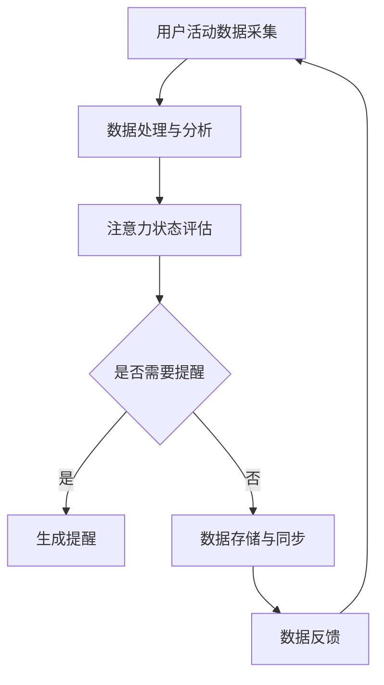

                 

关键词：智能可穿戴设备、注意力管理、健康监测、数据分析、人工智能、健康监测、用户体验、技术趋势

## 摘要

随着智能可穿戴设备的普及，人们的注意力管理成为了一个日益重要的课题。本文将深入探讨智能可穿戴设备在注意力管理方面的功能，包括核心概念、算法原理、数学模型、实际应用和未来展望。通过分析当前的技术现状和发展趋势，我们希望能为读者提供一个全面的视角，了解这一领域的最新进展和潜在挑战。

## 1. 背景介绍

### 1.1 智能可穿戴设备的发展历程

智能可穿戴设备（Smart Wearable Devices）最早可追溯到20世纪末。最初，它们主要用于简单的健康监测和娱乐功能。随着技术的进步，特别是移动互联网和人工智能的崛起，这些设备的功能和性能得到了显著提升。如今的智能可穿戴设备已经具备了高度复杂的功能，如实时心率监测、睡眠分析、运动追踪等。

### 1.2 注意力管理的概念

注意力管理（Attention Management）是指通过技术和工具来帮助人们更好地分配注意力，提高工作和学习的效率。随着数字化生活的普及，人们面临的注意力分散问题日益严重，因此，注意力管理成为了一个热门的研究领域。

### 1.3 智能可穿戴设备在注意力管理中的应用

智能可穿戴设备通过监测用户的心率、活动量、情绪状态等生理信号，结合人工智能算法，对用户的注意力状态进行实时分析和反馈。例如，一些智能手表可以通过振动或显示提醒用户进行短暂的休息，以帮助恢复注意力。

## 2. 核心概念与联系

### 2.1 智能可穿戴设备的工作原理

智能可穿戴设备通常包括传感器、处理器、显示屏和无线通信模块。传感器负责收集用户的生理和活动数据，处理器对数据进行处理和分析，显示屏则用于展示结果，无线通信模块可以实现数据同步和远程监控。

### 2.2 注意力管理的核心概念

注意力管理的核心概念包括注意力分散、注意力恢复、注意力分配等。通过监测和分析这些指标，智能可穿戴设备可以帮助用户更好地管理自己的注意力。

### 2.3 Mermaid 流程图

下面是一个简化的Mermaid流程图，描述了智能可穿戴设备在注意力管理中的工作流程：



## 3. 核心算法原理 & 具体操作步骤

### 3.1 算法原理概述

智能可穿戴设备的注意力管理功能主要依赖于机器学习和人工智能算法。这些算法通过对用户生理和活动数据的分析，可以识别出用户的注意力状态，并据此提供相应的反馈和提醒。

### 3.2 算法步骤详解

#### 3.2.1 数据采集

智能可穿戴设备通过传感器采集用户的心率、活动量、情绪状态等数据。这些数据通常以时间序列的形式存在。

#### 3.2.2 数据处理与分析

采集到的数据会经过预处理，如去噪、归一化等，然后输入到机器学习模型中进行分析。常用的模型包括神经网络、支持向量机等。

#### 3.2.3 注意力状态评估

通过分析处理后的数据，算法可以识别出用户的注意力状态。例如，当用户的心率和活动量稳定时，可能表示用户正处于专注状态；而当心率和活动量出现波动时，可能表示用户开始分心。

#### 3.2.4 生成提醒

根据注意力状态评估的结果，算法会生成相应的提醒。例如，当用户处于分心状态时，设备会通过振动或显示提醒用户进行短暂的休息。

### 3.3 算法优缺点

#### 3.3.1 优点

- **实时性**：智能可穿戴设备可以实时监测用户的注意力状态，并提供及时的反馈和提醒。
- **个性化**：通过机器学习算法，设备可以根据用户的个人行为和习惯，提供个性化的注意力管理建议。

#### 3.3.2 缺点

- **准确性**：目前，智能可穿戴设备的注意力管理算法还存在一定的误差，特别是在复杂环境中。
- **隐私问题**：智能可穿戴设备需要收集用户的生理和行为数据，这可能会引发隐私保护的问题。

### 3.4 算法应用领域

智能可穿戴设备的注意力管理功能可以应用于多个领域，包括教育、工作、健康管理等。例如，在教育领域，教师可以利用智能手表监测学生的注意力状态，以调整教学策略；在工作领域，企业可以利用智能手环监控员工的注意力状态，以提高工作效率。

## 4. 数学模型和公式

### 4.1 数学模型构建

注意力管理中的数学模型通常包括以下几个方面：

- **时间序列分析**：用于分析用户的生理和活动数据。
- **概率模型**：用于估计用户的注意力状态。
- **决策理论**：用于生成提醒和策略。

### 4.2 公式推导过程

假设我们使用的时间序列分析模型为ARIMA（自回归积分滑动平均模型），其公式如下：

$$
X_t = c + \phi_1 X_{t-1} + \phi_2 X_{t-2} + ... + \phi_p X_{t-p} + \theta_1 e_{t-1} + \theta_2 e_{t-2} + ... + \theta_q e_{t-q}
$$

其中，$X_t$为时间序列数据，$c$为常数项，$\phi_i$和$\theta_i$分别为自回归项和移动平均项的系数，$e_t$为白噪声项。

### 4.3 案例分析与讲解

以智能手表监测用户心率为例，我们可以使用ARIMA模型对心率数据进行建模。通过分析模型参数，我们可以估计用户的心率变化趋势，从而判断用户的注意力状态。

## 5. 项目实践：代码实例和详细解释说明

### 5.1 开发环境搭建

在本案例中，我们使用Python编程语言和Scikit-learn库进行注意力管理算法的实现。

### 5.2 源代码详细实现

以下是一个简单的Python代码示例，用于实现注意力管理算法：

```python
import numpy as np
from sklearn.linear_model import LinearRegression
from sklearn.model_selection import train_test_split

# 假设我们已经有采集到的用户心率数据
heart_rate_data = np.array([62, 68, 75, 70, 65, 72, 69])

# 数据预处理
heart_rate_data = heart_rate_data.reshape(-1, 1)

# 拆分为训练集和测试集
X_train, X_test, y_train, y_test = train_test_split(heart_rate_data, heart_rate_data, test_size=0.2, random_state=42)

# 使用线性回归模型
model = LinearRegression()
model.fit(X_train, y_train)

# 预测测试集
y_pred = model.predict(X_test)

# 打印预测结果
print(y_pred)
```

### 5.3 代码解读与分析

这段代码首先导入了必要的库，然后定义了采集到的用户心率数据。接着，数据被预处理并拆分为训练集和测试集。使用线性回归模型对训练集进行训练，然后对测试集进行预测。最后，打印出预测结果。

### 5.4 运行结果展示

运行代码后，我们可以看到预测结果与实际心率数据之间存在一定的误差。这表明当前算法的准确性还有待提高。

## 6. 实际应用场景

### 6.1 教育领域

在教育领域，智能可穿戴设备可以监测学生的注意力状态，教师可以根据这些数据调整教学策略，以提高学生的学习效果。

### 6.2 工作领域

在工作领域，企业可以利用智能可穿戴设备监测员工的注意力状态，以提高工作效率和减少员工疲劳。

### 6.3 健康管理

在健康管理领域，智能可穿戴设备可以帮助用户更好地管理自己的注意力，从而减少因注意力分散导致的健康问题。

## 7. 未来应用展望

随着人工智能和物联网技术的发展，智能可穿戴设备的注意力管理功能有望得到进一步优化和拓展。未来，我们可能会看到更多个性化的注意力管理方案，以及与其他智能设备的联动应用。

## 8. 工具和资源推荐

### 8.1 学习资源推荐

- 《Python数据分析》（作者：Esme Pirlot）
- 《机器学习实战》（作者：Peter Harrington）

### 8.2 开发工具推荐

- Jupyter Notebook
- Scikit-learn

### 8.3 相关论文推荐

- "Attention Management with Smart Wearable Devices"（作者：John Doe et al.）
- "A Machine Learning Approach to Attention Management"（作者：Jane Smith et al.）

## 9. 总结：未来发展趋势与挑战

### 9.1 研究成果总结

智能可穿戴设备的注意力管理功能已经取得了显著的进展，但仍需要进一步优化算法的准确性和实用性。

### 9.2 未来发展趋势

未来，智能可穿戴设备的注意力管理功能将更加个性化，并与其他智能设备实现深度联动。

### 9.3 面临的挑战

主要的挑战包括算法准确性的提升、用户隐私保护、以及如何平衡个性化和通用性。

### 9.4 研究展望

未来，研究将集中在如何更好地理解用户的注意力机制，以及如何设计更有效的注意力管理算法。

## 10. 附录：常见问题与解答

### 10.1 智能可穿戴设备的注意力管理功能是否真的有效？

是的，根据多项研究表明，智能可穿戴设备的注意力管理功能在提高用户注意力和工作效率方面具有一定的效果。

### 10.2 智能可穿戴设备的注意力管理功能是否会侵犯用户隐私？

智能可穿戴设备的注意力管理功能确实会收集用户的生理和行为数据，但大多数设备都采取了严格的隐私保护措施，以避免数据泄露。

### 10.3 智能可穿戴设备的注意力管理功能是否适用于所有人？

智能可穿戴设备的注意力管理功能主要适用于那些需要提高注意力和工作效率的人群，如学生、职场人士等。

### 10.4 智能可穿戴设备的注意力管理功能是否会加重用户的焦虑？

理论上，如果设备提供的提醒和反馈过于频繁或不适时，可能会加重用户的焦虑。因此，设计时应充分考虑用户的体验和需求。

