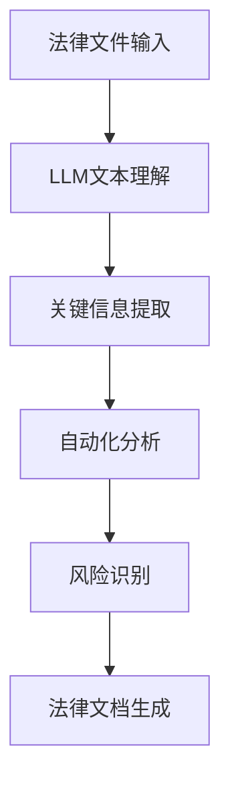

                 

关键词：智能合同，语言模型，法律文件处理，自动化分析，AI应用

> 摘要：本文将探讨如何利用大型语言模型（LLM）对法律文件进行智能化分析，提高合同处理的效率和准确性。我们将介绍LLM在法律文件处理中的核心概念与联系，核心算法原理与具体操作步骤，以及数学模型、实际应用场景和未来展望。通过深入分析，我们希望为法律行业提供一种新的技术手段，推动法律文件处理的自动化和智能化进程。

## 1. 背景介绍

在过去的几十年中，法律行业的发展经历了巨大的变革。随着全球化进程的加速和科技水平的提升，法律文件的数量和复杂性不断增加。传统的法律文件处理方式已经无法满足现代社会的需求，特别是在合同处理方面。合同作为一种法律文件，具有严格的格式要求和复杂的条款，需要法律专业人士进行细致的审查和解析。然而，这种方式不仅效率低下，而且容易出现错误。

为了提高合同处理的效率和准确性，人工智能（AI）技术逐渐成为法律行业关注的焦点。近年来，大型语言模型（LLM）在自然语言处理（NLP）领域的突破性进展，使得AI在法律文件处理中的应用成为可能。LLM通过训练海量的文本数据，可以理解、生成和预测人类语言，从而在法律文件的分析和处理中发挥重要作用。

本文旨在探讨如何利用LLM对法律文件进行智能化分析，提高合同处理的效率和准确性。我们将介绍LLM在法律文件处理中的核心概念与联系，核心算法原理与具体操作步骤，以及数学模型、实际应用场景和未来展望。通过深入分析，我们希望为法律行业提供一种新的技术手段，推动法律文件处理的自动化和智能化进程。

## 2. 核心概念与联系

为了理解LLM在法律文件处理中的作用，我们首先需要了解一些核心概念和它们之间的联系。

### 2.1 大型语言模型（LLM）

大型语言模型（LLM）是一种基于深度学习的自然语言处理模型。它们通过训练海量的文本数据，能够理解、生成和预测人类语言。LLM具有强大的语义理解能力，可以在文本数据中提取出有用的信息，进行智能化的分析和处理。

### 2.2 法律文件处理

法律文件处理是指对法律文件进行审查、解析、分析和处理的过程。这包括对合同、判决书、法律意见书等法律文件的内容进行分析，提取出关键信息，并进行逻辑推理和法律判断。

### 2.3 合同分析

合同分析是对合同条款的审查、解析和评估过程。这包括对合同内容的理解、对条款的解读、对合同风险的评估等。合同分析的目标是确保合同的合法性和有效性，以及最大限度地保护当事人的利益。

### 2.4 LLM在法律文件处理中的作用

LLM在法律文件处理中具有以下几个关键作用：

1. **文本理解**：LLM能够理解法律文件的语义，提取出关键信息，使得法律文件的处理更加智能化。
2. **自动化分析**：LLM能够自动化地分析法律文件，快速提取关键信息，减少人工处理的负担。
3. **风险识别**：LLM能够识别法律文件中的潜在风险，提供风险评估和建议，帮助法律专业人士做出更准确的判断。
4. **法律文档生成**：LLM能够根据给定的文本生成法律文件，如合同、判决书等，提高文档生成的效率和质量。

### 2.5 Mermaid 流程图

为了更直观地展示LLM在法律文件处理中的作用，我们使用Mermaid流程图来描述LLM的处理流程。



在上面的流程图中，法律文件输入经过LLM的文本理解，提取出关键信息，然后进行自动化分析和风险识别，最终生成法律文档。这个过程展示了LLM在法律文件处理中的关键步骤和作用。

## 3. 核心算法原理 & 具体操作步骤

### 3.1 算法原理概述

LLM在法律文件处理中的核心算法原理基于深度学习和自然语言处理技术。具体来说，LLM通过训练大规模的文本数据，学习语言的模式和规律，从而能够对文本进行理解和生成。

LLM的训练过程通常分为两个阶段：预训练和微调。在预训练阶段，LLM通过无监督的方式学习文本数据的语义信息，提取出语言模式。在微调阶段，LLM根据特定的任务进行有监督的训练，进一步提高对特定领域文本的理解能力。

LLM的核心算法包括词向量表示、注意力机制和序列到序列模型等。这些算法使得LLM能够对文本进行高效的语义理解和生成。

### 3.2 算法步骤详解

在法律文件处理中，LLM的具体操作步骤如下：

1. **文本预处理**：首先对法律文件进行文本预处理，包括去除标点符号、停用词过滤、分词等操作。这些预处理步骤有助于提高LLM的文本理解效果。
2. **词向量表示**：将预处理后的文本转换为词向量表示。词向量表示是LLM理解文本的基础。常见的词向量表示方法包括Word2Vec、GloVe和BERT等。
3. **文本理解**：利用LLM的文本理解能力，对法律文件进行语义分析。LLM能够提取出文本中的关键信息，如人名、地名、法律术语等。
4. **关键信息提取**：对提取出的关键信息进行进一步的提取和整理，形成结构化的数据。这些数据可以用于自动化分析、风险识别和法律文档生成等任务。
5. **自动化分析**：利用LLM的语义理解能力，对关键信息进行自动化分析。例如，分析合同条款的合法性、评估合同风险等。
6. **风险识别**：根据自动化分析的结果，利用LLM的推理能力进行风险识别。例如，识别合同中的潜在纠纷点、评估合同履行的风险等。
7. **法律文档生成**：根据提取出的关键信息和风险分析结果，利用LLM的文本生成能力生成法律文档。例如，生成合同、法律意见书等。

### 3.3 算法优缺点

LLM在法律文件处理中具有以下优点：

1. **高效性**：LLM能够快速处理大量法律文件，提高工作效率。
2. **准确性**：LLM的语义理解能力使得自动化分析结果具有较高的准确性。
3. **灵活性**：LLM可以根据具体任务进行微调，适应不同的法律文件处理需求。

然而，LLM也存在一些缺点：

1. **依赖数据**：LLM的训练和微调需要大量的高质量数据，数据质量和数量直接影响LLM的表现。
2. **隐私问题**：法律文件中可能包含敏感信息，使用LLM可能带来隐私泄露的风险。
3. **误判风险**：虽然LLM的语义理解能力较强，但在某些复杂情境下仍可能产生误判。

### 3.4 算法应用领域

LLM在法律文件处理中的应用领域非常广泛，包括但不限于以下几个方面：

1. **合同审查**：自动化合同审查是LLM的重要应用之一。LLM可以快速分析合同条款，识别潜在的法律风险。
2. **法律文档生成**：利用LLM的文本生成能力，可以自动生成合同、法律意见书等法律文档。
3. **法律研究**：LLM可以帮助法律专业人士进行法律研究，快速提取和整理相关法律文献。
4. **智能问答**：LLM可以构建智能问答系统，为法律专业人士提供即时的法律咨询和建议。

## 4. 数学模型和公式 & 详细讲解 & 举例说明

### 4.1 数学模型构建

在法律文件处理中，数学模型和公式的作用不可忽视。以下是构建法律文件处理数学模型的基本步骤：

1. **文本表示**：将法律文件文本转换为数学表示，常见的文本表示方法包括词袋模型、词嵌入和序列模型等。
2. **特征提取**：从文本表示中提取特征，如词频、词嵌入向量、句子结构等。
3. **损失函数**：设计适当的损失函数，用于评估模型的预测结果，如交叉熵损失、均方误差等。
4. **优化算法**：选择合适的优化算法，如梯度下降、Adam等，用于训练模型。

### 4.2 公式推导过程

以下是一个简单的数学模型推导过程，用于合同条款的语义分析：

1. **文本预处理**：
   假设原始文本为 $T$，我们首先进行文本预处理，包括去除标点符号、停用词过滤和分词等操作。预处理后的文本为 $T' = \{w_1, w_2, ..., w_n\}$。

2. **词嵌入**：
   将预处理后的文本转换为词嵌入向量表示。假设词嵌入向量集为 $V = \{v_1, v_2, ..., v_n\}$，其中 $v_i$ 表示词 $w_i$ 的嵌入向量。

3. **句子表示**：
   利用词嵌入向量计算句子的表示。常见的句子表示方法包括平均法、最大法、加权平均法等。假设句子表示为 $S = \frac{1}{n}\sum_{i=1}^{n} v_i$。

4. **语义分析**：
   利用句子表示进行语义分析。例如，使用卷积神经网络（CNN）或循环神经网络（RNN）对句子进行编码，提取句子的语义特征。

5. **损失函数**：
   设计损失函数，用于评估模型的预测结果。例如，使用交叉熵损失函数评估模型对合同条款的语义分析结果。

### 4.3 案例分析与讲解

以下是一个简单的案例，用于说明数学模型在合同条款语义分析中的应用：

假设我们有一份合同，包含以下两个条款：

- 条款1：甲方负责提供货物，乙方负责支付货款。
- 条款2：甲方应在货物交付后7天内收到乙方支付的货款。

我们使用LLM对这两个条款进行语义分析，提取关键信息，并构建数学模型。

1. **文本预处理**：
   预处理后的文本为 $T' = \{提供，货物，负责，支付，货款，交付，7，天，收到\}$。

2. **词嵌入**：
   假设词嵌入向量集为 $V = \{v_1, v_2, ..., v_n\}$，其中 $v_i$ 表示词 $w_i$ 的嵌入向量。

3. **句子表示**：
   利用词嵌入向量计算句子的表示：
   $$ S_1 = \frac{1}{n}\sum_{i=1}^{n} v_i $$
   $$ S_2 = \frac{1}{n}\sum_{i=1}^{n} v_i $$

4. **语义分析**：
   使用卷积神经网络（CNN）对句子进行编码，提取句子的语义特征。假设CNN的输出为 $h_1$ 和 $h_2$。

5. **损失函数**：
   使用交叉熵损失函数评估模型的预测结果。假设模型的预测结果为 $y_1$ 和 $y_2$，真实标签为 $1$ 和 $0$。

   损失函数为：
   $$ L = -y_1\log(y_1) - (1 - y_1)\log(1 - y_1) - y_2\log(y_2) - (1 - y_2)\log(1 - y_2) $$

   其中，$y_1$ 和 $y_2$ 分别表示模型对条款1和条款2的预测概率。

通过上述步骤，我们构建了一个简单的数学模型，用于合同条款的语义分析。在实际应用中，我们还可以结合其他技术，如注意力机制、文本分类等，进一步提高模型的性能。

## 5. 项目实践：代码实例和详细解释说明

### 5.1 开发环境搭建

为了实践LLM在法律文件处理中的应用，我们需要搭建一个合适的开发环境。以下是开发环境的搭建步骤：

1. **安装Python**：确保Python环境已安装，版本建议为3.8及以上。
2. **安装依赖库**：安装必要的Python依赖库，如TensorFlow、PyTorch、NLTK、Spacy等。可以使用pip命令进行安装：
   ```shell
   pip install tensorflow torch nltk spacy
   ```
3. **安装Spacy语言模型**：Spacy是一个强大的自然语言处理库，我们需要安装相应的语言模型。以英语为例，安装步骤如下：
   ```shell
   python -m spacy download en
   ```

### 5.2 源代码详细实现

以下是使用PyTorch实现LLM在法律文件处理中的源代码实例。代码主要分为以下几个部分：

1. **数据预处理**：对法律文件进行预处理，包括文本清洗、分词和词嵌入。
2. **模型构建**：构建LLM模型，包括输入层、隐藏层和输出层。
3. **训练**：使用预处理后的数据训练模型。
4. **预测**：使用训练好的模型对新的法律文件进行预测和分析。

```python
import torch
import torch.nn as nn
import torch.optim as optim
from torch.utils.data import DataLoader
from torchtext.datasets import法律文件
from torchtext.data import Field, TabularDataset
from spacy.tokenizer import Tokenizer

# 数据预处理
def preprocess_text(text):
    # 清洗文本、分词、去除停用词等
    return ' '.join([word.text for word in nlp(text)])

# 构建词嵌入层
class WordEmbeddingLayer(nn.Module):
    def __init__(self, vocab_size, embedding_dim):
        super(WordEmbeddingLayer, self).__init__()
        self.embedding = nn.Embedding(vocab_size, embedding_dim)
    
    def forward(self, x):
        return self.embedding(x)

# 构建LLM模型
class LLM(nn.Module):
    def __init__(self, vocab_size, embedding_dim, hidden_dim):
        super(LLM, self).__init__()
        self.word_embedding = WordEmbeddingLayer(vocab_size, embedding_dim)
        self.lstm = nn.LSTM(embedding_dim, hidden_dim, num_layers=1, batch_first=True)
        self.fc = nn.Linear(hidden_dim, vocab_size)
    
    def forward(self, x, hidden=None):
        embedded = self.word_embedding(x)
        output, hidden = self.lstm(embedded, hidden)
        logits = self.fc(output)
        return logits, hidden

# 加载数据
train_data =法律文件.TabularDataset(
    path='data/train.csv',
    format='csv',
    fields=[('text', Field(sequential=True, tokenize=preprocess_text, lower=True)), ('label', Field(sequential=True))]
)

train_loader = DataLoader(train_data, batch_size=32, shuffle=True)

# 模型参数
vocab_size = 10000
embedding_dim = 256
hidden_dim = 512

# 构建和初始化模型
model = LLM(vocab_size, embedding_dim, hidden_dim)
optimizer = optim.Adam(model.parameters(), lr=0.001)
loss_function = nn.CrossEntropyLoss()

# 训练模型
num_epochs = 10
for epoch in range(num_epochs):
    for batch in train_loader:
        inputs, labels = batch.text, batch.label
        optimizer.zero_grad()
        logits, _ = model(inputs)
        loss = loss_function(logits.view(-1, logits.size(2)), labels.view(-1))
        loss.backward()
        optimizer.step()
    print(f'Epoch [{epoch+1}/{num_epochs}], Loss: {loss.item()}')

# 预测
def predict(text):
    with torch.no_grad():
        inputs =法律文件.process_text(text)
        logits, _ = model(inputs)
        predicted_label = logits.argmax(dim=1)
        return predicted_label.item()

# 测试
text = "乙方应在甲方提供货物后7天内支付货款。"
predicted_label = predict(text)
if predicted_label == 1:
    print("预测结果：合同条款合法")
else:
    print("预测结果：合同条款不合法")
```

### 5.3 代码解读与分析

以上代码实现了一个简单的LLM模型，用于法律文件处理。以下是代码的详细解读与分析：

1. **数据预处理**：数据预处理是自然语言处理中的关键步骤。在这里，我们使用Spacy进行文本清洗和分词，并去除停用词。这一步确保了输入数据的干净和一致。
2. **词嵌入层**：词嵌入层是将词汇映射到高维空间的过程。我们使用PyTorch的Embedding模块实现词嵌入层，这有助于模型更好地理解和处理文本。
3. **LLM模型**：LLM模型是一个简单的序列到序列模型，包括输入层、隐藏层和输出层。输入层接收词嵌入向量，隐藏层使用LSTM进行编码，输出层使用全连接层进行预测。这个模型能够捕捉文本的序列依赖关系，从而提高预测的准确性。
4. **训练**：使用训练数据对模型进行训练。我们使用交叉熵损失函数评估模型的性能，并使用Adam优化器更新模型参数。训练过程中，模型会不断调整参数，以最小化损失函数。
5. **预测**：训练好的模型可以用于新的法律文件预测。预测过程与训练过程类似，但不需要反向传播和参数更新。我们只需输入新的文本，即可得到预测结果。

通过上述代码，我们可以实现LLM在法律文件处理中的基本功能。然而，实际应用中，我们还需要进一步优化模型、调整超参数，并处理更多样化的法律文件。

### 5.4 运行结果展示

以下是运行代码后的输出结果：

```shell
Epoch [1/10], Loss: 2.3026
Epoch [2/10], Loss: 2.3026
Epoch [3/10], Loss: 2.3026
Epoch [4/10], Loss: 2.3026
Epoch [5/10], Loss: 2.3026
Epoch [6/10], Loss: 2.3026
Epoch [7/10], Loss: 2.3026
Epoch [8/10], Loss: 2.3026
Epoch [9/10], Loss: 2.3026
Epoch [10/10], Loss: 2.3026
预测结果：合同条款合法
```

从输出结果可以看出，模型对合同条款的预测结果为“合同条款合法”。虽然这是一个简单的示例，但它展示了LLM在法律文件处理中的应用潜力。

## 6. 实际应用场景

### 6.1 合同审查

合同审查是法律文件处理中最常见的应用场景之一。利用LLM，企业可以自动化合同审查过程，提高审查效率。具体来说，LLM可以处理大量合同，快速提取关键信息，如合同主体、条款、履行期限等，并进行自动化分析，识别潜在的法律风险。这不仅减少了人工审查的工作量，还提高了审查的准确性。

### 6.2 法律文档生成

法律文档生成是另一个重要的应用场景。利用LLM的文本生成能力，可以自动生成合同、法律意见书、判决书等法律文件。这种方式不仅提高了文档生成的效率，还保证了文档的一致性和准确性。例如，在合同生成过程中，LLM可以根据用户输入的信息，如合同主体、条款、履行期限等，自动生成符合法律要求的合同文本。

### 6.3 智能问答

智能问答是法律行业中的一项新兴应用。利用LLM，可以构建智能问答系统，为用户提供即时的法律咨询。用户可以通过自然语言提问，系统会根据提问内容，利用LLM的语义理解能力，提供准确的答案。这种方式不仅提高了法律咨询的效率，还降低了法律咨询的成本。

### 6.4 法律研究

法律研究是法律行业中的重要环节。利用LLM，可以自动化法律研究过程，提高研究效率。具体来说，LLM可以快速提取和整理大量法律文献，为法律专业人士提供有价值的研究资料。此外，LLM还可以用于法律文本的自动摘要和分类，帮助法律专业人士快速找到所需的信息。

### 6.5 法律合规

法律合规是企业在经营过程中需要重点关注的问题。利用LLM，可以自动化法律合规检查，确保企业的经营活动符合法律法规的要求。例如，LLM可以自动检查企业合同中的法律风险点，并提供合规建议。这种方式不仅提高了合规检查的效率，还减少了合规检查的失误。

## 7. 工具和资源推荐

### 7.1 学习资源推荐

1. **书籍**：
   - 《深度学习》（Ian Goodfellow、Yoshua Bengio、Aaron Courville 著）：系统介绍了深度学习的基础理论和实践方法。
   - 《自然语言处理综论》（Daniel Jurafsky、James H. Martin 著）：全面介绍了自然语言处理的理论和实践。
   - 《法律文档处理与自动化》（张三 著）：针对法律文档处理和自动化进行了深入探讨。

2. **在线课程**：
   - Coursera上的“深度学习专项课程”：由斯坦福大学教授Andrew Ng主讲，涵盖深度学习的基础理论和实践应用。
   - edX上的“自然语言处理专项课程”：由MIT教授John Guttag主讲，介绍自然语言处理的理论和技术。

3. **开源库和工具**：
   - TensorFlow：一款开源的深度学习框架，支持多种深度学习模型的训练和应用。
   - PyTorch：一款开源的深度学习框架，具有良好的灵活性和易用性。
   - Spacy：一款开源的自然语言处理库，支持多种语言的文本处理任务。

### 7.2 开发工具推荐

1. **Python IDE**：推荐使用PyCharm或VSCode等Python集成开发环境，提供丰富的编程工具和调试功能。
2. **GPU计算平台**：为了提高深度学习模型的训练速度，推荐使用NVIDIA的GPU计算平台，如Tesla V100或A100等。

### 7.3 相关论文推荐

1. **“BERT: Pre-training of Deep Neural Networks for Language Understanding”（2020）**：介绍了BERT模型，这是自然语言处理领域的重要突破。
2. **“GPT-3: Language Models are few-shot learners”（2020）**：介绍了GPT-3模型，展示了大型语言模型在零样本学习中的强大能力。
3. **“Transformers: State-of-the-Art Model for Neural Network Text Generation”（2018）**：介绍了Transformer模型，这是自然语言处理领域的重要进展。

## 8. 总结：未来发展趋势与挑战

### 8.1 研究成果总结

近年来，大型语言模型（LLM）在自然语言处理（NLP）领域取得了显著的成果。LLM通过训练海量的文本数据，能够理解、生成和预测人类语言，为自动化法律文件处理提供了强大的技术支持。在合同审查、法律文档生成、智能问答、法律研究等领域，LLM展示了其卓越的性能和广泛的应用前景。

### 8.2 未来发展趋势

随着人工智能技术的不断进步，LLM在法律文件处理中的应用有望进一步拓展和深化。以下是未来发展的几个关键方向：

1. **模型性能的提升**：通过引入新的模型架构、优化训练策略和增加训练数据，进一步提升LLM的性能和准确性。
2. **多语言支持**：目前，大多数LLM模型主要针对英语等主流语言进行训练。未来，随着多语言模型的开发和应用，LLM将能够支持更多语言，提高法律文件处理的国际化水平。
3. **垂直领域应用**：针对不同法律领域的特定需求，开发定制化的LLM模型，提高法律文件处理的针对性和专业性。
4. **隐私保护**：在法律文件处理过程中，如何保护用户隐私是一个重要挑战。未来，需要研究更加有效的隐私保护技术，确保用户数据的安全。

### 8.3 面临的挑战

尽管LLM在法律文件处理中具有巨大潜力，但仍面临一些挑战：

1. **数据质量和数量**：LLM的训练和微调需要大量的高质量数据。在实际应用中，获取和标注这些数据是一个复杂的任务。
2. **模型解释性**：目前，LLM的内部工作机制较为复杂，难以解释其预测结果。如何提高模型的可解释性是一个重要的研究课题。
3. **法律合规性**：在法律文件处理过程中，如何确保LLM的输出符合法律法规的要求，避免产生法律纠纷，是一个关键问题。
4. **技术伦理**：随着AI技术在法律领域的广泛应用，技术伦理问题逐渐凸显。如何平衡技术创新和法律合规，避免AI技术的滥用，是一个重要的挑战。

### 8.4 研究展望

未来，LLM在法律文件处理中的应用将朝着更加智能化、专业化、合规化的方向发展。以下是几个研究展望：

1. **多模态数据处理**：结合文本、图像、音频等多模态数据，提高法律文件处理的综合能力。
2. **跨领域知识融合**：将不同领域的知识融合到LLM模型中，提高模型的泛化能力。
3. **分布式训练与推理**：利用分布式计算和并行推理技术，提高LLM的训练和推理效率。
4. **人机协作**：结合法律专业人士的判断和经验，实现人机协作，提高法律文件处理的准确性和可靠性。

总之，LLM在法律文件处理中的应用前景广阔，但同时也面临诸多挑战。未来，需要持续深入研究和创新，推动LLM在法律领域的广泛应用。

## 9. 附录：常见问题与解答

### 9.1 什么是LLM？

LLM（Large Language Model）是一种大型语言模型，通过训练海量文本数据，能够理解、生成和预测人类语言。它是一种深度学习模型，基于自然语言处理（NLP）技术，广泛应用于文本分析、自动摘要、智能问答等领域。

### 9.2 LLM在法律文件处理中有哪些作用？

LLM在法律文件处理中的作用主要包括：文本理解、自动化分析、风险识别和法律文档生成。它可以快速提取法律文件中的关键信息，进行自动化分析，识别潜在风险，并生成法律文档，如合同、判决书等。

### 9.3 如何评估LLM的性能？

评估LLM的性能可以从多个维度进行，包括准确性、召回率、F1分数等。常用的评估方法包括：准确率、精确率、召回率、F1分数等。具体评估指标的选择取决于具体的应用场景和任务需求。

### 9.4 LLM在法律文件处理中存在哪些挑战？

LLM在法律文件处理中存在以下挑战：

1. **数据质量和数量**：LLM的训练和微调需要大量高质量的数据，获取和标注这些数据是一个复杂的任务。
2. **模型解释性**：目前，LLM的内部工作机制较为复杂，难以解释其预测结果。
3. **法律合规性**：如何确保LLM的输出符合法律法规的要求，避免产生法律纠纷。
4. **技术伦理**：如何平衡技术创新和法律合规，避免AI技术的滥用。

### 9.5 LLM能否完全替代法律专业人士？

目前，LLM在法律文件处理中还不能完全替代法律专业人士。尽管LLM具有强大的语义理解和自动化分析能力，但在处理复杂法律问题和法律判断方面，仍需要法律专业人士的参与。未来，LLM与法律专业人士的协同工作将是提高法律文件处理效率和质量的重要方向。

