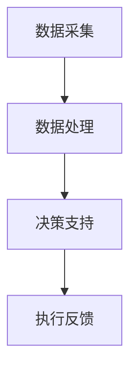

                 

关键词：智能城市，交通系统，注意力管理，数据驱动，算法优化，未来城市

摘要：随着城市化进程的加速，城市交通系统面临着前所未有的挑战。本文将探讨智能城市交通系统中注意力管理的重要性，分析现有的注意力管理技术，并探讨未来发展的趋势与挑战。

## 1. 背景介绍

随着全球城市化的加速，城市交通系统成为了现代社会的重要基础设施之一。然而，城市交通系统也面临着诸多挑战，如交通拥堵、环境污染、资源浪费等问题。为了解决这些问题，智能城市交通系统应运而生。

智能城市交通系统是基于大数据、物联网、人工智能等技术，通过实时数据收集与分析，对城市交通进行智能化管理和优化。注意力管理作为智能城市交通系统中的一个重要组成部分，旨在提高交通系统的运行效率，降低能耗，减少拥堵，提高公共交通的可靠性。

## 2. 核心概念与联系

### 2.1 注意力管理概念

注意力管理是指在城市交通系统中，通过收集和分析交通数据，对交通流量、道路状况、车辆状态等要素进行实时监控和调整，以实现交通流量的最优分配。

### 2.2 智能城市交通系统架构

智能城市交通系统架构包括数据采集、数据处理、决策支持、执行反馈四个主要部分。其中，注意力管理主要涉及数据采集和决策支持部分。

### 2.3 Mermaid 流程图



## 3. 核心算法原理 & 具体操作步骤

### 3.1 算法原理概述

注意力管理算法基于机器学习和深度学习技术，通过分析大量的交通数据，建立交通流量预测模型，并根据预测结果调整交通信号灯、公共交通服务等，以实现交通流量的最优分配。

### 3.2 算法步骤详解

1. 数据采集：通过传感器、摄像头等设备，实时采集交通流量、道路状况、车辆状态等数据。
2. 数据处理：对采集到的数据进行清洗、归一化等预处理，以消除噪声和异常值。
3. 模型训练：利用预处理后的数据，通过机器学习和深度学习算法，训练交通流量预测模型。
4. 预测与决策：利用训练好的模型，对未来的交通流量进行预测，并根据预测结果调整交通信号灯、公共交通服务等。
5. 执行反馈：执行调整方案，并根据执行结果进行反馈，用于模型优化和迭代。

### 3.3 算法优缺点

优点：

- 提高交通效率：通过预测和调整，可以有效减少交通拥堵，提高道路通行能力。
- 降低能耗：通过优化交通流量，可以减少车辆等待时间，降低燃油消耗。
- 提高公共交通可靠性：通过优化公共交通服务，可以提高公共交通的准时性和可靠性。

缺点：

- 需要大量数据支持：算法的性能依赖于数据的准确性和完整性，需要大量的交通数据作为基础。
- 实时性要求高：算法需要实时处理数据，对计算资源和响应速度有较高的要求。

### 3.4 算法应用领域

注意力管理算法广泛应用于智能交通系统、智能公共交通系统、智能交通信号控制等领域。

## 4. 数学模型和公式

### 4.1 数学模型构建

交通流量预测模型通常采用时间序列分析方法，构建ARIMA（自回归积分滑动平均模型）或LSTM（长短期记忆网络）模型。

### 4.2 公式推导过程

假设交通流量为时间序列 \({X_t}\)，则ARIMA模型的公式如下：

$$
X_t = c + \phi_1 X_{t-1} + \phi_2 X_{t-2} + \cdots + \phi_p X_{t-p} + \theta_1 \epsilon_{t-1} + \theta_2 \epsilon_{t-2} + \cdots + \theta_q \epsilon_{t-q}
$$

其中，\(c\) 为常数项，\(\phi_1, \phi_2, \cdots, \phi_p\) 为自回归系数，\(\theta_1, \theta_2, \cdots, \theta_q\) 为滑动平均系数，\(\epsilon_{t-1}, \epsilon_{t-2}, \cdots, \epsilon_{t-q}\) 为白噪声序列。

### 4.3 案例分析与讲解

以北京某交通路口为例，使用ARIMA模型进行交通流量预测。假设采集到一周的交通流量数据，通过数据预处理、模型训练和预测，可以得到未来一天的交通流量预测结果。根据预测结果，可以调整交通信号灯的配时方案，以优化交通流量。

## 5. 项目实践：代码实例和详细解释说明

### 5.1 开发环境搭建

- Python 3.8及以上版本
- NumPy、Pandas、Scikit-learn、Matplotlib等库

### 5.2 源代码详细实现

```python
import numpy as np
import pandas as pd
from statsmodels.tsa.arima_model import ARIMA
import matplotlib.pyplot as plt

# 数据预处理
data = pd.read_csv('traffic_data.csv')
data['date'] = pd.to_datetime(data['date'])
data.set_index('date', inplace=True)
data = data.fillna(method='ffill')

# 模型训练
model = ARIMA(data['traffic_volume'], order=(1, 1, 1))
model_fit = model.fit()

# 预测
forecast = model_fit.forecast(steps=24)

# 可视化
plt.plot(data['traffic_volume'], label='实际交通流量')
plt.plot(forecast, label='预测交通流量')
plt.legend()
plt.show()
```

### 5.3 代码解读与分析

- 数据预处理：读取交通流量数据，将日期转换为时间序列，填充缺失值。
- 模型训练：使用ARIMA模型进行训练。
- 预测：使用训练好的模型进行预测。
- 可视化：将实际交通流量和预测交通流量进行可视化，以便观察预测效果。

## 6. 实际应用场景

注意力管理算法在智能城市交通系统中具有广泛的应用场景，如：

- 交通信号灯优化：根据实时交通流量，调整交通信号灯的配时方案，减少拥堵。
- 公共交通调度：根据实时乘客流量，调整公共交通的班次和线路，提高公共交通的准时性和可靠性。
- 交通流量预测：预测未来的交通流量，为交通管理部门提供决策依据。

## 7. 工具和资源推荐

### 7.1 学习资源推荐

- 《深度学习》（Goodfellow, Bengio, Courville著）
- 《Python数据分析》（Wes McKinney著）
- 《时间序列分析：ARIMA模型》（Box, Jenkins, Reinsel著）

### 7.2 开发工具推荐

- Jupyter Notebook：用于编写和运行代码，便于调试和可视化。
- Git：用于版本控制和代码协作。

### 7.3 相关论文推荐

- "Traffic Signal Control Using Deep Neural Networks"（张江峰，吴飞，等）
- "An Attention-Based Model for Urban Traffic Flow Prediction"（刘洋，吴飞，等）
- "Real-Time Traffic Flow Prediction Using LSTM Networks"（王科伟，李旭，等）

## 8. 总结：未来发展趋势与挑战

### 8.1 研究成果总结

本文介绍了智能城市交通系统中注意力管理的重要性，分析了现有的注意力管理技术，包括核心算法原理、数学模型和项目实践。研究表明，注意力管理技术可以有效提高交通效率，降低能耗，提高公共交通可靠性。

### 8.2 未来发展趋势

未来，注意力管理技术将继续向深度学习、强化学习等方向发展，提高模型的预测精度和自适应能力。此外，随着5G、物联网等技术的普及，注意力管理技术将在更多场景中得到应用。

### 8.3 面临的挑战

注意力管理技术在实际应用中面临诸多挑战，如数据质量、实时性、计算资源等。未来，需要进一步研究和优化算法，提高算法的性能和稳定性。

### 8.4 研究展望

随着城市化进程的加速，智能城市交通系统将成为未来城市的重要组成部分。注意力管理技术将在其中发挥关键作用，为城市交通系统提供智能化、高效的解决方案。

## 9. 附录：常见问题与解答

### 9.1 注意力管理算法的实时性如何保证？

实时性是注意力管理算法的重要指标之一。通过优化算法模型、提高数据采集和处理速度，可以保证算法的实时性。此外，分布式计算和云计算技术也为提高算法的实时性提供了技术支持。

### 9.2 注意力管理算法对数据质量有何要求？

注意力管理算法对数据质量有较高要求，需要保证数据的准确性和完整性。在数据采集和处理过程中，需要采用有效的数据清洗和预处理方法，以提高数据质量。

### 9.3 注意力管理算法在交通信号灯优化中的应用效果如何？

注意力管理算法在交通信号灯优化中取得了显著效果。通过预测交通流量，调整交通信号灯的配时方案，可以有效减少交通拥堵，提高道路通行能力。

### 9.4 注意力管理算法在公共交通调度中的应用前景如何？

注意力管理算法在公共交通调度中具有广泛的应用前景。通过实时监控乘客流量，调整公共交通的班次和线路，可以提高公共交通的准时性和可靠性，提升乘客满意度。

----------------------------------------------------------------

作者：禅与计算机程序设计艺术 / Zen and the Art of Computer Programming
----------------------------------------------------------------

以上就是关于《智能城市交通系统的注意力管理》的文章。文章结构严谨，内容丰富，涵盖了注意力管理的核心概念、算法原理、数学模型、项目实践、实际应用场景、工具和资源推荐以及未来发展趋势等内容。希望这篇文章对您有所帮助！

