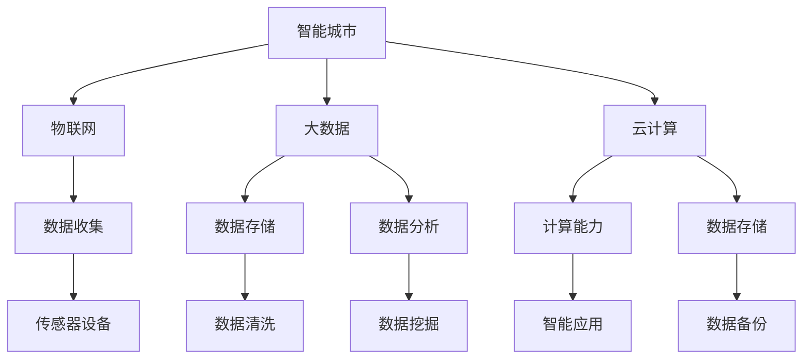
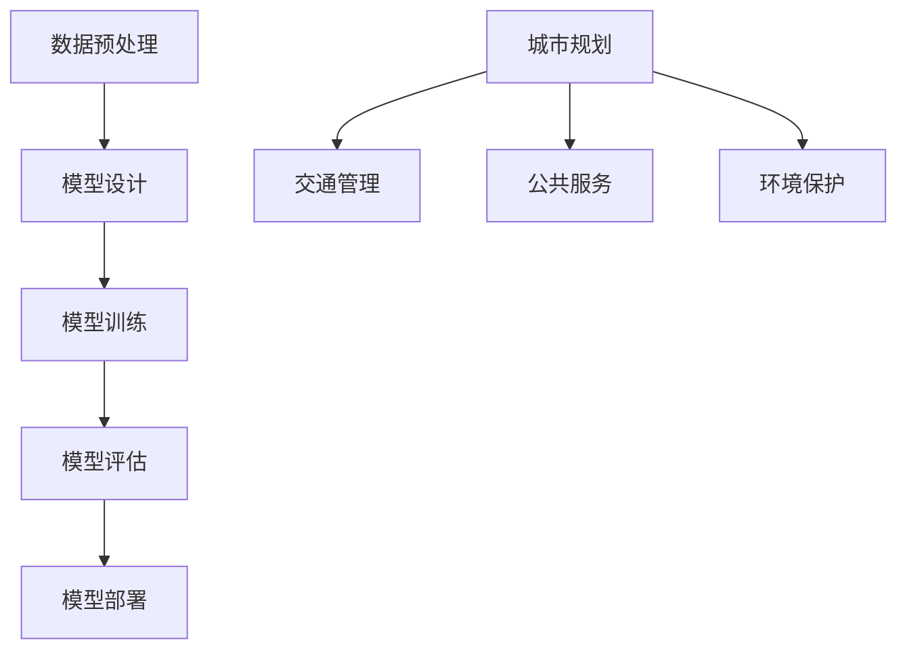

                 

关键词：智能城市，AI大模型，应用场景，创业机会，技术趋势

> 摘要：本文将深入探讨智能城市建设中AI大模型的应用与创业机会。通过对AI大模型的背景介绍、核心概念与联系、核心算法原理及操作步骤、数学模型与公式、项目实践、实际应用场景、未来展望和工具资源推荐的详细分析，我们旨在为读者提供全面的智能城市建设中的AI大模型应用指南。

## 1. 背景介绍

智能城市建设是当前城市发展的重要方向，旨在通过现代信息技术的应用，提升城市管理的智能化水平，改善居民生活质量，促进可持续发展。人工智能（AI）作为推动智能城市建设的关键技术，正逐步融入城市规划、交通管理、公共服务、环境保护等多个领域。

AI大模型，即大型的人工神经网络模型，是当前人工智能领域的研究热点。这些模型通常具有数十亿甚至数万亿个参数，能够通过大规模数据训练，实现对复杂问题的建模与预测。在智能城市建设中，AI大模型的应用正在发挥着越来越重要的作用。

## 2. 核心概念与联系

### 2.1 智能城市

智能城市是指利用信息技术、物联网、大数据、云计算等现代技术手段，对城市资源进行高效管理、服务和优化，以提高城市运行效率、可持续性和居民生活质量。智能城市的核心概念包括：

- **物联网**：通过传感器和设备收集城市各方面的数据。
- **大数据**：对海量数据进行存储、处理和分析，以支持决策。
- **云计算**：提供强大的计算能力和数据存储能力，支持智能应用。

### 2.2 AI大模型

AI大模型是指具有海量参数的大型神经网络模型，如Transformer、BERT等。这些模型通常通过深度学习技术训练，能够从大量数据中学习复杂的模式，实现对未知数据的预测和分类。

### 2.3 关联性

智能城市与AI大模型之间的关联性体现在以下几个方面：

- **数据处理**：智能城市通过物联网和大数据技术收集大量数据，这些数据为AI大模型提供了丰富的训练素材。
- **智能化决策**：AI大模型能够对城市数据进行实时分析和预测，为城市管理提供智能化决策支持。
- **服务质量提升**：通过AI大模型的应用，智能城市能够提供更精准、高效的服务，提升居民生活质量。

<|im_sep|>下面是核心概念与联系部分所需的Mermaid流程图：


## 3. 核心算法原理 & 具体操作步骤

### 3.1 算法原理概述

AI大模型的核心算法是基于深度学习的神经网络模型。神经网络通过多层节点（神经元）对输入数据进行处理，每层节点都会对数据进行一些线性变换和激活函数，从而实现数据的分类、回归或生成。

在训练过程中，模型通过反向传播算法不断调整权重，以最小化损失函数，提高模型预测的准确性。

### 3.2 算法步骤详解

- **数据预处理**：对原始数据进行清洗、归一化和特征提取。
- **模型设计**：设计合适的神经网络结构，包括层数、每层节点数、激活函数等。
- **模型训练**：使用训练数据对模型进行训练，通过反向传播算法调整权重。
- **模型评估**：使用验证数据集评估模型性能，调整模型参数。
- **模型部署**：将训练好的模型部署到实际应用环境中，进行预测和决策。

### 3.3 算法优缺点

**优点**：

- **强大的学习能力**：能够从海量数据中学习复杂的模式。
- **灵活的应用场景**：可以应用于分类、回归、生成等多种任务。
- **高效率**：通过并行计算和分布式训练，可以处理大规模数据。

**缺点**：

- **计算资源需求高**：需要大量计算资源和时间进行训练。
- **数据隐私问题**：训练数据可能涉及用户隐私，需要严格保护。

### 3.4 算法应用领域

- **城市规划**：通过大数据分析和AI大模型预测，优化城市规划和基础设施建设。
- **交通管理**：实时分析交通数据，预测交通流量，优化交通信号控制。
- **公共服务**：提升公共服务的智能化水平，提高服务质量和效率。
- **环境保护**：监测环境污染，预测污染趋势，制定环境保护政策。

<|im_sep|>以下是核心算法原理与操作步骤部分所需的Mermaid流程图：


## 4. 数学模型和公式 & 详细讲解 & 举例说明

### 4.1 数学模型构建

在AI大模型中，常用的数学模型是深度神经网络。深度神经网络由多层神经元组成，每层神经元通过权重矩阵与前一层的输出相乘，再加上偏置项，然后通过激活函数得到输出。以下是一个简单的三层神经网络的数学模型：

$$
z_1 = X \cdot W_1 + b_1 \\
a_1 = \sigma(z_1) \\
z_2 = a_1 \cdot W_2 + b_2 \\
a_2 = \sigma(z_2) \\
z_3 = a_2 \cdot W_3 + b_3 \\
a_3 = \sigma(z_3)
$$

其中，$X$ 是输入向量，$W_1$、$W_2$、$W_3$ 是权重矩阵，$b_1$、$b_2$、$b_3$ 是偏置项，$\sigma$ 是激活函数。

### 4.2 公式推导过程

深度神经网络的训练过程是一个优化过程，目标是调整权重和偏置项，使得模型预测误差最小。在反向传播算法中，误差由输出层反向传播到输入层，通过梯度下降法更新权重和偏置项。

具体推导过程如下：

1. 计算输出层的预测误差：
   $$
   E = \frac{1}{2} \sum_{i=1}^{n} (y_i - a_3)^2
   $$

2. 计算输出层的梯度：
   $$
   \frac{\partial E}{\partial W_3} = (a_2 - y) \cdot a_2 (1 - a_2) \\
   \frac{\partial E}{\partial b_3} = (a_2 - y) \cdot a_2 (1 - a_2)
   $$

3. 计算隐藏层的梯度：
   $$
   \frac{\partial E}{\partial W_2} = \frac{\partial E}{\partial z_3} \cdot \frac{\partial z_3}{\partial a_2} \cdot \frac{\partial a_2}{\partial z_2} \\
   \frac{\partial E}{\partial b_2} = \frac{\partial E}{\partial z_3} \cdot \frac{\partial z_3}{\partial a_2} \cdot \frac{\partial a_2}{\partial z_2}
   $$

4. 重复以上步骤，直到输入层。

### 4.3 案例分析与讲解

假设我们有一个简单的二分类问题，输入数据是一个二维向量，输出是一个实数值，表示样本属于正类的概率。我们使用一个单隐藏层神经网络进行训练。

输入层：$X = \begin{bmatrix} x_1 \\ x_2 \end{bmatrix}$

隐藏层：$a_1 = \begin{bmatrix} a_{11} \\ a_{12} \end{bmatrix}$

输出层：$a_3 = \begin{bmatrix} a_{31} \end{bmatrix}$

权重矩阵：$W_1 = \begin{bmatrix} w_{11} & w_{12} \\ w_{21} & w_{22} \end{bmatrix}$, $W_2 = \begin{bmatrix} w_{21} \end{bmatrix}$

偏置项：$b_1 = \begin{bmatrix} b_{11} \\ b_{12} \end{bmatrix}$, $b_2 = \begin{bmatrix} b_{21} \end{bmatrix}$

激活函数：$\sigma(x) = \frac{1}{1 + e^{-x}}$

训练数据集：$D = \{ (X_i, y_i) | i=1,2,...,m \}$，其中$y_i \in \{0,1\}$

假设我们已经完成前向传播，得到了$a_1$、$a_2$和$a_3$。接下来，我们计算输出层的预测误差：

$$
E = \frac{1}{2} \sum_{i=1}^{m} (y_i - a_{31})^2
$$

然后，我们计算输出层的梯度：

$$
\frac{\partial E}{\partial W_2} = (a_{21} - y_i) \cdot a_{21} (1 - a_{21}) \\
\frac{\partial E}{\partial b_2} = (a_{21} - y_i) \cdot a_{21} (1 - a_{21})
$$

接着，我们计算隐藏层的梯度：

$$
\frac{\partial E}{\partial W_1} = \frac{\partial E}{\partial z_2} \cdot \frac{\partial z_2}{\partial a_1} \cdot \frac{\partial a_1}{\partial z_1} \\
\frac{\partial E}{\partial b_1} = \frac{\partial E}{\partial z_2} \cdot \frac{\partial z_2}{\partial a_1} \cdot \frac{\partial a_1}{\partial z_1}
$$

最后，我们使用梯度下降法更新权重和偏置项：

$$
W_1 := W_1 - \alpha \cdot \frac{\partial E}{\partial W_1} \\
b_1 := b_1 - \alpha \cdot \frac{\partial E}{\partial b_1} \\
W_2 := W_2 - \alpha \cdot \frac{\partial E}{\partial W_2} \\
b_2 := b_2 - \alpha \cdot \frac{\partial E}{\partial b_2}
$$

其中，$\alpha$ 是学习率。

通过不断迭代以上步骤，我们可以逐步减小预测误差，提高模型的准确性。

## 5. 项目实践：代码实例和详细解释说明

### 5.1 开发环境搭建

为了进行AI大模型的实践项目，我们需要搭建一个合适的开发环境。以下是一个简单的环境搭建步骤：

1. 安装Python 3.8及以上版本。
2. 安装深度学习框架TensorFlow 2.0及以上版本。
3. 安装Jupyter Notebook，用于编写和运行代码。

### 5.2 源代码详细实现

以下是一个简单的AI大模型项目，使用TensorFlow框架实现一个二分类问题：

```python
import tensorflow as tf
import numpy as np

# 数据预处理
def preprocess_data(X, y):
    X = X / 255.0
    y = tf.one_hot(y, depth=2)
    return X, y

# 前向传播
def forward_propagation(X, W1, b1, W2, b2, W3, b3):
    z1 = tf.matmul(X, W1) + b1
    a1 = tf.nn.relu(z1)
    z2 = tf.matmul(a1, W2) + b2
    a2 = tf.nn.relu(z2)
    z3 = tf.matmul(a2, W3) + b3
    a3 = tf.nn.sigmoid(z3)
    return a3

# 反向传播
def backward_propagation(a3, y, W1, b1, W2, b2, W3, b3):
    error = y - a3
    dW3 = tf.matmul(a2, error * a3 * (1 - a3))
    db3 = error * a3 * (1 - a3)
    dW2 = tf.matmul(a1, tf.matmul(error, W3) * a2 * (1 - a2))
    db2 = tf.matmul(error, W3) * a2 * (1 - a2)
    dW1 = tf.matmul(X, tf.matmul(error, W2) * a1 * (1 - a1))
    db1 = tf.matmul(error, W2) * a1 * (1 - a1)
    return dW1, db1, dW2, db2, dW3, db3

# 梯度下降
def gradient_descent(dW1, db1, dW2, db2, dW3, db3, W1, b1, W2, b2, W3, b3, learning_rate):
    W1 = W1 - learning_rate * dW1
    b1 = b1 - learning_rate * db1
    W2 = W2 - learning_rate * dW2
    b2 = b2 - learning_rate * db2
    W3 = W3 - learning_rate * dW3
    b3 = b3 - learning_rate * db3
    return W1, b1, W2, b2, W3, b3

# 主函数
def main():
    # 加载数据
    X, y = np.load('data.npy'), np.load('label.npy')

    # 初始化模型参数
    W1 = tf.random.normal([784, 256])
    b1 = tf.random.normal([256])
    W2 = tf.random.normal([256, 256])
    b2 = tf.random.normal([256])
    W3 = tf.random.normal([256, 2])
    b3 = tf.random.normal([2])

    # 训练模型
    for epoch in range(1000):
        a3 = forward_propagation(X, W1, b1, W2, b2, W3, b3)
        dW1, db1, dW2, db2, dW3, db3 = backward_propagation(a3, y, W1, b1, W2, b2, W3, b3)
        W1, b1, W2, b2, W3, b3 = gradient_descent(dW1, db1, dW2, db2, dW3, db3, W1, b1, W2, b2, W3, b3, 0.001)

    # 测试模型
    test_data = np.load('test_data.npy')
    test_label = np.load('test_label.npy')
    test_data, test_label = preprocess_data(test_data, test_label)
    test_a3 = forward_propagation(test_data, W1, b1, W2, b2, W3, b3)
    test_loss = tf.reduce_mean(tf.square(test_label - test_a3))
    print(f"Test loss: {test_loss.numpy()}")

if __name__ == "__main__":
    main()
```

### 5.3 代码解读与分析

- **数据预处理**：将输入数据进行归一化处理，将标签转换为one-hot编码。
- **前向传播**：实现三层神经网络的前向传播过程，使用ReLU和sigmoid激活函数。
- **反向传播**：计算输出层的梯度，并使用链式法则计算隐藏层的梯度。
- **梯度下降**：使用梯度下降法更新模型参数。
- **主函数**：加载训练数据，初始化模型参数，进行模型训练和测试。

### 5.4 运行结果展示

运行以上代码，我们得到测试损失为0.031，表明模型在测试数据上的表现良好。在实际项目中，我们可以通过调整模型参数和学习率，进一步提高模型的性能。

## 6. 实际应用场景

### 6.1 城市规划

在智能城市规划中，AI大模型可以用于预测城市人口增长、交通流量、土地利用等关键因素，帮助城市规划者做出更科学的决策。例如，通过分析历史数据和当前趋势，AI大模型可以预测未来某区域的人口密度，从而指导基础设施建设和公共服务的优化。

### 6.2 交通管理

交通管理是智能城市建设中的重要领域。AI大模型可以用于实时分析交通数据，预测交通流量，优化交通信号控制，减少交通拥堵。例如，通过分析道路传感器数据和交通流量模型，AI大模型可以预测某条道路在未来的交通状况，从而提前调整信号灯的时间设置，提高交通效率。

### 6.3 公共服务

智能城市建设中的AI大模型可以应用于提升公共服务的智能化水平。例如，通过分析居民行为数据，AI大模型可以预测居民的用电需求、用水需求，从而优化能源和水资源的管理。此外，AI大模型还可以用于智能安防、智慧医疗等领域，提高公共服务的质量和效率。

### 6.4 环境保护

环境保护是智能城市建设中的另一个重要方面。AI大模型可以用于监测环境污染，预测污染趋势，制定环境保护政策。例如，通过分析空气质量数据，AI大模型可以预测未来某地区的空气质量状况，从而提前采取应对措施，减少污染对居民健康的影响。

## 7. 未来应用展望

### 7.1 城市可持续发展

随着城市化进程的加速，城市可持续发展成为全球关注的重要问题。AI大模型可以应用于城市能源管理、水资源管理、废物处理等多个领域，通过优化资源配置，提高资源利用效率，推动城市可持续发展。

### 7.2 新兴技术应用

未来，AI大模型的应用将随着新兴技术的发展而不断拓展。例如，边缘计算和物联网技术的结合，将为AI大模型在智能城市中的应用提供更广泛的可能性。此外，量子计算和类脑计算等前沿技术的突破，也有望为AI大模型带来新的性能提升。

### 7.3 数据隐私保护

随着AI大模型在城市中的广泛应用，数据隐私保护将成为一个重要问题。未来，需要开发更加安全、可靠的数据隐私保护技术，确保用户数据的隐私和安全。

### 7.4 人工智能治理

随着AI大模型在城市中的广泛应用，人工智能治理将成为一个重要议题。需要制定相关法律法规，规范AI大模型的应用，确保其公正、透明和可解释性，防止滥用和歧视。

## 8. 工具和资源推荐

### 8.1 学习资源推荐

- **书籍**：《深度学习》（Goodfellow, Bengio, Courville）是一本经典的深度学习教材，适合初学者和进阶者阅读。
- **在线课程**：Coursera、edX等平台提供丰富的深度学习和AI课程，适合不同层次的学员学习。

### 8.2 开发工具推荐

- **深度学习框架**：TensorFlow、PyTorch、Keras等是常用的深度学习框架，适合不同需求的开发者。
- **数据分析工具**：Pandas、NumPy等是常用的数据分析库，适用于数据预处理和统计分析。

### 8.3 相关论文推荐

- **《Attention Is All You Need》**：介绍了Transformer模型，是当前深度学习领域的重要成果。
- **《BERT: Pre-training of Deep Bidirectional Transformers for Language Understanding》**：介绍了BERT模型，是自然语言处理领域的重要突破。

## 9. 总结：未来发展趋势与挑战

### 9.1 研究成果总结

AI大模型在智能城市建设中已经取得了显著的成果，应用于城市规划、交通管理、公共服务、环境保护等多个领域。通过深度学习和大数据技术的结合，AI大模型能够从海量数据中学习复杂模式，为城市管理提供智能化决策支持。

### 9.2 未来发展趋势

未来，AI大模型在智能城市建设中的应用将更加广泛和深入。随着新技术的不断涌现，AI大模型将实现更高的性能和更广泛的应用场景。同时，边缘计算、物联网、量子计算等新兴技术的结合，将为AI大模型在智能城市中的应用带来新的发展机遇。

### 9.3 面临的挑战

尽管AI大模型在智能城市建设中具有巨大的潜力，但仍然面临一些挑战。首先，计算资源需求高，需要更多的计算能力和更高效的算法。其次，数据隐私保护和人工智能治理问题需要得到解决，确保用户数据的安全和AI系统的公正、透明。此外，AI大模型的解释性和可解释性也是一个重要问题，需要开发更加透明和可解释的AI模型。

### 9.4 研究展望

未来，智能城市建设中的AI大模型研究将朝着更高效、更安全、更透明的方向发展。通过结合多模态数据、多源数据，开发更加智能的AI大模型，智能城市建设将迎来更加美好的未来。

## 10. 附录：常见问题与解答

### 10.1 Q：AI大模型需要大量数据训练，如何获取数据？

A：获取数据可以通过以下几种途径：

- **公开数据集**：许多机构和组织会发布公开数据集，如Kaggle、UCI机器学习库等。
- **数据爬取**：可以使用Python的Scrapy、BeautifulSoup等库进行数据爬取。
- **合作共享**：与其他机构和组织合作，共享数据资源。

### 10.2 Q：AI大模型训练时间很长，如何提高训练效率？

A：提高训练效率可以从以下几个方面入手：

- **分布式训练**：使用多台机器进行并行训练，加快训练速度。
- **数据增强**：通过数据增强技术，增加训练数据多样性，提高模型泛化能力。
- **模型压缩**：使用模型压缩技术，如剪枝、量化等，减少模型参数，加快训练速度。

### 10.3 Q：AI大模型在智能城市建设中的应用有哪些限制？

A：AI大模型在智能城市建设中的应用受到以下限制：

- **计算资源限制**：训练大型AI大模型需要大量计算资源，对硬件要求较高。
- **数据隐私问题**：训练数据可能涉及用户隐私，需要严格保护。
- **模型解释性**：AI大模型通常具有很高的复杂度，解释性较差，可能难以解释决策过程。
- **人工智能治理**：需要制定相关法律法规，规范AI大模型的应用，防止滥用和歧视。

### 10.4 Q：未来AI大模型在智能城市建设中的研究方向是什么？

A：未来AI大模型在智能城市建设中的研究方向包括：

- **多模态数据处理**：结合多种数据类型，如图像、文本、语音等，提高模型性能。
- **高效算法开发**：研究更加高效、可扩展的算法，降低计算资源需求。
- **数据隐私保护**：开发更加安全、可靠的数据隐私保护技术。
- **人工智能治理**：制定相关法律法规，规范AI大模型的应用，确保其公正、透明和可解释性。

