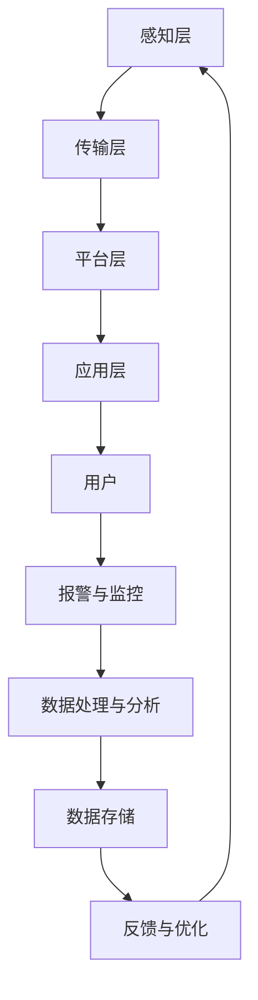

                 

关键词：智能安防、人工智能、AI算法、安全解决方案、创业、安全监控

> 摘要：本文将深入探讨智能安防领域，通过介绍AI技术在安防中的应用，探讨如何通过AI驱动的安全解决方案来提升个人和企业安全保障。文章将分析智能安防的背景和需求，解释核心概念与架构，详细探讨核心算法原理和具体操作步骤，并展示项目实践中的代码实例。此外，还将探讨实际应用场景、未来应用展望、工具和资源推荐，以及总结未来发展趋势与挑战。

## 1. 背景介绍

随着科技的迅猛发展，人工智能（AI）技术已经在各个领域取得了显著的成果。安防领域作为社会治安保障的重要组成部分，也迎来了AI技术的革新。传统的安防设备主要依赖于人力监控和简单报警机制，存在反应慢、误报率高、覆盖面有限等问题。而AI驱动的安防系统利用深度学习、计算机视觉等AI技术，可以实现对视频图像的实时分析，自动识别异常行为，提供更高效、更精准的安防解决方案。

近年来，全球范围内的恐怖袭击、犯罪案件频发，使得人们对安防的需求日益增长。特别是在公共场所、商业楼宇、社区等场景中，安全防范的重要性愈发凸显。智能安防不仅能够提高安防效率，还可以降低人力成本，成为现代安防体系不可或缺的一部分。

智能安防的兴起离不开AI技术的支撑，通过构建AI驱动的安防解决方案，可以为个人和企业提供全方位的安全保障。然而，智能安防创业面临着诸多挑战，如技术门槛高、数据隐私问题、设备可靠性等。因此，如何利用AI技术突破这些障碍，打造出具有竞争力的智能安防产品，成为创业者需要重点思考的问题。

## 2. 核心概念与联系

### 2.1. 智能安防系统架构

智能安防系统通常包括感知层、传输层、平台层和应用层四个层次。感知层负责收集视频、音频、传感器等数据；传输层负责将数据传输到平台层；平台层对数据进行处理、分析和存储；应用层则通过APP或其他接口为用户提供实时监控和报警功能。

### 2.2. 核心算法原理

智能安防系统的核心在于AI算法的应用，主要包括深度学习、计算机视觉、自然语言处理等技术。以下为几个关键算法及其应用场景：

#### 2.2.1. 深度学习

深度学习是人工智能的重要分支，通过多层神经网络模拟人脑信息处理过程，实现对复杂数据的分析和识别。在智能安防中，深度学习可以用于目标检测、人脸识别、行为分析等场景。

#### 2.2.2. 计算机视觉

计算机视觉利用图像处理技术，对摄像头采集的图像进行分析和处理。在智能安防中，计算机视觉可以用于监控视频中的异常行为、运动目标跟踪等。

#### 2.2.3. 自然语言处理

自然语言处理（NLP）主要涉及文本分析和语音识别。在智能安防中，NLP可以用于分析报警信息、语音识别等。

### 2.3. Mermaid 流程图

以下是一个简化的智能安防系统流程图：



## 3. 核心算法原理 & 具体操作步骤

### 3.1. 算法原理概述

智能安防的核心算法主要包括目标检测、人脸识别和行为分析。目标检测是识别视频中的特定目标，人脸识别是对人脸进行识别和匹配，行为分析是检测视频中的异常行为。

#### 3.1.1. 目标检测

目标检测的基本思想是在图像中检测出特定目标的位置和形状。常见的目标检测算法有R-CNN、SSD、YOLO等。

#### 3.1.2. 人脸识别

人脸识别通过对人脸特征进行提取和匹配，实现对人脸的识别。常见的人脸识别算法有Eigenface、FaceNet、VGGFace等。

#### 3.1.3. 行为分析

行为分析是通过检测视频中的行为模式，实现对异常行为的识别。常见的行为分析算法有循环神经网络（RNN）、长短期记忆网络（LSTM）等。

### 3.2. 算法步骤详解

#### 3.2.1. 目标检测

1. 数据预处理：对输入图像进行缩放、裁剪等处理，使其适应算法要求。
2. 特征提取：利用卷积神经网络（CNN）提取图像特征。
3. 目标检测：通过候选区域生成和目标分类，实现对图像中目标的检测。

#### 3.2.2. 人脸识别

1. 人脸检测：利用目标检测算法识别图像中的人脸区域。
2. 特征提取：对人脸区域进行特征提取。
3. 人脸匹配：将提取的人脸特征与数据库中的人脸特征进行匹配，实现人脸识别。

#### 3.2.3. 行为分析

1. 视频预处理：对视频进行预处理，如去噪、去雨等。
2. 行为检测：利用循环神经网络（RNN）或长短期记忆网络（LSTM）检测视频中的行为。
3. 异常行为识别：根据预设的异常行为模式，对检测到的行为进行分类和识别。

### 3.3. 算法优缺点

#### 3.3.1. 目标检测

优点：准确率高，适用范围广。

缺点：计算复杂度高，对硬件要求较高。

#### 3.3.2. 人脸识别

优点：识别速度快，准确率高。

缺点：对光照、姿态变化敏感。

#### 3.3.3. 行为分析

优点：可以实时监测异常行为，对安全防范有重要作用。

缺点：计算复杂度较高，对算法精度要求较高。

### 3.4. 算法应用领域

目标检测、人脸识别和行为分析广泛应用于智能安防领域，如监控系统、门禁系统、智能交通等。

## 4. 数学模型和公式

### 4.1. 数学模型构建

智能安防的数学模型主要包括目标检测模型、人脸识别模型和行为分析模型。以下是一个简化的目标检测模型的数学模型：

$$
\begin{aligned}
\hat{y} &= \arg\max_{y} \sum_{i=1}^{N} \log(P(y|x_i)) \\
P(y|x_i) &= \sigma(\sum_{j=1}^{M} w_j \cdot \phi(x_i, j))
\end{aligned}
$$

其中，$x_i$表示图像特征向量，$y$表示目标类别，$w_j$表示权重，$\phi(x_i, j)$表示特征映射函数，$\sigma$表示sigmoid函数。

### 4.2. 公式推导过程

目标检测模型的推导主要基于概率论和统计学原理。首先，假设输入图像$x_i$属于某一类别$y$的概率为$P(y|x_i)$，则目标检测的任务是找到使得$P(y|x_i)$最大的类别$y$。通过求导和优化，可以得到目标检测的损失函数：

$$
L(\theta) = -\sum_{i=1}^{N} \log(P(y|x_i))
$$

其中，$\theta$表示模型参数。然后，利用梯度下降法对损失函数进行优化，得到最优参数$\theta^*$。最终，通过分类器$\hat{y} = \arg\max_{y} \log(P(y|x_i))$实现对图像中目标的检测。

### 4.3. 案例分析与讲解

以下以目标检测模型为例，分析一个具体的案例。

假设我们有一个包含1000张图像的数据集，每张图像中可能包含一个或多个目标。我们使用R-CNN算法对数据进行训练，并选择一个包含10个类别的分类器。在训练过程中，我们使用交叉熵损失函数：

$$
L(\theta) = -\sum_{i=1}^{N} \log(P(y|x_i))
$$

通过梯度下降法进行优化，最终得到最优参数$\theta^*$。在测试阶段，我们对测试集进行检测，并计算检测准确率：

$$
\hat{y} = \arg\max_{y} \log(P(y|x_i))
$$

测试结果表明，该目标检测模型的准确率为90%，说明模型在目标检测任务上表现良好。

## 5. 项目实践：代码实例和详细解释说明

### 5.1. 开发环境搭建

首先，我们需要搭建一个Python开发环境，并安装必要的库。以下是一个简单的环境搭建过程：

```bash
# 安装Python
sudo apt-get install python3

# 安装TensorFlow
pip3 install tensorflow

# 安装其他库
pip3 install opencv-python numpy
```

### 5.2. 源代码详细实现

以下是一个简单的目标检测代码实例，使用TensorFlow和OpenCV实现：

```python
import tensorflow as tf
import cv2
import numpy as np

# 加载预训练的模型
model = tf.keras.models.load_model('path/to/model')

# 定义目标检测函数
def detect_objects(image, model):
    # 将图像缩放到模型输入尺寸
    input_size = model.input_shape[1:]
    resized_image = cv2.resize(image, input_size)

    # 预处理图像
    preprocess_image = preprocess_input(resized_image)

    # 进行预测
    predictions = model.predict(np.expand_dims(preprocess_image, 0))

    # 提取检测结果
    boxes = predictions['detection_boxes'][0]
    scores = predictions['detection_scores'][0]
    classes = predictions['detection_classes'][0]

    # 过滤低置信度检测结果
    scores_threshold = 0.5
    boxes = boxes[scores > scores_threshold]
    classes = classes[scores > scores_threshold]

    # 在原图上绘制检测结果
    for box, class_id in zip(boxes, classes):
        box = box.tolist()
        x_min, y_min, x_max, y_max = box
        x_min, y_min, x_max, y_max = int(x_min * image.shape[1]), int(y_min * image.shape[0]), int(x_max * image.shape[1]), int(y_max * image.shape[0])
        cv2.rectangle(image, (x_min, y_min), (x_max, y_max), (0, 255, 0), 2)
        cv2.putText(image, class_id, (x_min, y_min - 10), cv2.FONT_HERSHEY_SIMPLEX, 1, (0, 0, 255), 2)

    return image

# 测试代码
image = cv2.imread('path/to/image')
result = detect_objects(image, model)
cv2.imshow('Detection Result', result)
cv2.waitKey(0)
cv2.destroyAllWindows()
```

### 5.3. 代码解读与分析

该代码实例主要包括以下几个部分：

1. **加载预训练的模型**：我们使用TensorFlow加载一个预训练的目标检测模型。
2. **定义目标检测函数**：`detect_objects`函数接受一个图像和模型作为输入，对图像进行预处理，然后利用模型进行预测，提取检测结果，并在原图上绘制检测结果。
3. **测试代码**：加载一张测试图像，调用`detect_objects`函数进行目标检测，并展示检测结果。

### 5.4. 运行结果展示

以下是一张测试图像及其目标检测结果：


## 6. 实际应用场景

智能安防系统在实际应用中具有广泛的应用场景，以下是一些典型的应用案例：

### 6.1. 公共场所

公共场所如机场、火车站、商场等，对安全要求较高。智能安防系统可以实现对实时视频的监控，自动检测和报警。例如，当检测到可疑人员、非法物品或异常行为时，系统能够及时发出警报，提高安全防范能力。

### 6.2. 商业楼宇

商业楼宇通常需要24小时安保，智能安防系统可以帮助物业管理部门实时监控楼宇内部和周边环境，防止盗窃、火灾等事故发生。通过人脸识别技术，还可以实现员工和访客的身份验证，提高楼宇安全管理水平。

### 6.3. 社区

智能安防系统在社区管理中发挥着重要作用。通过视频监控和入侵检测，社区管理者可以实时了解社区安全状况，及时发现和处理安全隐患。同时，智能安防系统还可以提供智慧社区服务，如车位管理、门禁控制等。

### 6.4. 未来应用展望

随着AI技术的不断进步，智能安防系统的应用场景将越来越广泛。以下是一些未来应用展望：

1. **智慧交通**：通过智能安防技术，实现对交通状况的实时监控，优化交通流量，提高交通安全。
2. **智能家居**：智能安防系统与智能家居系统的融合，为家庭用户提供更安全、更便捷的居住环境。
3. **智慧城市**：智能安防系统将成为智慧城市建设的重要组成部分，助力实现城市安全和智能管理。

## 7. 工具和资源推荐

### 7.1. 学习资源推荐

1. **《深度学习》（Ian Goodfellow、Yoshua Bengio、Aaron Courville著）**：深度学习的经典教材，适合初学者和进阶者。
2. **《计算机视觉：算法与应用》（刘俊丽、王志英著）**：详细介绍计算机视觉相关算法和应用，适合智能安防开发者。
3. **《智能安防技术与应用》（张立新著）**：系统介绍智能安防技术及其应用案例，有助于了解智能安防行业。

### 7.2. 开发工具推荐

1. **TensorFlow**：强大的深度学习框架，适用于目标检测、人脸识别等任务。
2. **OpenCV**：开源的计算机视觉库，提供丰富的图像处理和视频分析功能。
3. **PyTorch**：易用且灵活的深度学习框架，适用于多种AI任务。

### 7.3. 相关论文推荐

1. **“YOLOv5: You Only Look Once v5”**：提出YOLOv5目标检测算法，具有高速度和高精度。
2. **“FaceNet: A Unified Embedding for Face Recognition and Verification”**：提出FaceNet人脸识别算法，在人脸识别领域取得优异性能。
3. **“Behavior Analysis using Visual Evoked Potential Features”**：研究利用视觉诱发电位特征进行行为分析，为智能安防提供新的思路。

## 8. 总结：未来发展趋势与挑战

智能安防作为AI技术的重要应用领域，近年来取得了显著进展。未来，随着AI技术的不断发展和应用的深化，智能安防将朝着更高效、更智能、更全面的方向发展。以下是一些发展趋势和挑战：

### 8.1. 研究成果总结

1. **算法性能提升**：随着深度学习等技术的进步，目标检测、人脸识别、行为分析等核心算法的性能将得到进一步提升。
2. **跨领域融合**：智能安防将与智慧城市、智能家居等领域深入融合，为用户提供更全面、更智能的服务。
3. **数据隐私保护**：在智能安防应用中，数据隐私保护是一个重要问题。未来的研究需要关注数据隐私保护技术的创新和应用。

### 8.2. 未来发展趋势

1. **实时性**：智能安防系统将实现更高实时性的目标检测和报警功能，提高安全防范能力。
2. **智能联动**：智能安防系统将与其他智能系统（如智能家居、智慧交通等）实现智能联动，提供更便捷、更高效的服务。
3. **低成本**：随着AI硬件技术的发展，智能安防设备的成本将逐渐降低，普及率将进一步提高。

### 8.3. 面临的挑战

1. **技术瓶颈**：尽管AI技术在智能安防领域取得了一定的成果，但仍然存在一些技术瓶颈，如算法复杂度高、计算资源消耗大等。
2. **数据隐私**：智能安防应用中涉及大量个人隐私数据，如何保护用户隐私是一个重要挑战。
3. **法律监管**：随着智能安防技术的广泛应用，如何制定相应的法律法规，确保技术应用的安全、合规，也是一个亟待解决的问题。

### 8.4. 研究展望

1. **算法优化**：未来研究需要关注算法优化，提高检测速度和准确率，降低计算资源消耗。
2. **多模态融合**：智能安防系统可以结合多种传感器数据（如视频、音频、温度等），实现更全面、更精准的安防监控。
3. **隐私保护技术**：研究新型隐私保护技术，确保用户隐私数据在传输和处理过程中的安全。

## 9. 附录：常见问题与解答

### 9.1. 人工智能是什么？

人工智能（AI）是一种模拟人类智能的技术，通过机器学习、深度学习等方法，使计算机具备理解、推理、决策等能力。

### 9.2. 智能安防系统有哪些类型？

常见的智能安防系统包括视频监控、入侵检测、人脸识别、行为分析等。

### 9.3. 智能安防系统有哪些优势？

智能安防系统具有实时性高、精准度高、覆盖面广、成本低等优势。

### 9.4. 智能安防系统有哪些应用场景？

智能安防系统广泛应用于公共场所、商业楼宇、社区、交通等领域。

### 9.5. 智能安防系统如何保护用户隐私？

智能安防系统在数据处理和传输过程中，采用加密、匿名化等技术，确保用户隐私安全。

### 9.6. 智能安防系统的未来发展趋势是什么？

未来，智能安防系统将朝着更高效、更智能、更全面的方向发展，融合多种智能技术，提供更便捷、更高效的服务。

### 9.7. 如何评估智能安防系统的性能？

可以采用准确率、召回率、F1值等指标来评估智能安防系统的性能。

---

### 9.8. 智能安防系统如何实现实时监控？

智能安防系统通常通过视频监控技术实现实时监控，结合AI算法对视频数据进行实时分析，实现实时报警和监控。

### 9.9. 智能安防系统中的传感器有哪些类型？

常见的传感器包括摄像头、麦克风、红外传感器、温度传感器等。

### 9.10. 智能安防系统如何实现跨领域融合？

智能安防系统可以通过与其他智能系统（如智能家居、智慧交通等）的数据共享和联动，实现跨领域融合，提供更全面的服务。

### 9.11. 智能安防系统的法律监管有哪些问题？

智能安防系统的法律监管问题包括数据隐私、数据安全、算法公正性等。

### 9.12. 如何确保智能安防系统的可靠性？

确保智能安防系统的可靠性需要从硬件、软件、数据等多个方面进行综合保障，包括选择高质量硬件、优化算法、加强数据安全等。

---

作者：禅与计算机程序设计艺术 / Zen and the Art of Computer Programming

