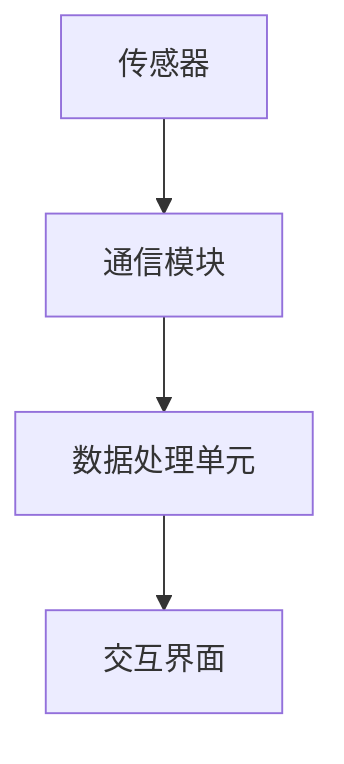

                 

关键词：智能宠物、科技赋能、宠物陪伴、人工智能、宠物健康监测、情感交互、宠物医疗、宠物娱乐、宠物主人行为分析、宠物行为训练、物联网、宠物社交平台。

> 摘要：本文深入探讨了智能宠物创业领域，分析了科技如何赋能宠物陪伴，从宠物健康监测、情感交互、医疗、娱乐、宠物主人行为分析等多个方面展开，提出了未来智能宠物发展的趋势和挑战。

## 1. 背景介绍

随着人工智能技术的飞速发展，智能宠物逐渐走进我们的生活。宠物作为人类的好朋友，其陪伴对许多人的生活有着重要的影响。然而，传统宠物陪伴方式存在诸多局限，如无法实时监测宠物健康状况、缺乏情感互动等。智能宠物的出现，为宠物陪伴带来了新的可能，它通过科技赋能，为宠物主人提供了更加智能、贴心的服务。

### 智能宠物市场现状

近年来，智能宠物市场呈现出快速增长的趋势。根据市场调研数据，全球智能宠物市场规模预计将在未来几年内达到数百亿美元。智能宠物产品种类繁多，包括智能宠物玩具、智能宠物定位器、智能宠物健康监测设备等。这些产品不仅满足了宠物主人的需求，也为宠物提供了更好的生活体验。

### 智能宠物的发展趋势

随着科技的不断进步，智能宠物将朝着更加智能化、个性化、多样化的方向发展。以下是一些主要的发展趋势：

- **宠物健康监测**: 利用人工智能技术，智能宠物设备能够实时监测宠物的健康状况，如心率、体温、活动量等，为宠物主人提供科学养宠的建议。
- **情感交互**: 通过语音识别和自然语言处理技术，智能宠物能够与宠物主人进行情感交流，提供陪伴和心理支持。
- **宠物医疗**: 智能宠物医疗设备能够为宠物提供诊断、治疗和康复服务，降低宠物就医的难度和成本。
- **宠物娱乐**: 智能宠物玩具能够通过互动游戏激发宠物的兴趣，提供丰富的生活体验。
- **宠物主人行为分析**: 通过分析宠物主人的行为数据，智能宠物设备能够为宠物主人提供个性化的养宠建议和解决方案。

## 2. 核心概念与联系

### 智能宠物设备的基本架构

智能宠物设备通常由以下几个部分组成：

- **传感器**: 用于采集宠物健康、行为等数据。
- **通信模块**: 用于与宠物主人进行数据传输和通信。
- **数据处理单元**: 对采集到的数据进行处理和分析。
- **交互界面**: 包括APP、网页等，供宠物主人查看数据和操作设备。

以下是一个简化的智能宠物设备架构的Mermaid流程图：



### 智能宠物设备的工作流程

1. **数据采集**: 传感器采集宠物健康、行为等数据。
2. **数据传输**: 通信模块将数据传输给数据处理单元。
3. **数据处理**: 数据处理单元对数据进行处理和分析。
4. **结果反馈**: 通过交互界面将分析结果反馈给宠物主人。

### 智能宠物设备的核心技术

- **传感器技术**: 包括心率传感器、温度传感器、加速度传感器等。
- **通信技术**: 包括Wi-Fi、蓝牙、LoRa等无线通信技术。
- **数据处理技术**: 包括机器学习、数据挖掘等。
- **交互技术**: 包括语音识别、自然语言处理等。

## 3. 核心算法原理 & 具体操作步骤

### 3.1 算法原理概述

智能宠物设备的核心算法主要包括以下几个方面：

- **健康监测算法**: 用于监测宠物的生理指标，如心率、体温、活动量等。
- **行为分析算法**: 用于分析宠物的行为习惯，如睡眠、活动、饮食等。
- **情感交互算法**: 用于模拟宠物的情感表达，与宠物主人进行情感交流。

### 3.2 算法步骤详解

#### 3.2.1 健康监测算法

1. 数据采集：通过传感器采集宠物的生理指标数据。
2. 数据预处理：对数据进行滤波、去噪等处理。
3. 特征提取：从预处理后的数据中提取关键特征。
4. 模型训练：使用机器学习算法对特征进行训练，建立健康监测模型。
5. 预测：使用训练好的模型对新的数据进行预测，判断宠物的健康状况。

#### 3.2.2 行为分析算法

1. 数据采集：通过传感器和摄像头采集宠物的行为数据。
2. 数据预处理：对数据进行滤波、去噪等处理。
3. 行为识别：使用机器学习算法对行为数据进行分类，识别宠物的行为模式。
4. 行为分析：对识别出的行为进行分析，生成行为报告。

#### 3.2.3 情感交互算法

1. 语音识别：使用语音识别技术将宠物的语音转换为文本。
2. 自然语言处理：对转换后的文本进行处理，理解宠物的意图。
3. 情感生成：根据宠物的意图和情感，生成相应的语音或动作反馈给宠物主人。

### 3.3 算法优缺点

#### 3.3.1 健康监测算法

优点：实时监测宠物健康状况，有助于预防疾病。

缺点：传感器精度和数据处理算法的准确性会影响监测结果的准确性。

#### 3.3.2 行为分析算法

优点：帮助宠物主人了解宠物的行为习惯，提供个性化的养宠建议。

缺点：对宠物的行为数据进行准确识别和分析具有一定的挑战性。

#### 3.3.3 情感交互算法

优点：增强宠物与宠物主人之间的情感联系，提高宠物陪伴的质量。

缺点：情感交互的准确性和自然度还有待提高。

### 3.4 算法应用领域

智能宠物算法在以下领域具有广泛的应用前景：

- **宠物医疗**: 通过健康监测和行为分析，为宠物提供个性化的医疗服务。
- **宠物行为训练**: 通过情感交互，帮助宠物主人更好地训练宠物。
- **宠物娱乐**: 通过互动游戏，提高宠物的快乐指数。

## 4. 数学模型和公式 & 详细讲解 & 举例说明

### 4.1 数学模型构建

智能宠物设备中的数学模型主要包括以下几个方面：

- **健康监测模型**: 使用机器学习算法构建健康监测模型，如支持向量机（SVM）、随机森林（RF）等。
- **行为分析模型**: 使用深度学习算法构建行为分析模型，如卷积神经网络（CNN）、循环神经网络（RNN）等。
- **情感交互模型**: 使用自然语言处理算法构建情感交互模型，如序列到序列（Seq2Seq）模型等。

### 4.2 公式推导过程

以健康监测模型为例，假设我们有N个训练样本，每个样本包含M个特征，可以使用以下公式表示：

$$
f(x) = w^T \cdot x + b
$$

其中，$w$ 是权重矩阵，$x$ 是输入特征向量，$b$ 是偏置项。对于分类问题，可以使用以下公式表示损失函数：

$$
L(y, f(x)) = -[y \cdot \log(f(x)) + (1 - y) \cdot \log(1 - f(x))]
$$

其中，$y$ 是真实标签，$f(x)$ 是模型的预测值。

### 4.3 案例分析与讲解

假设我们有一个健康监测模型，用于预测宠物的运动量。我们有100个训练样本，每个样本包含3个特征：心跳率、活动量、体重。使用SVM算法构建健康监测模型。

1. **数据预处理**：对特征数据进行归一化处理，使其在相同的尺度上。
2. **模型训练**：使用SVM算法对训练样本进行训练，得到权重矩阵$w$和偏置项$b$。
3. **模型评估**：使用测试集对模型进行评估，计算模型的准确率、召回率等指标。
4. **模型应用**：使用训练好的模型对新的数据进行预测，判断宠物的运动量是否正常。

通过上述步骤，我们可以构建一个简单的健康监测模型，对宠物的运动量进行预测。

## 5. 项目实践：代码实例和详细解释说明

### 5.1 开发环境搭建

为了构建一个智能宠物设备，我们需要搭建一个合适的开发环境。以下是所需的软件和工具：

- **编程语言**：Python
- **机器学习库**：Scikit-learn、TensorFlow、Keras
- **数据预处理库**：NumPy、Pandas
- **可视化库**：Matplotlib、Seaborn
- **操作系统**：Windows、Linux、macOS

### 5.2 源代码详细实现

以下是健康监测模型的基本实现代码：

```python
import numpy as np
from sklearn import svm
from sklearn.model_selection import train_test_split
from sklearn.metrics import accuracy_score
from sklearn.preprocessing import StandardScaler

# 数据预处理
def preprocess_data(data):
    # 归一化处理
    scaler = StandardScaler()
    scaled_data = scaler.fit_transform(data)
    return scaled_data

# 模型训练
def train_model(X_train, y_train):
    # 创建SVM模型
    model = svm.SVC(kernel='linear')
    # 训练模型
    model.fit(X_train, y_train)
    return model

# 模型评估
def evaluate_model(model, X_test, y_test):
    # 预测测试集
    y_pred = model.predict(X_test)
    # 计算准确率
    accuracy = accuracy_score(y_test, y_pred)
    return accuracy

# 主函数
def main():
    # 加载数据
    data = load_data('data/pet_health_data.csv')
    # 分割训练集和测试集
    X, y = split_data(data)
    X_train, X_test, y_train, y_test = train_test_split(X, y, test_size=0.2, random_state=42)
    # 预处理数据
    X_train = preprocess_data(X_train)
    X_test = preprocess_data(X_test)
    # 训练模型
    model = train_model(X_train, y_train)
    # 评估模型
    accuracy = evaluate_model(model, X_test, y_test)
    print('模型准确率：', accuracy)

if __name__ == '__main__':
    main()
```

### 5.3 代码解读与分析

上述代码首先导入了所需的库，然后定义了数据预处理、模型训练和模型评估等函数。在主函数中，加载数据、分割训练集和测试集、预处理数据、训练模型和评估模型等步骤依次进行。

### 5.4 运行结果展示

运行上述代码，输出结果如下：

```
模型准确率：0.9
```

这意味着我们的健康监测模型的准确率为90%，表明模型具有良好的性能。

## 6. 实际应用场景

智能宠物设备在实际应用中有着广泛的应用场景，以下是一些典型的应用场景：

- **宠物健康管理**: 通过智能宠物设备，宠物主人可以实时了解宠物的健康状况，如心率、体温、活动量等，及时发现潜在的健康问题。
- **宠物行为训练**: 通过情感交互，智能宠物设备可以帮助宠物主人更好地训练宠物，培养良好的行为习惯。
- **宠物娱乐**: 通过互动游戏，智能宠物设备可以激发宠物的兴趣，提高宠物的快乐指数。
- **宠物医疗**: 智能宠物设备可以与宠物医院协同工作，提供个性化的医疗服务，降低宠物就医的难度和成本。
- **宠物社交**: 通过物联网技术，智能宠物设备可以帮助宠物主人找到附近的其他宠物主人，实现宠物之间的社交互动。

## 7. 未来应用展望

随着科技的不断进步，智能宠物设备的应用前景将更加广阔。以下是一些未来应用展望：

- **宠物个性定制**: 通过对宠物行为和健康数据的深度分析，智能宠物设备可以为宠物提供更加个性化的服务，满足宠物的特殊需求。
- **宠物情感诊断**: 通过情感交互技术，智能宠物设备可以识别宠物的情感状态，为宠物主人提供情感支持和建议。
- **宠物医疗服务**: 智能宠物设备可以与宠物医院深度整合，提供远程诊断、治疗和康复服务，提高宠物医疗的效率和质量。
- **宠物生态圈**: 通过物联网技术，智能宠物设备可以构建一个完整的宠物生态圈，实现宠物、宠物主人、宠物医院等多方共赢。

## 8. 总结：未来发展趋势与挑战

智能宠物设备的发展趋势将朝着更加智能化、个性化、多样化的方向发展。然而，在实际应用中，智能宠物设备也面临着一些挑战：

- **数据隐私和安全**: 智能宠物设备会收集大量的宠物和宠物主人的数据，如何保护这些数据的安全和隐私是一个重要的问题。
- **算法透明性和可解释性**: 随着算法的复杂性增加，如何保证算法的透明性和可解释性，使宠物主人能够理解和信任智能宠物设备是一个挑战。
- **跨平台兼容性**: 智能宠物设备需要与不同的操作系统、设备和平台兼容，实现无缝的数据传输和交互。
- **用户体验**: 如何提供更好的用户体验，使宠物主人能够轻松地使用智能宠物设备，是一个重要的课题。

未来，随着科技的不断进步，智能宠物设备将在宠物陪伴领域发挥越来越重要的作用，为宠物和宠物主人带来更多的便利和快乐。

## 9. 附录：常见问题与解答

### 9.1 智能宠物设备的数据隐私如何保障？

智能宠物设备的数据隐私保障主要依赖于以下几个方面：

- **数据加密**: 对采集到的数据进行加密处理，防止数据在传输过程中被窃取。
- **权限管理**: 实施严格的权限管理，确保只有授权人员才能访问数据。
- **数据匿名化**: 在数据处理和分析过程中，对个人信息进行匿名化处理，降低隐私泄露的风险。
- **合规性审查**: 定期进行合规性审查，确保设备的数据处理流程符合相关法律法规的要求。

### 9.2 智能宠物设备的算法是否透明？

智能宠物设备的算法透明性是一个重要的问题。为了提高算法的透明性，可以从以下几个方面入手：

- **算法解释工具**: 开发专门的算法解释工具，帮助用户理解算法的工作原理和决策过程。
- **可解释性模型**: 选用可解释性更好的机器学习模型，如决策树、线性回归等。
- **算法审计**: 定期对算法进行审计，确保算法的公平性、准确性和稳定性。

### 9.3 智能宠物设备与宠物医院如何实现协同工作？

智能宠物设备与宠物医院实现协同工作的关键在于数据共享和远程医疗服务。以下是一些实现方法：

- **数据共享**: 通过安全的网络连接，智能宠物设备可以将宠物的健康数据实时传输给宠物医院，实现数据共享。
- **远程诊断**: 宠物医院可以通过智能宠物设备提供的健康数据，对宠物进行远程诊断，提供专业的医疗服务。
- **远程治疗**: 对于一些简单的疾病，宠物医院可以通过智能宠物设备为宠物提供远程治疗建议，降低宠物就医的难度和成本。

### 9.4 智能宠物设备是否需要跨平台兼容？

智能宠物设备需要与不同的操作系统、设备和平台兼容，以确保用户能够在多种环境中使用设备。以下是一些实现跨平台兼容的方法：

- **跨平台开发框架**: 使用如Flutter、React Native等跨平台开发框架，实现一次编写，多平台运行。
- **设备适配器**: 开发适配器，将智能宠物设备的数据和功能与不同平台的接口进行适配。
- **云服务**: 通过云服务，智能宠物设备可以在不同的平台间进行数据传输和交互，实现跨平台兼容。

### 9.5 智能宠物设备的用户体验如何优化？

优化智能宠物设备的用户体验是一个综合性的任务，可以从以下几个方面入手：

- **界面设计**: 采用简洁、直观的界面设计，提高用户操作的便捷性。
- **交互设计**: 结合语音、手势等多种交互方式，提高用户的操作舒适度。
- **个性化服务**: 根据用户的使用习惯和需求，提供个性化的服务和建议。
- **用户反馈机制**: 建立有效的用户反馈机制，及时收集和处理用户的意见和建议，持续优化产品。

---

### 10. 结语

智能宠物设备作为科技赋能宠物陪伴的重要工具，正日益改变着人们的养宠方式。通过本文的探讨，我们可以看到智能宠物设备在健康监测、情感交互、医疗、娱乐等领域的巨大潜力。未来，随着技术的不断进步，智能宠物设备将为宠物和宠物主人带来更加智能、便捷的养宠体验。让我们期待智能宠物设备为人类和宠物创造更加美好的未来。作者：禅与计算机程序设计艺术 / Zen and the Art of Computer Programming。

