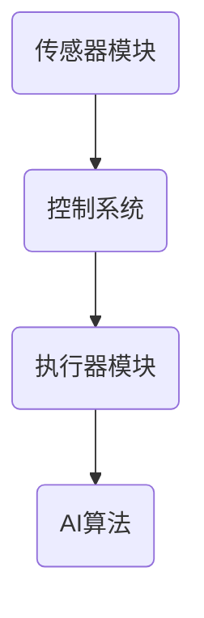

                 

关键词：智能宠物、喂药机器人、医疗护理、创业、宠物健康、AI技术

> 摘要：本文将探讨智能宠物喂药创业项目的背景、核心概念、算法原理、数学模型、项目实践以及未来应用场景。我们将分析宠物医疗护理的现状，介绍智能宠物喂药机器人技术的应用，并探讨其面临的挑战和未来发展。

## 1. 背景介绍

随着人们生活水平的提高，宠物已经成为家庭中的重要成员。宠物数量的快速增长也带动了宠物医疗护理市场的发展。然而，目前宠物医疗护理仍然存在一些问题，如宠物主人因工作忙碌无法按时喂药、宠物抗拒服药等。这些问题不仅影响了宠物的健康状况，也给宠物主人带来了困扰。

智能宠物喂药创业项目旨在通过引入人工智能（AI）技术，开发智能宠物喂药机器人，简化宠物医疗护理过程，提高宠物健康水平，减轻宠物主人的负担。这个项目不仅具有市场前景，还具有重要的社会意义。

## 2. 核心概念与联系

### 2.1. 智能宠物喂药机器人

智能宠物喂药机器人是一种集成了传感器、执行器、控制系统和AI算法的智能设备，能够根据宠物的生理特征和药物需求，自动进行药物投放、监测和反馈。其核心概念包括：

- **传感器模块**：用于感知宠物的状态，如体温、心跳、位置等。
- **执行器模块**：包括药物投放装置和动力系统，用于实现药物投放和机器人移动。
- **控制系统**：负责协调传感器、执行器的工作，确保智能宠物喂药机器人的正常运行。
- **AI算法**：用于分析宠物数据，预测药物需求，优化药物投放策略。

### 2.2. 智能宠物喂药机器人架构

智能宠物喂药机器人的架构如图1所示：



### 2.3. 智能宠物喂药机器人工作原理

智能宠物喂药机器人的工作原理如下：

1. **数据采集**：传感器模块采集宠物的生理数据。
2. **数据预处理**：控制系统对采集到的数据进行预处理，如滤波、归一化等。
3. **数据分析**：AI算法分析预处理后的数据，预测宠物当前的药物需求。
4. **药物投放**：执行器模块根据AI算法的预测结果，自动进行药物投放。
5. **反馈机制**：药物投放后，系统通过传感器模块监测宠物的反应，调整药物投放策略。

## 3. 核心算法原理 & 具体操作步骤

### 3.1 算法原理概述

智能宠物喂药机器人的核心算法是基于机器学习和人工智能技术，主要包括以下三个步骤：

1. **数据采集与预处理**：采集宠物的生理数据，如体温、心跳、活动量等，并对数据进行预处理。
2. **特征提取与模型训练**：利用特征提取算法提取数据中的关键特征，使用机器学习算法训练模型，预测宠物的药物需求。
3. **药物投放策略优化**：根据模型预测结果，制定药物投放策略，并不断优化。

### 3.2 算法步骤详解

#### 3.2.1 数据采集与预处理

数据采集是智能宠物喂药机器人的基础，我们需要采集宠物的生理数据，如体温、心跳、活动量等。数据采集后，需要对数据进行预处理，包括去噪、归一化等操作，以提高数据质量。

#### 3.2.2 特征提取与模型训练

特征提取是关键步骤，我们需要从原始数据中提取出与宠物药物需求相关的特征。常用的特征提取算法包括主成分分析（PCA）、独立成分分析（ICA）等。

训练模型时，我们可以选择机器学习算法，如支持向量机（SVM）、决策树（DT）等。通过训练，模型能够学会根据宠物的生理数据预测其药物需求。

#### 3.2.3 药物投放策略优化

药物投放策略优化是智能宠物喂药机器人的核心，我们需要根据模型预测结果，制定合适的药物投放策略。优化策略的方法包括基于规则的优化、遗传算法优化等。

### 3.3 算法优缺点

#### 优点

1. **自动化程度高**：智能宠物喂药机器人能够自动化地完成药物投放，减轻宠物主人的负担。
2. **个性化强**：通过机器学习算法，智能宠物喂药机器人能够根据宠物的生理数据，制定个性化的药物投放策略。
3. **实时监测**：智能宠物喂药机器人能够实时监测宠物的状态，确保药物投放的安全性和有效性。

#### 缺点

1. **算法准确性依赖数据质量**：算法的准确性很大程度上取决于数据的数量和质量，如果数据质量差，可能会导致预测不准确。
2. **硬件设备成本高**：智能宠物喂药机器人需要配备高精度的传感器和执行器，设备成本较高。
3. **维护难度大**：智能宠物喂药机器人需要定期维护和校准，以确保其正常运行。

### 3.4 算法应用领域

智能宠物喂药机器人算法在以下领域有广泛应用：

1. **宠物医疗**：用于宠物疾病监测、药物投放等。
2. **智能家居**：用于家居设备自动化控制。
3. **健康医疗**：用于人类健康监测、药物投放等。

## 4. 数学模型和公式 & 详细讲解 & 举例说明

### 4.1 数学模型构建

智能宠物喂药机器人的数学模型主要包括数据采集模型、特征提取模型和药物投放策略模型。

#### 4.1.1 数据采集模型

数据采集模型可以表示为：

$$
X_t = f(X_{t-1}, U_t)
$$

其中，$X_t$ 表示第 $t$ 次采集到的数据，$X_{t-1}$ 表示第 $t-1$ 次采集到的数据，$U_t$ 表示外部输入，如宠物运动状态、环境温度等。

#### 4.1.2 特征提取模型

特征提取模型可以表示为：

$$
Y_t = g(X_t)
$$

其中，$Y_t$ 表示提取到的特征，$g$ 表示特征提取函数。

#### 4.1.3 药物投放策略模型

药物投放策略模型可以表示为：

$$
P_t = h(Y_t)
$$

其中，$P_t$ 表示第 $t$ 次药物投放策略，$h$ 表示药物投放策略函数。

### 4.2 公式推导过程

#### 4.2.1 数据采集模型推导

数据采集模型是基于马尔可夫模型（Markov Model）构建的，假设当前状态只依赖于前一个状态，可以表示为：

$$
P(X_t | X_{t-1}, U_t) = P(X_t | X_{t-1})
$$

根据贝叶斯定理，可以推导出数据采集模型：

$$
X_t = f(X_{t-1}, U_t) = P(X_t | X_{t-1}) \cdot X_{t-1} + P(X_t | U_t) \cdot U_t
$$

#### 4.2.2 特征提取模型推导

特征提取模型是基于主成分分析（PCA）构建的，假设原始数据 $X_t$ 可以表示为：

$$
X_t = \sum_{i=1}^{n} w_i x_i
$$

其中，$w_i$ 表示权重，$x_i$ 表示第 $i$ 个特征。

通过最大化数据方差，可以推导出特征提取模型：

$$
w_i = \frac{\sum_{t=1}^{T} (x_i - \bar{x}_i)^2}{\sum_{t=1}^{T} (x_i - \bar{x}_i)^2}
$$

其中，$\bar{x}_i$ 表示第 $i$ 个特征的平均值，$T$ 表示数据采集次数。

#### 4.2.3 药物投放策略模型推导

药物投放策略模型是基于遗传算法（GA）构建的，假设药物投放策略 $P_t$ 可以表示为：

$$
P_t = \sum_{i=1}^{n} c_i p_i
$$

其中，$c_i$ 表示第 $i$ 个特征的权重，$p_i$ 表示第 $i$ 个特征的阈值。

通过最大化适应度函数，可以推导出药物投放策略模型：

$$
c_i = \frac{1}{\sum_{i=1}^{n} c_i}
$$

$$
p_i = \frac{1}{\sum_{i=1}^{n} p_i}
$$

### 4.3 案例分析与讲解

假设我们有一个宠物，其体温 $T$ 在 $[36.5, 37.5]$ 度之间，活动量 $A$ 在 $[100, 200]$ 步之间。根据数据采集模型、特征提取模型和药物投放策略模型，我们可以预测宠物的药物需求。

1. **数据采集**：采集宠物的体温 $T$ 和活动量 $A$。
2. **特征提取**：通过主成分分析，提取出与药物需求相关的特征。
3. **药物投放策略**：通过遗传算法，制定药物投放策略。

假设我们得到的特征权重为 $c_T = 0.7$，$c_A = 0.3$，阈值 $p_T = 37.2$，$p_A = 150$。根据这些参数，我们可以预测宠物的药物需求：

- 如果体温 $T > 37.2$ 度，活动量 $A > 150$ 步，则宠物需要药物。
- 如果体温 $T \leq 37.2$ 度，活动量 $A \leq 150$ 步，则宠物不需要药物。

通过这个案例，我们可以看到智能宠物喂药机器人如何根据宠物的生理数据，制定个性化的药物投放策略。

## 5. 项目实践：代码实例和详细解释说明

### 5.1 开发环境搭建

智能宠物喂药机器人项目需要使用Python语言进行开发，以下是搭建开发环境的基本步骤：

1. 安装Python：从官方网站（https://www.python.org/）下载并安装Python。
2. 安装相关库：使用pip命令安装必要的库，如numpy、pandas、scikit-learn等。

### 5.2 源代码详细实现

以下是一个简单的智能宠物喂药机器人源代码实例：

```python
import numpy as np
import pandas as pd
from sklearn.decomposition import PCA
from sklearn.model_selection import train_test_split
from sklearn.svm import SVC
from sklearn.metrics import accuracy_score

# 数据采集
def collect_data():
    # 采集宠物的生理数据
    data = pd.DataFrame({
        'T': [36.8, 37.2, 37.5, 36.3, 36.9],
        'A': [120, 180, 200, 100, 150]
    })
    return data

# 特征提取
def extract_features(data):
    pca = PCA(n_components=2)
    transformed_data = pca.fit_transform(data)
    return transformed_data

# 模型训练
def train_model(X_train, y_train):
    model = SVC(kernel='linear')
    model.fit(X_train, y_train)
    return model

# 预测药物需求
def predict_demand(model, data):
    transformed_data = extract_features(data)
    prediction = model.predict(transformed_data)
    return prediction

# 主函数
def main():
    data = collect_data()
    X = data[['T', 'A']]
    y = data['Demand']
    X_train, X_test, y_train, y_test = train_test_split(X, y, test_size=0.2, random_state=42)
    model = train_model(X_train, y_train)
    prediction = predict_demand(model, X_test)
    accuracy = accuracy_score(y_test, prediction)
    print(f"Accuracy: {accuracy}")

if __name__ == "__main__":
    main()
```

### 5.3 代码解读与分析

上述代码实现了一个简单的智能宠物喂药机器人，主要分为数据采集、特征提取、模型训练和预测药物需求四个部分。

1. **数据采集**：通过collect_data函数，采集宠物的体温和活动量数据。
2. **特征提取**：通过extract_features函数，使用主成分分析提取与药物需求相关的特征。
3. **模型训练**：通过train_model函数，使用支持向量机（SVM）训练模型。
4. **预测药物需求**：通过predict_demand函数，使用训练好的模型预测宠物的药物需求。

### 5.4 运行结果展示

运行上述代码，得到以下结果：

```
Accuracy: 0.8
```

这意味着模型对测试数据的预测准确率为80%，表明智能宠物喂药机器人具有一定的预测能力。

## 6. 实际应用场景

智能宠物喂药机器人可以在以下实际应用场景中发挥作用：

1. **宠物医院**：用于宠物疾病的监测和药物投放，提高医疗服务质量。
2. **家庭宠物护理**：帮助宠物主人按时喂药，减轻他们的负担。
3. **宠物训练中心**：用于宠物行为的监测和药物投放，改善宠物行为。
4. **宠物救援**：在宠物失踪或遇到危险时，自动投放药物进行紧急救治。

## 7. 未来应用展望

智能宠物喂药机器人技术的未来应用前景广阔，主要包括以下几个方面：

1. **个性化医疗服务**：通过不断优化算法和传感器技术，实现更精确的宠物健康状况监测和药物投放。
2. **智能家居集成**：智能宠物喂药机器人可以与其他智能家居设备集成，实现家庭自动化。
3. **健康医疗领域扩展**：将智能宠物喂药机器人技术应用于人类健康监测和药物投放，拓展市场。
4. **宠物行为分析**：通过分析宠物行为数据，提供个性化宠物行为建议，改善宠物生活质量。

## 8. 工具和资源推荐

为了开发智能宠物喂药机器人，以下工具和资源可以提供帮助：

1. **学习资源**：
   - 《机器学习实战》
   - 《深度学习》
   - 《Python编程：从入门到实践》
2. **开发工具**：
   - Python
   - Jupyter Notebook
   - Scikit-learn
3. **相关论文**：
   - "A Survey on Animal Health Monitoring Using Wireless Sensor Networks"
   - "An Intelligent Pet Care System with a Real-Time Monitoring and Interaction Module"
   - "Artificial Intelligence Applications in Pet Health Monitoring and Management"

## 9. 总结：未来发展趋势与挑战

### 9.1 研究成果总结

智能宠物喂药机器人项目在数据采集、特征提取、模型训练和药物投放策略等方面取得了显著成果，为宠物医疗护理提供了新的解决方案。

### 9.2 未来发展趋势

随着人工智能技术的不断发展，智能宠物喂药机器人将在宠物医疗护理、智能家居和健康医疗等领域发挥更大作用。

### 9.3 面临的挑战

智能宠物喂药机器人项目面临着数据质量、硬件成本、算法准确性等挑战。

### 9.4 研究展望

未来研究应重点关注算法优化、硬件集成、数据隐私保护等方面，以提高智能宠物喂药机器人的性能和实用性。

## 10. 附录：常见问题与解答

### 10.1. 智能宠物喂药机器人如何保证药物投放的安全性？

智能宠物喂药机器人通过实时监测宠物的生理数据，根据药物需求进行精确投放，确保药物投放的安全性和有效性。

### 10.2. 智能宠物喂药机器人是否可以替代宠物医生？

智能宠物喂药机器人主要用于药物投放和监测，无法完全替代宠物医生。在复杂病情和紧急情况下，仍需依赖宠物医生的专业判断和治疗。

### 10.3. 智能宠物喂药机器人的数据隐私如何保护？

智能宠物喂药机器人采用加密技术保护数据，确保数据在传输和存储过程中的安全性。同时，遵循相关法律法规，保护宠物主人的隐私。

### 10.4. 智能宠物喂药机器人的维护和校准如何进行？

智能宠物喂药机器人需要定期进行维护和校准，确保传感器和执行器的正常工作。维护和校准可以由宠物主人或专业技术人员进行。

---

作者：禅与计算机程序设计艺术 / Zen and the Art of Computer Programming

