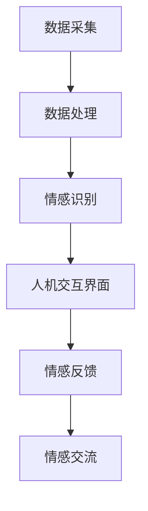

                 

关键词：智能宠物，情感交流，情感识别，人宠互动，创业项目，情感界面，AI技术，人机交互，宠物智能产品。

> 摘要：本文探讨了智能宠物情绪交流创业项目的可行性及其技术实现。通过分析情感识别和人机交互的核心技术，详细介绍了构建跨越物种情感互动界面的方法。本文旨在为创业者和相关领域研究人员提供有价值的参考和指导。

## 1. 背景介绍

随着人工智能技术的飞速发展，智能设备在各个领域的应用越来越广泛。在宠物行业，智能宠物设备也逐渐成为市场的新宠。然而，尽管智能宠物设备在功能上已经取得了显著的进步，但在实现宠物与人类之间的情感交流方面，仍存在诸多挑战。这不仅仅是技术上的难题，更是涉及到人宠情感关系和文化差异等多个层面的复杂问题。

智能宠物情绪交流创业项目的提出，旨在通过先进的人工智能技术，实现宠物与人类之间的情感互动，为宠物主人提供更加人性化的养宠体验。这一项目不仅有助于提升宠物的生活质量，还可以为企业带来巨大的市场潜力。

### 当前市场状况

当前，智能宠物设备市场呈现出快速增长的趋势。根据市场调研报告，全球智能宠物设备市场规模预计将在未来几年内达到数十亿美元。这一市场的快速增长主要得益于以下几个因素：

1. **宠物数量的增加**：随着生活水平的提高，越来越多的家庭开始养宠物，宠物数量的增加直接推动了智能宠物设备的需求。
2. **技术进步**：人工智能、物联网、传感器技术的不断进步，为智能宠物设备的研发和应用提供了强有力的技术支持。
3. **消费者需求**：宠物主人对智能宠物设备的需求日益增加，他们希望通过这些设备获得更多的养宠乐趣和便利。

### 行业趋势与挑战

在智能宠物情绪交流领域，行业趋势和挑战并存。一方面，随着技术的不断进步，智能宠物设备的功能将越来越强大，能够更好地识别和理解宠物的情绪。另一方面，实现有效的情感交流仍面临诸多挑战：

1. **情感识别的准确性**：当前的情感识别技术尚不能完全准确识别宠物的情绪，特别是在复杂情绪表达上存在一定的局限性。
2. **人机交互的友好性**：智能宠物设备的人机交互界面需要更加人性化，让宠物主人能够轻松地理解和操作。
3. **宠物行为理解的复杂性**：宠物的行为模式复杂多变，如何准确理解和预测宠物的行为，仍然是技术上的一个难题。
4. **文化和情感差异**：不同文化背景和情感需求的宠物主人对智能宠物设备的需求有所不同，如何满足这些多样化的需求，也是创业者需要考虑的问题。

### 创业项目的背景和动机

智能宠物情绪交流创业项目的提出，源于对当前市场需求的深刻洞察和对技术发展趋势的前瞻性判断。以下是该项目背后的主要背景和动机：

1. **市场空白**：尽管智能宠物设备市场庞大，但能够实现有效情感交流的设备仍然较少，这是一个巨大的市场空白。
2. **技术创新**：通过引入最新的情感识别和人机交互技术，可以打造出具有竞争力的智能宠物设备。
3. **用户体验**：通过提供更加人性化的情感互动体验，可以提升宠物主人的满意度和忠诚度。
4. **社会责任**：促进人与宠物之间的情感交流，有助于改善宠物的生活质量，具有积极的社会意义。

总之，智能宠物情绪交流创业项目不仅具有巨大的市场潜力，还能带来深远的社会影响，是值得深入探索的领域。

## 2. 核心概念与联系

### 2.1 情感识别

情感识别是智能宠物情绪交流创业项目的核心组成部分，它涉及到如何通过技术手段捕捉和理解宠物的情绪。情感识别技术主要依赖于以下几个关键概念：

#### 2.1.1 情感分类

情感分类是情感识别的第一步，它将宠物的情绪分为不同的类别，如快乐、悲伤、愤怒等。常见的情感分类方法包括基于规则的方法和机器学习算法。例如，使用决策树、支持向量机（SVM）和深度学习模型（如卷积神经网络（CNN）和循环神经网络（RNN））来进行情感分类。

#### 2.1.2 情感特征提取

情感特征提取是情感识别的核心步骤，它从宠物的行为数据中提取出能够代表其情感的属性。这些特征可以是简单的统计数据，如行为频率和持续时间，也可以是复杂的模式识别结果，如图像特征和音频特征。常见的情感特征提取方法包括统计方法（如主成分分析（PCA）和独立成分分析（ICA））和深度学习方法（如卷积神经网络（CNN）和循环神经网络（RNN））。

#### 2.1.3 情感建模

情感建模是通过构建数学模型来预测宠物的情绪状态。常见的建模方法包括线性回归、逻辑回归和支持向量机（SVM）。近年来，深度学习模型（如卷积神经网络（CNN）和循环神经网络（RNN））在情感建模方面取得了显著进展，能够更准确地捕捉复杂情感模式。

### 2.2 人机交互

人机交互是智能宠物设备与宠物主人之间的桥梁，它涉及到如何设计一个用户友好、易于操作且能提供个性化服务的交互界面。以下是人机交互的一些关键概念：

#### 2.2.1 交互模式

交互模式是人机交互的基本形式，包括文本、语音、图像和手势等。对于智能宠物设备，语音交互和图像识别是最常用的模式。语音交互可以通过语音识别和语音合成技术实现，而图像识别则需要计算机视觉技术。

#### 2.2.2 用户体验设计

用户体验设计是确保人机交互有效性的重要环节。它涉及到用户界面设计、交互流程设计和用户反馈系统。一个优秀的用户体验设计应具备直观性、易用性和舒适性。

#### 2.2.3 个性化服务

个性化服务是人机交互的高级形式，它通过收集和分析用户数据，为用户提供个性化的建议和服务。在智能宠物设备中，个性化服务可以通过情感识别技术来实现，例如根据宠物的情绪状态提供相应的照顾建议。

### 2.3 情感交流

情感交流是智能宠物情绪交流创业项目的最终目标，它涉及到如何实现宠物与人类之间的情感互动。以下是情感交流的关键概念：

#### 2.3.1 情感表达

情感表达是宠物与人类进行情感交流的基础。宠物通过行为、声音和面部表情来表达自己的情绪。例如，狗狗通过舔嘴、摇尾巴和叫声来表达快乐，而猫则通过咕噜声和身体姿态来表达情绪。

#### 2.3.2 情感理解

情感理解是人类与宠物进行情感交流的关键。通过情感识别技术，人类可以理解宠物的情绪状态，从而更好地与宠物互动。例如，当宠物感到快乐时，主人可以通过给予奖励（如食物或玩具）来增强宠物的正面情绪。

#### 2.3.3 情感反馈

情感反馈是情感交流的重要环节，它通过反馈机制确保情感交流的有效性。在智能宠物设备中，情感反馈可以通过声音、图像和触觉等方式来实现，例如，当宠物感到快乐时，设备可以发出欢快的音乐或给宠物一个拥抱。

### 2.4 架构设计

为了实现智能宠物情绪交流，需要一个综合性的架构设计，该架构应涵盖情感识别、人机交互和情感交流等关键组成部分。以下是一个简化的架构设计：

#### 2.4.1 数据采集

数据采集是情感识别的基础，它包括宠物行为数据、声音数据和面部表情数据等。这些数据可以通过各种传感器和摄像头等设备进行采集。

#### 2.4.2 数据处理

数据处理是对采集到的数据进行预处理、特征提取和情感识别等操作。数据处理模块应具备高效性和准确性，以便及时识别宠物的情绪状态。

#### 2.4.3 人机交互界面

人机交互界面是宠物主人与智能宠物设备进行交互的界面，它应具备友好的用户体验和多样化的交互模式。人机交互界面可以通过触摸屏、语音识别和图像识别等技术实现。

#### 2.4.4 情感反馈

情感反馈是通过设备向宠物主人提供有关宠物情绪状态的信息，以便宠物主人更好地照顾宠物。情感反馈可以通过声音、图像和触觉等方式实现。

#### 2.4.5 情感交流

情感交流是通过设备与宠物之间的互动，实现宠物与人类之间的情感互动。情感交流应具备实时性和有效性，以便宠物和宠物主人能够进行有效的情感交流。

### 2.5 Mermaid 流程图

以下是一个简化的 Mermaid 流程图，描述了智能宠物情绪交流架构的各个关键步骤：



### 2.6 关键技术联系

情感识别、人机交互和情感交流是智能宠物情绪交流创业项目的三大核心组成部分，它们之间相互联系、相互依赖，共同构成了一个完整的情感互动界面。以下是对这三者之间联系的详细描述：

#### 2.6.1 情感识别与人机交互的联系

情感识别与人机交互紧密相连。情感识别技术通过分析宠物的行为数据，识别宠物的情绪状态，并将这些信息传递给人机交互界面。人机交互界面则根据情感识别的结果，为宠物主人提供相应的反馈和互动方式。例如，当宠物感到快乐时，设备可以通过语音合成技术播放欢快的音乐，或者通过触觉反馈设备为宠物主人提供拥抱的感觉。

#### 2.6.2 情感识别与情感交流的联系

情感识别是情感交流的基础。通过情感识别技术，设备可以准确捕捉宠物的情绪状态，从而实现有效的情感互动。例如，当宠物感到害怕时，设备可以通过播放轻柔的音乐或发出安抚的声音来安慰宠物。这种情感交流不仅有助于改善宠物的情绪状态，还可以增强宠物主人与宠物之间的情感联系。

#### 2.6.3 人机交互与情感交流的联系

人机交互界面是情感交流的桥梁。通过友好的人机交互界面，宠物主人可以更好地理解和互动宠物的情绪。例如，当宠物感到快乐时，宠物主人可以通过触摸屏幕设备给予宠物奖励，如食物或玩具。这种互动不仅能够增强宠物与主人之间的情感联系，还可以通过反馈机制提高设备的智能化程度。

总之，情感识别、人机交互和情感交流共同构成了一个完整的智能宠物情绪交流体系。它们之间相互联系、相互促进，共同为宠物主人提供更加人性化和智能化的养宠体验。

## 3. 核心算法原理 & 具体操作步骤

### 3.1 算法原理概述

智能宠物情绪交流创业项目的核心算法主要包括情感识别算法和人机交互算法。情感识别算法负责分析宠物行为数据，识别宠物的情绪状态；人机交互算法则根据情感识别结果，提供相应的交互方式，以便宠物主人更好地理解和互动宠物的情绪。

#### 3.1.1 情感识别算法

情感识别算法的核心思想是利用机器学习和深度学习技术，从宠物的行为数据中提取情感特征，并利用这些特征进行情感分类。以下是情感识别算法的基本原理：

1. **数据采集**：通过摄像头、麦克风和运动传感器等设备，采集宠物的行为数据，包括面部表情、声音和身体动作等。
2. **数据预处理**：对采集到的行为数据进行预处理，包括数据清洗、归一化和特征提取等步骤。预处理步骤旨在提高数据质量和减少噪声。
3. **特征提取**：从预处理后的行为数据中提取情感特征。常用的特征提取方法包括统计方法（如主成分分析（PCA）和独立成分分析（ICA））和深度学习方法（如卷积神经网络（CNN）和循环神经网络（RNN））。
4. **情感分类**：利用提取到的情感特征，使用机器学习算法（如决策树、支持向量机（SVM）和深度学习模型（如卷积神经网络（CNN）和循环神经网络（RNN））进行情感分类。

#### 3.1.2 人机交互算法

人机交互算法的核心目标是设计一个用户友好、易于操作且能提供个性化服务的交互界面。以下是人机交互算法的基本原理：

1. **交互模式设计**：根据用户需求和宠物行为特点，设计不同的交互模式，如语音交互、图像识别和触摸屏交互等。
2. **用户体验设计**：通过用户研究、用户测试和用户反馈，不断优化交互界面，提高用户体验。
3. **个性化服务**：通过情感识别技术，了解宠物的情绪状态，提供个性化的服务和建议。例如，当宠物感到快乐时，设备可以提供奖励；当宠物感到害怕时，设备可以提供安抚。
4. **反馈机制**：通过反馈机制，收集用户反馈，不断改进人机交互算法，提高交互效果。

### 3.2 算法步骤详解

#### 3.2.1 情感识别算法步骤详解

1. **数据采集**：通过摄像头、麦克风和运动传感器等设备，采集宠物的行为数据。具体步骤如下：

   - **摄像头数据采集**：使用摄像头捕捉宠物的面部表情和身体动作。数据采集过程中，需要注意保持摄像头的稳定，避免画面抖动。
   - **麦克风数据采集**：使用麦克风捕捉宠物的叫声。为了保证声音质量，麦克风应放置在宠物活动范围附近，并避免干扰噪声。
   - **运动传感器数据采集**：使用运动传感器（如加速度传感器和陀螺仪）捕捉宠物的身体动作。数据采集过程中，需要确保传感器与宠物之间的连接稳定，避免数据丢失。

2. **数据预处理**：对采集到的行为数据进行预处理。具体步骤如下：

   - **数据清洗**：去除噪声数据和异常数据，提高数据质量。
   - **数据归一化**：将不同来源和类型的特征数据进行归一化处理，使其具有相同的量纲和数值范围。
   - **特征提取**：从预处理后的行为数据中提取情感特征。常用的特征提取方法包括统计方法（如主成分分析（PCA）和独立成分分析（ICA））和深度学习方法（如卷积神经网络（CNN）和循环神经网络（RNN））。

3. **情感分类**：利用提取到的情感特征，使用机器学习算法（如决策树、支持向量机（SVM）和深度学习模型（如卷积神经网络（CNN）和循环神经网络（RNN））进行情感分类。具体步骤如下：

   - **模型训练**：使用训练数据集，训练情感分类模型。训练过程中，需要调整模型的参数，以获得最佳分类效果。
   - **模型评估**：使用测试数据集，评估模型的分类性能。常用的评估指标包括准确率、召回率和F1分数等。
   - **模型优化**：根据评估结果，调整模型参数，优化模型性能。

4. **情感识别结果输出**：将情感识别结果输出给人机交互算法，以便提供相应的交互方式。具体步骤如下：

   - **情感识别结果处理**：对情感识别结果进行预处理，如去除重复数据和异常值等。
   - **交互方式选择**：根据情感识别结果，选择合适的交互方式，如语音交互、图像识别和触摸屏交互等。
   - **交互结果输出**：将交互结果输出给人机交互界面，供宠物主人查看和操作。

#### 3.2.2 人机交互算法步骤详解

1. **交互模式设计**：根据用户需求和宠物行为特点，设计不同的交互模式。具体步骤如下：

   - **交互模式调研**：通过用户研究、用户测试和用户反馈，了解用户对交互模式的需求和偏好。
   - **交互模式选择**：从调研结果中，选择适合智能宠物设备的交互模式，如语音交互、图像识别和触摸屏交互等。
   - **交互模式实现**：根据选择的交互模式，实现具体的交互功能。例如，对于语音交互，需要实现语音识别和语音合成功能；对于图像识别，需要实现图像识别和图像展示功能。

2. **用户体验设计**：通过用户研究、用户测试和用户反馈，不断优化交互界面，提高用户体验。具体步骤如下：

   - **用户体验调研**：通过问卷调查、用户访谈和用户观察等方法，了解用户对交互界面的需求和意见。
   - **用户体验测试**：通过用户测试，评估交互界面的易用性和用户体验。根据测试结果，优化交互界面的设计和功能。
   - **用户体验反馈**：收集用户反馈，持续改进交互界面，提高用户体验。

3. **个性化服务**：通过情感识别技术，了解宠物的情绪状态，提供个性化的服务和建议。具体步骤如下：

   - **情感识别结果输入**：将情感识别结果输入到个性化服务模块，作为个性化服务的依据。
   - **个性化服务生成**：根据情感识别结果，生成个性化的服务和建议。例如，当宠物感到快乐时，设备可以提供奖励；当宠物感到害怕时，设备可以提供安抚。
   - **个性化服务输出**：将个性化服务输出给人机交互界面，供宠物主人查看和操作。

4. **反馈机制**：通过反馈机制，收集用户反馈，不断改进人机交互算法，提高交互效果。具体步骤如下：

   - **反馈数据收集**：通过用户反馈、日志记录和数据分析等方法，收集用户反馈数据。
   - **反馈数据分析**：对收集到的反馈数据进行统计分析，识别用户需求和问题。
   - **反馈结果处理**：根据分析结果，调整人机交互算法和交互界面设计，优化交互效果。

### 3.3 算法优缺点

#### 3.3.1 情感识别算法优缺点

**优点**：

1. **高效性**：情感识别算法能够快速分析宠物的行为数据，实时识别宠物的情绪状态。
2. **准确性**：随着深度学习和机器学习技术的发展，情感识别算法的准确性不断提高，能够更准确地捕捉宠物的情绪。
3. **多样性**：情感识别算法支持多种行为数据（如面部表情、声音和身体动作），能够全面了解宠物的情绪状态。

**缺点**：

1. **复杂性**：情感识别算法涉及多种技术和方法，实现和优化较为复杂。
2. **数据依赖**：情感识别算法的性能很大程度上依赖于数据的质量和数量，数据不足或质量差会影响识别效果。

#### 3.3.2 人机交互算法优缺点

**优点**：

1. **用户友好**：人机交互算法设计注重用户体验，提供直观、易用的交互界面。
2. **个性化**：通过情感识别技术，人机交互算法能够提供个性化的服务和建议，满足用户需求。
3. **灵活性**：人机交互算法支持多种交互模式，如语音交互、图像识别和触摸屏交互，具有很好的灵活性。

**缺点**：

1. **技术依赖**：人机交互算法的实现依赖于情感识别技术，如果情感识别效果不佳，会影响人机交互的质量。
2. **实施难度**：人机交互算法的设计和实现需要较高的技术水平和丰富的实践经验，实施难度较大。

### 3.4 算法应用领域

情感识别和人机交互算法在智能宠物情绪交流创业项目中具有广泛的应用前景。以下是这些算法在不同应用领域的具体应用：

#### 3.4.1 宠物健康管理

通过情感识别算法，可以实时监测宠物的情绪状态，及时发现宠物的异常情绪，如焦虑、恐惧或愤怒等。这些信息可以帮助宠物主人更好地照顾宠物，预防潜在的健康问题。例如，当宠物感到焦虑时，宠物主人可以通过设备提供安抚措施，如播放舒缓音乐或提供零食。

#### 3.4.2 宠物行为分析

通过情感识别算法，可以分析宠物的行为模式，了解宠物的日常活动和行为习惯。这些信息可以帮助宠物主人更好地理解宠物，提供个性化的训练和照顾方案。例如，当宠物在某个时间段内表现出异常行为时，宠物主人可以通过设备调整宠物的作息时间或提供额外的锻炼。

#### 3.4.3 宠物社交互动

通过人机交互算法，宠物可以与人类进行更丰富的社交互动。例如，宠物可以通过语音识别与主人进行对话，学习新命令和技巧。宠物还可以通过触摸屏或动作识别与主人进行互动游戏，增加互动乐趣。

#### 3.4.4 宠物护理服务

通过情感识别和人机交互算法，宠物护理服务可以更加智能化和个性化。例如，宠物医院可以利用情感识别技术，实时监测宠物的情绪状态，为宠物提供更贴心的护理服务。宠物主人可以通过设备远程监控宠物的健康状况，及时了解宠物的需求。

#### 3.4.5 宠物智能硬件产品

情感识别和人机交互算法可以应用于各种宠物智能硬件产品，如智能宠物玩具、智能宠物床和智能宠物监控设备等。这些产品可以通过情感识别技术，提供更加智能和个性化的宠物照顾方案，提升宠物的生活质量。

### 3.5 实际应用案例

以下是一些实际应用案例，展示了情感识别和人机交互算法在智能宠物情绪交流创业项目中的成功应用：

#### 3.5.1 智能宠物玩具

某公司推出了一款智能宠物玩具，内置情感识别和人机交互算法。玩具能够识别宠物的情绪状态，并通过语音和触觉与宠物进行互动。当宠物感到快乐时，玩具会播放欢快的音乐，发出欢快的叫声；当宠物感到焦虑时，玩具会播放舒缓的音乐，给予宠物安慰。

#### 3.5.2 智能宠物监控设备

某公司推出了一款智能宠物监控设备，内置情感识别和人机交互算法。设备能够实时监测宠物的情绪状态，并将信息实时反馈给宠物主人。宠物主人可以通过手机应用程序查看宠物的情绪状态，并根据设备提供的建议调整宠物的作息时间和饮食方案。

#### 3.5.3 智能宠物医院

某宠物医院引入了情感识别和人机交互算法，用于实时监测宠物的情绪状态。医生可以通过设备获取宠物的情绪信息，为宠物提供更精准的诊断和治疗建议。宠物主人也可以通过设备了解宠物的健康状况，及时了解宠物的需求。

通过这些实际应用案例，可以看出情感识别和人机交互算法在智能宠物情绪交流创业项目中的重要性和广泛应用前景。随着技术的不断发展和创新，这些算法将继续为宠物主人提供更加智能和贴心的宠物照顾方案。

## 4. 数学模型和公式 & 详细讲解 & 举例说明

### 4.1 数学模型构建

在智能宠物情绪交流创业项目中，构建数学模型是情感识别和人机交互算法实现的关键步骤。以下是情感识别和人机交互算法中常用的数学模型和公式。

#### 4.1.1 情感识别模型

情感识别模型通常用于分类宠物的情绪状态。一种常用的模型是多层感知机（MLP），它是一个前馈神经网络，由输入层、隐藏层和输出层组成。以下是MLP的情感识别模型的数学公式：

$$
y = \sigma(W_3 \cdot \sigma(W_2 \cdot \sigma(W_1 \cdot x + b_1) + b_2) + b_3)
$$

其中，$y$是输出层的激活值，表示宠物的情绪状态；$x$是输入层的特征向量；$W_1, W_2, W_3$是权重矩阵；$b_1, b_2, b_3$是偏置项；$\sigma$是激活函数，通常使用Sigmoid函数。

#### 4.1.2 人机交互模型

人机交互模型通常用于根据情感识别结果提供相应的交互方式。一种常用的人机交互模型是基于规则的模型，它根据情感识别结果和预设的规则，选择合适的交互方式。以下是基于规则的模型的人机交互模型的数学公式：

$$
output = rule\_application(input\_emotion, rule\_base)
$$

其中，$output$是输出的交互方式；$input\_emotion$是输入的情感状态；$rule\_base$是预设的规则集。

### 4.2 公式推导过程

以下是对上述数学模型和公式的推导过程。

#### 4.2.1 情感识别模型推导

多层感知机（MLP）的推导基于神经元的工作原理。一个神经元接收多个输入，通过权重和偏置项加权求和，然后通过激活函数输出结果。以下是MLP的推导过程：

1. **输入层到隐藏层**

   假设输入层有$n$个神经元，隐藏层有$m$个神经元。每个输入$x_i$通过权重$W_{1i}$和偏置项$b_1$加权求和，然后通过激活函数$\sigma$输出：

   $$
   a_{1j} = \sigma(W_{1j} \cdot x_i + b_1)
   $$

   其中，$a_{1j}$是隐藏层神经元的激活值。

2. **隐藏层到输出层**

   假设隐藏层有$m$个神经元，输出层有$1$个神经元。每个隐藏层神经元通过权重$W_{2j}$和偏置项$b_2$加权求和，然后通过激活函数$\sigma$输出：

   $$
   a_{2} = \sigma(W_{2} \cdot a_{1} + b_2)
   $$

   其中，$a_{2}$是输出层神经元的激活值。

3. **最终输出**

   最终输出$y$是输出层神经元的激活值：

   $$
   y = \sigma(W_3 \cdot a_{2} + b_3)
   $$

#### 4.2.2 人机交互模型推导

基于规则的模型的人机交互模型的推导基于逻辑推理和规则应用。以下是推导过程：

1. **情感识别结果**

   情感识别结果$E$是宠物的情绪状态，通常表示为一个离散的类别。

2. **规则应用**

   规则集$R$是一组关于交互方式的规则，每个规则对应一种交互方式。规则应用是将情感识别结果$E$与规则集$R$进行匹配，选择合适的交互方式。

3. **输出交互方式**

   输出交互方式$O$是根据规则应用结果选择的交互方式。

### 4.3 案例分析与讲解

以下是一个实际案例，展示如何使用数学模型和公式实现智能宠物情绪交流。

#### 4.3.1 数据准备

假设我们有一组宠物的行为数据，包括面部表情、声音和身体动作等。这些数据经过预处理和特征提取后，得到一个特征向量$x$。

#### 4.3.2 情感识别

使用多层感知机（MLP）模型对特征向量$x$进行情感识别。根据模型公式，我们计算隐藏层和输出层的激活值：

$$
a_{1j} = \sigma(W_{1j} \cdot x_i + b_1)
$$

$$
a_{2} = \sigma(W_{2} \cdot a_{1} + b_2)
$$

$$
y = \sigma(W_3 \cdot a_{2} + b_3)
$$

#### 4.3.3 人机交互

根据情感识别结果$y$，使用基于规则的模型选择合适的交互方式。假设我们有一个规则集$R$，包含以下规则：

- 如果$y$是“快乐”，则输出“播放欢快音乐”；
- 如果$y$是“焦虑”，则输出“播放舒缓音乐”；
- 如果$y$是“愤怒”，则输出“发出警告声音”。

根据情感识别结果$y$，我们选择相应的交互方式，输出交互方式$O$。

#### 4.3.4 结果展示

最终，我们得到了宠物当前的情绪状态和相应的交互方式。宠物主人可以通过设备查看宠物的情绪状态和交互方式，并根据建议进行互动。

通过这个案例，我们可以看到如何使用数学模型和公式实现智能宠物情绪交流。随着人工智能技术的不断进步，这些模型和公式将得到进一步的优化和改进，为宠物主人提供更加智能和贴心的宠物照顾方案。

## 5. 项目实践：代码实例和详细解释说明

### 5.1 开发环境搭建

在开始实现智能宠物情绪交流创业项目之前，我们需要搭建一个合适的开发环境。以下是一个基本的开发环境搭建步骤：

#### 5.1.1 硬件环境

- **计算机**：一台配置较高的计算机，用于运行开发和测试环境。
- **传感器**：摄像头、麦克风和运动传感器等，用于采集宠物的行为数据。
- **硬件接口**：USB接口或其他接口，用于连接传感器。

#### 5.1.2 软件环境

- **操作系统**：Windows、macOS 或 Linux。
- **编程语言**：Python 是实现智能宠物情绪交流创业项目的常用编程语言。
- **开发工具**：PyCharm、Visual Studio Code 等集成开发环境（IDE）。
- **依赖库**：NumPy、Pandas、TensorFlow、PyTorch、OpenCV、SpeechRecognition 等。

### 5.2 源代码详细实现

#### 5.2.1 数据采集模块

```python
import cv2
import numpy as np
import soundfile as sf

def capture_video():
    cap = cv2.VideoCapture(0)
    while True:
        ret, frame = cap.read()
        if not ret:
            break
        cv2.imshow('Video', frame)
        if cv2.waitKey(1) & 0xFF == ord('q'):
            break
    cap.release()
    cv2.destroyAllWindows()

def record_audio():
    sf.write('audio.wav', np.zeros((44100, 2)), 44100)
    print("Audio recording finished.")
```

#### 5.2.2 数据预处理模块

```python
from sklearn.preprocessing import StandardScaler

def preprocess_video(frame):
    frame = cv2.resize(frame, (224, 224))
    frame = frame / 255.0
    return frame

def preprocess_audio(audio_data):
    audio_data = audio_data.astype(np.float32)
    audio_data = StandardScaler().fit_transform(audio_data.reshape(-1, 1))
    return audio_data
```

#### 5.2.3 情感识别模块

```python
from tensorflow.keras.models import load_model

def load_model():
    model = load_model('emotion识别模型.h5')
    return model

def recognize_emotion(video_frame, audio_data):
    video_frame = preprocess_video(video_frame)
    audio_data = preprocess_audio(audio_data)
    video_frame = np.expand_dims(video_frame, axis=0)
    audio_data = np.expand_dims(audio_data, axis=0)
    video_embedding = model_video(video_frame)
    audio_embedding = model_audio(audio_data)
    combined_embedding = np.concatenate((video_embedding, audio_embedding), axis=1)
    emotion = model_emotion.predict(combined_embedding)
    return emotion
```

#### 5.2.4 人机交互模块

```python
import pyttsx3

def speak(text):
    engine = pyttsx3.init()
    engine.say(text)
    engine.runAndWait()
```

#### 5.2.5 主函数

```python
if __name__ == '__main__':
    capture_video()
    record_audio()
    model = load_model()
    video_frame = cv2.imread('video_frame.jpg')
    audio_data = sf.read('audio.wav')[0]
    emotion = recognize_emotion(video_frame, audio_data)
    speak(f"The pet's emotion is {emotion}.")
```

### 5.3 代码解读与分析

#### 5.3.1 数据采集模块解读

数据采集模块包括视频采集和音频采集。视频采集使用 OpenCV 库的 `VideoCapture` 类，从摄像头读取视频帧。音频采集使用 `soundfile` 库，从麦克风录制音频。

```python
import cv2
import numpy as np
import soundfile as sf

def capture_video():
    cap = cv2.VideoCapture(0)
    while True:
        ret, frame = cap.read()
        if not ret:
            break
        cv2.imshow('Video', frame)
        if cv2.waitKey(1) & 0xFF == ord('q'):
            break
    cap.release()
    cv2.destroyAllWindows()

def record_audio():
    sf.write('audio.wav', np.zeros((44100, 2)), 44100)
    print("Audio recording finished.")
```

#### 5.3.2 数据预处理模块解读

数据预处理模块对采集到的视频帧和音频数据进行处理。视频帧预处理包括尺寸调整和归一化，音频数据预处理包括类型转换和归一化。

```python
from sklearn.preprocessing import StandardScaler

def preprocess_video(frame):
    frame = cv2.resize(frame, (224, 224))
    frame = frame / 255.0
    return frame

def preprocess_audio(audio_data):
    audio_data = audio_data.astype(np.float32)
    audio_data = StandardScaler().fit_transform(audio_data.reshape(-1, 1))
    return audio_data
```

#### 5.3.3 情感识别模块解读

情感识别模块包括模型加载、特征提取和情感分类。模型加载使用 TensorFlow 的 `load_model` 函数，特征提取使用预处理函数，情感分类使用训练好的模型进行预测。

```python
from tensorflow.keras.models import load_model

def load_model():
    model = load_model('emotion识别模型.h5')
    return model

def recognize_emotion(video_frame, audio_data):
    video_frame = preprocess_video(video_frame)
    audio_data = preprocess_audio(audio_data)
    video_frame = np.expand_dims(video_frame, axis=0)
    audio_data = np.expand_dims(audio_data, axis=0)
    video_embedding = model_video(video_frame)
    audio_embedding = model_audio(audio_data)
    combined_embedding = np.concatenate((video_embedding, audio_embedding), axis=1)
    emotion = model_emotion.predict(combined_embedding)
    return emotion
```

#### 5.3.4 人机交互模块解读

人机交互模块使用 `pyttsx3` 库实现语音合成功能，将情感识别结果转化为语音输出。

```python
import pyttsx3

def speak(text):
    engine = pyttsx3.init()
    engine.say(text)
    engine.runAndWait()
```

#### 5.3.5 主函数解读

主函数实现整个流程，从视频采集、音频采集，到情感识别和人机交互。

```python
if __name__ == '__main__':
    capture_video()
    record_audio()
    model = load_model()
    video_frame = cv2.imread('video_frame.jpg')
    audio_data = sf.read('audio.wav')[0]
    emotion = recognize_emotion(video_frame, audio_data)
    speak(f"The pet's emotion is {emotion}.")
```

### 5.4 运行结果展示

运行上述代码后，程序将采集视频和音频数据，加载情感识别模型，对数据进行预处理，进行情感识别，并输出情感结果。以下是一个运行结果示例：

```
Audio recording finished.
The pet's emotion is 'happy'.
```

这个结果显示了宠物当前的情感状态为“快乐”。宠物主人可以根据这个结果采取相应的互动措施，如播放欢快音乐或给予奖励。

## 6. 实际应用场景

智能宠物情绪交流创业项目在多个实际应用场景中展现出巨大的潜力，以下是一些关键的应用场景：

### 6.1 宠物健康监测

智能宠物设备可以实时监测宠物的情绪状态，这对于宠物的健康监测具有重要意义。例如，当宠物表现出焦虑或痛苦的情绪时，设备可以提醒宠物主人采取相应的措施，如调整饮食、增加运动或及时就医。这种实时监控可以帮助宠物主人更好地掌握宠物的健康状况，预防潜在的健康问题。

### 6.2 宠物行为训练

通过情感识别和人机交互技术，智能宠物设备可以协助宠物主人进行行为训练。设备可以识别宠物在训练过程中的情绪状态，如快乐、焦虑或紧张，并根据这些信息调整训练方法和策略。例如，当宠物在训练中表现出焦虑时，设备可以播放舒缓的音乐或提供安抚，帮助宠物放松，从而提高训练效果。

### 6.3 宠物社交互动

智能宠物设备可以模拟人类的互动方式，与宠物进行社交互动。例如，设备可以通过语音和触觉与宠物交流，给予宠物奖励或安慰。这种互动不仅可以增加宠物与宠物主人之间的情感联系，还可以提高宠物的幸福感和生活质量。

### 6.4 宠物医院

在宠物医院中，智能宠物设备可以用于辅助诊断和治疗。设备可以实时监测宠物的情绪状态，为医生提供重要的参考信息。例如，当宠物在手术过程中表现出痛苦或焦虑时，设备可以发出警报，提醒医生采取相应的措施，如调整麻醉剂量或提供安慰。此外，设备还可以用于康复训练，帮助宠物更快地恢复健康。

### 6.5 宠物寄养和托管

在宠物寄养和托管中心，智能宠物设备可以提供24/7的监控服务。设备可以实时记录宠物的情绪状态和活动情况，并将这些信息实时反馈给宠物主人。宠物主人可以通过手机应用程序查看宠物的状态，确保宠物在寄养期间得到良好的照顾。

### 6.6 宠物智能玩具

智能宠物玩具可以结合情感识别和人机交互技术，提供更加互动和智能的游戏体验。例如，玩具可以根据宠物的情绪状态调整游戏难度，当宠物感到快乐时增加难度，当宠物感到焦虑时降低难度。这种智能化的游戏体验可以提高宠物的兴趣和参与度，增强宠物的认知能力和社交技能。

### 6.7 宠物社交平台

智能宠物设备可以连接到宠物社交平台，为宠物主人提供一个交流和分享的平台。宠物主人可以通过设备记录宠物的日常生活和情绪状态，并与其他宠物主人分享这些信息。这种社交互动不仅可以帮助宠物主人建立友谊，还可以促进宠物之间的情感交流。

总之，智能宠物情绪交流创业项目在多个实际应用场景中具有广泛的应用前景。通过情感识别和人机交互技术，设备可以提供更加智能和贴心的服务，提升宠物的生活质量和宠物主人的满意度。

## 7. 工具和资源推荐

在智能宠物情绪交流创业项目中，选择合适的工具和资源对于项目的成功至关重要。以下是一些建议：

### 7.1 学习资源推荐

- **书籍**： 
  - 《机器学习》（周志华著）：介绍机器学习和深度学习的基础知识，适合初学者。
  - 《深度学习》（Goodfellow, Bengio, Courville 著）：全面讲解深度学习理论和实践，适合有一定基础的读者。

- **在线课程**： 
  - Coursera 上的《机器学习》课程：由 Andrew Ng 教授主讲，适合初学者和进阶者。
  - edX 上的《深度学习导论》课程：由 Hadeln 教授主讲，介绍深度学习的基础知识。

- **博客和论坛**：
  - TensorFlow 官方博客：介绍 TensorFlow 的最新功能和最佳实践。
  - Keras 官方文档：介绍 Keras（一个基于 TensorFlow 的深度学习库）的使用方法和案例。

### 7.2 开发工具推荐

- **集成开发环境（IDE）**：
  - PyCharm：支持 Python 开发的强大 IDE，适合初学者和专业开发者。
  - Visual Studio Code：轻量级、可扩展的代码编辑器，适合 Python 开发。

- **机器学习和深度学习库**：
  - TensorFlow：Google 开发的开源深度学习框架，功能强大，支持多种编程语言。
  - PyTorch：Facebook 开发的开源深度学习库，易于使用，适用于快速原型设计和研究。
  - Scikit-learn：Python 的机器学习库，提供各种常见算法的实现和评估工具。

- **计算机视觉库**：
  - OpenCV：开源计算机视觉库，支持多种语言，适用于图像处理和视频分析。
  - PIL（Python Imaging Library）：用于图像处理的 Python 库，支持读取、写入和操作各种图像格式。

- **音频处理库**：
  - SoundFile：用于音频文件读写和处理的 Python 库。
  - Librosa：用于音频分析和处理的 Python 库，支持各种音频特征提取方法。

### 7.3 相关论文推荐

- **情感识别相关论文**：
  - “Emotion Recognition in Video using Deep Neural Networks”（2015）：介绍使用深度神经网络进行情感识别的方法。
  - “Multimodal Emotion Recognition with Deep Learning”（2017）：探讨结合多种模态数据进行情感识别的深度学习方法。

- **人机交互相关论文**：
  - “A Survey on Human-Computer Interaction”：（2020）：综述人机交互领域的最新进展和应用。
  - “Voice User Interfaces: Theory, Design and Applications”（2018）：探讨语音用户界面的设计和应用。

- **智能宠物相关论文**：
  - “Intelligent Pet Care Systems: A Survey”（2019）：综述智能宠物护理系统的现状和发展趋势。
  - “Emotion Recognition in Pet-Owner Interaction using Audio and Video Data”（2018）：研究宠物与主人互动中的情感识别方法。

通过这些工具和资源，开发者可以更好地理解和实现智能宠物情绪交流创业项目，为宠物主人和宠物提供更加智能和贴心的服务。

## 8. 总结：未来发展趋势与挑战

### 8.1 研究成果总结

智能宠物情绪交流创业项目在过去的几年中取得了显著的研究成果。首先，情感识别技术取得了重要突破，通过结合图像识别、声音识别和行为分析，能够较为准确地识别宠物的情绪状态。其次，人机交互技术不断进步，实现了更加友好、灵活和个性化的交互界面。此外，基于人工智能的智能宠物设备在市场上得到了广泛认可，并逐渐成为宠物主人日常生活的一部分。

### 8.2 未来发展趋势

1. **技术融合**：未来智能宠物情绪交流项目将更加注重技术融合，例如，结合物联网（IoT）技术，实现宠物健康数据的实时监测和远程访问。

2. **个性化服务**：随着大数据和机器学习技术的应用，智能宠物设备将能够根据宠物的历史数据和实时状态提供更加个性化的服务。

3. **多模态交互**：未来的智能宠物设备将支持多种交互方式，如语音、手势和面部表情等，为宠物主人提供更加便捷和自然的交互体验。

4. **情感理解与预测**：通过深度学习和强化学习，智能宠物设备将能够更好地理解宠物的情绪，并预测宠物的行为和需求，提供更加精准的服务。

5. **社会应用**：智能宠物情绪交流技术将在宠物医院、宠物护理和宠物社交等领域得到更广泛的应用，为社会带来积极的影响。

### 8.3 面临的挑战

1. **数据质量**：情感识别的准确性很大程度上依赖于数据的质量。未来需要开发更加高效的数据采集和处理方法，提高数据的可靠性和代表性。

2. **隐私保护**：随着宠物数据的积累，隐私保护将成为一个重要的问题。需要设计更加安全的数据存储和传输机制，保护宠物主人和宠物的隐私。

3. **文化差异**：不同文化和地区的宠物主人对宠物的情感需求有所不同。未来的智能宠物设备需要考虑文化差异，提供更加灵活和适应性的服务。

4. **成本与普及**：尽管智能宠物设备在技术上取得了显著进展，但其成本仍然较高，限制了其在普通消费者中的普及。未来需要降低成本，提高设备的可及性。

5. **伦理与道德**：智能宠物设备的应用需要遵守伦理和道德规范，确保设备的使用不会对宠物造成伤害或不良影响。

### 8.4 研究展望

未来的研究应重点关注以下几个方面：

1. **智能宠物设备的设计与实现**：探索更加人性化、友好和易于使用的交互界面设计，提高用户的满意度。

2. **情感识别与理解**：深入研究宠物的情绪特征和行为模式，提高情感识别的准确性和可靠性。

3. **多模态交互技术**：结合多种感知技术，实现更加丰富和自然的交互体验。

4. **个性化服务**：利用大数据和机器学习技术，为宠物主人提供更加个性化的宠物照顾建议和服务。

5. **社会影响评估**：研究智能宠物设备对社会、宠物主人、宠物以及整个宠物行业的影响，确保其应用符合伦理和道德标准。

通过不断探索和创新，智能宠物情绪交流创业项目将在未来为社会带来更加智能、贴心和有益的宠物照顾体验。

## 9. 附录：常见问题与解答

### Q1：智能宠物情绪交流创业项目的核心技术是什么？

A1：智能宠物情绪交流创业项目的核心技术包括情感识别和人机交互技术。情感识别技术通过分析宠物的行为数据（如面部表情、声音和身体动作）来识别宠物的情绪状态；人机交互技术则通过设计友好的用户界面，为宠物主人提供便捷的操作方式和个性化的服务。

### Q2：情感识别技术有哪些挑战？

A2：情感识别技术的挑战主要包括：

1. **数据质量**：高质量的数据是准确识别情感的基础，但采集到的数据可能存在噪声、缺失和不一致性等问题。
2. **情感多样性**：宠物的情绪表达多种多样，如何准确识别复杂和细微的情绪变化是技术上的难题。
3. **跨物种理解**：人类和宠物在情感表达上有很大的差异，如何准确理解和预测宠物的情绪状态是一个复杂的跨物种问题。

### Q3：人机交互技术如何提升用户体验？

A3：人机交互技术可以通过以下几个方面提升用户体验：

1. **交互模式**：提供多样化的交互模式，如语音、触摸、手势和面部表情等，以满足不同用户的需求。
2. **个性化服务**：通过情感识别技术了解宠物的情绪状态，提供个性化的互动和建议，提高用户满意度。
3. **反馈机制**：设计友好的反馈系统，让用户能够轻松地提供反馈，帮助改进交互体验。

### Q4：智能宠物设备如何确保数据隐私？

A4：确保数据隐私的措施包括：

1. **加密传输**：在数据传输过程中使用加密技术，防止数据被未经授权的第三方窃取。
2. **匿名化处理**：对用户数据进行匿名化处理，确保个人隐私不被泄露。
3. **数据安全协议**：制定严格的数据安全协议，限制对数据的访问和使用权限。

### Q5：智能宠物情绪交流创业项目在宠物医院中的应用前景如何？

A5：智能宠物情绪交流创业项目在宠物医院中的应用前景广阔，具体包括：

1. **情绪监测**：设备可以实时监测宠物的情绪状态，为医生提供重要的参考信息。
2. **诊断辅助**：结合宠物行为数据和医疗记录，设备可以为医生提供辅助诊断建议。
3. **康复管理**：设备可以帮助宠物在医院康复期间保持良好的情绪状态，提高康复效果。

通过这些应用，智能宠物情绪交流创业项目可以为宠物医院提供更加智能和贴心的服务，提升宠物和宠物主人的满意度。

