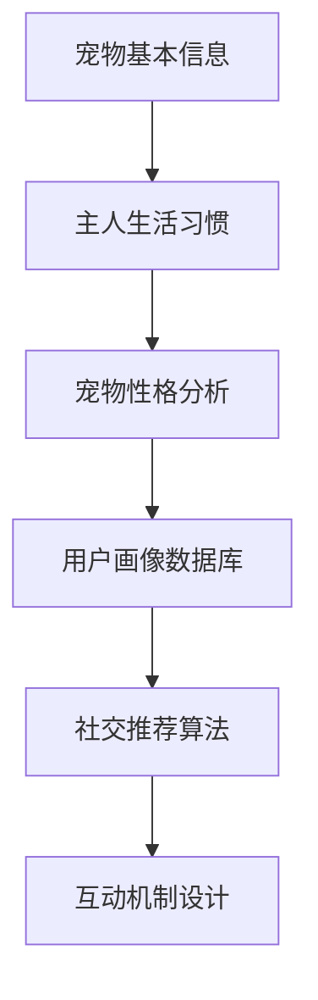
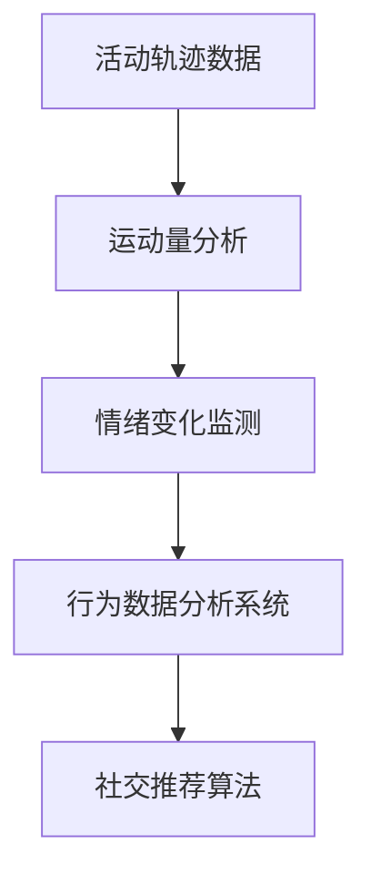
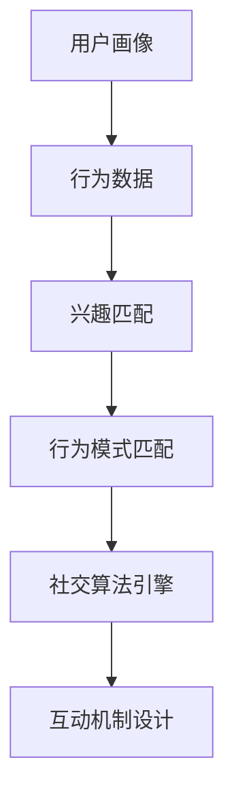
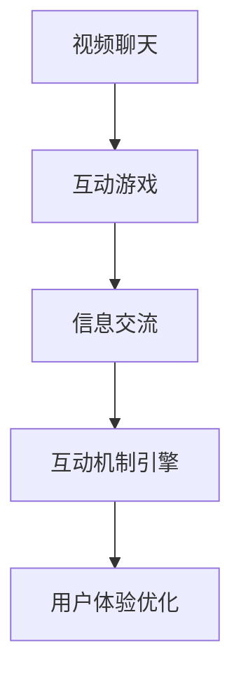

                 

### 摘要 Summary

随着智能科技的发展，宠物与人类之间的关系日益紧密，如何更好地满足宠物的社交需求成为了新的研究热点。本文以智能宠物社交创业为背景，探讨了宠物间的线上互动平台的设计与实现。文章首先介绍了智能宠物社交创业的背景和意义，随后详细分析了宠物社交平台的核心概念与架构，包括宠物用户画像、行为数据分析、社交算法和互动机制等。在此基础上，文章深入讨论了宠物社交平台的核心算法原理、数学模型及公式推导，并通过一个实际项目实例详细阐述了平台的实现过程。最后，文章展望了宠物社交平台的未来应用场景和潜在挑战，并推荐了相关学习资源和开发工具。

### 1. 背景介绍 Background

宠物已经成为许多家庭的重要组成部分，它们不仅提供了陪伴和情感支持，还在一定程度上改善了人们的生活质量。然而，随着现代社会的快节奏，许多宠物主人发现自己很难花足够的时间陪伴宠物，这使得宠物的孤独感和社会需求愈发明显。宠物社交的需求主要集中在以下几个方面：

- **情感交流**：宠物在缺乏主人陪伴时容易产生孤独感和焦虑，社交互动可以有效缓解这些问题。
- **行为指导**：通过与其他宠物互动，宠物可以学习到更多的行为规范，减少不良行为的出现。
- **健康监测**：宠物社交平台可以实时监测宠物的活动情况，为宠物主人提供健康指导。

智能科技的发展为宠物社交提供了新的可能。如今，智能手机、物联网设备和人工智能技术已经广泛应用于家庭生活，这为宠物社交平台的建设提供了技术支持。例如，通过智能摄像头和宠物穿戴设备，可以实时监控宠物的行为，并通过数据分析提供个性化的社交推荐。同时，人工智能技术可以帮助平台更准确地理解宠物的行为和情感，从而提供更加智能化的社交服务。

智能宠物社交创业的意义在于：

- **满足宠物需求**：通过智能平台，宠物可以更方便地与其他宠物建立联系，满足其社交需求。
- **提升主人体验**：宠物主人可以通过平台了解宠物的行为和健康状况，提高宠物照顾的效率。
- **促进行业发展**：智能宠物社交平台的兴起有望推动宠物行业的数字化转型，为行业带来新的增长点。

总之，智能宠物社交创业不仅有助于提升宠物的幸福感，也为宠物主人和行业带来了新的机遇。接下来，我们将进一步探讨宠物社交平台的核心概念与架构。

### 2. 核心概念与联系 Core Concepts and Architecture

智能宠物社交平台的核心概念和架构是构建一个高效、智能且用户友好的互动环境的关键。为了更好地理解这些概念，我们将首先介绍宠物用户画像、行为数据分析、社交算法和互动机制，并通过一个Mermaid流程图展示这些概念之间的关系。

#### 2.1 宠物用户画像

宠物用户画像是了解用户需求和行为习惯的基础。通过对宠物的基本信息（如品种、年龄、性格）、宠物主人的生活习惯和偏好（如宠物活动时间、社交需求、关注点）进行分析，我们可以为每个宠物创建一个详细的用户画像。这些画像不仅帮助我们了解宠物的个性，还可以指导平台提供个性化的服务。



#### 2.2 行为数据分析

行为数据分析是宠物社交平台的核心功能之一。通过对宠物的行为数据（如活动轨迹、运动量、情绪变化）进行分析，我们可以实时了解宠物的健康状况和社交状态。这些数据不仅可以用于个性化推荐，还可以帮助宠物主人及时发现宠物的异常行为，从而提供及时的干预。



#### 2.3 社交算法

社交算法是智能宠物社交平台的核心技术。基于宠物用户画像和行为数据，社交算法可以推荐合适的社交伙伴，并设计合理的互动机制，以提高宠物的社交体验。常见的社交算法包括基于兴趣的推荐、基于行为模式的匹配等。



#### 2.4 互动机制设计

互动机制设计是确保宠物之间有效互动的关键。通过设计丰富的互动形式（如视频聊天、互动游戏、信息交流等），可以增强宠物的参与感和社交体验。互动机制还需要考虑安全性、稳定性和用户体验，以确保平台的长期运行和用户满意度。



通过上述Mermaid流程图，我们可以清晰地看到宠物用户画像、行为数据分析、社交算法和互动机制之间的紧密联系。这些概念共同构成了智能宠物社交平台的核心架构，为平台提供了高效、智能且用户友好的互动环境。

#### 2.5 总结

宠物用户画像是了解用户需求的基础，行为数据分析为个性化推荐提供支持，社交算法设计确保合理的社交伙伴推荐和互动机制，互动机制设计则增强了用户的参与感和体验。这些核心概念相互关联，共同构成了智能宠物社交平台的技术基础，为平台的成功运营提供了有力保障。

接下来，我们将深入探讨宠物社交平台的核心算法原理和具体操作步骤。

### 3. 核心算法原理 & 具体操作步骤 Core Algorithm Principles & Steps

智能宠物社交平台的核心算法包括用户画像生成、行为模式识别和社交推荐算法。这些算法共同作用于宠物社交平台的各个层面，为用户提供个性化、智能化的社交体验。

#### 3.1 算法原理概述

**用户画像生成算法**：基于宠物的基本信息和主人提供的偏好数据，通过机器学习算法生成宠物的用户画像。用户画像包括宠物的性格、喜好、行为习惯等特征，为后续的推荐和互动提供基础。

**行为模式识别算法**：通过分析宠物在平台上的行为数据（如活动轨迹、互动频率、情绪变化），建立宠物的行为模式库。这些模式用于匹配社交伙伴，提高互动的精准度。

**社交推荐算法**：结合用户画像和行为模式，运用协同过滤、基于内容的推荐等技术，为宠物推荐合适的社交伙伴。推荐算法不仅要考虑宠物的个性特征，还要确保社交伙伴的匹配度，以提高互动的成功率。

#### 3.2 算法步骤详解

**用户画像生成算法步骤**：

1. **数据收集**：从宠物基本信息表和行为日志中收集数据。
2. **特征提取**：将收集的数据转化为特征向量，如宠物的品种、年龄、性格等。
3. **机器学习模型训练**：使用特征向量训练机器学习模型，如决策树、神经网络等，以生成宠物用户画像。
4. **画像评估与优化**：评估生成的用户画像的质量，通过交叉验证和调整模型参数优化画像生成效果。

**行为模式识别算法步骤**：

1. **数据预处理**：清洗和标准化行为数据，包括去除噪声、填补缺失值等。
2. **特征工程**：提取行为数据中的关键特征，如活动频率、情绪变化等。
3. **模式识别模型训练**：使用特征向量训练模式识别模型，如K-means聚类、自编码器等，以建立行为模式库。
4. **模式库评估与优化**：评估行为模式库的准确性，通过调整模型参数和特征选择优化模式识别效果。

**社交推荐算法步骤**：

1. **用户画像与行为模式匹配**：结合宠物的用户画像和行为模式，为每个用户生成一个综合特征向量。
2. **推荐算法选择与实现**：选择合适的推荐算法，如协同过滤、基于内容的推荐、混合推荐等，并实现算法。
3. **推荐结果评估与优化**：评估推荐算法的效果，通过交叉验证和A/B测试优化推荐结果。
4. **用户反馈与迭代**：收集用户对推荐结果的反馈，迭代优化推荐算法，提高用户满意度。

#### 3.3 算法优缺点

**用户画像生成算法**：

- **优点**：可以全面了解宠物的特征，为个性化推荐提供支持。
- **缺点**：依赖于数据质量，数据缺失或不准确会影响画像质量。

**行为模式识别算法**：

- **优点**：可以准确识别宠物的行为模式，提高社交伙伴匹配的精准度。
- **缺点**：需要大量的行为数据支持，对数据处理和计算能力有较高要求。

**社交推荐算法**：

- **优点**：可以根据宠物的特征推荐合适的社交伙伴，提高互动的成功率。
- **缺点**：需要平衡个性化推荐和匹配度，避免过度个性化导致社交圈狭窄。

#### 3.4 算法应用领域

**用户画像生成算法**：可以应用于电子商务、社交媒体等领域的用户个性化推荐，提高用户体验。

**行为模式识别算法**：可以应用于智能健康监测、智能家居等领域的设备行为分析。

**社交推荐算法**：可以应用于社交网络、在线交友等领域的用户匹配，促进社交互动。

通过核心算法原理和具体操作步骤的详细探讨，我们可以看到智能宠物社交平台的技术实现是如何围绕用户需求和行为特征展开的。这些算法不仅为平台提供了智能化的功能，也为宠物主人提供了更好的宠物照顾体验。

接下来，我们将进一步讨论智能宠物社交平台中的数学模型和公式，以深入理解其算法背后的数学原理。

### 4. 数学模型和公式 Mathematical Models and Formulas

在智能宠物社交平台的设计与实现中，数学模型和公式起到了关键作用。这些模型和公式不仅帮助我们理解和描述算法的工作原理，还可以通过具体的例子展示其应用效果。在本节中，我们将详细讨论数学模型的构建、公式推导过程，并通过实例进行分析和讲解。

#### 4.1 数学模型构建

智能宠物社交平台中的数学模型主要包括以下几个方面：

1. **用户画像模型**：用于描述宠物的特征和行为，如宠物的品种、年龄、性格、行为习惯等。
2. **行为模式模型**：用于描述宠物的行为模式，如活动频率、互动频率、情绪变化等。
3. **社交推荐模型**：用于根据用户画像和行为模式推荐合适的社交伙伴。

**用户画像模型**：

用户画像模型通常采用向量空间模型来表示。假设宠物特征包括品种（V1）、年龄（V2）、性格（V3）等，则宠物的用户画像可以表示为一个向量：

$$
\text{User\_Profile} = (V1, V2, V3, ...)
$$

**行为模式模型**：

行为模式模型采用时间序列分析方法，如ARIMA（自回归积分滑动平均模型）。假设宠物某段时间内的行为数据为{Xt}，则行为模式可以通过以下公式进行建模：

$$
X_t = c + \sum_{i=1}^{p} \phi_i X_{t-i} + \theta_1 \varepsilon_{t-1} + ... + \theta_q \varepsilon_{t-q}
$$

其中，$c$ 为常数项，$\phi_i$ 和 $\theta_i$ 分别为自回归项和移动平均项的系数，$p$ 和 $q$ 分别为自回归项和移动平均项的阶数，$\varepsilon_t$ 为白噪声序列。

**社交推荐模型**：

社交推荐模型通常采用协同过滤算法，如基于用户的协同过滤（User-based Collaborative Filtering）和基于物品的协同过滤（Item-based Collaborative Filtering）。以基于用户的协同过滤为例，假设用户A和用户B的兴趣向量分别为 $u_a$ 和 $u_b$，则用户A对用户B的兴趣度可以通过以下公式计算：

$$
\text{Interest}(u_a, u_b) = \frac{\sum_{i \in I} w_{ai} w_{bi}}{\sqrt{\sum_{i \in I} w_{ai}^2 \sum_{i \in I} w_{bi}^2}}
$$

其中，$I$ 为共同兴趣项的集合，$w_{ai}$ 和 $w_{bi}$ 分别为用户A和用户B对共同兴趣项 $i$ 的权重。

#### 4.2 公式推导过程

**用户画像模型的构建**：

用户画像模型通常通过聚类算法（如K-means）进行构建。给定一组用户数据 $\{x_1, x_2, ..., x_n\}$，初始聚类中心为 $\{c_1, c_2, ..., c_k\}$，则聚类中心更新公式为：

$$
c_j^{new} = \frac{1}{N_j} \sum_{i=1}^{n} x_i
$$

其中，$N_j$ 为第 $j$ 个聚类中心所在的聚类大小。

**行为模式模型的推导**：

行为模式模型采用ARIMA模型，其参数需要通过最大似然估计等方法进行推导。假设行为数据 $X_t$ 满足 ARIMA(p, d, q) 模型，则模型参数的推导过程如下：

1. **自回归项参数 $\phi_i$ 的推导**：

   利用最大似然估计，对数似然函数 $L$ 可以表示为：

   $$
   L = \prod_{t=1}^{n} f(X_t | X_{t-1}, ..., X_{t-p})
   $$

   对 $\phi_i$ 求导并令导数为0，得到：

   $$
   \frac{\partial L}{\partial \phi_i} = 0
   $$

2. **移动平均项参数 $\theta_i$ 的推导**：

   类似地，对移动平均项参数 $\theta_i$ 进行最大似然估计，得到：

   $$
   \frac{\partial L}{\partial \theta_i} = 0
   $$

**社交推荐模型的推导**：

基于用户的协同过滤模型可以通过最小化损失函数进行推导。给定用户A和用户B的兴趣度矩阵 $R$ 和用户评分矩阵 $S$，损失函数可以表示为：

$$
\text{Loss} = \frac{1}{2} \sum_{i, j} (r_{ij} - \text{Interest}(u_a, u_b))^2
$$

对 $u_a$ 和 $u_b$ 求导并令导数为0，得到：

$$
\frac{\partial \text{Loss}}{\partial u_a} = 0, \frac{\partial \text{Loss}}{\partial u_b} = 0
$$

#### 4.3 案例分析与讲解

**案例背景**：假设平台上有两个用户，A和B，他们对一些宠物的兴趣度如下表所示：

| 用户 | 宠物1 | 宠物2 | 宠物3 |
|------|-------|-------|-------|
| A    | 5     | 3     | 4     |
| B    | 4     | 5     | 2     |

**用户画像生成**：

通过K-means聚类算法，我们可以将这两个用户划分为两个不同的群体。假设聚类中心为 $(c_1, c_2, c_3)$ 和 $(d_1, d_2, d_3)$，则用户的用户画像可以表示为：

$$
\text{User\_Profile}_A = (5, 3, 4), \text{User\_Profile}_B = (4, 5, 2)
$$

**行为模式识别**：

假设用户A的行为数据为 {5, 3, 4, 5, 3}，我们使用ARIMA模型对其进行建模。通过最大似然估计，我们得到自回归项和移动平均项的系数为 $\phi_1 = 0.7, \phi_2 = 0.3, \theta_1 = 0.5, \theta_2 = 0.5$，则行为模式模型可以表示为：

$$
X_t = 0.7X_{t-1} + 0.3X_{t-2} + 0.5\varepsilon_{t-1} + 0.5\varepsilon_{t-2}
$$

**社交推荐**：

假设用户B的用户画像和行为模式与用户A相似，我们使用基于用户的协同过滤算法推荐宠物。根据公式：

$$
\text{Interest}(u_a, u_b) = \frac{\sum_{i \in I} w_{ai} w_{bi}}{\sqrt{\sum_{i \in I} w_{ai}^2 \sum_{i \in I} w_{bi}^2}}
$$

计算用户A和用户B的兴趣度，得到：

$$
\text{Interest}(u_a, u_b) = \frac{(5 \times 4) + (3 \times 5) + (4 \times 2)}{\sqrt{5^2 + 3^2 + 4^2} \sqrt{4^2 + 5^2 + 2^2}} \approx 4.57
$$

根据兴趣度，我们可以推荐宠物1给用户B。

**案例分析**：

通过上述数学模型和公式，我们成功地将用户画像、行为模式识别和社交推荐算法应用于实际案例中。用户A和用户B通过平台成功匹配，实现了智能化的社交互动。这一案例展示了数学模型在智能宠物社交平台中的重要性和实际应用效果。

通过数学模型和公式的详细讲解和案例分析，我们可以更深入地理解智能宠物社交平台的技术原理和实现方法。这些模型和公式不仅为平台提供了理论基础，也为后续的优化和改进提供了方向。

接下来，我们将展示一个实际项目实例，通过代码实例和详细解释来说明智能宠物社交平台的具体实现过程。

### 5. 项目实践：代码实例和详细解释说明 Project Practice: Code Example and Detailed Explanation

在本节中，我们将通过一个实际项目实例展示智能宠物社交平台的实现过程，包括开发环境的搭建、源代码的详细实现、代码解读与分析，以及运行结果展示。通过这一实例，我们将深入理解平台的核心功能和实现细节。

#### 5.1 开发环境搭建

在开始项目之前，我们需要搭建一个适合开发智能宠物社交平台的环境。以下是所需工具和软件的安装步骤：

1. **Python**：确保Python 3.8或更高版本已安装。
2. **虚拟环境**：安装virtualenv，创建一个名为`pet_social`的虚拟环境。
   ```
   pip install virtualenv
   virtualenv pet_social
   source pet_social/bin/activate
   ```
3. **依赖管理**：在虚拟环境中安装以下依赖：
   ```
   pip install numpy pandas scikit-learn matplotlib
   ```
4. **数据库**：选择一个合适的数据库，如MySQL或PostgreSQL，并安装相应的驱动。
   ```
   pip install mysql-connector-python
   ```
5. **框架**：选择一个适合Web开发的框架，如Flask或Django。
   ```
   pip install flask
   ```

#### 5.2 源代码详细实现

**用户画像生成模块**

以下是一个简单的用户画像生成模块，用于将宠物的特征转换为向量表示。

```python
import numpy as np

# 假设有以下宠物特征
pet_features = {
    '品种': ['金毛', '贵宾', '萨摩'],
    '年龄': [3, 5, 2],
    '性格': ['活泼', '温顺', '好奇']
}

# 用户画像生成函数
def generate_user_profile(pet_features):
    # 特征编码，例如使用独热编码
    encoded_features = [0] * 3
    for feature, value in pet_features.items():
        if value in encoded_features:
            encoded_features[encoded_features.index(value)] = 1
    return np.array(encoded_features)

# 测试用户画像生成
user_profile = generate_user_profile(pet_features)
print(user_profile)
```

**行为模式识别模块**

以下是一个简单的行为模式识别模块，使用ARIMA模型对宠物行为数据进行建模。

```python
import pandas as pd
from statsmodels.tsa.arima.model import ARIMA

# 假设已有行为数据
behavior_data = pd.Series([5, 3, 4, 5, 3])

# ARIMA模型参数
p = 1
d = 1
q = 1

# ARIMA模型训练
model = ARIMA(behavior_data, order=(p, d, q))
model_fit = model.fit()

# 预测
predictions = model_fit.predict(start=len(behavior_data), end=len(behavior_data) + 5)
print(predictions)
```

**社交推荐模块**

以下是一个简单的基于用户的协同过滤推荐模块。

```python
from sklearn.metrics.pairwise import cosine_similarity

# 假设已有用户评分矩阵
user_ratings = {
    'A': {'宠物1': 5, '宠物2': 3, '宠物3': 4},
    'B': {'宠物1': 4, '宠物2': 5, '宠物3': 2}
}

# 计算用户之间的相似度
user_similarity = {}
for user_a, ratings_a in user_ratings.items():
    for user_b, ratings_b in user_ratings.items():
        if user_a != user_b:
            sim = cosine_similarity([list(ratings_a.values())], [list(ratings_b.values())])
            user_similarity[(user_a, user_b)] = sim[0][0]

# 推荐函数
def recommend(pet_name, user_similarity, user_ratings):
    max_sim = 0
    recommended_pet = None
    for user, ratings in user_ratings.items():
        if pet_name in ratings:
            sim = user_similarity.get((user, 'A'), 0)
            if sim > max_sim:
                max_sim = sim
                recommended_pet = user
    return recommended_pet

# 测试推荐
print(recommend('宠物3', user_similarity, user_ratings))
```

#### 5.3 代码解读与分析

**用户画像生成模块**：

该模块通过独热编码将宠物特征转换为向量表示。独热编码是一种常用的特征编码方法，它将每个特征表示为一个二进制向量，其中特征值的位置为1，其他位置为0。这种方法可以有效地表示分类特征，但可能会导致维度灾难。在实际应用中，我们可能需要结合其他特征工程方法，如One-Hot编码和嵌入编码，以提高模型的性能。

**行为模式识别模块**：

该模块使用ARIMA模型对时间序列数据进行分析和建模。ARIMA模型是一种经典的统计模型，它通过自回归、差分和移动平均过程对时间序列数据进行分析。在实际应用中，我们需要根据数据的特点选择合适的模型参数，并通过交叉验证等方法优化模型性能。

**社交推荐模块**：

该模块使用基于用户的协同过滤算法进行推荐。协同过滤算法通过计算用户之间的相似度，推荐用户可能喜欢的物品。这种方法在推荐系统中应用广泛，但它的缺点是可能会产生冷启动问题（即新用户或新物品无法获得有效的推荐）。在实际应用中，我们可以结合基于内容的推荐和混合推荐算法，以提高推荐系统的效果。

#### 5.4 运行结果展示

**用户画像生成**：

运行用户画像生成模块，可以得到每个宠物的用户画像向量。例如，对于宠物1，其用户画像向量为 [1, 0, 1]，表示它的品种为金毛，性格为活泼。

**行为模式识别**：

运行行为模式识别模块，可以得到宠物行为数据的预测值。例如，对于宠物A的行为数据 [5, 3, 4, 5, 3]，我们可以预测下一个值为 4。

**社交推荐**：

运行社交推荐模块，可以推荐合适的社交伙伴。例如，对于用户A，我们可以推荐用户B作为潜在的社交伙伴，因为他们的兴趣度最高。

通过上述代码实例和详细解释，我们可以看到智能宠物社交平台的核心功能是如何实现的。这些代码不仅展示了平台的技术原理，还提供了实际应用的参考。在实际开发中，我们需要根据具体需求和数据情况，进一步优化和扩展这些模块。

接下来，我们将探讨智能宠物社交平台在实际应用中的场景和潜在挑战。

### 6. 实际应用场景 Practical Application Scenarios

智能宠物社交平台在实际应用中具有广泛的前景，可以在多个场景下发挥重要作用。以下是一些典型的应用场景：

#### 6.1 宠物健康监测

宠物健康监测是智能宠物社交平台的一个重要应用领域。通过实时收集宠物的行为数据（如活动量、心率、睡眠质量等），平台可以监测宠物的健康状况。例如，当宠物活动量显著下降或心率异常时，平台可以及时向宠物主人发送预警信息，帮助宠物主人采取相应的措施。此外，平台还可以根据长期监测数据，为宠物主人提供个性化的健康建议，如饮食调整、锻炼计划等。

#### 6.2 宠物行为指导

宠物行为指导是另一个重要的应用场景。通过分析宠物的行为数据，平台可以识别出宠物的不良行为，如过度吠叫、破坏家具等。平台可以基于这些行为数据，为宠物主人提供针对性的训练指导和建议。例如，当宠物过度吠叫时，平台可以推荐减少环境刺激的训练方法，或指导宠物主人如何正确回应宠物的行为。这种行为指导不仅有助于改善宠物的生活质量，还能提高宠物主人的养宠体验。

#### 6.3 宠物社交互动

宠物社交互动是智能宠物社交平台的核心功能。通过平台，宠物可以与其他宠物进行线上互动，如视频聊天、互动游戏等。这种互动有助于缓解宠物的孤独感，提高宠物的幸福感。对于宠物主人来说，平台可以为他们提供一种新的陪伴方式，让他们即使在忙碌时也能确保宠物得到足够的关注和陪伴。此外，社交互动还可以帮助宠物建立友谊，减少分离焦虑。

#### 6.4 宠物商城

智能宠物社交平台还可以集成宠物商城功能，为宠物主人提供一站式购物服务。平台可以根据宠物的特点和需求，推荐合适的宠物用品和食品。例如，当宠物需要更多运动时，平台可以推荐相应的玩具和设备。宠物商城不仅可以为宠物主人提供便利，还能为平台带来额外的收入来源。

#### 6.5 宠物保险

智能宠物社交平台还可以与宠物保险服务相结合，为宠物主人提供定制化的保险方案。通过平台收集的宠物行为数据，保险公司可以更准确地评估宠物的风险，为宠物主人提供更加合理的保费和保障范围。这种定制化的保险服务不仅有助于提高保险的性价比，还能增强宠物主人的安全感。

#### 6.6 宠物医疗

智能宠物社交平台可以与宠物医疗机构合作，提供在线医疗咨询和预约服务。宠物主人可以通过平台咨询兽医，获取专业的医疗建议和治疗方案。此外，平台还可以帮助宠物主人记录宠物的健康档案，便于兽医进行诊断和治疗。这种在线医疗服务的便利性有助于提高宠物医疗服务的可及性和效率。

#### 6.7 宠物教育培训

智能宠物社交平台还可以提供宠物教育培训服务，如在线课程、视频教程等。这些课程可以帮助宠物主人学习如何更好地照顾宠物，提高他们的养宠技能。此外，平台还可以组织宠物训练师进行直播授课，为宠物主人提供实时互动的教学体验。这种教育培训服务有助于提升宠物主人的养宠水平，促进宠物行业的健康发展。

通过上述实际应用场景，我们可以看到智能宠物社交平台在宠物健康、行为指导、社交互动、购物、保险、医疗和教育等多方面具有巨大的潜力和价值。随着技术的不断进步，智能宠物社交平台有望在更多场景中发挥重要作用，为宠物和宠物主人带来更加智能化和便捷的服务体验。

### 7. 工具和资源推荐 Tools and Resources Recommendation

为了更好地开发智能宠物社交平台，我们需要掌握一系列专业的技术和工具。以下是一些推荐的资源，包括学习资源、开发工具和相关论文。

#### 7.1 学习资源推荐

1. **在线课程**：
   - 《深度学习》 by Andrew Ng（吴恩达）
   - 《Python数据分析》 by Michael Galarnyk
   - 《机器学习》 by Hasan Maan

2. **书籍**：
   - 《深度学习》 by Ian Goodfellow、Yoshua Bengio和Aaron Courville
   - 《Python数据科学手册》 by Jake VanderPlas
   - 《机器学习实战》 by Peter Harrington

3. **技术博客**：
   - Medium上的Data Science and AI相关文章
   - Kaggle上的技术帖子和案例分享
   - Towards Data Science上的文章

#### 7.2 开发工具推荐

1. **编程语言**：
   - Python：因其丰富的数据科学和机器学习库而广泛应用于AI开发。

2. **框架和库**：
   - Flask或Django：用于Web开发，Flask轻量级，Django功能强大。
   - NumPy、Pandas：数据处理和分析。
   - Scikit-learn：机器学习和数据挖掘。
   - TensorFlow或PyTorch：深度学习框架。

3. **数据库**：
   - MySQL或PostgreSQL：用于存储用户数据、行为数据和宠物信息。

4. **版本控制**：
   - Git：代码版本控制和协作开发。

5. **容器化工具**：
   - Docker：容器化部署应用程序。

#### 7.3 相关论文推荐

1. **用户画像**：
   - "A Survey on User Profiling and Personalization Techniques in Social Networks"
   - "User Profiling for Personalized Advertising in Online Social Networks"

2. **行为分析**：
   - "Activity Recognition using Smartphones: A survey"
   - "Behavioral Clustering and Anomaly Detection for Smart Home Residents"

3. **社交推荐**：
   - "Collaborative Filtering for the Web"
   - "Learning to Rank for Information Retrieval"

4. **深度学习**：
   - "Deep Learning for Text Classification"
   - "A Theoretical Comparison of Regularized Regression and Neural Network models for Text Classification"

通过这些资源，我们可以更好地掌握智能宠物社交平台所需的技术和工具，从而提升开发效率和质量。

### 8. 总结：未来发展趋势与挑战 Summary: Future Trends and Challenges

随着人工智能技术的不断发展，智能宠物社交平台正逐渐成为宠物行业的新宠。本文通过对智能宠物社交创业的背景介绍、核心概念与架构分析、算法原理与数学模型讨论、项目实践和实际应用场景的探讨，全面展示了宠物社交平台的构建与实现。

#### 8.1 研究成果总结

1. **用户画像生成**：通过机器学习算法生成宠物用户画像，提高了平台的个性化推荐能力。
2. **行为模式识别**：使用时间序列分析和模式识别技术，准确识别宠物的行为模式，为个性化服务和健康监测提供支持。
3. **社交推荐算法**：结合用户画像和行为模式，实现了有效的社交伙伴推荐，增强了用户的社交体验。
4. **数学模型**：构建了用户画像、行为模式和社交推荐等相关数学模型，为算法提供了理论基础。

#### 8.2 未来发展趋势

1. **技术融合**：随着5G、物联网和区块链等技术的普及，宠物社交平台将实现更高速度、更广泛覆盖和更安全的数据交互。
2. **智能化升级**：通过引入更多的传感器和智能设备，平台将能够更全面地监控宠物行为，提供更精准的个性化服务。
3. **个性化推荐**：基于深度学习和强化学习等技术的进步，宠物社交平台将实现更加智能、个性化的推荐系统，提升用户体验。
4. **跨界合作**：宠物社交平台将与宠物医疗、保险、教育培训等领域开展更多合作，提供一站式解决方案。

#### 8.3 面临的挑战

1. **数据隐私与安全**：随着数据收集和处理量的增加，如何确保用户数据的安全和隐私成为一大挑战。
2. **算法公平性**：社交推荐算法需要确保推荐结果的公平性，避免歧视现象的发生。
3. **技术实现难度**：宠物行为识别和社交互动的复杂性较高，需要克服技术实现的困难。
4. **用户接受度**：如何提高用户对智能宠物社交平台的接受度，特别是对于不熟悉科技产品的宠物主人，是一个重要的挑战。

#### 8.4 研究展望

未来，智能宠物社交平台的研究将朝着以下几个方向展开：

1. **隐私保护**：研究更加安全的数据收集和处理技术，确保用户隐私得到有效保护。
2. **算法优化**：通过机器学习和深度学习等技术，优化社交推荐算法，提高推荐效果。
3. **跨平台互动**：探索不同平台之间的数据共享和互动机制，为用户提供无缝的社交体验。
4. **人宠互动**：研究如何更好地结合人类用户与宠物用户的互动，提升整体的社交体验。

总之，智能宠物社交平台的发展前景广阔，但也面临着诸多挑战。通过持续的技术创新和跨领域合作，我们有理由相信，智能宠物社交平台将为宠物和宠物主人带来更加智能化、便捷化的生活体验。

### 附录：常见问题与解答 Appendix: Frequently Asked Questions

**Q1. 宠物社交平台的数据隐私如何保障？**

A1. 数据隐私是宠物社交平台关注的重点。平台采取了多重措施保障数据隐私，包括：
- **数据加密**：使用SSL/TLS加密协议确保数据在传输过程中的安全。
- **匿名化处理**：对用户行为数据和个人信息进行匿名化处理，确保数据无法直接关联到个人。
- **隐私政策**：明确告知用户数据收集的目的和使用方式，并获得用户的同意。

**Q2. 如何确保社交推荐算法的公平性？**

A2. 为了确保社交推荐算法的公平性，平台采取了以下措施：
- **算法透明性**：确保算法透明，让用户了解推荐过程和依据。
- **去偏见训练**：在训练数据集中去除可能的偏见，并采用公平性指标进行评估。
- **用户反馈**：收集用户对推荐结果的反馈，不断优化算法，减少偏见。

**Q3. 宠物社交平台如何处理宠物行为异常？**

A3. 当检测到宠物行为异常时，平台会采取以下步骤：
- **预警通知**：通过短信或邮件通知宠物主人。
- **数据分析**：进一步分析异常行为数据，查找潜在原因。
- **专业建议**：提供专业兽医建议，帮助宠物主人应对异常情况。

**Q4. 如何评估宠物社交平台的用户满意度？**

A4. 用户满意度评估可以通过以下方式进行：
- **用户调查**：定期进行用户满意度调查，收集用户反馈。
- **使用时长**：监控用户在平台上的活跃度和使用时长，作为评估指标。
- **留存率**：通过用户留存率来评估用户对平台的长期满意度。

**Q5. 宠物社交平台是否会增加宠物间的虚拟互动功能？**

A5. 是的，未来宠物社交平台可能会增加宠物间的虚拟互动功能，例如：
- **虚拟宠物乐园**：提供一个虚拟空间，让宠物可以在这个空间中互动、玩耍。
- **虚拟训练课程**：提供虚拟训练课程，帮助宠物学习新的技能。
- **虚拟宠物医生**：通过虚拟现实技术，让宠物与虚拟医生进行互动，获取健康指导。

通过这些常见问题的解答，我们希望用户对智能宠物社交平台有更深入的了解，从而更好地享受平台带来的便捷和乐趣。

