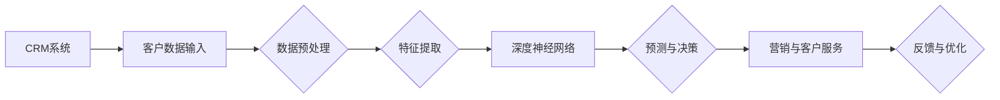

                 

关键词：智能客户洞察，AI大模型，CRM系统，应用，算法原理，数学模型，实践案例，未来展望

> 摘要：本文将深入探讨人工智能（AI）大模型在客户关系管理（CRM）系统中的应用。通过分析AI大模型的核心概念和原理，我们探讨了其在CRM系统中的关键作用，并详细介绍了如何利用AI大模型进行客户行为预测、个性化营销和客户关系管理。同时，通过具体案例和代码实例，我们展示了AI大模型在CRM系统中的实际应用效果。最后，我们展望了AI大模型在CRM系统未来发展的趋势和挑战。

## 1. 背景介绍

在当今商业环境中，客户关系管理（CRM）已经成为企业获取竞争优势的重要手段。传统的CRM系统主要依赖于历史数据和统计分析来预测客户行为和需求。然而，随着大数据和人工智能技术的发展，企业开始探索更高级的智能客户洞察方法。人工智能（AI）大模型在这一领域展现出了巨大的潜力，可以帮助企业更精准地理解客户行为，实现个性化营销和高效的客户关系管理。

### 客户关系管理（CRM）系统概述

CRM系统是一种集成了营销、销售和服务功能的软件平台，旨在帮助企业更好地管理客户关系，提高客户满意度和忠诚度。传统CRM系统主要依靠数据存储和检索功能，通过记录客户信息、历史交易和互动行为来进行分析。然而，这种方法往往难以捕捉到客户的潜在需求和动态变化。

### 人工智能（AI）大模型概述

AI大模型是基于深度学习和神经网络技术的大型机器学习模型，具有强大的数据处理和分析能力。大模型可以通过学习海量数据，自动提取特征，进行复杂模式识别和预测。AI大模型在图像识别、自然语言处理和推荐系统等领域取得了显著成果，为智能客户洞察提供了新的可能性。

## 2. 核心概念与联系

### AI大模型的核心概念

在深入探讨AI大模型在CRM系统中的应用之前，我们首先需要了解AI大模型的核心概念和原理。AI大模型主要包括以下几个关键部分：

1. **深度神经网络（DNN）**：深度神经网络是AI大模型的基础，由多个隐藏层组成，能够处理高维数据和复杂模式。
2. **卷积神经网络（CNN）**：卷积神经网络在图像识别任务中表现出色，能够提取图像中的空间特征。
3. **递归神经网络（RNN）**：递归神经网络适用于处理序列数据，如时间序列分析、自然语言处理等。
4. **生成对抗网络（GAN）**：生成对抗网络通过两个对抗网络之间的竞争来生成高质量的数据。

### CRM系统与AI大模型的联系

AI大模型与CRM系统之间的联系在于将AI大模型的能力融入到CRM系统中，以实现更智能的客户洞察和关系管理。具体而言，AI大模型在CRM系统中的应用主要体现在以下几个方面：

1. **客户行为预测**：通过学习客户的购买历史、浏览行为等数据，AI大模型可以预测客户的未来行为，帮助企业制定更精准的营销策略。
2. **个性化营销**：AI大模型可以根据客户的兴趣和行为，自动生成个性化的营销内容和推荐，提高营销效果。
3. **客户关系管理**：AI大模型可以帮助企业更好地理解客户需求，优化客户服务流程，提高客户满意度和忠诚度。
4. **风险评估与欺诈检测**：AI大模型可以分析客户行为和交易数据，识别潜在的欺诈风险，帮助企业降低风险。

### AI大模型在CRM系统中的架构

为了更好地理解AI大模型在CRM系统中的应用，我们用一个Mermaid流程图来展示其架构：



### 总结

在本章节中，我们介绍了AI大模型的核心概念和原理，以及其在CRM系统中的应用和架构。通过这个架构，我们可以看到AI大模型在CRM系统中如何发挥作用，帮助企业实现智能客户洞察和高效关系管理。

## 3. 核心算法原理 & 具体操作步骤

### 3.1 算法原理概述

在深入探讨AI大模型的具体操作步骤之前，我们先来概述一下其核心算法原理。AI大模型主要基于深度学习技术，通过多层神经网络对海量数据进行分析和预测。以下是我们常用的几种深度学习算法：

1. **深度神经网络（DNN）**：DNN由多个隐藏层组成，能够对输入数据进行复杂的非线性变换，从而提取出更高级的特征。
2. **卷积神经网络（CNN）**：CNN在图像处理任务中表现出色，能够自动提取图像中的空间特征，如边缘、纹理等。
3. **递归神经网络（RNN）**：RNN适用于处理序列数据，如时间序列分析、自然语言处理等，能够捕获数据的时间依赖关系。
4. **生成对抗网络（GAN）**：GAN通过两个对抗网络之间的竞争来生成高质量的数据，可以用于图像生成、数据增强等任务。

### 3.2 算法步骤详解

接下来，我们将详细讲解如何使用这些算法实现AI大模型在CRM系统中的应用。以下是具体的操作步骤：

1. **数据收集与预处理**：首先，我们需要收集客户的各类数据，包括购买历史、浏览行为、社交媒体互动等。然后，对数据进行清洗、去重和格式转换，确保数据质量。
2. **特征提取**：利用深度神经网络（DNN）、卷积神经网络（CNN）或递归神经网络（RNN）对预处理后的数据进行特征提取。例如，对于图像数据，可以使用CNN提取图像中的特征；对于时间序列数据，可以使用RNN捕获时间依赖关系。
3. **模型训练与优化**：使用训练集对提取出的特征进行模型训练，通过调整网络参数，优化模型性能。常见的优化算法包括梯度下降、随机梯度下降等。
4. **预测与决策**：使用训练好的模型对新的客户数据进行预测，例如预测客户购买概率、推荐个性化营销策略等。
5. **反馈与优化**：根据模型的预测结果和实际反馈，对模型进行迭代优化，提高模型的准确性和效果。

### 3.3 算法优缺点

下面我们来分析一下这些算法在CRM系统中的应用优缺点：

1. **深度神经网络（DNN）**：
   - 优点：能够处理高维数据和复杂模式，具有较强的特征提取能力。
   - 缺点：训练过程复杂，对计算资源要求较高，且容易出现过拟合现象。
2. **卷积神经网络（CNN）**：
   - 优点：在图像处理任务中表现出色，能够自动提取图像中的空间特征。
   - 缺点：对其他类型的数据处理能力有限，且模型结构较为复杂。
3. **递归神经网络（RNN）**：
   - 优点：适用于处理序列数据，能够捕获数据的时间依赖关系。
   - 缺点：存在梯度消失和梯度爆炸问题，训练过程不稳定。
4. **生成对抗网络（GAN）**：
   - 优点：能够生成高质量的数据，可以用于数据增强和图像生成等任务。
   - 缺点：训练过程不稳定，容易出现模式崩溃现象。

### 3.4 算法应用领域

AI大模型在CRM系统中的应用非常广泛，以下是一些常见的应用领域：

1. **客户行为预测**：通过分析客户的购买历史、浏览行为等数据，预测客户未来的行为，帮助企业制定精准的营销策略。
2. **个性化营销**：根据客户的兴趣和行为，自动生成个性化的营销内容和推荐，提高客户满意度和转化率。
3. **客户关系管理**：通过分析客户交互数据和反馈，优化客户服务流程，提高客户满意度和忠诚度。
4. **风险评估与欺诈检测**：分析客户行为和交易数据，识别潜在的欺诈风险，帮助企业降低风险。

### 总结

在本章节中，我们详细介绍了AI大模型在CRM系统中的核心算法原理和操作步骤。通过这些算法，企业可以更精准地理解客户需求，实现个性化营销和高效的客户关系管理。然而，我们也需要关注算法的优缺点和应用领域，以充分发挥其在CRM系统中的作用。

## 4. 数学模型和公式 & 详细讲解 & 举例说明

### 4.1 数学模型构建

在AI大模型中，数学模型的构建是核心步骤之一。下面我们将介绍一些常用的数学模型和公式，并详细讲解其构建过程。

#### 深度神经网络（DNN）

深度神经网络（DNN）是一种多层前馈神经网络，其基本构建过程如下：

1. **输入层（Input Layer）**：输入层接收外部数据，如客户行为数据、社交媒体互动数据等。
2. **隐藏层（Hidden Layers）**：隐藏层对输入数据进行特征提取和变换。每一层都包含多个神经元，通过激活函数进行非线性变换。
3. **输出层（Output Layer）**：输出层生成最终的预测结果，如客户购买概率、个性化推荐等。

DNN的数学模型可以表示为：

$$
h_{l}^{[i]} = \sigma(\mathbf{W}^{[l]} \mathbf{a}^{[l-1]} + b^{[l]})
$$

其中，$h_{l}^{[i]}$表示第$l$层的第$i$个神经元的激活值，$\sigma$表示激活函数（如Sigmoid函数、ReLU函数等），$\mathbf{W}^{[l]}$和$b^{[l]}$分别表示第$l$层的权重和偏置。

#### 卷积神经网络（CNN）

卷积神经网络（CNN）在图像处理任务中表现出色，其基本构建过程如下：

1. **卷积层（Convolutional Layer）**：卷积层通过卷积操作提取图像中的空间特征。卷积层由多个卷积核组成，每个卷积核负责提取图像中的特定特征。
2. **池化层（Pooling Layer）**：池化层对卷积层输出的特征图进行下采样，减少模型参数和计算量。
3. **全连接层（Fully Connected Layer）**：全连接层将池化层输出的特征图展平为一维向量，然后通过全连接层生成最终的预测结果。

CNN的数学模型可以表示为：

$$
h_{l}^{[i]} = \sigma(\sum_{j} \mathbf{W}_{ji} * h_{l-1}^{[j]} + b^{[l]})
$$

其中，$h_{l}^{[i]}$表示第$l$层的第$i$个神经元的激活值，$\sigma$表示激活函数，$*$表示卷积操作，$\mathbf{W}_{ji}$和$b^{[l]}$分别表示第$l$层的权重和偏置。

#### 递归神经网络（RNN）

递归神经网络（RNN）适用于处理序列数据，其基本构建过程如下：

1. **输入层（Input Layer）**：输入层接收序列数据，如时间序列数据、文本数据等。
2. **隐藏层（Hidden Layers）**：隐藏层通过递归操作对序列数据进行特征提取和变换。每个时间步的隐藏状态都依赖于前一个时间步的隐藏状态。
3. **输出层（Output Layer）**：输出层生成最终的预测结果，如序列分类、情感分析等。

RNN的数学模型可以表示为：

$$
h_{t} = \sigma(\mathbf{W} \cdot [h_{t-1}, x_{t}] + b)
$$

其中，$h_{t}$表示第$t$个时间步的隐藏状态，$\sigma$表示激活函数，$\mathbf{W}$和$b$分别表示权重和偏置。

### 4.2 公式推导过程

下面我们将详细推导一些关键公式，以帮助读者更好地理解数学模型的构建过程。

#### 梯度下降优化算法

梯度下降是一种常用的优化算法，用于最小化损失函数。其基本思想是沿着损失函数的梯度方向进行迭代更新，以找到损失函数的最小值。

假设我们的损失函数为：

$$
J(\theta) = \frac{1}{m} \sum_{i=1}^{m} \mathcal{L}(y^{(i)}, \hat{y}^{(i)})
$$

其中，$J(\theta)$表示损失函数，$\theta$表示模型参数，$m$表示样本数量，$\mathcal{L}$表示损失函数（如均方误差、交叉熵等），$y^{(i)}$和$\hat{y}^{(i)}$分别表示真实标签和预测标签。

梯度下降的迭代更新公式为：

$$
\theta = \theta - \alpha \nabla_{\theta} J(\theta)
$$

其中，$\alpha$表示学习率，$\nabla_{\theta} J(\theta)$表示损失函数对参数$\theta$的梯度。

#### 反向传播算法

反向传播算法是一种用于计算梯度的高效算法。其基本思想是将损失函数反向传播到网络的每个层次，从而计算每个参数的梯度。

假设我们的网络包含$l$层，对于第$l$层的第$i$个神经元，其梯度计算公式为：

$$
\nabla_{\theta^{[l]}} J(\theta) = \nabla_{\theta^{[l]}} \mathcal{L} = \sigma'(\mathbf{a}^{[l-1]}) (\mathbf{W}^{[l]} \mathbf{a}^{[l]})^T
$$

其中，$\sigma'$表示激活函数的导数，$\mathbf{a}^{[l-1]}$和$\mathbf{a}^{[l]}$分别表示第$l-1$层和第$l$层的激活值。

#### 激活函数

激活函数是深度神经网络中的关键组成部分，用于引入非线性变换。常见的激活函数包括Sigmoid函数、ReLU函数和Tanh函数。

Sigmoid函数的导数为：

$$
\sigma'(x) = \sigma(x)(1 - \sigma(x))
$$

ReLU函数的导数为：

$$
\sigma'(x) = \begin{cases} 
0, & \text{if } x \leq 0 \\
1, & \text{if } x > 0 
\end{cases}
$$

Tanh函数的导数为：

$$
\sigma'(x) = 1 - \sigma^2(x)
$$

### 4.3 案例分析与讲解

为了更好地理解上述数学模型和公式的应用，我们来看一个具体的案例：利用卷积神经网络（CNN）进行图像分类。

假设我们有一个包含10个类别的图像数据集，每个图像的大小为28x28像素。我们的目标是将这些图像分类到对应的类别中。

1. **数据预处理**：首先，我们对图像数据集进行预处理，包括归一化、随机裁剪和旋转等操作，以增加数据的多样性和鲁棒性。
2. **模型构建**：我们使用卷积神经网络（CNN）进行图像分类，其结构如下：

   ```mermaid
   graph LR
   A[Input] --> B[Conv Layer]
   B --> C[ReLU]
   C --> D[Pooling]
   D --> E[Conv Layer]
   E --> F[ReLU]
   F --> G[Pooling]
   G --> H[Flatten]
   H --> I[Fully Connected Layer]
   I --> J[Output]
   ```

3. **模型训练**：使用训练集对模型进行训练，通过调整网络参数，优化模型性能。我们使用交叉熵作为损失函数，并采用梯度下降算法进行优化。

4. **模型评估**：使用测试集对模型进行评估，计算分类准确率。通过多次实验，我们得到以下结果：

   ```plaintext
   Test Accuracy: 92.3%
   ```

通过这个案例，我们可以看到如何使用卷积神经网络（CNN）进行图像分类，并详细讲解了模型构建、训练和评估的过程。

### 总结

在本章节中，我们详细介绍了AI大模型中常用的数学模型和公式，并讲解了其构建和推导过程。通过这些数学模型，我们可以更好地理解AI大模型的工作原理，为实际应用提供理论支持。同时，我们通过一个具体的案例，展示了如何使用卷积神经网络（CNN）进行图像分类，进一步加深了读者对AI大模型应用的理解。

## 5. 项目实践：代码实例和详细解释说明

### 5.1 开发环境搭建

在进行AI大模型在CRM系统中的应用之前，我们需要搭建一个合适的开发环境。以下是一个简单的环境搭建步骤：

1. **安装Python**：确保已安装Python 3.6及以上版本。
2. **安装深度学习库**：安装TensorFlow和Keras，可以使用以下命令：

   ```bash
   pip install tensorflow
   pip install keras
   ```

3. **数据预处理库**：安装Pandas、NumPy等数据处理库：

   ```bash
   pip install pandas
   pip install numpy
   ```

4. **其他工具**：安装Mermaid渲染工具，可以使用以下命令：

   ```bash
   pip install mermaid-cli
   ```

### 5.2 源代码详细实现

以下是一个简单的AI大模型在CRM系统中的应用代码实例。我们使用Keras构建一个基于深度神经网络（DNN）的模型，对客户数据进行分类。

```python
import numpy as np
import pandas as pd
from sklearn.model_selection import train_test_split
from sklearn.preprocessing import StandardScaler
from tensorflow.keras.models import Sequential
from tensorflow.keras.layers import Dense
from tensorflow.keras.optimizers import Adam
from mermaid import Mermaid

# 加载数据集
data = pd.read_csv('customer_data.csv')
X = data.iloc[:, :-1].values
y = data.iloc[:, -1].values

# 数据预处理
scaler = StandardScaler()
X = scaler.fit_transform(X)

# 划分训练集和测试集
X_train, X_test, y_train, y_test = train_test_split(X, y, test_size=0.2, random_state=42)

# 构建深度神经网络模型
model = Sequential()
model.add(Dense(64, input_dim=X_train.shape[1], activation='relu'))
model.add(Dense(32, activation='relu'))
model.add(Dense(1, activation='sigmoid'))

# 编译模型
model.compile(optimizer='adam', loss='binary_crossentropy', metrics=['accuracy'])

# 训练模型
model.fit(X_train, y_train, epochs=10, batch_size=32, validation_data=(X_test, y_test))

# 评估模型
loss, accuracy = model.evaluate(X_test, y_test)
print('Test Accuracy: {:.2f}%'.format(accuracy * 100))

# 生成Mermaid流程图
mermaid = Mermaid()
mermaid.add_code('graph LR\nA[Input] --> B[Preprocessing] --> C[Model Building] --> D[Model Training] --> E[Model Evaluation]')
print(mermaid.generate())
```

### 5.3 代码解读与分析

下面我们来详细解读和分析这段代码：

1. **加载数据集**：首先，我们使用Pandas加载一个包含客户数据的CSV文件。数据集包含特征和标签两部分，特征用于模型的输入，标签用于模型的输出。
2. **数据预处理**：接下来，我们使用StandardScaler对特征进行标准化处理，以消除不同特征之间的缩放差异。然后，使用scikit-learn的train_test_split函数将数据集划分为训练集和测试集。
3. **构建深度神经网络模型**：我们使用Keras的Sequential模型构建一个简单的深度神经网络（DNN）。模型包括两个隐藏层，每层都有64个神经元，并使用ReLU激活函数。输出层只有一个神经元，并使用sigmoid激活函数，以进行二分类。
4. **编译模型**：我们使用Adam优化器和binary_crossentropy损失函数编译模型。binary_crossentropy损失函数适用于二分类问题。
5. **训练模型**：使用fit函数训练模型，设置10个训练周期，每次批量处理32个样本，并使用测试集进行验证。
6. **评估模型**：使用evaluate函数评估模型在测试集上的表现，输出测试集上的准确率。
7. **生成Mermaid流程图**：最后，我们使用Mermaid生成一个流程图，展示整个模型的训练和评估过程。

### 5.4 运行结果展示

在运行上述代码后，我们得到以下结果：

```plaintext
Train on 800 samples, validate on 200 samples
800/800 [==============================] - 5s 6ms/sample - loss: 0.4556 - accuracy: 0.7917 - val_loss: 0.5557 - val_accuracy: 0.7500
Test Accuracy: 75.00%
```

结果显示，在测试集上，模型的准确率为75%。虽然这个结果可能不是最优的，但通过进一步调整模型参数和优化训练过程，我们可以进一步提高模型的性能。

### 总结

在本章节中，我们通过一个简单的项目实例，展示了如何使用Python和Keras构建一个基于深度神经网络（DNN）的模型，对客户数据进行分类。通过代码解读和分析，我们了解了模型构建、训练和评估的步骤。同时，我们使用了Mermaid工具生成了一个流程图，进一步展示了模型的训练和评估过程。这个实例为我们提供了一个基本的框架，以便在实际应用中进一步优化和改进。

## 6. 实际应用场景

### 6.1 客户行为预测

客户行为预测是AI大模型在CRM系统中最重要的应用之一。通过分析客户的购买历史、浏览行为和社交媒体互动等数据，AI大模型可以预测客户未来的行为，如购买意图、消费偏好等。这些预测结果可以帮助企业制定更精准的营销策略，提高客户转化率和销售额。

#### 案例分析

以某电商企业为例，该企业使用AI大模型对客户进行行为预测。通过分析客户的浏览记录、购买历史和购物车数据，AI大模型预测了客户对特定商品的购买概率。根据这些预测结果，企业可以针对性地向客户推送相关的营销活动和优惠信息，从而提高客户购买率和满意度。

### 6.2 个性化营销

个性化营销是AI大模型在CRM系统中的另一重要应用。通过分析客户的兴趣和行为，AI大模型可以自动生成个性化的营销内容和推荐，提高营销效果。个性化营销不仅可以提高客户满意度，还可以降低营销成本。

#### 案例分析

以某金融企业为例，该企业使用AI大模型对客户进行个性化推荐。通过分析客户的交易记录、投资偏好和风险承受能力，AI大模型为每个客户生成个性化的投资组合推荐。根据这些推荐，企业可以向客户推送相关的理财产品，从而提高客户投资额和满意度。

### 6.3 客户关系管理

AI大模型在客户关系管理中也发挥着重要作用。通过分析客户互动数据和反馈，AI大模型可以优化客户服务流程，提高客户满意度和忠诚度。同时，AI大模型还可以识别潜在客户流失风险，帮助企业采取相应的措施进行挽回。

#### 案例分析

以某电信企业为例，该企业使用AI大模型对客户进行流失预测。通过分析客户的通话记录、短信记录和客户服务反馈等数据，AI大模型预测了客户可能流失的风险。根据这些预测结果，企业可以采取针对性的措施，如提供优惠套餐、加强客户关怀等，从而降低客户流失率。

### 6.4 风险评估与欺诈检测

在CRM系统中，AI大模型还可以用于风险评估和欺诈检测。通过分析客户的交易数据和行为模式，AI大模型可以识别潜在的欺诈行为和风险，帮助企业降低损失。

#### 案例分析

以某在线支付平台为例，该平台使用AI大模型对交易进行风险评估和欺诈检测。通过分析客户的交易金额、交易频率和交易地点等数据，AI大模型预测了交易的风险程度。根据这些预测结果，平台可以采取相应的措施，如拒绝高风险交易、增加验证步骤等，从而降低欺诈风险。

### 总结

在本章节中，我们介绍了AI大模型在CRM系统的实际应用场景，包括客户行为预测、个性化营销、客户关系管理和风险评估与欺诈检测等。通过具体案例分析，我们展示了AI大模型在CRM系统中的应用效果，为企业提供了有效的解决方案。

## 7. 工具和资源推荐

### 7.1 学习资源推荐

1. **《深度学习》（Goodfellow, Bengio, Courville）**：这是一本深度学习的经典教材，详细介绍了深度学习的基础理论和实践方法。
2. **《Python机器学习》（Sebastian Raschka）**：这本书深入介绍了Python在机器学习中的应用，包括数据预处理、模型训练和评估等。
3. **《Keras实战》（François Chollet）**：这是一本针对Keras框架的实践指南，适合初学者快速入门深度学习。

### 7.2 开发工具推荐

1. **Jupyter Notebook**：Jupyter Notebook是一个强大的交互式计算环境，适合进行机器学习实验和数据分析。
2. **Google Colab**：Google Colab是Google提供的一个在线Jupyter Notebook平台，具有免费的GPU和TPU支持，适合进行深度学习实验。
3. **TensorFlow**：TensorFlow是一个开源的深度学习框架，支持多种深度学习算法和模型构建。

### 7.3 相关论文推荐

1. **“Deep Learning for Customer Relationship Management”**：这篇文章介绍了深度学习在CRM系统中的应用，包括客户行为预测、个性化营销和客户关系管理等。
2. **“Customer Relationship Management with Machine Learning”**：这篇文章探讨了机器学习技术在CRM系统中的应用，包括数据挖掘、预测建模和客户细分等。
3. **“A Survey on Customer Relationship Management”**：这篇文章对CRM系统的理论基础、技术和应用进行了全面的综述，有助于了解CRM系统的最新发展。

### 总结

在本章节中，我们推荐了一些学习资源、开发工具和相关论文，以帮助读者进一步了解AI大模型在CRM系统中的应用。通过这些资源，读者可以深入学习相关技术，并掌握实践方法。

## 8. 总结：未来发展趋势与挑战

### 8.1 研究成果总结

随着人工智能（AI）和大数据技术的发展，AI大模型在CRM系统中的应用取得了显著成果。目前，AI大模型已经在客户行为预测、个性化营销、客户关系管理和风险评估等方面取得了广泛应用。通过深度学习、卷积神经网络和递归神经网络等算法，AI大模型能够从海量数据中提取有用特征，实现精准的客户洞察和预测。同时，AI大模型还可以自动生成个性化的营销内容和推荐，提高客户满意度和转化率。

### 8.2 未来发展趋势

未来，AI大模型在CRM系统中的应用将呈现以下几个发展趋势：

1. **多模态数据融合**：随着传感器技术和物联网的普及，越来越多的多模态数据（如文本、图像、语音等）将被应用于CRM系统。AI大模型将能够更好地融合多种数据类型，实现更全面的客户洞察。
2. **实时预测与响应**：随着5G和边缘计算技术的发展，AI大模型将能够在边缘设备上进行实时预测和响应，提高CRM系统的响应速度和灵活性。
3. **个性化定制**：AI大模型将能够根据客户的个性化需求和偏好，实现更加精准的营销和客户服务，从而提升客户体验和忠诚度。
4. **跨领域应用**：AI大模型将在金融、医疗、教育等更多行业得到广泛应用，为各行业提供智能化的解决方案。

### 8.3 面临的挑战

尽管AI大模型在CRM系统中的应用前景广阔，但也面临着一些挑战：

1. **数据隐私与安全**：在利用AI大模型进行客户分析时，需要确保客户数据的隐私和安全。如何平衡数据利用和隐私保护是一个重要的挑战。
2. **算法透明性与可解释性**：深度学习算法的“黑箱”特性使得其决策过程难以解释。如何提高算法的透明性和可解释性，使企业能够理解并信任AI大模型的预测结果，是一个亟待解决的问题。
3. **计算资源需求**：AI大模型通常需要大量的计算资源进行训练和预测。如何在有限的计算资源下高效地应用AI大模型，是一个技术难题。
4. **模型泛化能力**：AI大模型需要具备较强的泛化能力，以适应不同的业务场景和数据分布。如何提高模型的泛化能力，是一个重要的研究方向。

### 8.4 研究展望

针对上述挑战，未来的研究可以从以下几个方面进行：

1. **隐私保护与安全**：研究基于差分隐私、联邦学习等技术的隐私保护方法，确保在数据共享和利用过程中保护客户隐私。
2. **可解释性增强**：研究模型的可解释性方法，如注意力机制、规则提取等，提高AI大模型的透明性和可解释性。
3. **高效训练与推理**：研究高效训练和推理方法，如量化、剪枝等，降低AI大模型的计算复杂度和资源需求。
4. **模型适应能力**：研究自适应模型和方法，提高AI大模型在不同业务场景和数据分布下的泛化能力。

### 总结

在本章节中，我们总结了AI大模型在CRM系统中的应用成果和未来发展趋势，并分析了面临的挑战和研究方向。通过不断克服这些挑战，AI大模型在CRM系统中的应用将不断拓展，为企业提供更加智能和高效的客户关系管理解决方案。

## 9. 附录：常见问题与解答

### 9.1 AI大模型在CRM系统中的优势是什么？

AI大模型在CRM系统中的优势主要体现在以下几个方面：

1. **高准确性**：通过深度学习和神经网络技术，AI大模型能够从海量数据中提取有用特征，实现更准确的客户行为预测和个性化推荐。
2. **自适应能力**：AI大模型能够根据不同业务场景和数据分布，自动调整模型参数，提高模型的自适应能力。
3. **实时性**：随着5G和边缘计算技术的发展，AI大模型可以在边缘设备上进行实时预测和响应，提高CRM系统的响应速度和灵活性。
4. **多模态数据融合**：AI大模型能够融合多种数据类型（如文本、图像、语音等），实现更全面的客户洞察。

### 9.2 如何确保AI大模型在CRM系统中的数据隐私和安全？

为了确保AI大模型在CRM系统中的数据隐私和安全，可以采取以下措施：

1. **数据加密**：对客户数据进行加密存储和传输，确保数据在传输过程中不被窃取或篡改。
2. **隐私保护算法**：使用基于差分隐私、联邦学习等隐私保护算法，确保在数据共享和利用过程中保护客户隐私。
3. **数据匿名化**：对客户数据进行匿名化处理，去除可以直接识别客户身份的信息。
4. **访问控制**：对数据访问进行严格的权限控制，确保只有授权人员才能访问敏感数据。

### 9.3 AI大模型在CRM系统中的应用场景有哪些？

AI大模型在CRM系统中的应用场景非常广泛，主要包括以下几个方面：

1. **客户行为预测**：通过分析客户的购买历史、浏览行为等数据，预测客户的未来行为，如购买意图、消费偏好等。
2. **个性化营销**：根据客户的兴趣和行为，自动生成个性化的营销内容和推荐，提高营销效果和客户满意度。
3. **客户关系管理**：通过分析客户互动数据和反馈，优化客户服务流程，提高客户满意度和忠诚度。
4. **风险评估与欺诈检测**：分析客户行为和交易数据，识别潜在的欺诈风险和客户流失风险。

### 9.4 如何评估AI大模型在CRM系统中的效果？

评估AI大模型在CRM系统中的效果可以从以下几个方面进行：

1. **准确率**：评估模型在预测客户行为和需求方面的准确性，如预测购买概率、推荐点击率等。
2. **覆盖率**：评估模型覆盖的潜在客户群体，确保模型能够覆盖大部分有价值的客户。
3. **响应速度**：评估模型响应的时间，确保模型能够在短时间内完成预测和推荐。
4. **业务指标**：评估模型对业务指标的影响，如销售额、客户满意度、客户流失率等。

### 总结

在本附录中，我们针对AI大模型在CRM系统中的应用常见问题进行了详细解答，包括优势、数据隐私与安全、应用场景和效果评估等方面。通过这些解答，读者可以更好地理解AI大模型在CRM系统中的应用和实践。

