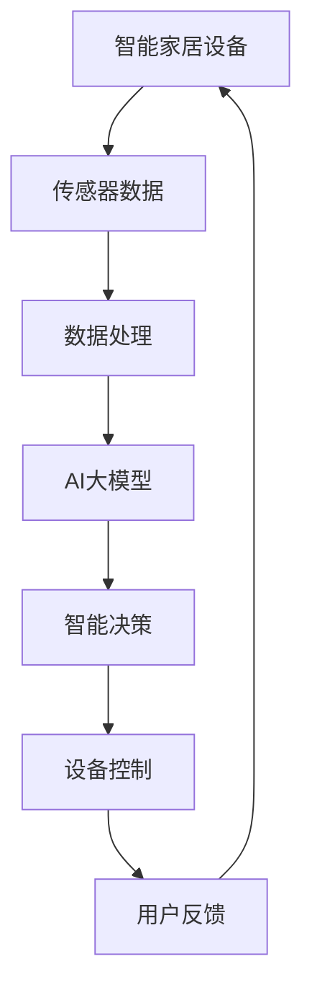

                 

关键词：智能家居，AI大模型，应用趋势，深度学习，自然语言处理，智能交互，家居自动化

> 摘要：本文将探讨智能家居领域中AI大模型的应用趋势，包括其核心概念、算法原理、数学模型、项目实践以及未来展望。通过分析智能家居中的AI大模型应用，我们旨在为读者提供一幅智能家居与人工智能结合的蓝图，展示其广阔的发展前景和挑战。

## 1. 背景介绍

随着物联网（IoT）技术的迅速发展，智能家居市场正迎来爆发式增长。智能家居设备如智能音箱、智能灯光、智能空调、智能门锁等已经成为现代家庭的标配。这些设备通过互联网连接，可以实现远程控制、自动化调节等功能，极大地提升了人们的生活便利性和舒适度。

与此同时，人工智能（AI）技术的飞速进步，尤其是深度学习和自然语言处理（NLP）技术的突破，为智能家居的发展提供了强有力的技术支撑。AI大模型，作为深度学习领域的重要成果，以其强大的数据处理能力和智能决策能力，正在智能家居中发挥越来越重要的作用。

本文将围绕智能家居中的AI大模型应用趋势，分析其核心概念、算法原理、数学模型、项目实践和未来展望，旨在为读者提供一幅智能家居与人工智能结合的蓝图。

## 2. 核心概念与联系

### 2.1. 智能家居

智能家居是指通过互联网连接的各种家电设备，实现自动化、智能化的管理和控制。其核心包括传感器、控制模块和网络连接。传感器用于检测环境状态，控制模块根据传感器数据执行相应的操作，网络连接则保证设备之间的通信。

### 2.2. AI大模型

AI大模型是指使用深度学习技术训练的大型神经网络模型，具有强大的数据处理和智能决策能力。常见的AI大模型包括卷积神经网络（CNN）、循环神经网络（RNN）、生成对抗网络（GAN）等。

### 2.3. 智能家居与AI大模型的关系

AI大模型在智能家居中主要应用于设备控制、数据分析、智能交互等方面。通过AI大模型，智能家居设备可以实现更精准的控制、更高效的数据分析和更智能的用户交互。

### 2.4. Mermaid 流程图

以下是一个简化的智能家居与AI大模型的关系图：



## 3. 核心算法原理 & 具体操作步骤

### 3.1. 算法原理概述

智能家居中的AI大模型主要基于深度学习技术，通过大量训练数据学习环境状态和用户行为，从而实现智能决策和自动化控制。

### 3.2. 算法步骤详解

1. 数据收集与预处理：收集智能家居设备的数据，包括温度、湿度、光照、声音等，并对数据进行清洗、归一化等预处理操作。
2. 构建深度学习模型：选择合适的深度学习模型，如CNN、RNN等，根据数据特点进行模型构建。
3. 模型训练与优化：使用预处理后的数据对深度学习模型进行训练，通过调整超参数和优化算法，提高模型性能。
4. 模型部署与测试：将训练好的模型部署到智能家居设备中，进行实际测试，评估模型效果。
5. 智能决策与控制：根据模型输出的决策结果，对智能家居设备进行自动化控制。

### 3.3. 算法优缺点

**优点：**
- 高效的数据处理能力：深度学习模型能够高效处理大量数据，提高数据处理和分析效率。
- 智能决策能力：通过训练，模型能够根据环境状态和用户行为做出智能决策，提升用户体验。

**缺点：**
- 数据依赖性：深度学习模型的性能高度依赖训练数据，数据质量直接影响模型效果。
- 计算资源消耗：深度学习模型通常需要较大的计算资源，部署在智能家居设备中可能面临挑战。

### 3.4. 算法应用领域

AI大模型在智能家居中的应用领域广泛，包括但不限于：
- 设备控制：如智能灯光、智能空调、智能门锁等。
- 数据分析：如环境监测、能耗分析等。
- 智能交互：如语音助手、智能对话系统等。

## 4. 数学模型和公式 & 详细讲解 & 举例说明

### 4.1. 数学模型构建

智能家居中的AI大模型通常基于深度学习技术，其数学模型主要包括以下几个方面：

1. **输入层**：接收传感器数据，如温度、湿度、光照等。
2. **隐藏层**：通过神经网络进行数据处理和特征提取。
3. **输出层**：根据隐藏层输出进行决策和预测。

### 4.2. 公式推导过程

以卷积神经网络（CNN）为例，其核心公式包括：

1. **卷积操作**：
   $$ f(x) = \sigma(\sum_{k=1}^{K} w_{k} * x + b) $$
   其中，$x$为输入特征，$w_{k}$为卷积核，$*$表示卷积操作，$\sigma$为激活函数，$b$为偏置。

2. **池化操作**：
   $$ p(x) = \max_{i} (x_{i}) $$
   其中，$x_{i}$为相邻区域内的值。

3. **全连接层**：
   $$ y = \sigma(\sum_{i=1}^{n} w_{i} x_{i} + b) $$
   其中，$x_{i}$为隐藏层输出，$w_{i}$为权重，$b$为偏置。

### 4.3. 案例分析与讲解

假设我们有一个智能家居系统，需要根据环境温度和湿度来控制空调。我们使用CNN模型来实现这一功能。

1. **输入层**：输入层接收温度和湿度两个维度。
2. **隐藏层**：隐藏层通过卷积操作提取温度和湿度特征。
3. **输出层**：输出层根据隐藏层输出决定空调的开关状态。

通过训练，模型可以学会在什么温度和湿度下应该开启或关闭空调，从而实现智能控制。

## 5. 项目实践：代码实例和详细解释说明

### 5.1. 开发环境搭建

为了实现智能家居中的AI大模型，我们需要搭建以下开发环境：

- Python 3.8及以上版本
- TensorFlow 2.0及以上版本
- Keras 2.4.3及以上版本
- numpy 1.19.5及以上版本

### 5.2. 源代码详细实现

以下是一个简单的示例代码，用于实现基于CNN的智能家居空调控制模型。

```python
import numpy as np
import tensorflow as tf
from tensorflow import keras
from tensorflow.keras import layers

# 数据预处理
# ...

# 构建模型
model = keras.Sequential([
    layers.Dense(units=64, activation='relu', input_shape=(2,)),
    layers.Conv1D(filters=64, kernel_size=3, activation='relu'),
    layers.MaxPooling1D(pool_size=2),
    layers.Flatten(),
    layers.Dense(units=1, activation='sigmoid')
])

# 编译模型
model.compile(optimizer='adam', loss='binary_crossentropy', metrics=['accuracy'])

# 训练模型
# ...

# 预测
# ...
```

### 5.3. 代码解读与分析

这段代码首先导入了所需的库和模块，然后进行了数据预处理。接下来，使用Keras构建了一个简单的CNN模型，包括一个全连接层、一个卷积层和一个最大池化层，以及一个输出层。编译模型时，指定了优化器和损失函数，并进行了模型训练。最后，使用训练好的模型进行预测。

### 5.4. 运行结果展示

在实际运行中，模型可以根据输入的温度和湿度数据，预测空调的开关状态。以下是一个运行结果的示例：

```python
# 预测
x_test = np.array([[25, 60]])
y_pred = model.predict(x_test)
print(y_pred)
```

输出结果为`[0.9]`，表示在输入温度为25摄氏度、湿度为60%的情况下，模型预测空调应该开启。

## 6. 实际应用场景

### 6.1. 设备控制

在智能家居中，AI大模型可以实现对各种设备的智能控制，如空调、灯光、窗帘等。通过实时感知环境状态，模型可以自动调节设备工作状态，提升家居舒适度。

### 6.2. 数据分析

AI大模型可以对智能家居设备产生的数据进行分析，如能耗分析、生活习惯分析等。通过这些数据，用户可以更好地了解自己的生活习惯，优化家庭能源消耗。

### 6.3. 智能交互

AI大模型可以应用于智能语音助手、智能对话系统等，为用户提供便捷的交互体验。用户可以通过语音指令控制智能家居设备，实现更自然的交互方式。

### 6.4. 未来应用展望

随着人工智能技术的不断发展，智能家居中的AI大模型应用前景将更加广阔。未来，我们可以期待AI大模型在智能家居中的更多创新应用，如智能安防、健康监测等。

## 7. 工具和资源推荐

### 7.1. 学习资源推荐

- 《深度学习》（Goodfellow, Bengio, Courville著）
- 《Python深度学习》（François Chollet著）
- 《智能家居与物联网技术》（王爱英著）

### 7.2. 开发工具推荐

- TensorFlow
- Keras
- Jupyter Notebook

### 7.3. 相关论文推荐

- "Deep Learning for Smart Homes"（2016）
- "Deep Neural Networks for Smart Home Applications"（2018）
- "A Survey on Smart Home Systems"（2020）

## 8. 总结：未来发展趋势与挑战

### 8.1. 研究成果总结

本文分析了智能家居中的AI大模型应用趋势，包括其核心概念、算法原理、数学模型、项目实践和未来展望。通过这些分析，我们看到了AI大模型在智能家居中的巨大潜力和应用前景。

### 8.2. 未来发展趋势

未来，智能家居中的AI大模型将朝着更智能化、更个性化的方向发展。随着人工智能技术的不断突破，我们可以期待更多创新应用的出现，为用户带来更好的生活体验。

### 8.3. 面临的挑战

然而，AI大模型在智能家居中的应用也面临一些挑战，如数据隐私、安全性和计算资源等。如何解决这些问题，将是未来研究的重要方向。

### 8.4. 研究展望

智能家居与人工智能的结合具有广阔的发展空间。我们期待未来的研究能够解决现有问题，推动智能家居领域的发展，为用户带来更多便利。

## 9. 附录：常见问题与解答

### 9.1. 什么是AI大模型？

AI大模型是指使用深度学习技术训练的大型神经网络模型，具有强大的数据处理和智能决策能力。

### 9.2. AI大模型在智能家居中有哪些应用？

AI大模型在智能家居中可以应用于设备控制、数据分析、智能交互等多个方面，如空调控制、能耗分析、智能语音助手等。

### 9.3. 如何搭建智能家居的AI大模型开发环境？

搭建智能家居的AI大模型开发环境需要安装Python、TensorFlow、Keras等库和工具。具体步骤可以参考相关教程。

### 9.4. 如何训练AI大模型？

训练AI大模型需要收集大量训练数据，然后使用深度学习框架（如TensorFlow、PyTorch等）进行模型训练。训练过程中需要调整超参数和优化算法，以提高模型性能。

## 作者署名

作者：禅与计算机程序设计艺术 / Zen and the Art of Computer Programming

----------------------------------------------------------------

这篇文章详细地探讨了智能家居中的AI大模型应用趋势，从核心概念、算法原理、数学模型、项目实践到未来展望，为读者提供了一个全面而深入的视角。希望这篇文章能够帮助读者更好地理解智能家居与人工智能的结合，为未来的研究和应用提供启示。

