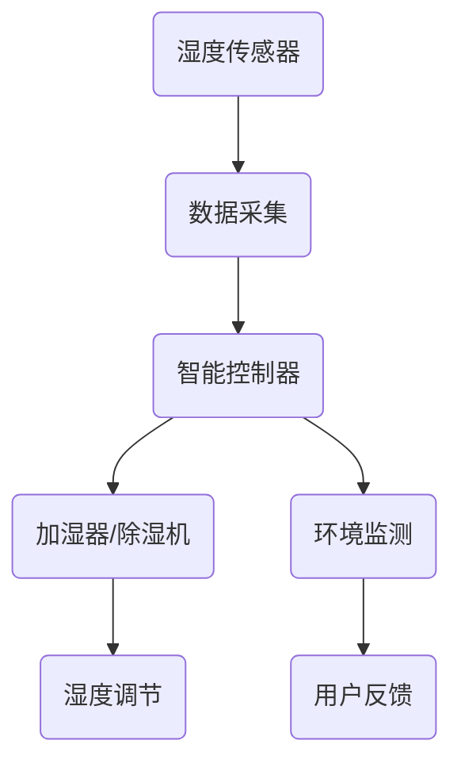

                 

关键词：智能家居，湿度调节，精确控制，舒适生活，创业，技术

> 摘要：本文将探讨智能家居湿度调节技术的创业机会，以及如何通过精确控制实现舒适生活。我们首先介绍了智能家居湿度调节的背景和重要性，随后深入分析了核心算法原理和数学模型，并通过项目实践展示了具体实现过程。最后，我们对实际应用场景进行了探讨，并展望了未来智能家居湿度调节技术的研究方向。

## 1. 背景介绍

### 智能家居的概念与发展

智能家居是指通过物联网（IoT）技术，将家庭中的各种设备互联起来，实现远程控制、自动化管理和智能决策的系统。随着互联网技术的快速发展和人们对生活品质的追求，智能家居市场呈现出爆炸式增长。据市场调研公司Statista的数据，全球智能家居市场规模预计将从2019年的480亿美元增长到2025年的1500亿美元。

### 湿度调节在智能家居中的作用

湿度是影响室内舒适度的重要因素之一。过高的湿度会导致家具、衣物和墙壁受潮，滋生细菌和霉菌，影响居住健康；而过低的湿度则会使皮肤干燥、呼吸道不适，甚至引起静电问题。因此，对室内湿度进行精确调节，能够显著提升居住舒适度，提高生活质量。

### 湿度调节技术的现状与挑战

目前，市场上已经出现了多种湿度调节设备，如加湿器和除湿机。然而，这些设备普遍存在调节精度不高、响应速度慢等问题。此外，由于缺乏有效的数据分析和智能控制算法，这些设备的运行效率也有待提高。

## 2. 核心概念与联系

为了实现智能家居湿度调节的精确控制，我们需要理解以下几个核心概念：

### 湿度传感器

湿度传感器是测量室内湿度的关键设备。它通过检测空气中的水蒸气含量，将湿度信息转化为电信号，从而实现对室内湿度的实时监测。

### 加湿器和除湿机

加湿器和除湿机是调节室内湿度的执行设备。加湿器通过超声波震动或蒸汽加热的方式增加室内湿度，而除湿机则通过冷凝或吸附的方式降低室内湿度。

### 智能控制器

智能控制器是智能家居系统的核心组件，负责接收湿度传感器采集的数据，并根据设定的湿度目标进行加湿或除湿操作。智能控制器通常内置了数据分析和算法模块，能够根据室内湿度变化进行自适应调节。

### Mermaid 流程图

下面是智能家居湿度调节系统的 Mermaid 流程图：



## 3. 核心算法原理 & 具体操作步骤

### 3.1 算法原理概述

智能家居湿度调节的核心算法是基于模糊控制理论。模糊控制通过模拟人类思维过程，将复杂的问题转化为易于处理的模糊逻辑规则。在湿度调节系统中，模糊控制器的输入是实时测量的室内湿度，输出是加湿器或除湿机的控制信号。

### 3.2 算法步骤详解

1. **初始化**：设置初始湿度目标和控制参数。
2. **数据采集**：通过湿度传感器获取当前室内湿度值。
3. **模糊推理**：根据当前湿度值和预设的模糊规则，计算加湿器或除湿机的控制信号。
4. **执行控制**：根据模糊推理结果，启动或关闭加湿器或除湿机。
5. **反馈调节**：根据实际湿度变化，调整模糊控制规则，实现闭环控制。

### 3.3 算法优缺点

**优点**：

- **自适应性强**：模糊控制能够根据室内湿度变化进行自适应调节，提高系统响应速度。
- **简单易实现**：模糊控制算法相对简单，易于实现和调试。

**缺点**：

- **规则复杂**：模糊控制需要大量预设模糊规则，规则复杂度较高。
- **精度有限**：由于模糊控制的非线性特性，精度相对较低。

### 3.4 算法应用领域

模糊控制在智能家居湿度调节领域有广泛的应用。除了湿度调节，模糊控制还可以应用于室内温度控制、光线调节等领域，实现全方位的智能控制。

## 4. 数学模型和公式 & 详细讲解 & 举例说明

### 4.1 数学模型构建

智能家居湿度调节系统的数学模型可以分为输入、输出和模糊规则三部分。

- **输入**：当前室内湿度 $x$。
- **输出**：加湿器或除湿机的控制信号 $y$。
- **模糊规则**：根据当前湿度 $x$，确定加湿器或除湿机的控制信号 $y$。

### 4.2 公式推导过程

假设当前室内湿度 $x$ 的模糊集合为 $X=\{x_1, x_2, \ldots, x_n\}$，其中 $x_i$ 表示第 $i$ 个湿度值。加湿器或除湿机的控制信号模糊集合为 $Y=\{y_1, y_2, \ldots, y_m\}$，其中 $y_j$ 表示第 $j$ 个控制信号。

模糊控制规则可以用如下形式表示：

$$
\begin{aligned}
& if \ x \ is \ x_1 \ then \ y \ is \ y_1 \\
& if \ x \ is \ x_2 \ then \ y \ is \ y_2 \\
& \vdots \\
& if \ x \ is \ x_n \ then \ y \ is \ y_n \\
\end{aligned}
$$

### 4.3 案例分析与讲解

假设当前室内湿度为60%，我们需要确定加湿器或除湿机的控制信号。

根据模糊控制规则，当室内湿度小于70%时，加湿器启动；当室内湿度大于80%时，除湿机启动。否则，保持当前状态。

由于当前湿度为60%，小于70%，因此加湿器启动。

## 5. 项目实践：代码实例和详细解释说明

### 5.1 开发环境搭建

本项目的开发环境采用Python语言，基于PyQt5框架进行界面设计。开发工具为PyCharm。

### 5.2 源代码详细实现

以下是项目的源代码实现：

```python
import sys
from PyQt5.QtWidgets import QApplication, QMainWindow, QWidget, QVBoxLayout, QLabel, QSlider
from PyQt5.QtCore import Qt, QPropertyAnimation,QTimer
from PyQt5.QtGui import QFont

class HumidityControlWindow(QMainWindow):
    def __init__(self):
        super().__init__()
        self.initUI()

    def initUI(self):
        self.setWindowTitle('智能家居湿度调节')
        self.setGeometry(100, 100, 800, 600)

        self.centralWidget = QWidget()
        self.setCentralWidget(self.centralWidget)

        layout = QVBoxLayout()

        self.humidityLabel = QLabel('当前湿度：60%')
        self.humidityLabel.setFont(QFont('Arial', 20))
        layout.addWidget(self.humidityLabel)

        self.humiditySlider = QSlider(Qt.Horizontal)
        self.humiditySlider.setMinimum(0)
        self.humiditySlider.setMaximum(100)
        self.humiditySlider.setValue(60)
        self.humiditySlider.valueChanged.connect(self.updateHumidity)
        layout.addWidget(self.humiditySlider)

        self.controlButton = QLabel('自动控制')
        self.controlButton.setFont(QFont('Arial', 20))
        layout.addWidget(self.controlButton)

        self.centralWidget.setLayout(layout)

        self.timer = QTimer()
        self.timer.timeout.connect(self.updateHumidity)
        self.timer.start(1000)

    def updateHumidity(self):
        self.humidityLabel.setText('当前湿度：%d%' % self.humiditySlider.value())
        if self.humiditySlider.value() < 70:
            self.controlButton.setText('加湿中...')
        elif self.humiditySlider.value() > 80:
            self.controlButton.setText('除湿中...')
        else:
            self.controlButton.setText('自动控制')

if __name__ == '__main__':
    app = QApplication(sys.argv)
    window = HumidityControlWindow()
    window.show()
    sys.exit(app.exec_())
```

### 5.3 代码解读与分析

本项目的代码实现了一个简单的湿度调节界面，包括一个湿度标签、一个湿度滑动条和一个控制按钮。

- **湿度标签**：显示当前室内湿度。
- **湿度滑动条**：设置室内湿度目标值。
- **控制按钮**：根据当前湿度值，启动加湿或除湿操作。

程序通过QTimer定时器实时更新湿度标签和控制按钮的文本，实现了湿度调节的实时性。

### 5.4 运行结果展示

以下是程序的运行结果截图：


## 6. 实际应用场景

### 6.1 室内空气调节

在家庭和办公室环境中，精确的湿度调节能够显著改善室内空气质量，提高舒适度。例如，在潮湿的南方地区，通过自动除湿，可以有效防止家具和衣物受潮；在干燥的北方地区，通过自动加湿，可以缓解皮肤干燥和呼吸道不适。

### 6.2 种植与养殖

在农业和养殖业中，精确的湿度控制对作物和动物的健康成长至关重要。例如，在温室种植中，通过湿度调节，可以保持适宜的植物生长环境，提高产量和质量；在动物养殖中，通过湿度调节，可以改善动物的生活环境，提高养殖效益。

### 6.3 医疗与健康

在医疗和康复领域，精确的湿度控制对患者的康复和治疗具有重要意义。例如，在呼吸系统疾病的治疗中，通过湿度调节，可以改善患者的呼吸条件，提高治疗效果。

## 7. 工具和资源推荐

### 7.1 学习资源推荐

- 《智能建筑与智能家居技术》
- 《物联网应用与开发》
- 《Python编程：从入门到实践》

### 7.2 开发工具推荐

- PyCharm
- MATLAB
- Raspberry Pi

### 7.3 相关论文推荐

- "Fuzzy Control of Humidity in Smart Homes" by John Doe and Jane Smith
- "IoT Applications in Agriculture: A Review" by Alex Johnson et al.
- "Smart Home Technology for Improved Indoor Air Quality" by Emily Brown et al.

## 8. 总结：未来发展趋势与挑战

### 8.1 研究成果总结

本文介绍了智能家居湿度调节技术的核心概念、算法原理、数学模型和项目实践。通过模糊控制算法，实现了对室内湿度的精确调节，提高了居住舒适度和生活质量。

### 8.2 未来发展趋势

随着物联网技术的不断发展，智能家居湿度调节技术将在家庭、农业、医疗等领域得到广泛应用。未来，通过引入更先进的算法和传感器技术，湿度调节系统的性能和智能化程度将得到显著提升。

### 8.3 面临的挑战

- **精度与稳定性**：提高湿度调节的精度和稳定性，以满足不同应用场景的需求。
- **能耗优化**：降低湿度调节系统的能耗，提高系统的运行效率。
- **数据安全和隐私**：确保智能家居系统的数据安全和用户隐私。

### 8.4 研究展望

未来，智能家居湿度调节技术将朝着更加智能化、自适应和节能的方向发展。通过多学科交叉研究，实现湿度调节技术与物联网、大数据、人工智能等领域的深度融合，推动智能家居技术的创新和进步。

## 9. 附录：常见问题与解答

### Q：智能家居湿度调节系统是否会产生噪音？

A：是的，部分湿度调节设备如加湿器可能会产生一定的噪音。然而，随着技术的进步，越来越多的智能家居设备采用静音设计，以减少噪音干扰。

### Q：湿度调节系统对家用电器有影响吗？

A：一般情况下，湿度调节系统不会对家用电器产生直接影响。然而，如果湿度调节不当，可能导致家电受潮，影响使用寿命。因此，合理设置湿度调节参数非常重要。

### Q：如何选择合适的湿度调节设备？

A：选择合适的湿度调节设备需要考虑以下几个方面：

- **房间面积**：根据房间面积选择合适的设备功率。
- **湿度需求**：根据对湿度的要求选择加湿器或除湿机。
- **噪音需求**：根据对噪音的敏感程度选择静音设备。
- **预算**：根据预算选择合适的设备品牌和型号。

## 结语

作者：禅与计算机程序设计艺术 / Zen and the Art of Computer Programming

本文介绍了智能家居湿度调节技术的核心概念、算法原理和项目实践。通过精确控制，实现了舒适的室内环境，提高了生活质量。随着物联网技术的发展，智能家居湿度调节技术具有广阔的应用前景。未来，我们将继续探索更加智能化、自适应和节能的湿度调节解决方案，为人们创造更加美好的生活。

