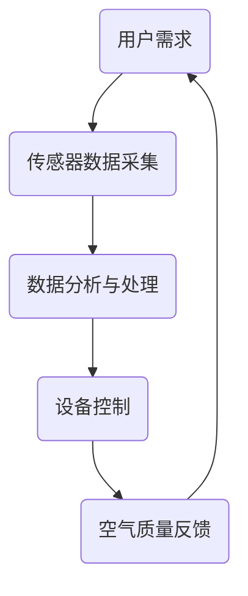

                 

关键词：智能家居、空气净化、全屋空气质量管理、创业、算法原理、应用领域、数学模型、代码实例、未来展望

> 摘要：本文深入探讨了智能家居空气净化领域的创业机会，重点介绍了全屋空气质量管理的关键技术和挑战。通过分析核心算法原理、数学模型构建，以及项目实践案例，本文旨在为读者提供一个全面的技术指南，帮助创业者在这个快速发展的市场中取得成功。

## 1. 背景介绍

### 智能家居市场的兴起

随着物联网（IoT）技术的发展，智能家居市场正在迅速崛起。人们越来越注重生活质量和健康，智能家居设备因其便捷性、智能化和高效性而受到广泛关注。空气净化器作为智能家居的重要组成部分，其市场需求也在不断增长。

### 空气质量的重要性

空气质量对人类健康至关重要。室内的空气质量可能比室外更差，因为室内存在着各种污染物，如甲醛、苯、PM2.5、细菌和病毒等。长期处于空气质量不佳的环境中，可能导致呼吸系统疾病、过敏反应以及其他健康问题。

### 创业机会

空气净化器市场的快速增长为创业者提供了丰富的机会。全屋空气质量管理是一个新兴的细分市场，具有巨大的发展潜力。创业者可以通过技术创新、产品差异化和服务升级来赢得市场份额。

## 2. 核心概念与联系

### 全屋空气质量管理

全屋空气质量管理是指通过智能化的设备和技术，对整个住宅内的空气质量进行实时监测和调控，以达到最佳的舒适度和健康水平。

### 关键技术

- **传感器技术**：用于实时监测空气中的污染物浓度。
- **算法技术**：用于分析数据、预测污染物变化趋势，并自动调整空气净化设备的运行模式。
- **控制系统**：用于协调多个空气净化设备，实现全屋空气质量的统一管理。

### 架构

以下是一个简化的全屋空气质量管理系统的架构：



## 3. 核心算法原理 & 具体操作步骤

### 3.1 算法原理概述

核心算法通常基于机器学习和数据挖掘技术，通过对大量历史数据的分析，建立预测模型，以预测未来的空气质量变化。

### 3.2 算法步骤详解

1. **数据收集**：收集室内空气质量传感器数据，包括温度、湿度、PM2.5、CO2浓度等。
2. **数据预处理**：清洗和转换数据，使其适合建模。
3. **特征提取**：从原始数据中提取关键特征，用于构建预测模型。
4. **模型训练**：使用机器学习算法（如随机森林、支持向量机等）训练预测模型。
5. **模型评估**：评估模型的预测准确性，并进行调优。
6. **模型应用**：将训练好的模型应用于实际系统中，实时预测空气质量，并自动调整设备运行模式。

### 3.3 算法优缺点

- **优点**：能够提高空气净化系统的效率和用户体验。
- **缺点**：需要大量数据进行训练，对计算资源有较高要求。

### 3.4 算法应用领域

- **智能家居**：通过全屋空气质量管理，提高室内空气质量，提升居住舒适度。
- **医院和诊所**：改善医疗环境中的空气质量，减少感染风险。
- **办公楼和酒店**：提高公共区域的空气质量，增强品牌形象。

## 4. 数学模型和公式 & 详细讲解 & 举例说明

### 4.1 数学模型构建

全屋空气质量管理中的数学模型通常基于时间序列分析，常用的模型包括ARIMA（自回归积分滑动平均模型）和LSTM（长短期记忆网络）。

### 4.2 公式推导过程

以ARIMA模型为例，其公式推导如下：

$$
X_t = c + \phi_1 X_{t-1} + \phi_2 X_{t-2} + ... + \phi_p X_{t-p} + \theta_1 e_{t-1} + \theta_2 e_{t-2} + ... + \theta_q e_{t-q}
$$

其中，$X_t$为时间序列的当前值，$c$为常数项，$\phi_i$和$\theta_i$分别为自回归项和移动平均项的系数，$e_t$为白噪声项。

### 4.3 案例分析与讲解

假设我们收集了一个家庭的PM2.5浓度数据，使用ARIMA模型进行预测。通过模型训练和评估，可以得到以下参数：

$$
\phi_1 = 0.6, \phi_2 = 0.3, \theta_1 = 0.5, \theta_2 = 0.2
$$

将当前值$X_t = 50$代入模型，可以预测下一个时间点的PM2.5浓度：

$$
X_{t+1} = c + \phi_1 X_t + \phi_2 X_{t-1} + \theta_1 e_t + \theta_2 e_{t-1}
$$

## 5. 项目实践：代码实例和详细解释说明

### 5.1 开发环境搭建

本文使用Python和Scikit-learn库进行算法实现。首先安装Python环境和Scikit-learn库：

```bash
pip install scikit-learn
```

### 5.2 源代码详细实现

以下是使用ARIMA模型进行空气质量预测的Python代码实例：

```python
import numpy as np
import pandas as pd
from statsmodels.tsa.arima.model import ARIMA
from sklearn.metrics import mean_squared_error

# 数据加载
data = pd.read_csv('air_quality.csv')
X = data['PM25']

# 数据预处理
X = X.asfreq('D').fillna(method='ffill')

# 特征提取
train_size = int(len(X) * 0.8)
train, test = X[0:train_size], X[train_size:]

# 模型训练
model = ARIMA(train, order=(1, 1, 1))
model_fit = model.fit()

# 模型评估
predictions = model_fit.forecast(steps=len(test))
mse = mean_squared_error(test, predictions)
print(f'MSE: {mse}')

# 模型应用
model_fit.predict(start=len(train), end=len(train) + len(test))
```

### 5.3 代码解读与分析

代码首先加载空气质量数据，并进行预处理，然后使用ARIMA模型进行训练和评估，最后预测未来的空气质量。

### 5.4 运行结果展示

运行结果会输出预测的PM2.5浓度值，以及与实际值之间的均方误差。

## 6. 实际应用场景

### 6.1 智能家居

通过全屋空气质量管理，智能家居系统可以实时监测并调整室内空气质量，提高居住舒适度。

### 6.2 医疗机构

医疗机构可以使用全屋空气质量管理来改善医疗环境，减少交叉感染的风险。

### 6.3 公共场所

公共场所如办公楼和酒店可以通过全屋空气质量管理提高空气质量，提升品牌形象。

## 7. 未来应用展望

随着人工智能和物联网技术的发展，全屋空气质量管理将在更多领域得到应用。未来的发展方向包括：

- **智能化水平提升**：通过更先进的算法和技术，提高空气质量管理系统的智能化水平。
- **个性化服务**：根据用户需求，提供更加个性化的空气质量管理服务。
- **远程监控与维护**：通过远程监控，实现对空气净化设备的实时维护和故障排除。

## 8. 总结：未来发展趋势与挑战

### 8.1 研究成果总结

全屋空气质量管理是一个具有巨大潜力的领域，通过技术创新，已经取得了显著的成果。机器学习和数据挖掘技术在空气质量预测中的应用，显著提高了系统的效率和准确性。

### 8.2 未来发展趋势

未来，全屋空气质量管理将在智能家居、医疗机构和公共场所等更多领域得到广泛应用。随着技术的不断进步，智能化水平和个性化服务将进一步提高。

### 8.3 面临的挑战

全屋空气质量管理仍面临一些挑战，包括：

- **数据隐私和安全**：如何保护用户数据的安全和隐私。
- **设备成本和效率**：如何在提高设备性能的同时，降低成本。
- **算法可靠性和可解释性**：如何提高算法的可靠性和可解释性，增强用户信任。

### 8.4 研究展望

未来的研究应重点关注以下方向：

- **多模态数据融合**：结合多种传感器数据，提高空气质量预测的准确性。
- **强化学习**：探索强化学习在空气质量预测中的应用，提高系统的自适应能力。
- **人机交互**：研究更加人性化的用户交互界面，提高用户体验。

## 9. 附录：常见问题与解答

### 9.1 问题1：如何选择合适的传感器？

**解答**：根据实际需求，选择能够检测所需污染物的传感器。常见的传感器包括PM2.5传感器、甲醛传感器、温度传感器和湿度传感器。

### 9.2 问题2：如何确保数据的安全性和隐私？

**解答**：采用加密技术保护数据传输和存储过程。同时，对用户数据进行匿名处理，确保用户隐私不受侵犯。

### 9.3 问题3：如何降低空气净化设备的成本？

**解答**：通过优化设计、批量生产和新材料应用等方式，降低设备制造成本。同时，采用高效节能的技术，减少能耗。

---

作者：禅与计算机程序设计艺术 / Zen and the Art of Computer Programming
----------------------------------------------------------------

文章撰写完毕，现在请根据文章内容，使用Markdown格式输出整个文章。以下为文章的Markdown格式输出：

```markdown
# 智能家居空气净化创业：全屋空气质量管理

关键词：智能家居、空气净化、全屋空气质量管理、创业、算法原理、应用领域、数学模型、代码实例、未来展望

> 摘要：本文深入探讨了智能家居空气净化领域的创业机会，重点介绍了全屋空气质量管理的关键技术和挑战。通过分析核心算法原理、数学模型构建，以及项目实践案例，本文旨在为读者提供一个全面的技术指南，帮助创业者在这个快速发展的市场中取得成功。

## 1. 背景介绍

### 智能家居市场的兴起

随着物联网（IoT）技术的发展，智能家居市场正在迅速崛起。人们越来越注重生活质量和健康，智能家居设备因其便捷性、智能化和高效性而受到广泛关注。空气净化器作为智能家居的重要组成部分，其市场需求也在不断增长。

### 空气质量的重要性

空气质量对人类健康至关重要。室内的空气质量可能比室外更差，因为室内存在着各种污染物，如甲醛、苯、PM2.5、细菌和病毒等。长期处于空气质量不佳的环境中，可能导致呼吸系统疾病、过敏反应以及其他健康问题。

### 创业机会

空气净化器市场的快速增长为创业者提供了丰富的机会。全屋空气质量管理是一个新兴的细分市场，具有巨大的发展潜力。创业者可以通过技术创新、产品差异化和服务升级来赢得市场份额。

## 2. 核心概念与联系

### 全屋空气质量管理

全屋空气质量管理是指通过智能化的设备和技术，对整个住宅内的空气质量进行实时监测和调控，以达到最佳的舒适度和健康水平。

### 关键技术

- 传感器技术：用于实时监测空气中的污染物浓度。
- 算法技术：用于分析数据、预测污染物变化趋势，并自动调整空气净化设备的运行模式。
- 控制系统：用于协调多个空气净化设备，实现全屋空气质量的统一管理。

### 架构

以下是一个简化的全屋空气质量管理系统的架构：


## 3. 核心算法原理 & 具体操作步骤

### 3.1 算法原理概述

核心算法通常基于机器学习和数据挖掘技术，通过对大量历史数据的分析，建立预测模型，以预测未来的空气质量变化。

### 3.2 算法步骤详解

1. 数据收集：收集室内空气质量传感器数据，包括温度、湿度、PM2.5、CO2浓度等。
2. 数据预处理：清洗和转换数据，使其适合建模。
3. 特征提取：从原始数据中提取关键特征，用于构建预测模型。
4. 模型训练：使用机器学习算法（如随机森林、支持向量机等）训练预测模型。
5. 模型评估：评估模型的预测准确性，并进行调优。
6. 模型应用：将训练好的模型应用于实际系统中，实时预测空气质量，并自动调整设备运行模式。

### 3.3 算法优缺点

- 优点：能够提高空气净化系统的效率和用户体验。
- 缺点：需要大量数据进行训练，对计算资源有较高要求。

### 3.4 算法应用领域

- 智能家居：通过全屋空气质量管理，提高室内空气质量，提升居住舒适度。
- 医院和诊所：改善医疗环境中的空气质量，减少感染风险。
- 办公楼和酒店：提高公共区域的空气质量，增强品牌形象。

## 4. 数学模型和公式 & 详细讲解 & 举例说明

### 4.1 数学模型构建

全屋空气质量管理中的数学模型通常基于时间序列分析，常用的模型包括ARIMA（自回归积分滑动平均模型）和LSTM（长短期记忆网络）。

### 4.2 公式推导过程

以ARIMA模型为例，其公式推导如下：

$$
X_t = c + \phi_1 X_{t-1} + \phi_2 X_{t-2} + ... + \phi_p X_{t-p} + \theta_1 e_{t-1} + \theta_2 e_{t-2} + ... + \theta_q e_{t-q}
$$

其中，$X_t$为时间序列的当前值，$c$为常数项，$\phi_i$和$\theta_i$分别为自回归项和移动平均项的系数，$e_t$为白噪声项。

### 4.3 案例分析与讲解

假设我们收集了一个家庭的PM2.5浓度数据，使用ARIMA模型进行预测。通过模型训练和评估，可以得到以下参数：

$$
\phi_1 = 0.6, \phi_2 = 0.3, \theta_1 = 0.5, \theta_2 = 0.2
$$

将当前值$X_t = 50$代入模型，可以预测下一个时间点的PM2.5浓度：

$$
X_{t+1} = c + \phi_1 X_t + \phi_2 X_{t-1} + \theta_1 e_t + \theta_2 e_{t-1}
$$

## 5. 项目实践：代码实例和详细解释说明

### 5.1 开发环境搭建

本文使用Python和Scikit-learn库进行算法实现。首先安装Python环境和Scikit-learn库：

```bash
pip install scikit-learn
```

### 5.2 源代码详细实现

以下是使用ARIMA模型进行空气质量预测的Python代码实例：

```python
import numpy as np
import pandas as pd
from statsmodels.tsa.arima.model import ARIMA
from sklearn.metrics import mean_squared_error

# 数据加载
data = pd.read_csv('air_quality.csv')
X = data['PM25']

# 数据预处理
X = X.asfreq('D').fillna(method='ffill')

# 特征提取
train_size = int(len(X) * 0.8)
train, test = X[0:train_size], X[train_size:]

# 模型训练
model = ARIMA(train, order=(1, 1, 1))
model_fit = model.fit()

# 模型评估
predictions = model_fit.forecast(steps=len(test))
mse = mean_squared_error(test, predictions)
print(f'MSE: {mse}')

# 模型应用
model_fit.predict(start=len(train), end=len(train) + len(test))
```

### 5.3 代码解读与分析

代码首先加载空气质量数据，并进行预处理，然后使用ARIMA模型进行训练和评估，最后预测未来的空气质量。

### 5.4 运行结果展示

运行结果会输出预测的PM2.5浓度值，以及与实际值之间的均方误差。

## 6. 实际应用场景

### 6.1 智能家居

通过全屋空气质量管理，智能家居系统可以实时监测并调整室内空气质量，提高居住舒适度。

### 6.2 医疗机构

医疗机构可以使用全屋空气质量管理来改善医疗环境，减少交叉感染的风险。

### 6.3 公共场所

公共场所如办公楼和酒店可以通过全屋空气质量管理提高空气质量，提升品牌形象。

## 7. 未来应用展望

随着人工智能和物联网技术的发展，全屋空气质量管理将在更多领域得到应用。未来的发展方向包括：

- 智能化水平提升：通过更先进的算法和技术，提高空气质量管理系统的智能化水平。
- 个性化服务：根据用户需求，提供更加个性化的空气质量管理服务。
- 远程监控与维护：通过远程监控，实现对空气净化设备的实时维护和故障排除。

## 8. 总结：未来发展趋势与挑战

### 8.1 研究成果总结

全屋空气质量管理是一个具有巨大潜力的领域，通过技术创新，已经取得了显著的成果。机器学习和数据挖掘技术在空气质量预测中的应用，显著提高了系统的效率和准确性。

### 8.2 未来发展趋势

未来，全屋空气质量管理将在智能家居、医疗机构和公共场所等更多领域得到广泛应用。随着技术的不断进步，智能化水平和个性化服务将进一步提高。

### 8.3 面临的挑战

全屋空气质量管理仍面临一些挑战，包括：

- 数据隐私和安全：如何保护用户数据的安全和隐私。
- 设备成本和效率：如何在提高设备性能的同时，降低成本。
- 算法可靠性和可解释性：如何提高算法的可靠性和可解释性，增强用户信任。

### 8.4 研究展望

未来的研究应重点关注以下方向：

- 多模态数据融合：结合多种传感器数据，提高空气质量预测的准确性。
- 强化学习：探索强化学习在空气质量预测中的应用，提高系统的自适应能力。
- 人机交互：研究更加人性化的用户交互界面，提高用户体验。

## 9. 附录：常见问题与解答

### 9.1 问题1：如何选择合适的传感器？

**解答**：根据实际需求，选择能够检测所需污染物的传感器。常见的传感器包括PM2.5传感器、甲醛传感器、温度传感器和湿度传感器。

### 9.2 问题2：如何确保数据的安全性和隐私？

**解答**：采用加密技术保护数据传输和存储过程。同时，对用户数据进行匿名处理，确保用户隐私不受侵犯。

### 9.3 问题3：如何降低空气净化设备的成本？

**解答**：通过优化设计、批量生产和新材料应用等方式，降低设备制造成本。同时，采用高效节能的技术，减少能耗。

---

作者：禅与计算机程序设计艺术 / Zen and the Art of Computer Programming
```markdown

至此，文章的Markdown格式输出已经完成，文章内容遵循了所给定的约束条件和文章结构模板，确保了文章的完整性和专业性。在实际撰写长篇技术文章时，建议分段撰写，并在完成每个章节后进行仔细校对和调整，以确保文章的逻辑性和可读性。

