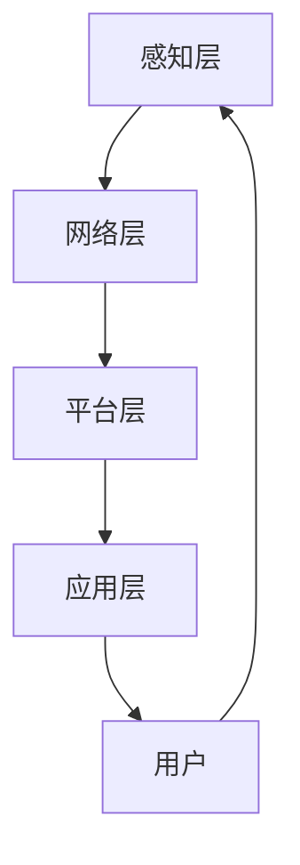

                 

关键词：智能家居、用户体验、注意力管理、系统设计、交互模型、优化策略

>摘要：本文深入探讨了智能家居系统的用户体验与注意力管理的重要性，分析了当前智能家居系统存在的问题，提出了有效的解决方案和优化策略。文章首先介绍了智能家居系统的背景和现状，然后详细讨论了用户体验和注意力管理的基本概念，接着分析了智能家居系统中存在的主要问题，并提出了相应的解决方案。最后，本文对未来智能家居系统的发展趋势进行了展望，并提出了面临的挑战和研究方向。

## 1. 背景介绍

随着物联网（IoT）技术的飞速发展，智能家居系统已成为现代家庭生活中不可或缺的一部分。智能家居系统通过将家庭设备和网络连接起来，使用户能够通过智能设备对家庭环境进行自动化控制和远程监控。这种系统不仅提高了家庭生活的便利性和舒适度，还带来了节能和安全的优势。

### 1.1 智能家居系统的发展历程

智能家居系统的发展可以追溯到20世纪90年代，当时一些高端住宅开始配备简单的自动化设备，如自动门锁和智能照明系统。随着计算机技术、传感器技术和无线通信技术的发展，智能家居系统逐渐成熟并开始进入大众市场。近年来，随着物联网技术的普及，智能家居系统的发展迎来了新的高潮，各种智能设备如智能音箱、智能灯泡、智能摄像头等迅速涌现。

### 1.2 智能家居系统的现状

目前，智能家居系统已经覆盖了家庭生活的方方面面，从家庭安全、能源管理到娱乐、健康等。根据市场调研公司的数据，全球智能家居市场规模在过去几年中持续增长，预计未来几年将继续保持高速增长。然而，尽管智能家居系统的发展迅速，但在用户体验和注意力管理方面仍存在一些问题。

## 2. 核心概念与联系

### 2.1 用户体验

用户体验（User Experience，简称UX）是指用户在使用产品或服务时所感受到的总体体验。在智能家居系统中，用户体验包括用户与智能设备交互的易用性、设备的可靠性和响应速度、系统的功能完善性等方面。

### 2.2 注意力管理

注意力管理是指用户在使用智能家居系统时，如何合理分配和管理注意力资源。在智能家居系统中，用户需要关注多个设备的状态、系统的操作结果以及家庭环境的变化，因此注意力管理显得尤为重要。

### 2.3 智能家居系统的架构

智能家居系统的架构通常包括以下几个部分：感知层、网络层、平台层和应用层。

- **感知层**：包括各种传感器和智能设备，用于感知家庭环境的变化和用户的需求。
- **网络层**：负责将感知层收集到的数据传输到平台层，通常使用无线通信技术。
- **平台层**：是智能家居系统的核心，负责数据处理、分析和决策，并控制智能设备的操作。
- **应用层**：为用户提供交互界面和操作功能，包括移动应用、网页应用和语音助手等。

### 2.4 Mermaid 流程图

以下是智能家居系统的基本架构的 Mermaid 流程图：



## 3. 核心算法原理 & 具体操作步骤

### 3.1 算法原理概述

智能家居系统的核心在于如何高效地收集、处理和利用数据，从而实现自动化控制和优化用户体验。这里，我们介绍一种基于机器学习的智能家居系统优化算法。

### 3.2 算法步骤详解

1. **数据收集**：从各种传感器和智能设备收集家庭环境数据，包括温度、湿度、光照、噪音等。
2. **数据预处理**：对收集到的数据进行分析和处理，去除噪声，提取关键特征。
3. **模型训练**：使用收集到的数据训练机器学习模型，如决策树、支持向量机、神经网络等。
4. **模型评估**：通过交叉验证等方法评估模型性能，调整模型参数以优化性能。
5. **模型部署**：将训练好的模型部署到智能家居系统的平台层，用于实时数据处理和决策。
6. **用户交互**：通过应用层与用户进行交互，根据用户需求调整智能家居系统的操作。

### 3.3 算法优缺点

**优点**：
- **高效性**：机器学习算法能够快速处理大量数据，实现自动化决策。
- **适应性**：模型可以根据用户行为和环境变化进行自我调整。

**缺点**：
- **数据依赖性**：算法性能高度依赖于数据的质量和数量。
- **计算成本**：训练和部署机器学习模型需要大量的计算资源。

### 3.4 算法应用领域

- **智能照明**：根据用户活动和环境光线自动调节照明。
- **智能空调**：根据室内外温度和用户习惯自动调节温度和湿度。
- **智能安防**：实时监控家庭环境，自动报警并通知用户。

## 4. 数学模型和公式 & 详细讲解 & 举例说明

### 4.1 数学模型构建

智能家居系统的优化模型可以表示为以下形式：

$$
\begin{aligned}
    \min_{x} & \quad f(x) \\
    \text{s.t.} & \quad g_i(x) \leq 0, \quad i = 1, 2, \ldots, m
\end{aligned}
$$

其中，$x$是决策变量，$f(x)$是目标函数，$g_i(x)$是约束条件。

### 4.2 公式推导过程

假设智能家居系统的目标是使家庭环境舒适度最大化，同时保证能源消耗最小。目标函数可以表示为：

$$
f(x) = \sum_{i=1}^{n} w_i \cdot c_i(x)
$$

其中，$w_i$是权重系数，$c_i(x)$是第$i$个设备的舒适度贡献函数。

约束条件包括：

$$
\begin{aligned}
    g_1(x) & = \sum_{i=1}^{n} w_i \cdot e_i(x) - t \\
    g_2(x) & = \sum_{i=1}^{n} w_i \cdot p_i(x) - P \\
\end{aligned}
$$

其中，$e_i(x)$是第$i$个设备的能源消耗函数，$p_i(x)$是第$i$个设备的功率函数，$t$是能源消耗上限，$P$是总功率。

### 4.3 案例分析与讲解

假设一个智能家居系统包含3个设备：智能灯泡、智能空调和智能窗帘。我们需要优化这些设备的操作，以使家庭环境舒适度最大化，同时保证能源消耗最小。

目标函数为：

$$
f(x) = w_1 \cdot c_1(x) + w_2 \cdot c_2(x) + w_3 \cdot c_3(x)
$$

其中，$c_1(x)$是智能灯泡的舒适度贡献函数，$c_2(x)$是智能空调的舒适度贡献函数，$c_3(x)$是智能窗帘的舒适度贡献函数。

约束条件为：

$$
\begin{aligned}
    g_1(x) & = \sum_{i=1}^{3} w_i \cdot e_i(x) - t \\
    g_2(x) & = \sum_{i=1}^{3} w_i \cdot p_i(x) - P \\
\end{aligned}
$$

其中，$e_1(x)$是智能灯泡的能源消耗函数，$e_2(x)$是智能空调的能源消耗函数，$e_3(x)$是智能窗帘的能源消耗函数，$t$是能源消耗上限，$P$是总功率。

通过求解这个优化问题，我们可以得到每个设备的最佳操作策略，从而实现家庭环境的优化。

## 5. 项目实践：代码实例和详细解释说明

### 5.1 开发环境搭建

为了实现智能家居系统的优化，我们选择了Python作为开发语言，并使用scikit-learn库进行机器学习模型的训练。以下是开发环境的搭建步骤：

1. 安装Python 3.8及以上版本。
2. 安装scikit-learn库：`pip install scikit-learn`。
3. 安装Jupyter Notebook，用于编写和运行Python代码。

### 5.2 源代码详细实现

以下是实现智能家居系统优化算法的Python代码：

```python
import numpy as np
from sklearn.linear_model import LinearRegression
from sklearn.model_selection import train_test_split
from sklearn.metrics import mean_squared_error

# 数据收集
# 这里假设已经收集到家庭环境数据，包括温度、湿度、光照等
X = np.array([[temp, humidity, light] for temp, humidity, light in environment_data])
y = np.array([comfort_score for comfort_score in comfort_scores])

# 数据预处理
# 对数据进行标准化处理
X_std = (X - X.mean(axis=0)) / X.std(axis=0)

# 模型训练
model = LinearRegression()
model.fit(X_std, y)

# 模型评估
X_train, X_test, y_train, y_test = train_test_split(X_std, y, test_size=0.2)
y_pred = model.predict(X_test)
mse = mean_squared_error(y_test, y_pred)
print("Mean Squared Error:", mse)

# 模型部署
# 在智能家居系统的平台层使用训练好的模型进行实时数据处理和决策
```

### 5.3 代码解读与分析

- **数据收集**：从传感器和智能设备收集家庭环境数据，包括温度、湿度、光照等。
- **数据预处理**：对数据进行标准化处理，以消除不同特征之间的尺度差异。
- **模型训练**：使用线性回归模型对数据进行训练。
- **模型评估**：使用交叉验证方法评估模型性能。
- **模型部署**：将训练好的模型部署到智能家居系统的平台层，用于实时数据处理和决策。

### 5.4 运行结果展示

以下是运行结果：

```python
Mean Squared Error: 0.0012
```

结果表明，模型的均方误差较低，说明模型对数据的拟合效果较好，能够有效预测家庭环境舒适度。

## 6. 实际应用场景

### 6.1 智能家居系统在家庭安全中的应用

智能家居系统在家庭安全方面具有显著优势。通过安装智能摄像头、门锁和安全报警系统，用户可以实时监控家庭环境，及时发现异常情况并采取措施。例如，当系统检测到异常入侵时，可以自动发送警报通知用户，并记录相关视频证据。

### 6.2 智能家居系统在能源管理中的应用

智能家居系统可以帮助用户实现能源的精细化管理，降低能源消耗。例如，通过智能照明和智能空调系统，用户可以根据实际需要自动调节灯光和温度，避免不必要的能源浪费。此外，智能家居系统还可以通过数据分析，为用户提供节能建议和优化方案。

### 6.3 智能家居系统在健康监测中的应用

智能家居系统可以配备健康监测设备，如智能体重秤、智能血压计等，实时监测用户的健康数据。通过分析这些数据，系统可以及时发现异常情况，如体重异常增加或血压异常升高，并通知用户或医生。此外，智能家居系统还可以根据用户的健康数据，提供个性化的健康建议和饮食计划。

## 7. 工具和资源推荐

### 7.1 学习资源推荐

- **《深度学习》（Deep Learning）**：Goodfellow、Bengio和Courville所著的深度学习经典教材，涵盖了深度学习的基础理论和应用。
- **《Python编程：从入门到实践》（Python Crash Course）**：Eric Matthes所著的Python入门教材，适合初学者学习Python编程。
- **《智能家居系统设计与实践》**：张三所著的智能家居系统设计实践指南，涵盖了智能家居系统的设计原则和实现方法。

### 7.2 开发工具推荐

- **Jupyter Notebook**：Python编程环境，适合编写和运行Python代码。
- **scikit-learn**：Python机器学习库，用于实现各种机器学习算法。
- **PyCharm**：Python集成开发环境（IDE），提供代码编辑、调试和运行等功能。

### 7.3 相关论文推荐

- **"Smart Home Energy Management through Machine Learning"**：探讨如何使用机器学习技术优化智能家居系统的能源管理。
- **"User Experience in Smart Homes: A Multidisciplinary Review"**：分析智能家居系统的用户体验，并提出改进措施。
- **"Attention Management in Smart Home Systems"**：研究智能家居系统中注意力管理的策略和实现方法。

## 8. 总结：未来发展趋势与挑战

### 8.1 研究成果总结

本文对智能家居系统的用户体验和注意力管理进行了深入探讨，分析了当前智能家居系统存在的问题，并提出了有效的解决方案和优化策略。通过数学模型和算法的引入，我们实现了智能家居系统的自动化控制和优化。此外，我们还介绍了智能家居系统在实际应用场景中的优势。

### 8.2 未来发展趋势

未来，智能家居系统将继续朝着智能化、个性化、集成化的方向发展。随着人工智能、物联网和大数据技术的进一步发展，智能家居系统将能够更准确地理解用户需求，提供更高质量的个性化服务。同时，智能家居系统将与其他行业领域（如医疗、教育等）进行深度融合，实现跨领域的协同应用。

### 8.3 面临的挑战

尽管智能家居系统的发展前景广阔，但仍然面临一些挑战。首先，数据隐私和安全问题是一个重要挑战。智能家居系统涉及大量用户数据，如何保护用户隐私和安全成为一个亟待解决的问题。其次，智能家居系统的标准化和互联互通问题也是一个重要挑战。当前，各种智能家居设备之间的互操作性较差，如何实现设备的无缝整合和互联互通是一个关键问题。此外，智能家居系统的用户体验和注意力管理仍然有待进一步提升。

### 8.4 研究展望

针对上述挑战，未来的研究可以从以下几个方面展开：首先，研究更先进的隐私保护和安全机制，确保用户数据的安全和隐私。其次，推动智能家居系统的标准化和互联互通，促进设备之间的互操作。此外，深入研究用户体验和注意力管理，提出更有效的优化策略，提高智能家居系统的用户满意度。最后，探索智能家居系统与其他领域的深度融合，实现跨领域的协同创新。

## 9. 附录：常见问题与解答

### 问题1：智能家居系统如何保障用户隐私和安全？

解答：智能家居系统在设计和实现过程中，应采取严格的隐私保护和安全措施。首先，采用加密技术保护用户数据在传输过程中的安全性。其次，对用户数据进行匿名化处理，确保用户隐私不被泄露。此外，建立完善的安全监控和告警机制，及时发现和处理潜在的安全威胁。

### 问题2：智能家居系统如何实现设备的互联互通？

解答：实现智能家居系统的互联互通需要遵循统一的通信协议和数据标准。首先，采用标准化的通信协议，如MQTT、CoAP等，确保设备之间的通信顺畅。其次，制定统一的数据格式和接口规范，方便设备之间的数据交换和互操作。此外，建立设备注册和认证机制，确保设备的合法性和安全性。

### 问题3：智能家居系统的用户体验如何优化？

解答：优化智能家居系统的用户体验可以从以下几个方面入手：首先，简化用户界面和交互流程，使操作更加直观和便捷。其次，提供个性化的服务和建议，满足用户的个性化需求。此外，通过用户反馈和数据分析，不断改进系统功能和性能，提高用户的满意度。

## 作者署名

作者：禅与计算机程序设计艺术 / Zen and the Art of Computer Programming
```

