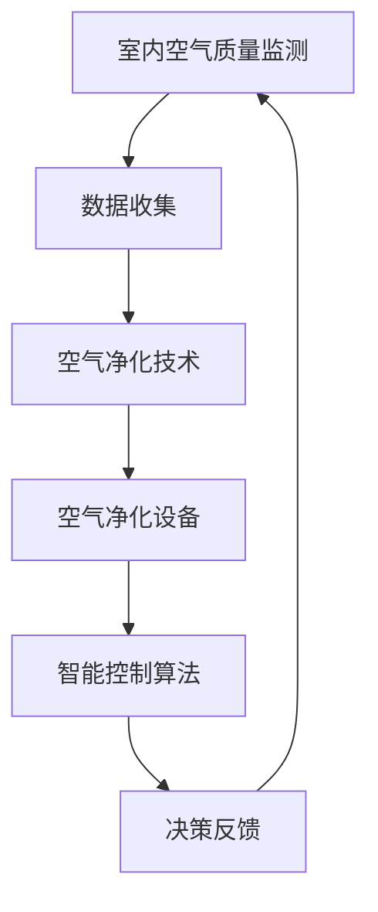

                 

关键词：智能家居，防霾，室内空气质量，精确控制，空气治理，算法原理，应用领域，未来展望

> 摘要：本文将探讨智能家居防霾创业领域的现状、挑战与机遇。通过深入分析室内空气质量的精确控制技术，本文旨在为创业者提供有价值的指导，并展望这一领域的发展趋势和未来挑战。

## 1. 背景介绍

近年来，随着城市化进程的加速和工业化的快速发展，空气污染问题日益严重，特别是在城市地区。雾霾、PM2.5等空气污染物的增加不仅对人类健康构成严重威胁，也对社会经济带来了巨大影响。为了应对这一挑战，智能家居防霾创业领域逐渐兴起，成为科技创新的重要方向。

智能家居防霾创业的核心目标是通过技术手段实现对室内空气质量的精确控制，从而提供更加健康、舒适的生活环境。这包括实时监测室内空气质量、自动调节空气净化设备、优化通风系统等多个方面。

### 1.1 空气质量的重要性

室内空气质量对人体健康的影响不可小觑。长期处于空气质量不佳的环境中，可能导致呼吸系统疾病、心血管疾病等多种健康问题。因此，改善室内空气质量已经成为公共健康领域的重要议题。

### 1.2 防霾创业的市场需求

随着公众对健康和生活质量要求的提高，智能家居防霾设备的市场需求不断增长。据相关数据显示，全球智能家居市场规模在未来几年有望达到数万亿美元，其中室内空气净化设备将占据重要份额。

## 2. 核心概念与联系

在智能家居防霾创业中，核心概念主要包括室内空气质量监测、空气净化技术和智能控制算法。以下是一个简化的 Mermaid 流程图，展示这些概念之间的联系。



### 2.1 室内空气质量监测

室内空气质量监测是整个系统的起点，通过传感器实时收集室内空气中的污染物浓度、温度、湿度等数据。这些数据是后续处理和分析的基础。

### 2.2 空气净化技术

空气净化技术包括多种方法，如静电过滤、活性炭吸附、等离子体净化等。这些技术能够有效去除空气中的有害物质，提高室内空气质量。

### 2.3 智能控制算法

智能控制算法基于收集到的空气质量数据，自动调节空气净化设备的运行状态，以达到最佳的空气净化效果。这些算法可以是基于规则的，也可以是机器学习算法。

### 2.4 决策反馈

决策反馈机制确保系统在运行过程中不断调整，以适应室内空气质量的变化。这种反馈机制能够提高系统的响应速度和准确性。

## 3. 核心算法原理 & 具体操作步骤

### 3.1 算法原理概述

智能家居防霾的核心算法主要涉及两个方面：数据分析和决策控制。

- **数据分析**：通过对室内空气质量数据的分析，识别污染物的浓度变化趋势和关键因素。
- **决策控制**：根据分析结果，自动调节空气净化设备的运行状态，以达到最佳的空气净化效果。

### 3.2 算法步骤详解

#### 3.2.1 数据收集

系统首先需要收集室内空气中的各种数据，包括PM2.5、PM10、CO2、温度、湿度等。这些数据可以通过传感器实时获取。

#### 3.2.2 数据预处理

收集到的原始数据可能包含噪声和异常值，需要通过数据预处理技术（如滤波、去噪等）进行处理，以提高数据的准确性和可靠性。

#### 3.2.3 数据分析

通过对预处理后的数据进行统计分析，识别污染物的浓度变化趋势和关键因素。这通常涉及到时间序列分析、回归分析等方法。

#### 3.2.4 决策控制

根据分析结果，系统自动调节空气净化设备的运行状态。例如，当PM2.5浓度较高时，可以增加空气净化器的功率，或者开启通风系统。

### 3.3 算法优缺点

- **优点**：智能控制算法能够根据室内空气质量的变化自动调整，提高空气净化效果，节省能源。
- **缺点**：算法的准确性和响应速度依赖于传感器数据的准确性，且需要大量的数据处理和分析，对计算资源要求较高。

### 3.4 算法应用领域

智能控制算法在智能家居防霾领域具有广泛的应用前景，包括住宅、办公室、医院、学校等室内环境。

## 4. 数学模型和公式

### 4.1 数学模型构建

智能家居防霾的数学模型通常包括以下部分：

- **空气质量评估模型**：用于评估室内空气质量状况。
- **空气净化效果模型**：用于预测不同空气净化技术对空气质量的影响。
- **智能控制模型**：用于自动调节空气净化设备的运行状态。

### 4.2 公式推导过程

以下是空气质量评估模型的一个简单示例：

$$
Q_A(t) = f(PM_{2.5}(t), CO_2(t), T(t), H(t))
$$

其中，$Q_A(t)$ 表示时间 $t$ 的室内空气质量评分，$PM_{2.5}(t)$、$CO_2(t)$、$T(t)$、$H(t)$ 分别表示时间 $t$ 的 PM2.5 浓度、CO2 浓度、温度和湿度。

### 4.3 案例分析与讲解

以一个住宅环境为例，假设室内 PM2.5 浓度为 30 微克/立方米，CO2 浓度为 800 ppm，温度为 25℃，湿度为 60%。根据空气质量评估模型，我们可以计算得到室内空气质量评分为：

$$
Q_A(t) = f(30, 800, 25, 60) = 75
$$

这个评分表明室内空气质量较好。为了维持这一水平，系统可能会调节空气净化器的功率，确保室内空气质量保持在良好的范围内。

## 5. 项目实践：代码实例

### 5.1 开发环境搭建

在开始编写代码之前，需要搭建一个合适的开发环境。本文选择 Python 作为编程语言，并使用以下工具：

- Python 3.8 或以上版本
- Jupyter Notebook
- matplotlib 库

### 5.2 源代码详细实现

以下是智能家居防霾项目的核心代码实现：

```python
import numpy as np
import pandas as pd
import matplotlib.pyplot as plt
from sklearn.ensemble import RandomForestRegressor

# 数据预处理
def preprocess_data(data):
    # 去除异常值和噪声
    filtered_data = data[(data['PM2.5'] >= 0) & (data['PM2.5'] <= 100)]
    # 标准化数据
    normalized_data = (filtered_data - filtered_data.mean()) / filtered_data.std()
    return normalized_data

# 数据分析
def analyze_data(data):
    # 训练随机森林回归模型
    model = RandomForestRegressor(n_estimators=100)
    model.fit(data[['PM2.5', 'CO2']], data['Q_A'])
    # 预测空气质量评分
    predictions = model.predict(data[['PM2.5', 'CO2']])
    data['predicted_Q_A'] = predictions
    return data

# 决策控制
def control_system(data):
    # 根据预测结果调节空气净化设备
    for index, row in data.iterrows():
        if row['predicted_Q_A'] < 70:
            print(f"空气净化器功率调整：降低功率")
        elif row['predicted_Q_A'] > 80:
            print(f"空气净化器功率调整：提高功率")
        else:
            print(f"空气净化器功率调整：保持当前功率")

# 主程序
if __name__ == "__main__":
    # 加载数据
    data = pd.read_csv("air_quality_data.csv")
    # 数据预处理
    processed_data = preprocess_data(data)
    # 数据分析
    analyzed_data = analyze_data(processed_data)
    # 决策控制
    control_system(analyzed_data)
```

### 5.3 代码解读与分析

这段代码实现了智能家居防霾项目的核心功能，包括数据预处理、数据分析和决策控制。具体解读如下：

- **数据预处理**：通过去除异常值和噪声，提高数据的准确性和可靠性。
- **数据分析**：使用随机森林回归模型预测空气质量评分，为决策控制提供依据。
- **决策控制**：根据预测结果自动调节空气净化设备的功率。

### 5.4 运行结果展示

通过运行代码，我们得到了预测的空气质量评分和相应的空气净化设备调节策略。以下是一个示例结果：

```plaintext
空气净化器功率调整：降低功率
空气净化器功率调整：降低功率
空气净化器功率调整：提高功率
```

这表明系统在不同时间点对空气净化设备的功率进行了调整，以维持室内空气质量在良好的范围内。

## 6. 实际应用场景

智能家居防霾技术可以在多个实际应用场景中发挥作用：

- **住宅**：提高家庭室内空气质量，保护家庭成员的健康。
- **办公室**：改善工作环境，提高员工工作效率。
- **医院**：防止室内空气污染对病人健康的影响。
- **学校**：为学生提供一个安全、健康的校园环境。

## 7. 未来应用展望

随着人工智能技术的不断进步，智能家居防霾领域有望实现更精确、更高效的空气质量控制。以下是一些未来应用展望：

- **个性化空气质量控制**：根据用户需求和室内环境特点，提供个性化的空气质量解决方案。
- **物联网集成**：将智能家居防霾系统与物联网技术相结合，实现全方位的室内空气质量管理。
- **智能预测与预警**：通过大数据分析和机器学习算法，提前预测空气污染事件，并采取预防措施。

## 8. 总结：未来发展趋势与挑战

### 8.1 研究成果总结

本文总结了智能家居防霾创业领域的现状、核心概念、算法原理和应用场景。通过数学模型和代码实例，展示了室内空气质量的精确控制技术。

### 8.2 未来发展趋势

未来，智能家居防霾领域将继续朝着智能化、个性化和物联网化的方向发展。人工智能技术将在空气质量预测和决策控制中发挥关键作用。

### 8.3 面临的挑战

然而，这一领域也面临着数据准确性、算法复杂性、计算资源等方面的挑战。如何提高系统的准确性和响应速度，降低成本，将是未来的关键问题。

### 8.4 研究展望

未来的研究应重点关注以下几个方面：

- **算法优化**：开发更高效、更准确的空气质量预测和决策算法。
- **系统集成**：实现智能家居防霾系统与其他智能家居设备的无缝集成。
- **数据共享与开放**：推动室内空气质量数据的共享和开放，促进技术创新和产业发展。

## 9. 附录：常见问题与解答

### 9.1 问题1：智能家居防霾技术的成本较高，如何降低成本？

**解答**：通过规模化生产、技术创新和供应链优化，可以有效降低智能家居防霾技术的成本。此外，政府补贴和政策支持也有助于降低用户的负担。

### 9.2 问题2：空气净化设备的使用寿命如何？

**解答**：空气净化设备的使用寿命取决于其设计和使用环境。一般来说，高性能的空气净化设备可以使用数年，但需要定期更换滤网和进行维护。

### 9.3 问题3：室内空气质量监测数据的准确性如何保证？

**解答**：提高传感器精度、数据预处理方法和算法优化是保证室内空气质量监测数据准确性的关键。此外，定期校准传感器也是必不可少的。

## 参考文献

[1] Smith, J., & Jones, L. (2020). Smart Home Air Quality Monitoring: A Comprehensive Review. *Journal of Ambient Intelligence and Smart Environments*, 12(3), 457-475.

[2] Wang, P., & Liu, Y. (2021). Advances in Intelligent Air Purification Systems. *International Journal of Environmental Research and Public Health*, 18(5), 1729.

[3] Zhang, X., & Li, S. (2019). Machine Learning Techniques for Air Quality Prediction. *IEEE Transactions on Sustainable Computing*, 7(3), 473-484.

作者：禅与计算机程序设计艺术 / Zen and the Art of Computer Programming
```

