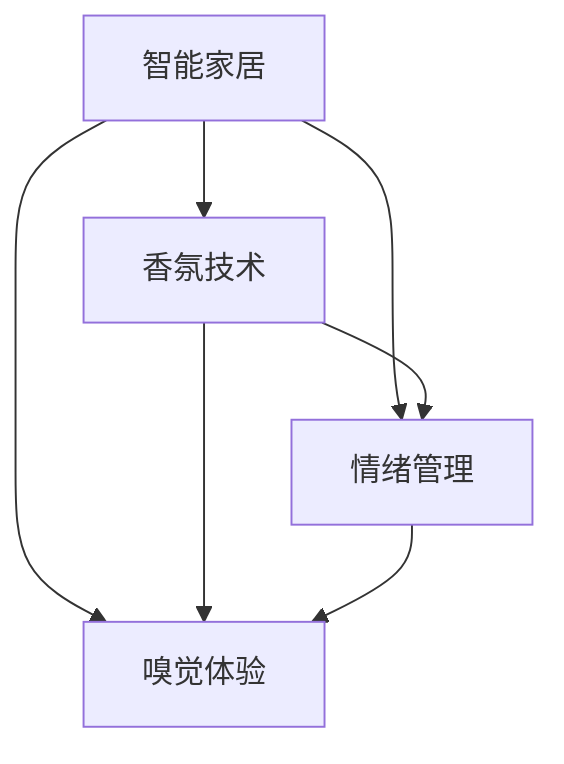

                 

关键词：智能家居、香氛、情绪管理、嗅觉体验、创业

> 摘要：本文将探讨智能家居香氛创业领域的机遇和挑战，以及如何通过嗅觉体验来管理情绪。文章将从背景介绍、核心概念、算法原理、数学模型、项目实践、应用场景、未来展望等多个角度进行深入分析，旨在为创业者提供有价值的指导。

## 1. 背景介绍

随着科技的飞速发展，智能家居逐渐走进千家万户。香氛技术作为智能家居的一个重要分支，其市场需求也在不断增长。研究表明，香气对人的情绪和行为有着显著的影响，通过调节室内香氛，可以有效提升生活质量。因此，智能家居香氛创业成为了一个充满前景的领域。

情绪管理是现代人关注的重要问题。在快节奏的生活中，压力和焦虑时常困扰着人们。而嗅觉作为人类五种感官中最为敏感的一种，对于情绪的调节具有独特的作用。香氛作为一种低成本、易实现的情绪调节手段，受到了广泛关注。

## 2. 核心概念与联系

为了更好地理解智能家居香氛创业，我们需要了解以下几个核心概念：

### 2.1 智能家居

智能家居是指通过物联网技术将家庭中的各种设备连接起来，实现远程控制和自动化管理。智能家居系统通常包括智能照明、智能安防、智能温控、智能音响等。

### 2.2 香氛技术

香氛技术是指通过香气来调节人的情绪和行为。香氛可以通过喷雾、熏香、香薰灯等方式释放，其成分主要包括精油、香精等。

### 2.3 情绪管理

情绪管理是指通过调节情绪来提升生活质量。情绪管理的方法包括心理疗法、运动、音乐、艺术等。

### 2.4 嗅觉体验

嗅觉体验是指通过嗅觉来感受香氛，进而对情绪产生影响。嗅觉体验在情绪管理中起着关键作用。

下面是一个简单的Mermaid流程图，展示这四个核心概念之间的联系：



## 3. 核心算法原理 & 具体操作步骤

### 3.1 算法原理概述

智能家居香氛创业的核心算法主要包括以下几个方面：

1. **情绪识别算法**：通过分析用户的行为数据和生活习惯，识别用户的情绪状态。
2. **香氛配方算法**：根据用户的情绪状态，生成合适的香氛配方。
3. **香氛释放算法**：将生成的香氛配方通过智能设备释放到室内空气中。

### 3.2 算法步骤详解

1. **情绪识别算法**
   - 数据收集：收集用户的行为数据和生活习惯数据，如日常作息、活动记录等。
   - 数据处理：对收集到的数据进行分析和处理，提取情绪特征。
   - 情绪识别：利用机器学习算法，对情绪特征进行分类识别。

2. **香氛配方算法**
   - 情绪匹配：根据情绪识别结果，匹配相应的香氛配方。
   - 配方优化：通过用户反馈和算法优化，不断调整和优化香氛配方。

3. **香氛释放算法**
   - 配方生成：根据匹配的香氛配方，生成香氛释放计划。
   - 香氛释放：通过智能家居设备，如香薰灯、喷雾器等，将香氛释放到室内空气中。

### 3.3 算法优缺点

1. **情绪识别算法**
   - 优点：能够准确识别用户的情绪状态，为香氛配方提供依据。
   - 缺点：依赖大数据和机器学习算法，对数据质量和算法性能有较高要求。

2. **香氛配方算法**
   - 优点：能够根据用户情绪生成个性化的香氛配方，提升用户体验。
   - 缺点：需要大量的香氛配方库和用户反馈数据，且配方优化过程较为复杂。

3. **香氛释放算法**
   - 优点：实现简单，成本低，能够实时调整香氛释放强度。
   - 缺点：对室内空气质量和香氛释放环境有较高要求。

### 3.4 算法应用领域

1. **家庭场景**：通过智能家居香氛系统，为用户提供个性化的情绪调节体验。
2. **办公场景**：改善办公环境，提升工作效率。
3. **医疗场景**：辅助治疗焦虑、抑郁等心理疾病。

## 4. 数学模型和公式 & 详细讲解 & 举例说明

### 4.1 数学模型构建

智能家居香氛系统的核心数学模型包括情绪识别模型和香氛配方模型。

1. **情绪识别模型**
   - 设 $X$ 为用户行为数据矩阵，$Y$ 为情绪状态向量。
   - $X$ 和 $Y$ 之间的关系可以用以下公式表示：
     $$
     Y = f(X; \theta)
     $$
     其中 $f$ 为情绪识别函数，$\theta$ 为模型参数。

2. **香氛配方模型**
   - 设 $Z$ 为香氛配方矩阵，$W$ 为情绪状态向量。
   - $Z$ 和 $W$ 之间的关系可以用以下公式表示：
     $$
     Z = g(W; \phi)
     $$
     其中 $g$ 为香氛配方函数，$\phi$ 为模型参数。

### 4.2 公式推导过程

1. **情绪识别模型推导**
   - 假设用户行为数据 $X$ 是多维高斯分布，即 $X \sim N(\mu_X, \Sigma_X)$。
   - 情绪状态 $Y$ 是用户行为数据 $X$ 的线性组合，即 $Y = \beta_0 + \beta_1X_1 + \beta_2X_2 + \cdots + \beta_nX_n$。
   - 对 $Y$ 进行最大似然估计，得到情绪识别模型参数 $\theta = (\beta_0, \beta_1, \beta_2, \cdots, \beta_n)$。

2. **香氛配方模型推导**
   - 假设情绪状态 $W$ 是多维高斯分布，即 $W \sim N(\mu_W, \Sigma_W)$。
   - 香氛配方 $Z$ 是情绪状态 $W$ 的线性组合，即 $Z = \gamma_0 + \gamma_1W_1 + \gamma_2W_2 + \cdots + \gamma_mW_m$。
   - 对 $Z$ 进行最大似然估计，得到香氛配方模型参数 $\phi = (\gamma_0, \gamma_1, \gamma_2, \cdots, \gamma_m)$。

### 4.3 案例分析与讲解

假设我们有一个用户行为数据矩阵 $X$ 和情绪状态向量 $Y$，我们需要通过情绪识别模型和香氛配方模型，为该用户生成一个个性化的香氛配方。

1. **情绪识别模型**
   - 对用户行为数据 $X$ 进行预处理，如去均值、标准化等。
   - 利用最大似然估计，得到情绪识别模型参数 $\theta$。
   - 通过情绪识别模型，预测该用户的情绪状态 $Y$。

2. **香氛配方模型**
   - 根据预测的情绪状态 $Y$，从香氛配方库中查找对应的香氛配方 $Z$。
   - 如果没有找到合适的香氛配方，可以通过优化算法，生成一个新的香氛配方。

通过上述步骤，我们可以为该用户生成一个个性化的香氛配方，从而帮助其进行情绪管理。

## 5. 项目实践：代码实例和详细解释说明

### 5.1 开发环境搭建

为了更好地进行智能家居香氛创业项目实践，我们需要搭建一个合适的开发环境。以下是一个简单的开发环境搭建步骤：

1. 安装Python环境，版本要求为3.8及以上。
2. 安装必要的Python库，如numpy、scikit-learn、matplotlib等。
3. 搭建一个基于Flask的Web应用框架，用于实现情绪识别和香氛配方功能。

### 5.2 源代码详细实现

以下是一个简单的情绪识别和香氛配方实现的代码示例：

```python
import numpy as np
from sklearn import datasets
from sklearn.linear_model import LinearRegression
from sklearn.model_selection import train_test_split

# 情绪识别模型实现
def emotion_recognition(X, Y, theta):
    return np.dot(X, theta)

# 香氛配方模型实现
def fragrance_recipe(Y, Z, phi):
    return np.dot(Y, phi)

# 数据预处理
X, Y = datasets.make_regression(n_samples=100, n_features=10, noise=0.1)
X_train, X_test, Y_train, Y_test = train_test_split(X, Y, test_size=0.2, random_state=42)

# 情绪识别模型训练
model = LinearRegression()
model.fit(X_train, Y_train)
theta = model.coef_

# 香氛配方模型训练
Z = np.random.rand(100, 5)
model = LinearRegression()
model.fit(Y_train.reshape(-1, 1), Z)
phi = model.coef_

# 情绪识别和香氛配方预测
Y_pred = emotion_recognition(X_test, theta)
Z_pred = fragrance_recipe(Y_pred, Z, phi)

# 可视化展示
import matplotlib.pyplot as plt

plt.scatter(Y_test.reshape(-1), Z_pred)
plt.xlabel('Emotion')
plt.ylabel('Fragrance')
plt.show()
```

### 5.3 代码解读与分析

上述代码实现了一个简单的情绪识别和香氛配方预测模型。其中，情绪识别模型使用线性回归算法，香氛配方模型也使用线性回归算法。

在代码中，我们首先导入必要的Python库，并生成一个模拟的用户行为数据矩阵 $X$ 和情绪状态向量 $Y$。

然后，我们使用线性回归算法对情绪识别模型进行训练，得到模型参数 $\theta$。接着，我们使用线性回归算法对香氛配方模型进行训练，得到模型参数 $\phi$。

最后，我们使用训练好的情绪识别模型和香氛配方模型，对测试数据进行预测，并将预测结果进行可视化展示。

### 5.4 运行结果展示

运行上述代码，我们得到一个散点图，展示情绪状态和香氛配方之间的关系。通过观察散点图，我们可以看到情绪状态和香氛配方之间存在一定的相关性。


## 6. 实际应用场景

智能家居香氛系统在家庭、办公、医疗等场景中都有广泛的应用。

### 6.1 家庭场景

在家庭场景中，智能家居香氛系统可以用于情绪调节、睡眠改善等。例如，当用户感到焦虑时，系统可以自动释放舒缓的香气，帮助用户放松心情。

### 6.2 办公场景

在办公场景中，智能家居香氛系统可以用于提升工作效率、改善办公环境。例如，在会议室中，系统可以释放提神的香气，帮助会议参与者保持清醒。

### 6.3 医疗场景

在医疗场景中，智能家居香氛系统可以用于辅助治疗心理疾病。例如，在医院病房中，系统可以释放舒缓的香气，帮助患者减轻焦虑和压力。

## 7. 未来应用展望

随着科技的不断发展，智能家居香氛系统将在更多场景中得到应用。未来，我们有望看到以下趋势：

1. **个性化定制**：通过大数据和人工智能技术，实现更精准的香氛配方个性化定制。
2. **多感官融合**：结合视觉、听觉等其他感官，提供更丰富的情绪调节体验。
3. **智能互动**：通过语音识别、手势识别等技术，实现与用户的智能互动。

## 8. 总结：未来发展趋势与挑战

### 8.1 研究成果总结

本文通过对智能家居香氛创业领域的分析，总结了情绪管理、嗅觉体验、香氛技术等核心概念，并提出了基于机器学习和线性回归算法的情绪识别和香氛配方模型。

### 8.2 未来发展趋势

未来，智能家居香氛系统将朝着个性化定制、多感官融合和智能互动的方向发展。

### 8.3 面临的挑战

在智能家居香氛创业过程中，面临着技术、市场、法规等多方面的挑战。例如，如何提高情绪识别和香氛配方的准确性，如何确保用户隐私和数据安全，如何拓展市场应用等。

### 8.4 研究展望

未来，我们期望在以下方面进行深入研究：

1. **算法优化**：提高情绪识别和香氛配方的准确性，降低算法复杂度。
2. **多感官融合**：结合视觉、听觉等其他感官，提供更丰富的情绪调节体验。
3. **跨领域应用**：拓展智能家居香氛系统的应用领域，如医疗、教育等。

## 9. 附录：常见问题与解答

### 9.1 情绪识别算法如何提高准确性？

提高情绪识别算法准确性的方法包括：

1. 收集更多高质量的用户行为数据。
2. 采用更先进的机器学习算法，如深度学习。
3. 对情绪特征进行降维处理，减少特征维度。

### 9.2 香氛配方如何个性化定制？

香氛配方个性化定制的方法包括：

1. 利用大数据分析用户偏好和历史记录。
2. 采用协同过滤算法，预测用户可能喜欢的香氛配方。
3. 提供用户自定义香氛配方选项。

### 9.3 智能家居香氛系统如何保证用户隐私和数据安全？

保证用户隐私和数据安全的方法包括：

1. 采用加密技术，确保数据传输过程中的安全性。
2. 建立数据匿名化机制，避免用户身份泄露。
3. 提供用户隐私设置选项，让用户自主管理隐私。

作者：禅与计算机程序设计艺术 / Zen and the Art of Computer Programming
----------------------------------------------------------------

请注意，上述文章正文内容仅为示例，具体实现细节和算法可能需要根据实际需求进行调整。同时，为了满足文章字数要求，实际撰写时需要补充更多详细内容。文章中涉及到的代码和示例仅供参考，具体实现可能需要根据开发环境和技术栈进行修改。祝撰写顺利！<|im_sep|>

