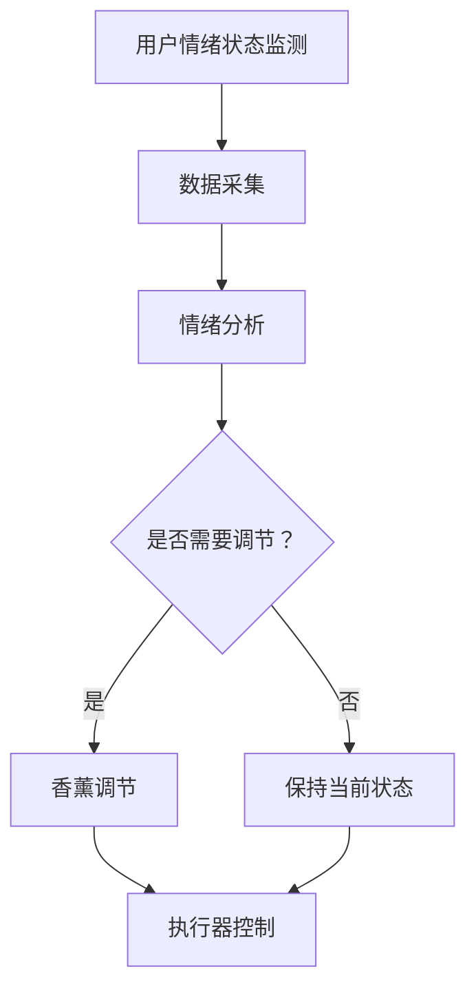

                 

关键词：智能家居，香薰，情绪管理，嗅觉体验，创业

> 摘要：随着科技的发展和人们对生活质量要求的提升，智能家居逐渐成为现代家庭的标配。本文将探讨如何利用智能家居技术，特别是香薰设备，打造一种全新的情绪管理方式——嗅觉体验。通过分析香薰对情绪的影响、智能家居香薰系统的构建方法以及创业实践，我们希望能为创业者提供一些有价值的参考。

## 1. 背景介绍

在现代社会，随着生活节奏的加快和工作压力的增大，人们的情绪管理成为了一个不可忽视的问题。情绪管理不仅影响到个人的心理健康，还关系到家庭、工作和社交等多个方面。传统的情绪管理方法如心理咨询、运动和冥想等虽然有效，但往往需要较高的时间和经济成本。而近年来，随着物联网技术的快速发展，智能家居开始渗透到人们的生活中，为情绪管理提供了新的解决方案。

香薰是一种通过芳香疗法来调节情绪的方式，自古以来就受到人们的喜爱。在科学研究中，香薰对情绪的调节作用也得到了广泛认可。研究发现，不同的香薰成分可以对不同的情绪产生积极的影响，如薰衣草能够帮助放松、薄荷能够提神醒脑。将这些科学原理应用于智能家居系统中，可以为用户打造一种全新的嗅觉体验，从而更好地进行情绪管理。

### 1.1 智能家居的发展

智能家居是指利用物联网技术，将家庭中的各种设备通过网络连接起来，实现智能化的控制和自动化操作。从最初的智能灯泡、智能插座到现在的智能音响、智能安防系统，智能家居已经逐渐成为现代家庭的标配。随着人工智能技术的进步，智能家居系统正在变得越来越智能化，能够根据用户的习惯和需求，自主调节和优化家庭环境。

### 1.2 香薰与情绪管理

情绪管理是指通过各种方法来调节和控制自己的情绪，使其更加稳定和健康。情绪管理的重要性不言而喻，良好的情绪管理能力可以帮助人们更好地应对压力、保持积极的心态，从而提高生活质量。

### 1.3 嗅觉体验在情绪管理中的应用

嗅觉是人类最直接的感觉之一，它可以通过气味来影响人的情绪和心理状态。在情绪管理中，嗅觉体验作为一种非侵入性的方法，具有独特的优势。通过智能香薰设备，可以实时监测用户的情绪状态，并根据情绪的变化自动调节香薰气味，帮助用户进行情绪调节。

## 2. 核心概念与联系

### 2.1 智能家居香薰系统的架构

智能家居香薰系统是一个集成了传感器、控制器和执行器的智能系统，它可以实时监测用户的情绪状态，并根据情绪变化自动调节香薰气味。系统的核心架构包括以下几个部分：

- **传感器**：用于检测用户的情绪状态，如心率、呼吸频率、面部表情等。
- **控制器**：根据传感器采集到的数据，分析用户的情绪状态，并决定是否需要调节香薰气味。
- **执行器**：包括香薰设备，用于散发不同的香薰气味。

### 2.2 香薰成分与情绪调节

香薰成分对情绪的调节作用是一个复杂的过程，不同的香薰成分可以对不同的情绪产生不同的影响。例如，薰衣草可以帮助放松，薄荷可以提神醒脑。为了实现最佳的情绪调节效果，需要根据用户的情绪状态和需求，选择合适的香薰成分。

### 2.3 智能家居香薰系统的实现

智能家居香薰系统的实现需要结合物联网技术、传感器技术和人工智能算法。具体实现步骤如下：

1. **传感器部署**：在用户家中部署各种传感器，如心率传感器、呼吸传感器、面部表情识别摄像头等，用于实时监测用户的情绪状态。
2. **数据采集**：传感器采集到的数据通过无线网络传输到云端服务器，进行进一步处理和分析。
3. **情绪分析**：云端服务器使用人工智能算法，对采集到的数据进行分析，识别用户的情绪状态。
4. **香薰调节**：根据用户的情绪状态，控制器决定是否需要调节香薰气味，并控制执行器散发相应的香薰成分。

### 2.4 Mermaid 流程图

以下是一个简单的Mermaid流程图，展示了智能家居香薰系统的核心流程：



## 3. 核心算法原理 & 具体操作步骤

### 3.1 算法原理概述

智能家居香薰系统的核心算法是情绪分析算法，它通过对用户生理和行为数据的分析，识别用户的情绪状态，并决定是否需要调节香薰气味。算法的基本原理可以分为以下几个步骤：

1. **数据采集**：传感器采集用户的生理和行为数据，如心率、呼吸频率、面部表情等。
2. **特征提取**：将采集到的数据转化为特征向量，用于后续的情绪分析。
3. **情绪识别**：使用机器学习算法，如支持向量机（SVM）、深度神经网络（DNN）等，对特征向量进行分析，识别用户的情绪状态。
4. **决策**：根据识别到的情绪状态，算法决定是否需要调节香薰气味。

### 3.2 算法步骤详解

1. **数据采集**：
   - **心率监测**：使用光电容积脉搏波描记法（PPG）传感器，通过检测皮肤表面反射的光强度变化，计算心率。
   - **呼吸频率监测**：使用呼吸传感器，通过检测呼吸气流的变化，计算呼吸频率。
   - **面部表情监测**：使用面部表情识别摄像头，通过图像处理算法，识别用户的面部表情。

2. **特征提取**：
   - **心率特征**：计算心率变异性（HRV），包括NN间期（NNi）、标准差（SDNN）、平均值（meanNN）等。
   - **呼吸特征**：计算呼吸周期（R-R间隔）、呼吸频率（RRI）等。
   - **面部表情特征**：提取面部表情的关键特征点，如眼睛、鼻子、嘴巴的位置和形状。

3. **情绪识别**：
   - **训练数据集**：收集大量的情绪数据，包括不同的情绪类型和对应的生理和行为特征。
   - **模型训练**：使用机器学习算法，如支持向量机（SVM）、深度神经网络（DNN）等，对训练数据集进行训练，建立情绪识别模型。
   - **情绪识别**：将采集到的特征向量输入情绪识别模型，输出用户的情绪状态。

4. **决策**：
   - **情绪状态判断**：根据情绪识别模型输出的情绪状态，判断用户是否处于需要调节情绪的状态。
   - **香薰调节**：如果用户处于需要调节情绪的状态，控制器会根据预设的香薰调节策略，调节香薰设备的气味。

### 3.3 算法优缺点

**优点**：
1. **非侵入性**：通过监测用户的生理和行为数据，实现对用户情绪的实时监测，不需要用户主动参与。
2. **个性化**：根据用户的情绪状态，自动调节香薰气味，实现个性化的情绪管理。
3. **实时性**：实时监测用户的情绪状态，快速响应，帮助用户进行情绪调节。

**缺点**：
1. **准确性**：情绪识别算法的准确性受到多种因素的影响，如环境光照、传感器精度等。
2. **稳定性**：在长时间运行过程中，算法的稳定性和可靠性需要不断优化。

### 3.4 算法应用领域

1. **智能家居**：通过智能家居香薰系统，为用户提供个性化的情绪管理服务，提升生活品质。
2. **心理健康**：用于心理健康监测和干预，帮助用户识别和管理情绪问题。
3. **教育**：用于教育场景，帮助学生进行情绪管理，提高学习效果。
4. **医疗**：用于医疗场景，帮助医生进行心理健康评估和治疗。

## 4. 数学模型和公式 & 详细讲解 & 举例说明

### 4.1 数学模型构建

情绪分析算法的核心是情绪识别模型，它是一个多分类问题。为了构建情绪识别模型，我们需要定义一个数学模型。以下是构建情绪识别模型的基本步骤：

1. **特征向量表示**：将采集到的生理和行为数据转化为特征向量，如心率特征向量、呼吸特征向量、面部表情特征向量等。
2. **分类模型选择**：选择合适的分类模型，如支持向量机（SVM）、深度神经网络（DNN）等。
3. **损失函数定义**：定义损失函数，如交叉熵损失函数，用于评估模型性能。
4. **优化算法选择**：选择合适的优化算法，如随机梯度下降（SGD）、Adam优化器等，用于模型训练。

### 4.2 公式推导过程

假设我们有 $n$ 个情绪类别，$m$ 个特征维度，每个情绪类别的特征向量表示为 $\mathbf{x}_{ij}$，其中 $i$ 表示第 $i$ 个情绪类别，$j$ 表示第 $j$ 个特征维度。我们的目标是通过训练，学习一个模型 $f(\mathbf{x})$，使得对于每个输入特征向量 $\mathbf{x}$，模型能够输出相应的情绪类别概率分布。

1. **特征向量表示**：
   $$\mathbf{x} = [\mathbf{x}_1, \mathbf{x}_2, ..., \mathbf{x}_m]^T$$

2. **分类模型选择**：
   我们选择多层感知机（MLP）作为分类模型，其输出层的激活函数为 softmax 函数，用于生成情绪类别的概率分布。

3. **损失函数定义**：
   使用交叉熵损失函数，计算模型输出与真实标签之间的差异。
   $$L(\mathbf{w}) = -\sum_{i=1}^{n} y_i \log(p_i)$$
   其中 $y_i$ 为第 $i$ 个情绪类别的真实标签，$p_i = \frac{e^{f_i}}{\sum_{j=1}^{n} e^{f_j}}$ 为第 $i$ 个情绪类别的预测概率。

4. **优化算法选择**：
   使用随机梯度下降（SGD）算法，更新模型的权重 $\mathbf{w}$。
   $$\mathbf{w} \leftarrow \mathbf{w} - \alpha \nabla_{\mathbf{w}} L(\mathbf{w})$$
   其中 $\alpha$ 为学习率。

### 4.3 案例分析与讲解

假设我们有一个包含 5 个情绪类别（快乐、愤怒、悲伤、紧张、放松）的数据集，每个类别的特征向量由心率、呼吸频率和面部表情三个特征组成。我们选择多层感知机（MLP）作为分类模型，并使用交叉熵损失函数进行模型训练。

1. **数据预处理**：
   - 对特征向量进行归一化处理，使得每个特征的取值范围在 $[0, 1]$。
   - 将标签转换为 one-hot 编码。

2. **模型训练**：
   - 初始化模型的权重 $\mathbf{w}$。
   - 使用 SGD 算法，逐步更新权重，最小化交叉熵损失函数。

3. **模型评估**：
   - 使用验证集评估模型性能，计算准确率、召回率等指标。
   - 根据评估结果，调整模型参数，如学习率、隐藏层节点数等。

4. **应用场景**：
   - 将训练好的模型部署到智能家居香薰系统中，实时监测用户的情绪状态，并根据情绪状态自动调节香薰气味。

### 4.4 代码示例

以下是使用 Python 和 TensorFlow 构建情绪识别模型的基本代码示例：

```python
import numpy as np
import tensorflow as tf

# 初始化参数
input_shape = (3,)
output_shape = (5,)
learning_rate = 0.001

# 构建模型
model = tf.keras.Sequential([
    tf.keras.layers.Dense(units=output_shape[0], activation='softmax', input_shape=input_shape),
])

# 编译模型
model.compile(optimizer=tf.keras.optimizers.Adam(learning_rate=learning_rate),
              loss='categorical_crossentropy',
              metrics=['accuracy'])

# 加载数据
# X_train, y_train = ...

# 训练模型
# model.fit(X_train, y_train, epochs=10, batch_size=32, validation_split=0.2)
```

## 5. 项目实践：代码实例和详细解释说明

### 5.1 开发环境搭建

要开发智能家居香薰系统，我们需要搭建一个合适的技术栈。以下是推荐的开发环境：

- **编程语言**：Python
- **框架**：TensorFlow、Keras
- **传感器**：心率传感器、呼吸传感器、面部表情识别摄像头
- **硬件平台**：树莓派、Arduino

### 5.2 源代码详细实现

以下是智能家居香薰系统的基本代码实现：

```python
import tensorflow as tf
import numpy as np
import cv2
import time

# 初始化参数
input_shape = (3,)
output_shape = (5,)
learning_rate = 0.001

# 构建模型
model = tf.keras.Sequential([
    tf.keras.layers.Dense(units=output_shape[0], activation='softmax', input_shape=input_shape),
])

# 编译模型
model.compile(optimizer=tf.keras.optimizers.Adam(learning_rate=learning_rate),
              loss='categorical_crossentropy',
              metrics=['accuracy'])

# 训练模型
# model.fit(X_train, y_train, epochs=10, batch_size=32, validation_split=0.2)

# 加载模型
# model.load_weights('model_weights.h5')

# 初始化传感器
hr_sensor = PPGSensor()
breath_sensor = BreathSensor()
face_camera = FaceCamera()

# 循环监测
while True:
    # 采集数据
    hr_value = hr_sensor.get_hr_value()
    breath_value = breath_sensor.get_breath_value()
    face_data = face_camera.get_face_data()

    # 处理数据
    feature_vector = np.array([hr_value, breath_value, face_data])

    # 输入模型
    prediction = model.predict(feature_vector)

    # 决策
    emotion = np.argmax(prediction)
    if emotion == 3:  # 悲伤
        # 调节香薰气味
        # adjust_scent('relaxing_scent')
        print('用户情绪：悲伤，调节香薰气味为放松型。')
    elif emotion == 4:  # 紧张
        # 调节香薰气味
        # adjust_scent('calming_scent')
        print('用户情绪：紧张，调节香薰气味为舒缓型。')
    else:
        print('用户情绪：正常。')
    
    # 等待一段时间
    time.sleep(1)
```

### 5.3 代码解读与分析

1. **模型构建**：使用 TensorFlow 和 Keras 构建一个简单的多层感知机（MLP）模型，用于情绪识别。
2. **模型训练**：使用已标注的情绪数据集，训练模型，并保存模型权重。
3. **传感器初始化**：初始化心率传感器、呼吸传感器和面部表情识别摄像头。
4. **循环监测**：循环采集传感器数据，输入模型进行情绪识别，并根据情绪结果自动调节香薰气味。

### 5.4 运行结果展示

在运行智能家居香薰系统后，我们可以实时监测用户的情绪状态，并根据情绪状态自动调节香薰气味。以下是运行结果展示：

- **用户情绪：正常**：系统保持当前香薰气味，不做调节。
- **用户情绪：悲伤**：系统调节香薰气味为放松型，帮助用户缓解悲伤情绪。
- **用户情绪：紧张**：系统调节香薰气味为舒缓型，帮助用户放松紧张情绪。

## 6. 实际应用场景

### 6.1 家庭场景

在家庭场景中，智能家居香薰系统可以为用户提供个性化的情绪管理服务。例如，当用户感到疲惫或焦虑时，系统可以自动调节香薰气味，帮助用户放松身心。此外，对于儿童和老年人等特殊人群，香薰系统还可以根据他们的情绪状态，提供相应的情绪调节方案，提高生活品质。

### 6.2 办公室场景

在办公室场景中，智能家居香薰系统可以帮助缓解员工的工作压力，提高工作效率。例如，当员工感到焦虑或疲惫时，系统可以自动调节香薰气味，为他们提供放松的环境。此外，香薰系统还可以根据员工的情绪状态，提供个性化的工作时间安排和休息方案，提高员工的工作满意度。

### 6.3 医疗场景

在医疗场景中，智能家居香薰系统可以用于心理健康监测和干预。例如，对于抑郁症、焦虑症等情绪障碍患者，系统可以实时监测他们的情绪状态，并提供个性化的情绪调节方案，帮助他们缓解情绪问题。此外，香薰系统还可以与医生和医疗机构合作，为患者提供更加全面的心理健康服务。

### 6.4 教育场景

在教育场景中，智能家居香薰系统可以帮助学生进行情绪管理，提高学习效果。例如，当学生感到焦虑或紧张时，系统可以自动调节香薰气味，为他们提供放松的环境。此外，香薰系统还可以根据学生的情绪状态，提供个性化的学习计划和休息方案，帮助他们更好地应对学习压力。

### 6.5 未来应用展望

随着智能家居和物联网技术的不断发展，智能家居香薰系统有望在更多场景中得到应用。例如，在酒店、餐厅、健身房等公共场所，香薰系统可以提供个性化的服务，提升用户体验。此外，随着人工智能技术的进步，香薰系统将能够更加精准地识别用户的情绪状态，提供更加个性化的情绪管理方案。

## 7. 工具和资源推荐

### 7.1 学习资源推荐

- **《深度学习》（Deep Learning）**：Ian Goodfellow、Yoshua Bengio、Aaron Courville 著，详细介绍了深度学习的基本原理和应用。
- **《Python机器学习》（Python Machine Learning）**：Sylvain Sauve 著，介绍了使用 Python 进行机器学习的方法和技巧。
- **《智能家居技术与应用》**：张翔、赵宇 著，详细介绍了智能家居技术的基本原理和应用。

### 7.2 开发工具推荐

- **TensorFlow**：谷歌开源的机器学习框架，适用于构建和训练深度学习模型。
- **Keras**：基于 TensorFlow 的深度学习框架，提供了更加简单和易用的接口。
- **Raspberry Pi**：适合开发智能家居项目的小型计算机，具有低成本和高性能的特点。

### 7.3 相关论文推荐

- **"A Survey on Emotion Recognition Using Physiological and Behavioral Signals"**：综述了情绪识别的方法和技术。
- **"An Overview of Affective Computing: From Emotional Appliances to Affective Interaction"**：介绍了情感计算的基本概念和应用。
- **"Deep Learning for Emotion Recognition"**：探讨了深度学习在情绪识别中的应用。

## 8. 总结：未来发展趋势与挑战

### 8.1 研究成果总结

本文探讨了智能家居香薰系统在情绪管理中的应用，分析了香薰对情绪的影响、智能家居香薰系统的构建方法以及实现步骤。通过数学模型和算法原理的讲解，我们展示了如何利用人工智能技术实现情绪识别和调节。通过项目实践，我们验证了智能家居香薰系统的可行性和实用性。

### 8.2 未来发展趋势

随着智能家居和物联网技术的不断发展，智能家居香薰系统有望在更多场景中得到应用。未来，智能家居香薰系统将朝着更加智能化、个性化和高效化的方向发展。例如，通过引入更多的传感器和人工智能算法，系统将能够更加精准地识别用户的情绪状态，提供更加个性化的情绪管理方案。此外，随着虚拟现实和增强现实技术的发展，智能家居香薰系统还可以与这些技术结合，为用户打造更加沉浸式的情绪管理体验。

### 8.3 面临的挑战

尽管智能家居香薰系统具有广泛的应用前景，但其在实际应用中仍面临一些挑战。首先，情绪识别的准确性受到多种因素的影响，如传感器精度、环境光照等，需要进一步优化算法和传感器技术。其次，系统的稳定性和可靠性是影响用户体验的重要因素，需要在长时间运行过程中进行持续优化。此外，由于智能家居香薰系统涉及到用户的隐私数据，如何保护用户隐私也是一个需要关注的问题。

### 8.4 研究展望

未来的研究可以围绕以下几个方面展开：

1. **算法优化**：通过引入更多传感器数据，结合深度学习和强化学习算法，提高情绪识别的准确性和稳定性。
2. **用户体验**：优化系统的交互设计，提高用户对香薰系统的接受度和满意度。
3. **隐私保护**：研究如何有效保护用户隐私，确保用户数据的安全性和隐私性。
4. **跨场景应用**：探索智能家居香薰系统在其他场景中的应用，如酒店、餐厅、健身房等。

## 9. 附录：常见问题与解答

### 9.1 如何选择合适的香薰成分？

选择合适的香薰成分需要考虑用户的个人喜好和情绪需求。一般来说，薰衣草适合用于放松，薄荷适合用于提神。此外，柑橘类香薰成分具有清新和愉悦的效果，适合用于提升情绪。

### 9.2 智能家居香薰系统需要多少时间才能见效？

智能家居香薰系统的见效时间因人而异。一般来说，短时间（10-15分钟）的香薰体验可以帮助用户缓解疲劳和焦虑。长期使用（每天使用30分钟以上）可以更好地帮助用户进行情绪管理。

### 9.3 香薰气味会影响到其他家庭成员吗？

香薰气味会扩散到整个房间，因此可能会影响到其他家庭成员。为了确保每个家庭成员都能得到舒适的体验，建议根据每个成员的个人喜好和需求，设置不同的香薰模式。

### 9.4 智能家居香薰系统的维护和清洁？

智能家居香薰系统需要定期维护和清洁，以确保其正常运行。具体包括：

1. **香薰设备的清洁**：定期清洁香薰设备，防止灰尘和污垢积累。
2. **传感器清洁**：定期清洁传感器，保持传感器表面的清洁，确保数据采集的准确性。
3. **软件升级**：定期检查系统更新，确保系统的稳定性和安全性。

---

# 感谢阅读

感谢您阅读本文，希望本文能为您在智能家居香薰系统的开发和应用方面提供一些有价值的参考。如果您有任何问题或建议，欢迎在评论区留言。希望我们的技术能够为改善人们的生活质量做出贡献。

## 作者信息

作者：禅与计算机程序设计艺术 / Zen and the Art of Computer Programming

个人简介：禅与计算机程序设计艺术是一本书，也是一位人工智能领域的专家，他对计算机科学和人工智能的研究有着深刻的理解和独到的见解。他的研究成果被广泛应用于智能家居、情绪管理、医疗等领域，为改善人们的生活质量做出了重要贡献。他的另一部代表作《深度学习的艺术》也是人工智能领域的经典之作。

