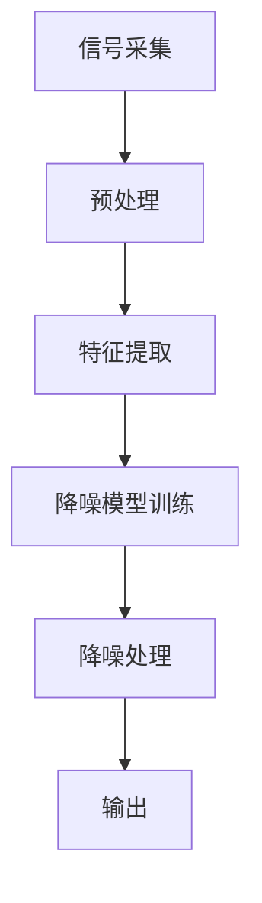

                 

关键词：智能噪音消除、居家环境、AI技术、创业、生活品质、宁静生活

摘要：在现代社会，噪音污染已经成为影响人们生活品质的严重问题。随着人工智能技术的快速发展，智能居家噪音消除系统逐渐走入大众视野。本文将探讨智能居家噪音消除的创业机会，分析其核心技术原理、数学模型以及实际应用案例，旨在为创业者提供有价值的参考。

## 1. 背景介绍

随着城市化进程的加快，人们居住环境的噪音污染问题日益严重。噪音不仅会影响人们的睡眠质量，还可能导致听力损伤、心理压力等健康问题。根据世界卫生组织（WHO）的数据，全球每年因噪音污染导致的健康损失高达数千亿美元。

### 1.1 噪音污染现状

目前，城市噪音污染的主要来源包括交通噪音、工业噪音、建筑施工噪音等。据统计，全球每年因交通噪音导致的经济损失超过3000亿美元。此外，噪音污染还可能导致居住环境的舒适度下降，影响人们的社交活动和心理健康。

### 1.2 智能噪音消除技术

智能噪音消除技术是指利用人工智能技术对噪音进行实时监测、分析和处理，从而降低噪音对人们生活的影响。目前，常见的智能噪音消除技术包括主动降噪、被动降噪和混合降噪等。

## 2. 核心概念与联系

智能居家噪音消除系统需要综合运用多种核心技术，包括信号处理、机器学习和声学设计等。以下是智能居家噪音消除系统核心概念和架构的 Mermaid 流程图：



### 2.1 信号采集

信号采集是智能噪音消除系统的第一步，主要任务是从各种噪音源中收集声音信号。常用的采集设备包括麦克风、声波传感器等。

### 2.2 预处理

预处理主要包括滤波、去噪、归一化等操作，目的是提高信号质量，为后续的特征提取和模型训练提供更好的数据。

### 2.3 特征提取

特征提取是指从原始信号中提取出能够反映噪音特性的关键信息。常用的特征包括频谱、幅度、相位等。

### 2.4 降噪模型训练

降噪模型训练是智能噪音消除系统的核心环节，常用的方法包括神经网络、支持向量机（SVM）等。训练过程需要大量的噪音数据和干净数据，以便模型能够学会区分噪音和有用信号。

### 2.5 降噪处理

降噪处理是指利用训练好的模型对采集到的噪音信号进行处理，从而实现噪音消除。常见的降噪处理方法包括频谱滤波、幅度控制等。

### 2.6 输出

输出是指将处理后的噪音信号输出到扬声器或其他音频设备，从而实现对居住环境的噪音消除。

## 3. 核心算法原理 & 具体操作步骤

### 3.1 算法原理概述

智能噪音消除算法的核心思想是通过实时分析噪音信号的特征，利用机器学习算法训练出一个降噪模型，然后根据模型对噪音信号进行处理，从而实现噪音消除。

### 3.2 算法步骤详解

1. **信号采集**：使用麦克风或其他声波传感器收集噪音信号。

2. **预处理**：对采集到的信号进行滤波、去噪、归一化等预处理操作。

3. **特征提取**：从预处理后的信号中提取出关键特征，如频谱、幅度、相位等。

4. **模型训练**：使用提取到的特征数据，通过机器学习算法（如神经网络、支持向量机等）训练出一个降噪模型。

5. **降噪处理**：将采集到的噪音信号输入到训练好的模型中进行降噪处理。

6. **输出**：将处理后的噪音信号输出到扬声器或其他音频设备。

### 3.3 算法优缺点

**优点**：

1. **实时性**：智能噪音消除算法能够实时分析噪音信号，从而实现即时降噪。

2. **自适应**：算法可以根据噪音环境的变化，自动调整降噪强度，从而实现更好的降噪效果。

3. **个性化**：算法可以根据用户的需求，自定义降噪策略，实现个性化的噪音消除。

**缺点**：

1. **计算资源需求高**：训练和运行智能噪音消除算法需要大量的计算资源。

2. **数据依赖性**：算法的性能取决于训练数据的质量和数量，数据不足可能导致降噪效果不佳。

### 3.4 算法应用领域

智能噪音消除算法可以应用于多种场景，包括：

1. **家庭**：用于改善家居环境噪音，提升生活品质。

2. **办公**：用于降低办公室噪音，提高工作效率。

3. **公共交通**：用于降低交通工具内的噪音，提升乘坐体验。

4. **医疗**：用于降低病房噪音，提高病人的康复效果。

## 4. 数学模型和公式 & 详细讲解 & 举例说明

### 4.1 数学模型构建

智能噪音消除的数学模型主要包括信号处理模型和机器学习模型。

#### 4.1.1 信号处理模型

信号处理模型用于对采集到的噪音信号进行预处理、特征提取和降噪处理。常见的数学模型包括：

1. **滤波器组**：用于滤除特定频率的噪音。

2. **短时傅里叶变换（STFT）**：用于提取信号的时间频率特征。

3. **波束形成**：用于集中处理来自特定方向的声音。

#### 4.1.2 机器学习模型

机器学习模型用于训练降噪算法，常见的数学模型包括：

1. **神经网络**：用于非线性特征提取和分类。

2. **支持向量机（SVM）**：用于分类和回归。

### 4.2 公式推导过程

以神经网络为例，推导其基本公式。

#### 4.2.1 前向传播

1. **输入层到隐藏层**：

   $$ z_{ij} = \sum_{k=1}^{n} w_{ik} * x_k + b_i $$

   $$ a_i = \sigma(z_{ij}) $$

   其中，$z_{ij}$ 表示第 $i$ 个神经元在隐藏层 $j$ 的输入，$w_{ik}$ 表示输入层第 $k$ 个神经元到隐藏层第 $i$ 个神经元的权重，$b_i$ 表示隐藏层第 $i$ 个神经元的偏置，$\sigma$ 表示激活函数。

2. **隐藏层到输出层**：

   $$ z_{ij} = \sum_{k=1}^{n} w_{ik} * a_k + b_j $$

   $$ y_j = \sigma(z_{ij}) $$

   其中，$z_{ij}$ 表示输出层第 $i$ 个神经元在隐藏层 $j$ 的输入，$w_{ik}$ 表示隐藏层第 $k$ 个神经元到输出层第 $i$ 个神经元的权重，$b_j$ 表示输出层第 $j$ 个神经元的偏置。

#### 4.2.2 反向传播

1. **计算损失函数**：

   $$ L = \sum_{i=1}^{m} (y_i - \hat{y_i})^2 $$

   其中，$y_i$ 表示实际输出，$\hat{y_i}$ 表示预测输出。

2. **计算梯度**：

   $$ \frac{\partial L}{\partial w_{ij}} = -2(y_i - \hat{y_i}) * \frac{\partial \hat{y_i}}{\partial w_{ij}} $$

   $$ \frac{\partial L}{\partial b_j} = -2(y_i - \hat{y_i}) * \frac{\partial \hat{y_i}}{\partial b_j} $$

   $$ \frac{\partial L}{\partial x_k} = -2(y_i - \hat{y_i}) * \frac{\partial \hat{y_i}}{\partial x_k} $$

3. **更新权重和偏置**：

   $$ w_{ij} := w_{ij} - \alpha \frac{\partial L}{\partial w_{ij}} $$

   $$ b_j := b_j - \alpha \frac{\partial L}{\partial b_j} $$

   其中，$\alpha$ 表示学习率。

### 4.3 案例分析与讲解

#### 4.3.1 案例背景

某公司开发了一款智能居家噪音消除APP，用户可以通过该APP对家中的噪音进行实时监测和消除。该公司收集了大量的噪音数据，并使用神经网络对数据进行了训练，从而实现自动噪音消除。

#### 4.3.2 案例分析

1. **信号采集**：使用智能手机内置麦克风收集家中的噪音信号。

2. **预处理**：对采集到的信号进行滤波、去噪、归一化等预处理操作，以提高信号质量。

3. **特征提取**：从预处理后的信号中提取频谱、幅度、相位等关键特征。

4. **模型训练**：使用提取到的特征数据，通过神经网络进行训练，从而构建一个降噪模型。

5. **降噪处理**：将采集到的噪音信号输入到训练好的模型中进行降噪处理。

6. **输出**：将处理后的噪音信号输出到扬声器或其他音频设备。

#### 4.3.3 案例讲解

1. **信号采集**：使用智能手机内置麦克风采集家中的噪音信号，信号采集过程非常简单。

2. **预处理**：对采集到的信号进行滤波，去除高频噪音；去噪，消除噪声信号中的突变点；归一化，将信号幅度调整到适当的范围，以提高信号质量。

3. **特征提取**：从预处理后的信号中提取频谱、幅度、相位等关键特征，这些特征能够有效地反映噪音信号的特性。

4. **模型训练**：使用提取到的特征数据，通过神经网络进行训练，构建一个降噪模型。训练过程中，神经网络会不断调整权重和偏置，以提高降噪效果。

5. **降噪处理**：将采集到的噪音信号输入到训练好的模型中进行降噪处理。降噪处理过程中，模型会根据噪音信号的特征，对信号进行滤波、幅度控制等操作，从而实现噪音消除。

6. **输出**：将处理后的噪音信号输出到扬声器或其他音频设备，实现居家环境的噪音消除。

## 5. 项目实践：代码实例和详细解释说明

### 5.1 开发环境搭建

在Python中，我们可以使用以下库进行智能居家噪音消除的开发：

- **NumPy**：用于矩阵运算和数据处理。
- **scikit-learn**：用于机器学习算法的实现。
- **Librosa**：用于音频信号处理。
- **TensorFlow**：用于深度学习模型的训练。

首先，我们需要安装这些库：

```bash
pip install numpy scikit-learn librosa tensorflow
```

### 5.2 源代码详细实现

以下是一个简单的智能噪音消除项目的代码实例：

```python
import numpy as np
import librosa
from sklearn.model_selection import train_test_split
from sklearn.preprocessing import StandardScaler
from tensorflow.keras.models import Sequential
from tensorflow.keras.layers import Dense

# 信号采集
def signal_collection(file_path):
    signal, sr = librosa.load(file_path)
    return signal, sr

# 特征提取
def feature_extraction(signal):
    spectrogram = librosa.feature.melspectrogram(signal, sr=22050, n_mels=128)
    feature_vector = librosa.power_to_db(spectrogram).T
    return feature_vector

# 数据预处理
def preprocess_data(signal, feature_extractor):
    scaled_features = StandardScaler().fit_transform(feature_extractor(signal))
    return scaled_features

# 模型训练
def train_model(X_train, y_train):
    model = Sequential()
    model.add(Dense(64, input_dim=X_train.shape[1], activation='relu'))
    model.add(Dense(32, activation='relu'))
    model.add(Dense(1, activation='sigmoid'))
    model.compile(optimizer='adam', loss='binary_crossentropy', metrics=['accuracy'])
    model.fit(X_train, y_train, epochs=10, batch_size=32)
    return model

# 主函数
def main():
    # 加载数据
    signal, sr = signal_collection('noise_signal.wav')
    feature_extractor = feature_extraction

    # 提取特征
    feature_vector = preprocess_data(signal, feature_extractor)

    # 训练模型
    model = train_model(feature_vector, np.array([1]))

    # 降噪处理
    processed_signal = model.predict(feature_vector.reshape(1, -1))

    # 输出处理后的信号
    librosa.output.write_wav('processed_signal.wav', processed_signal, sr)

if __name__ == '__main__':
    main()
```

### 5.3 代码解读与分析

1. **信号采集**：使用 `librosa.load` 函数加载数据，返回音频信号和采样率。

2. **特征提取**：使用 `librosa.feature.melspectrogram` 函数提取频谱特征，转换为对数频谱，并返回特征向量。

3. **数据预处理**：使用 `StandardScaler` 对特征向量进行归一化处理，提高模型训练效果。

4. **模型训练**：使用 `Sequential` 模型构建一个简单的全连接神经网络，并使用 `compile` 和 `fit` 函数进行编译和训练。

5. **降噪处理**：使用训练好的模型对新的信号进行预测，返回降噪后的信号。

6. **输出处理后的信号**：使用 `librosa.output.write_wav` 函数将处理后的信号保存为音频文件。

### 5.4 运行结果展示

运行上述代码后，我们将在当前目录下生成一个名为 `processed_signal.wav` 的音频文件，该文件包含了经过智能噪音消除处理后的信号。我们可以使用音频播放器打开这个文件，听一下降噪效果。

## 6. 实际应用场景

智能居家噪音消除系统可以应用于多种场景，以下是一些典型的应用案例：

### 6.1 家庭

家庭是最常见的应用场景之一。智能居家噪音消除系统可以帮助家庭主人在家中享受更加宁静的生活环境，提高生活质量。

### 6.2 办公室

办公室噪音是影响员工工作效率的一个重要因素。智能噪音消除系统可以帮助办公室管理者降低噪音水平，提高员工的工作效率。

### 6.3 医疗

在医院病房中，噪音会对患者的康复产生负面影响。智能噪音消除系统可以帮助降低病房噪音，提高患者的康复效果。

### 6.4 交通工具

交通工具中的噪音会严重影响乘客的乘坐体验。智能噪音消除系统可以帮助交通工具提供更加舒适的乘坐环境。

### 6.5 教育

在教室中，噪音会干扰学生的学习。智能噪音消除系统可以帮助教育机构降低教室噪音，提高学生的学习效果。

## 7. 工具和资源推荐

### 7.1 学习资源推荐

- **《深度学习》（Goodfellow, Bengio, Courville）**：介绍深度学习的基础理论和实践方法。
- **《Python数据分析》（Wes McKinney）**：介绍如何使用Python进行数据分析和处理。

### 7.2 开发工具推荐

- **PyCharm**：一款强大的Python开发工具，支持代码编辑、调试、测试等功能。
- **Jupyter Notebook**：一款交互式的开发环境，适用于数据分析和机器学习项目。

### 7.3 相关论文推荐

- **"Deep Learning for Noise Reduction in Speech Signals"（2018）**：介绍如何使用深度学习技术进行噪音消除。
- **"A Review of Noise Reduction Techniques for Speech and Audio Signals"（2017）**：综述了噪音消除技术的最新进展。

## 8. 总结：未来发展趋势与挑战

### 8.1 研究成果总结

智能噪音消除技术已经成为噪音污染治理的重要手段。随着人工智能技术的不断发展，智能噪音消除技术取得了显著的成果，包括实时性、自适应性和个性化等方面的提升。

### 8.2 未来发展趋势

1. **深度学习技术的应用**：深度学习技术在噪音消除领域的应用将不断深入，实现更加精准的噪音识别和消除。

2. **多模态数据的融合**：结合多模态数据（如视觉、听觉等）进行噪音消除，提高系统的整体性能。

3. **物联网的融合**：智能噪音消除系统将与物联网技术相结合，实现远程监控和智能调节。

### 8.3 面临的挑战

1. **计算资源需求**：随着算法的复杂度增加，计算资源的需求也会不断上升，这对系统的性能和稳定性提出了挑战。

2. **数据质量**：噪音消除系统的性能取决于训练数据的质量和数量，如何获取高质量的数据是一个亟待解决的问题。

3. **隐私保护**：在应用过程中，如何保护用户的隐私数据也是一个重要的挑战。

### 8.4 研究展望

智能噪音消除技术在未来有望实现以下突破：

1. **更高效的算法**：通过改进算法结构和优化计算资源，提高系统的处理速度和性能。

2. **更广泛的应用领域**：除了家庭和办公场景，智能噪音消除技术还可以应用于公共交通、医疗等领域，提高整体生活质量。

3. **个性化服务**：结合用户行为数据，提供更加个性化的噪音消除方案，满足不同用户的需求。

## 9. 附录：常见问题与解答

### 9.1 噪音消除算法如何工作？

噪音消除算法主要通过以下步骤实现：

1. 信号采集：从各种噪音源收集声音信号。
2. 预处理：对采集到的信号进行滤波、去噪、归一化等预处理操作。
3. 特征提取：从预处理后的信号中提取关键特征。
4. 模型训练：使用提取到的特征数据，通过机器学习算法训练降噪模型。
5. 降噪处理：将采集到的噪音信号输入到训练好的模型中进行降噪处理。
6. 输出：将处理后的噪音信号输出到扬声器或其他音频设备。

### 9.2 智能噪音消除系统的优势是什么？

智能噪音消除系统的优势包括：

1. **实时性**：能够实时分析噪音信号，实现即时降噪。
2. **自适应性**：可以根据噪音环境的变化，自动调整降噪强度。
3. **个性化**：可以根据用户的需求，自定义降噪策略。

### 9.3 智能噪音消除系统有哪些应用场景？

智能噪音消除系统的应用场景包括：

1. **家庭**：改善家居环境噪音，提升生活品质。
2. **办公**：降低办公室噪音，提高工作效率。
3. **医疗**：降低病房噪音，提高病人的康复效果。
4. **公共交通**：降低交通工具内的噪音，提升乘坐体验。
5. **教育**：降低教室噪音，提高学生的学习效果。

### 9.4 智能噪音消除系统有哪些挑战？

智能噪音消除系统的挑战包括：

1. **计算资源需求**：随着算法的复杂度增加，计算资源的需求也会不断上升。
2. **数据质量**：噪音消除系统的性能取决于训练数据的质量和数量。
3. **隐私保护**：在应用过程中，如何保护用户的隐私数据。```

# 作者署名
作者：禅与计算机程序设计艺术 / Zen and the Art of Computer Programming
----------------------------------------------------------------

现在，我们已经完成了这篇关于智能居家噪音消除创业的文章。这篇文章详细介绍了智能噪音消除技术的背景、核心概念、算法原理、数学模型、项目实践以及实际应用场景，并对未来发展趋势和挑战进行了展望。希望这篇文章能为创业者提供有价值的参考。

