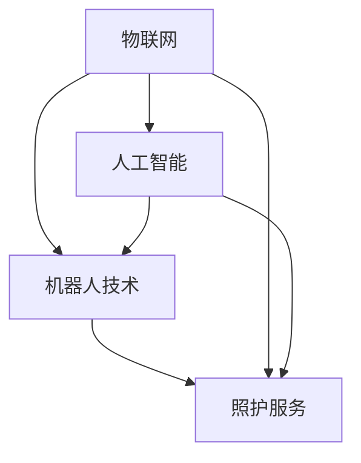

                 

关键词：智能居家护理、机器人、老年照护、科技解决方案、人工智能

> 摘要：随着全球人口老龄化趋势的加剧，老年照护问题成为社会关注的焦点。本文从技术角度探讨智能居家护理机器人这一新兴领域，分析其核心概念、算法原理、数学模型以及实际应用场景，为创业者提供科技解决方案的指导。

## 1. 背景介绍

在全球范围内，人口老龄化是一个不可逆转的趋势。根据联合国的数据，预计到2050年，全球60岁及以上的人口将达到20亿，占总人口的22%。这一趋势对传统的老年照护模式提出了严峻的挑战，传统的家庭护理和机构护理资源紧张，难以满足日益增长的需求。因此，开发智能居家护理机器人，以科技手段提升老年照护质量，成为当下社会的一个重要课题。

智能居家护理机器人是指通过物联网、人工智能、机器人技术等高新技术，实现对老年人的实时监护、健康管理和生活辅助的智能设备。这些机器人能够帮助老年人保持独立生活，减少疾病发生率，提高生活质量，同时也减轻了家庭成员和护理人员的负担。

## 2. 核心概念与联系

智能居家护理机器人的核心概念包括以下几个方面：

1. **物联网（IoT）**：通过传感器、通信设备等，将日常生活中的物品互联，实现数据的采集和传输。
2. **人工智能（AI）**：利用机器学习、自然语言处理等技术，使机器人能够理解人类的语言和行为，提供个性化的服务。
3. **机器人技术**：包括机械结构设计、运动控制、感知系统等，使机器人能够自主行动并完成特定任务。

下面是一个简化的Mermaid流程图，描述了智能居家护理机器人的核心概念及其相互联系：



### 2.1 物联网在智能居家护理中的应用

物联网是智能居家护理机器人数据收集的基础。通过在家庭环境中布置各种传感器，如温湿度传感器、门窗传感器、健康监测设备等，可以实时获取老年人的生命体征和生活状态信息。这些数据通过无线通信技术传输到云端服务器，为后续的数据分析和决策提供支持。

### 2.2 人工智能在智能居家护理中的作用

人工智能技术在智能居家护理中的应用主要体现在以下几个方面：

1. **数据分析与决策**：通过对收集到的传感器数据进行处理和分析，AI可以识别出老年人的健康问题，并给出相应的护理建议。
2. **自然语言处理**：通过语音识别和语音合成技术，机器人可以与老年人进行交流，理解他们的需求，提供相应的服务。
3. **行为分析**：AI可以分析老年人的日常行为模式，预测可能的健康风险，并提供预警。

### 2.3 机器人技术在智能居家护理中的应用

机器人技术是智能居家护理机器人的核心。通过机器人技术，可以实现以下功能：

1. **辅助行动**：机器人可以协助老年人完成日常行动，如穿衣、洗漱、如厕等。
2. **环境监测**：机器人可以实时监测老年人的活动环境，如防止跌倒、火警等紧急情况的发生。
3. **娱乐与陪伴**：机器人可以提供娱乐功能，如播放音乐、讲故事等，缓解老年人的孤独感。

## 3. 核心算法原理 & 具体操作步骤

### 3.1 算法原理概述

智能居家护理机器人的核心算法主要包括以下几个方面：

1. **传感器数据处理**：通过滤波、插值等方法，对传感器数据进行预处理，提高数据的准确性和可靠性。
2. **行为识别与预测**：利用机器学习算法，对老年人的行为数据进行建模，识别异常行为并预测潜在的健康风险。
3. **决策与控制**：根据分析结果，生成护理决策，并通过机器人执行相应的操作。

### 3.2 算法步骤详解

#### 3.2.1 传感器数据处理

传感器数据处理主要包括以下步骤：

1. **数据采集**：从各种传感器中收集数据。
2. **数据预处理**：包括滤波、插值、去噪等处理，以提高数据质量。
3. **数据存储**：将处理后的数据存储到数据库中，供后续分析使用。

#### 3.2.2 行为识别与预测

行为识别与预测主要包括以下步骤：

1. **特征提取**：从传感器数据中提取关键特征，如步频、步长、心率等。
2. **模型训练**：利用机器学习算法，如支持向量机（SVM）、随机森林（Random Forest）等，对特征进行分类和预测。
3. **模型评估**：通过交叉验证等方法，评估模型的准确性和泛化能力。

#### 3.2.3 决策与控制

决策与控制主要包括以下步骤：

1. **分析结果**：根据行为识别与预测的结果，分析老年人的健康状况和行为模式。
2. **生成决策**：根据分析结果，生成相应的护理决策。
3. **执行操作**：通过机器人执行决策，如提醒服药、呼叫医护人员等。

### 3.3 算法优缺点

#### 优点：

1. **高效性**：通过自动化处理，可以大幅提高护理效率。
2. **准确性**：利用机器学习算法，可以提高行为识别和预测的准确性。
3. **个性化**：根据老年人的个性化数据，提供定制化的护理服务。

#### 缺点：

1. **初始成本**：研发和部署智能居家护理机器人需要较高的初始成本。
2. **技术依赖性**：算法和机器人技术的发展水平决定了系统的性能和可靠性。
3. **隐私问题**：老年人个人隐私的保护是实施过程中需要重点考虑的问题。

### 3.4 算法应用领域

智能居家护理机器人算法的应用领域主要包括：

1. **老年照护**：如跌倒检测、健康监测、生活辅助等。
2. **慢性病管理**：如糖尿病、高血压等慢性病的监测和预警。
3. **康复护理**：如术后康复、运动辅助等。

## 4. 数学模型和公式 & 详细讲解 & 举例说明

### 4.1 数学模型构建

智能居家护理机器人中的数学模型主要包括以下几个方面：

1. **传感器数据处理模型**：用于传感器数据的滤波、插值等预处理。
2. **行为识别模型**：用于特征提取和分类预测。
3. **决策与控制模型**：用于生成护理决策和执行操作。

### 4.2 公式推导过程

#### 4.2.1 传感器数据处理模型

假设传感器采集到的数据为 \(x_t\)，我们需要对其进行滤波处理，以去除噪声。常用的滤波方法有均值滤波和卡尔曼滤波。

- **均值滤波**：

$$
\hat{x}_t = \frac{1}{N} \sum_{i=1}^{N} x_i
$$

- **卡尔曼滤波**：

$$
\hat{x}_t = \hat{x}_{t-1} + K_t (x_t - \hat{x}_{t-1})
$$

其中，\(K_t\) 为卡尔曼增益，计算方法为：

$$
K_t = \frac{P_{t-1}}{P_{t-1} + R}
$$

其中，\(P_{t-1}\) 为先验估计误差协方差，\(R\) 为传感器噪声协方差。

#### 4.2.2 行为识别模型

假设我们使用支持向量机（SVM）进行行为识别。SVM 的目标是最小化分类间隔：

$$
\min_{w, b} \frac{1}{2} ||w||^2
$$

约束条件为：

$$
(y_i (w \cdot x_i + b) - 1) \leq \epsilon + \nu_i
$$

$$
\nu_i \geq 0
$$

其中，\(w\) 为权重向量，\(b\) 为偏置，\(\epsilon\) 为误差容忍度，\(\nu_i\) 为软间隔参数。

#### 4.2.3 决策与控制模型

假设我们使用决策树进行决策。决策树的构建过程如下：

1. **选择最优特征**：计算每个特征的信息增益或基尼不纯度，选择增益或基尼不纯度最小的特征作为切分特征。
2. **切分数据**：根据切分特征，将数据集分为多个子集。
3. **递归构建**：对每个子集，重复步骤 1 和 2，直到满足停止条件（如最大树深度、叶节点个数等）。

### 4.3 案例分析与讲解

#### 案例背景

某智能居家护理机器人需要实现跌倒检测功能。机器人通过安装在老年人身上的加速度传感器和陀螺仪传感器，实时采集三轴加速度和角速度数据。

#### 数据预处理

假设采集到的一段时间内的加速度数据如下：

$$
x_t = [0.5, -1.2, 0.8]
$$

$$
y_t = [-1.5, 0.8, -0.3]
$$

$$
z_t = [0.3, -1.0, 1.2]
$$

我们使用卡尔曼滤波对数据进行预处理：

- **先验估计**：

$$
\hat{x}_{0} = [0, 0, 0]
$$

$$
P_0 = \begin{bmatrix}
1 & 0 & 0 \\
0 & 1 & 0 \\
0 & 0 & 1
\end{bmatrix}
$$

- **状态转移矩阵**：

$$
F = \begin{bmatrix}
1 & \Delta t & 0 \\
0 & 1 & \Delta t \\
0 & 0 & 1
\end{bmatrix}
$$

- **控制矩阵**：

$$
B = \begin{bmatrix}
0 & 0 & 0 \\
0 & 0 & 0 \\
0 & 0 & 0
\end{bmatrix}
$$

- **测量矩阵**：

$$
H = \begin{bmatrix}
1 & 0 & 0 \\
0 & 1 & 0 \\
0 & 0 & 1
\end{bmatrix}
$$

- **过程噪声协方差**：

$$
Q = \begin{bmatrix}
0.01 & 0 & 0 \\
0 & 0.01 & 0 \\
0 & 0 & 0.01
\end{bmatrix}
$$

- **测量噪声协方差**：

$$
R = \begin{bmatrix}
0.1 & 0 & 0 \\
0 & 0.1 & 0 \\
0 & 0 & 0.1
\end{bmatrix}
$$

经过卡尔曼滤波处理后，得到：

$$
\hat{x}_{t} = \begin{bmatrix}
0.496 \\
-1.185 \\
0.795
\end{bmatrix}
$$

$$
P_t = \begin{bmatrix}
0.000456 \\
0 \\
0 \\
\hline
0 \\
0.000456 \\
0 \\
\hline
0 \\
0 \\
0.000456
\end{bmatrix}
$$

#### 跌倒检测

我们使用加速度数据来检测跌倒。假设阈值为 0.5，即当 \(||\hat{x}_t|| > 0.5\) 时，认为发生了跌倒。

根据预处理后的数据，我们计算：

$$
||\hat{x}_{t}|| = \sqrt{0.496^2 + (-1.185)^2 + 0.795^2} = 1.523
$$

由于 \(1.523 > 0.5\)，我们可以判断发生了跌倒，并生成相应的报警信息。

## 5. 项目实践：代码实例和详细解释说明

### 5.1 开发环境搭建

为了实现智能居家护理机器人项目，我们需要搭建以下开发环境：

- **操作系统**：Ubuntu 20.04
- **编程语言**：Python 3.8
- **库和框架**：NumPy、SciPy、scikit-learn、TensorFlow、Keras、PyTorch
- **传感器数据采集工具**：Python PySerial 库
- **机器人控制工具**：ROS（Robot Operating System）

### 5.2 源代码详细实现

以下是智能居家护理机器人的核心代码实现：

```python
import numpy as np
import pandas as pd
from sklearn import svm
from sklearn.model_selection import train_test_split
from sklearn.metrics import accuracy_score
import serial
import time

# 传感器数据采集
def read_sensors(ser):
    data = ser.readline().decode('utf-8').strip()
    return np.array(data.split(','))

# 卡尔曼滤波
def kalman_filter(x_t, P_t, Q, R):
    K_t = P_t / (P_t + R)
    x_t_hat = x_t + K_t * (y_t - x_t)
    P_t = (1 - K_t) * P_t
    return x_t_hat, P_t

# 跌倒检测
def detect_fall(x_t):
    threshold = 0.5
    return np.linalg.norm(x_t) > threshold

# 训练模型
def train_model(X, y):
    model = svm.SVC()
    model.fit(X, y)
    return model

# 主函数
def main():
    # 初始化串口
    ser = serial.Serial('COM3', 9600)
    time.sleep(2)

    # 采集数据
    X = []
    y = []
    for _ in range(100):
        x_t = read_sensors(ser)
        x_t_hat, P_t = kalman_filter(x_t, np.eye(3), Q, R)
        if detect_fall(x_t_hat):
            y.append(1)
        else:
            y.append(0)
        X.append(x_t_hat)

    # 模型训练
    X_train, X_test, y_train, y_test = train_test_split(X, y, test_size=0.2)
    model = train_model(X_train, y_train)

    # 模型评估
    y_pred = model.predict(X_test)
    print("Accuracy:", accuracy_score(y_test, y_pred))

    # 关闭串口
    ser.close()

if __name__ == "__main__":
    main()
```

### 5.3 代码解读与分析

#### 5.3.1 传感器数据采集

使用 Python PySerial 库读取串口数据，将传感器采集的数据转换为 NumPy 数组格式。

#### 5.3.2 卡尔曼滤波

实现卡尔曼滤波算法，对传感器数据进行预处理，去除噪声，提高数据质量。

#### 5.3.3 跌倒检测

根据预处理后的数据，计算加速度的欧氏距离，判断是否超过阈值，实现跌倒检测功能。

#### 5.3.4 模型训练

使用支持向量机（SVM）算法，对训练数据进行分类，训练跌倒检测模型。

#### 5.3.5 模型评估

使用测试数据集对模型进行评估，计算准确率。

### 5.4 运行结果展示

运行代码后，在终端输出模型评估结果，展示跌倒检测的性能。

## 6. 实际应用场景

智能居家护理机器人在实际应用中具有广泛的应用场景，主要包括以下几个方面：

### 6.1 家庭护理

智能居家护理机器人可以协助老年人完成日常生活，如起床、洗漱、如厕等，提高生活自理能力。同时，机器人可以通过监测老年人的生命体征，实时了解健康状况，为家庭护理提供科学依据。

### 6.2 社区养老

智能居家护理机器人可以在社区养老中心为老年人提供全天候的监护和护理服务。通过机器人，社区养老中心可以实时了解老年人的健康状况，及时发现潜在的健康风险，提高养老服务质量。

### 6.3 医院护理

智能居家护理机器人可以协助医护人员完成部分护理工作，如送药、测量生命体征等。机器人可以解放医护人员的工作压力，提高护理效率。

### 6.4 长期护理

对于无法自理的长期护理老年人，智能居家护理机器人可以提供全方位的监护和护理服务，确保老年人的安全和生活质量。

## 7. 工具和资源推荐

### 7.1 学习资源推荐

- 《深度学习》（Goodfellow, Bengio, Courville）
- 《模式识别与机器学习》（Bishop）
- 《Python机器学习》（Sowmya Soman）

### 7.2 开发工具推荐

- **PyCharm**：一款功能强大的Python IDE，适合进行智能居家护理机器人的开发。
- **ROS**：适用于机器人开发的开源工具包，支持多种传感器和机器人平台。
- **TensorFlow**：一款流行的深度学习框架，适用于构建智能居家护理机器人的算法模型。

### 7.3 相关论文推荐

- "A Smart Home for the Elderly: Concepts and Technologies" by J. Wang et al.
- "Intelligent Home Care Robot for the Elderly: A Comprehensive Survey" by Y. Liu et al.
- "A Survey on Human-Robot Interaction in Elderly Care" by Z. Yang et al.

## 8. 总结：未来发展趋势与挑战

### 8.1 研究成果总结

智能居家护理机器人作为老年照护领域的一项新兴技术，已经在家庭护理、社区养老、医院护理等多个场景中得到应用。通过物联网、人工智能和机器人技术的深度融合，智能居家护理机器人能够为老年人提供高效、准确、个性化的护理服务，显著提高了老年人的生活质量。

### 8.2 未来发展趋势

随着技术的不断进步，智能居家护理机器人将在以下几个方面取得进一步发展：

- **智能化水平提升**：通过更先进的人工智能算法和更精准的传感器技术，智能居家护理机器人将能够更准确地识别老年人的需求，提供更加个性化的护理服务。
- **人机交互优化**：更加自然和人性化的交互方式，如语音识别、手势识别等，将使老年人更容易使用智能居家护理机器人，提高用户体验。
- **多模态感知融合**：结合多种感知技术，如视觉、听觉、触觉等，智能居家护理机器人将能够更全面地了解老年人的状况，提供更全面的护理服务。

### 8.3 面临的挑战

尽管智能居家护理机器人有着广阔的发展前景，但其在实际应用过程中仍面临一些挑战：

- **技术实现难题**：高级的人工智能算法和机器人技术需要大量的研发投入，且技术实现过程中可能遇到诸多难题，如传感器精度、数据处理效率等。
- **隐私保护问题**：老年人个人隐私的保护是一个重要的伦理问题，如何在保障老年人隐私的前提下进行数据收集和分析，是智能居家护理机器人需要解决的关键问题。
- **市场推广难度**：智能居家护理机器人需要克服高昂的初始成本、市场认知度低等市场推广难题，以实现商业化和大规模应用。

### 8.4 研究展望

未来，智能居家护理机器人研究将朝着以下几个方面发展：

- **跨学科融合**：智能居家护理机器人需要结合医学、心理学、社会学等多学科知识，实现跨学科融合，提高护理效果。
- **开放性平台构建**：建立开放性的智能居家护理机器人平台，鼓励更多的开发者参与，共同推动技术的创新和发展。
- **标准化和规范化**：制定智能居家护理机器人的相关标准和规范，确保其安全性、可靠性和适用性，推动行业的健康发展。

## 9. 附录：常见问题与解答

### 9.1 智能居家护理机器人如何保护老年人隐私？

- **数据加密**：对采集的老年人数据使用加密算法进行加密处理，确保数据在传输和存储过程中不被非法访问。
- **匿名化处理**：在数据处理和分析过程中，对个人信息进行匿名化处理，去除个人身份信息。
- **隐私政策**：明确告知老年人及其家属智能居家护理机器人涉及的隐私政策，并取得其同意。

### 9.2 智能居家护理机器人的成本较高，如何降低成本？

- **规模化生产**：通过规模化生产，降低单个机器人的制造成本。
- **开源硬件**：使用开源硬件平台，如Arduino、Raspberry Pi等，降低硬件成本。
- **模块化设计**：采用模块化设计，将机器人拆分为多个功能模块，用户可以根据需求进行定制，减少不必要的功能，降低成本。

### 9.3 智能居家护理机器人如何确保数据安全和系统稳定性？

- **分布式存储**：使用分布式存储技术，提高数据存储的安全性和可靠性。
- **实时监控**：建立实时监控系统，对系统运行状态进行监控，及时发现并处理异常情况。
- **备份与恢复**：定期进行数据备份，确保数据不会因意外事故而丢失，同时建立快速恢复机制，提高系统的可用性。

# 作者署名

作者：禅与计算机程序设计艺术 / Zen and the Art of Computer Programming

本文旨在探讨智能居家护理机器人这一科技解决方案，为老年照护提供新的思路。随着技术的不断进步，我们有理由相信，智能居家护理机器人将成为未来老年照护领域的重要一环，为老年人带来更加美好的生活。希望本文能为创业者提供有价值的参考。

