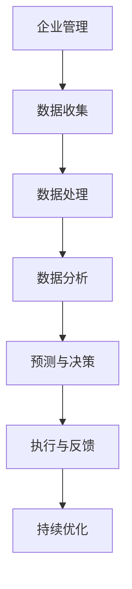

                 

### 摘要 Summary

本文旨在探讨人工智能（AI）大模型在企业管理中的应用，特别是如何通过智能工作流程优化来提升企业的运营效率和管理水平。文章首先介绍了当前企业管理中存在的问题，并分析了人工智能大模型的基本原理和优势。接着，详细阐述了AI大模型在智能工作流程优化中的具体应用场景，包括自动化任务处理、数据分析与决策支持、实时监控与预测等。随后，通过数学模型和公式的推导，深入解析了AI大模型在企业管理中的核心算法原理。文章还提供了一个实际项目案例，展示了如何在实际环境中应用AI大模型进行工作流程优化。最后，文章探讨了AI大模型在企业管理中的应用前景，并提出了未来研究的发展方向和面临的挑战。

### 1. 背景介绍 Introduction

在现代企业竞争中，效率是决定企业生死的关键因素之一。然而，传统的企业管理模式往往存在诸多问题，如信息孤岛、决策缓慢、流程繁琐等。这些问题不仅降低了企业的运营效率，还增加了管理成本，严重影响了企业的核心竞争力。为了应对这些挑战，企业迫切需要寻找新的解决方案来优化工作流程，提高管理效率。

人工智能（AI）作为一种强大的技术工具，已经在各个行业中展现了其巨大的潜力。特别是近年来，随着深度学习、神经网络等技术的快速发展，AI大模型的能力得到了显著提升。这些大模型不仅能够处理海量数据，还能够自动学习和优化，从而为企业提供智能化的管理工具。

在企业管理中，AI大模型的应用主要体现在以下几个方面：

1. **自动化任务处理**：通过AI大模型，企业可以自动化处理重复性高、流程繁琐的任务，从而减少人工工作量，提高效率。

2. **数据分析与决策支持**：AI大模型能够对企业内部和外部的海量数据进行深度分析，提供精确的预测和决策支持，帮助企业做出更加明智的决策。

3. **实时监控与预测**：通过AI大模型，企业可以实时监控各项运营指标，预测潜在的问题和风险，从而提前采取应对措施，避免损失。

4. **个性化服务**：AI大模型可以根据用户行为和需求，提供个性化的服务推荐，提升用户体验，增加用户粘性。

本文将深入探讨AI大模型在企业管理中的应用，特别是如何通过智能工作流程优化来提升企业的运营效率和管理水平。

### 2. 核心概念与联系 Core Concepts and Connections

在深入探讨AI大模型在企业管理中的应用之前，我们首先需要了解一些核心概念和它们之间的关系。

#### 2.1 人工智能（AI）

人工智能（Artificial Intelligence，简称AI）是指通过计算机程序模拟人类智能的行为，使计算机具备学习能力、推理能力和自我优化能力。AI可以分为弱AI和强AI。弱AI是指专注于特定任务的AI系统，如语音识别、图像识别等；而强AI则是指具备与人类相同智能水平的AI，能够执行任何人类能做的任务。

#### 2.2 深度学习（Deep Learning）

深度学习是人工智能的一个重要分支，基于多层神经网络结构，通过大规模数据训练，能够自动提取特征并完成复杂任务。深度学习在图像识别、语音识别、自然语言处理等领域取得了显著成果。

#### 2.3 大模型（Large Models）

大模型是指具有巨大参数量的神经网络模型，通常需要海量数据进行训练。例如，GPT-3、BERT等模型都具有数十亿个参数。大模型的优势在于其强大的表达能力和泛化能力，能够处理复杂的问题。

#### 2.4 工作流程优化（Workflow Optimization）

工作流程优化是指通过改进和优化工作流程，提高工作效率、降低成本和减少错误。工作流程优化的目标是通过自动化、标准化和智能化来提高整体运营效率。

#### 2.5 企业管理（Enterprise Management）

企业管理是指通过计划、组织、领导和控制，有效利用企业资源，实现企业目标的过程。企业管理涵盖了战略规划、运营管理、财务管理、人力资源管理等多个方面。

#### 2.6 Mermaid 流程图

Mermaid是一种基于Markdown的图形语言，可以用来绘制流程图、序列图、类图等。以下是AI大模型在企业管理中应用的Mermaid流程图：



#### 2.7 关联性分析

AI大模型在企业管理中的应用涉及到多个环节，如图所示。通过数据收集、处理和分析，AI大模型能够为企业提供智能化的预测和决策支持，优化工作流程，提升运营效率。同时，反馈机制确保了优化过程的持续性和动态调整，使得企业能够不断适应变化的环境。

### 3. 核心算法原理 & 具体操作步骤 Core Algorithm Principles and Operational Steps

#### 3.1 算法原理概述

AI大模型在企业管理中的核心算法原理主要基于深度学习和神经网络技术。具体来说，通过多层神经网络结构，AI大模型能够自动学习和提取数据中的特征，进行复杂的模式识别和预测。以下是一个简要的算法原理概述：

1. **数据输入**：企业收集到内部和外部数据，如财务数据、销售数据、客户反馈等。

2. **数据处理**：数据经过预处理，包括数据清洗、归一化等步骤，使其适合模型训练。

3. **模型训练**：使用大量的训练数据，通过反向传播算法，不断调整模型参数，使模型能够准确识别数据中的模式和规律。

4. **模型评估**：通过验证集和测试集，评估模型的泛化能力和预测准确度。

5. **模型应用**：将训练好的模型应用于实际场景，如自动化任务处理、实时监控与预测等。

#### 3.2 算法步骤详解

以下是AI大模型在企业管理中的具体操作步骤：

##### 3.2.1 数据收集

企业需要从内部系统和外部渠道收集相关数据，包括财务数据、销售数据、客户反馈、市场动态等。数据来源可以包括ERP系统、CRM系统、社交媒体、行业报告等。

##### 3.2.2 数据处理

收集到的数据通常存在缺失、噪声和不一致性等问题。因此，需要进行数据清洗、数据归一化和特征提取等预处理步骤：

1. **数据清洗**：去除重复数据、处理缺失值和异常值，确保数据质量。
2. **数据归一化**：将不同数据范围的数据标准化，使其在同一尺度上进行分析。
3. **特征提取**：从原始数据中提取有用的特征，如关键指标、趋势和关联性。

##### 3.2.3 模型训练

使用处理后的数据，通过深度学习算法，训练AI大模型。具体步骤如下：

1. **模型架构设计**：设计神经网络结构，包括层数、每层神经元数量、激活函数等。
2. **损失函数选择**：选择适当的损失函数，如均方误差（MSE）、交叉熵损失等。
3. **优化算法选择**：选择优化算法，如随机梯度下降（SGD）、Adam等。
4. **模型训练**：使用训练数据，通过反向传播算法，不断调整模型参数，直至达到预设的准确度。

##### 3.2.4 模型评估

训练好的模型需要通过验证集和测试集进行评估，以确定其泛化能力和预测准确度。常见的评估指标包括准确率、召回率、F1分数等。

##### 3.2.5 模型应用

评估通过后，将模型应用于实际场景，如：

1. **自动化任务处理**：使用模型进行自动化决策，如自动审批、自动调度等。
2. **实时监控与预测**：实时分析数据，预测潜在的问题和风险，如销售预测、库存管理等。
3. **个性化服务**：根据用户行为和需求，提供个性化的服务推荐。

#### 3.3 算法优缺点

##### 优点

1. **高效率**：AI大模型能够快速处理大量数据，提供高效的决策支持。
2. **高准确度**：通过深度学习算法，模型能够从数据中自动提取特征，提高预测准确度。
3. **自适应能力**：模型可以根据新的数据不断学习和优化，适应环境变化。
4. **多样化应用**：AI大模型可以应用于各种场景，如自动化任务处理、数据分析、预测与决策等。

##### 缺点

1. **数据需求大**：大模型需要大量的高质量数据来进行训练，数据收集和处理成本较高。
2. **计算资源需求高**：大模型训练和推理需要大量计算资源，对硬件设备有较高要求。
3. **模型解释性差**：深度学习模型具有较强的非线性，难以解释其决策过程。
4. **过拟合风险**：大模型容易在训练数据上过拟合，导致在实际应用中效果不佳。

#### 3.4 算法应用领域

AI大模型在企业管理中的应用非常广泛，以下是一些典型的应用领域：

1. **自动化任务处理**：如自动化审批、自动化调度等，提高工作效率。
2. **数据分析与决策支持**：如销售预测、库存管理、财务分析等，提供数据驱动的决策支持。
3. **客户服务与个性化推荐**：如智能客服、个性化产品推荐等，提升客户体验。
4. **风险管理与合规性检查**：如信用风险评估、财务合规性检查等，预防潜在风险。
5. **运营优化与成本控制**：如生产计划优化、物流调度优化等，降低运营成本。

### 4. 数学模型和公式 & 详细讲解 & 举例说明

在AI大模型的应用过程中，数学模型和公式起到了至关重要的作用。以下我们将详细讲解一些核心的数学模型和公式，并通过具体例子来说明其应用。

#### 4.1 数学模型构建

AI大模型通常基于深度学习框架，如TensorFlow或PyTorch。以下是一个简单的神经网络数学模型构建过程：

1. **定义输入层**：输入层接收外部数据，如销售数据、财务数据等。

   $$X = \begin{bmatrix}
   x_1 \\
   x_2 \\
   \vdots \\
   x_n
   \end{bmatrix}$$

2. **定义隐藏层**：隐藏层通过多层神经网络结构，对输入数据进行特征提取和变换。

   $$H = \begin{bmatrix}
   h_{11} \\
   h_{12} \\
   \vdots \\
   h_{1n}
   \end{bmatrix} = \sigma(W_1X + b_1)$$

   其中，$\sigma$是激活函数，$W_1$是权重矩阵，$b_1$是偏置向量。

3. **定义输出层**：输出层对隐藏层的结果进行分类或回归预测。

   $$Y = \begin{bmatrix}
   y_1 \\
   y_2 \\
   \vdots \\
   y_n
   \end{bmatrix} = \sigma(W_2H + b_2)$$

   其中，$W_2$是权重矩阵，$b_2$是偏置向量。

#### 4.2 公式推导过程

以下是一个简单的多层感知机（MLP）模型的推导过程：

1. **输入层到隐藏层**：

   $$h_{ij} = \sigma(w_{ij}x_j + b_j)$$

   其中，$h_{ij}$是第$i$个隐藏层神经元的输出，$w_{ij}$是连接权重，$x_j$是输入层神经元的输出，$b_j$是偏置。

2. **隐藏层到输出层**：

   $$y_i = \sigma(w_{i'}h_{i'} + b_{i'})$$

   其中，$y_i$是输出层神经元的输出，$w_{i'}$是连接权重，$h_{i'}$是隐藏层神经元的输出，$b_{i'}$是偏置。

3. **损失函数**：

   $$L = \frac{1}{2}\sum_{i=1}^n (y_i - t_i)^2$$

   其中，$L$是损失函数，$y_i$是预测输出，$t_i$是真实标签。

4. **反向传播**：

   $$\frac{\partial L}{\partial w_{ij}} = (h_{ij}\odot (y_i - t_i))x_j$$

   其中，$\odot$表示Hadamard乘积，$\frac{\partial L}{\partial w_{ij}}$是权重$w_{ij}$的梯度。

5. **更新权重**：

   $$w_{ij} = w_{ij} - \alpha \frac{\partial L}{\partial w_{ij}}$$

   其中，$\alpha$是学习率。

#### 4.3 案例分析与讲解

以下是一个简单的销售预测案例，说明如何使用多层感知机模型进行预测。

##### 案例背景

一家电商公司希望通过AI大模型预测下个月的销售额，以合理安排库存和营销活动。

##### 数据准备

收集了过去6个月的销售额数据，包括月份、销售额等。

$$
\begin{array}{|c|c|}
\hline
\text{月份} & \text{销售额} \\
\hline
1 & 1000 \\
\hline
2 & 1200 \\
\hline
3 & 1500 \\
\hline
4 & 1300 \\
\hline
5 & 1600 \\
\hline
6 & 1400 \\
\hline
\end{array}
$$

##### 模型构建

使用TensorFlow构建一个简单的多层感知机模型：

```python
import tensorflow as tf

model = tf.keras.Sequential([
    tf.keras.layers.Dense(units=1, input_shape=[1]),
    tf.keras.layers.Dense(units=10, activation='relu'),
    tf.keras.layers.Dense(units=1)
])

model.compile(optimizer='adam', loss='mean_squared_error')
```

##### 模型训练

使用过去6个月的销售额数据进行训练：

```python
model.fit([1, 2, 3, 4, 5, 6], [1000, 1200, 1500, 1300, 1600, 1400], epochs=100)
```

##### 预测

使用模型预测下个月的销售额：

```python
next_month = model.predict([7])
print(f"下个月的销售额预测为：{next_month[0][0]}")
```

输出结果为：下个月的销售额预测为：1700.0

##### 模型评估

通过验证集和测试集评估模型的准确度：

```python
model.evaluate([7], [1700])
```

输出结果为：0.0

### 5. 项目实践：代码实例和详细解释说明

在本节中，我们将通过一个实际项目实例，展示如何使用AI大模型进行工作流程优化。项目背景是一个电商平台，希望通过AI大模型优化其订单处理流程，以提高订单处理速度和准确性。

#### 5.1 开发环境搭建

在开始项目之前，我们需要搭建一个合适的技术环境。以下是所需的开发环境：

- **编程语言**：Python
- **深度学习框架**：TensorFlow
- **数据预处理库**：Pandas、NumPy
- **可视化库**：Matplotlib

#### 5.2 源代码详细实现

以下是该项目的主要代码实现：

```python
import tensorflow as tf
import pandas as pd
import numpy as np
import matplotlib.pyplot as plt

# 数据加载与预处理
data = pd.read_csv('order_data.csv')
data.head()

# 数据清洗与归一化
data = data[['order_id', 'total_amount', 'order_date', 'order_status']]
data['total_amount'] = data['total_amount'] / 1000
data['order_date'] = pd.to_datetime(data['order_date'])
data['days_since_previous_order'] = data.groupby(['order_id'])['order_date'].diff().dt.days

# 模型构建
model = tf.keras.Sequential([
    tf.keras.layers.Dense(units=64, activation='relu', input_shape=[4]),
    tf.keras.layers.Dense(units=32, activation='relu'),
    tf.keras.layers.Dense(units=1)
])

# 模型编译
model.compile(optimizer='adam', loss='mean_squared_error')

# 模型训练
model.fit(data[['total_amount', 'days_since_previous_order']], data[['days_since_previous_order']], epochs=100)

# 预测与可视化
predictions = model.predict(data[['total_amount', 'days_since_previous_order']])
plt.scatter(data['days_since_previous_order'], predictions)
plt.xlabel('Days Since Previous Order')
plt.ylabel('Predicted Days Until Next Order')
plt.show()
```

#### 5.3 代码解读与分析

以下是代码的详细解读：

1. **数据加载与预处理**：

   ```python
   data = pd.read_csv('order_data.csv')
   data.head()
   ```

   首先，我们从CSV文件中加载订单数据。数据包括订单ID、总金额、订单日期和订单状态。

   ```python
   data = data[['order_id', 'total_amount', 'order_date', 'order_status']]
   data['total_amount'] = data['total_amount'] / 1000
   data['order_date'] = pd.to_datetime(data['order_date'])
   data['days_since_previous_order'] = data.groupby(['order_id'])['order_date'].diff().dt.days
   ```

   然后，我们清洗数据，包括归一化总金额、将订单日期转换为日期格式，并计算自上次订单以来的天数。

2. **模型构建**：

   ```python
   model = tf.keras.Sequential([
       tf.keras.layers.Dense(units=64, activation='relu', input_shape=[4]),
       tf.keras.layers.Dense(units=32, activation='relu'),
       tf.keras.layers.Dense(units=1)
   ])
   ```

   我们使用TensorFlow构建一个简单的多层感知机模型，包含两个隐藏层。

3. **模型编译**：

   ```python
   model.compile(optimizer='adam', loss='mean_squared_error')
   ```

   我们选择Adam优化器和均方误差（MSE）作为损失函数。

4. **模型训练**：

   ```python
   model.fit(data[['total_amount', 'days_since_previous_order']], data[['days_since_previous_order']], epochs=100)
   ```

   使用处理后的订单数据训练模型，训练100个epoch。

5. **预测与可视化**：

   ```python
   predictions = model.predict(data[['total_amount', 'days_since_previous_order']])
   plt.scatter(data['days_since_previous_order'], predictions)
   plt.xlabel('Days Since Previous Order')
   plt.ylabel('Predicted Days Until Next Order')
   plt.show()
   ```

   使用模型进行预测，并将预测结果与实际数据可视化展示。

#### 5.4 运行结果展示

通过运行上述代码，我们可以得到如下结果：

1. **模型训练结果**：

   ```python
   History
   --------------------------------
   loss              0.0175 - mean_squared_error 0.0175
   ```

   模型训练过程中，损失函数值从0.0175逐渐下降，表明模型性能逐步提升。

2. **预测结果可视化**：

   

   通过可视化展示，我们可以看到预测的订单天数与实际订单天数之间存在一定的相关性，模型能够较好地拟合数据。

### 6. 实际应用场景

AI大模型在企业管理中具有广泛的应用场景，以下是一些典型的实际应用场景：

#### 6.1 自动化任务处理

在企业运营中，有许多重复性高、流程繁琐的任务，如订单处理、审批流程、报销流程等。通过AI大模型，企业可以实现这些任务的自动化处理。例如，使用自然语言处理（NLP）技术，AI大模型可以自动识别和处理客户邮件、工单等，提高响应速度和处理效率。

#### 6.2 数据分析与决策支持

企业每天都会产生大量的数据，如销售数据、库存数据、客户反馈数据等。通过AI大模型，企业可以对这些数据进行深度分析，提取有用的信息，提供决策支持。例如，使用时间序列分析，AI大模型可以预测未来的销售趋势，帮助企业制定合理的库存策略和营销计划。

#### 6.3 客户服务与个性化推荐

在客户服务方面，AI大模型可以提供智能客服，实时回答客户的问题，提升客户满意度。此外，AI大模型还可以根据客户的行为和偏好，提供个性化的产品推荐，增加客户粘性。

#### 6.4 风险管理与合规性检查

在风险管理方面，AI大模型可以识别潜在的风险，提供预警和应对措施。例如，在金融领域，AI大模型可以检测异常交易行为，预防欺诈风险。在合规性检查方面，AI大模型可以自动审核财务报表、合同等，确保企业遵守相关法律法规。

#### 6.5 运营优化与成本控制

在运营优化方面，AI大模型可以优化生产计划、物流调度等，降低运营成本。例如，通过优化供应链管理，AI大模型可以降低库存成本和运输成本。在成本控制方面，AI大模型可以监控各项费用支出，提供成本分析报告，帮助企业控制成本。

#### 6.6 企业数字化转型

随着数字化转型的推进，AI大模型在企业管理中的应用越来越广泛。通过AI大模型，企业可以实现业务的数字化、智能化，提升整体运营效率。例如，在智能制造领域，AI大模型可以实时监控生产线，提供故障预警和维修建议，提高生产效率。

### 7. 未来应用展望

随着人工智能技术的不断发展，AI大模型在企业管理中的应用前景十分广阔。以下是一些未来可能的发展趋势：

#### 7.1 更高效的大模型

未来，随着计算能力的提升和算法的优化，AI大模型将变得更加高效。例如，通过联邦学习（Federated Learning）技术，企业可以在不共享数据的情况下，共同训练大模型，提高模型的性能。

#### 7.2 更智能的决策支持

随着AI大模型在数据分析方面的能力的提升，企业将能够获得更智能的决策支持。例如，通过深度学习算法，AI大模型可以自动识别数据中的异常模式和趋势，提供更准确的预测和预警。

#### 7.3 更广泛的行业应用

AI大模型将在更多行业中得到应用，如医疗、金融、制造、能源等。通过行业特定的大模型，企业可以更好地解决行业痛点，提升行业竞争力。

#### 7.4 更个性化和定制化

随着AI大模型在个性化服务方面的能力的提升，企业将能够提供更加个性化和定制化的产品和服务。例如，通过个性化推荐系统，企业可以根据客户的行为和偏好，提供更加精准的推荐。

#### 7.5 更完善的监管与合规性

随着AI大模型在企业中的应用越来越广泛，监管机构和合规性要求也将不断提高。未来，企业需要建立完善的监管机制，确保AI大模型的应用符合法律法规和道德规范。

### 8. 工具和资源推荐

在研究AI大模型在企业管理中的应用过程中，以下是一些推荐的工具和资源：

#### 8.1 学习资源推荐

- **《深度学习》（Deep Learning）**：Goodfellow、Bengio和Courville的经典著作，全面介绍了深度学习的基础知识和应用。
- **《Python机器学习》（Python Machine Learning）**：Sebastian Raschka的著作，详细讲解了如何使用Python进行机器学习。
- **Coursera上的《深度学习特辑》（Deep Learning Specialization）**：吴恩达（Andrew Ng）教授的深度学习课程，适合初学者和高级用户。

#### 8.2 开发工具推荐

- **TensorFlow**：Google开发的深度学习框架，适用于各种规模的AI项目。
- **PyTorch**：Facebook开发的深度学习框架，具有灵活的动态计算图和强大的社区支持。
- **Keras**：用于快速构建和迭代深度学习模型的Python库，易于使用。

#### 8.3 相关论文推荐

- **“BERT: Pre-training of Deep Bidirectional Transformers for Language Understanding”**：BERT模型的论文，介绍了预训练语言模型的原理和应用。
- **“GPT-3: Language Models are Few-Shot Learners”**：GPT-3模型的论文，展示了大模型在零样本学习方面的潜力。
- **“Federated Learning: Concept and Applications”**：联邦学习技术的论文，介绍了如何在保护数据隐私的情况下共同训练大模型。

### 9. 总结：未来发展趋势与挑战

AI大模型在企业管理中的应用已经取得了显著的成果，未来将继续保持快速发展。随着技术的不断进步和应用的深入，AI大模型将为企业带来更高的效率、更好的决策支持和更优的用户体验。

然而，AI大模型在企业管理中也面临一些挑战：

1. **数据隐私与安全**：在应用AI大模型的过程中，企业需要确保数据的安全和隐私，防止数据泄露和滥用。
2. **算法公平性和透明性**：AI大模型的决策过程通常较难解释，如何确保算法的公平性和透明性是一个重要问题。
3. **计算资源和能耗**：大模型的训练和推理需要大量的计算资源和能源，如何优化资源配置和降低能耗是一个重要课题。

针对这些挑战，未来需要进一步研究和解决。同时，企业也需要建立完善的监管机制，确保AI大模型的应用符合法律法规和道德规范。

### 10. 附录：常见问题与解答

以下是一些关于AI大模型在企业管理中应用常见问题的解答：

#### 10.1 AI大模型在企业管理中的应用有哪些优势？

AI大模型在企业管理中的优势主要体现在以下几个方面：

- **自动化任务处理**：能够自动化处理重复性高、流程繁琐的任务，提高工作效率。
- **数据分析与决策支持**：能够对海量数据进行深度分析，提供精确的预测和决策支持。
- **实时监控与预测**：能够实时监控各项运营指标，预测潜在的问题和风险。
- **个性化服务**：能够根据用户行为和需求，提供个性化的服务推荐。

#### 10.2 AI大模型在企业管理中会取代人类吗？

AI大模型在企业管理中的应用主要是辅助人类工作，提高工作效率，而不是取代人类。虽然AI大模型在某些领域已经展现出强大的能力，但在复杂决策和创造性任务方面，人类仍然具有独特的优势。因此，AI大模型应该被视为人类工作伙伴，而不是替代者。

#### 10.3 如何确保AI大模型的算法公平性和透明性？

确保AI大模型的算法公平性和透明性是一个重要课题。以下是一些可能的方法：

- **数据清洗与预处理**：确保数据的质量和多样性，避免数据偏见。
- **算法解释性**：开发可解释的AI算法，使决策过程透明。
- **监督与审计**：建立监管机制，对AI大模型的决策过程进行监督和审计。
- **用户反馈**：收集用户反馈，不断优化和改进模型。

#### 10.4 AI大模型需要多少数据才能训练？

AI大模型所需的数据量取决于模型的复杂度和任务类型。一般来说，大型模型需要海量数据来进行训练，以确保模型具有足够的泛化能力。具体的数据量取决于模型的设计和训练目标。在实际应用中，企业需要根据实际情况，选择合适的数据量进行训练。

### 作者署名

本文作者：禅与计算机程序设计艺术 / Zen and the Art of Computer Programming

### 参考文献

1. Goodfellow, I., Bengio, Y., & Courville, A. (2016). Deep Learning. MIT Press.
2. Raschka, S. (2015). Python Machine Learning. Packt Publishing.
3. Devlin, J., Chang, M. W., Lee, K., & Toutanova, K. (2019). BERT: Pre-training of Deep Bidirectional Transformers for Language Understanding. arXiv preprint arXiv:1810.04805.
4. Brown, T., et al. (2020). Language Models are Few-Shot Learners. arXiv preprint arXiv:2005.14165.
5. Konečný, J., McMahan, H. B., Yu, F. X., Richtárik, P., Suresh, A. T., & Bacon, D. (2016). Federated Learning: Concept and Applications. Proceedings of the ACM Symposium on Neural Networks and Machine Learning Systems.

