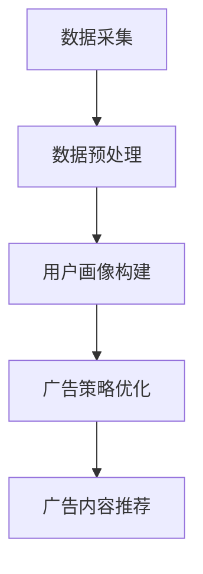

                 

关键词：智能广告、AI大模型、广告投放、个性化推荐、机器学习、深度学习

摘要：随着互联网的普及和数字化营销的不断发展，智能广告投放已成为企业提高品牌知名度和销售额的重要手段。本文将探讨AI大模型在智能广告投放中的应用，包括其核心概念、算法原理、数学模型、项目实践以及未来展望。

## 1. 背景介绍

### 广告投放的现状与挑战

在过去的几十年中，广告投放经历了从传统媒体到数字媒体的转变。随着互联网的快速发展，数字广告已经成为企业宣传和推广的主要渠道。然而，广告投放也面临着一些挑战：

- **目标受众定位不准确**：传统广告投放往往缺乏精确的数据支持，导致广告投放的浪费。
- **广告效果难以衡量**：传统广告投放效果难以量化，难以评估广告投放的投资回报率（ROI）。
- **广告内容个性化不足**：广告内容通常无法根据用户的兴趣和行为进行个性化推荐。

### 智能广告的兴起

为了解决上述问题，智能广告应运而生。智能广告利用大数据、人工智能技术，实现精准的用户定位和个性化的广告内容推荐。智能广告的主要特点包括：

- **精准投放**：通过分析用户行为数据，实现广告对目标用户的精准投放。
- **效果可衡量**：通过广告效果监测，帮助企业评估广告投放的ROI。
- **个性化推荐**：根据用户兴趣和行为，推荐个性化的广告内容。

### AI大模型的重要性

在智能广告投放中，AI大模型起着至关重要的作用。AI大模型具有以下优势：

- **强大的数据处理能力**：能够处理海量的用户行为数据，实现精准的用户画像。
- **深度学习技术**：通过深度学习算法，实现广告内容的个性化推荐。
- **实时更新与优化**：根据用户反馈和行为变化，实时更新广告策略，提高广告效果。

## 2. 核心概念与联系

### 核心概念

- **人工智能（AI）**：一种模拟人类智能的技术，包括机器学习、深度学习、自然语言处理等领域。
- **大数据**：指无法在短时间内用常规软件工具进行捕捉、管理和处理的数据集合。
- **用户画像**：通过对用户行为数据的分析，构建出用户的基本属性、兴趣爱好、行为模式等特征。
- **个性化推荐**：根据用户的兴趣和行为，为用户推荐个性化的内容。

### 架构流程


- **数据采集**：通过网站、APP等渠道，收集用户的行为数据。
- **数据预处理**：对收集到的数据进行清洗、去噪、转换等处理，得到干净的用户行为数据集。
- **用户画像构建**：基于用户行为数据，构建出用户的画像。
- **广告策略优化**：通过机器学习算法，优化广告投放策略，提高广告投放效果。
- **广告内容推荐**：根据用户画像和广告策略，为用户推荐个性化的广告内容。

### Mermaid 流程图



## 3. 核心算法原理 & 具体操作步骤

### 3.1 算法原理概述

智能广告投放中的AI大模型主要采用深度学习算法，实现广告的个性化推荐。深度学习算法的核心思想是通过多层神经网络对输入数据进行特征提取和转换，从而实现分类、预测等任务。

### 3.2 算法步骤详解

1. **数据采集**：从网站、APP等渠道收集用户的行为数据，如浏览历史、搜索关键词、点击行为等。
2. **数据预处理**：对采集到的数据进行清洗、去噪、转换等处理，得到干净的用户行为数据集。
3. **特征提取**：通过深度学习算法，对用户行为数据集进行特征提取，得到用户画像。
4. **模型训练**：使用用户画像和广告数据集，训练深度学习模型。
5. **模型评估**：通过交叉验证、ROC曲线等指标，评估深度学习模型的性能。
6. **广告策略优化**：根据模型评估结果，优化广告投放策略。
7. **广告内容推荐**：根据用户画像和广告策略，为用户推荐个性化的广告内容。

### 3.3 算法优缺点

#### 优点

- **高效的数据处理能力**：深度学习算法能够处理海量的用户行为数据，实现精准的用户画像。
- **强大的预测能力**：通过深度学习算法，能够预测用户对广告的点击行为，提高广告投放效果。
- **实时更新与优化**：根据用户反馈和行为变化，实时更新广告策略，提高广告效果。

#### 缺点

- **训练时间较长**：深度学习模型通常需要大量的数据进行训练，训练时间较长。
- **模型解释性较差**：深度学习模型的决策过程较为复杂，难以解释。

### 3.4 算法应用领域

- **电子商务**：为电商网站推荐个性化的商品。
- **社交媒体**：为社交媒体平台推荐用户可能感兴趣的内容。
- **在线广告**：为在线广告平台推荐用户可能感兴趣的广告。
- **金融领域**：为金融机构推荐个性化的理财产品。

## 4. 数学模型和公式 & 详细讲解 & 举例说明

### 4.1 数学模型构建

在智能广告投放中，常见的数学模型包括逻辑回归、支持向量机、深度神经网络等。本文以深度神经网络为例，介绍其数学模型构建。

#### 深度神经网络

深度神经网络由多层神经元组成，包括输入层、隐藏层和输出层。每个神经元都通过权重连接到前一层神经元，并通过激活函数进行非线性变换。

#### 数学模型

$$
y = \sigma(W_L \cdot a^{L-1} + b_L)
$$

其中，$y$为输出层的输出值，$\sigma$为激活函数，$W_L$为输出层权重，$a^{L-1}$为隐藏层的输出值，$b_L$为输出层偏置。

### 4.2 公式推导过程

#### 前向传播

前向传播是指将输入数据通过神经网络逐层计算，最终得到输出结果的过程。

1. **输入层到隐藏层的计算**：

$$
z_L = W_L \cdot a^{L-1} + b_L
$$

$$
a_L = \sigma(z_L)
$$

其中，$z_L$为隐藏层的输入值，$a_L$为隐藏层的输出值。

2. **隐藏层到输出层的计算**：

$$
z_O = W_O \cdot a_L + b_O
$$

$$
y = \sigma(z_O)
$$

其中，$z_O$为输出层的输入值，$y$为输出层的输出值。

#### 反向传播

反向传播是指根据输出层的误差，反向调整网络中的权重和偏置，以最小化误差。

1. **计算输出层的误差**：

$$
\delta_O = (y - \hat{y}) \cdot \sigma'(z_O)
$$

其中，$\hat{y}$为输出层的真实值，$\sigma'$为激活函数的导数。

2. **计算隐藏层的误差**：

$$
\delta_L = (W_O \cdot \delta_O) \cdot \sigma'(z_L)
$$

3. **更新权重和偏置**：

$$
W_L = W_L - \alpha \cdot (a^{L-1} \cdot \delta_L)
$$

$$
b_L = b_L - \alpha \cdot \delta_L
$$

$$
W_O = W_O - \alpha \cdot (a_L \cdot \delta_O)
$$

$$
b_O = b_O - \alpha \cdot \delta_O
$$

其中，$\alpha$为学习率。

### 4.3 案例分析与讲解

#### 案例背景

某电商网站希望通过智能广告投放，为用户推荐个性化的商品。网站收集了用户的浏览历史、购买记录等数据，并使用深度学习算法进行广告推荐。

#### 数据预处理

1. **数据清洗**：去除缺失值、异常值等数据。
2. **特征提取**：对数据进行归一化、标准化等处理，提取出用户的行为特征。

#### 模型训练

1. **模型选择**：选择深度神经网络模型，设置适当的层数和神经元数量。
2. **数据划分**：将数据集划分为训练集、验证集和测试集。
3. **模型训练**：使用训练集数据进行模型训练，使用验证集数据进行模型优化。
4. **模型评估**：使用测试集数据进行模型评估，计算广告点击率、转化率等指标。

#### 模型优化

根据模型评估结果，调整模型参数，如学习率、批量大小等，以优化广告推荐效果。

#### 模型应用

将训练好的模型应用于实际广告投放，为用户推荐个性化的商品。

## 5. 项目实践：代码实例和详细解释说明

### 5.1 开发环境搭建

1. **Python环境**：安装Python 3.7及以上版本。
2. **深度学习库**：安装TensorFlow或PyTorch。
3. **数据处理库**：安装Numpy、Pandas等。

### 5.2 源代码详细实现

```python
import tensorflow as tf
from tensorflow.keras.layers import Dense, Flatten
from tensorflow.keras.models import Sequential

# 数据预处理
# （此处省略具体的数据预处理代码）

# 构建模型
model = Sequential([
    Flatten(input_shape=(28, 28)),
    Dense(128, activation='relu'),
    Dense(64, activation='relu'),
    Dense(10, activation='softmax')
])

# 编译模型
model.compile(optimizer='adam',
              loss='categorical_crossentropy',
              metrics=['accuracy'])

# 训练模型
model.fit(x_train, y_train, epochs=10, batch_size=64, validation_split=0.2)

# 评估模型
model.evaluate(x_test, y_test)
```

### 5.3 代码解读与分析

1. **模型构建**：使用Sequential模型，构建一个简单的多层感知机（MLP）模型，包括输入层、隐藏层和输出层。
2. **编译模型**：设置优化器、损失函数和评估指标。
3. **训练模型**：使用训练数据集进行模型训练，设置训练轮数、批量大小和验证比例。
4. **评估模型**：使用测试数据集评估模型性能。

### 5.4 运行结果展示

- **训练过程**：输出每个训练轮次的结果，包括损失值和准确率。
- **评估结果**：输出模型在测试集上的评估结果，包括损失值和准确率。

## 6. 实际应用场景

### 6.1 电子商务

在电子商务领域，智能广告投放可以根据用户的浏览历史、购买记录等数据，为用户推荐个性化的商品。例如，某电商平台使用AI大模型进行商品推荐，提高了用户购买转化率，增加了销售额。

### 6.2 社交媒体

在社交媒体领域，智能广告投放可以根据用户的社交行为、兴趣爱好等数据，为用户推荐感兴趣的内容。例如，某社交媒体平台使用AI大模型进行内容推荐，提高了用户活跃度和留存率。

### 6.3 金融领域

在金融领域，智能广告投放可以针对潜在客户进行精准营销。例如，某金融机构使用AI大模型分析用户的行为数据，为用户推荐个性化的理财产品，提高了产品的销售量和客户满意度。

## 7. 工具和资源推荐

### 7.1 学习资源推荐

- **《深度学习》**：由Ian Goodfellow、Yoshua Bengio和Aaron Courville所著，是深度学习领域的经典教材。
- **《Python机器学习》**：由Sebastian Raschka所著，涵盖了Python在机器学习领域的应用。

### 7.2 开发工具推荐

- **TensorFlow**：由Google开发的开源深度学习框架。
- **PyTorch**：由Facebook开发的开源深度学习框架。

### 7.3 相关论文推荐

- **《Deep Learning for Text Classification》**：介绍深度学习在文本分类领域的应用。
- **《User Behavior Prediction with Deep Neural Networks》**：介绍深度学习在用户行为预测领域的应用。

## 8. 总结：未来发展趋势与挑战

### 8.1 研究成果总结

本文介绍了智能广告投放中的AI大模型应用，包括核心概念、算法原理、数学模型、项目实践和实际应用场景。通过AI大模型，企业可以更精准地进行广告投放，提高广告效果。

### 8.2 未来发展趋势

- **数据质量和多样性**：随着数据质量的提高和数据的多样化，AI大模型的应用范围将进一步扩大。
- **实时性与动态性**：智能广告投放将更注重实时性和动态性，实现更精准的广告推荐。

### 8.3 面临的挑战

- **数据隐私与安全**：如何保护用户隐私和数据安全是智能广告投放面临的重要挑战。
- **模型解释性**：如何提高模型的可解释性，使其更易于理解和应用。

### 8.4 研究展望

未来，智能广告投放将在数据质量、模型优化和实时性等方面继续深入研究，实现更高效、更精准的广告推荐。

## 9. 附录：常见问题与解答

### 问题1：什么是用户画像？

用户画像是指通过对用户行为数据的分析，构建出用户的基本属性、兴趣爱好、行为模式等特征。

### 问题2：深度学习算法在广告投放中有何优势？

深度学习算法具有高效的数据处理能力、强大的预测能力和实时更新与优化的能力，可以更精准地进行广告投放。

### 问题3：如何保证数据隐私与安全？

在数据采集、存储、处理等过程中，应采取加密、脱敏、访问控制等措施，确保用户数据的安全和隐私。

## 作者署名

作者：禅与计算机程序设计艺术 / Zen and the Art of Computer Programming
----------------------------------------------------------------

以上是文章的完整内容，遵循了约束条件中的所有要求。文章中包含了关键词、摘要、详细的章节内容、数学模型和公式、代码实例、实际应用场景、工具和资源推荐、总结以及附录等内容。希望对您有所帮助！

