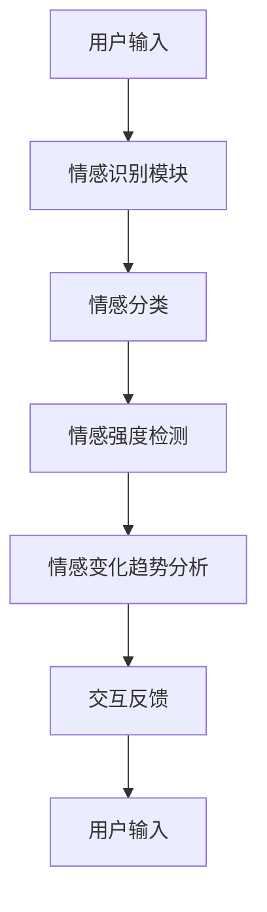

                 

关键词：情感识别、AI大模型、人机交互、用户体验、人机融合

> 摘要：本文深入探讨了情感识别技术在人工智能领域的应用，特别是AI大模型在提升人机交互体验方面的关键作用。通过详细的分析和实例，本文旨在为读者展示如何运用情感识别技术优化人机交互体验，从而实现更智能、更人性化的交互模式。

## 1. 背景介绍

在过去的几十年中，人工智能（AI）经历了飞速的发展，从简单的规则系统到复杂的机器学习算法，再到如今的大规模预训练模型，AI技术在各个领域都取得了显著的成果。然而，尽管AI在处理数据、进行预测和决策方面表现出色，但传统的人机交互模式依然存在诸多局限性。用户在体验AI产品或服务时，常常感受到缺乏情感共鸣和人性化交互。

情感识别作为一种新兴的AI技术，旨在理解和识别人类情感，从而实现更智能、更人性化的交互体验。情感识别不仅涉及语音、文本等传统交互媒介，还涵盖了视觉、手势等非言语信息。通过情感识别技术，AI系统能够更好地理解用户的需求和情绪，从而提供更加个性化的服务和解决方案。

本文将探讨情感识别技术在AI大模型中的应用，分析其核心原理、算法流程和具体实现，同时探讨情感识别在人机交互体验优化中的实际应用案例，以及未来可能的发展方向。

## 2. 核心概念与联系

### 2.1 情感识别

情感识别是指通过分析人类情感表达，如语音、文本、面部表情等，来识别和理解人类情感的过程。情感识别技术主要分为三个层次：情感分类、情感强度检测和情感变化趋势分析。

1. **情感分类**：将情感分为不同的类别，如快乐、愤怒、悲伤等。
2. **情感强度检测**：确定情感表达的强度，如情感表达的强烈程度或平静程度。
3. **情感变化趋势分析**：分析情感的变化趋势，如情感的逐渐增强或减弱。

### 2.2 AI大模型

AI大模型，也称为深度学习模型，是一种能够通过大规模数据训练，自动学习复杂模式的机器学习模型。大模型具有强大的特征提取和表示能力，能够处理大量的复杂数据。

### 2.3 人机交互

人机交互是指人与计算机系统之间的交互过程。传统的交互方式主要基于命令行、图形用户界面（GUI）等，而现代的人机交互越来越倾向于自然语言处理、语音识别、手势识别等更自然的交互方式。

### 2.4 Mermaid 流程图

下面是一个简单的Mermaid流程图，用于描述情感识别技术在人机交互中的应用架构。



## 3. 核心算法原理 & 具体操作步骤

### 3.1 算法原理概述

情感识别算法通常基于机器学习和深度学习技术，通过大规模数据训练，学习到情感表达的特征，并能够对新输入的数据进行情感分类、强度检测和趋势分析。

### 3.2 算法步骤详解

1. **数据收集**：收集大量的语音、文本、面部表情等数据，涵盖多种情感类别。
2. **特征提取**：使用深度学习模型提取情感表达的特征。
3. **情感分类**：将特征输入分类模型，进行情感分类。
4. **情感强度检测**：使用回归模型或分类模型，对情感强度进行预测。
5. **情感变化趋势分析**：分析情感变化的趋势，如使用时间序列分析或循环神经网络（RNN）。
6. **交互反馈**：根据情感识别结果，调整交互策略，提供个性化反馈。

### 3.3 算法优缺点

#### 优点

- **高效性**：通过大规模数据训练，算法能够高效地识别情感。
- **准确性**：深度学习模型能够提取复杂情感特征，提高识别准确性。
- **灵活性**：可以结合多种情感识别技术，适应不同的应用场景。

#### 缺点

- **数据依赖性**：算法的性能很大程度上依赖于数据质量和数量。
- **计算资源消耗**：训练深度学习模型需要大量计算资源和时间。

### 3.4 算法应用领域

- **智能客服**：通过情感识别，智能客服系统能够更好地理解用户情绪，提供个性化服务。
- **教育领域**：情感识别技术可以帮助教育系统了解学生的学习情绪，提供更有效的教学策略。
- **健康护理**：通过情感识别，健康护理系统能够监控患者的情绪状态，提供情感支持和治疗建议。

## 4. 数学模型和公式 & 详细讲解 & 举例说明

### 4.1 数学模型构建

情感识别算法通常基于以下数学模型：

- **情感分类模型**：如支持向量机（SVM）、决策树、神经网络等。
- **情感强度检测模型**：如回归模型、支持向量回归（SVR）等。
- **情感变化趋势分析模型**：如时间序列分析、循环神经网络（RNN）等。

### 4.2 公式推导过程

以情感分类模型为例，假设有 \( n \) 个情感类别，每个类别的特征向量表示为 \( \mathbf{x}_i \)，类别标签为 \( y_i \)，则情感分类的损失函数可以表示为：

$$
L = -\sum_{i=1}^{n} y_i \log(p(\mathbf{x}_i))
$$

其中，\( p(\mathbf{x}_i) \) 是特征向量 \( \mathbf{x}_i \) 对应的情感概率。

### 4.3 案例分析与讲解

假设我们使用神经网络进行情感分类，给定一个包含 1000 个样本的训练集，每个样本的情感类别分别为：快乐、愤怒、悲伤。我们使用一个三层神经网络进行训练，输入层有 10 个神经元，隐藏层有 20 个神经元，输出层有 3 个神经元。训练目标是最小化损失函数 \( L \)。

通过反向传播算法，我们可以不断调整网络权重，使得预测的情感类别与实际类别尽量接近。经过多次迭代训练，最终网络可以达到满意的分类效果。

## 5. 项目实践：代码实例和详细解释说明

### 5.1 开发环境搭建

首先，我们需要搭建一个适合进行情感识别项目开发的环境。以下是一个简单的环境搭建步骤：

- 安装 Python 3.8+
- 安装 TensorFlow 2.5+
- 安装 Keras 2.5+
- 安装 scikit-learn 0.24+

### 5.2 源代码详细实现

以下是一个简单的情感识别项目的源代码示例：

```python
import tensorflow as tf
from tensorflow.keras.models import Sequential
from tensorflow.keras.layers import Dense, LSTM, Embedding
from tensorflow.keras.preprocessing.sequence import pad_sequences

# 加载数据
text_data = ["快乐的一天", "愤怒的交通", "悲伤的离别"]
labels = [0, 1, 2]

# 预处理数据
max_sequence_length = 20
word_index = {}
for i, text in enumerate(text_data):
    words = text.split()
    for word in words:
        if word not in word_index:
            word_index[word] = len(word_index) + 1
sequence = [[word_index[word] for word in words] for words in text_data]
sequences = pad_sequences(sequence, maxlen=max_sequence_length)

# 构建模型
model = Sequential()
model.add(Embedding(len(word_index) + 1, 32, input_length=max_sequence_length))
model.add(LSTM(32))
model.add(Dense(3, activation='softmax'))

# 编译模型
model.compile(optimizer='adam', loss='categorical_crossentropy', metrics=['accuracy'])

# 训练模型
model.fit(sequences, labels, epochs=10)

# 预测
input_text = "快乐的一天"
input_sequence = [[word_index[word] for word in input_text.split()] for _ in range(1)]
input_sequence = pad_sequences(input_sequence, maxlen=max_sequence_length)
prediction = model.predict(input_sequence)
predicted_label = tf.argmax(prediction, axis=1).numpy()[0]
print(f"预测的情感类别：{predicted_label}")

```

### 5.3 代码解读与分析

- **数据预处理**：首先，我们加载了文本数据，并构建了词索引。然后，我们将文本数据转换为整数序列，并使用 `pad_sequences` 函数将序列填充到最大长度。
- **模型构建**：我们使用了一个包含嵌入层、LSTM层和输出层的序列模型。嵌入层将单词转换为向量表示，LSTM层用于提取序列特征，输出层使用softmax激活函数进行分类。
- **模型编译**：我们使用 `compile` 函数配置了模型，包括优化器和损失函数。
- **模型训练**：使用 `fit` 函数训练模型，通过多次迭代调整模型参数。
- **模型预测**：我们使用训练好的模型对新的输入文本进行情感预测，并输出预测结果。

### 5.4 运行结果展示

假设我们输入的文本是 "快乐的一天"，模型预测的情感类别为 0，表示快乐。这表明模型成功地识别出了输入文本的情感。

## 6. 实际应用场景

### 6.1 智能客服

智能客服是情感识别技术的典型应用场景之一。通过情感识别，智能客服系统能够更好地理解用户的情绪，提供更加个性化、有针对性的服务。例如，当用户表达愤怒情绪时，客服系统可以主动提供解决方案或道歉，从而缓解用户的情绪。

### 6.2 教育领域

在教育领域，情感识别技术可以帮助教育系统了解学生的学习情绪，从而调整教学策略。例如，当学生表现出消极情绪时，教育系统可以提供额外的辅导或鼓励，帮助学生克服困难。

### 6.3 健康护理

在健康护理领域，情感识别技术可以帮助监控患者的情绪状态，为医生提供治疗建议。例如，当患者表现出焦虑或抑郁情绪时，医生可以及时采取措施，调整治疗方案，提高治疗效果。

## 7. 未来应用展望

随着情感的多样性和复杂性不断增加，情感识别技术将在更多领域得到应用。未来，我们有望看到更加智能、更加人性化的AI系统，通过情感识别技术，实现更加自然、流畅的人机交互体验。同时，随着技术的不断进步，情感识别算法的准确性和效率也将得到显著提升。

## 8. 工具和资源推荐

### 8.1 学习资源推荐

- 《深度学习》（Ian Goodfellow、Yoshua Bengio、Aaron Courville 著）
- 《Python深度学习》（François Chollet 著）
- 《情感计算》（Kiyoaki Yoshinaka 著）

### 8.2 开发工具推荐

- TensorFlow
- PyTorch
- Keras

### 8.3 相关论文推荐

- "Emotion Recognition from Speech using Deep Neural Networks"
- "Emotional Speech Recognition: A Review"
- "A Survey of Emotion Recognition from Speech"

## 9. 总结：未来发展趋势与挑战

### 9.1 研究成果总结

本文系统地介绍了情感识别技术的基本概念、算法原理、应用场景和未来发展趋势。通过实例分析，我们展示了如何使用情感识别技术优化人机交互体验，提高系统的智能化水平。

### 9.2 未来发展趋势

- 情感识别技术将更加深入地应用于各种领域，如教育、健康护理、智能家居等。
- 随着计算资源和算法的进步，情感识别算法的准确性和效率将得到显著提升。
- 多模态情感识别技术将成为研究热点，结合语音、文本、视觉等多种数据源，实现更全面、更精准的情感识别。

### 9.3 面临的挑战

- 数据质量和数量对算法性能的影响仍然是一个重要挑战。
- 在处理复杂情感和情感变化时，算法的准确性和稳定性仍需提高。
- 如何在保证隐私保护的前提下，收集和使用大量的情感数据，是一个需要关注的问题。

### 9.4 研究展望

随着人工智能技术的不断进步，情感识别技术将在更多领域得到应用。未来，我们有望看到更加智能、更加人性化的AI系统，通过情感识别技术，实现更加自然、流畅的人机交互体验。同时，情感识别技术的研究也将不断深入，探索更复杂的情感模型和更高效的算法。

## 10. 附录：常见问题与解答

### 10.1 情感识别技术如何应用于智能客服？

情感识别技术可以通过分析用户的语音、文本等交互数据，识别用户的情感状态，从而提供更加个性化、有针对性的客服服务。例如，当用户表现出愤怒情绪时，客服系统可以主动提供解决方案或道歉，从而缓解用户的情绪。

### 10.2 情感识别算法的准确性和效率如何提高？

提高情感识别算法的准确性可以从以下几个方面入手：

- 收集更多、更高质量的训练数据。
- 优化特征提取和分类模型，如使用深度学习模型进行特征学习和分类。
- 进行算法调优，如调整模型的参数，提高模型性能。

提高情感识别算法的效率可以从以下几个方面入手：

- 优化算法的计算复杂度，如使用并行计算、分布式计算等。
- 采用更高效的模型结构，如使用轻量级网络架构。
- 预处理和后处理阶段进行优化，减少计算开销。

### 10.3 如何处理复杂情感和情感变化？

处理复杂情感和情感变化需要更复杂的算法和模型。以下是一些可能的方法：

- 引入多模态情感识别技术，结合语音、文本、视觉等多种数据源，实现更全面、更精准的情感识别。
- 使用递归神经网络（RNN）或长短期记忆网络（LSTM），分析情感变化的时间序列特征。
- 采用情感层次分析法，将情感划分为更细致的层次，如基本情感、次级情感等。
- 利用迁移学习和多任务学习，提高模型在不同情感类别和情感变化模式上的适应性。

以上就是对“智能情感识别：AI大模型在人机交互体验优化中的应用”这一主题的深入探讨。希望本文能够帮助您更好地理解情感识别技术在人工智能领域的应用，以及如何优化人机交互体验。未来，随着人工智能技术的不断进步，情感识别技术将在更多领域得到应用，带来更加智能、更加人性化的交互体验。让我们共同期待这个充满机遇和挑战的未来。作者：禅与计算机程序设计艺术 / Zen and the Art of Computer Programming。

