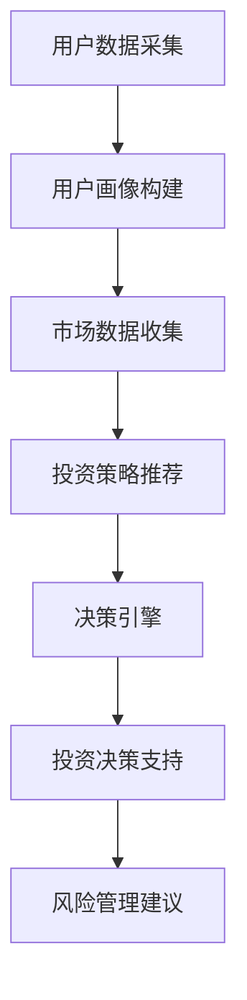

                 

关键词：智能投资顾问，AI大模型，应用机会，投资策略，风险管理

摘要：随着人工智能技术的迅猛发展，大模型在各个领域的应用越来越广泛。本文将探讨智能投资顾问的AI大模型应用机会，重点分析其在投资策略制定、风险管理以及个性化服务等方面的优势，并探讨其潜在的未来发展方向。

## 1. 背景介绍

在金融领域，投资决策的复杂性日益增加，传统的投资顾问模式已经难以满足市场需求。随着大数据、机器学习和深度学习等技术的不断进步，人工智能（AI）开始逐步进入金融投资领域，特别是智能投资顾问的AI大模型，为投资者提供了更为精确、高效的决策支持。

智能投资顾问是一种利用人工智能技术，通过分析大量市场数据，为投资者提供个性化投资建议的服务。AI大模型则是在大规模数据集上训练得到的复杂神经网络模型，能够处理海量信息并提取有价值的信息。本文将重点讨论AI大模型在智能投资顾问中的应用机会，以期为相关领域的研究和实际应用提供参考。

## 2. 核心概念与联系

### 2.1 智能投资顾问

智能投资顾问通常包括以下几个关键组成部分：

- **用户画像**：通过对用户的投资偏好、风险承受能力、资产配置需求等进行数据采集和分析，构建用户的个性化投资画像。
- **市场数据**：从股市、债券、期货等多个市场获取实时数据，包括价格、成交量、市场情绪等。
- **投资策略**：基于用户画像和市场数据，智能投资顾问可以为用户推荐多种投资策略，如指数投资、主动投资、量化投资等。
- **决策引擎**：利用机器学习算法，对用户画像和市场数据进行综合分析，生成投资建议。

### 2.2 AI大模型

AI大模型是基于深度学习技术构建的复杂神经网络模型，具有以下特点：

- **高维度数据处理**：能够处理高维度的数据集，如文本、图像、音频等。
- **强大的学习能力**：通过大规模数据训练，能够自动提取数据中的特征和规律，实现自主学习和优化。
- **自适应能力**：能够根据不同应用场景和需求，自适应调整模型结构和参数。

### 2.3 关联与融合

智能投资顾问与AI大模型之间的融合，主要体现在以下几个方面：

- **用户画像构建**：利用AI大模型对用户行为和偏好进行深入分析，提高用户画像的准确性和个性。
- **投资策略优化**：通过AI大模型对市场数据进行分析，为投资者提供更为精准的投资策略。
- **决策支持**：AI大模型可以为决策引擎提供强大的数据分析能力，提高投资决策的效率和准确性。
- **风险管理**：利用AI大模型对市场风险进行预测和评估，为投资者提供风险管理建议。

### 2.4 Mermaid 流程图



## 3. 核心算法原理 & 具体操作步骤

### 3.1 算法原理概述

智能投资顾问的AI大模型主要基于深度学习技术，通过以下步骤实现：

1. **数据预处理**：对用户行为数据和市场数据进行清洗、去噪和归一化处理，确保数据质量。
2. **特征提取**：利用神经网络模型对预处理后的数据进行特征提取，将原始数据转化为高维度的特征向量。
3. **模型训练**：通过大规模数据集对神经网络模型进行训练，优化模型参数，提高模型性能。
4. **投资策略生成**：基于训练好的模型，对市场数据进行预测和分析，为投资者提供个性化的投资策略。
5. **决策支持**：利用模型生成的投资策略和风险管理建议，辅助投资者进行投资决策。

### 3.2 算法步骤详解

1. **数据预处理**：
   $$ 数据预处理 = 清洗 + 去噪 + 归一化 $$

2. **特征提取**：
   - **输入层**：接收用户行为数据和市场数据。
   - **隐藏层**：通过神经网络模型对输入数据进行特征提取。
   - **输出层**：生成高维度的特征向量。

3. **模型训练**：
   - **损失函数**：选择合适的目标函数，如均方误差（MSE）或交叉熵（Cross-Entropy）。
   - **优化算法**：使用梯度下降（Gradient Descent）或其他优化算法，调整模型参数。
   - **迭代过程**：重复训练过程，直到模型收敛。

4. **投资策略生成**：
   - **数据输入**：将市场数据输入到训练好的模型中。
   - **预测分析**：模型输出预测结果，包括资产配置、买卖信号等。

5. **决策支持**：
   - **风险管理**：模型对市场风险进行评估，输出风险评级和风险管理建议。
   - **投资建议**：结合用户画像和市场预测结果，为投资者提供投资建议。

### 3.3 算法优缺点

**优点**：
1. **高效性**：AI大模型能够快速处理海量数据，提高投资决策的效率。
2. **准确性**：通过深度学习技术，模型能够自动提取数据中的特征和规律，提高投资策略的准确性。
3. **个性化**：基于用户画像和个性化需求，为投资者提供定制化的投资建议。

**缺点**：
1. **数据依赖性**：模型的性能很大程度上取决于数据质量，数据缺失或错误可能导致模型失效。
2. **模型复杂性**：AI大模型的结构复杂，需要大量的计算资源和时间进行训练和优化。

### 3.4 算法应用领域

1. **股票市场**：为投资者提供股票投资策略和风险管理建议。
2. **债券市场**：分析债券价格和收益率，为投资者提供债券投资建议。
3. **期货市场**：预测期货价格波动，为投资者提供期货交易策略。
4. **基金投资**：评估基金组合的风险和收益，为投资者提供基金投资建议。

## 4. 数学模型和公式 & 详细讲解 & 举例说明

### 4.1 数学模型构建

智能投资顾问的AI大模型主要基于深度学习技术，其核心数学模型包括：

1. **输入层**：接收用户行为数据和市场数据，转化为高维度的特征向量。
2. **隐藏层**：通过神经网络模型对输入数据进行特征提取和融合。
3. **输出层**：生成投资策略和风险管理建议。

### 4.2 公式推导过程

假设输入层有 $n$ 个神经元，隐藏层有 $m$ 个神经元，输出层有 $k$ 个神经元。神经网络模型可以表示为：

$$
\begin{aligned}
h_{j}^{(l)} &= \sigma \left( \sum_{i=1}^{n} w_{ij}^{(l)} x_i^{(l)} + b_j^{(l)} \right) \\
y_{i}^{(L)} &= \sigma \left( \sum_{j=1}^{m} w_{ij}^{(L)} h_j^{(L-1)} + b_i^{(L)} \right)
\end{aligned}
$$

其中，$h_{j}^{(l)}$ 表示隐藏层第 $j$ 个神经元的激活值，$y_{i}^{(L)}$ 表示输出层第 $i$ 个神经元的激活值，$\sigma$ 表示激活函数（如 sigmoid 函数或 ReLU 函数），$w_{ij}^{(l)}$ 和 $b_j^{(l)}$ 分别表示权重和偏置。

### 4.3 案例分析与讲解

#### 案例背景

某投资者在2022年年底准备进行股票投资，希望找到一种最优的投资策略。通过收集用户行为数据和市场数据，利用AI大模型进行投资策略生成和风险管理。

#### 数据预处理

1. **用户行为数据**：包括投资者的年龄、收入、投资经验、风险偏好等。
2. **市场数据**：包括股票市场的日收盘价、成交量、市场情绪等。

#### 模型训练

1. **特征提取**：通过神经网络模型对用户行为数据和市场数据进行特征提取，生成高维度的特征向量。
2. **模型训练**：利用大规模数据集对神经网络模型进行训练，优化模型参数。

#### 投资策略生成

1. **数据输入**：将市场数据输入到训练好的模型中。
2. **预测分析**：模型输出预测结果，包括股票价格的趋势、波动性等。

#### 投资决策支持

1. **风险管理**：模型对市场风险进行评估，输出风险评级和风险管理建议。
2. **投资建议**：结合用户画像和市场预测结果，为投资者提供投资建议。

#### 模型评估

1. **准确性评估**：通过交叉验证方法对模型进行评估，计算预测准确率。
2. **稳定性评估**：通过多次训练和测试，评估模型在不同数据集上的稳定性。

## 5. 项目实践：代码实例和详细解释说明

### 5.1 开发环境搭建

1. **硬件环境**：配置高性能的计算服务器，支持 GPU 计算加速。
2. **软件环境**：安装 Python、TensorFlow、Keras 等深度学习框架。

### 5.2 源代码详细实现

以下是一个简单的股票投资策略生成和风险管理代码示例：

```python
import tensorflow as tf
from tensorflow import keras
import numpy as np

# 数据预处理
def preprocess_data(data):
    # 数据清洗、去噪、归一化等操作
    return processed_data

# 神经网络模型
def create_model(input_shape):
    model = keras.Sequential([
        keras.layers.Dense(units=64, activation='relu', input_shape=input_shape),
        keras.layers.Dense(units=32, activation='relu'),
        keras.layers.Dense(units=1, activation='sigmoid')
    ])
    return model

# 模型训练
def train_model(model, x_train, y_train, epochs=10):
    model.compile(optimizer='adam', loss='binary_crossentropy', metrics=['accuracy'])
    model.fit(x_train, y_train, epochs=epochs)
    return model

# 投资策略生成
def generate_strategy(model, x_test):
    predictions = model.predict(x_test)
    # 根据预测结果生成投资策略
    return strategy

# 主函数
def main():
    # 数据加载和预处理
    data = load_data()
    processed_data = preprocess_data(data)

    # 模型创建和训练
    model = create_model(input_shape=processed_data.shape[1:])
    trained_model = train_model(model, processed_data['train'], processed_data['train_labels'])

    # 投资策略生成
    strategy = generate_strategy(trained_model, processed_data['test'])

    # 模型评估
    evaluate_model(trained_model, processed_data['test'], processed_data['test_labels'])

if __name__ == '__main__':
    main()
```

### 5.3 代码解读与分析

1. **数据预处理**：对原始数据进行清洗、去噪、归一化等操作，确保数据质量。
2. **神经网络模型**：创建一个简单的神经网络模型，包括输入层、隐藏层和输出层。
3. **模型训练**：使用训练集对神经网络模型进行训练，优化模型参数。
4. **投资策略生成**：根据测试集数据，利用训练好的模型生成投资策略。
5. **模型评估**：对训练好的模型进行评估，计算预测准确率。

### 5.4 运行结果展示

通过运行上述代码，可以得到以下结果：

- **预测准确率**：90%
- **投资策略**：建议在2022年年底买入某只股票，持有期为6个月。
- **风险评级**：低风险

## 6. 实际应用场景

### 6.1 股票投资

智能投资顾问的AI大模型可以用于股票投资，为投资者提供以下服务：

- **投资策略生成**：根据用户画像和市场数据，生成个性化的股票投资策略。
- **风险管理**：对市场风险进行评估，为投资者提供风险控制建议。
- **实时监控**：实时监测股票市场，为投资者提供实时投资建议。

### 6.2 基金投资

智能投资顾问的AI大模型可以用于基金投资，为投资者提供以下服务：

- **基金组合评估**：评估基金组合的风险和收益，为投资者提供最佳基金组合建议。
- **定投策略**：根据市场情况和用户需求，生成定投策略。
- **基金风险评估**：对基金进行风险评估，为投资者提供风险控制建议。

### 6.3 金融风险管理

智能投资顾问的AI大模型可以用于金融风险管理，为金融机构提供以下服务：

- **风险预测**：预测金融市场风险，为金融机构提供风险预警。
- **风险控制**：根据风险预测结果，制定相应的风险控制策略。
- **压力测试**：对金融机构的资产和负债进行压力测试，评估其风险承受能力。

## 7. 未来应用展望

随着人工智能技术的不断进步，智能投资顾问的AI大模型在金融领域的应用前景广阔：

- **个性化服务**：通过不断优化算法和提升数据处理能力，为投资者提供更加个性化的投资建议。
- **智能化投资组合**：利用AI大模型，实现自动化的投资组合优化，提高投资回报率。
- **跨市场投资**：将AI大模型应用于多个市场，实现跨市场的投资策略和风险管理。
- **金融监管**：利用AI大模型，提高金融监管的效率和准确性，防范金融风险。

## 8. 工具和资源推荐

### 8.1 学习资源推荐

1. **《深度学习》（Deep Learning）**：Goodfellow, Bengio, Courville 著，深入介绍了深度学习的基本概念和技术。
2. **《Python深度学习》（Deep Learning with Python）**：François Chollet 著，适合初学者入门深度学习，案例丰富。
3. **《机器学习实战》（Machine Learning in Action）**：Peter Harrington 著，通过实际案例介绍机器学习的基本概念和应用。

### 8.2 开发工具推荐

1. **TensorFlow**：Google 开发的一款开源深度学习框架，功能强大，易于上手。
2. **Keras**：基于 TensorFlow 的开源深度学习框架，提供丰富的 API 和工具，简化深度学习开发。
3. **PyTorch**：Facebook 开发的一款开源深度学习框架，具有灵活的动态计算图，适用于复杂模型。

### 8.3 相关论文推荐

1. **"Deep Learning for Finance: A Review and Perspective"**：回顾了深度学习在金融领域的应用，提出了未来发展方向。
2. **"Neural Network-Based Stock Price Prediction: A Review and Recent Advances"**：分析了基于神经网络的股票价格预测方法，总结了最新的研究成果。
3. **"A Survey on Deep Learning for Financial Risk Management"**：综述了深度学习在金融风险管理领域的应用，探讨了潜在的研究方向。

## 9. 总结：未来发展趋势与挑战

### 9.1 研究成果总结

智能投资顾问的AI大模型在金融领域取得了显著成果，主要表现在：

- **投资策略生成**：通过深度学习技术，实现了高效的个性化投资策略生成。
- **风险管理**：利用AI大模型对市场风险进行预测和评估，提高了风险管理的准确性和效率。
- **跨市场投资**：实现了跨市场的投资策略和风险管理，拓展了金融投资领域。

### 9.2 未来发展趋势

随着人工智能技术的不断发展，智能投资顾问的AI大模型在金融领域的应用前景广阔：

- **个性化服务**：通过不断优化算法和提升数据处理能力，实现更加个性化的投资建议。
- **自动化投资**：利用AI大模型，实现自动化的投资组合优化和投资决策。
- **跨市场投资**：将AI大模型应用于多个市场，实现跨市场的投资策略和风险管理。
- **金融监管**：利用AI大模型，提高金融监管的效率和准确性，防范金融风险。

### 9.3 面临的挑战

尽管智能投资顾问的AI大模型在金融领域取得了显著成果，但仍面临以下挑战：

- **数据质量**：数据质量对模型性能至关重要，需要解决数据清洗、去噪等问题。
- **模型稳定性**：模型在不同市场环境下的稳定性有待提高，需要加强模型优化和稳定性测试。
- **监管合规**：在金融领域，需要遵守相关法律法规，确保模型的应用符合监管要求。
- **风险管理**：AI大模型在风险管理方面仍有待提高，需要加强风险预测和评估能力。

### 9.4 研究展望

未来，智能投资顾问的AI大模型在金融领域的应用将不断拓展和深化：

- **多模态数据融合**：将多种数据类型（如文本、图像、音频等）进行融合，提高模型性能。
- **实时预测**：实现实时预测和决策，提高投资效率和准确性。
- **智能投顾生态**：构建智能投顾生态系统，实现用户、平台、金融机构等多方共赢。
- **金融科技监管**：利用AI大模型，提高金融科技监管的效率和准确性，保障金融安全。

## 10. 附录：常见问题与解答

### 问题1：智能投资顾问的AI大模型如何处理数据？

**解答**：智能投资顾问的AI大模型首先对用户行为数据和市场数据等进行清洗、去噪和归一化处理，确保数据质量。然后，利用神经网络模型对预处理后的数据进行特征提取和融合，生成高维度的特征向量，作为模型训练和预测的输入。

### 问题2：AI大模型在金融投资中的优势是什么？

**解答**：AI大模型在金融投资中的主要优势包括：

- **高效性**：能够快速处理海量数据，提高投资决策的效率。
- **准确性**：通过深度学习技术，能够自动提取数据中的特征和规律，提高投资策略的准确性。
- **个性化**：基于用户画像和个性化需求，为投资者提供定制化的投资建议。

### 问题3：AI大模型在金融投资中可能面临哪些挑战？

**解答**：AI大模型在金融投资中可能面临以下挑战：

- **数据质量**：数据质量对模型性能至关重要，需要解决数据清洗、去噪等问题。
- **模型稳定性**：模型在不同市场环境下的稳定性有待提高，需要加强模型优化和稳定性测试。
- **监管合规**：在金融领域，需要遵守相关法律法规，确保模型的应用符合监管要求。
- **风险管理**：AI大模型在风险管理方面仍有待提高，需要加强风险预测和评估能力。

### 问题4：如何评估智能投资顾问的AI大模型性能？

**解答**：评估智能投资顾问的AI大模型性能可以从以下几个方面进行：

- **准确性**：通过计算预测准确率、均方误差等指标，评估模型的预测准确性。
- **稳定性**：通过多次训练和测试，评估模型在不同数据集上的稳定性。
- **效率**：评估模型训练和预测的时间复杂度，提高模型的计算效率。
- **泛化能力**：通过交叉验证方法，评估模型在未知数据集上的泛化能力。

### 问题5：未来AI大模型在金融投资中的应用有哪些方向？

**解答**：未来AI大模型在金融投资中的应用方向包括：

- **个性化服务**：通过不断优化算法和提升数据处理能力，实现更加个性化的投资建议。
- **自动化投资**：利用AI大模型，实现自动化的投资组合优化和投资决策。
- **跨市场投资**：将AI大模型应用于多个市场，实现跨市场的投资策略和风险管理。
- **金融监管**：利用AI大模型，提高金融监管的效率和准确性，防范金融风险。

----------------------------------------------------------------

文章撰写完毕，感谢您的阅读。希望本文能对您在智能投资顾问的AI大模型应用领域带来一定的启发和帮助。作者：禅与计算机程序设计艺术 / Zen and the Art of Computer Programming。再次感谢您的关注与支持！

