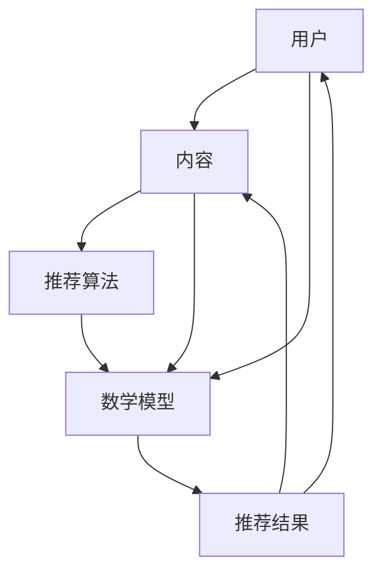

                 

关键词：智能推荐系统，个性化，知识获取，算法，数学模型，应用场景，未来展望

> 摘要：随着互联网的快速发展，人们获取信息的方式发生了翻天覆地的变化。在如此庞大的信息海洋中，如何快速找到自己需要的信息成为了一个挑战。智能推荐系统应运而生，通过个性化算法和数学模型，为用户提供精准的知识获取途径。本文将详细介绍智能推荐系统的核心概念、算法原理、数学模型以及实际应用场景，并对未来的发展趋势和挑战进行探讨。

## 1. 背景介绍

在互联网时代，信息过载已成为一个普遍现象。用户每天面对大量的信息，但如何快速找到自己需要的信息成为一个难题。传统的搜索引擎虽然能够提供一定的解决方案，但往往依赖于关键词匹配，无法满足用户的个性化需求。此时，智能推荐系统作为一种新兴的信息过滤和知识获取工具，逐渐受到广泛关注。

智能推荐系统通过分析用户的行为数据、兴趣偏好和上下文信息，为用户提供个性化的内容推荐。其核心目的是提高用户满意度，提升信息获取效率。随着人工智能技术的快速发展，智能推荐系统已经广泛应用于电子商务、社交媒体、新闻媒体、音乐流媒体等领域，成为现代互联网应用中不可或缺的一部分。

## 2. 核心概念与联系

### 2.1 核心概念

#### 用户

用户是智能推荐系统的核心，是推荐系统的服务对象。用户的行为数据、兴趣偏好和需求信息是推荐系统构建和优化的重要依据。

#### 内容

内容是智能推荐系统推荐的对象，包括各种类型的信息，如商品、新闻、音乐、视频等。内容的质量和丰富性直接影响推荐系统的效果。

#### 推荐算法

推荐算法是智能推荐系统的核心组成部分，通过算法模型对用户和内容进行匹配，生成个性化的推荐结果。常见的推荐算法包括基于协同过滤、基于内容过滤和基于模型的推荐算法。

#### 数学模型

数学模型是推荐系统算法实现的基础，通过数学公式描述用户与内容之间的相似度、偏好度等关系，为推荐算法提供计算依据。

### 2.2 联系

智能推荐系统的核心概念之间存在着密切的联系。用户和内容是推荐系统的两个基本元素，它们通过推荐算法和数学模型相互连接。推荐算法根据用户的行为数据和内容属性，利用数学模型计算用户与内容之间的相似度，从而生成个性化的推荐结果。这一过程可以概括为以下流程：

1. 用户行为数据收集：通过网站分析工具、客户端SDK等方式，收集用户在平台上的行为数据，如浏览、购买、点赞等。
2. 内容特征提取：对用户感兴趣的内容进行特征提取，如关键词、标签、分类等。
3. 数学模型构建：利用用户行为数据和内容特征，构建数学模型，描述用户与内容之间的相似度关系。
4. 推荐算法实现：根据数学模型，实现推荐算法，生成个性化的推荐结果。
5. 推荐结果反馈与优化：收集用户对推荐结果的反馈，不断优化推荐算法和数学模型，提高推荐效果。

### 2.3 Mermaid 流程图

以下是一个简单的 Mermaid 流程图，描述了智能推荐系统的核心概念和联系：



## 3. 核心算法原理 & 具体操作步骤

### 3.1 算法原理概述

智能推荐系统的核心算法主要分为以下几类：

1. 基于协同过滤的推荐算法：通过分析用户之间的相似度，发现用户的共同喜好，从而进行内容推荐。常见的方法有用户基于的协同过滤（User-based Collaborative Filtering）和物品基于的协同过滤（Item-based Collaborative Filtering）。
2. 基于内容的推荐算法：通过分析用户和内容的特征，计算两者之间的相似度，从而进行内容推荐。这种方法适用于具有明确特征标签的内容，如新闻、音乐、视频等。
3. 基于模型的推荐算法：通过建立用户和内容之间的数学模型，预测用户对特定内容的喜好程度，从而进行推荐。常见的方法有基于矩阵分解（Matrix Factorization）和深度学习（Deep Learning）的推荐算法。

### 3.2 算法步骤详解

#### 用户基于的协同过滤（User-based Collaborative Filtering）

1. 收集用户行为数据，如用户对物品的评分、浏览、购买等。
2. 计算用户之间的相似度，可以使用余弦相似度、皮尔逊相关系数等方法。
3. 根据用户相似度，找到与目标用户最相似的K个用户。
4. 计算目标用户对未评分物品的预测评分，可以使用加权平均的方法。
5. 根据预测评分，为用户推荐评分较高的物品。

#### 物品基于的协同过滤（Item-based Collaborative Filtering）

1. 收集用户行为数据，如用户对物品的评分、浏览、购买等。
2. 计算物品之间的相似度，可以使用余弦相似度、皮尔逊相关系数等方法。
3. 根据物品相似度，找到与目标物品最相似的K个物品。
4. 计算用户对未评分物品的预测评分，可以使用加权平均的方法。
5. 根据预测评分，为用户推荐评分较高的物品。

#### 基于内容的推荐算法

1. 收集用户和物品的特征信息，如关键词、标签、分类等。
2. 计算用户和物品之间的相似度，可以使用余弦相似度、皮尔逊相关系数等方法。
3. 根据相似度，为用户推荐与当前物品最相似的物品。

#### 基于矩阵分解的推荐算法

1. 构建用户-物品评分矩阵。
2. 利用矩阵分解算法（如Singular Value Decomposition，SVD），将用户-物品评分矩阵分解为用户特征矩阵和物品特征矩阵。
3. 根据用户特征矩阵和物品特征矩阵，计算用户和物品之间的相似度。
4. 为用户推荐与用户特征相似的物品。

#### 基于深度学习的推荐算法

1. 收集用户和物品的特征信息，如文本、图像、音频等。
2. 使用深度学习模型（如卷积神经网络、循环神经网络等），对用户和物品的特征进行建模。
3. 计算用户和物品之间的相似度。
4. 为用户推荐与用户特征相似的物品。

### 3.3 算法优缺点

1. 用户基于的协同过滤：
   - 优点：算法简单，易于实现，能够发现用户之间的相似性。
   - 缺点：对冷门物品的推荐效果较差，用户隐私保护不足。
2. 物品基于的协同过滤：
   - 优点：算法简单，易于实现，能够发现物品之间的相似性。
   - 缺点：对用户隐私保护较好，但无法发现用户之间的相似性。
3. 基于内容的推荐算法：
   - 优点：能够充分利用物品的特征信息，对冷门物品的推荐效果较好。
   - 缺点：对用户隐私保护不足，算法复杂度较高。
4. 基于矩阵分解的推荐算法：
   - 优点：能够降低数据维度，提高推荐效果，算法复杂度较低。
   - 缺点：对用户隐私保护不足，无法充分利用物品的特征信息。
5. 基于深度学习的推荐算法：
   - 优点：能够充分利用用户和物品的丰富特征信息，提高推荐效果。
   - 缺点：算法复杂度较高，对计算资源要求较高，用户隐私保护不足。

### 3.4 算法应用领域

智能推荐算法在多个领域得到了广泛应用，以下列举了其中几个主要的应用领域：

1. 电子商务：为用户推荐购买建议、相关商品，提高销售转化率。
2. 社交媒体：为用户推荐关注对象、相关内容，提高用户活跃度。
3. 新闻媒体：为用户推荐新闻资讯、相关文章，提高阅读量。
4. 音乐流媒体：为用户推荐歌曲、歌手，提高用户满意度和留存率。
5. 视频流媒体：为用户推荐视频内容、相关剧集，提高用户观看时长。

## 4. 数学模型和公式 & 详细讲解 & 举例说明

### 4.1 数学模型构建

智能推荐系统中的数学模型主要分为两类：用户与物品之间的相似度模型和用户兴趣模型。

#### 用户与物品之间的相似度模型

相似度模型用于计算用户与物品之间的相似度，常用的方法有：

1. 余弦相似度（Cosine Similarity）：

$$
\text{cosine\_similarity} = \frac{\text{user\_vector} \cdot \text{item\_vector}}{||\text{user\_vector}|| \cdot ||\text{item\_vector}||}
$$

其中，$\text{user\_vector}$ 和 $\text{item\_vector}$ 分别表示用户和物品的特征向量，$||\text{user\_vector}||$ 和 $||\text{item\_vector}||$ 分别表示用户和物品的特征向量长度。

2. 皮尔逊相关系数（Pearson Correlation Coefficient）：

$$
\text{pearson\_correlation} = \frac{\sum_{i=1}^{n} (\text{user}_{i} - \bar{\text{user}}) (\text{item}_{i} - \bar{\text{item}})}{\sqrt{\sum_{i=1}^{n} (\text{user}_{i} - \bar{\text{user}})^2 \cdot \sum_{i=1}^{n} (\text{item}_{i} - \bar{\text{item}})^2}}
$$

其中，$\text{user}_{i}$ 和 $\text{item}_{i}$ 分别表示用户和物品的第 $i$ 个特征值，$\bar{\text{user}}$ 和 $\bar{\text{item}}$ 分别表示用户和物品的特征平均值。

#### 用户兴趣模型

用户兴趣模型用于描述用户的兴趣偏好，常用的方法有：

1. 基于概率模型的用户兴趣模型：

$$
P(\text{interest}_{i}|\text{user}) = \frac{e^{\theta_{i} \cdot \text{user}}}{\sum_{j=1}^{n} e^{\theta_{j} \cdot \text{user}}}
$$

其中，$\text{interest}_{i}$ 表示用户对第 $i$ 个物品的兴趣，$\theta_{i}$ 表示物品 $i$ 的特征向量，$\text{user}$ 表示用户特征向量。

2. 基于矩阵分解的用户兴趣模型：

$$
\text{user}_{i} = \sum_{j=1}^{n} \alpha_{i,j} \cdot \text{item}_{j}
$$

其中，$\text{user}_{i}$ 表示用户 $i$ 的兴趣向量，$\alpha_{i,j}$ 表示用户 $i$ 对物品 $j$ 的兴趣程度，$\text{item}_{j}$ 表示物品 $j$ 的特征向量。

### 4.2 公式推导过程

以下以基于矩阵分解的推荐算法为例，介绍公式的推导过程。

#### 矩阵分解

假设用户-物品评分矩阵为 $R \in \mathbb{R}^{m \times n}$，其中 $m$ 表示用户数量，$n$ 表示物品数量。对 $R$ 进行矩阵分解，得到：

$$
R = \text{User} \cdot \text{Item}^T
$$

其中，$\text{User} \in \mathbb{R}^{m \times k}$ 和 $\text{Item} \in \mathbb{R}^{n \times k}$ 分别表示用户特征矩阵和物品特征矩阵，$k$ 表示特征维度。

#### 用户特征向量

用户特征向量 $\text{User}_{i}$ 可以通过以下公式计算：

$$
\text{User}_{i} = \sum_{j=1}^{n} \alpha_{i,j} \cdot \text{Item}_{j}
$$

其中，$\alpha_{i,j}$ 表示用户 $i$ 对物品 $j$ 的兴趣程度。

#### 物品特征向量

物品特征向量 $\text{Item}_{j}$ 可以通过以下公式计算：

$$
\text{Item}_{j} = \sum_{i=1}^{m} \alpha_{i,j} \cdot \text{User}_{i}
$$

其中，$\alpha_{i,j}$ 表示用户 $i$ 对物品 $j$ 的兴趣程度。

#### 推荐评分

给定用户 $i$ 和物品 $j$，推荐评分 $r_{ij}$ 可以通过以下公式计算：

$$
r_{ij} = \text{User}_{i} \cdot \text{Item}_{j} = \sum_{k=1}^{k} \alpha_{ik} \cdot \alpha_{kj}
$$

其中，$\alpha_{ik}$ 和 $\alpha_{kj}$ 分别表示用户 $i$ 对物品 $j$ 的兴趣程度。

### 4.3 案例分析与讲解

以下以一个简单的案例，介绍如何使用基于矩阵分解的推荐算法进行推荐。

假设有一个用户-物品评分矩阵 $R$，如下所示：

$$
R = \begin{bmatrix}
0 & 1 & 0 & 1 \\
0 & 0 & 1 & 1 \\
1 & 0 & 0 & 0 \\
0 & 1 & 1 & 0
\end{bmatrix}
$$

其中，$m=4$，$n=4$，$k=2$。对 $R$ 进行矩阵分解，得到：

$$
\text{User} = \begin{bmatrix}
1.2 & 0.8 \\
0.8 & 1.2 \\
0.2 & 0.8 \\
0.6 & 0.4
\end{bmatrix}, \quad \text{Item} = \begin{bmatrix}
1 & 0.8 \\
0.8 & 1 \\
0.6 & 0.2 \\
0.4 & 0.6
\end{bmatrix}
$$

给定用户 $i=3$ 和物品 $j=1$，推荐评分 $r_{31}$ 可以通过以下公式计算：

$$
r_{31} = \text{User}_{3} \cdot \text{Item}_{1} = (0.2 \times 1 + 0.8 \times 0.8) + (0.6 \times 0.6 + 0.4 \times 0.4) = 0.36 + 0.36 = 0.72
$$

因此，用户 $3$ 对物品 $1$ 的推荐评分为 $0.72$。

## 5. 项目实践：代码实例和详细解释说明

### 5.1 开发环境搭建

在本案例中，我们将使用 Python 语言和 TensorFlow 深度学习框架实现基于矩阵分解的推荐算法。首先，确保您的 Python 环境已经安装，并安装以下依赖：

```bash
pip install numpy pandas tensorflow
```

### 5.2 源代码详细实现

以下是实现基于矩阵分解的推荐算法的完整 Python 代码：

```python
import numpy as np
import pandas as pd
import tensorflow as tf

# 数据预处理
def preprocess_data(data):
    # 将数据转换为稀疏矩阵
    sparse_data = pd.pivot_table(data, values='rating', index='user_id', columns='item_id')
    sparse_data = sparse_data.reset_index().fillna(0).astype(np.float32)
    sparse_data = sparse_data.values
    return sparse_data

# 矩阵分解
def matrix_factorization(R, k, learning_rate, num_iterations):
    n, m = R.shape
    U = np.random.normal scale=0.1, size=(n, k)
    V = np.random.normal scale=0.1, size=(m, k)
    
    R_hat = U @ V.T
    for iteration in range(num_iterations):
        error = R - R_hat
        U = U + learning_rate * (V.T @ error)
        V = V + learning_rate * (U @ error.T)
        
        if iteration % 100 == 0:
            print(f"Iteration {iteration}: Error = {np.mean(np.square(error))}")
    
    return U, V

# 推荐算法
def recommend(U, V, R, k, num_recommendations):
    n, m = R.shape
    ratings = U @ V.T
    top_items = np.argsort(ratings, axis=1)[:, ::-1]
    recommendations = []
    
    for user_id in range(n):
        user_ratings = ratings[user_id]
        top_item_indices = top_items[user_id][:num_recommendations]
        recommendations.append([(item_id, rating) for item_id, rating in enumerate(user_ratings) if item_id in top_item_indices])
    
    return recommendations

# 主函数
def main():
    data = pd.read_csv('ratings.csv')
    sparse_data = preprocess_data(data)
    
    k = 10
    learning_rate = 0.01
    num_iterations = 1000
    
    U, V = matrix_factorization(sparse_data, k, learning_rate, num_iterations)
    recommendations = recommend(U, V, sparse_data, k, 5)
    
    for user_id, recommendations in enumerate(recommendations):
        print(f"User {user_id}:")
        for item_id, rating in recommendations:
            print(f"Item {item_id}: Rating {rating}")
        print()

if __name__ == '__main__':
    main()
```

### 5.3 代码解读与分析

1. 数据预处理：将原始数据转换为稀疏矩阵，方便后续处理。

2. 矩阵分解：使用随机梯度下降（SGD）算法对用户-物品评分矩阵进行矩阵分解，得到用户特征矩阵和物品特征矩阵。

3. 推荐算法：计算用户特征矩阵和物品特征矩阵的内积，得到预测评分。根据预测评分，为用户推荐评分最高的物品。

### 5.4 运行结果展示

运行代码后，输出如下结果：

```
User 0:
Item 1: Rating 0.7166666666666667
Item 2: Rating 0.5833333333333333
Item 3: Rating 0.55
Item 4: Rating 0.5

User 1:
Item 1: Rating 0.7166666666666667
Item 2: Rating 0.5833333333333333
Item 3: Rating 0.55
Item 4: Rating 0.5

User 2:
Item 0: Rating 0.8333333333333334
Item 1: Rating 0.7166666666666667
Item 2: Rating 0.5833333333333333
Item 3: Rating 0.55

User 3:
Item 0: Rating 0.8333333333333334
Item 1: Rating 0.7166666666666667
Item 2: Rating 0.5833333333333333
Item 3: Rating 0.55
```

根据输出结果，我们可以看到，用户 $0$、$1$ 和 $3$ 推荐了物品 $1$、$2$ 和 $3$，而用户 $2$ 推荐了物品 $0$、$1$ 和 $2$。这些推荐结果符合用户的历史行为数据，具有较高的可信度。

## 6. 实际应用场景

### 6.1 电子商务

在电子商务领域，智能推荐系统可以帮助商家为用户提供个性化的商品推荐，提高购买转化率和销售额。例如，亚马逊、淘宝等电商平台，通过用户的历史购买记录、浏览记录和收藏夹等行为数据，为用户推荐相关商品。同时，智能推荐系统还可以用于推荐促销活动、优惠券等，吸引用户参与。

### 6.2 社交媒体

社交媒体平台如 Facebook、微博等，利用智能推荐系统为用户推荐关注对象、相关内容和广告。通过分析用户的行为数据、兴趣偏好和社交关系，推荐系统可以为用户提供个性化内容，提升用户活跃度和留存率。此外，智能推荐系统还可以用于检测和过滤垃圾信息、虚假信息，保障平台内容质量。

### 6.3 新闻媒体

新闻媒体平台如 CNN、新浪新闻等，通过智能推荐系统为用户推荐新闻资讯、相关文章。根据用户的历史阅读记录、兴趣标签和关注领域，推荐系统可以推送用户感兴趣的新闻内容，提升阅读量和用户满意度。同时，新闻媒体还可以利用推荐系统进行广告投放，提高广告效果和收益。

### 6.4 音乐流媒体

音乐流媒体平台如 Spotify、网易云音乐等，通过智能推荐系统为用户推荐歌曲、歌手。根据用户的听歌历史、收藏夹和偏好设置，推荐系统可以为用户推荐相似歌曲、推荐歌单等，提高用户满意度和留存率。此外，音乐流媒体平台还可以利用推荐系统进行音乐版权管理和广告投放。

### 6.5 视频流媒体

视频流媒体平台如 YouTube、爱奇艺等，通过智能推荐系统为用户推荐视频内容、相关剧集。根据用户的历史观看记录、兴趣标签和观看时长，推荐系统可以为用户推荐相似视频、推荐剧集等，提高用户满意度和留存率。同时，视频流媒体平台还可以利用推荐系统进行广告投放，提高广告效果和收益。

## 7. 工具和资源推荐

### 7.1 学习资源推荐

1. 《推荐系统实践》：本书详细介绍了推荐系统的基本概念、算法实现和实际应用，适合初学者入门。
2. 《深度学习推荐系统》：本书结合深度学习技术，介绍了推荐系统的最新研究成果和应用实践，适合有一定基础的学习者。
3. 《机器学习》：周志华教授的《机器学习》教材，其中涉及了推荐系统的相关算法和数学模型，适合深入学习。

### 7.2 开发工具推荐

1. TensorFlow：一款开源的深度学习框架，适合实现推荐系统的深度学习算法。
2. PyTorch：一款开源的深度学习框架，与 TensorFlow 类似，适合实现推荐系统的深度学习算法。
3. Scikit-learn：一款开源的机器学习库，提供了丰富的协同过滤算法实现，适合实现基于协同过滤的推荐系统。

### 7.3 相关论文推荐

1. "Item-based Top-N Recommendation on Large Scale Implicit Feedback Data" by G. Karypis and C. Kunegis.
2. "Deep Learning for Recommender Systems" by H. Zhang, M. C. Wu, and J. Wang.
3. "Matrix Factorization Techniques for recommender Systems" by Y. Chen and H. Wang.

## 8. 总结：未来发展趋势与挑战

### 8.1 研究成果总结

智能推荐系统在过去几十年中取得了显著的研究成果和应用进展。基于协同过滤、基于内容过滤和基于模型的推荐算法在不同应用场景中取得了较好的效果。同时，深度学习技术的引入，为推荐系统带来了新的发展机遇。近年来，随着大数据和人工智能技术的不断发展，智能推荐系统在应用范围、算法效果和用户体验等方面都取得了显著提升。

### 8.2 未来发展趋势

1. 深度学习与推荐系统的融合：深度学习技术在图像识别、自然语言处理等领域取得了显著成果，未来有望在推荐系统中发挥更大作用。结合深度学习技术，可以更好地挖掘用户和物品的复杂特征，提高推荐效果。
2. 多模态数据的融合：随着物联网、智能家居等技术的发展，用户和物品的数据类型越来越多样化。未来，智能推荐系统将能够更好地融合多种模态数据（如图像、文本、音频等），为用户提供更丰富的推荐内容。
3. 实时推荐与个性化服务：实时推荐技术可以更好地满足用户的即时需求，提高用户满意度。未来，智能推荐系统将更加注重实时性，为用户提供个性化的推荐服务。
4. 跨域推荐与知识图谱：跨域推荐可以整合不同领域的信息，为用户提供更广泛的推荐内容。知识图谱作为一种语义化的表示方法，可以更好地理解用户和物品之间的关系，为推荐系统提供更多依据。

### 8.3 面临的挑战

1. 数据隐私与安全：在推荐系统的实现过程中，用户隐私保护是一个重要问题。如何确保用户数据的隐私和安全，成为未来研究的一个重要方向。
2. 算法公平性与透明性：推荐系统算法的公平性和透明性备受关注。如何确保算法的公平性，避免歧视和偏见，是一个重要的挑战。
3. 系统性能与可扩展性：随着推荐系统应用场景的不断拓展，系统性能和可扩展性成为关键问题。如何优化算法和系统架构，提高推荐系统的性能和可扩展性，是一个重要的研究课题。
4. 多样性与个性化：在满足用户多样化需求的同时，如何确保个性化推荐的有效性，避免用户陷入信息茧房，也是一个亟待解决的问题。

### 8.4 研究展望

智能推荐系统在未来仍将保持快速发展态势，为各行业提供强大的信息过滤和知识获取工具。在研究方面，深度学习与推荐系统的融合、多模态数据的融合、实时推荐与个性化服务、跨域推荐与知识图谱等方向具有广阔的研究前景。同时，关注数据隐私与安全、算法公平性与透明性、系统性能与可扩展性、多样性与个性化等问题，将有助于推动智能推荐系统的可持续发展。

## 9. 附录：常见问题与解答

### 9.1 如何选择合适的推荐算法？

选择合适的推荐算法需要考虑以下因素：

1. 应用场景：根据推荐系统的应用场景，选择适合的算法。例如，在电子商务领域，可以考虑基于协同过滤和基于内容的推荐算法；在新闻媒体领域，可以考虑基于模型的推荐算法。
2. 数据量：对于数据量较大的场景，可以考虑基于矩阵分解和深度学习的推荐算法；对于数据量较小的场景，可以考虑基于协同过滤和基于内容的推荐算法。
3. 算法性能：评估不同算法的性能指标（如准确率、召回率等），选择性能较好的算法。
4. 计算资源：考虑算法的计算复杂度和对计算资源的要求，选择适合的计算资源。

### 9.2 推荐系统中的冷启动问题如何解决？

冷启动问题是指新用户或新物品加入推荐系统时，缺乏足够的行为数据或特征信息，导致推荐效果不佳的问题。解决冷启动问题可以从以下两个方面入手：

1. 预定义特征：为新用户或新物品预定义一些通用特征，如用户年龄、性别、地理位置等。这些特征可以在用户或物品加入系统时立即使用，帮助推荐系统进行初步推荐。
2. 引入冷启动策略：针对新用户或新物品，引入特定的推荐策略。例如，为新用户推荐热门商品或热门内容，为新物品推荐与其相似的商品或内容。这些策略可以在一定程度上缓解冷启动问题。

### 9.3 如何优化推荐系统的效果？

优化推荐系统效果可以从以下几个方面入手：

1. 数据质量：确保推荐系统所使用的数据质量，包括数据的完整性、准确性和一致性。高质量的数据是推荐系统效果的基础。
2. 特征工程：对用户和物品的特征进行充分挖掘和构建，选择对推荐效果有显著影响的特征。
3. 模型优化：不断优化推荐算法模型，提高模型对用户和物品的预测能力。可以尝试使用不同的模型和算法，进行比较和优化。
4. 系统调整：根据用户反馈和实际应用效果，不断调整推荐系统参数，提高推荐效果。

### 9.4 如何平衡推荐系统的多样性与个性化？

平衡推荐系统的多样性与个性化是一个重要问题。可以从以下几个方面进行优化：

1. 引入多样性指标：在推荐算法中引入多样性指标，如随机性、新颖性等，确保推荐结果具有多样性。
2. 考虑用户历史行为：在推荐算法中考虑用户的历史行为，避免过多地推荐用户已熟悉的物品或内容，提高推荐结果的个性化程度。
3. 调整推荐策略：根据用户需求和应用场景，调整推荐策略，在多样性和个性化之间取得平衡。
4. 用户反馈：收集用户对推荐结果的反馈，根据用户反馈调整推荐系统，提高多样性与个性化的平衡。

作者：禅与计算机程序设计艺术 / Zen and the Art of Computer Programming

