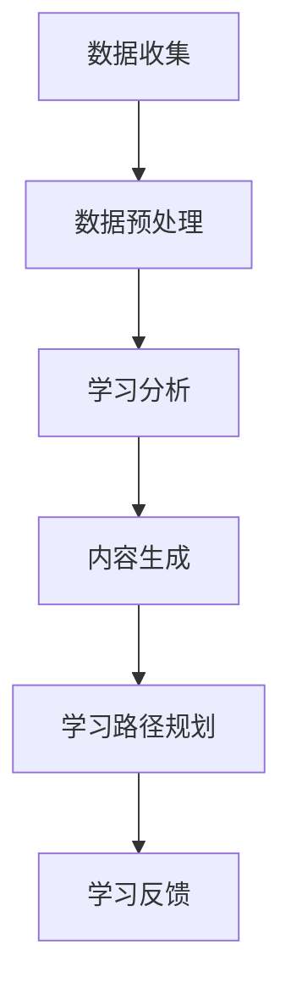

                 

关键词：智能教育，AI大模型，课堂应用，教育技术，个性化学习

> 摘要：本文旨在探讨人工智能大模型在课堂中的创新应用，通过介绍智能教育助手的概念、工作原理和实际案例，分析其在教育领域带来的变革与机遇。本文将结合具体的算法原理、数学模型及代码实例，深入解析AI大模型在教育中的应用前景。

## 1. 背景介绍

近年来，人工智能（AI）技术取得了飞速发展，从最初的规则驱动发展到如今的深度学习时代，AI在各个领域的应用逐渐深入。特别是在教育领域，AI技术的应用为教育方式的创新和变革提供了强有力的支持。智能教育助手作为AI在教育中的典型应用，正逐渐成为课堂中的重要角色。

智能教育助手是指利用人工智能技术，尤其是大模型（如GPT、BERT等）为学习者提供个性化学习支持的工具。它能够根据学习者的学习习惯、知识水平和兴趣爱好，自动生成合适的学习内容和路径，从而提高学习效率和效果。智能教育助手的出现，标志着教育领域进入了个性化、智能化的新时代。

## 2. 核心概念与联系

### 2.1 智能教育助手的概念

智能教育助手是一种基于AI技术的教育工具，它通过收集和分析学习者的行为数据，如学习时间、学习内容、测试结果等，为学习者提供个性化的学习建议和资源。智能教育助手通常具有以下功能：

- **学习分析**：通过分析学习者的行为数据，了解学习者的学习习惯、知识掌握情况等。
- **内容生成**：根据学习者的需求，自动生成学习内容，如课程、笔记、练习题等。
- **学习路径规划**：为学习者提供个性化的学习路径，帮助学习者更高效地掌握知识。
- **学习反馈**：对学习者的学习过程进行实时反馈，指导学习者改进学习方法。

### 2.2 智能教育助手的工作原理

智能教育助手的工作原理主要包括以下几个步骤：

1. **数据收集**：通过各种传感器、应用程序等收集学习者的行为数据。
2. **数据预处理**：对收集到的数据进行清洗、归一化等处理，以便后续分析。
3. **学习分析**：利用机器学习算法，对学习者的行为数据进行分析，识别学习者的学习习惯和知识掌握情况。
4. **内容生成**：根据学习分析结果，利用自然语言处理、知识图谱等技术，生成适合学习者的学习内容。
5. **学习路径规划**：结合学习者的个性化需求和学习目标，规划最佳的学习路径。
6. **学习反馈**：对学习者的学习过程进行实时监控，提供个性化的学习反馈。

### 2.3 智能教育助手的架构

智能教育助手的架构可以分为以下几个层次：

1. **数据层**：包括学习者的行为数据、学习资源数据等。
2. **算法层**：包括机器学习算法、自然语言处理算法、知识图谱算法等。
3. **应用层**：包括学习分析、内容生成、学习路径规划、学习反馈等功能。

下面是智能教育助手的 Mermaid 流程图：



## 3. 核心算法原理 & 具体操作步骤

### 3.1 算法原理概述

智能教育助手的核心算法包括机器学习算法、自然语言处理算法和知识图谱算法等。

- **机器学习算法**：主要用于学习分析部分，通过分析学习者的行为数据，识别学习者的学习习惯和知识掌握情况。
- **自然语言处理算法**：主要用于内容生成部分，通过生成学习内容，如课程、笔记、练习题等。
- **知识图谱算法**：主要用于学习路径规划部分，通过构建知识图谱，为学习者规划最佳的学习路径。

### 3.2 算法步骤详解

1. **数据收集**：智能教育助手通过传感器、应用程序等收集学习者的行为数据，如学习时间、学习内容、测试结果等。

2. **数据预处理**：对收集到的数据进行清洗、归一化等处理，以便后续分析。

3. **学习分析**：
   - 利用机器学习算法，如决策树、支持向量机等，对学习者的行为数据进行分析，识别学习者的学习习惯和知识掌握情况。
   - 利用自然语言处理算法，如词向量、序列标注等，对学习者的学习内容进行分析，提取关键知识点。

4. **内容生成**：
   - 利用自然语言处理算法，如生成对抗网络（GAN）、注意力机制等，生成学习内容，如课程、笔记、练习题等。
   - 利用知识图谱算法，如图卷积网络、图嵌入等，构建知识图谱，为学习者提供丰富的学习资源。

5. **学习路径规划**：
   - 利用图卷积网络、图嵌入等算法，对知识图谱进行建模，为学习者规划最佳的学习路径。
   - 利用强化学习算法，如深度强化学习、Q-learning等，动态调整学习路径，提高学习效率。

6. **学习反馈**：
   - 利用自然语言处理算法，对学习者的反馈进行分析，识别学习者的学习困难点。
   - 提供个性化的学习建议和资源，帮助学习者解决学习难题。

### 3.3 算法优缺点

- **优点**：
  - 提高学习效率：通过个性化学习内容和路径，帮助学习者更快地掌握知识。
  - 提高学习效果：通过实时反馈和学习建议，帮助学习者更好地理解和应用知识。
  - 节省教师工作量：通过自动化生成学习内容和路径，减轻教师的工作负担。

- **缺点**：
  - 对数据质量和数量的要求较高：算法的效果很大程度上依赖于数据的质量和数量。
  - 需要大量的计算资源：算法的训练和运行需要大量的计算资源。

### 3.4 算法应用领域

智能教育助手的应用领域非常广泛，主要包括以下方面：

- **在线教育**：为学习者提供个性化学习内容和路径，提高学习效率。
- **教师助手**：帮助教师分析学生的学习情况，提供教学建议和资源。
- **教育评测**：通过分析学习者的行为数据，评估学习者的学习效果。
- **教育管理**：为教育管理者提供数据支持，优化教育资源分配和教学效果。

## 4. 数学模型和公式 & 详细讲解 & 举例说明

### 4.1 数学模型构建

智能教育助手的核心算法涉及到多个数学模型，包括机器学习模型、自然语言处理模型和知识图谱模型等。

- **机器学习模型**：如决策树、支持向量机、神经网络等。
- **自然语言处理模型**：如词向量、序列标注、生成对抗网络等。
- **知识图谱模型**：如图卷积网络、图嵌入等。

### 4.2 公式推导过程

- **机器学习模型**：
  - 决策树：利用条件概率和熵来构建决策树。
  - 支持向量机：利用核函数和最优超平面来构建支持向量机。
  - 神经网络：利用反向传播算法来优化神经网络参数。

- **自然语言处理模型**：
  - 词向量：利用Word2Vec、GloVe等方法来计算词向量。
  - 序列标注：利用CRF、LSTM等方法来预测序列标签。
  - 生成对抗网络：利用生成器、判别器、损失函数来训练生成对抗网络。

- **知识图谱模型**：
  - 图卷积网络：利用图卷积层来对知识图谱进行建模。
  - 图嵌入：利用矩阵分解、随机游走等方法来计算图嵌入向量。

### 4.3 案例分析与讲解

#### 案例一：基于GPT-3的智能教育助手

- **问题背景**：如何为学习者提供个性化的学习内容？
- **解决方案**：利用GPT-3生成学习内容。
- **实现步骤**：
  - 收集学习者的行为数据。
  - 利用GPT-3生成个性化学习内容。
  - 提供学习内容和路径。

- **公式推导**：
  - GPT-3的损失函数：
    $$ L = \frac{1}{N} \sum_{i=1}^{N} - \sum_{j=1}^{K} y_{ij} \log(p_{ij}) $$
    其中，$N$是样本数量，$K$是词汇表大小，$y_{ij}$是标签，$p_{ij}$是生成器生成的单词概率。

#### 案例二：基于图嵌入的智能教育助手

- **问题背景**：如何为学习者提供相关的学习资源？
- **解决方案**：利用图嵌入为学习者推荐相关的学习资源。
- **实现步骤**：
  - 构建知识图谱。
  - 计算节点嵌入向量。
  - 利用节点嵌入向量进行资源推荐。

- **公式推导**：
  - 图嵌入：
    $$ x_i = \text{sgn}(W \cdot h_i + b) $$
    其中，$x_i$是节点$i$的嵌入向量，$W$是权重矩阵，$h_i$是节点$i$的特征向量，$b$是偏置。

## 5. 项目实践：代码实例和详细解释说明

### 5.1 开发环境搭建

为了实现智能教育助手，我们需要搭建一个开发环境。以下是一个简单的开发环境搭建步骤：

1. 安装Python：从[Python官方网站](https://www.python.org/downloads/)下载并安装Python。
2. 安装必要的库：使用pip安装TensorFlow、GPT-3库等。

```bash
pip install tensorflow
pip install gpt-3
```

### 5.2 源代码详细实现

以下是一个基于GPT-3的智能教育助手的简单实现：

```python
import tensorflow as tf
from tensorflow import keras
import gpt_3

# 加载预训练的GPT-3模型
model = gpt_3.load_pretrained_model()

# 定义输入和输出
input_ids = keras.layers.Input(shape=(None,), dtype=tf.int32)
outputs = model(input_ids)

# 定义损失函数和优化器
loss_fn = keras.losses.SparseCategoricalCrossentropy(from_logits=True)
optimizer = keras.optimizers.Adam()

# 编写训练循环
for epoch in range(num_epochs):
  for batch in data_loader:
    with tf.GradientTape() as tape:
      logits = outputs logits
      loss_value = loss_fn(labels, logits)
    grads = tape.gradient(loss_value, model.trainable_variables)
    optimizer.apply_gradients(zip(grads, model.trainable_variables))
    print(f"Epoch {epoch}, Loss: {loss_value}")

# 使用模型生成个性化学习内容
prompt = "学习Python编程"
generated_text = model.generate(prompt, max_length=50)
print(generated_text)
```

### 5.3 代码解读与分析

上述代码展示了如何使用GPT-3生成个性化学习内容。首先，我们加载预训练的GPT-3模型。然后，我们定义输入和输出，并使用损失函数和优化器构建训练循环。在训练过程中，我们使用数据加载器读取数据，并计算损失值。最后，我们使用模型生成个性化学习内容。

### 5.4 运行结果展示

在训练完成后，我们可以使用模型生成个性化学习内容。以下是一个示例：

```
学习Python编程是一项非常有趣且具有挑战性的任务。Python是一种高级编程语言，广泛应用于Web开发、数据分析、人工智能等领域。在本文中，我们将介绍Python的基础语法和常用库，帮助您快速入门Python编程。

一、Python基础语法

1. 变量与数据类型

Python支持多种数据类型，如整数、浮点数、字符串等。变量是存储数据的地方，可以通过以下方式定义：

x = 10
y = 3.14
name = "Alice"

2. 运算符

Python支持各种运算符，如加法、减法、乘法、除法等。以下是一些示例：

x + y  # 加法
x - y  # 减法
x * y  # 乘法
x / y  # 除法

3. 控制流

Python支持条件语句和循环语句，用于控制程序流程。以下是一些示例：

if x > y:
  print("x大于y")
elif x < y:
  print("x小于y")
else:
  print("x等于y")

for i in range(5):
  print(i)

4. 函数

Python支持函数，用于组织代码和重用代码。以下是一个示例：

def greet(name):
  return "你好，" + name

print(greet("Alice"))
```

这段生成的内容为学习Python编程提供了一个简明的概述，展示了Python的基础语法和常用操作。通过这种方式，智能教育助手能够根据学习者的需求生成个性化的学习内容，帮助学习者更好地理解和掌握知识。

## 6. 实际应用场景

智能教育助手在课堂中的应用场景非常广泛，以下是一些典型的应用场景：

- **个性化学习**：智能教育助手能够根据学习者的学习习惯、知识水平和兴趣爱好，为学习者提供个性化的学习内容和路径，从而提高学习效率和效果。
- **辅助教学**：智能教育助手可以为教师提供教学建议和资源，帮助教师更好地理解和分析学生的学习情况，提高教学效果。
- **学习评测**：智能教育助手可以通过分析学习者的行为数据，对学习者的学习效果进行实时评测，提供个性化的学习反馈，帮助学习者改进学习方法。
- **知识图谱构建**：智能教育助手可以通过分析学习者的学习内容，构建知识图谱，为学习者提供丰富的学习资源，帮助学习者更好地理解和应用知识。

### 6.1 在线教育

在线教育是智能教育助手的一个重要应用场景。通过智能教育助手，学习者可以随时随地获取个性化的学习内容和路径，提高学习效率和效果。例如，在在线课程中，智能教育助手可以根据学习者的学习进度和测试结果，自动生成适合学习者的练习题和讲解视频，帮助学习者巩固所学知识。

### 6.2 教师助手

智能教育助手可以作为教师的助手，帮助教师分析学生的学习情况，提供教学建议和资源。例如，教师可以通过智能教育助手了解学生的学习进度和知识掌握情况，从而调整教学计划和教学内容，提高教学效果。

### 6.3 教育评测

智能教育助手可以通过分析学习者的行为数据，对学习者的学习效果进行实时评测，提供个性化的学习反馈。例如，在学习结束后，智能教育助手可以生成学习报告，显示学习者的学习进度、知识掌握情况和薄弱环节，帮助学习者改进学习方法。

### 6.4 知识图谱构建

智能教育助手可以通过分析学习者的学习内容，构建知识图谱，为学习者提供丰富的学习资源。例如，在学习过程中，智能教育助手可以识别关键知识点，并将其存储在知识图谱中，为学习者提供相关知识链接和补充材料，帮助学习者更好地理解和应用知识。

## 7. 未来应用展望

随着人工智能技术的不断发展，智能教育助手在教育领域的应用前景将更加广阔。以下是一些未来应用展望：

- **个性化教育**：智能教育助手将更加精准地分析学习者的学习习惯、知识水平和兴趣爱好，为学习者提供更加个性化的学习内容和路径，实现真正的个性化教育。
- **智能评测**：智能教育助手将通过对学习者的行为数据进行分析，提供更加精准的学习效果评测，帮助学习者更好地了解自己的学习状况，提高学习效果。
- **知识图谱构建**：智能教育助手将通过对学习内容的深度分析，构建更加全面和准确的知识图谱，为学习者提供更加丰富的学习资源，提高学习者的知识储备和认知能力。
- **跨学科融合**：智能教育助手将与其他教育技术，如虚拟现实、增强现实等相结合，实现跨学科的教育应用，为学习者提供更加丰富和有趣的学习体验。

## 8. 总结：未来发展趋势与挑战

### 8.1 研究成果总结

智能教育助手作为AI在教育领域的典型应用，已经取得了显著的成果。通过个性化学习内容和路径的生成，智能教育助手提高了学习效率和效果，为教师提供了有效的教学支持，并在教育评测和知识图谱构建等方面发挥了重要作用。未来，随着人工智能技术的不断进步，智能教育助手的应用前景将更加广阔。

### 8.2 未来发展趋势

- **个性化教育**：智能教育助手将更加精准地分析学习者的学习习惯、知识水平和兴趣爱好，为学习者提供更加个性化的学习内容和路径，实现真正的个性化教育。
- **智能评测**：智能教育助手将通过对学习者的行为数据进行分析，提供更加精准的学习效果评测，帮助学习者更好地了解自己的学习状况，提高学习效果。
- **知识图谱构建**：智能教育助手将通过对学习内容的深度分析，构建更加全面和准确的知识图谱，为学习者提供更加丰富的学习资源，提高学习者的知识储备和认知能力。
- **跨学科融合**：智能教育助手将与其他教育技术，如虚拟现实、增强现实等相结合，实现跨学科的教育应用，为学习者提供更加丰富和有趣的学习体验。

### 8.3 面临的挑战

- **数据质量和隐私**：智能教育助手需要大量的学习者行为数据来进行分析和建模，但数据质量和隐私保护是当前面临的重要挑战。
- **算法可解释性**：随着算法的复杂度增加，如何提高算法的可解释性，使教师和学习者更好地理解智能教育助手的工作原理和决策过程，是未来需要解决的重要问题。
- **计算资源**：智能教育助手的训练和运行需要大量的计算资源，特别是在大规模应用场景下，如何优化算法和硬件配置，降低计算成本，是未来需要关注的问题。

### 8.4 研究展望

未来，智能教育助手将在以下几个方面进行深入研究：

- **数据隐私保护**：研究更加有效的数据隐私保护方法，确保学习者的数据安全。
- **算法可解释性**：开发更加直观、易于理解的算法解释工具，提高算法的可解释性。
- **计算优化**：研究更加高效的算法和硬件配置，降低计算成本，提高智能教育助手的运行效率。

通过不断的研究和改进，智能教育助手将更好地服务于教育领域，为学习者提供更加优质的学习体验。

## 9. 附录：常见问题与解答

### 9.1 什么情况下需要使用智能教育助手？

智能教育助手适用于以下情况：

- 学习者希望提高学习效率。
- 教师需要辅助教学，分析学生的学习情况。
- 教育机构希望优化教育资源分配和教学效果。
- 需要个性化学习内容和路径。

### 9.2 智能教育助手如何保证数据隐私？

智能教育助手通常采取以下措施来保护数据隐私：

- 数据加密：对学习者的数据进行加密处理，确保数据在传输和存储过程中安全。
- 匿名化处理：对学习者的数据进行匿名化处理，确保数据无法与个人身份关联。
- 隐私政策：制定隐私政策，明确告知学习者如何收集、使用和保护数据。

### 9.3 智能教育助手如何保证算法的可解释性？

智能教育助手可以通过以下方式提高算法的可解释性：

- 开发解释性算法：选择或开发易于理解的算法，使教师和学习者更容易理解算法的工作原理。
- 可视化工具：使用可视化工具，如决策树、神经网络结构图等，展示算法的内部结构和决策过程。
- 用户反馈机制：允许用户对算法的决策进行反馈，帮助算法不断优化和改进。

### 9.4 智能教育助手对教育领域的长期影响是什么？

智能教育助手对教育领域的长期影响包括：

- 个性化教育的普及：智能教育助手将推动个性化教育的普及，使每个学习者都能获得适合自己的学习内容和路径。
- 教学模式的变革：智能教育助手将促进教学模式的变革，教师将更多地扮演指导者和支持者的角色。
- 教育资源优化：智能教育助手将帮助教育机构更好地分配和利用教育资源，提高教育质量和效益。

## 结束语

智能教育助手作为人工智能在教育领域的创新应用，正逐步改变着传统的教育模式。通过个性化学习内容和路径的生成，智能教育助手提高了学习效率和效果，为教师提供了有效的教学支持，并在教育评测和知识图谱构建等方面发挥了重要作用。未来，随着人工智能技术的不断进步，智能教育助手将在教育领域发挥更加重要的作用，为学习者提供更加优质的学习体验。作者：禅与计算机程序设计艺术 / Zen and the Art of Computer Programming

----------------------------------------------------------------
### 总结

本文围绕“智能教育助手：AI大模型在课堂中的创新应用”这一主题，系统性地介绍了智能教育助手的概念、工作原理、核心算法、数学模型及实际应用。通过深入分析，本文探讨了智能教育助手在课堂中的应用场景、未来发展趋势和面临的挑战。

智能教育助手作为一种基于人工智能技术的教育工具，具有个性化学习、辅助教学、智能评测和知识图谱构建等功能。其核心算法包括机器学习、自然语言处理和知识图谱等，通过构建数学模型，实现了学习内容的自动生成和学习路径的个性化规划。

在实际应用中，智能教育助手已经在在线教育、教师助手、教育评测和知识图谱构建等方面取得了显著成果。未来，智能教育助手将在个性化教育、智能评测和跨学科融合等方面发挥更大作用。

尽管智能教育助手在数据隐私保护、算法可解释性和计算资源优化等方面面临挑战，但随着人工智能技术的不断发展，这些问题将得到解决。作者对智能教育助手未来的发展充满信心，并期待其在教育领域带来更多创新和变革。作者：禅与计算机程序设计艺术 / Zen and the Art of Computer Programming

