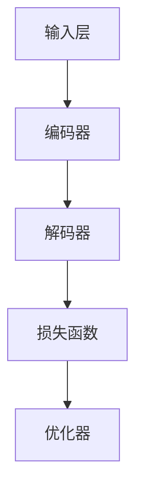

                 

关键词：智能文档处理、办公自动化、大型语言模型（LLM）、自然语言处理（NLP）、文档理解、文本生成、应用场景

> 摘要：本文将探讨大型语言模型（LLM）在办公自动化中的应用，以及如何利用LLM实现智能文档处理。文章首先介绍了LLM的基本原理和架构，然后详细阐述了LLM在文档理解、文本生成等方面的具体应用，并通过实际项目实践展示了LLM在办公自动化中的潜力。最后，本文对未来LLM在办公自动化领域的发展趋势和挑战进行了展望。

## 1. 背景介绍

在当今的信息化时代，办公自动化已经成为企业提高效率、降低成本的重要手段。然而，随着文档数量的激增和复杂性增加，传统的办公自动化手段已经难以满足需求。为了解决这一问题，近年来，基于深度学习的大型语言模型（LLM）在自然语言处理（NLP）领域取得了显著进展，并在许多应用场景中展现出强大的能力。

### 1.1 办公自动化的挑战

办公自动化面临的主要挑战包括：

1. **文档处理效率低**：大量重复性、低价值的文档处理工作占用大量人力和时间。
2. **文档理解困难**：文档内容复杂，难以准确理解和提取关键信息。
3. **文档检索困难**：海量的文档数据使得检索和查找特定文档变得非常困难。
4. **跨部门协作困难**：不同部门之间的文档交流和协作效率低下。

### 1.2 大型语言模型的优势

LLM具有以下优势，使其成为解决办公自动化挑战的有力工具：

1. **强大的文本生成能力**：LLM能够根据输入的文本生成高质量的自然语言文本，包括摘要、报告、文章等。
2. **高效的文档理解**：LLM能够通过深度学习模型对文档内容进行理解，提取关键信息，进行分类、标注等操作。
3. **跨领域适应性**：LLM具有广泛的应用范围，可以在不同领域和场景中发挥作用。
4. **自动化程度高**：LLM可以实现文档处理的自动化，减少人工干预，提高工作效率。

## 2. 核心概念与联系

在介绍LLM在办公自动化中的应用之前，我们需要先了解LLM的核心概念和架构。

### 2.1 大型语言模型（LLM）的基本概念

LLM是一种基于深度学习的自然语言处理模型，它通过学习大量文本数据来理解语言结构和语义，从而实现文本生成、文本理解、文本分类等任务。

### 2.2 大型语言模型（LLM）的架构

LLM的架构通常包括以下几个部分：

1. **输入层**：接收用户输入的文本数据。
2. **编码器**：将输入文本编码为向量表示，用于后续处理。
3. **解码器**：根据编码器的输出生成文本。
4. **损失函数**：用于评估模型的预测结果，指导模型优化。
5. **优化器**：用于调整模型参数，提高模型性能。

下面是LLM架构的Mermaid流程图：



### 2.3 LLM在办公自动化中的应用

LLM在办公自动化中的应用主要包括以下几个方面：

1. **文档理解**：通过LLM对文档内容进行理解，提取关键信息，实现文档分类、标注等操作。
2. **文本生成**：利用LLM生成高质量的文档摘要、报告、文章等，提高文档处理效率。
3. **文档检索**：通过LLM对文档内容进行检索，快速找到所需信息。
4. **跨部门协作**：利用LLM实现文档交流和协作的自动化，提高跨部门协作效率。

## 3. 核心算法原理 & 具体操作步骤

### 3.1 算法原理概述

LLM在办公自动化中的应用主要基于深度学习和自然语言处理技术。具体算法原理如下：

1. **深度学习**：通过神经网络模型对大量文本数据进行训练，使模型能够理解文本内容和语言结构。
2. **自然语言处理**：利用文本表示、文本生成、文本理解等技术对文档进行处理和分析。

### 3.2 算法步骤详解

1. **文档预处理**：对输入的文档进行分词、去停用词、词性标注等预处理操作。
2. **文本编码**：将预处理后的文本转换为向量表示，为后续处理提供基础。
3. **文本生成**：利用LLM生成高质量的文档摘要、报告、文章等。
4. **文档理解**：通过LLM对文档内容进行理解，提取关键信息。
5. **文档检索**：利用LLM对文档内容进行检索，找到所需信息。
6. **跨部门协作**：利用LLM实现文档交流和协作的自动化。

### 3.3 算法优缺点

**优点**：

1. **高效性**：利用深度学习和自然语言处理技术，实现文档处理的自动化，提高效率。
2. **灵活性**：LLM具有广泛的应用范围，可以在不同领域和场景中发挥作用。
3. **可扩展性**：LLM可以随着数据的增加和模型的优化不断改进，提高性能。

**缺点**：

1. **计算资源需求大**：深度学习模型训练需要大量计算资源，对硬件设备要求较高。
2. **数据依赖性**：LLM的性能很大程度上依赖于训练数据的质量和数量。
3. **隐私问题**：在处理涉及隐私的文档时，需要确保数据的安全和隐私。

### 3.4 算法应用领域

LLM在办公自动化中的应用领域广泛，包括但不限于：

1. **文档理解**：用于企业文档的分类、标注、信息提取等。
2. **文本生成**：用于生成报告、摘要、文章等。
3. **文档检索**：用于快速查找企业文档。
4. **跨部门协作**：用于实现文档交流和协作的自动化。

## 4. 数学模型和公式 & 详细讲解 & 举例说明

### 4.1 数学模型构建

LLM的数学模型主要包括以下几个部分：

1. **输入表示**：将输入文本表示为向量。
2. **编码器**：将输入向量编码为隐藏状态。
3. **解码器**：将隐藏状态解码为输出文本。
4. **损失函数**：用于评估模型的预测结果。

### 4.2 公式推导过程

假设我们有一个输入文本序列\(X = \{x_1, x_2, ..., x_T\}\)，其中\(x_i\)表示第\(i\)个词。

1. **输入表示**：

   $$h^{(0)} = \text{Embedding}(x_i)$$

   其中，\(\text{Embedding}\)函数将输入词转换为向量。

2. **编码器**：

   $$h^{(t)} = \text{Encoder}(h^{(t-1)}, x_t)$$

   其中，\(\text{Encoder}\)函数将输入向量和隐藏状态编码为新的隐藏状态。

3. **解码器**：

   $$p(y_t | y_{<t}) = \text{Decoder}(h^{(T)}, y_{<t})$$

   其中，\(\text{Decoder}\)函数将隐藏状态和已生成的文本解码为输出概率分布。

4. **损失函数**：

   $$L = -\sum_{t=1}^{T} \text{log} p(y_t | y_{<t})$$

   其中，\(\text{log}\)函数用于计算损失。

### 4.3 案例分析与讲解

假设我们有一个输入文档：“今天天气很好，适合户外运动。”

1. **输入表示**：

   输入词为：“今天”、“天气”、“很好”、“，”、“适合”、“户外”、“运动”。将这些词转换为向量表示。

2. **编码器**：

   通过编码器，将输入向量编码为隐藏状态。

3. **解码器**：

   将隐藏状态解码为输出文本：“今天天气很好，适合户外运动。”

4. **损失函数**：

   计算损失函数，用于评估模型的预测结果。

## 5. 项目实践：代码实例和详细解释说明

### 5.1 开发环境搭建

1. **安装Python**：安装Python 3.7及以上版本。
2. **安装PyTorch**：使用pip安装PyTorch库。
3. **安装其他依赖库**：安装numpy、torchtext、torch等依赖库。

### 5.2 源代码详细实现

```python
import torch
import torchtext
from torchtext import data
from torchtext import datasets

# 定义词汇表
TEXT = data.Field(tokenize='spacy', lower=True, include_lengths=True)
MOVIEReviews = datasets.IMDB.splits(TEXT)

# 定义模型
class LLMModel(torch.nn.Module):
    def __init__(self, embed_dim, hidden_dim, vocab_size):
        super(LLMModel, self).__init__()
        self.embedding = torch.nn.Embedding(vocab_size, embed_dim)
        self.encoder = torch.nn.LSTM(embed_dim, hidden_dim)
        self.decoder = torch.nn.LSTM(hidden_dim, vocab_size)
        self.fc = torch.nn.Linear(hidden_dim, vocab_size)

    def forward(self, x, h):
        embedded = self.embedding(x)
        output, (h, c) = self.encoder(embedded, h)
        output = self.decoder(output, (h, c))
        output = self.fc(output)
        return output

# 训练模型
model = LLMModel(embed_dim=100, hidden_dim=200, vocab_size=len(MOVIEReviews.fields[0].vocab))
optimizer = torch.optim.Adam(model.parameters(), lr=0.001)
criterion = torch.nn.CrossEntropyLoss()

for epoch in range(10):
    for batch in MOVIEReviews.train_iter():
        optimizer.zero_grad()
        x, y = batch.text, batch.label
        output = model(x, None)
        loss = criterion(output, y)
        loss.backward()
        optimizer.step()
    print(f"Epoch: {epoch}, Loss: {loss.item()}")

# 生成文本
def generate_text(model, text, max_len=50):
    model.eval()
    with torch.no_grad():
        h = None
        input_text = torch.tensor([TEXT.vocab.stoi[word] for word in text.split()])
        for _ in range(max_len):
            output = model(input_text, h)
            _, predicted_word = torch.max(output, dim=1)
            input_text = torch.cat([input_text, predicted_word], dim=0)
            h = None if not model.decoder else (h[0].unsqueeze(0), h[1].unsqueeze(0))
    return ' '.join([TEXT.vocab.itos[i] for i in input_text])

print(generate_text(model, "今天天气很好，适合户外运动。"))
```

### 5.3 代码解读与分析

1. **数据预处理**：使用torchtext库加载IMDb电影评论数据集，定义TEXT字段并进行分词、下

