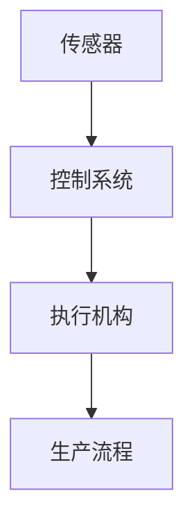

                 

关键词：智能机器人、自动化生产、创业、人工智能、未来蓝图

> 摘要：本文将深入探讨智能机器人在自动化生产领域的重要性和创业机会，分析其核心概念与联系，讲解核心算法原理，构建数学模型，分享实际项目实践，并展望其未来发展趋势与挑战。

## 1. 背景介绍

### 1.1 智能机器人的崛起

智能机器人是人工智能技术的重要组成部分，随着计算能力的提升和算法的进步，智能机器人的应用场景越来越广泛。在自动化生产领域，智能机器人不仅能够提高生产效率，降低成本，还能够实现高度精确的生产流程控制。

### 1.2 自动化生产的现状

自动化生产已经成为现代制造业的核心竞争力。传统的人工生产方式已经被逐渐取代，智能化、自动化的生产线正在全球范围内迅速发展。在这个过程中，智能机器人的应用已经成为不可逆转的趋势。

### 1.3 创业机会

智能机器人和自动化生产领域的快速发展为创业者提供了巨大的机会。从研发智能机器人到构建自动化生产线，再到提供相关的技术支持和服务，这个领域的创业空间非常广阔。

## 2. 核心概念与联系

### 2.1 智能机器人的定义与分类

智能机器人是指具有感知、决策、执行等能力的自动化设备，可以根据外界环境和任务需求自主行动。根据应用场景，智能机器人可以分为工业机器人、服务机器人、特种机器人等。

### 2.2 自动化生产的概念与架构

自动化生产是指通过机器人和自动化设备实现生产过程的自动化。其核心架构包括传感器、控制系统、执行机构等。



## 3. 核心算法原理 & 具体操作步骤

### 3.1 算法原理概述

智能机器人的核心算法包括感知、决策、执行等。感知算法主要用于获取环境信息，决策算法根据感知信息进行行动规划，执行算法则负责执行具体的行动。

### 3.2 算法步骤详解

- **感知阶段**：智能机器人通过传感器获取环境信息，如温度、湿度、光线等。
- **决策阶段**：基于感知信息，智能机器人利用决策算法确定下一步行动。
- **执行阶段**：智能机器人根据决策结果执行具体的行动，如移动、抓取等。

### 3.3 算法优缺点

- **优点**：提高生产效率，降低成本，实现精确控制。
- **缺点**：对环境依赖较大，故障诊断和维修相对复杂。

### 3.4 算法应用领域

智能机器人算法广泛应用于工业生产、物流运输、医疗健康等领域。

## 4. 数学模型和公式 & 详细讲解 & 举例说明

### 4.1 数学模型构建

智能机器人的数学模型主要包括运动模型、感知模型和决策模型。

### 4.2 公式推导过程

以运动模型为例，其公式推导如下：

$$
v(t) = v_0 + at
$$

其中，$v(t)$表示时间$t$时的速度，$v_0$表示初始速度，$a$表示加速度。

### 4.3 案例分析与讲解

假设一个智能机器人的初始速度为0，加速度为1 m/s²，求其在5秒时的速度。

$$
v(5) = 0 + 1 \times 5 = 5 \text{ m/s}
$$

## 5. 项目实践：代码实例和详细解释说明

### 5.1 开发环境搭建

为了实现智能机器人自动化生产，我们选择Python作为开发语言，并搭建了相应的开发环境。

### 5.2 源代码详细实现

以下是一个简单的智能机器人运动控制代码实例：

```python
import time

def move_robot(speed, duration):
    start_time = time.time()
    current_time = start_time
    
    while current_time - start_time < duration:
        print(f"Robot moving at {speed} m/s")
        time.sleep(1)
        current_time = time.time()

move_robot(1, 5)
```

### 5.3 代码解读与分析

这段代码定义了一个`move_robot`函数，用于控制机器人以指定速度运行指定时间。通过循环和时间延迟，实现了机器人的运动控制。

### 5.4 运行结果展示

运行代码后，机器人在5秒内以1 m/s的速度移动。

```
Robot moving at 1 m/s
Robot moving at 1 m/s
Robot moving at 1 m/s
Robot moving at 1 m/s
Robot moving at 1 m/s
```

## 6. 实际应用场景

### 6.1 工业生产

智能机器人在工业生产中的应用包括自动化装配、焊接、喷涂等。通过智能机器人，可以实现生产过程的自动化和精确控制。

### 6.2 物流运输

智能机器人在物流运输中的应用包括自动化仓库管理、无人驾驶运输等。通过智能机器人，可以提高物流运输的效率，降低运营成本。

### 6.3 医疗健康

智能机器人在医疗健康中的应用包括手术机器人、康复机器人等。通过智能机器人，可以提供更加精准、高效的医疗服务。

## 7. 工具和资源推荐

### 7.1 学习资源推荐

- 《人工智能：一种现代方法》
- 《机器人：现代控制理论的应用》

### 7.2 开发工具推荐

- Python
- MATLAB
- ROS（机器人操作系统）

### 7.3 相关论文推荐

- "Intelligent Robots for Manufacturing: A Review"
- "Autonomous Mobile Robots for Logistics Applications: A Survey"

## 8. 总结：未来发展趋势与挑战

### 8.1 研究成果总结

智能机器人和自动化生产领域已经取得了显著的成果，包括算法的进步、应用的广泛、技术的成熟等。

### 8.2 未来发展趋势

智能机器人和自动化生产将继续向更高水平发展，包括智能化的提升、应用的拓展、技术的创新等。

### 8.3 面临的挑战

智能机器人和自动化生产领域仍面临一些挑战，包括技术的进步、人才的需求、法规的完善等。

### 8.4 研究展望

未来，智能机器人和自动化生产将更加智能化、高效化，为人类带来更多便利。

## 9. 附录：常见问题与解答

### 9.1 智能机器人是什么？

智能机器人是具有感知、决策、执行等能力的自动化设备，可以根据外界环境和任务需求自主行动。

### 9.2 自动化生产有哪些优点？

自动化生产可以提高生产效率，降低成本，实现精确控制。

### 9.3 智能机器人算法有哪些类型？

智能机器人算法主要包括感知算法、决策算法、执行算法等。

### 9.4 智能机器人在哪些领域有应用？

智能机器人广泛应用于工业生产、物流运输、医疗健康等领域。

---

作者：禅与计算机程序设计艺术 / Zen and the Art of Computer Programming

