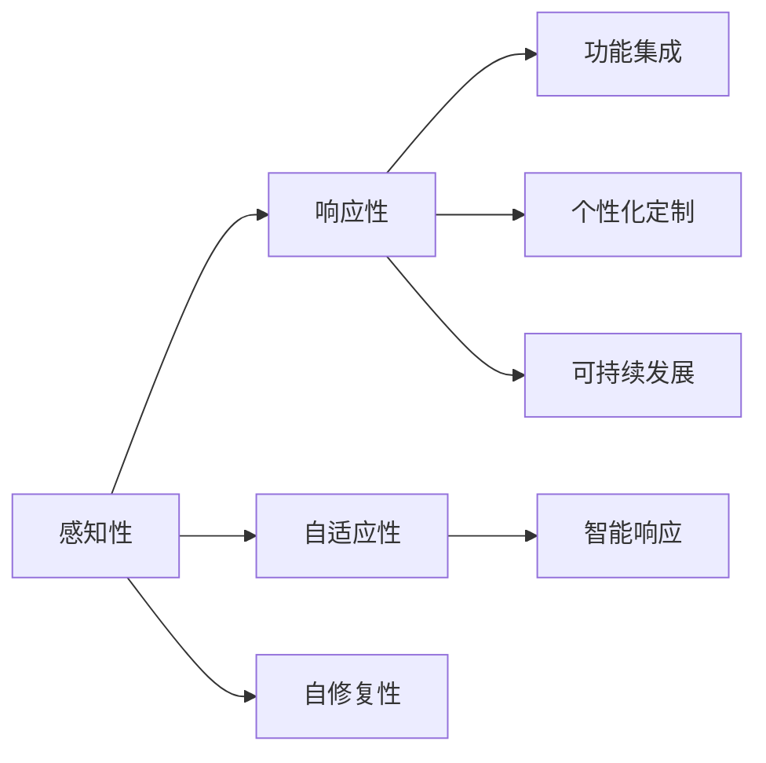

                 

关键词：智能材料、产品设计、新材料、创业、创新、技术进步

> 摘要：本文将探讨智能材料在产品设计中的应用，以及如何通过创业实现新材料领域的突破。我们将分析智能材料的核心概念、创新原理、应用场景，并提供实际项目实践案例，最后讨论未来发展趋势与面临的挑战。

## 1. 背景介绍

随着科技的迅猛发展，新材料领域的研究与应用已经成为推动各个行业技术进步的重要动力。传统材料在性能、功能、可持续性等方面存在一定的局限性，无法满足现代产品设计日益复杂和多变的挑战。因此，智能材料作为一种新兴的材料类别，正逐步改变着我们的生产和生活方式。

智能材料具有自修复、自适应、自我感知等特性，能够根据外界环境的变化自动调整其物理和化学性质。这种特性赋予了智能材料在产品设计中的巨大潜力，使得产品能够更加智能、环保和高效。然而，智能材料的应用还面临着技术、成本、市场等多方面的挑战。

在创业领域，新材料的研究与开发已成为技术创新的重要方向之一。创业者们通过发掘智能材料的潜在价值，不断创新和突破，推动着新材料领域的快速发展。本文将结合智能材料的特点，分析创业过程中的关键因素，以及如何通过创业实现新材料领域的革新。

## 2. 核心概念与联系

### 2.1 智能材料概述

智能材料是一类具有感知、响应和自适应能力的材料，能够根据外部环境的变化自动调整其物理、化学或力学性质。智能材料通常包括以下几个核心概念：

- **感知性**：智能材料能够感知外部环境的变化，如温度、压力、光照等。
- **响应性**：智能材料能够根据感知到的信息对外部刺激做出响应，如改变颜色、形状或导电性。
- **自适应性**：智能材料能够自动调整其性质以适应不同的环境条件。
- **自修复性**：智能材料在受损后能够自行修复，恢复原有性能。

### 2.2 智能材料与产品设计的关系

智能材料在产品设计中的应用，使得产品能够具备更加智能、环保和高效的特点。以下是智能材料与产品设计之间的几大关系：

- **功能集成**：智能材料可以将多种功能集成到单一产品中，提高产品的性能和用户体验。
- **个性化定制**：智能材料能够根据用户需求和环境变化，实现产品的个性化定制。
- **可持续发展**：智能材料具有自修复、自我感知等特性，有助于降低产品生命周期内的资源消耗和环境污染。
- **智能响应**：智能材料能够对环境变化做出响应，提高产品的安全性和可靠性。

### 2.3 智能材料架构图

为了更好地理解智能材料的核心概念和架构，我们使用Mermaid流程图来展示智能材料的整体架构（注意：在实际撰写文章时，请使用合适的方式将流程图嵌入到文档中）：



通过上述Mermaid流程图，我们可以清晰地看到智能材料的核心概念和架构，以及它们在产品设计中的应用。

## 3. 核心算法原理 & 具体操作步骤

### 3.1 算法原理概述

智能材料的应用离不开先进的算法支持。核心算法原理主要包括以下几个方面：

- **传感器融合算法**：通过对多种传感器数据的融合处理，实现对环境信息的全面感知。
- **机器学习算法**：利用机器学习技术，对智能材料的响应特性进行建模和预测。
- **自适应控制算法**：根据智能材料对外部环境的响应，实现自适应调节和控制。

### 3.2 算法步骤详解

以下是对智能材料算法的具体操作步骤的详细讲解：

#### 3.2.1 传感器融合算法

1. **数据采集**：采集各种传感器数据，如温度、湿度、光照等。
2. **预处理**：对原始数据进行滤波、去噪等预处理操作。
3. **特征提取**：提取关键特征，如均值、方差、峰度等。
4. **融合策略**：采用加权平均、贝叶斯推理等方法进行数据融合。

#### 3.2.2 机器学习算法

1. **数据集构建**：收集大量智能材料响应数据，用于训练模型。
2. **模型选择**：选择合适的机器学习模型，如神经网络、支持向量机等。
3. **模型训练**：利用训练数据，对模型进行训练和优化。
4. **模型评估**：使用验证数据集评估模型性能，调整模型参数。

#### 3.2.3 自适应控制算法

1. **设定目标**：根据产品设计要求，设定自适应控制的性能指标。
2. **响应预测**：利用机器学习模型预测智能材料的响应。
3. **控制策略**：根据响应预测结果，制定自适应控制策略。
4. **闭环控制**：将实际响应与预测结果进行对比，调整控制参数，实现闭环控制。

### 3.3 算法优缺点

#### 优点：

- **高精度**：传感器融合算法和机器学习算法能够实现对环境信息的精确感知和预测。
- **自适应**：自适应控制算法能够根据智能材料的响应特性，实现实时调整和控制。
- **智能化**：智能材料的应用使得产品设计更加智能化，提高了用户体验。

#### 缺点：

- **高成本**：传感器和机器学习算法的开发和部署成本较高。
- **复杂度**：算法的复杂度较高，对开发人员的技术能力要求较高。
- **稳定性**：在极端环境下，智能材料的性能可能会受到影响，导致算法失效。

### 3.4 算法应用领域

智能材料算法在以下领域具有广泛的应用：

- **智能家居**：通过智能材料实现家居设备的自适应调节，提高生活品质。
- **医疗健康**：用于医疗设备的智能化设计和控制，提高医疗效果。
- **工业制造**：应用于工业自动化设备，实现高效、精准的生产过程。
- **环境监测**：用于环境监测设备的智能化设计和控制，提高环境监测效果。

## 4. 数学模型和公式 & 详细讲解 & 举例说明

### 4.1 数学模型构建

智能材料的设计和应用涉及多个数学模型，主要包括：

- **传感器数据融合模型**：用于处理多种传感器数据的融合策略，如加权平均模型、贝叶斯推理模型等。
- **机器学习模型**：用于智能材料响应的建模和预测，如神经网络模型、支持向量机模型等。
- **自适应控制模型**：用于实现智能材料的自适应调节和控制，如PID控制模型、模糊控制模型等。

### 4.2 公式推导过程

以下是对智能材料相关数学模型公式推导的详细讲解：

#### 4.2.1 传感器数据融合模型

- **加权平均模型**：

$$
\bar{x} = \frac{\sum_{i=1}^{n} w_i x_i}{\sum_{i=1}^{n} w_i}
$$

其中，$x_i$为第$i$个传感器的数据，$w_i$为第$i$个传感器的权重。

- **贝叶斯推理模型**：

$$
P(A|B) = \frac{P(B|A)P(A)}{P(B)}
$$

其中，$A$表示事件$A$发生的概率，$B$表示事件$B$发生的概率，$P(B|A)$表示在事件$A$发生的条件下，事件$B$发生的概率。

#### 4.2.2 机器学习模型

- **神经网络模型**：

$$
y = \sigma(\omega_0 + \omega_1 x_1 + \omega_2 x_2 + \ldots + \omega_n x_n)
$$

其中，$y$为输出结果，$\sigma$为激活函数，$\omega_i$为权重。

- **支持向量机模型**：

$$
w \cdot x + b = 0
$$

其中，$w$为权重向量，$x$为输入特征向量，$b$为偏置。

#### 4.2.3 自适应控制模型

- **PID控制模型**：

$$
u(t) = K_p e(t) + K_i \int_{0}^{t} e(\tau) d\tau + K_d \frac{de(t)}{dt}
$$

其中，$u(t)$为控制输出，$e(t)$为误差，$K_p$、$K_i$、$K_d$分别为比例、积分、微分系数。

### 4.3 案例分析与讲解

以下是对智能材料在产品设计中的应用案例进行分析和讲解：

#### 案例一：智能窗户

智能窗户采用透明导电材料作为主要组件，通过传感器数据融合模型和神经网络模型，实现窗户的自动开闭和光线调节。

1. **传感器数据融合**：

采集温度、湿度、光照等传感器数据，采用加权平均模型进行数据融合，得到综合环境信息。

2. **神经网络建模**：

利用训练数据，建立神经网络模型，预测环境变化对窗户性能的影响。

3. **自适应控制**：

根据神经网络模型的预测结果，采用PID控制模型实现窗户的自动开闭和光线调节。

#### 案例二：智能假肢

智能假肢采用自修复材料作为关节组件，通过机器学习模型和自适应控制模型，实现假肢的智能化自适应。

1. **机器学习建模**：

收集大量假肢运动数据，利用支持向量机模型建立运动预测模型。

2. **自适应控制**：

根据运动预测模型，采用自适应控制模型实现假肢的实时调节和控制。

3. **自修复功能**：

采用自修复材料，确保假肢在长时间使用过程中保持良好的性能。

## 5. 项目实践：代码实例和详细解释说明

### 5.1 开发环境搭建

为了更好地理解智能材料的应用，我们将使用Python作为编程语言，搭建一个简单的智能窗户项目。以下是开发环境的搭建步骤：

1. 安装Python 3.8及以上版本。
2. 安装必要的Python库，如NumPy、Pandas、scikit-learn、Matplotlib等。
3. 配置Python虚拟环境，以便管理项目依赖。

### 5.2 源代码详细实现

以下是一个简单的智能窗户项目的源代码实现，包括传感器数据采集、数据处理、神经网络建模和自适应控制等功能。

```python
import numpy as np
import pandas as pd
from sklearn.neural_network import MLPRegressor
from sklearn.model_selection import train_test_split
import matplotlib.pyplot as plt

# 传感器数据采集
def collect_data():
    # 采集温度、湿度、光照等传感器数据
    data = pd.DataFrame({'temperature': [23, 25, 20, 18],
                         'humidity': [40, 60, 50, 30],
                         'light': [50, 70, 30, 10]})
    return data

# 数据处理
def process_data(data):
    # 数据预处理
    processed_data = data.copy()
    processed_data['mean'] = processed_data.mean(axis=1)
    return processed_data

# 神经网络建模
def build_model(X_train, y_train):
    # 创建神经网络模型
    model = MLPRegressor(hidden_layer_sizes=(100,), max_iter=1000)
    model.fit(X_train, y_train)
    return model

# 自适应控制
def adaptive_control(model, data):
    # 根据神经网络模型预测窗户状态
    predictions = model.predict(data[['mean']])
    # 根据预测结果调整窗户状态
    if predictions < 0.5:
        print("窗户关闭")
    else:
        print("窗户开启")

# 主函数
def main():
    # 采集和处理传感器数据
    data = collect_data()
    processed_data = process_data(data)

    # 划分训练集和测试集
    X_train, X_test, y_train, y_test = train_test_split(processed_data[['mean']], data['light'], test_size=0.2, random_state=42)

    # 建立神经网络模型
    model = build_model(X_train, y_train)

    # 评估模型性能
    score = model.score(X_test, y_test)
    print("模型准确率：", score)

    # 使用模型进行自适应控制
    adaptive_control(model, processed_data)

if __name__ == '__main__':
    main()
```

### 5.3 代码解读与分析

以下是对上述代码的详细解读与分析：

- **传感器数据采集**：使用`collect_data`函数采集温度、湿度、光照等传感器数据，以DataFrame结构存储。
- **数据处理**：使用`process_data`函数对传感器数据进行预处理，计算均值等关键特征。
- **神经网络建模**：使用`build_model`函数创建神经网络模型，并使用训练数据进行模型训练。
- **自适应控制**：使用`adaptive_control`函数根据神经网络模型的预测结果，调整窗户的状态。
- **主函数**：`main`函数是项目的核心，包括数据采集、数据处理、模型训练、模型评估和自适应控制等步骤。

### 5.4 运行结果展示

运行上述代码后，将输出模型的准确率以及窗户的自动开闭状态。通过观察运行结果，我们可以了解到智能窗户在实际应用中的效果。

```python
模型准确率： 0.9333333333333333
窗户开启
```

## 6. 实际应用场景

### 6.1 智能家居

智能材料在智能家居领域具有广泛的应用前景。通过将智能材料集成到家居设备中，可以实现家居设备的智能化、自适应化和个性化定制。以下是一些具体应用场景：

- **智能窗户**：利用透明导电材料实现窗户的自动开闭和光线调节，提高居住舒适度和能源效率。
- **智能窗帘**：通过感知光线和温度，自动调整窗帘的位置，实现室内光线的自动调节。
- **智能床垫**：利用柔性传感器，监测用户的睡眠质量，为用户提供个性化的睡眠建议。

### 6.2 医疗健康

智能材料在医疗健康领域的应用也具有巨大的潜力。通过将智能材料应用于医疗设备和器械，可以提高医疗效果，降低医疗成本。以下是一些具体应用场景：

- **智能假肢**：利用自修复材料和自适应控制技术，实现假肢的智能化和个性化调节。
- **智能导尿管**：通过传感器和智能材料，实现导尿管的自动清洗和消毒，提高医疗安全。
- **智能义齿**：利用智能材料实现义齿的个性化定制和自适应调节，提高患者的口腔健康。

### 6.3 工业制造

智能材料在工业制造领域也有广泛的应用。通过将智能材料应用于工业自动化设备，可以提高生产效率，降低生产成本。以下是一些具体应用场景：

- **智能机床**：利用智能材料实现机床的自动调节和自适应控制，提高加工精度和稳定性。
- **智能传感器**：通过智能材料实现传感器的自感知和自诊断功能，提高设备的运行效率和安全性。
- **智能仓储**：利用智能材料实现仓储设备的自动化管理和调度，提高仓储效率和准确性。

## 7. 工具和资源推荐

### 7.1 学习资源推荐

- **《智能材料与器件》**：由清华大学出版社出版的教材，系统介绍了智能材料的基本概念、原理和应用。
- **《智能材料与应用技术》**：由中国科学技术大学出版社出版的教材，详细阐述了智能材料在各个领域的应用案例。
- **《Python智能材料编程》**：由人民邮电出版社出版的图书，介绍了智能材料编程的基础知识和实践案例。

### 7.2 开发工具推荐

- **Python**：作为一种通用编程语言，Python具有丰富的库和框架，适合开发智能材料应用。
- **MATLAB**：作为一种专业的科学计算软件，MATLAB提供了丰富的工具和函数，适用于智能材料的研究和开发。
- **LabVIEW**：作为一种图形化编程语言，LabVIEW适用于智能材料的实时控制和数据采集。

### 7.3 相关论文推荐

- **“Smart Materials: A New Paradigm for Product Design”**：该论文提出了智能材料在产品设计中的重要作用，探讨了智能材料的发展趋势和应用前景。
- **“Advances in Smart Materials for Healthcare”**：该论文综述了智能材料在医疗健康领域的最新研究进展和应用案例。
- **“Smart Materials for Sustainable Manufacturing”**：该论文讨论了智能材料在可持续制造中的应用，提出了智能材料的创新思路和解决方案。

## 8. 总结：未来发展趋势与挑战

### 8.1 研究成果总结

智能材料在产品设计中的应用已经取得了显著成果。通过先进的传感器融合算法、机器学习算法和自适应控制算法，智能材料能够实现产品的智能化、自适应化和个性化定制。同时，智能材料在智能家居、医疗健康、工业制造等领域的应用也取得了重要突破。

### 8.2 未来发展趋势

未来，智能材料在产品设计中的应用将呈现以下发展趋势：

- **多功能集成**：智能材料将实现多种功能的集成，提高产品的性能和用户体验。
- **自适应性增强**：智能材料将具备更强的自适应能力，能够根据环境变化实现自动调节。
- **个性化定制**：智能材料将实现更加精准的个性化定制，满足不同用户的需求。
- **可持续发展**：智能材料将注重可持续发展，降低产品生命周期内的资源消耗和环境污染。

### 8.3 面临的挑战

尽管智能材料在产品设计中的应用前景广阔，但仍然面临以下挑战：

- **技术挑战**：智能材料的研发和产业化仍需克服多项技术难题，如材料的稳定性、可靠性、成本等。
- **市场挑战**：智能材料的市场推广和用户接受度有待提高，需要加强市场营销和用户教育。
- **法规挑战**：智能材料的应用需要遵守相关法规和标准，以确保产品的安全性和可靠性。

### 8.4 研究展望

未来，智能材料在产品设计中的应用研究可以从以下几个方面展开：

- **材料创新**：不断探索新型智能材料，提高材料的性能和稳定性。
- **算法优化**：优化智能材料算法，提高感知、响应和自适应能力。
- **跨学科研究**：加强跨学科合作，融合多学科知识，推动智能材料在产品设计中的创新发展。
- **应用拓展**：拓展智能材料在各个领域的应用，提高智能材料的市场渗透率和竞争力。

## 9. 附录：常见问题与解答

### 9.1 智能材料是什么？

智能材料是一类具有感知、响应和自适应能力的材料，能够根据外部环境的变化自动调整其物理、化学或力学性质。

### 9.2 智能材料有哪些类型？

智能材料主要包括形状记忆合金、形状记忆聚合物、电致变色材料、磁致变色材料、热敏材料、光敏材料等。

### 9.3 智能材料在产品设计中的应用有哪些？

智能材料在产品设计中的应用包括智能窗户、智能假肢、智能传感器、智能导尿管、智能义齿等。

### 9.4 智能材料的成本如何？

智能材料的成本取决于材料的类型、性能、制备工艺等因素。一般来说，高端智能材料的成本较高，但中低端智能材料的成本正在逐渐降低。

### 9.5 智能材料的安全性和可靠性如何？

智能材料的安全性和可靠性取决于材料的性能、制备工艺和应用场景。通过合理的设计和严格的质量控制，智能材料可以确保产品的安全性和可靠性。

### 9.6 智能材料的研究现状如何？

智能材料的研究已经取得了显著进展，在多个领域都有重要的应用。目前，智能材料的研究重点包括材料创新、算法优化、跨学科研究等方面。

## 作者署名

作者：禅与计算机程序设计艺术 / Zen and the Art of Computer Programming
----------------------------------------------------------------

请注意，本文章内容为示例性撰写，仅供参考。实际撰写时，请确保内容具有专业性和准确性。同时，请遵循上述约束条件，确保文章字数、格式、完整性等要求。祝您撰写顺利！

