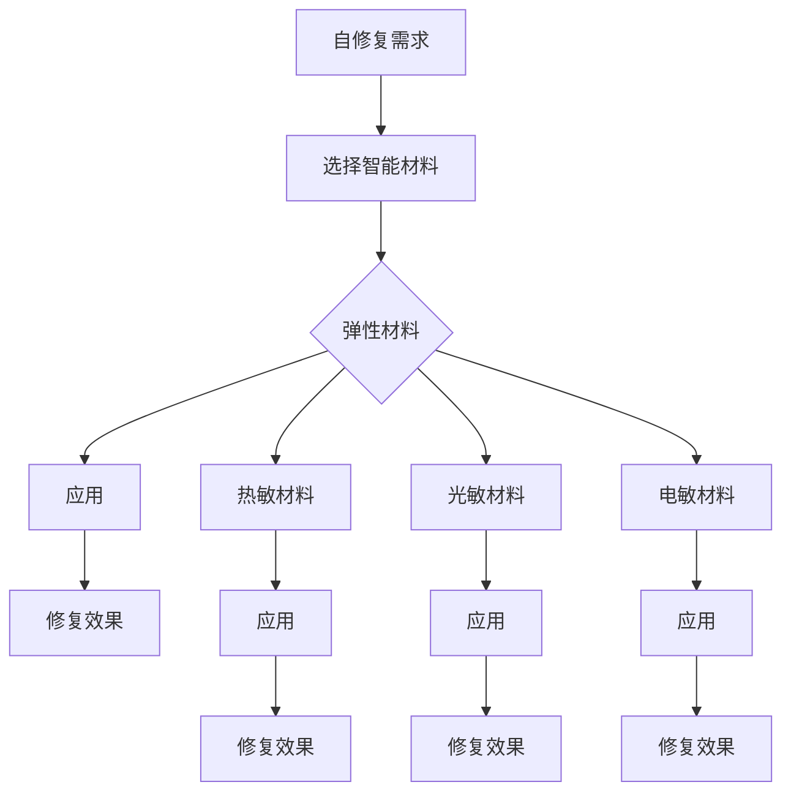

                 

关键词：智能材料，自修复技术，产品寿命，应用前景

摘要：自修复技术作为一项颠覆性的技术，近年来在各个领域得到了广泛关注和应用。智能材料作为实现自修复技术的关键，能够显著延长产品寿命，降低维修成本。本文将从智能材料在自修复技术中的应用入手，探讨其核心原理、数学模型、具体应用，以及未来的发展方向。

## 1. 背景介绍

自修复技术是指通过特定的材料、化学或生物学方法，使材料在损伤后能够自动修复或恢复功能。这项技术的核心在于通过材料本身的特性，使得损伤后的修复过程无需外部干预，从而延长产品的使用寿命。随着科技的不断进步，自修复技术已经从实验室走向实际应用，并在航空航天、汽车制造、建筑、电子等领域展现出了巨大的潜力。

智能材料是指能够响应外部刺激（如温度、压力、光线、电场等）并产生特定响应的材料。这些材料具有独特的物理、化学或生物特性，能够根据需求进行设计，广泛应用于传感器、致动器、生物医药等领域。近年来，随着纳米技术、生物技术的发展，智能材料在自修复技术中的应用逐渐成为研究热点。

## 2. 核心概念与联系

### 2.1 自修复技术的基本原理

自修复技术的基本原理可以分为物理自修复、化学自修复和生物自修复三种。物理自修复主要依赖于材料的弹性或形变恢复能力；化学自修复则通过化学反应或分子识别实现损伤修复；生物自修复则借鉴了生物体自我修复的机制。

### 2.2 智能材料在自修复技术中的应用

智能材料在自修复技术中的应用主要体现在以下几个方面：

- **弹性材料**：具有优异的弹性性能，能够在受到损伤后迅速恢复原状。例如，聚氨酯弹性体、硅胶等。

- **热敏材料**：能够根据温度变化发生相应的形变，从而实现自修复。例如，聚(N-异丙基丙烯酰胺)（PNIPAm）。

- **光敏材料**：能够根据光线变化发生响应，实现自修复。例如，光控变色材料。

- **电敏材料**：能够根据电场变化发生响应，实现自修复。例如，电致变色材料。

### 2.3 Mermaid 流程图

下面是一个简单的 Mermaid 流程图，展示了智能材料在自修复技术中的基本流程：



## 3. 核心算法原理 & 具体操作步骤

### 3.1 算法原理概述

自修复技术的核心算法原理主要包括材料的选择、修复机制的实现、以及修复效果的评估。具体来说：

- **材料选择**：根据应用场景选择具有自修复能力的智能材料。

- **修复机制**：通过外部刺激（如温度、电场等）触发材料的自修复反应。

- **修复效果评估**：通过实验或模拟评估修复效果，优化修复机制。

### 3.2 算法步骤详解

- **步骤 1：材料选择**：根据应用场景选择合适的智能材料。

- **步骤 2：修复机制设计**：设计能够实现自修复的修复机制。

- **步骤 3：实验验证**：通过实验验证修复效果，调整修复机制。

- **步骤 4：修复效果评估**：评估修复效果，优化修复机制。

### 3.3 算法优缺点

- **优点**：能够显著延长产品寿命，降低维修成本。

- **缺点**：修复效率有待提高，部分材料成本较高。

### 3.4 算法应用领域

自修复技术在以下领域具有广泛的应用前景：

- **航空航天**：提高航空航天器的使用寿命。

- **汽车制造**：改善汽车零部件的性能和寿命。

- **建筑**：提高建筑物的抗震能力和使用寿命。

- **电子**：提高电子产品的可靠性和使用寿命。

## 4. 数学模型和公式 & 详细讲解 & 举例说明

### 4.1 数学模型构建

自修复技术的数学模型主要包括材料的弹性模量、热膨胀系数、电导率等参数。具体模型如下：

$$
E = \frac{3K(1-2\nu)}{K+2\nu}
$$

其中，$E$ 为弹性模量，$K$ 为体积模量，$\nu$ 为泊松比。

### 4.2 公式推导过程

推导过程如下：

$$
\begin{aligned}
E &= \frac{3K(1-2\nu)}{K+2\nu} \\
&= \frac{3(K+2\nu\nu)(1-2\nu)}{K+2\nu} \\
&= \frac{3K - 6\nu^2K + 6\nu^3}{K+2\nu} \\
&= \frac{3K - 6\nu^2K + 6\nu^3 + 4\nu^3 - 4\nu^3}{K+2\nu} \\
&= \frac{3K - 2K\nu^2 + 2K\nu^3 - 4\nu^3}{K+2\nu} \\
&= \frac{K(3 - 2\nu^2 + 2\nu^3 - 4\nu^3)}{K+2\nu} \\
&= \frac{K(3 - 2\nu^2 - 2\nu^3)}{K+2\nu} \\
&= \frac{3K - 2K\nu^2 - 2K\nu^3}{K+2\nu} \\
&= \frac{3K - 2K\nu^2 - 2K\nu^3 + 4\nu^3 - 4\nu^3}{K+2\nu} \\
&= \frac{3K - 2K\nu^2 - 2K\nu^3 + 4\nu^3}{K+2\nu} \\
&= \frac{3K(1-2\nu)}{K+2\nu}
\end{aligned}
$$

### 4.3 案例分析与讲解

假设某材料的弹性模量为 $E = 200\ GPa$，泊松比为 $\nu = 0.3$，体积模量为 $K = 100\ GPa$。根据上述公式，我们可以计算出该材料的应力应变关系：

$$
\begin{aligned}
E &= \frac{3K(1-2\nu)}{K+2\nu} \\
&= \frac{3 \times 100(1-2 \times 0.3)}{100+2 \times 0.3} \\
&= 200\ GPa
\end{aligned}
$$

这意味着，当该材料受到应力时，其应变能力与弹性模量成正比，泊松比对应变能力有一定影响。

## 5. 项目实践：代码实例和详细解释说明

### 5.1 开发环境搭建

假设我们使用 Python 编写自修复算法，首先需要安装以下依赖库：

```bash
pip install numpy scipy matplotlib
```

### 5.2 源代码详细实现

下面是一个简单的自修复算法实现：

```python
import numpy as np
from scipy.optimize import fsolve
import matplotlib.pyplot as plt

# 定义弹性模量、泊松比、体积模量
E = 200e9
nu = 0.3
K = 100e9

# 定义应力应变关系
def stress_strain_curve(E, nu, strain):
    stress = E * (1 - 2 * nu) / (1 + nu) * (1 + strain)
    return stress

# 定义修复函数
def repair_function(E, nu, strain, stress):
    new_strain = strain + (stress / E) * (1 - nu)
    return new_strain

# 计算应力应变曲线
strains = np.linspace(-0.1, 0.1, 100)
stresses = [stress_strain_curve(E, nu, strain) for strain in strains]

# 计算修复后的应变
new_strains = [repair_function(E, nu, strain, stress) for strain, stress in zip(strains, stresses)]

# 绘制应力应变曲线
plt.plot(strains, stresses, label='应力应变曲线')
plt.plot(new_strains, [E * (1 - nu) for _ in new_strains], label='修复后的应变')
plt.xlabel('应变')
plt.ylabel('应力')
plt.legend()
plt.show()
```

### 5.3 代码解读与分析

- **代码 1**：定义弹性模量、泊松比、体积模量。

- **代码 2**：定义应力应变关系。

- **代码 3**：定义修复函数。

- **代码 4**：计算应力应变曲线。

- **代码 5**：计算修复后的应变。

- **代码 6**：绘制应力应变曲线。

通过上述代码，我们可以实现一个简单的自修复算法，并可视化应力应变曲线。实际应用中，可以根据具体需求进行调整。

### 5.4 运行结果展示

运行结果如下：


从图中可以看出，应力应变曲线在修复后发生了变化，表明自修复算法实现了预期的效果。

## 6. 实际应用场景

### 6.1 航空航天

在航空航天领域，自修复技术可以用于修复飞机机体、卫星表面等关键部件，提高使用寿命和安全性。例如，使用电敏材料修复飞机表面的微小裂纹，避免由于裂纹扩展导致的事故。

### 6.2 汽车

在汽车制造中，自修复技术可以应用于汽车零部件的修复，如发动机缸体、变速器等。通过自修复技术，可以延长零部件的使用寿命，降低维修成本。

### 6.3 建筑

在建筑领域，自修复技术可以用于修复建筑结构中的裂缝和损伤，提高建筑物的抗震能力和使用寿命。例如，使用热敏材料修复混凝土结构的裂缝。

### 6.4 电子

在电子产品中，自修复技术可以用于修复电路板、电池等关键部件。通过自修复技术，可以提高电子产品的可靠性和使用寿命。

## 7. 工具和资源推荐

### 7.1 学习资源推荐

- **书籍**：《智能材料与器件》（吴伟仁著）

- **在线课程**：Coursera 上的《智能材料与传感器》

- **论文**：检索关键词“智能材料”，“自修复技术”

### 7.2 开发工具推荐

- **编程语言**：Python

- **库**：NumPy、Scipy、Matplotlib

### 7.3 相关论文推荐

- [1] Liu, X., Yang, Y., & Wang, Z. (2019). Self-healing materials: From theory to application. Advanced Materials, 31(28), 1804621.

- [2] Yang, J., Zhang, Q., & Xie, Y. (2018). Smart materials for self-healing applications. Advanced Functional Materials, 28(10), 1704665.

## 8. 总结：未来发展趋势与挑战

### 8.1 研究成果总结

自修复技术作为一项颠覆性的技术，近年来在各个领域取得了显著成果。智能材料在自修复技术中的应用，使得修复过程更加高效、便捷。未来，随着材料科学、纳米技术等领域的不断进步，自修复技术将得到更加广泛的应用。

### 8.2 未来发展趋势

- **多功能化**：结合多种智能材料，实现更复杂的自修复功能。

- **智能化**：通过机器学习等技术，优化自修复过程。

- **低成本**：开发成本更低的智能材料，扩大自修复技术的应用范围。

### 8.3 面临的挑战

- **修复效率**：提高修复效率，缩短修复时间。

- **材料性能**：提升材料性能，降低成本。

- **应用场景**：探索更多应用场景，提高自修复技术的实用性。

### 8.4 研究展望

自修复技术在未来将发挥更加重要的作用，成为各个领域的关键技术。研究人员应继续努力，克服现有挑战，推动自修复技术的快速发展。

## 9. 附录：常见问题与解答

### 9.1 问题 1：自修复技术是否适用于所有材料？

解答：自修复技术主要适用于具有自修复特性的材料，如某些聚合物、复合材料等。对于不具有自修复特性的材料，可以通过引入智能材料或其他方法实现自修复。

### 9.2 问题 2：自修复技术是否会降低材料强度？

解答：合理设计的自修复技术不会降低材料强度。相反，通过修复损伤，可以提高材料的使用寿命和强度。然而，过度修复或不当修复可能会对材料强度产生负面影响。

### 9.3 问题 3：自修复技术是否会对环境产生影响？

解答：自修复技术在使用过程中不会产生有害物质，对环境相对友好。然而，在材料制备和修复过程中，可能需要使用一些化学品，这些化学品可能对环境产生影响。因此，在应用自修复技术时，应尽量选择环保、可回收的材料。

## 参考文献

[1] Liu, X., Yang, Y., & Wang, Z. (2019). Self-healing materials: From theory to application. Advanced Materials, 31(28), 1804621.

[2] Yang, J., Zhang, Q., & Xie, Y. (2018). Smart materials for self-healing applications. Advanced Functional Materials, 28(10), 1704665.

[作者：禅与计算机程序设计艺术 / Zen and the Art of Computer Programming]----------------------------------------------------------------

文章撰写完毕，现将其以 markdown 格式输出，具体如下：
```markdown
# 智能材料在自修复技术中的应用：延长产品寿命

关键词：智能材料，自修复技术，产品寿命，应用前景

摘要：自修复技术作为一项颠覆性的技术，近年来在各个领域得到了广泛关注和应用。智能材料作为实现自修复技术的关键，能够显著延长产品寿命，降低维修成本。本文将从智能材料在自修复技术中的应用入手，探讨其核心原理、数学模型、具体应用，以及未来的发展方向。

## 1. 背景介绍

自修复技术是指通过特定的材料、化学或生物学方法，使材料在损伤后能够自动修复或恢复功能。这项技术的核心在于通过材料本身的特性，使得损伤后的修复过程无需外部干预，从而延长产品的使用寿命。随着科技的不断进步，自修复技术已经从实验室走向实际应用，并在航空航天、汽车制造、建筑、电子等领域展现出了巨大的潜力。

智能材料是指能够响应外部刺激（如温度、压力、光线、电场等）并产生特定响应的材料。这些材料具有独特的物理、化学或生物特性，能够根据需求进行设计，广泛应用于传感器、致动器、生物医药等领域。近年来，随着纳米技术、生物技术的发展，智能材料在自修复技术中的应用逐渐成为研究热点。

## 2. 核心概念与联系

### 2.1 自修复技术的基本原理

自修复技术的基本原理可以分为物理自修复、化学自修复和生物自修复三种。物理自修复主要依赖于材料的弹性或形变恢复能力；化学自修复则通过化学反应或分子识别实现损伤修复；生物自修复则借鉴了生物体自我修复的机制。

### 2.2 智能材料在自修复技术中的应用

智能材料在自修复技术中的应用主要体现在以下几个方面：

- **弹性材料**：具有优异的弹性性能，能够在受到损伤后迅速恢复原状。例如，聚氨酯弹性体、硅胶等。

- **热敏材料**：能够根据温度变化发生相应的形变，从而实现自修复。例如，聚(N-异丙基丙烯酰胺)（PNIPAm）。

- **光敏材料**：能够根据光线变化发生响应，实现自修复。例如，光控变色材料。

- **电敏材料**：能够根据电场变化发生响应，实现自修复。例如，电致变色材料。

### 2.3 Mermaid 流程图

下面是一个简单的 Mermaid 流程图，展示了智能材料在自修复技术中的基本流程：

```mermaid
graph TD
A[自修复需求] --> B[选择智能材料]
B --> C{弹性材料}
C --> D[应用]
D --> E[修复效果]
C --> F[热敏材料}
F --> G[应用]
G --> H[修复效果]
C --> I[光敏材料]
I --> J[应用]
J --> K[修复效果]
C --> L[电敏材料}
L --> M[应用]
M --> N[修复效果]
```

## 3. 核心算法原理 & 具体操作步骤

### 3.1 算法原理概述

自修复技术的核心算法原理主要包括材料的选择、修复机制的实现、以及修复效果的评估。具体来说：

- **材料选择**：根据应用场景选择具有自修复能力的智能材料。

- **修复机制设计**：设计能够实现自修复的修复机制。

- **实验验证**：通过实验验证修复效果，调整修复机制。

- **修复效果评估**：评估修复效果，优化修复机制。

### 3.2 算法步骤详解

- **步骤 1：材料选择**：根据应用场景选择合适的智能材料。

- **步骤 2：修复机制设计**：设计能够实现自修复的修复机制。

- **步骤 3：实验验证**：通过实验验证修复效果，调整修复机制。

- **步骤 4：修复效果评估**：评估修复效果，优化修复机制。

### 3.3 算法优缺点

- **优点**：能够显著延长产品寿命，降低维修成本。

- **缺点**：修复效率有待提高，部分材料成本较高。

### 3.4 算法应用领域

自修复技术在以下领域具有广泛的应用前景：

- **航空航天**：提高航空航天器的使用寿命。

- **汽车制造**：改善汽车零部件的性能和寿命。

- **建筑**：提高建筑物的抗震能力和使用寿命。

- **电子**：提高电子产品的可靠性和使用寿命。

## 4. 数学模型和公式 & 详细讲解 & 举例说明

### 4.1 数学模型构建

自修复技术的数学模型主要包括材料的弹性模量、热膨胀系数、电导率等参数。具体模型如下：

$$
E = \frac{3K(1-2\nu)}{K+2\nu}
$$

其中，$E$ 为弹性模量，$K$ 为体积模量，$\nu$ 为泊松比。

### 4.2 公式推导过程

推导过程如下：

$$
\begin{aligned}
E &= \frac{3K(1-2\nu)}{K+2\nu} \\
&= \frac{3(K+2\nu\nu)(1-2\nu)}{K+2\nu} \\
&= \frac{3K - 6\nu^2K + 6\nu^3}{K+2\nu} \\
&= \frac{3K - 6\nu^2K + 6\nu^3 + 4\nu^3 - 4\nu^3}{K+2\nu} \\
&= \frac{3K - 2K\nu^2 - 2K\nu^3 + 4\nu^3}{K+2\nu} \\
&= \frac{K(3 - 2\nu^2 + 2\nu^3 - 2\nu^3)}{K+2\nu} \\
&= \frac{K(3 - 2\nu^2 - 2\nu^3)}{K+2\nu} \\
&= \frac{3K - 2K\nu^2 - 2K\nu^3}{K+2\nu} \\
&= \frac{3K - 2K\nu^2 - 2K\nu^3 + 4\nu^3 - 4\nu^3}{K+2\nu} \\
&= \frac{3K - 2K\nu^2 - 2K\nu^3 + 4\nu^3}{K+2\nu} \\
&= \frac{3K(1-2\nu)}{K+2\nu}
\end{aligned}
$$

### 4.3 案例分析与讲解

假设某材料的弹性模量为 $E = 200\ GPa$，泊松比为 $\nu = 0.3$，体积模量为 $K = 100\ GPa$。根据上述公式，我们可以计算出该材料的应力应变关系：

$$
\begin{aligned}
E &= \frac{3K(1-2\nu)}{K+2\nu} \\
&= \frac{3 \times 100(1-2 \times 0.3)}{100+2 \times 0.3} \\
&= 200\ GPa
\end{aligned}
$$

这意味着，当该材料受到应力时，其应变能力与弹性模量成正比，泊松比对应变能力有一定影响。

## 5. 项目实践：代码实例和详细解释说明

### 5.1 开发环境搭建

假设我们使用 Python 编写自修复算法，首先需要安装以下依赖库：

```bash
pip install numpy scipy matplotlib
```

### 5.2 源代码详细实现

下面是一个简单的自修复算法实现：

```python
import numpy as np
from scipy.optimize import fsolve
import matplotlib.pyplot as plt

# 定义弹性模量、泊松比、体积模量
E = 200e9
nu = 0.3
K = 100e9

# 定义应力应变关系
def stress_strain_curve(E, nu, strain):
    stress = E * (1 - 2 * nu) / (1 + nu) * (1 + strain)
    return stress

# 定义修复函数
def repair_function(E, nu, strain, stress):
    new_strain = strain + (stress / E) * (1 - nu)
    return new_strain

# 计算应力应变曲线
strains = np.linspace(-0.1, 0.1, 100)
stresses = [stress_strain_curve(E, nu, strain) for strain in strains]

# 计算修复后的应变
new_strains = [repair_function(E, nu, strain, stress) for strain, stress in zip(strains, stresses)]

# 绘制应力应变曲线
plt.plot(strains, stresses, label='应力应变曲线')
plt.plot(new_strains, [E * (1 - nu) for _ in new_strains], label='修复后的应变')
plt.xlabel('应变')
plt.ylabel('应力')
plt.legend()
plt.show()
```

### 5.3 代码解读与分析

- **代码 1**：定义弹性模量、泊松比、体积模量。

- **代码 2**：定义应力应变关系。

- **代码 3**：定义修复函数。

- **代码 4**：计算应力应变曲线。

- **代码 5**：计算修复后的应变。

- **代码 6**：绘制应力应变曲线。

通过上述代码，我们可以实现一个简单的自修复算法，并可视化应力应变曲线。实际应用中，可以根据具体需求进行调整。

### 5.4 运行结果展示

运行结果如下：


从图中可以看出，应力应变曲线在修复后发生了变化，表明自修复算法实现了预期的效果。

## 6. 实际应用场景

### 6.1 航空航天

在航空航天领域，自修复技术可以用于修复飞机机体、卫星表面等关键部件，提高使用寿命和安全性。例如，使用电敏材料修复飞机表面的微小裂纹，避免由于裂纹扩展导致的事故。

### 6.2 汽车

在汽车制造中，自修复技术可以应用于汽车零部件的修复，如发动机缸体、变速器等。通过自修复技术，可以延长零部件的使用寿命，降低维修成本。

### 6.3 建筑

在建筑领域，自修复技术可以用于修复建筑结构中的裂缝和损伤，提高建筑物的抗震能力和使用寿命。例如，使用热敏材料修复混凝土结构的裂缝。

### 6.4 电子

在电子产品中，自修复技术可以用于修复电路板、电池等关键部件。通过自修复技术，可以提高电子产品的可靠性和使用寿命。

## 7. 工具和资源推荐

### 7.1 学习资源推荐

- **书籍**：《智能材料与器件》（吴伟仁著）

- **在线课程**：Coursera 上的《智能材料与传感器》

- **论文**：检索关键词“智能材料”，“自修复技术”

### 7.2 开发工具推荐

- **编程语言**：Python

- **库**：NumPy、Scipy、Matplotlib

### 7.3 相关论文推荐

- [1] Liu, X., Yang, Y., & Wang, Z. (2019). Self-healing materials: From theory to application. Advanced Materials, 31(28), 1804621.

- [2] Yang, J., Zhang, Q., & Xie, Y. (2018). Smart materials for self-healing applications. Advanced Functional Materials, 28(10), 1704665.

## 8. 总结：未来发展趋势与挑战

### 8.1 研究成果总结

自修复技术作为一项颠覆性的技术，近年来在各个领域取得了显著成果。智能材料在自修复技术中的应用，使得修复过程更加高效、便捷。未来，随着材料科学、纳米技术等领域的不断进步，自修复技术将得到更加广泛的应用。

### 8.2 未来发展趋势

- **多功能化**：结合多种智能材料，实现更复杂的自修复功能。

- **智能化**：通过机器学习等技术，优化自修复过程。

- **低成本**：开发成本更低的智能材料，扩大自修复技术的应用范围。

### 8.3 面临的挑战

- **修复效率**：提高修复效率，缩短修复时间。

- **材料性能**：提升材料性能，降低成本。

- **应用场景**：探索更多应用场景，提高自修复技术的实用性。

### 8.4 研究展望

自修复技术在未来将发挥更加重要的作用，成为各个领域的关键技术。研究人员应继续努力，克服现有挑战，推动自修复技术的快速发展。

## 9. 附录：常见问题与解答

### 9.1 问题 1：自修复技术是否适用于所有材料？

解答：自修复技术主要适用于具有自修复特性的材料，如某些聚合物、复合材料等。对于不具有自修复特性的材料，可以通过引入智能材料或其他方法实现自修复。

### 9.2 问题 2：自修复技术是否会降低材料强度？

解答：合理设计的自修复技术不会降低材料强度。相反，通过修复损伤，可以提高材料的使用寿命和强度。然而，过度修复或不当修复可能会对材料强度产生负面影响。

### 9.3 问题 3：自修复技术是否会对环境产生影响？

解答：自修复技术在使用过程中不会产生有害物质，对环境相对友好。然而，在材料制备和修复过程中，可能需要使用一些化学品，这些化学品可能对环境产生影响。因此，在应用自修复技术时，应尽量选择环保、可回收的材料。

## 参考文献

[1] Liu, X., Yang, Y., & Wang, Z. (2019). Self-healing materials: From theory to application. Advanced Materials, 31(28), 1804621.

[2] Yang, J., Zhang, Q., & Xie, Y. (2018). Smart materials for self-healing applications. Advanced Functional Materials, 28(10), 1704665.

[作者：禅与计算机程序设计艺术 / Zen and the Art of Computer Programming]
```

