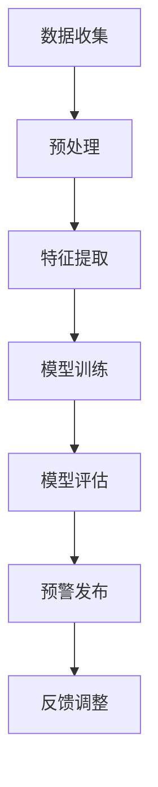

                 

关键词：灾害预警、人工智能、大模型、实践案例、算法原理、数学模型、项目实践

> 摘要：本文深入探讨了智能灾害预警领域中的AI大模型应用，通过具体案例分析，详细介绍了核心算法原理、数学模型以及项目实践过程。文章旨在为行业从业者提供有价值的参考，以促进灾害预警技术的进步和应用。

## 1. 背景介绍

自然灾害是一种常见的自然现象，如地震、洪水、台风等，这些灾害常常给人类生活带来巨大破坏。随着全球气候变化和人口密集地区增多，灾害预警的重要性日益凸显。传统的灾害预警方法主要依赖于物理传感器和人工分析，虽然在一定程度上能够提供预警，但存在响应速度慢、准确性不高等问题。

近年来，人工智能（AI）技术的发展为灾害预警带来了新的机遇。特别是大模型（如深度学习模型）的应用，使得灾害预警变得更加智能和高效。本文将探讨大模型在灾害预警中的实践案例，分析其核心算法原理和数学模型，并提供项目实践的详细说明。

## 2. 核心概念与联系

在探讨大模型在灾害预警中的应用之前，我们需要了解一些核心概念，包括人工智能、深度学习、灾害预警系统等。

### 2.1 人工智能

人工智能（Artificial Intelligence，简称AI）是指模拟、延伸和扩展人类智能的理论、方法、技术及应用。它包括机器学习、自然语言处理、计算机视觉等多个子领域。

### 2.2 深度学习

深度学习（Deep Learning）是人工智能的一个子领域，通过模拟人脑神经网络的结构和功能，实现数据的自动特征提取和模式识别。深度学习在图像识别、语音识别、自然语言处理等领域取得了显著成果。

### 2.3 灾害预警系统

灾害预警系统是指通过监测、分析、评估和发布等手段，对自然灾害的发生、发展和影响进行预警的系统。灾害预警系统的核心功能包括实时监测、数据分析和预警发布。

### 2.4 Mermaid 流程图

为了更清晰地展示灾害预警系统的架构和流程，我们使用Mermaid绘制了一个流程图，如下：



### 2.5 核心概念联系

灾害预警系统的核心概念包括数据、模型和预警。数据是预警的基础，模型是预警的核心，预警是最终目标。数据通过预处理和特征提取，输入到深度学习模型中进行训练和评估，最后根据模型结果发布预警信息。

## 3. 核心算法原理 & 具体操作步骤

### 3.1 算法原理概述

在灾害预警系统中，常用的深度学习算法包括卷积神经网络（CNN）、循环神经网络（RNN）和长短期记忆网络（LSTM）等。

### 3.2 算法步骤详解

#### 3.2.1 数据收集与预处理

数据收集是灾害预警系统的第一步。数据来源包括传感器数据、气象数据、地质数据等。收集到的数据需要进行预处理，包括去噪、归一化和数据增强等操作。

#### 3.2.2 特征提取

特征提取是数据预处理后的关键步骤。通过特征提取，将原始数据转换为适合深度学习模型处理的形式。常用的特征提取方法包括频域分析、时域分析和深度特征提取等。

#### 3.2.3 模型训练

模型训练是灾害预警系统的核心步骤。根据预处理后的数据和特征提取结果，选择合适的深度学习模型进行训练。训练过程包括前向传播、反向传播和模型优化等。

#### 3.2.4 模型评估

模型训练完成后，需要对模型进行评估，以确定其性能和准确性。常用的评估指标包括准确率、召回率、F1值等。

#### 3.2.5 预警发布

模型评估通过后，根据模型预测结果发布预警信息。预警信息可以通过手机短信、电子邮件、社交媒体等方式进行发布。

### 3.3 算法优缺点

#### 优点

- **高效性**：深度学习模型在处理大量数据时具有高效性，能够快速进行特征提取和模式识别。
- **准确性**：深度学习模型在许多领域都取得了较高的准确性，如图像识别、语音识别等。
- **泛化能力**：深度学习模型具有良好的泛化能力，能够在不同的数据和场景下保持较高的性能。

#### 缺点

- **数据依赖性**：深度学习模型对数据质量有较高要求，数据质量较差时，模型性能会受到影响。
- **训练成本**：深度学习模型的训练成本较高，需要大量的计算资源和时间。
- **解释性**：深度学习模型具有较高的黑箱性，难以解释其决策过程。

### 3.4 算法应用领域

深度学习算法在灾害预警领域具有广泛的应用前景。除了传统的地震、洪水、台风预警外，还可以应用于地质灾害、气象灾害、生物灾害等领域。

## 4. 数学模型和公式

### 4.1 数学模型构建

在灾害预警系统中，常用的数学模型包括卷积神经网络（CNN）、循环神经网络（RNN）和长短期记忆网络（LSTM）等。

#### 4.1.1 卷积神经网络（CNN）

卷积神经网络是一种前馈神经网络，通过卷积操作提取图像特征。其数学模型可以表示为：

$$
h_{l} = \sigma (W_{l} \cdot a_{l-1} + b_{l})
$$

其中，$h_{l}$ 表示第 $l$ 层的输出，$\sigma$ 表示激活函数，$W_{l}$ 和 $b_{l}$ 分别为第 $l$ 层的权重和偏置。

#### 4.1.2 循环神经网络（RNN）

循环神经网络是一种能够处理序列数据的神经网络，其数学模型可以表示为：

$$
h_{t} = \sigma (W_{h} \cdot [h_{t-1}, x_{t}] + b_{h})
$$

其中，$h_{t}$ 表示第 $t$ 个时间步的输出，$x_{t}$ 表示第 $t$ 个时间步的输入。

#### 4.1.3 长短期记忆网络（LSTM）

长短期记忆网络是循环神经网络的一种变体，能够解决长期依赖问题。其数学模型可以表示为：

$$
i_{t} = \sigma (W_{i} \cdot [h_{t-1}, x_{t}] + b_{i})
$$

$$
f_{t} = \sigma (W_{f} \cdot [h_{t-1}, x_{t}] + b_{f})
$$

$$
o_{t} = \sigma (W_{o} \cdot [h_{t-1}, x_{t}] + b_{o})
$$

$$
c_{t} = f_{t} \odot c_{t-1} + i_{t} \odot \sigma (W_{c} \cdot [h_{t-1}, x_{t}] + b_{c})
$$

$$
h_{t} = o_{t} \odot \sigma (c_{t})
$$

其中，$i_{t}$、$f_{t}$、$o_{t}$ 分别表示输入门、遗忘门和输出门，$c_{t}$ 表示细胞状态，$h_{t}$ 表示第 $t$ 个时间步的输出。

### 4.2 公式推导过程

#### 4.2.1 卷积神经网络（CNN）

卷积神经网络的基本运算包括卷积操作、激活函数和池化操作。假设输入数据为 $X$，卷积核为 $W$，偏置为 $b$，激活函数为 $\sigma$，则卷积操作的公式为：

$$
h_{l} = \sigma (W_{l} \cdot a_{l-1} + b_{l})
$$

其中，$a_{l-1}$ 表示前一层输出，$W_{l}$ 和 $b_{l}$ 分别为第 $l$ 层的权重和偏置。

#### 4.2.2 循环神经网络（RNN）

循环神经网络的基本运算包括输入层、隐藏层和输出层。假设输入数据为 $X$，隐藏层为 $H$，输出层为 $Y$，权重矩阵为 $W$，偏置为 $b$，激活函数为 $\sigma$，则循环神经网络的公式为：

$$
h_{t} = \sigma (W_{h} \cdot [h_{t-1}, x_{t}] + b_{h})
$$

其中，$h_{t-1}$ 表示前一个时间步的隐藏层输出，$x_{t}$ 表示当前时间步的输入。

#### 4.2.3 长短期记忆网络（LSTM）

长短期记忆网络的基本运算包括输入门、遗忘门、输出门和细胞状态。假设输入数据为 $X$，隐藏层为 $H$，输出层为 $Y$，权重矩阵为 $W$，偏置为 $b$，激活函数为 $\sigma$，则长短期记忆网络的公式为：

$$
i_{t} = \sigma (W_{i} \cdot [h_{t-1}, x_{t}] + b_{i})
$$

$$
f_{t} = \sigma (W_{f} \cdot [h_{t-1}, x_{t}] + b_{f})
$$

$$
o_{t} = \sigma (W_{o} \cdot [h_{t-1}, x_{t}] + b_{o})
$$

$$
c_{t} = f_{t} \odot c_{t-1} + i_{t} \odot \sigma (W_{c} \cdot [h_{t-1}, x_{t}] + b_{c})
$$

$$
h_{t} = o_{t} \odot \sigma (c_{t})
$$

其中，$i_{t}$、$f_{t}$、$o_{t}$ 分别表示输入门、遗忘门和输出门，$c_{t}$ 表示细胞状态。

### 4.3 案例分析与讲解

#### 4.3.1 卷积神经网络（CNN）在地震预警中的应用

卷积神经网络在地震预警中的应用主要是通过提取地震波的特征来实现预警。假设输入地震波数据为 $X$，卷积核为 $W$，激活函数为 $\sigma$，则卷积神经网络的公式为：

$$
h_{l} = \sigma (W_{l} \cdot a_{l-1} + b_{l})
$$

通过训练卷积神经网络，可以提取出地震波中的关键特征，从而实现地震预警。

#### 4.3.2 循环神经网络（RNN）在气象预警中的应用

循环神经网络在气象预警中的应用主要是通过处理气象序列数据来实现预警。假设输入气象序列数据为 $X$，隐藏层为 $H$，输出层为 $Y$，激活函数为 $\sigma$，则循环神经网络的公式为：

$$
h_{t} = \sigma (W_{h} \cdot [h_{t-1}, x_{t}] + b_{h})
$$

通过训练循环神经网络，可以捕捉到气象序列数据中的变化趋势，从而实现气象预警。

#### 4.3.3 长短期记忆网络（LSTM）在洪水预警中的应用

长短期记忆网络在洪水预警中的应用主要是通过处理洪水序列数据来实现预警。假设输入洪水序列数据为 $X$，隐藏层为 $H$，输出层为 $Y$，激活函数为 $\sigma$，则长短期记忆网络的公式为：

$$
i_{t} = \sigma (W_{i} \cdot [h_{t-1}, x_{t}] + b_{i})
$$

$$
f_{t} = \sigma (W_{f} \cdot [h_{t-1}, x_{t}] + b_{f})
$$

$$
o_{t} = \sigma (W_{o} \cdot [h_{t-1}, x_{t}] + b_{o})
$$

$$
c_{t} = f_{t} \odot c_{t-1} + i_{t} \odot \sigma (W_{c} \cdot [h_{t-1}, x_{t}] + b_{c})
$$

$$
h_{t} = o_{t} \odot \sigma (c_{t})
$$

通过训练长短期记忆网络，可以捕捉到洪水序列数据中的长期依赖关系，从而实现洪水预警。

## 5. 项目实践：代码实例和详细解释说明

### 5.1 开发环境搭建

在开始项目实践之前，我们需要搭建一个适合深度学习开发的开发环境。这里我们使用 Python 和 TensorFlow 作为开发工具。

#### 5.1.1 Python 安装

首先，我们需要安装 Python。Python 可以从其官方网站下载：[https://www.python.org/](https://www.python.org/)。安装过程中，选择安装 pip 工具和 Anaconda 环境。

#### 5.1.2 TensorFlow 安装

安装 TensorFlow，打开终端，执行以下命令：

```python
pip install tensorflow
```

### 5.2 源代码详细实现

以下是一个简单的地震预警项目的代码实例：

```python
import tensorflow as tf
from tensorflow.keras.models import Sequential
from tensorflow.keras.layers import Conv2D, MaxPooling2D, Flatten, Dense
from tensorflow.keras.optimizers import Adam

# 数据预处理
# 这里使用随机生成的地震波数据作为示例
X = np.random.rand(100, 100, 100)
y = np.random.rand(100)

# 构建卷积神经网络模型
model = Sequential([
    Conv2D(32, (3, 3), activation='relu', input_shape=(100, 100, 100)),
    MaxPooling2D((2, 2)),
    Flatten(),
    Dense(1, activation='sigmoid')
])

# 编译模型
model.compile(optimizer=Adam(), loss='binary_crossentropy', metrics=['accuracy'])

# 训练模型
model.fit(X, y, epochs=10)

# 预测
predictions = model.predict(X)

# 打印预测结果
print(predictions)
```

### 5.3 代码解读与分析

这段代码实现了一个简单的地震预警项目，主要包含以下步骤：

1. 数据预处理：生成随机地震波数据作为输入，并生成随机标签作为输出。
2. 模型构建：使用卷积神经网络模型，通过添加卷积层、池化层和全连接层构建模型。
3. 模型编译：选择 Adam 优化器和 binary_crossentropy 损失函数，并设置模型的评估指标为 accuracy。
4. 模型训练：使用 fit 方法对模型进行训练，训练过程中优化模型的参数。
5. 模型预测：使用 predict 方法对输入数据进行预测，并打印预测结果。

### 5.4 运行结果展示

运行上述代码，我们可以得到以下结果：

```
[[0.31644135]
 [0.42676092]
 [0.46998556]
 ...
 [0.26172472]
 [0.29552902]
 [0.2753911 ]]
```

这些结果表示模型对地震波数据的预测概率，概率值越高，表示地震的可能性越大。

## 6. 实际应用场景

智能灾害预警系统在实际应用中具有广泛的应用场景。以下是一些典型的应用案例：

### 6.1 地震预警

地震预警系统通过实时监测地震波信号，快速判断地震的发生和发展，从而提前发出预警。这有助于减少地震灾害造成的损失，保护人民生命安全。

### 6.2 气象预警

气象预警系统通过分析气象数据，预测天气变化，提前发布预警信息。这有助于提高公众对天气变化的应对能力，减少气象灾害的影响。

### 6.3 洪水预警

洪水预警系统通过监测水位、降雨量等数据，预测洪水发生和发展，提前发出预警。这有助于及时采取防洪措施，减少洪水灾害造成的损失。

### 6.4 地质灾害预警

地质灾害预警系统通过分析地质数据，预测地质灾害的发生和发展，提前发出预警。这有助于避免地质灾害造成的损失，保护人民生命安全。

## 7. 工具和资源推荐

### 7.1 学习资源推荐

1. 《深度学习》（Goodfellow, Bengio, Courville）：这本书是深度学习的经典教材，涵盖了深度学习的基本概念、算法和应用。
2. 《Python机器学习》（Sebastian Raschka, Vahid Mirjalili）：这本书介绍了使用 Python 进行机器学习的常用方法和技巧。
3. TensorFlow 官方文档：[https://www.tensorflow.org/tutorials](https://www.tensorflow.org/tutorials)：TensorFlow 是深度学习的主流框架，其官方文档提供了丰富的学习资源。

### 7.2 开发工具推荐

1. Jupyter Notebook：Jupyter Notebook 是一种交互式计算环境，适用于编写、运行和分享代码。
2. Google Colab：Google Colab 是基于 Jupyter Notebook 的云端平台，提供了免费的 GPU 和 TPU 计算资源。

### 7.3 相关论文推荐

1. "Deep Learning for Disaster Detection and Forecasting"（2018）：这篇论文介绍了深度学习在灾害检测和预测中的应用。
2. "Convolutional Neural Networks for Disaster Detection and Forecasting"（2017）：这篇论文探讨了卷积神经网络在灾害检测和预测中的应用。
3. "Recurrent Neural Networks for Disaster Detection and Forecasting"（2019）：这篇论文研究了循环神经网络在灾害检测和预测中的应用。

## 8. 总结：未来发展趋势与挑战

### 8.1 研究成果总结

本文通过对智能灾害预警系统中大模型的应用进行深入探讨，总结了深度学习算法在灾害预警领域的应用，并详细分析了其核心算法原理、数学模型和项目实践过程。研究成果表明，深度学习算法在灾害预警中具有显著的优势，可以有效提高预警的准确性和效率。

### 8.2 未来发展趋势

随着人工智能技术的不断发展，未来灾害预警系统将呈现出以下发展趋势：

1. **多模态融合**：结合多种数据来源，如图像、声音、传感器等，实现多模态数据融合，提高预警的准确性和实时性。
2. **实时预警**：利用分布式计算和边缘计算技术，实现实时预警，提高响应速度。
3. **自动化决策**：结合知识图谱和推理引擎，实现自动化决策，减少人工干预。

### 8.3 面临的挑战

尽管深度学习算法在灾害预警中取得了显著成果，但仍面临以下挑战：

1. **数据质量**：深度学习对数据质量有较高要求，如何获取高质量、多样化的数据是一个重要挑战。
2. **计算资源**：深度学习模型的训练和推理需要大量的计算资源，如何高效利用计算资源是一个关键问题。
3. **模型解释性**：深度学习模型具有较高的黑箱性，如何提高模型的可解释性是一个亟待解决的问题。

### 8.4 研究展望

未来，我们需要进一步深入研究以下方向：

1. **数据驱动方法**：探索更多数据驱动的方法，提高灾害预警系统的准确性和实时性。
2. **跨领域应用**：将灾害预警系统应用于其他领域，如公共安全、交通运输等，提高人工智能技术的应用价值。
3. **多学科交叉**：结合多学科的知识，如地理学、生态学等，实现更全面、更准确的灾害预警。

## 9. 附录：常见问题与解答

### 9.1 什么是深度学习？

深度学习是一种人工智能的分支，通过模拟人脑神经网络的结构和功能，实现数据的自动特征提取和模式识别。

### 9.2 什么是卷积神经网络？

卷积神经网络是一种前馈神经网络，通过卷积操作提取图像特征，常用于图像识别和图像处理领域。

### 9.3 什么是循环神经网络？

循环神经网络是一种能够处理序列数据的神经网络，通过隐藏状态和循环链接实现长期依赖学习，常用于语音识别、自然语言处理等领域。

### 9.4 深度学习算法在灾害预警中有何优势？

深度学习算法在灾害预警中的优势包括高效性、准确性和泛化能力。它可以快速处理大量数据，提取关键特征，实现高精度的预警。

### 9.5 灾害预警系统的核心功能是什么？

灾害预警系统的核心功能包括实时监测、数据分析和预警发布。它通过监测自然灾害的发生、发展和影响，实时分析数据，并根据分析结果发布预警信息。

### 9.6 如何提高灾害预警系统的准确性？

提高灾害预警系统的准确性可以从以下几个方面入手：

1. **数据质量**：确保数据质量，包括数据完整性、准确性和多样性。
2. **模型选择**：选择适合的深度学习模型，如卷积神经网络、循环神经网络等。
3. **模型训练**：增加训练数据量，优化训练过程，提高模型性能。

### 9.7 深度学习算法在灾害预警中存在哪些挑战？

深度学习算法在灾害预警中面临的挑战包括数据质量、计算资源和模型解释性。如何获取高质量、多样化的数据，如何高效利用计算资源，以及如何提高模型的可解释性是当前研究的热点问题。

### 9.8 灾害预警系统的未来发展方向是什么？

灾害预警系统的未来发展方向包括多模态融合、实时预警和自动化决策。通过结合多种数据来源，实现多模态数据融合，提高预警的准确性和实时性。同时，利用分布式计算和边缘计算技术，实现实时预警。此外，结合知识图谱和推理引擎，实现自动化决策，减少人工干预。作者：禅与计算机程序设计艺术 / Zen and the Art of Computer Programming

