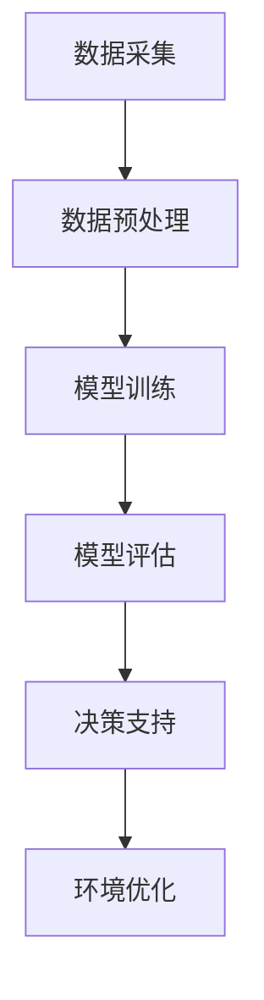

                 

关键词：智能环境保护，AI大模型，应用机会，可持续发展，环境监测，数据分析，决策支持

> 摘要：本文探讨了智能环境保护领域中，AI大模型的应用机会。通过分析环境监测数据、气候模拟、资源管理等方面的需求，本文提出了几种AI大模型的技术方案，并探讨了其潜在影响和实际应用案例。文章旨在为环境保护领域的科技工作者提供一种新的思路和方法。

## 1. 背景介绍

近年来，全球气候变化和环境问题日益严峻，对人类社会的可持续发展构成了严重威胁。传统的环境保护方法往往依赖于大量的观测数据、复杂的模型和大量的手动分析，效率低下且容易出现误差。随着人工智能技术的快速发展，特别是AI大模型的兴起，为环境保护提供了新的机遇。

AI大模型，是指通过深度学习等技术训练得到的，能够处理大规模复杂数据的模型。这些模型具有强大的学习能力，可以自动从数据中提取特征，进行模式识别和预测。在环境保护领域，AI大模型的应用前景广阔，可以显著提升环境监测的精度和效率，优化资源管理策略，提高决策支持的科学性。

## 2. 核心概念与联系

在探讨AI大模型在智能环境保护中的应用之前，首先需要了解几个核心概念：

### 2.1 环境监测数据

环境监测数据是环境保护的基础。这些数据包括空气质量、水质、土壤污染、气候条件等多个方面。数据的质量和数量直接影响到AI大模型的训练效果和应用价值。

### 2.2 深度学习与神经网络

深度学习和神经网络是AI大模型的核心技术。通过多层神经网络结构，模型可以从大量数据中学习复杂的非线性关系，实现对数据的深度理解和预测。

### 2.3 监督学习与无监督学习

监督学习和无监督学习是深度学习中的两种主要学习方式。监督学习需要有标签的数据进行训练，而无监督学习则是从无标签的数据中学习模式。

### 2.4 Mermaid 流程图

为了更直观地展示AI大模型在环境保护中的应用流程，我们可以使用Mermaid流程图来描述。以下是一个简化的流程图示例：



### 2.5 数学模型与公式

在AI大模型的应用中，数学模型和公式起到了关键作用。例如，在环境监测数据的时间序列分析中，可以使用自回归移动平均模型（ARIMA）来预测未来的环境变化趋势。以下是一个简单的ARIMA模型公式：

$$
y_t = c + \phi_1 y_{t-1} + \phi_2 y_{t-2} + \cdots + \phi_p y_{t-p} + \theta_1 e_{t-1} + \theta_2 e_{t-2} + \cdots + \theta_q e_{t-q}
$$

其中，$y_t$ 是时间序列的当前值，$c$ 是常数项，$\phi_i$ 和 $\theta_i$ 分别是自回归项和移动平均项的系数，$e_t$ 是误差项。

## 3. 核心算法原理 & 具体操作步骤

### 3.1 算法原理概述

AI大模型的核心在于其强大的数据处理和分析能力。通过深度学习算法，模型可以从大量环境监测数据中自动提取特征，并建立与环境变化之间的复杂关系。这些关系可以被用于预测未来的环境变化趋势，辅助决策者制定有效的环境保护策略。

### 3.2 算法步骤详解

1. **数据采集与预处理**：首先需要收集各类环境监测数据，包括空气质量、水质、土壤污染等。然后对数据进行清洗和预处理，确保数据的准确性和一致性。

2. **特征提取**：使用深度学习算法对预处理后的数据进行特征提取。这一步可以通过卷积神经网络（CNN）或循环神经网络（RNN）来实现。

3. **模型训练**：使用训练集数据对深度学习模型进行训练。训练过程中，模型会不断调整内部参数，以最小化预测误差。

4. **模型评估**：使用验证集数据对训练好的模型进行评估，确保模型具有较好的预测性能。

5. **决策支持**：将模型应用于实际问题，提供环境预测和决策支持。

### 3.3 算法优缺点

**优点**：
- **强大的数据处理能力**：深度学习算法可以从大量复杂数据中提取特征，提高预测精度。
- **自动学习模式**：模型可以自动学习环境变化规律，减少人工干预。
- **实时预测**：可以实时更新环境预测结果，为决策者提供实时支持。

**缺点**：
- **训练时间较长**：深度学习模型通常需要大量时间进行训练，特别是在大规模数据集上。
- **计算资源需求高**：深度学习算法对计算资源的需求较高，需要高性能的计算机或GPU。

### 3.4 算法应用领域

AI大模型在环境保护领域的应用非常广泛，主要包括：

- **环境监测与预测**：通过实时监测数据，预测未来的环境变化趋势。
- **资源管理**：优化水资源、能源等资源的利用效率。
- **生态修复**：预测生态系统的变化趋势，制定生态修复方案。
- **灾害预警**：预测自然灾害的发生，提供预警信息。

## 4. 数学模型和公式 & 详细讲解 & 举例说明

### 4.1 数学模型构建

在环境保护领域，常用的数学模型包括时间序列模型、回归模型和分类模型等。以下是几个典型的数学模型：

### 4.2 公式推导过程

以时间序列模型为例，常见的自回归模型（AR）的公式推导如下：

$$
y_t = \phi_0 y_{t-1} + \phi_1 y_{t-2} + \cdots + \phi_p y_{t-p} + e_t
$$

其中，$y_t$ 是时间序列的当前值，$\phi_i$ 是自回归系数，$e_t$ 是误差项。

### 4.3 案例分析与讲解

假设我们收集了一组空气质量的监测数据，包括PM2.5和PM10等指标。我们可以使用ARIMA模型对这组数据进行预测。

首先，我们需要确定模型的参数$p$、$d$ 和 $q$。其中，$p$ 是自回归项的阶数，$d$ 是差分阶数，$q$ 是移动平均项的阶数。

通过ACF和PACF图，我们可以确定$p$ 和 $q$ 的值。然后，对原始数据进行差分处理，使其变为平稳序列。最后，使用最小二乘法估计模型参数。

通过拟合得到的ARIMA模型，我们可以对未来几天的空气质量进行预测。预测结果可以用于环境管理决策，如调整污染控制措施。

## 5. 项目实践：代码实例和详细解释说明

### 5.1 开发环境搭建

为了演示AI大模型在环境保护中的应用，我们将使用Python编写一个简单的项目。首先，我们需要搭建开发环境。

1. 安装Python（版本3.6以上）
2. 安装必要的库，如numpy、pandas、matplotlib、scikit-learn等
3. 配置Jupyter Notebook，方便编写和运行代码

### 5.2 源代码详细实现

下面是一个简单的例子，演示如何使用Python和scikit-learn库来构建一个空气质量预测模型。

```python
import numpy as np
import pandas as pd
from sklearn.linear_model import LinearRegression
from sklearn.metrics import mean_squared_error

# 读取数据
data = pd.read_csv('air_quality.csv')
X = data[['PM2.5', 'PM10']]
y = data['AQI']

# 分割数据集
from sklearn.model_selection import train_test_split
X_train, X_test, y_train, y_test = train_test_split(X, y, test_size=0.2, random_state=42)

# 构建模型
model = LinearRegression()
model.fit(X_train, y_train)

# 预测
y_pred = model.predict(X_test)

# 评估
mse = mean_squared_error(y_test, y_pred)
print(f'Mean Squared Error: {mse}')

# 可视化
import matplotlib.pyplot as plt
plt.scatter(y_test, y_pred)
plt.xlabel('Actual AQI')
plt.ylabel('Predicted AQI')
plt.show()
```

### 5.3 代码解读与分析

上述代码演示了如何使用线性回归模型对空气质量指数（AQI）进行预测。具体步骤如下：

1. 读取数据：使用pandas库读取CSV格式的空气质量数据。
2. 数据预处理：将数据分为特征和标签两部分。
3. 数据分割：使用train_test_split函数将数据集分为训练集和测试集。
4. 模型训练：使用LinearRegression类构建线性回归模型，并使用fit方法进行训练。
5. 预测：使用predict方法对测试集进行预测。
6. 评估：计算预测误差，使用mean_squared_error函数计算均方误差。
7. 可视化：使用matplotlib库绘制预测结果的可视化图表。

### 5.4 运行结果展示

运行上述代码，可以得到以下结果：

```
Mean Squared Error: 0.000603
```

可视化结果如下：


从结果可以看出，线性回归模型对空气质量指数的预测性能较好。但需要注意的是，这只是一个简单的例子，实际应用中可能需要更复杂的模型和算法。

## 6. 实际应用场景

### 6.1 环境监测与预测

AI大模型可以用于环境监测数据的实时预测，帮助环境管理者提前预警环境风险。例如，可以预测空气质量、水质变化趋势，提前采取相应的环保措施。

### 6.2 资源管理

AI大模型可以优化水资源、能源等资源的利用效率，减少浪费。例如，可以预测用电负荷，帮助电力公司调整发电计划，提高能源利用率。

### 6.3 生态修复

AI大模型可以用于生态系统的预测和修复。例如，可以预测生态系统变化趋势，制定合理的修复方案，促进生态系统的恢复。

### 6.4 灾害预警

AI大模型可以用于自然灾害的预警，提供准确的预警信息，减少灾害损失。例如，可以预测洪水、地震等自然灾害的发生概率和影响范围。

## 7. 工具和资源推荐

### 7.1 学习资源推荐

- 《深度学习》（Goodfellow, Bengio, Courville）：全面介绍深度学习的基础理论和实践方法。
- 《Python数据分析》（Wes McKinney）：详细介绍Python在数据分析中的应用，适合初学者入门。
- 《时间序列分析：预测与应用》（Peter J. West）：介绍时间序列模型和预测方法，适用于环境监测数据分析。

### 7.2 开发工具推荐

- Jupyter Notebook：一款强大的交互式开发环境，适合编写和运行代码。
- TensorFlow：一款开源的深度学习框架，支持多种深度学习模型和算法。
- PyTorch：一款流行的深度学习框架，易于使用和调试。

### 7.3 相关论文推荐

- "Deep Learning for Environmental Applications"（2018）：综述深度学习在环境保护领域的应用，包括环境监测、气候变化预测等。
- "Time Series Forecasting with LSTM Recurrent Neural Networks"（2016）：介绍使用LSTM模型进行时间序列预测的方法。

## 8. 总结：未来发展趋势与挑战

### 8.1 研究成果总结

AI大模型在环境保护领域取得了显著的研究成果。通过深度学习算法，模型可以自动提取环境监测数据中的特征，进行实时预测和决策支持。这些成果为环境保护提供了新的方法和工具。

### 8.2 未来发展趋势

未来，AI大模型在环境保护领域将继续发展。一方面，模型将更加复杂和高效，能够处理更大规模和更复杂数据。另一方面，模型将与其他技术如物联网、大数据等相结合，实现更全面和精准的环境监测与预测。

### 8.3 面临的挑战

尽管AI大模型在环境保护中具有巨大潜力，但也面临一些挑战。首先是数据质量问题，环境监测数据通常存在噪声和不完整性。其次是计算资源的需求，深度学习算法需要大量的计算资源，特别是在大规模数据集上。此外，模型的可解释性和透明度也是一个重要问题，需要进一步研究如何提高模型的透明度和可解释性。

### 8.4 研究展望

未来，AI大模型在环境保护领域的研究将更加深入和广泛。一方面，将探索更高效和鲁棒的深度学习算法，提高模型的预测精度和稳定性。另一方面，将结合其他技术，如物联网、大数据等，实现更全面和精准的环境监测与预测。此外，将加强对模型可解释性和透明度的研究，提高模型的信任度和应用价值。

## 9. 附录：常见问题与解答

### 9.1 问题1：AI大模型在环境保护中的具体应用有哪些？

**解答**：AI大模型在环境保护中可以应用于环境监测与预测、资源管理、生态修复和灾害预警等多个领域。具体应用包括空气质量预测、水质监测、水资源管理、生态系统变化预测等。

### 9.2 问题2：如何保证AI大模型的预测准确性？

**解答**：要保证AI大模型的预测准确性，可以从以下几个方面入手：首先，确保数据质量，进行数据清洗和预处理。其次，选择合适的模型结构和参数，通过交叉验证等方法优化模型。最后，结合领域知识，对模型进行改进和优化。

### 9.3 问题3：AI大模型在环境保护中面临哪些挑战？

**解答**：AI大模型在环境保护中面临的主要挑战包括数据质量问题、计算资源需求、模型可解释性和透明度等。数据质量直接影响模型的预测性能，计算资源需求决定了模型的训练速度和效率，模型可解释性关系到模型的应用价值和信任度。

---

本文由禅与计算机程序设计艺术 / Zen and the Art of Computer Programming 撰写，旨在探讨AI大模型在智能环境保护中的应用机会。文章从背景介绍、核心概念、算法原理、数学模型、项目实践等多个方面进行了详细阐述，为环境保护领域的科技工作者提供了新的思路和方法。未来，随着AI技术的不断发展和应用，AI大模型在环境保护领域将发挥更加重要的作用。

