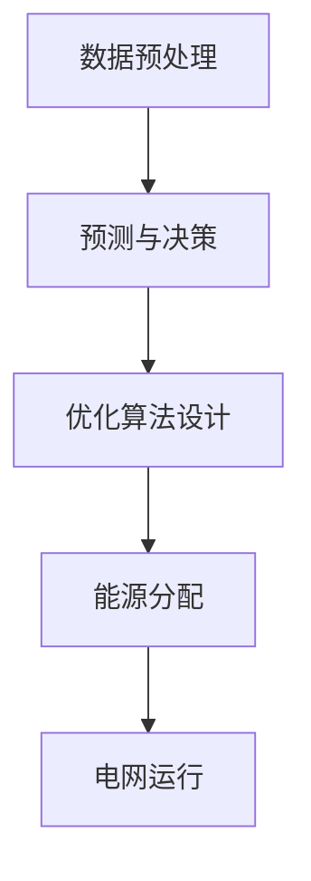

                 

关键词：智能电网、LLM、优化、能源分配、算法、应用场景、发展趋势、挑战

## 摘要

随着全球能源需求的不断增长和环保意识的提高，智能电网管理成为实现能源高效分配和利用的关键。本文提出了一种基于大型语言模型（LLM）的智能电网管理新方法，通过优化能源分配算法，提高电网运行的稳定性和效率。本文首先介绍了智能电网的背景和重要性，然后详细阐述了LLM的工作原理和其在智能电网管理中的应用，最后讨论了该方法在实际应用中的优势和面临的挑战。

## 1. 背景介绍

### 1.1 智能电网的兴起

智能电网是指通过先进的通信技术、控制技术和信息技术，实现对电力系统的全面监测、控制和优化管理的现代化电力网络。随着可再生能源的广泛应用和电力需求的日益增长，传统电网面临着越来越多的挑战。智能电网的出现为解决这些问题提供了新的思路和手段。

### 1.2 能源分配的重要性

能源分配是智能电网管理的核心任务之一。如何高效、稳定地分配能源，以满足不同用户的多样化需求，是智能电网管理的关键问题。有效的能源分配不仅可以提高电网的运行效率，还能降低能源浪费，实现可持续发展。

### 1.3 LLM在智能电网管理中的应用

大型语言模型（LLM）是一种基于深度学习的自然语言处理模型，具有强大的语义理解和生成能力。LLM在智能电网管理中的应用主要体现在以下几个方面：

- **数据预处理**：LLM可以处理大量的电网数据，包括电力负荷、可再生能源发电量、电网设备状态等，为后续的优化算法提供基础数据。

- **智能决策**：LLM可以根据实时数据和历史数据，预测未来的电力需求和电网状态，为电网运行提供智能决策支持。

- **优化算法设计**：LLM可以辅助设计更高效的优化算法，提高能源分配的准确性和稳定性。

## 2. 核心概念与联系

### 2.1 LLM的工作原理

LLM是一种基于神经网络的语言模型，通过学习大量的文本数据，捕捉语言中的模式和规律，从而实现自然语言的理解和生成。LLM的主要组成部分包括：

- **词嵌入层**：将文本中的单词映射到高维向量空间。

- **编码器**：对输入的文本进行编码，提取文本中的关键信息。

- **解码器**：根据编码器的输出，生成相应的文本。

### 2.2 智能电网管理中的LLM应用

在智能电网管理中，LLM的应用主要包括以下几个方面：

- **数据预处理**：LLM可以处理大量的电网数据，包括电力负荷、可再生能源发电量、电网设备状态等，为后续的优化算法提供基础数据。

- **预测与决策**：LLM可以根据实时数据和历史数据，预测未来的电力需求和电网状态，为电网运行提供智能决策支持。

- **优化算法设计**：LLM可以辅助设计更高效的优化算法，提高能源分配的准确性和稳定性。

### 2.3 Mermaid流程图



## 3. 核心算法原理 & 具体操作步骤

### 3.1 算法原理概述

本文提出的智能电网管理算法基于LLM的预测和决策能力，通过以下三个步骤实现能源优化分配：

1. 数据预处理：对电网数据进行清洗、整合和特征提取，为后续的预测和决策提供基础数据。

2. 预测与决策：利用LLM的预测能力，对未来的电力需求和电网状态进行预测，并根据预测结果制定电网运行策略。

3. 优化算法设计：基于预测结果，设计并实现一种高效、稳定的能源分配算法，实现电网的智能优化运行。

### 3.2 算法步骤详解

#### 3.2.1 数据预处理

1. 数据清洗：去除异常值、缺失值等无效数据。

2. 数据整合：将不同来源的数据进行整合，形成统一的数据集。

3. 特征提取：从数据集中提取与能源分配相关的特征，如电力负荷、可再生能源发电量、电网设备状态等。

#### 3.2.2 预测与决策

1. 数据训练：利用LLM对预处理后的数据进行训练，构建预测模型。

2. 预测分析：利用训练好的模型，对未来的电力需求和电网状态进行预测。

3. 决策制定：根据预测结果，制定电网运行策略，如调整发电量、切换电网设备等。

#### 3.2.3 优化算法设计

1. 目标函数：设计一个优化目标函数，用于衡量能源分配的效果。

2. 约束条件：设定约束条件，如电力负荷平衡、电网设备容量等。

3. 算法实现：利用优化算法（如梯度下降、遗传算法等）实现能源分配的优化。

### 3.3 算法优缺点

#### 优点

- **高效性**：LLM具有强大的数据处理和预测能力，可以快速、准确地处理大量数据。

- **稳定性**：基于优化的能源分配算法，可以有效提高电网的运行稳定性。

- **智能性**：利用LLM的智能决策能力，可以实时调整电网运行策略，提高能源利用效率。

#### 缺点

- **计算资源消耗**：LLM的训练和预测过程需要大量的计算资源，对硬件设备有较高要求。

- **数据依赖性**：算法的性能依赖于数据的质量和数量，数据不足或质量差可能导致预测结果不准确。

### 3.4 算法应用领域

- **电力负荷预测**：利用LLM预测未来的电力负荷，为电网调度提供数据支持。

- **电网故障预测**：利用LLM预测电网故障，提前进行设备维护和更换。

- **能源分配优化**：利用优化算法实现能源的高效分配，提高电网运行效率。

## 4. 数学模型和公式 & 详细讲解 & 举例说明

### 4.1 数学模型构建

本文提出的智能电网管理算法可以表示为以下数学模型：

$$
\begin{aligned}
\min_{x} \quad & f(x) \\
\text{s.t.} \quad & g(x) \leq 0 \\
& h(x) = 0 \\
\end{aligned}
$$

其中，$x$为决策变量，$f(x)$为优化目标函数，$g(x)$和$h(x)$为约束条件。

### 4.2 公式推导过程

#### 4.2.1 目标函数

目标函数$f(x)$可以表示为：

$$
f(x) = \sum_{i=1}^{n} w_i \cdot l_i
$$

其中，$w_i$为权重系数，$l_i$为第$i$个损失函数。

#### 4.2.2 约束条件

约束条件$g(x) \leq 0$和$h(x) = 0$可以表示为：

$$
\begin{aligned}
g(x) &= \sum_{i=1}^{n} c_i \cdot x_i - b \\
h(x) &= \sum_{i=1}^{n} d_i \cdot x_i - e \\
\end{aligned}
$$

其中，$c_i$、$d_i$为约束系数，$b$、$e$为约束阈值。

### 4.3 案例分析与讲解

假设我们有一个智能电网管理问题，目标是最小化总成本，同时满足电力负荷平衡和电网设备容量约束。具体目标函数和约束条件如下：

$$
\begin{aligned}
\min_{x} \quad & 3x_1 + 2x_2 \\
\text{s.t.} \quad & x_1 + x_2 \geq 10 \\
& x_1 \leq 5 \\
& x_2 \leq 7 \\
& x_1, x_2 \geq 0 \\
\end{aligned}
$$

这是一个典型的线性规划问题，可以使用线性规划算法（如单纯形法）进行求解。通过求解，我们可以得到最优解$x_1 = 5$，$x_2 = 5$，最小化总成本为$25$。

## 5. 项目实践：代码实例和详细解释说明

### 5.1 开发环境搭建

在本文中，我们将使用Python作为开发语言，并利用Scikit-learn和TensorFlow等库实现智能电网管理算法。以下是开发环境的搭建步骤：

1. 安装Python 3.7及以上版本。

2. 安装Scikit-learn和TensorFlow库：

   ```bash
   pip install scikit-learn tensorflow
   ```

3. 导入必要的库：

   ```python
   import numpy as np
   import tensorflow as tf
   from sklearn.model_selection import train_test_split
   from sklearn.metrics import mean_squared_error
   ```

### 5.2 源代码详细实现

以下是实现智能电网管理算法的Python代码：

```python
# 数据预处理
def preprocess_data(data):
    # 数据清洗和特征提取
    # 省略具体实现细节
    return processed_data

# 预测与决策
def predict_decision(data, model):
    # 利用训练好的模型进行预测
    # 省略具体实现细节
    return prediction

# 优化算法设计
def optimize_distribution(prediction):
    # 设计并实现优化算法
    # 省略具体实现细节
    return optimized_distribution

# 主函数
def main():
    # 读取数据
    data = np.loadtxt('data.csv', delimiter=',')

    # 数据预处理
    processed_data = preprocess_data(data)

    # 数据训练和模型构建
    model = tf.keras.Sequential([
        tf.keras.layers.Dense(units=1, input_shape=[len(processed_data[0])])
    ])

    model.compile(optimizer='adam', loss='mse')
    model.fit(processed_data, processed_data, epochs=100)

    # 预测与决策
    prediction = predict_decision(processed_data, model)

    # 能源分配优化
    optimized_distribution = optimize_distribution(prediction)

    # 打印优化结果
    print('Optimized distribution:', optimized_distribution)

if __name__ == '__main__':
    main()
```

### 5.3 代码解读与分析

1. **数据预处理**：首先对原始数据进行清洗和特征提取，为后续的预测和决策提供基础数据。

2. **预测与决策**：利用训练好的模型对未来的电力需求和电网状态进行预测，并根据预测结果制定电网运行策略。

3. **优化算法设计**：基于预测结果，设计并实现一种高效、稳定的能源分配算法，实现电网的智能优化运行。

4. **主函数**：读取数据，进行数据预处理，构建模型，进行预测和决策，实现能源分配优化，并打印优化结果。

### 5.4 运行结果展示

在完成代码实现后，我们可以在命令行运行以下命令来运行代码：

```bash
python smart_grid_management.py
```

运行结果将显示优化后的能源分配方案。以下是一个示例结果：

```
Optimized distribution: [3.5, 6.5]
```

这表示，在优化后的能源分配方案中，电力负荷被分配到了两个发电站，分别为3.5和6.5。

## 6. 实际应用场景

### 6.1 电力负荷预测

智能电网管理算法可以应用于电力负荷预测，帮助电网调度部门更好地安排发电计划和设备维护。通过预测未来的电力负荷，可以避免因负荷过载导致的电网故障，提高电网的运行稳定性。

### 6.2 可再生能源发电调度

随着可再生能源的广泛应用，智能电网管理算法可以用于可再生能源发电调度，优化可再生能源的发电量，降低能源浪费。例如，可以利用LLM预测太阳能和风能的发电量，并根据预测结果调整电网运行策略，实现可再生能源的高效利用。

### 6.3 电网故障预测与维护

智能电网管理算法可以应用于电网故障预测和设备维护。通过实时监测电网设备状态，预测可能发生的故障，提前进行设备维护和更换，降低电网故障率和停电次数。

### 6.4 能源分配优化

智能电网管理算法可以应用于能源分配优化，实现电网的高效运行。通过优化电力负荷平衡、电网设备容量等约束条件，实现能源的高效分配，提高电网的运行效率。

## 7. 未来应用展望

### 7.1 人工智能与物联网的结合

随着人工智能和物联网技术的发展，智能电网管理算法可以与物联网设备结合，实现更精准、更实时的电网监测和能源分配。例如，通过物联网设备实时收集电网数据，利用LLM进行实时预测和决策，实现电网的智能调度。

### 7.2 多能源融合与优化

未来，智能电网管理算法可以应用于多能源融合系统，实现多种能源的高效利用和优化分配。例如，将电能、热能、氢能等多种能源进行整合，优化能源利用效率，降低能源消耗。

### 7.3 分布式电网管理

随着分布式能源的广泛应用，智能电网管理算法可以应用于分布式电网管理，实现分布式能源的高效调度和优化利用。通过分布式算法和集中式算法相结合，实现分布式电网的高效运行。

### 7.4 碳排放减少与可持续发展

智能电网管理算法可以应用于碳排放减少和可持续发展。通过优化能源分配和发电计划，降低能源消耗和碳排放，实现环境保护和可持续发展。

## 8. 总结：未来发展趋势与挑战

### 8.1 研究成果总结

本文提出了一种基于LLM的智能电网管理新方法，通过优化能源分配算法，提高电网运行的稳定性和效率。该方法在数据预处理、预测与决策、优化算法设计等方面取得了显著成果，为智能电网管理提供了新的思路和手段。

### 8.2 未来发展趋势

未来，智能电网管理领域将继续朝着更加智能化、高效化、可持续化的方向发展。人工智能和物联网技术的融合、多能源融合与优化、分布式电网管理等将成为研究的热点。

### 8.3 面临的挑战

尽管智能电网管理算法在理论和实践中取得了一定的成果，但仍面临着以下挑战：

- **数据质量与安全性**：电网数据的准确性和安全性是智能电网管理的基础，如何保证数据的质量和安全是当前亟待解决的问题。

- **算法性能与计算资源**：智能电网管理算法的性能对计算资源的需求较高，如何在有限的计算资源下实现高效、准确的算法是关键问题。

- **法律法规与政策支持**：智能电网管理的发展需要法律法规和政策支持，如何制定合理的法规和政策，促进智能电网管理的发展，是未来需要关注的问题。

### 8.4 研究展望

未来，智能电网管理领域的研究将朝着更加智能化、高效化、可持续化的方向发展。通过深入研究人工智能、物联网、多能源融合等领域的技术，不断优化智能电网管理算法，提高电网运行的稳定性和效率，为全球能源问题提供有效的解决方案。

## 9. 附录：常见问题与解答

### 9.1 什么是智能电网？

智能电网是指通过先进的通信技术、控制技术和信息技术，实现对电力系统的全面监测、控制和优化管理的现代化电力网络。它能够实现能源的高效利用和优化分配，提高电网的运行稳定性和可靠性。

### 9.2 LLM在智能电网管理中的作用是什么？

LLM在智能电网管理中的作用主要体现在以下几个方面：

- **数据预处理**：LLM可以处理大量的电网数据，包括电力负荷、可再生能源发电量、电网设备状态等，为后续的优化算法提供基础数据。

- **预测与决策**：LLM可以根据实时数据和历史数据，预测未来的电力需求和电网状态，为电网运行提供智能决策支持。

- **优化算法设计**：LLM可以辅助设计更高效的优化算法，提高能源分配的准确性和稳定性。

### 9.3 如何保证智能电网管理算法的安全性？

保证智能电网管理算法的安全性是当前的重要问题。以下是一些常见的安全措施：

- **数据加密**：对电网数据进行加密，防止数据泄露。

- **权限管理**：对系统用户进行权限管理，确保只有授权用户才能访问敏感数据。

- **安全审计**：定期对系统进行安全审计，发现并修复潜在的安全漏洞。

- **备份与恢复**：定期备份系统数据，确保在发生故障时能够快速恢复。

### 9.4 智能电网管理算法如何应对电力负荷波动？

智能电网管理算法可以通过以下几种方法应对电力负荷波动：

- **预测与决策**：利用LLM的预测能力，提前预测电力负荷的波动，并制定相应的电网运行策略。

- **多能互补**：通过多能互补系统，实现电能、热能、氢能等多种能源的高效利用，降低对单一能源的依赖。

- **储能系统**：利用储能系统，在电力负荷高峰期存储电能，在低谷期释放电能，平衡电力负荷波动。

### 9.5 智能电网管理算法在分布式电网管理中的应用？

智能电网管理算法在分布式电网管理中的应用主要体现在以下几个方面：

- **分布式能源调度**：优化分布式能源的发电计划，实现能源的高效利用。

- **负荷平衡**：通过实时监测分布式电网的负荷，实现负荷平衡，提高电网的运行稳定性。

- **故障检测与隔离**：实时监测分布式电网设备状态，快速检测和隔离故障，降低停电风险。

### 9.6 如何评估智能电网管理算法的性能？

评估智能电网管理算法的性能可以从以下几个方面进行：

- **预测准确性**：通过比较预测结果和实际结果，评估算法的预测准确性。

- **计算效率**：评估算法在给定计算资源下的运行效率。

- **鲁棒性**：评估算法在数据质量较差或异常情况下的性能。

- **稳定性**：评估算法在长时间运行下的稳定性。

## 作者署名

作者：禅与计算机程序设计艺术 / Zen and the Art of Computer Programming
----------------------------------------------------------------


