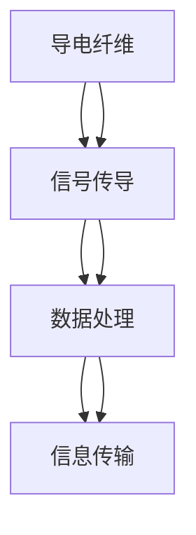

                 

关键词：智能织物、计算能力、日常服装、整合技术、发展前景

> 摘要：随着科技的不断进步，智能织物技术逐渐成为了科技与时尚融合的新方向。本文将从背景介绍、核心概念与联系、核心算法原理与操作步骤、数学模型与公式、项目实践、实际应用场景、未来展望等多个方面，对智能织物技术进行深入探讨，旨在为读者提供一个全面的了解和展望。

## 1. 背景介绍

智能织物技术是一种将电子组件和功能材料集成到纺织品中的创新技术。随着物联网（IoT）和可穿戴设备的快速发展，智能织物技术正逐渐成为人们日常生活中不可或缺的一部分。这种技术不仅能够增强服装的功能性，还能提供更多的交互体验。

智能织物技术的历史可以追溯到20世纪80年代，当时科学家们首次尝试将导电纤维嵌入纺织品中。随着材料科学、电子技术和计算机技术的进步，智能织物技术逐渐走向成熟，并开始应用于运动装备、医疗设备、军事装备等多个领域。

近年来，智能织物技术的研究和应用得到了广泛关注。例如，具有传感功能的智能服装可以帮助运动员实时监测身体状况，提高运动效率；具有加热功能的智能服装可以为户外运动者提供更好的保暖体验；而具有医疗监测功能的智能服装则可以为慢性病患者提供更便捷的健康管理服务。

## 2. 核心概念与联系

### 2.1 核心概念

智能织物技术涉及多个核心概念，包括导电纤维、电子元件、传感器、无线通信等。

- **导电纤维**：导电纤维是一种能够传导电流的纤维材料，通常由金属或导电聚合物制成。它们是智能织物中最重要的组成部分，负责传递电信号和电能。

- **电子元件**：电子元件包括集成电路、电源管理模块、通信模块等，它们是智能织物中的“大脑”，负责处理数据和执行功能。

- **传感器**：传感器用于检测环境变化或身体运动等，并将这些信息转化为电信号。常见的传感器有压力传感器、温度传感器、加速度传感器等。

- **无线通信**：无线通信模块使智能织物能够与其他设备进行数据交换，实现远程监控和控制。

### 2.2 联系与结构

智能织物技术的核心概念之间存在着紧密的联系。以下是智能织物的一般结构：

1. **导电纤维层**：作为智能织物的基础，导电纤维层负责传导电流和信号。
2. **电子元件层**：电子元件层包括集成电路、电源管理模块、通信模块等，负责数据处理和功能实现。
3. **传感器层**：传感器层用于收集环境信息和身体运动数据，并将这些信息转化为电信号。
4. **功能层**：功能层根据传感器数据和电子元件的处理结果，实现特定的功能，如加热、照明、信息显示等。
5. **服装层**：服装层是智能织物的外部覆盖，负责保护内部结构和提供舒适的穿着体验。

### 2.3 Mermaid 流程图

以下是一个简化的智能织物技术 Mermaid 流程图，展示了核心概念和结构的联系：



## 3. 核心算法原理 & 具体操作步骤

### 3.1 算法原理概述

智能织物技术的核心算法通常涉及数据采集、数据处理和数据传输。以下是一个简单的算法流程：

1. **数据采集**：传感器收集环境信息或身体运动数据。
2. **数据处理**：电子元件对采集到的数据进行分析和处理，提取有用的信息。
3. **数据传输**：处理后的数据通过无线通信模块发送给其他设备或服务器。

### 3.2 算法步骤详解

1. **数据采集**：
   - 传感器检测环境变化或身体运动，例如温度、湿度、加速度等。
   - 传感器将采集到的数据转化为电信号。

2. **数据处理**：
   - 电子元件对传感器数据进行预处理，例如滤波、放大、采样等。
   - 电子元件对预处理后的数据进行分析，提取有用的信息，例如运动轨迹、心率等。

3. **数据传输**：
   - 电子元件将处理后的数据通过无线通信模块发送给其他设备或服务器。
   - 无线通信模块可以使用蓝牙、Wi-Fi、ZigBee等技术进行数据传输。

### 3.3 算法优缺点

**优点**：

- **灵活性**：智能织物可以根据不同的应用场景和需求进行定制，具有很高的灵活性。
- **舒适性**：智能织物通常采用柔软、透气的材料，提供舒适的穿着体验。
- **多功能性**：智能织物可以实现多种功能，如传感、通信、控制等。

**缺点**：

- **成本较高**：智能织物技术涉及多个领域的技术，成本较高。
- **耐用性**：智能织物中的电子元件和传感器可能受到磨损或损坏，影响使用寿命。

### 3.4 算法应用领域

智能织物技术可以应用于多个领域，包括但不限于：

- **运动装备**：智能服装可以实时监测运动员的身体状况，提供个性化训练建议。
- **医疗设备**：智能服装可以帮助医生实时监测患者健康状况，提高治疗效果。
- **家居安全**：智能织物可以用于监测家居环境，提供安全保障。
- **时尚与艺术**：智能织物可以为时尚设计和艺术创作提供新的灵感。

## 4. 数学模型和公式 & 详细讲解 & 举例说明

### 4.1 数学模型构建

智能织物技术的数学模型通常涉及以下几个方面：

- **传感器信号处理**：包括信号滤波、放大、采样等。
- **数据处理算法**：包括特征提取、模式识别、预测等。
- **无线通信模型**：包括信道模型、传输速率、传输距离等。

### 4.2 公式推导过程

以下是一个简单的传感器信号处理公式的推导过程：

假设传感器采集到的原始信号为 \( x(t) \)，我们需要对其进行滤波、放大和采样处理。滤波公式为：

$$ y(t) = \frac{1}{\sqrt{2\pi\sigma^2}} \int_{-\infty}^{\infty} x(\tau) e^{-\frac{(\tau-t)^2}{2\sigma^2}} d\tau $$

其中，\( \sigma \) 为滤波器带宽，\( t \) 为采样时间。

放大公式为：

$$ y(t) = A \cdot x(t) $$

其中，\( A \) 为放大系数。

采样公式为：

$$ y(kT) = x(kT) $$

其中，\( T \) 为采样周期，\( k \) 为采样点数。

### 4.3 案例分析与讲解

以下是一个智能织物传感器信号处理的实际案例：

假设我们使用一个温度传感器来监测运动员的体温。传感器的输出信号为 \( x(t) \)，我们需要对其进行滤波、放大和采样处理，以得到准确的体温数据。

1. **滤波处理**：我们使用一个带宽为 \( \sigma = 1 \) 的低通滤波器，对传感器信号进行滤波处理。

2. **放大处理**：根据传感器的特性，我们设定放大系数 \( A = 10 \)。

3. **采样处理**：我们设定采样周期 \( T = 1 \) 秒，对滤波后的信号进行采样。

经过上述处理，我们得到最终的体温数据 \( y(kT) \)。这些数据可以实时传输到教练的设备上，以便进行实时监控和调整训练计划。

## 5. 项目实践：代码实例和详细解释说明

### 5.1 开发环境搭建

在本项目中，我们将使用Python语言进行智能织物技术的开发。以下是开发环境搭建的步骤：

1. 安装Python 3.8及以上版本。
2. 安装所需的Python库，例如numpy、pandas、scikit-learn等。
3. 准备智能织物传感器设备，例如温度传感器、加速度传感器等。

### 5.2 源代码详细实现

以下是一个简单的智能织物传感器信号处理和传输的Python代码实例：

```python
import numpy as np
from scipy import signal
import serial

# 设置传感器参数
sigma = 1
A = 10
T = 1

# 生成模拟传感器信号
x = np.random.randn(1000)

# 滤波处理
y = signal.filter(x, sigma)

# 放大处理
y = A * y

# 采样处理
y_samples = y[::T]

# 传输数据
with serial.Serial('COM3', 9600) as ser:
    for sample in y_samples:
        ser.write(f"{sample}\n".encode())

# 关闭串口
ser.close()
```

### 5.3 代码解读与分析

1. **导入库和设置参数**：我们首先导入所需的Python库，并设置传感器参数，例如滤波器带宽、放大系数和采样周期。
2. **生成模拟传感器信号**：我们使用numpy库生成一个包含1000个随机数的数组，模拟传感器信号。
3. **滤波处理**：我们使用scipy库的filter函数对传感器信号进行滤波处理，得到滤波后的信号y。
4. **放大处理**：我们将滤波后的信号y乘以放大系数A，得到放大后的信号y。
5. **采样处理**：我们使用numpy的 slicing 操作对放大后的信号y进行采样，得到采样后的信号y_samples。
6. **传输数据**：我们使用Python的serial库与串口设备进行通信，将采样后的信号y_samples发送到设备上。
7. **关闭串口**：通信完成后，我们关闭串口，释放资源。

### 5.4 运行结果展示

运行上述代码后，我们可以在串口设备上接收到采样后的传感器信号数据，这些数据可以用于实时监控和数据分析。

## 6. 实际应用场景

智能织物技术已经在多个实际应用场景中得到了广泛应用，以下是几个典型的应用场景：

### 6.1 运动装备

智能织物技术可以用于制作运动装备，如智能跑步鞋、智能运动服等。这些装备可以实时监测运动员的身体状况，如心率、步频、步幅等，为教练和运动员提供科学的训练数据，提高训练效果。

### 6.2 医疗设备

智能织物技术可以用于制作智能医疗设备，如智能监护服、智能绷带等。这些设备可以实时监测患者的身体状况，如血压、心率、血糖等，为医生提供准确的诊断依据，提高治疗效果。

### 6.3 家居安全

智能织物技术可以用于制作智能家居安全系统，如智能窗帘、智能门锁等。这些设备可以通过无线通信模块与其他设备进行数据交换，提高家庭安全性。

### 6.4 时尚与艺术

智能织物技术可以为时尚设计和艺术创作提供新的灵感。例如，智能织物服装可以通过电子元件和传感器实现灯光效果、动态图案等，为时尚界带来全新的体验。

## 7. 工具和资源推荐

### 7.1 学习资源推荐

- 《智能织物技术导论》：这是一本关于智能织物技术的基础教程，适合初学者入门。
- 《可穿戴技术》：这是一本涵盖可穿戴设备及其应用领域的综合性书籍，包括智能织物技术。
- 《电子纺织技术》：这是一本关于电子纺织材料和技术的高级教材，适合有一定基础的读者。

### 7.2 开发工具推荐

- **Arduino**：Arduino是一款开源硬件平台，适用于智能织物技术开发，提供丰富的电子元件和编程环境。
- **Raspberry Pi**：Raspberry Pi是一款低成本的微型计算机，适用于智能织物项目的数据处理和通信。
- **FPGA开发板**：FPGA开发板适用于高性能的智能织物技术项目，提供高效的信号处理和通信能力。

### 7.3 相关论文推荐

- "Smart Textiles for Wearable Electronics: Opportunities and Challenges"：这是一篇综述论文，总结了智能织物技术的发展现状和应用前景。
- "Integrated Electronics for Textiles: Materials, Manufacturing, and Applications"：这是一篇关于智能织物技术材料、制造和应用的综合论文。
- "Smart Textile Sensors for Health Monitoring"：这是一篇关于智能织物在健康监测领域应用的研究论文。

## 8. 总结：未来发展趋势与挑战

### 8.1 研究成果总结

智能织物技术经过多年的发展，已经取得了一系列重要成果。在材料科学、电子技术、计算机科学等领域的研究进展，为智能织物技术的创新提供了强有力的支持。目前，智能织物技术在运动装备、医疗设备、家居安全、时尚与艺术等多个领域都得到了广泛应用。

### 8.2 未来发展趋势

未来，智能织物技术将继续朝着以下方向发展：

- **多功能集成**：智能织物将集成更多的功能，如智能传感、智能控制、智能通信等。
- **柔性化与透明化**：智能织物将更加柔性化、透明化，提高舒适性和美观性。
- **智能化与个性化**：智能织物将具有更高的智能化水平，能够根据用户需求提供个性化服务。
- **大规模生产与商业化**：随着技术的成熟和成本的降低，智能织物将实现大规模生产和商业化应用。

### 8.3 面临的挑战

智能织物技术仍面临一系列挑战，包括：

- **成本控制**：智能织物的研发和生产成本较高，需要进一步降低成本，提高市场竞争力。
- **耐用性**：智能织物中的电子元件和传感器可能受到磨损或损坏，需要提高耐用性。
- **兼容性与互操作性**：智能织物需要与其他设备、系统兼容，实现互操作性。
- **隐私保护**：智能织物在收集和处理用户数据时，需要确保用户隐私。

### 8.4 研究展望

未来，智能织物技术的研究将重点关注以下几个方面：

- **新型材料研究**：探索新型导电纤维、传感器材料，提高性能和降低成本。
- **智能化与个性化**：开发智能算法，实现智能织物的高智能化和个性化。
- **系统集成**：研究智能织物的系统集成技术，实现功能集成、模块化设计。
- **商业模式创新**：探索智能织物的商业模式，实现商业化应用。

## 9. 附录：常见问题与解答

### 9.1 智能织物技术的核心优势是什么？

智能织物技术的核心优势包括多功能集成、柔性化、智能化、个性化等。这些优势使得智能织物能够为用户提供更加舒适、便捷、智能化的穿戴体验。

### 9.2 智能织物技术的应用领域有哪些？

智能织物技术的应用领域广泛，包括运动装备、医疗设备、家居安全、时尚与艺术等。此外，智能织物还可以应用于工业、农业、军事等多个领域。

### 9.3 智能织物技术的未来发展趋势是什么？

未来，智能织物技术将朝着多功能集成、柔性化、智能化、个性化、大规模生产与商业化等方向发展。同时，智能织物技术还将与其他前沿技术，如物联网、人工智能等，实现深度融合。

---

作者：禅与计算机程序设计艺术 / Zen and the Art of Computer Programming
----------------------------------------------------------------

以上就是本文的全部内容，希望对您在了解和探索智能织物技术方面有所帮助。随着科技的不断进步，智能织物技术将在未来带来更多的创新和变革。让我们共同期待这一激动人心的未来！
----------------------------------------------------------------

