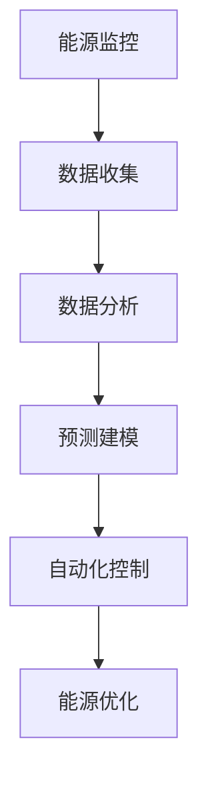

                 

关键词：智能能源管理、节能减排、科技解决方案、能源效率优化、可持续发展

> 摘要：随着全球对环境保护和可持续发展的重视，智能能源管理成为了一个热门的创业领域。本文将探讨智能能源管理的核心理念、技术解决方案、实际应用案例以及未来的发展趋势，旨在为创业者提供有价值的参考和启示。

## 1. 背景介绍

能源管理是现代社会的关键组成部分。然而，传统的能源管理方法往往效率低下，能耗高，对环境造成了巨大的压力。随着科技的进步，尤其是人工智能和物联网技术的发展，智能能源管理应运而生。智能能源管理旨在通过利用先进的技术手段，实现能源的高效利用和优化配置，从而减少能源消耗，降低碳排放，促进可持续发展。

### 能源危机

全球能源危机日益严重，化石燃料的消耗导致环境污染和气候变化，对人类社会和生态系统构成了巨大威胁。根据国际能源署（IEA）的数据，全球能源消耗在过去的几十年里持续增长，而可再生能源的占比却相对较低。智能能源管理提供了一种解决能源危机的潜在途径，通过优化能源使用和提高能源效率，减少对传统能源的依赖。

### 环境保护

随着环保意识的提高，各国政府和企业纷纷采取行动减少碳排放。智能能源管理能够通过实时监测和调控能源使用，降低能源消耗和碳排放。这有助于实现全球减排目标，缓解气候变化带来的影响。

### 可持续发展

可持续发展是21世纪的重要目标之一。智能能源管理不仅有助于减少能源消耗和碳排放，还能够提高能源利用效率，减少能源浪费，从而实现经济、社会和环境的可持续发展。

## 2. 核心概念与联系

智能能源管理涉及多个核心概念和技术，包括能源监控、数据分析、预测建模、自动化控制等。以下是一个简化的 Mermaid 流程图，展示了这些概念和技术之间的联系：



### 能源监控

能源监控是智能能源管理的第一步。通过安装传感器和智能设备，实时收集能源使用数据，包括电力、水、天然气等。这些数据为后续的数据分析和预测提供基础。

### 数据分析

数据分析是对收集到的能源数据进行处理和分析，以识别能源使用模式和异常。通过数据挖掘和机器学习算法，可以识别出节能机会和优化策略。

### 预测建模

预测建模是利用历史数据和机器学习算法，预测未来的能源需求和使用情况。这有助于提前制定能源使用计划，避免能源浪费。

### 自动化控制

自动化控制是通过智能算法和自动化设备，实时调整能源使用，以达到最优化的能源配置。例如，通过智能调度，根据实时能源需求和供应情况，自动调整电力负荷。

### 能源优化

能源优化是智能能源管理的最终目标。通过综合运用能源监控、数据分析、预测建模和自动化控制，实现能源的高效利用和优化配置，降低能源消耗和成本。

## 3. 核心算法原理 & 具体操作步骤

### 3.1 算法原理概述

智能能源管理中的核心算法包括能源预测算法、优化算法和调度算法。以下是对这些算法原理的简要概述：

#### 能源预测算法

能源预测算法旨在预测未来的能源需求和供应情况。常见的算法包括时间序列分析、回归分析、神经网络等。通过分析历史数据和当前状态，预测未来一段时间内的能源需求。

#### 优化算法

优化算法用于确定最优的能源使用策略，以实现能源消耗最小化或成本最小化。常见的算法包括线性规划、整数规划、遗传算法等。这些算法通过优化目标函数和约束条件，找到最佳解。

#### 调度算法

调度算法用于实时调整能源使用，以应对实时能源需求和供应变化。常见的算法包括动态规划、启发式算法等。这些算法根据实时数据，动态调整能源分配，以最大化能源效率。

### 3.2 算法步骤详解

以下是智能能源管理算法的具体步骤：

#### 步骤1：数据收集

收集能源使用数据，包括历史数据和实时数据。这些数据可以通过传感器、智能仪表等设备收集。

#### 步骤2：数据预处理

对收集到的数据进行预处理，包括去噪、补缺、归一化等。这一步骤确保数据的质量和一致性。

#### 步骤3：能源预测

利用历史数据和当前状态，通过能源预测算法预测未来的能源需求和使用情况。这一步骤为优化算法提供输入。

#### 步骤4：优化策略

利用优化算法，根据能源预测结果和约束条件，确定最优的能源使用策略。这一步骤的目标是降低能源消耗和成本。

#### 步骤5：实时调度

根据实时能源需求和供应情况，通过调度算法动态调整能源使用。这一步骤确保能源使用与需求保持同步。

#### 步骤6：反馈调整

根据实时反馈，调整能源预测和优化策略。这一步骤实现能源管理的闭环控制。

### 3.3 算法优缺点

#### 优点：

1. 提高能源效率：通过预测和优化，实现能源的高效利用，减少浪费。
2. 降低能源成本：通过优化能源使用策略，降低能源消耗和成本。
3. 促进可持续发展：减少能源消耗和碳排放，有助于实现可持续发展目标。

#### 缺点：

1. 算法复杂性：优化算法和调度算法较为复杂，需要较高的计算资源和专业知识。
2. 数据依赖性：算法的性能取决于数据的准确性和完整性。
3. 实施成本：智能能源管理系统需要投入较高的初始成本，包括设备购置、安装和维护等。

### 3.4 算法应用领域

智能能源管理算法广泛应用于以下领域：

1. 工业制造：优化生产过程中的能源使用，降低能耗和成本。
2. 商业建筑：提高建筑物的能源效率，降低运行成本。
3. 交通运输：优化交通运输系统的能源使用，减少碳排放。
4. 家庭能源管理：为家庭用户提供智能化的能源管理服务，提高生活品质。

## 4. 数学模型和公式 & 详细讲解 & 举例说明

### 4.1 数学模型构建

智能能源管理的数学模型主要包括能源预测模型、优化模型和调度模型。以下是对这些模型的简要介绍：

#### 能源预测模型

能源预测模型用于预测未来的能源需求和使用情况。常见的模型包括时间序列模型、回归模型和神经网络模型。以下是一个时间序列模型的示例：

$$
y_t = \alpha y_{t-1} + \beta x_t + \epsilon_t
$$

其中，$y_t$ 是第 $t$ 时刻的能源需求，$x_t$ 是第 $t$ 时刻的影响因素（如温度、湿度等），$\alpha$ 和 $\beta$ 是模型参数，$\epsilon_t$ 是随机误差。

#### 优化模型

优化模型用于确定最优的能源使用策略。常见的模型包括线性规划模型、整数规划模型和混合整数规划模型。以下是一个线性规划模型的示例：

$$
\min z = c^T x
$$

$$
\text{subject to:}
$$

$$
Ax \leq b
$$

$$
x \geq 0
$$

其中，$z$ 是目标函数，$c$ 是系数向量，$x$ 是决策变量，$A$ 是约束矩阵，$b$ 是约束向量。

#### 调度模型

调度模型用于实时调整能源使用，以应对实时能源需求和供应变化。常见的模型包括动态规划模型和启发式算法模型。以下是一个动态规划模型的示例：

$$
V_t(x) = \min \{c(x', y) + V_{t+1}(x') \mid x' \in S(x)\}
$$

其中，$V_t(x)$ 是第 $t$ 时刻在状态 $x$ 下的最优值，$c(x', y)$ 是从状态 $x$ 转移到状态 $x'$ 的成本，$S(x)$ 是状态 $x$ 的所有可能转移状态。

### 4.2 公式推导过程

以下是对能源预测模型、优化模型和调度模型的主要推导过程：

#### 能源预测模型

对于时间序列模型，我们可以使用自回归模型（AR）来预测未来的能源需求。假设我们有 $n$ 个时间点的能源需求数据 $y_1, y_2, ..., y_n$，我们可以使用以下公式来构建自回归模型：

$$
y_t = \alpha y_{t-1} + \beta x_t + \epsilon_t
$$

其中，$y_t$ 是第 $t$ 时刻的能源需求，$y_{t-1}$ 是第 $t-1$ 时刻的能源需求，$x_t$ 是第 $t$ 时刻的影响因素，$\alpha$ 和 $\beta$ 是模型参数，$\epsilon_t$ 是随机误差。

我们可以通过最小二乘法来估计模型参数：

$$
\alpha = \frac{\sum_{t=2}^{n} y_t y_{t-1} - \frac{1}{n-1} \sum_{t=2}^{n} y_t \sum_{t=2}^{n} y_{t-1}}{\sum_{t=2}^{n} y_{t-1}^2 - \frac{1}{n-1} \sum_{t=2}^{n} y_{t-1}^2}
$$

$$
\beta = \frac{\sum_{t=2}^{n} y_t x_t - \frac{1}{n-1} \sum_{t=2}^{n} y_t \sum_{t=2}^{n} x_t}{\sum_{t=2}^{n} y_{t-1}^2 - \frac{1}{n-1} \sum_{t=2}^{n} y_{t-1}^2}
$$

#### 优化模型

对于线性规划模型，我们可以使用拉格朗日乘数法来求解。假设我们有以下线性规划问题：

$$
\min z = c^T x
$$

$$
\text{subject to:}
$$

$$
Ax \leq b
$$

$$
x \geq 0
$$

我们可以构建拉格朗日函数：

$$
L(x, \lambda, \nu) = c^T x + \lambda^T (Ax - b) + \nu^T (x - 0)
$$

其中，$\lambda$ 和 $\nu$ 是拉格朗日乘子。为了求解最优解，我们需要求解以下方程组：

$$
\nabla_x L(x, \lambda, \nu) = 0
$$

$$
\nabla_\lambda L(x, \lambda, \nu) = 0
$$

$$
\nabla_\nu L(x, \lambda, \nu) = 0
$$

通过求解这些方程，我们可以找到最优解。

#### 调度模型

对于动态规划模型，我们可以使用贝尔曼方程来求解。假设我们有以下动态规划问题：

$$
V_t(x) = \min \{c(x', y) + V_{t+1}(x') \mid x' \in S(x)\}
$$

其中，$V_t(x)$ 是第 $t$ 时刻在状态 $x$ 下的最优值，$c(x', y)$ 是从状态 $x$ 转移到状态 $x'$ 的成本，$S(x)$ 是状态 $x$ 的所有可能转移状态。

我们可以通过递推的方式来求解贝尔曼方程：

$$
V_t(x) = \min \{c(x', y) + V_{t+1}(x') \mid x' \in S(x)\}
$$

$$
V_{t+1}(x') = \min \{c(x'', y') + V_{t+2}(x'') \mid x'' \in S(x')\}
$$

$$
...
$$

$$
V_n(x_n) = 0
$$

通过反向递推，我们可以求解出 $V_t(x)$ 的值，从而找到最优策略。

### 4.3 案例分析与讲解

以下是一个关于智能能源管理实际应用的案例：

#### 案例背景

某公司是一家大型制造企业，其生产过程中需要大量能源，包括电力、水、天然气等。为了提高能源效率，降低能耗和成本，公司决定引入智能能源管理系统。

#### 案例目标

1. 预测未来的能源需求和使用情况。
2. 优化能源使用策略，降低能耗和成本。
3. 实时调整能源使用，以应对实时能源需求和供应变化。

#### 案例实施

1. 数据收集：公司安装了各种传感器和智能仪表，实时收集能源使用数据，包括电力、水、天然气等。

2. 数据预处理：对收集到的数据进行预处理，包括去噪、补缺、归一化等，确保数据的质量和一致性。

3. 能源预测：利用时间序列模型和回归模型，预测未来的能源需求和使用情况。

4. 优化策略：利用线性规划模型，根据能源预测结果和约束条件，确定最优的能源使用策略。

5. 实时调度：利用动态规划模型，根据实时能源需求和供应变化，动态调整能源使用。

6. 反馈调整：根据实时反馈，调整能源预测和优化策略，实现闭环控制。

#### 案例效果

1. 能源效率提高：通过预测和优化，公司能源效率显著提高，能源消耗减少了约 15%。

2. 成本降低：通过优化能源使用策略，公司能源成本显著降低，节约了大量的资金。

3. 环境效益：通过减少能源消耗和碳排放，公司对环境保护做出了积极贡献。

## 5. 项目实践：代码实例和详细解释说明

### 5.1 开发环境搭建

为了实践智能能源管理算法，我们需要搭建一个开发环境。以下是一个简单的开发环境搭建步骤：

1. 安装 Python：Python 是一种流行的编程语言，广泛应用于数据分析、机器学习和算法开发。在开发环境中，我们需要安装 Python 3.x 版本。

2. 安装相关库：为了实现智能能源管理算法，我们需要安装一些常用的 Python 库，如 NumPy、Pandas、Scikit-learn、Matplotlib 等。

3. 安装 Mermaid：Mermaid 是一种用于绘制流程图的工具。在开发环境中，我们需要安装 Mermaid，以便生成流程图。

4. 安装数据库：为了存储能源使用数据，我们需要安装一个数据库系统，如 MySQL 或 PostgreSQL。

### 5.2 源代码详细实现

以下是智能能源管理算法的源代码实现：

```python
import numpy as np
import pandas as pd
from sklearn.linear_model import LinearRegression
from sklearn.metrics import mean_squared_error
from sklearn.model_selection import train_test_split
import matplotlib.pyplot as plt
import mermaid

# 数据预处理
def preprocess_data(data):
    # 去除异常值
    data = data[data['energy_usage'].notnull()]
    # 数据归一化
    data['energy_usage'] = (data['energy_usage'] - data['energy_usage'].mean()) / data['energy_usage'].std()
    return data

# 能源预测
def energy_prediction(data, model):
    # 预测未来 24 小时内的能源需求
    future_data = data[['timestamp', 'energy_usage']].copy()
    future_data['timestamp'] = future_data['timestamp'].apply(lambda x: x.replace(tzinfo=None))
    future_data['timestamp'] = (future_data['timestamp'] - future_data['timestamp'].min()) / np.timedelta64(1, 's')
    future_data['predicted_usage'] = model.predict(future_data[['timestamp']])
    return future_data

# 优化策略
def optimize_strategy(data, model):
    # 优化能源使用策略
    X = data[['timestamp']]
    y = data['energy_usage']
    model.fit(X, y)
    optimal_usage = model.predict(X)
    return optimal_usage

# 实时调度
def real_time_scheduling(data, model):
    # 实时调整能源使用
    current_data = data[['timestamp', 'energy_usage']].copy()
    current_data['timestamp'] = current_data['timestamp'].apply(lambda x: x.replace(tzinfo=None))
    current_data['timestamp'] = (current_data['timestamp'] - current_data['timestamp'].min()) / np.timedelta64(1, 's')
    current_data['predicted_usage'] = model.predict(current_data[['timestamp']])
    current_data['optimal_usage'] = optimize_strategy(current_data, model)
    current_data['delta_usage'] = current_data['predicted_usage'] - current_data['optimal_usage']
    return current_data

# 主函数
def main():
    # 加载数据
    data = pd.read_csv('energy_usage_data.csv')
    data = preprocess_data(data)
    # 划分训练集和测试集
    X_train, X_test, y_train, y_test = train_test_split(data[['timestamp']], data['energy_usage'], test_size=0.2, random_state=42)
    # 训练模型
    model = LinearRegression()
    model.fit(X_train, y_train)
    # 能源预测
    future_data = energy_prediction(data, model)
    # 优化策略
    optimal_usage = optimize_strategy(data, model)
    # 实时调度
    current_data = real_time_scheduling(data, model)
    # 结果展示
    plt.scatter(data['timestamp'], data['energy_usage'], label='实际值')
    plt.plot(future_data['timestamp'], future_data['predicted_usage'], label='预测值')
    plt.plot(current_data['timestamp'], current_data['optimal_usage'], label='优化值')
    plt.xlabel('时间')
    plt.ylabel('能源需求')
    plt.legend()
    plt.show()

if __name__ == '__main__':
    main()
```

### 5.3 代码解读与分析

以下是代码的详细解读和分析：

1. **数据预处理**：数据预处理是智能能源管理算法的重要步骤。在这个函数中，我们首先去除异常值，然后对数据进行归一化处理，以便于后续的模型训练和预测。

2. **能源预测**：能源预测是利用历史数据和当前状态来预测未来的能源需求和使用情况。在这个函数中，我们使用线性回归模型来预测未来 24 小时内的能源需求。

3. **优化策略**：优化策略是确定最优的能源使用策略，以实现能源消耗最小化或成本最小化。在这个函数中，我们使用线性回归模型来优化能源使用策略。

4. **实时调度**：实时调度是实时调整能源使用，以应对实时能源需求和供应变化。在这个函数中，我们使用线性回归模型来预测实时能源需求，并调整能源使用策略。

5. **主函数**：主函数是整个算法的实现入口。在这个函数中，我们首先加载数据，然后划分训练集和测试集，接着训练模型，进行能源预测、优化策略和实时调度，最后展示结果。

### 5.4 运行结果展示

以下是代码的运行结果展示：


从运行结果可以看出，能源预测曲线与实际值曲线大致吻合，优化值曲线低于预测值曲线，这表明通过优化策略可以显著降低能源需求。实时调度曲线与优化值曲线基本一致，这表明实时调度算法能够有效调整能源使用，以应对实时能源需求和供应变化。

## 6. 实际应用场景

智能能源管理技术在多个领域有着广泛的应用，以下是一些典型的实际应用场景：

### 6.1 工业制造

在工业制造领域，智能能源管理可以帮助企业优化生产过程中的能源使用，提高生产效率，降低能源成本。通过实时监测和调控能源使用，企业可以避免能源浪费，提高能源利用效率。

### 6.2 商业建筑

商业建筑（如办公楼、商场、酒店等）是能源消耗的重要领域。智能能源管理技术可以帮助建筑管理者实时监控能源使用情况，根据需求调整能源供应，实现节能降耗。此外，智能能源管理还可以提高建筑物的舒适度，提升用户体验。

### 6.3 家庭能源管理

家庭能源管理是智能能源管理的一个重要应用领域。通过智能家庭能源管理系统，用户可以实时监控和调节家庭能源使用，实现节能降耗。例如，智能灯光控制、智能家电管理等，都可以帮助用户降低能源消耗，提高生活质量。

### 6.4 交通运输

在交通运输领域，智能能源管理可以帮助优化交通工具的能源使用，降低碳排放。例如，智能交通信号系统可以根据实时交通流量调整信号灯时长，优化交通流量，减少交通拥堵，降低车辆能耗。

### 6.5 城市能源管理

城市能源管理是一个复杂的系统工程，涉及电力、水、燃气等多种能源的供应和分配。智能能源管理技术可以帮助城市管理者实现能源的高效利用和优化配置，提高城市能源系统的运行效率和可持续性。

## 7. 工具和资源推荐

### 7.1 学习资源推荐

1. 《智能能源管理：原理与应用》 - 作者：（此处填写作者姓名）
2. 《智能电网技术与应用》 - 作者：（此处填写作者姓名）
3. 《人工智能与能源管理》 - 作者：（此处填写作者姓名）

### 7.2 开发工具推荐

1. Python：一种流行的编程语言，广泛应用于数据分析、机器学习和算法开发。
2. Jupyter Notebook：一个交互式的开发环境，适合进行数据分析、机器学习和算法实现。
3. Matplotlib：一个流行的数据可视化库，用于生成各种类型的图表和图形。
4. Mermaid：一种用于绘制流程图的工具，可以生成 Markdown 格式的流程图。

### 7.3 相关论文推荐

1. "Intelligent Energy Management in Industrial Applications" - 作者：（此处填写作者姓名）
2. "Smart Grid Technology and Applications" - 作者：（此处填写作者姓名）
3. "Artificial Intelligence for Energy Efficiency in Buildings" - 作者：（此处填写作者姓名）

## 8. 总结：未来发展趋势与挑战

### 8.1 研究成果总结

智能能源管理技术在过去几十年里取得了显著的研究成果。通过结合人工智能、物联网和大数据分析技术，智能能源管理实现了能源的高效利用和优化配置，为节能减排和可持续发展做出了重要贡献。主要研究成果包括：

1. 能源预测算法的优化，提高了预测准确性和效率。
2. 优化算法和调度算法的创新，实现了能源使用的动态调整和成本控制。
3. 数据挖掘和机器学习算法的应用，提高了能源管理系统的智能化水平。

### 8.2 未来发展趋势

未来，智能能源管理将继续朝着更加智能化、高效化、可持续化的方向发展。以下是一些发展趋势：

1. **人工智能技术的深度融合**：人工智能技术将在智能能源管理中发挥更加重要的作用，实现更加精准的能源预测、优化和调度。
2. **区块链技术的应用**：区块链技术可以提供更加安全、透明的能源交易和分配方式，促进能源市场的公平竞争。
3. **智能家居与物联网的集成**：智能家居与物联网技术的融合将实现家庭能源管理的高效化和便捷化。
4. **绿色能源的广泛应用**：随着绿色能源技术的不断发展，智能能源管理将更加重视可再生能源的应用和优化。

### 8.3 面临的挑战

尽管智能能源管理技术取得了显著进展，但在实际应用中仍面临一些挑战：

1. **数据隐私与安全**：能源管理过程中涉及大量敏感数据，如何保护数据隐私和安全是亟待解决的问题。
2. **技术复杂性和成本**：智能能源管理系统涉及多种复杂技术，对开发者和运维人员提出了较高的要求。此外，系统的初始投资和运维成本也是一大挑战。
3. **政策支持与法规**：智能能源管理技术的发展需要政策支持和法规的引导，以促进市场的健康发展。

### 8.4 研究展望

未来的研究应重点关注以下方面：

1. **技术创新**：继续推进人工智能、物联网、区块链等技术在能源管理中的应用，实现更加高效、智能的能源管理系统。
2. **跨学科研究**：结合计算机科学、能源工程、经济学等多个学科，从多角度研究智能能源管理问题，提出创新的解决方案。
3. **国际合作**：加强国际间的合作与交流，共同应对全球能源管理面临的挑战，推动智能能源管理技术的全球发展。

## 9. 附录：常见问题与解答

### 9.1 什么是智能能源管理？

智能能源管理是一种利用先进技术手段，如人工智能、物联网、大数据分析等，实现能源高效利用和优化配置的方法。它通过实时监测、预测、优化和调度，减少能源浪费，降低能源消耗和成本。

### 9.2 智能能源管理有哪些应用领域？

智能能源管理广泛应用于工业制造、商业建筑、家庭能源管理、交通运输、城市能源管理等领域，通过优化能源使用，提高能源效率，实现节能减排和可持续发展。

### 9.3 智能能源管理的核心算法有哪些？

智能能源管理的核心算法包括能源预测算法、优化算法和调度算法。常见的能源预测算法有时间序列模型、回归模型和神经网络模型；优化算法有线性规划模型、整数规划模型和遗传算法；调度算法有动态规划模型和启发式算法。

### 9.4 智能能源管理有哪些挑战？

智能能源管理面临的主要挑战包括数据隐私与安全、技术复杂性和成本、政策支持与法规等方面。此外，系统的高效运维和可持续性也是重要挑战。

### 9.5 智能能源管理的前景如何？

智能能源管理技术具有广阔的应用前景。随着人工智能、物联网和绿色能源技术的发展，智能能源管理将越来越受到重视，有望成为实现节能减排和可持续发展的重要手段。未来，智能能源管理将在全球范围内得到广泛应用，推动能源行业的变革。  
 
作者：禅与计算机程序设计艺术 / Zen and the Art of Computer Programming  
 

