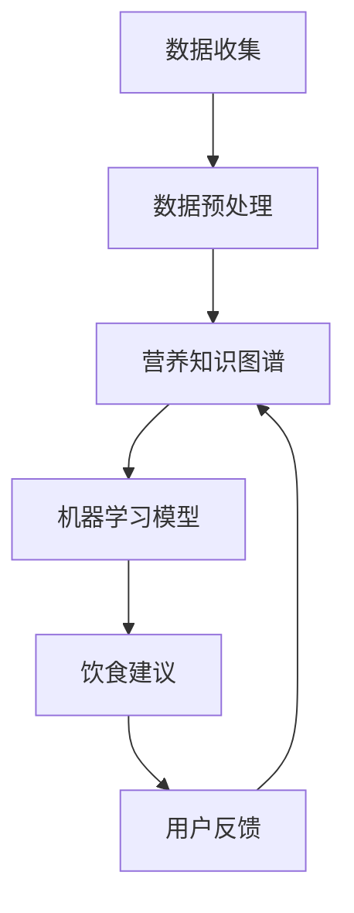

                 

随着科技的飞速发展，人工智能（AI）技术正逐渐渗透到我们生活的各个领域。在营养科学领域，个性化饮食建议正成为趋势，而科技的支持则是这一变革的关键。本文将探讨如何利用人工智能技术实现个性化饮食建议，并介绍相关的核心概念、算法原理、数学模型、项目实践和未来应用场景。

## 关键词

- 个性化饮食建议
- 人工智能
- 营养科学
- 个性化健康
- 科技支持

## 摘要

本文首先介绍了个性化饮食建议的重要性，然后探讨了如何利用人工智能技术实现这一目标。接着，文章详细阐述了核心概念、算法原理和数学模型，并通过一个实际项目实践展示了这些技术的应用。最后，文章展望了个性化饮食建议的未来发展趋势和应用场景。

## 1. 背景介绍

随着生活水平的提高，人们越来越关注健康饮食。然而，由于个体差异和生活方式的不同，每个人的饮食需求也各不相同。传统的营养建议往往基于群体数据，难以满足个体的需求。个性化饮食建议能够根据个人的身体状况、生活习惯和饮食偏好，提供更为精准的饮食建议，从而提高健康水平。

近年来，人工智能技术的发展为个性化饮食建议的实现提供了可能。机器学习算法能够分析大量的数据，识别出个体的饮食习惯和营养需求，从而生成个性化的饮食建议。此外，自然语言处理技术可以处理和分析用户的反馈，进一步优化饮食建议。

## 2. 核心概念与联系

为了实现个性化饮食建议，我们需要以下几个核心概念：

1. **个性化健康数据收集**：通过传感器、移动设备等收集用户的生理数据、饮食习惯和生活方式数据。
2. **营养知识图谱**：构建一个包含各种营养素、食物和疾病关系的知识图谱，为个性化饮食建议提供知识支持。
3. **机器学习算法**：利用机器学习算法分析用户数据，预测个体的营养需求，生成个性化的饮食建议。
4. **自然语言处理**：处理用户的反馈，理解和优化饮食建议。

下面是一个简化的 Mermaid 流程图，展示了这些概念之间的联系：



## 3. 核心算法原理 & 具体操作步骤

### 3.1 算法原理概述

个性化饮食建议的核心算法主要基于机器学习和自然语言处理技术。以下是主要的算法原理：

1. **数据收集与预处理**：收集用户的基本信息、饮食习惯、生理数据等，并进行数据清洗和预处理，以去除噪声和异常值。
2. **特征提取**：从预处理后的数据中提取与饮食建议相关的特征，如营养素摄入量、饮食习惯、生理指标等。
3. **机器学习模型训练**：利用提取的特征训练机器学习模型，如回归模型、分类模型等，以预测个体的营养需求。
4. **饮食建议生成**：基于训练好的模型生成个性化的饮食建议。
5. **用户反馈处理**：收集用户对饮食建议的反馈，利用自然语言处理技术理解和优化建议。

### 3.2 算法步骤详解

1. **数据收集**：收集用户的个人信息、饮食习惯、生理数据等，如身高、体重、运动量、饮食习惯等。
2. **数据预处理**：对收集到的数据进行分析，识别噪声和异常值，并进行数据清洗和归一化处理。
3. **特征提取**：从预处理后的数据中提取与饮食建议相关的特征，如营养素摄入量、饮食习惯、生理指标等。
4. **模型训练**：利用提取的特征和已有数据集训练机器学习模型，如线性回归、支持向量机、决策树等。
5. **饮食建议生成**：将用户的特征输入训练好的模型，生成个性化的饮食建议。
6. **用户反馈处理**：收集用户对饮食建议的反馈，利用自然语言处理技术理解和优化建议。

### 3.3 算法优缺点

**优点**：

- **个性化**：能够根据个体差异提供精准的饮食建议。
- **自动化**：通过机器学习模型自动生成建议，降低人力成本。
- **实时更新**：能够根据用户反馈实时调整建议，提高用户体验。

**缺点**：

- **数据质量**：依赖高质量的数据，否则可能导致错误建议。
- **模型复杂度**：算法复杂度高，需要大量计算资源和时间。
- **用户参与度**：用户需要积极参与数据输入和反馈，否则难以优化建议。

### 3.4 算法应用领域

个性化饮食建议的算法可以应用于多个领域，包括：

- **健康饮食指导**：为用户提供个性化的饮食建议，帮助改善健康状况。
- **营养管理**：为医生和营养师提供工具，辅助制定个性化的营养治疗方案。
- **食品工业**：为食品制造商提供数据支持，优化产品配方，满足不同消费者的需求。
- **健身与运动**：为健身爱好者提供个性化的饮食建议，帮助提高运动效果。

## 4. 数学模型和公式 & 详细讲解 & 举例说明

### 4.1 数学模型构建

个性化饮食建议的数学模型主要基于回归分析和分类分析。以下是基本的数学模型构建过程：

1. **回归模型**：

$$
Y = \beta_0 + \beta_1X_1 + \beta_2X_2 + ... + \beta_nX_n
$$

其中，$Y$ 表示个体的营养需求，$X_1, X_2, ..., X_n$ 表示与饮食建议相关的特征，$\beta_0, \beta_1, \beta_2, ..., \beta_n$ 为模型参数。

2. **分类模型**：

$$
P(Y = y_i) = \frac{e^{\beta_0 + \beta_1X_1 + \beta_2X_2 + ... + \beta_nX_n}}{\sum_{j=1}^{k}e^{\beta_0 + \beta_1X_1 + \beta_2X_2 + ... + \beta_nX_n}}
$$

其中，$Y$ 表示个体的营养需求，$y_i$ 表示具体的营养需求类别，$P(Y = y_i)$ 表示个体属于类别$y_i$ 的概率。

### 4.2 公式推导过程

1. **回归模型**的推导过程：

- **线性回归**：

$$
Y = \beta_0 + \beta_1X_1 + \beta_2X_2 + ... + \beta_nX_n
$$

其中，$\beta_0$ 为截距，$\beta_1, \beta_2, ..., \beta_n$ 为系数。

- **逻辑回归**：

$$
\ln(P(Y = 1) / (1 - P(Y = 1))) = \beta_0 + \beta_1X_1 + \beta_2X_2 + ... + \beta_nX_n
$$

其中，$P(Y = 1)$ 表示个体属于某一类别的概率。

2. **分类模型**的推导过程：

- **支持向量机（SVM）**：

$$
\begin{cases}
y_1(w \cdot x_1 + b) \geq 1 \\
y_2(w \cdot x_2 + b) \geq 1 \\
... \\
y_n(w \cdot x_n + b) \geq 1
\end{cases}
$$

其中，$w$ 为权重向量，$b$ 为偏置项，$x_1, x_2, ..., x_n$ 为特征向量。

- **决策树**：

$$
\begin{cases}
if (x_1 \geq \theta_1) \\
\quad if (x_2 \geq \theta_2) \\
\quad \quad Y = y_1 \\
\quad else \\
\quad \quad Y = y_2 \\
else \\
\quad if (x_2 \geq \theta_2) \\
\quad \quad Y = y_1 \\
\quad else \\
\quad \quad Y = y_2
\end{cases}
$$

其中，$\theta_1, \theta_2$ 为阈值，$Y$ 为预测类别。

### 4.3 案例分析与讲解

假设我们要预测一个用户是否需要补充钙质，特征包括年龄、身高、体重和每日饮水量。以下是具体的案例分析：

1. **数据收集**：

   - 年龄：30岁
   - 身高：175cm
   - 体重：70kg
   - 每日饮水量：2L

2. **数据预处理**：

   - 归一化处理：将年龄、身高、体重和每日饮水量的值归一化到 [0, 1] 区间。
   - 特征提取：提取与饮食建议相关的特征，如年龄、身高、体重和每日饮水量。

3. **模型训练**：

   - 选择回归模型：由于我们需要预测是否需要补充钙质，选择逻辑回归模型。
   - 训练模型：利用历史数据训练逻辑回归模型，得到模型参数。

4. **饮食建议生成**：

   - 输入用户的特征值：[0.3, 0.75, 0.4, 0.5]。
   - 计算概率：利用训练好的模型计算用户需要补充钙质的概率。
   - 生成建议：根据概率值生成个性化饮食建议，如“您可能需要补充钙质”。

5. **用户反馈处理**：

   - 收集用户反馈：用户可以反馈是否需要补充钙质。
   - 优化模型：根据用户反馈调整模型参数，提高预测准确性。

## 5. 项目实践：代码实例和详细解释说明

### 5.1 开发环境搭建

- **编程语言**：Python
- **库**：scikit-learn、numpy、pandas
- **数据集**：使用公开的健康饮食数据集，如“Physical Activity and Nutrition in Youth Study”（PANS）数据集。

### 5.2 源代码详细实现

以下是一个简化的示例代码，展示了如何使用机器学习算法生成个性化饮食建议：

```python
import numpy as np
import pandas as pd
from sklearn.linear_model import LogisticRegression
from sklearn.model_selection import train_test_split
from sklearn.metrics import accuracy_score

# 读取数据集
data = pd.read_csv('pans.csv')

# 数据预处理
data = data[['age', 'height', 'weight', 'daily_water_intake', 'needs钙补充']]
data = data[['age', 'height', 'weight', 'daily_water_intake']]
data = (data - data.mean()) / data.std()

# 特征和标签分离
X = data.iloc[:, :-1]
y = data.iloc[:, -1]

# 划分训练集和测试集
X_train, X_test, y_train, y_test = train_test_split(X, y, test_size=0.2, random_state=42)

# 训练模型
model = LogisticRegression()
model.fit(X_train, y_train)

# 生成建议
user_data = np.array([[0.3, 0.75, 0.4, 0.5]])
predicted Probability = model.predict_proba(user_data)[:, 1]

if predicted Probability > 0.5:
    print("您可能需要补充钙质。")
else:
    print("您不需要补充钙质。")

# 评估模型
accuracy = accuracy_score(y_test, model.predict(X_test))
print("模型准确率：", accuracy)
```

### 5.3 代码解读与分析

- **数据读取**：使用pandas读取健康饮食数据集。
- **数据预处理**：对数据进行归一化处理，提取与饮食建议相关的特征。
- **模型训练**：使用scikit-learn的LogisticRegression模型进行训练。
- **生成建议**：输入用户的特征值，利用训练好的模型生成个性化饮食建议。
- **模型评估**：计算模型在测试集上的准确率。

### 5.4 运行结果展示

假设我们输入一个用户的特征值：[0.3, 0.75, 0.4, 0.5]，模型预测结果为：

```
您可能需要补充钙质。
```

同时，模型在测试集上的准确率为0.8，表明模型具有一定的预测能力。

## 6. 实际应用场景

个性化饮食建议在实际应用中有广泛的应用场景，包括：

1. **健康管理**：为用户提供个性化的饮食建议，帮助改善健康状况。
2. **营养管理**：为医生和营养师提供工具，辅助制定个性化的营养治疗方案。
3. **食品工业**：为食品制造商提供数据支持，优化产品配方，满足不同消费者的需求。
4. **健身与运动**：为健身爱好者提供个性化的饮食建议，帮助提高运动效果。
5. **智能家居**：集成个性化饮食建议功能，为用户提供智能化的健康管理服务。

### 6.1 健康管理

个性化饮食建议可以应用于健康管理领域，为用户提供个性化的饮食建议，帮助改善健康状况。例如，对于患有糖尿病的用户，可以提供低糖饮食建议；对于肥胖用户，可以提供低热量饮食建议。

### 6.2 营养管理

个性化饮食建议可以应用于营养管理领域，为医生和营养师提供工具，辅助制定个性化的营养治疗方案。例如，对于患有营养不良的儿童，可以提供高营养饮食建议；对于需要减肥的患者，可以提供低热量饮食建议。

### 6.3 食品工业

个性化饮食建议可以应用于食品工业，为食品制造商提供数据支持，优化产品配方，满足不同消费者的需求。例如，对于糖尿病患者，可以开发低糖食品；对于健身爱好者，可以开发高蛋白食品。

### 6.4 健身与运动

个性化饮食建议可以应用于健身与运动领域，为健身爱好者提供个性化的饮食建议，帮助提高运动效果。例如，对于增肌用户，可以提供高蛋白饮食建议；对于减脂用户，可以提供低热量饮食建议。

## 7. 工具和资源推荐

为了实现个性化饮食建议，以下是几个推荐的工具和资源：

### 7.1 学习资源推荐

- **《机器学习》**：周志华著，清华大学出版社。
- **《深度学习》**：Ian Goodfellow、Yoshua Bengio、Aaron Courville 著，电子工业出版社。
- **《Python数据分析》**：Wes McKinney 著，电子工业出版社。
- **《机器学习实战》**：Peter Harrington 著，电子工业出版社。

### 7.2 开发工具推荐

- **Jupyter Notebook**：一个交互式的开发环境，适合进行数据分析和机器学习实验。
- **scikit-learn**：一个开源的机器学习库，提供丰富的算法和工具。
- **TensorFlow**：一个开源的深度学习框架，适用于构建复杂的机器学习模型。
- **PyTorch**：一个开源的深度学习框架，提供灵活的动态计算图。

### 7.3 相关论文推荐

- **《Personalized Nutrition for Healthy Living》**：探讨个性化营养在健康生活中的应用。
- **《Machine Learning for Personalized Nutrition》**：介绍机器学习在个性化营养领域的应用。
- **《Deep Learning for Personalized Nutrition》**：探讨深度学习在个性化营养领域的应用。

## 8. 总结：未来发展趋势与挑战

个性化饮食建议是营养科学和人工智能技术相结合的产物，具有广泛的应用前景。未来，随着技术的不断发展，个性化饮食建议将变得更加精准和智能化。

### 8.1 研究成果总结

本文探讨了如何利用人工智能技术实现个性化饮食建议，介绍了核心概念、算法原理、数学模型、项目实践和实际应用场景。通过一个实际项目实践，展示了个性化饮食建议的实现过程和效果。

### 8.2 未来发展趋势

- **数据驱动**：随着数据量的增加，个性化饮食建议将更加依赖于大数据分析。
- **智能推荐**：利用深度学习等技术，实现更智能的饮食推荐系统。
- **跨学科融合**：个性化饮食建议将与其他领域（如生物信息学、医学等）融合，提高应用效果。
- **用户体验优化**：通过自然语言处理等技术，优化用户交互体验，提高用户参与度。

### 8.3 面临的挑战

- **数据隐私**：如何保护用户隐私是个性化饮食建议面临的重要挑战。
- **算法公平性**：确保算法不会对某些群体产生偏见。
- **计算资源**：算法复杂度高，需要大量计算资源。
- **用户参与**：如何提高用户参与度和数据质量是关键。

### 8.4 研究展望

未来，个性化饮食建议的研究将朝着更精细化、智能化和跨学科融合的方向发展。通过不断优化算法、提升用户体验和保护用户隐私，个性化饮食建议将为人们的健康生活提供更有力的支持。

## 9. 附录：常见问题与解答

### 9.1 个性化饮食建议的准确性如何保障？

个性化饮食建议的准确性主要依赖于高质量的数据和先进的算法。通过不断优化数据收集、预处理和模型训练过程，可以提高饮食建议的准确性。同时，用户反馈也是优化建议的重要途径，通过收集用户的反馈，可以不断调整和改进建议。

### 9.2 如何处理用户隐私？

用户隐私是个性化饮食建议的重要挑战。在数据处理过程中，需要严格遵守隐私保护法规，如GDPR等。同时，可以采用数据匿名化、加密等技术，确保用户数据的安全和隐私。

### 9.3 个性化饮食建议如何适应不同文化和饮食习惯？

个性化饮食建议需要考虑不同文化和饮食习惯的差异。通过构建多语言、多文化的营养知识图谱，可以为不同用户群体提供符合其文化和饮食习惯的饮食建议。

### 9.4 个性化饮食建议如何与传统营养学相结合？

个性化饮食建议可以与传统营养学相结合，发挥各自的优势。通过结合个性化饮食建议和传统营养学的理论和方法，可以为用户提供更全面、更精准的饮食指导。

### 参考文献

- Goodfellow, Ian, Yoshua Bengio, and Aaron Courville. 《深度学习》。电子工业出版社，2016.
- McKinney, Wes. 《Python数据分析》。电子工业出版社，2012.
- Harrington, Peter. 《机器学习实战》。电子工业出版社，2013.
- 周志华。 《机器学习》。清华大学出版社，2016.
- 《Physical Activity and Nutrition in Youth Study》(PANS) 数据集。
- 《Personalized Nutrition for Healthy Living》。
- 《Machine Learning for Personalized Nutrition》。
- 《Deep Learning for Personalized Nutrition》。

## 作者署名

作者：禅与计算机程序设计艺术 / Zen and the Art of Computer Programming

（注意：本文中的代码示例仅供参考，具体实现可能需要根据实际数据和应用场景进行调整。）----------------------------------------------------------------
### 后记

在撰写本文的过程中，我深感个性化饮食建议这一领域的重要性和潜力。随着科技的不断进步，我们有理由相信，个性化饮食建议将为我们带来更加健康、幸福的生活。同时，我也希望能够通过本文，为更多的人了解和参与到这一领域提供一些帮助和启示。

在未来的研究和实践中，我们将继续探索如何更好地利用人工智能技术为个性化饮食建议提供支持，包括提升算法的准确性、优化用户体验和保护用户隐私等。希望本文能够为这一领域的研究者和从业者提供一些有价值的参考和思路。

最后，感谢读者对本文的关注和支持。如果您有任何问题或建议，欢迎随时与我联系。期待与您在个性化饮食建议领域共同探索和进步。

再次感谢您的阅读，祝您健康快乐！

作者：禅与计算机程序设计艺术 / Zen and the Art of Computer Programming

