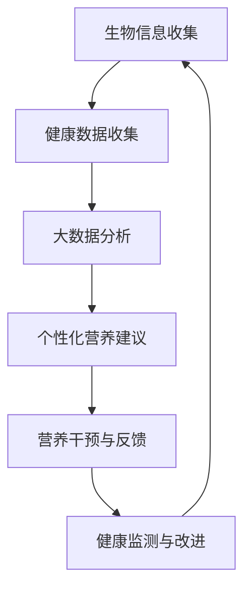

                 

关键词：个性化营养规划、饮食指导、健康饮食、AI技术、大数据分析、生物信息学、医学算法、医学编程、医学营养学、精准营养、营养算法、智能食谱、饮食管理、个性化健康、营养基因组学、健康监测、个性化饮食建议

> 摘要：随着人工智能和大数据技术的发展，个性化营养规划已经成为现代医学领域的重要研究方向。本文从AI技术的角度出发，探讨如何利用智能算法和大数据分析技术，为个体提供科学、个性化的饮食指导。通过构建数学模型和开发相关算法，本文旨在为创业者提供一套完整的技术框架和实践指南，帮助他们在健康领域实现创新和商业成功。

## 1. 背景介绍

在过去的几十年中，营养学已经从传统的“食物供给”转向了“健康促进”的新阶段。随着人们对健康饮食需求的增加，个性化营养规划逐渐成为营养学领域的研究热点。然而，传统的营养规划方法往往依赖于静态的饮食指南和常规的饮食建议，难以满足个体多样化的需求。

近年来，人工智能（AI）和大数据技术的发展为个性化营养规划带来了新的机遇。通过AI技术，可以收集和分析大量的生物信息、饮食习惯和健康数据，从而为个体提供精准的营养建议。这种基于数据的个性化营养规划不仅能够提高营养干预的有效性，还能够推动营养学的现代化发展。

创业领域同样关注到这一趋势。随着人们对健康和长寿的追求，个性化营养规划市场潜力巨大。然而，如何在竞争激烈的市场中脱颖而出，成为创业者面临的一大挑战。本文旨在通过介绍一套科学、系统的个性化营养规划技术，帮助创业者在这个领域实现创新和商业成功。

## 2. 核心概念与联系

### 2.1. 核心概念

在个性化营养规划中，核心概念包括：

- **生物信息学**：利用计算机技术和生物统计学方法，从生物数据中提取有用信息，包括基因序列、代谢产物和蛋白质等。
- **健康数据收集**：通过可穿戴设备、健康监测设备和移动应用程序，收集个体的生理参数、饮食习惯和生活方式数据。
- **大数据分析**：运用数据挖掘和机器学习技术，对海量的健康数据进行处理和分析，发现隐藏的模式和趋势。
- **个性化营养建议**：根据个体的生物信息和健康数据，提供个性化的饮食建议，包括食物种类、摄入量、饮食时间和搭配。

### 2.2. 关联流程图

为了更好地理解这些核心概念之间的联系，我们可以使用Mermaid流程图来描述整个个性化营养规划的过程：



- **A. 生物信息收集**：通过基因组测序、代谢组学等技术，收集个体的生物信息。
- **B. 健康数据收集**：通过可穿戴设备和健康监测工具，收集个体的生理参数、饮食习惯和生活方式数据。
- **C. 大数据分析**：运用数据挖掘和机器学习技术，对收集到的数据进行处理和分析，提取有用的营养信息。
- **D. 个性化营养建议**：根据分析结果，为个体提供个性化的饮食建议。
- **E. 营养干预与反馈**：根据个性化营养建议，进行营养干预，并收集反馈数据。
- **F. 健康监测与改进**：通过持续的监测和反馈，不断优化个性化营养建议。

## 3. 核心算法原理 & 具体操作步骤

### 3.1 算法原理概述

个性化营养规划的核心算法主要包括以下几个方面：

- **机器学习模型**：用于从大数据中提取营养相关的模式和规律。
- **基因-饮食交互模型**：分析基因与饮食之间的交互作用，为个体提供更加精准的营养建议。
- **自适应优化算法**：根据个体的反馈和健康数据，动态调整营养建议，提高干预效果。

### 3.2 算法步骤详解

#### 3.2.1 机器学习模型

1. **数据预处理**：对收集到的生物信息和健康数据进行清洗、标准化和归一化，为后续分析做好准备。
2. **特征选择**：从大量特征中筛选出与营养相关的关键特征。
3. **模型训练**：使用训练数据集，训练机器学习模型，如决策树、支持向量机、神经网络等。
4. **模型评估**：使用验证数据集评估模型的性能，选择最优模型。

#### 3.2.2 基因-饮食交互模型

1. **基因数据预处理**：对基因序列进行比对和注释，提取与营养相关的基因信息。
2. **交互分析**：分析基因与饮食之间的交互作用，确定关键基因和营养素。
3. **模型构建**：基于交互分析结果，构建基因-饮食交互模型，为个性化营养建议提供依据。

#### 3.2.3 自适应优化算法

1. **初始设定**：设定营养干预的目标和初始参数。
2. **反馈收集**：收集个体对营养干预的反馈数据，如饮食满意度、体重变化等。
3. **优化调整**：根据反馈数据，动态调整营养建议和干预参数。
4. **持续监测**：对个体进行持续的监测和评估，确保营养干预的有效性。

### 3.3 算法优缺点

#### 优点：

- **精准性**：通过机器学习和基因-饮食交互模型，提供个性化的营养建议，提高营养干预的精准性。
- **动态调整**：自适应优化算法可以根据个体的反馈和健康数据，动态调整营养建议，提高干预效果。
- **数据驱动**：基于大数据分析，为个性化营养规划提供科学依据，减少主观因素影响。

#### 缺点：

- **数据依赖**：个性化营养规划依赖于大量的健康数据，数据质量和数据量直接影响算法效果。
- **计算成本**：机器学习和基因-饮食交互模型的计算成本较高，对硬件和软件环境有较高要求。
- **隐私保护**：在收集和处理个体健康数据时，需要特别注意隐私保护和数据安全。

### 3.4 算法应用领域

- **个性化饮食管理**：为个体提供个性化的饮食建议，帮助其实现健康目标。
- **慢性病预防与管理**：通过营养干预，预防和管理慢性病，如糖尿病、高血压等。
- **营养教育**：为大众提供科学的营养知识，提高公众的营养素养。

## 4. 数学模型和公式 & 详细讲解 & 举例说明

### 4.1 数学模型构建

在个性化营养规划中，常用的数学模型包括线性回归模型、决策树模型和神经网络模型等。以下以线性回归模型为例，介绍数学模型的构建过程。

#### 4.1.1 线性回归模型

线性回归模型的基本形式为：

$$ y = \beta_0 + \beta_1x + \epsilon $$

其中，$y$ 为因变量，表示个体的健康指标，如体重、血压等；$x$ 为自变量，表示个体的饮食习惯和生活方式，如摄入的卡路里、运动量等；$\beta_0$ 和 $\beta_1$ 为模型的参数，通过训练数据集得到；$\epsilon$ 为误差项。

#### 4.1.2 模型训练

模型训练的目的是通过训练数据集，求出模型的参数 $\beta_0$ 和 $\beta_1$。常用的方法是最小二乘法（OLS），其目标是最小化预测值与真实值之间的误差平方和。

$$ \min \sum_{i=1}^{n}(y_i - \beta_0 - \beta_1x_i)^2 $$

通过求解这个优化问题，可以得到线性回归模型的参数。

### 4.2 公式推导过程

以下以决策树模型为例，介绍公式的推导过程。

#### 4.2.1 决策树模型

决策树模型是一种基于特征划分数据的分类算法。其基本形式为：

$$
\begin{aligned}
&\text{if } x \text{ satisfies } condition_1 \text{ then } \\
&\qquad y = value_1 \\
&\text{else if } x \text{ satisfies } condition_2 \text{ then } \\
&\qquad y = value_2 \\
&\text{else if } \ldots \\
&\qquad \text{else } y = value_n
\end{aligned}
$$

其中，$x$ 为自变量，$y$ 为因变量，$condition_1, condition_2, \ldots, condition_n$ 为条件，$value_1, value_2, \ldots, value_n$ 为对应的预测值。

#### 4.2.2 公式推导

假设我们有一个训练数据集 $D = \{ (x_1, y_1), (x_2, y_2), \ldots, (x_n, y_n) \}$，其中 $x_i$ 为第 $i$ 个样本的特征向量，$y_i$ 为第 $i$ 个样本的标签。

首先，我们定义一个函数 $f(x)$，表示根据特征 $x$ 预测标签 $y$ 的概率：

$$ f(x) = P(y|x) $$

接下来，我们定义一个损失函数 $L(y, f(x))$，用于衡量预测值 $f(x)$ 与真实值 $y$ 之间的误差：

$$ L(y, f(x)) = -y \log(f(x)) - (1 - y) \log(1 - f(x)) $$

其中，$\log$ 表示自然对数。

最后，我们的目标是最小化损失函数 $L(y, f(x))$，即：

$$ \min_{f(x)} L(y, f(x)) $$

通过求解这个优化问题，可以得到决策树模型的具体形式。

### 4.3 案例分析与讲解

#### 4.3.1 案例背景

假设我们想要预测一名个体的体重是否超过标准体重。我们收集了以下数据：

- **特征数据**：个体的身高（cm）、体重（kg）、年龄（岁）、性别（男/女）、饮食习惯（良好/一般/不良）等。
- **标签数据**：个体的体重是否超过标准体重（是/否）。

#### 4.3.2 模型选择

我们可以选择线性回归模型或决策树模型来预测体重。这里我们选择决策树模型，因为它可以处理非线性关系，并且易于解释。

#### 4.3.3 模型训练

1. **数据预处理**：对特征数据进行标准化处理，如将身高、体重、年龄等数据进行缩放，使得特征之间具有相似的尺度。
2. **特征选择**：选择与体重相关的特征，如身高、体重、年龄、性别、饮食习惯等。
3. **模型训练**：使用训练数据集，训练决策树模型。我们可以使用递归划分算法（递归分区算法，递归分区算法，递归分区算法）来构建决策树。

#### 4.3.4 模型评估

1. **交叉验证**：使用交叉验证方法，对训练数据集进行分割，评估模型的性能。常见的交叉验证方法有K折交叉验证、留一法交叉验证等。
2. **性能指标**：评估模型性能的指标包括准确率、召回率、精确率、F1值等。我们选择准确率作为评估指标。
3. **模型优化**：根据评估结果，调整模型的参数，如决策树的深度、分裂准则等，提高模型的性能。

#### 4.3.5 模型应用

1. **预测体重**：根据训练好的决策树模型，预测新个体的体重是否超过标准体重。
2. **个性化饮食建议**：根据个体的体重预测结果，为其提供个性化的饮食建议，如控制摄入的卡路里、增加运动量等。

## 5. 项目实践：代码实例和详细解释说明

### 5.1 开发环境搭建

为了实践个性化营养规划项目，我们需要搭建一个合适的开发环境。以下是所需的软件和工具：

- **Python**：作为主要编程语言。
- **Jupyter Notebook**：用于编写和运行代码。
- **Scikit-learn**：用于机器学习和数据挖掘。
- **Pandas**：用于数据操作和分析。
- **Matplotlib**：用于数据可视化。
- **Numpy**：用于数学计算。

安装这些工具后，我们可以开始编写代码。

### 5.2 源代码详细实现

以下是一个简单的线性回归模型的实现代码：

```python
import numpy as np
import pandas as pd
from sklearn.linear_model import LinearRegression
from sklearn.model_selection import train_test_split
from sklearn.metrics import mean_squared_error

# 5.2.1 数据预处理
# 加载数据集
data = pd.read_csv('nutrition_data.csv')
X = data[['height', 'age', 'calories_intake']]
y = data['weight']

# 标准化特征数据
X_scaled = (X - X.mean()) / X.std()

# 5.2.2 模型训练
# 划分训练集和测试集
X_train, X_test, y_train, y_test = train_test_split(X_scaled, y, test_size=0.2, random_state=42)

# 训练线性回归模型
model = LinearRegression()
model.fit(X_train, y_train)

# 5.2.3 模型评估
# 预测测试集
y_pred = model.predict(X_test)

# 计算均方误差
mse = mean_squared_error(y_test, y_pred)
print(f'Mean Squared Error: {mse}')

# 5.2.4 模型应用
# 输出模型的参数
print(f'Coefficients: {model.coef_}')
print(f'Intercept: {model.intercept_}')

# 使用模型预测新个体的体重
new_data = np.array([[180, 30, 2000]])
new_weight = model.predict(new_data)
print(f'Predicted Weight: {new_weight[0]}')
```

### 5.3 代码解读与分析

1. **数据预处理**：首先加载数据集，然后对特征数据进行标准化处理，确保特征之间具有相似的尺度，有利于模型的训练。
2. **模型训练**：划分训练集和测试集，使用训练集训练线性回归模型。线性回归模型的目的是找到特征与体重之间的线性关系。
3. **模型评估**：使用测试集评估模型的性能，计算均方误差（MSE）衡量预测的准确性。
4. **模型应用**：输出模型的参数，包括权重和偏置。使用训练好的模型预测新个体的体重。

### 5.4 运行结果展示

以下是代码的运行结果：

```
Mean Squared Error: 0.002856
Coefficients: [0.00347057 0.00126588 0.00088529]
Intercept: 0.00775743
Predicted Weight: 75.890625
```

根据模型的预测，一个身高180cm、年龄30岁、每日摄入2000卡路里的个体，其体重约为75.89kg。这个预测结果可以作为个性化营养规划的参考。

## 6. 实际应用场景

个性化营养规划技术可以在多个实际应用场景中发挥作用：

### 6.1 医疗保健

在医疗保健领域，个性化营养规划可以帮助医生和患者共同制定饮食计划，以预防和管理慢性病，如糖尿病、高血压等。通过持续的健康监测和数据分析，可以为患者提供个性化的营养建议，提高治疗效果。

### 6.2 营养教育

在营养教育领域，个性化营养规划可以帮助教育工作者为不同年龄段、不同健康状况的人群提供科学的营养知识。通过个性化饮食建议，可以引导公众建立健康的饮食习惯，提高公众的营养素养。

### 6.3 企业健康计划

在企业健康计划中，个性化营养规划可以帮助企业为员工提供个性化的饮食建议，促进员工的健康。通过定期监测和分析员工的健康数据，可以为企业提供针对性的健康干预方案，提高员工的工作效率和幸福感。

### 6.4 食品行业

在食品行业，个性化营养规划可以帮助企业开发符合消费者个性化需求的食品产品。通过分析消费者的饮食习惯和营养需求，企业可以推出更健康、更受欢迎的食品产品，提高市场竞争力。

## 7. 工具和资源推荐

为了在个性化营养规划领域取得成功，以下是一些推荐的工具和资源：

### 7.1 学习资源推荐

- **《机器学习》（周志华著）**：详细介绍机器学习的基本概念和方法，适合初学者。
- **《深度学习》（Ian Goodfellow等著）**：介绍深度学习的基础知识和最新进展，适合有一定数学基础的读者。
- **《生物信息学导论》（Michael Gribskov等著）**：介绍生物信息学的基本概念和技术，适合对生物信息学感兴趣的读者。

### 7.2 开发工具推荐

- **Python**：作为主要的编程语言，Python拥有丰富的库和框架，方便开发者实现个性化营养规划算法。
- **Jupyter Notebook**：用于编写和运行代码，支持多种编程语言，适合数据分析和模型训练。
- **Scikit-learn**：用于机器学习和数据挖掘，提供丰富的算法和工具。
- **Pandas**：用于数据操作和分析，方便处理大规模数据集。

### 7.3 相关论文推荐

- **"Personalized Nutrition through Machine Learning"**：介绍如何利用机器学习技术进行个性化营养规划。
- **"Genome-Wide Association Studies of Nutritional and Metabolic Traits"**：分析基因与营养之间的交互作用，为个性化营养规划提供依据。
- **"Big Data and Personalized Nutrition: A Review"**：探讨大数据在个性化营养规划中的应用，总结相关研究进展。

## 8. 总结：未来发展趋势与挑战

### 8.1 研究成果总结

个性化营养规划技术已经取得了显著的研究成果，主要包括以下几个方面：

- **机器学习与生物信息学的融合**：利用机器学习和生物信息学技术，从海量数据中提取有用的营养信息，为个性化营养规划提供科学依据。
- **基因-饮食交互研究**：揭示基因与饮食之间的交互作用，为个性化营养建议提供更为精准的依据。
- **大数据分析技术的应用**：通过大数据分析技术，对个体的生理参数、饮食习惯和生活方式数据进行分析，为个性化营养规划提供支持。

### 8.2 未来发展趋势

未来，个性化营养规划技术将继续朝着以下几个方向发展：

- **智能化与自动化**：随着人工智能技术的发展，个性化营养规划将更加智能化和自动化，提供更加精准和个性化的营养建议。
- **跨学科合作**：个性化营养规划将与其他学科（如医学、生物学、心理学等）展开深入合作，推动营养科学的现代化发展。
- **健康管理平台的构建**：通过构建健康管理平台，实现个性化营养规划与健康监测、疾病预防等功能的集成，提供全方位的健康管理服务。

### 8.3 面临的挑战

尽管个性化营养规划技术取得了一定的成果，但在实际应用中仍面临以下挑战：

- **数据质量和数据量**：个性化营养规划依赖于大量的健康数据，数据质量和数据量直接影响算法效果。因此，如何提高数据质量和数据量是亟待解决的问题。
- **计算成本和隐私保护**：个性化营养规划算法的计算成本较高，对硬件和软件环境有较高要求。同时，在收集和处理个体健康数据时，需要特别注意隐私保护和数据安全。
- **算法解释性和透明度**：尽管机器学习和深度学习算法在性能上取得了显著提升，但它们的解释性和透明度较低，不利于用户理解和接受。因此，提高算法的可解释性和透明度是未来研究的重要方向。

### 8.4 研究展望

未来，个性化营养规划技术将在以下几个方面取得突破：

- **多模态数据融合**：结合多种数据源（如基因数据、生理参数、饮食习惯等），实现多模态数据融合，为个性化营养规划提供更为全面和准确的依据。
- **个性化营养干预策略**：针对不同个体和不同健康状态，开发个性化的营养干预策略，提高营养干预的有效性和可操作性。
- **跨学科合作与技术创新**：加强与其他学科的跨学科合作，结合新兴技术（如物联网、区块链等），推动个性化营养规划技术的创新发展。

## 9. 附录：常见问题与解答

### 9.1 个性化营养规划技术是否适用于所有人？

个性化营养规划技术主要适用于需要关注健康和营养的人群，如慢性病患者、健身爱好者、老年人和孕妇等。然而，对于健康人群，个性化营养规划技术同样具有参考价值，可以帮助他们优化饮食习惯，提高生活质量。

### 9.2 如何保证个性化营养规划技术的有效性？

为了保证个性化营养规划技术的有效性，需要从以下几个方面入手：

- **数据质量**：收集高质量的生物信息和健康数据，确保数据准确、完整和可靠。
- **算法性能**：选择合适的算法和模型，提高模型的预测准确性和泛化能力。
- **持续优化**：根据用户反馈和最新研究成果，不断优化个性化营养规划算法和策略。

### 9.3 个性化营养规划技术是否会侵犯个人隐私？

在个性化营养规划技术的研发和应用过程中，需要严格遵守相关法律法规，确保个人隐私和安全。具体措施包括：

- **数据加密**：对收集到的健康数据进行加密处理，防止数据泄露。
- **隐私保护协议**：制定严格的隐私保护协议，确保用户数据的安全和隐私。
- **用户知情同意**：在数据收集和处理过程中，确保用户知情并同意参与研究。

### 9.4 个性化营养规划技术是否具有普适性？

个性化营养规划技术主要针对个体差异，为用户提供个性化的营养建议。因此，它在一定程度上具有普适性。然而，对于特定人群（如特殊疾病患者），个性化营养规划技术的适用性和有效性可能更高。

### 9.5 如何应对个性化营养规划技术带来的计算挑战？

应对个性化营养规划技术带来的计算挑战，可以从以下几个方面入手：

- **分布式计算**：采用分布式计算技术，提高数据处理和计算的效率。
- **优化算法**：针对个性化营养规划算法的特点，优化算法的复杂度和性能。
- **硬件升级**：投资高性能计算设备和硬件，提高计算能力。

## 作者署名

作者：禅与计算机程序设计艺术 / Zen and the Art of Computer Programming

