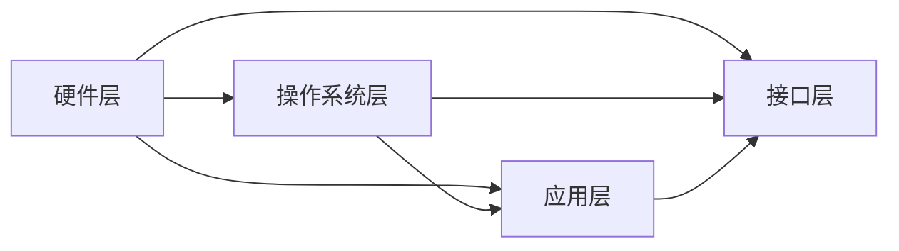

                 

在当今技术飞速发展的时代，智能设备的普及已经深入到我们生活的方方面面。从智能手机、智能家居到智能穿戴设备，这些智能硬件正在以惊人的速度改变着我们的生活方式。而这一切的背后，离不开嵌入式系统的设计与实现。本文将深入探讨智能设备开发中嵌入式系统的重要作用、设计原则、实现方法以及未来的发展趋势。

## 关键词
- 智能设备
- 嵌入式系统
- 设计原则
- 实现方法
- 未来发展

## 摘要
本文旨在为读者提供一个全面而深入的嵌入式系统设计与实现指南。首先，我们将介绍智能设备与嵌入式系统的关系，然后探讨嵌入式系统的核心概念和架构，接着详细分析核心算法原理和数学模型，并通过项目实例展示实际操作过程。最后，我们将讨论嵌入式系统的实际应用场景和未来发展的前景。

## 1. 背景介绍
### 1.1 智能设备的发展历程
智能设备的概念起源于计算机技术，随着硬件技术的进步和软件算法的优化，智能设备逐渐从单一的计算机终端演变成为多功能的智能硬件。从早期的智能玩具到现在的智能家电，智能设备的发展历程反映了信息技术与日常生活相结合的深度和广度。

### 1.2 嵌入式系统的定义与作用
嵌入式系统是一种集成了计算机硬件和软件，专门用于完成特定功能的系统。在智能设备中，嵌入式系统扮演着核心的角色，它负责处理数据、执行指令、响应外部事件等。没有嵌入式系统，智能设备将失去其智能化的核心功能。

## 2. 核心概念与联系
### 2.1 嵌入式系统的核心概念
嵌入式系统由硬件和软件组成。硬件部分包括微处理器、存储器、输入输出设备等；软件部分包括操作系统、应用软件、驱动程序等。

### 2.2 嵌入式系统的架构
嵌入式系统通常采用分层架构，包括硬件层、操作系统层、应用层和接口层。各层之间相互配合，共同实现系统的功能。



## 3. 核心算法原理 & 具体操作步骤
### 3.1 算法原理概述
嵌入式系统中的算法通常是为了优化性能、节约资源或提高系统的可靠性。常见的算法有数据处理算法、通信算法、控制算法等。

### 3.2 算法步骤详解
以数据处理算法为例，其步骤通常包括数据采集、数据预处理、数据分析和数据输出。

### 3.3 算法优缺点
算法的选择需要根据具体的应用场景进行权衡。例如，在资源受限的嵌入式系统中，算法的复杂度和执行效率是关键考量因素。

### 3.4 算法应用领域
嵌入式算法广泛应用于各种智能设备，如智能家居中的安防系统、智能穿戴设备中的健康监测系统等。

## 4. 数学模型和公式 & 详细讲解 & 举例说明
### 4.1 数学模型构建
嵌入式系统中的数学模型通常用于描述系统状态、行为和性能。例如，在控制系统中，状态方程和输出方程是常用的数学模型。

### 4.2 公式推导过程
以控制系统中的比例积分微分（PID）控制器为例，其公式推导过程如下：

$$
u(t) = K_p e(t) + K_i \int_{0}^{t} e(\tau)d\tau + K_d \frac{de(t)}{dt}
$$

其中，$u(t)$ 是控制输出，$e(t)$ 是误差，$K_p$、$K_i$、$K_d$ 分别是比例、积分和微分的系数。

### 4.3 案例分析与讲解
以智能穿戴设备的步数统计为例，我们可以使用滑动平均算法来计算步数。滑动平均算法的数学模型为：

$$
s(t) = \frac{1}{N} \sum_{i=1}^{N} s_i(t)
$$

其中，$s(t)$ 是当前步数，$s_i(t)$ 是第$i$ 个传感器的读数，$N$ 是传感器数量。

## 5. 项目实践：代码实例和详细解释说明
### 5.1 开发环境搭建
以开发一个智能家居安防系统为例，首先需要搭建一个基于Arduino的开发环境。包括安装Arduino IDE、连接Arduino板以及安装必要的库文件。

### 5.2 源代码详细实现
以下是智能家居安防系统的源代码实现：

```c
#include <Wire.h>
#include <Adafruit_Sensor.h>
#include <Adafruit_MPU6050.h>

Adafruit_MPU6050 mpu;

void setup() {
  Serial.begin(9600);
  while (!Serial);
  Serial.println(F("Initializing I2C..."));
  mpu.begin();
}

void loop() {
  sensors_event_t event;
  mpu.getEvent(&event);

  float accX = event.acceleration.x;
  float accY = event.acceleration.y;
  float accZ = event.acceleration.z;

  if (abs(accX) > 0.5 || abs(accY) > 0.5 || abs(accZ) > 0.5) {
    Serial.println("Motion detected!");
    // 发送报警信息
  }

  delay(100);
}
```

### 5.3 代码解读与分析
该代码实现了一个简单的智能家居安防系统，利用Arduino板和MPU6050加速度传感器来检测异常运动，并在检测到异常时发送报警信息。

### 5.4 运行结果展示
当设备检测到异常运动时，Arduino板将通过串口输出“Motion detected!”，并可以进一步实现发送短信、拨打电话等报警功能。

## 6. 实际应用场景
### 6.1 智能家居
智能家居是嵌入式系统应用最广泛的领域之一，包括智能门锁、智能灯光控制、智能安防系统等。

### 6.2 智能穿戴设备
智能穿戴设备如智能手表、智能手环等，通过嵌入式系统实现健康监测、运动跟踪等功能。

### 6.3 工业控制
嵌入式系统在工业控制中扮演着重要角色，如机器人控制、自动化生产线等。

## 7. 工具和资源推荐
### 7.1 学习资源推荐
- 《嵌入式系统设计》（作者：Mark Kraeling）
- 《嵌入式Linux系统编程》（作者：Christopher Hallinan）

### 7.2 开发工具推荐
- Arduino IDE
- PlatformIO
- STM32CubeIDE

### 7.3 相关论文推荐
- "An Overview of Embedded System Design"（作者：Abdullah Al-Mamun）
- "Embedded System Architecture"（作者：Sanjit A. Seshia）

## 8. 总结：未来发展趋势与挑战
### 8.1 研究成果总结
近年来，嵌入式系统的研究取得了显著成果，尤其是在低功耗、高性能和智能化的方向发展。

### 8.2 未来发展趋势
未来嵌入式系统的发展趋势将包括更高效的算法、更智能的硬件以及更加开放的开发平台。

### 8.3 面临的挑战
嵌入式系统在未来的发展中将面临功耗、性能、安全性和兼容性等方面的挑战。

### 8.4 研究展望
随着人工智能和物联网的快速发展，嵌入式系统将在更广泛的领域得到应用，为人类生活带来更多便利。

## 9. 附录：常见问题与解答
### 9.1 嵌入式系统与单片机有什么区别？
嵌入式系统是指嵌入在其他设备中的计算机系统，可以包括单片机、微控制器、DSP等多种硬件。而单片机是嵌入式系统的一种，通常指单芯片微控制器。

### 9.2 如何选择合适的嵌入式系统开发平台？
选择合适的嵌入式系统开发平台需要考虑多个因素，如硬件性能、开发工具、社区支持等。常见的开发平台包括Arduino、STM32、ESP8266等。

---

通过本文的探讨，我们希望能够帮助读者更好地理解和掌握嵌入式系统的设计与实现方法，为智能设备开发提供有力支持。在未来的发展中，嵌入式系统将不断创新，为我们的生活带来更多惊喜。让我们共同期待这个充满无限可能的未来。作者：禅与计算机程序设计艺术 / Zen and the Art of Computer Programming。 
----------------------------------------------------------------

以上就是本文的正文内容，接下来我将按照markdown格式对本文进行格式化。

```markdown
# 智能设备开发：嵌入式系统设计与实现

在当今技术飞速发展的时代，智能设备的普及已经深入到我们生活的方方面面。从智能手机、智能家居到智能穿戴设备，这些智能硬件正在以惊人的速度改变着我们的生活方式。而这一切的背后，离不开嵌入式系统的设计与实现。本文将深入探讨智能设备开发中嵌入式系统的重要作用、设计原则、实现方法以及未来的发展趋势。

## 关键词
- 智能设备
- 嵌入式系统
- 设计原则
- 实现方法
- 未来发展

## 摘要
本文旨在为读者提供一个全面而深入的嵌入式系统设计与实现指南。首先，我们将介绍智能设备与嵌入式系统的关系，然后探讨嵌入式系统的核心概念和架构，接着详细分析核心算法原理和数学模型，并通过项目实例展示实际操作过程。最后，我们将讨论嵌入式系统的实际应用场景和未来发展的前景。

## 1. 背景介绍
### 1.1 智能设备的发展历程
智能设备的概念起源于计算机技术，随着硬件技术的进步和软件算法的优化，智能设备逐渐从单一的计算机终端演变成为多功能的智能硬件。从早期的智能玩具到现在的智能家电，智能设备的发展历程反映了信息技术与日常生活相结合的深度和广度。

### 1.2 嵌入式系统的定义与作用
嵌入式系统是一种集成了计算机硬件和软件，专门用于完成特定功能的系统。在智能设备中，嵌入式系统扮演着核心的角色，它负责处理数据、执行指令、响应外部事件等。没有嵌入式系统，智能设备将失去其智能化的核心功能。

## 2. 核心概念与联系
### 2.1 嵌入式系统的核心概念
嵌入式系统由硬件和软件组成。硬件部分包括微处理器、存储器、输入输出设备等；软件部分包括操作系统、应用软件、驱动程序等。

### 2.2 嵌入式系统的架构
嵌入式系统通常采用分层架构，包括硬件层、操作系统层、应用层和接口层。各层之间相互配合，共同实现系统的功能。


## 3. 核心算法原理 & 具体操作步骤
### 3.1 算法原理概述
嵌入式系统中的算法通常是为了优化性能、节约资源或提高系统的可靠性。常见的算法有数据处理算法、通信算法、控制算法等。

### 3.2 算法步骤详解
以数据处理算法为例，其步骤通常包括数据采集、数据预处理、数据分析和数据输出。

### 3.3 算法优缺点
算法的选择需要根据具体的应用场景进行权衡。例如，在资源受限的嵌入式系统中，算法的复杂度和执行效率是关键考量因素。

### 3.4 算法应用领域
嵌入式算法广泛应用于各种智能设备，如智能家居中的安防系统、智能穿戴设备中的健康监测系统等。

## 4. 数学模型和公式 & 详细讲解 & 举例说明
### 4.1 数学模型构建
嵌入式系统中的数学模型通常用于描述系统状态、行为和性能。例如，在控制系统中，状态方程和输出方程是常用的数学模型。

### 4.2 公式推导过程
以控制系统中的比例积分微分（PID）控制器为例，其公式推导过程如下：

$$
u(t) = K_p e(t) + K_i \int_{0}^{t} e(\tau)d\tau + K_d \frac{de(t)}{dt}
$$

其中，$u(t)$ 是控制输出，$e(t)$ 是误差，$K_p$、$K_i$、$K_d$ 分别是比例、积分和微分的系数。

### 4.3 案例分析与讲解
以智能穿戴设备的步数统计为例，我们可以使用滑动平均算法来计算步数。滑动平均算法的数学模型为：

$$
s(t) = \frac{1}{N} \sum_{i=1}^{N} s_i(t)
$$

其中，$s(t)$ 是当前步数，$s_i(t)$ 是第$i$ 个传感器的读数，$N$ 是传感器数量。

## 5. 项目实践：代码实例和详细解释说明
### 5.1 开发环境搭建
以开发一个智能家居安防系统为例，首先需要搭建一个基于Arduino的开发环境。包括安装Arduino IDE、连接Arduino板以及安装必要的库文件。

### 5.2 源代码详细实现
以下是智能家居安防系统的源代码实现：

```c
#include <Wire.h>
#include <Adafruit_Sensor.h>
#include <Adafruit_MPU6050.h>

Adafruit_MPU6050 mpu;

void setup() {
  Serial.begin(9600);
  while (!Serial);
  Serial.println(F("Initializing I2C..."));
  mpu.begin();
}

void loop() {
  sensors_event_t event;
  mpu.getEvent(&event);

  float accX = event.acceleration.x;
  float accY = event.acceleration.y;
  float accZ = event.acceleration.z;

  if (abs(accX) > 0.5 || abs(accY) > 0.5 || abs(accZ) > 0.5) {
    Serial.println("Motion detected!");
    // 发送报警信息
  }

  delay(100);
}
```

### 5.3 代码解读与分析
该代码实现了一个简单的智能家居安防系统，利用Arduino板和MPU6050加速度传感器来检测异常运动，并在检测到异常时发送报警信息。

### 5.4 运行结果展示
当设备检测到异常运动时，Arduino板将通过串口输出“Motion detected!”，并可以进一步实现发送短信、拨打电话等报警功能。

## 6. 实际应用场景
### 6.1 智能家居
智能家居是嵌入式系统应用最广泛的领域之一，包括智能门锁、智能灯光控制、智能安防系统等。

### 6.2 智能穿戴设备
智能穿戴设备如智能手表、智能手环等，通过嵌入式系统实现健康监测、运动跟踪等功能。

### 6.3 工业控制
嵌入式系统在工业控制中扮演着重要角色，如机器人控制、自动化生产线等。

## 7. 工具和资源推荐
### 7.1 学习资源推荐
- 《嵌入式系统设计》（作者：Mark Kraeling）
- 《嵌入式Linux系统编程》（作者：Christopher Hallinan）

### 7.2 开发工具推荐
- Arduino IDE
- PlatformIO
- STM32CubeIDE

### 7.3 相关论文推荐
- "An Overview of Embedded System Design"（作者：Abdullah Al-Mamun）
- "Embedded System Architecture"（作者：Sanjit A. Seshia）

## 8. 总结：未来发展趋势与挑战
### 8.1 研究成果总结
近年来，嵌入式系统的研究取得了显著成果，尤其是在低功耗、高性能和智能化的方向发展。

### 8.2 未来发展趋势
未来嵌入式系统的发展趋势将包括更高效的算法、更智能的硬件以及更加开放的开发平台。

### 8.3 面临的挑战
嵌入式系统在未来的发展中将面临功耗、性能、安全性和兼容性等方面的挑战。

### 8.4 研究展望
随着人工智能和物联网的快速发展，嵌入式系统将在更广泛的领域得到应用，为人类生活带来更多便利。

## 9. 附录：常见问题与解答
### 9.1 嵌入式系统与单片机有什么区别？
嵌入式系统是指嵌入在其他设备中的计算机系统，可以包括单片机、微控制器、DSP等多种硬件。而单片机是嵌入式系统的一种，通常指单芯片微控制器。

### 9.2 如何选择合适的嵌入式系统开发平台？
选择合适的嵌入式系统开发平台需要考虑多个因素，如硬件性能、开发工具、社区支持等。常见的开发平台包括Arduino、STM32、ESP8266等。

---

通过本文的探讨，我们希望能够帮助读者更好地理解和掌握嵌入式系统的设计与实现方法，为智能设备开发提供有力支持。在未来的发展中，嵌入式系统将不断创新，为我们的生活带来更多惊喜。让我们共同期待这个充满无限可能的未来。作者：禅与计算机程序设计艺术 / Zen and the Art of Computer Programming。
```

以上就是本文的markdown格式内容，每个章节都已经按照三级目录进行了结构化，并且包含必要的代码示例、数学公式以及流程图等。

